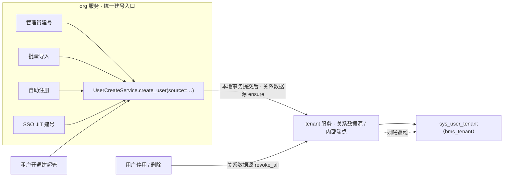
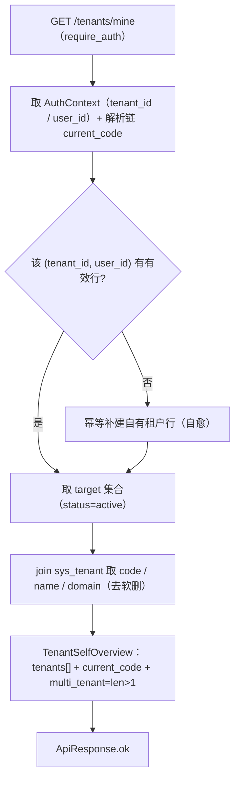

# 01 详细设计 · 用户↔租户关系与租户自助真实化

> 认证与安全 · 11 租户自助与用户租户关系 · 子任务 01（需求 11-1，补充需求）· 详细设计（**2026-10-04 决策确认定稿**，18 项口径见 §14）

[文档首页](../../../../../../文档首页.md) › [11 租户自助与用户租户关系](../../11_租户自助与用户租户关系.md) › [01 用户↔租户关系与租户自助真实化](../11_租户自助与用户租户关系_01_用户租户关系与租户自助真实化.md) › 详细设计　|　[需求域 11 →](../../../../需求/11_需求_租户自助与用户租户关系.md)　[认证与安全计划 →](../../../../计划/01_计划_认证与安全.md)

## 1. 依据与范围 

**依据**：[需求 11-1](../../../../需求/11_需求_租户自助与用户租户关系.md#r11-1)、[需求 05-6](../../../../需求/05_需求_登录前端.md#r05-6)、[需求 10-1](../../../../需求/10_需求_租户标识内部化.md#r10-1)；《[架构设计 · 多租户路由](../../../../../../设计/架构设计/12_架构设计_子系统_多租户路由.md)》「租户自助」节、《[架构设计 · 认证与会话](../../../../../../设计/架构设计/14_架构设计_子系统_认证与会话.md)》、《[架构设计 · 数据架构](../../../../../../设计/架构设计/07_架构设计_数据架构.md)》；《[数据库开发规范](../../../../../../规范/数据库开发规范.md)》《[后端开发规范](../../../../../../规范/后端开发规范.md)》《[安全开发规范](../../../../../../规范/安全开发规范.md)》《[测试规范](../../../../../../规范/测试规范.md)》《[文档生成规范](../../../../../../规范/文档生成规范.md)》《[AI开发规范](../../../../../../规范/AI开发规范.md)》。

**冻结口径（2026-10-04 拍板，不再讨论）**：关系表落 tenant 服务平台库 `bms_tenant`（与 `sys_tenant` 同库）；跨租户「同一用户」标识＝组合键 `(租户, 用户)`，`username` 仅租户内唯一、跨租户**不假设同人**、不引入平台级账号 ID；关系表**只服务登录后**的 `my_tenants` / `switch`，**禁止**用于登录前按账号反查（《安全开发规范》§3 禁止项）；写入路径全量覆盖；租户位存**雪花 `tenant_id`**、对外契约仍用 `code`；关系表不含角色权限（RBAC 不在本任务）、不落 PII。

**范围**（对应任务内容 1~8）：

1. **数据模型**：新增用户↔租户可达关系表（平台库 `bms_tenant`），按《数据库开发规范》「变更传导」先改表文件 → 模型 → 迁移 → 状态两处回写；
2. **写入路径全量覆盖**：以「统一建号入口 + 关系写入契约（关系数据源）」承接全部建号 / 回收路径，已存在路径本期接线，未实现功能登记接入点；
3. **读路径真实化**：`my_tenants` / `switch` 由 Null 占位换真实实现，`switch` 做**越权校验**（目标租户必须 ∈ 当前用户可访问集合）；
4. **契约与门禁**：能力域契约签名扩展、内部读写端点进公开契约快照与 `@bms/api-types` 生成类型，四道契约门禁 + 数据库一致性校验全绿；
5. **用例与核对**：覆盖单 / 多租户、越权拒绝、各写入路径建立 / 回收、免认证链路无账号反查、防漂移巡检；新增 / 变更模块覆盖率达标。

**不在范围**：RBAC / 角色与权限（归阶段七）；租户邀请加入 / 跨租户协作业务（本期只留数据承载与写入契约）；租户切换的前端 UI（归前端全页面阶段）；注册能力本体（后端 `POST /auth/register` + 注册开关 + 邮箱短信验证，另行立项）；登录页 `20007` 语义（归 `05_06`）；品牌来源真实化（`brand` 不在本条，保持现状）。

## 2. 现状事实（已探查，勿重复摸索） 

| # | 事实 | 落点 |
| --- | --- | --- |
| 1 | `sys_tenant` / `sys_tenant_database` 在 tenant 服务平台库 `bms_tenant`；仓储只有 `by_code` / `by_domain` / `by_id` / `db_basis` / `create` / `update_status`，**无全量枚举** | `services/tenant/src/bms_tenant/models/`、`repositories/tenant_registry.py` |
| 2 | 租户源 `LocalTenantSource` 由 **tenant 服务在本服务模块导入期**经**服务级注册表**登记（`register_local_tenant_source()`）；装配 `build_tenant_lookup(...)` 在基座 `create()`；`[tenant].source` 空串＝自动（租户服务 `local`、其余服务 `remote`） | `services/tenant/src/bms_tenant/sources/tenant_source.py`、`libs/bms_core/src/bms_core/db/tenant_source.py`、`db/tenant_remote.py`、`application.py` |
| 3 | `sys_user` / `sys_account_lock` 在 org 服务**每租户一份**库 `bms_org_{code}`；`username` 唯一仅为 `(username, deleted_at)` 租户内；`sys_user` **无 `code` 列**（仅 `id` 雪花 + `username`） | `services/org/src/bms_org/models/user.py` |
| 4 | org 现有唯一建号入口 `UserCreateService.create_user`（JIT 语义、占位口令 `!sso`），内部端点 `POST /api/v1/org/internal/users/create`（`require_service("identity")`）；**无**管理员建号 / 批量导入 / 自助注册 / 停用 / 删除代码 | `services/org/src/bms_org/services/users.py`、`api/internal_users.py` |
| 5 | SSO JIT 建号在 identity 服务编排：调 org `create_user` 后同事务写发件箱 `identity.user.jit_created` | `services/identity/src/bms_identity/services/jit.py`、`org_client.py` |
| 6 | 平台库**无账号索引**；唯一全局身份表 `sys_user_identity`（identity 平台库 `bms_platform`）只映射 **SSO 外部身份 →（租户, 用户）** | `设计/数据库设计/数据表设计/sys_user_identity.md` |
| 7 | **无用户↔租户关系表**；`my_tenants` / `switch` / `brand` 契约已交付、实现为 Null 占位 | `libs/bms_core/src/bms_core/tenant/base.py`、`tenant/null.py` |
| 8 | 能力域 provider 由插件注册表解析（`settings.tenant_self_service.provider`，空串→`null`）；插件登记点是基座 `register_platform_plugins(settings, app, resources)`，且 `build_plugin_registry()` **早于** `configure_service()` → **服务侧无法在 `configure_service` 登记插件** | `libs/bms_core/src/bms_core/core/assembly.py`、`application.py` |
| 9 | 事件**消费**基座（`EventConsumer`）为占位，真实消费实现随阶段十 → 本期**不可用**事件驱动消费；跨服务机制现成可用者仅 **`BaseServiceClient`（HTTP 服务调用）** | `libs/bms_core/src/bms_core/events/base.py`、`core/servicecall/base.py` |
| 10 | 错误码单一登记点 `ErrorCode(IntEnum)`；租户段现有 `TENANT_NOT_FOUND=80001` / `TENANT_SUSPENDED=80002`，段内当前最大 `80113` | `libs/bms_core/src/bms_core/core/error_codes.py`、`core/exceptions.py` |
| 11 | 公开契约快照 `deploy/contracts/{service}.json` + `baseline/`；前端类型由 `@bms/api-types` 生成；迁移零漂移门禁 `compare_metadata`；表归属单一来源 `TABLE_OWNERSHIP` | `services/service_contract.py`、`ops/contract_snapshot.py`、`frontend/packages/api-types/`、`libs/bms_core/src/bms_core/services/table_registry.py` |
| 12 | `tenant:platform` 迁移链 head＝`0005_sys_outbox_tenant_bigint` | `backend/alembic/versions/tenant/platform/` |
| 13 | **租户源范式（本任务照抄的范式）**：共享基座持**契约（`TenantLookup` Protocol）**+ **服务级注册表**（`register_tenant_lookup` / `build_tenant_lookup`，空名自动选源）+ **远端实现**（`RemoteTenantSource`，模块导入即登记）；服务侧持**本地实现**（`LocalTenantSource`，导入期登记）；装配点 `create()` 落 `app.state` | `libs/bms_core/src/bms_core/db/tenant_source.py`、`tenant_remote.py`、`services/tenant/src/bms_tenant/sources/` |

**结论**：本条要补的是**数据承载（关系表）+ 读路径真实化 + 写入统一契约**；「六条写入路径」中目前**仅 SSO JIT 一条真实存在**，其余功能本体尚未立项（详见 §5.2 与 §14-2）。

## 3. 交付物清单 

| # | 交付物 | 落点 |
| --- | --- | --- |
| 1 | 数据表文件 `sys_user_tenant.md` + 《数据库设计总览》登记 + 表清单总表一行 | `设计/数据库设计/数据表设计/`、`设计/数据库设计/01_数据库设计_总览.md` |
| 2 | ORM 模型 `SysUserTenant` + 模型模块登记 | `services/tenant/src/bms_tenant/models/user_tenant.py`、`models/__init__.py` |
| 3 | 关系仓储 + 关系维护服务 | `services/tenant/src/bms_tenant/repositories/tenant_membership.py`、`services/tenant/src/bms_tenant/services/membership.py` |
| 4 | 关系数据源**契约 + 注册表 + 远端实现**（照抄租户源范式） | `libs/bms_core/src/bms_core/tenant/membership.py`、`tenant/membership_remote.py` |
| 5 | 关系数据源**本地实现**（读自身平台服务库） | `services/tenant/src/bms_tenant/sources/membership.py` |
| 6 | 内部读写端点（资源式：GET / POST / DELETE） | `services/tenant/src/bms_tenant/api/membership.py` |
| 7 | 真实自助编排实现（`my_tenants` / `switch`）+ 能力域契约签名扩展 | `libs/bms_core/src/bms_core/tenant/db.py`、`tenant/base.py`、`tenant/null.py` |
| 8 | 基座装配接线（关系数据源构建 + provider 登记 + 配置段） | `libs/bms_core/src/bms_core/application.py`、`core/assembly.py`、`core/config.py` |
| 9 | 写入接线：统一建号入口 `source` + 提交后写关系 | `services/org/src/bms_org/services/users.py`（+ 依赖出口） |
| 10 | 错误码新增 + 异常类 | `libs/bms_core/src/bms_core/core/error_codes.py`、`core/exceptions.py` |
| 11 | 迁移（`tenant:platform` 链新头）+ 表归属登记 | `backend/alembic/versions/tenant/platform/0006_*.py`、`services/table_registry.py` |
| 12 | 契约快照 / baseline / `@bms/api-types` 重生成 | `deploy/contracts/`、`frontend/packages/api-types/` |
| 13 | 测试用例（含 Kiwi 编号）与覆盖率留证 | 本目录 `测试/01_测试_01_用户租户关系与租户自助真实化.md` |
| 14 | 实施记录 | 本目录 `实施/01_实施_01_用户租户关系与租户自助真实化.md` |

## 4. 数据模型设计 

**表**：`sys_user_tenant`（用户↔租户可达关系）。**字段级结构唯一事实源**＝新建表文件 `设计/数据库设计/数据表设计/sys_user_tenant.md`（本任务新建，随实施落盘；本设计**不复制字段清单**，只定口径）。

**语义**：一行 = 「**某租户（`tenant_id`，用户归属租户）内的某用户（`user_id`）可访问目标租户（`target_tenant_id`）**」。每个用户**恒有**一行指向其归属租户自身（`target_tenant_id = tenant_id`，即「自有租户」），其余行表示被额外授予 / 加入的租户。

**关键口径**：

- **组合键**：`(tenant_id, user_id)`＝跨租户「同一用户」标识的落库形态（对外不暴露平台级账号 ID）；`user_id` 为 org 服务 `sys_user.id`（雪花、跨服务逻辑外键、只持值）。
- **租户位内部化**：`tenant_id` / `target_tenant_id` 均存**雪花 `tenant_id`**（BIGINT），同库逻辑外键 → `sys_tenant.id`；对外契约仍以 `code` 表达（§7）。
- **唯一约束**：`(tenant_id, user_id, target_tenant_id, deleted_at)` 复合唯一（软删后可重挂）；其前缀 `(tenant_id, user_id)` 即读路径主查询路径，**不另建冗余索引**（每表索引 ≤ 5，见《数据库开发规范》§4）。
- **`source`（写入来源）**：取值集合 `TENANT_MEMBERSHIP_SOURCES = ("super_admin", "admin_create", "import", "sso_jit", "self_register")`，与 §5.2 六条路径一一对应；记录**写入时点**的来源。
- **`status`**：`TENANT_MEMBERSHIP_STATUSES = ("active", "disabled")`；**回收置 `disabled`**（保留行、可再启），彻底移除才软删；读路径只取 `status='active'` 且 `deleted_at IS NULL`。
- **公共字段**：继承 ORM 模型基类（雪花 ID / 审计四字段 / 软删除 / 乐观锁）；**不落 PII**（无口令、邮箱、手机号、姓名）。
- **不含角色 / 权限**：RBAC 归属不在本表。

**迁移**：随 `tenant:platform` 链（`alembic/versions/tenant/platform/0006_*`，`down_revision=0005_sys_outbox_tenant_bigint`）；表归属登记 `owner="tenant"`、`datasource=platform`、`status=enabled`（进链）；SQLite 开发库由启动期按链表集自动建表。

## 5. 写入路径与一致性口径 

### 5.1 关系数据源（沿用「租户源」范式，决策 §14-4）

关系表的**唯一写方＝tenant 服务**（表归属）；跨服务访问经**关系数据源**抽象：

| 层 | 落点 | 内容 |
| --- | --- | --- |
| 契约 | `bms_core/tenant/membership.py` | `TenantMembershipStore`（Protocol）：`list_targets(*, tenant_id, user_id)` / `ensure(*, tenant_id, user_id, target_tenant_id, source)` / `revoke(*, tenant_id, user_id, target_tenant_id)` / `revoke_all(*, tenant_id, user_id)`；数据契约 `TenantMembershipTarget`（`tenant_id` / `code` / `name` / `domain` / `source` / `status`）；内部端点请求 / 响应契约同处 |
| 注册表 | `bms_core/tenant/membership.py` | `register_tenant_membership_store(name, factory)` / `build_tenant_membership_store(name, *, settings, registry, session_factory, service_client)`；常量 `LOCAL_TENANT_MEMBERSHIP_STORE="local"` / `REMOTE_…="remote"` / `DEFAULT_…="remote"`；**空名自动**（租户服务 `local` / 其余服务 `remote`，判据同租户源） |
| 远端实现 | `bms_core/tenant/membership_remote.py` | `RemoteTenantMembershipStore`（经 `BaseServiceClient` 调 tenant 内部端点）；模块导入即登记 |
| 本地实现 | `services/tenant/src/bms_tenant/sources/membership.py` | `LocalTenantMembershipStore`（持 `EngineRegistry` + `SessionFactory`，`session_scope(db_key=PLATFORM_DB_KEY)`，`BaseFrameworkObject` 直承体系根）；经 `register_local_tenant_membership_store()` 在 `bms_tenant/main.py` 导入期登记 |
| 装配 | `bms_core/application.py::create()` | `register_remote_tenant_membership_store()` + `app.state.tenant_membership = build_tenant_membership_store(settings.tenant_membership.source, …)` |
| 配置 | `bms_core/core/config.py` | 新增 `TenantMembershipSettings.source: str = ""`（段 `[tenant_membership]`；空串＝自动） |

**写核心**：`TenantMembershipService`（tenant 服务，`BaseFrameworkObject`）在**单次事务**内按唯一键 upsert（`ensure`）/ 置 `disabled`（`revoke` / `revoke_all`），幂等；读（`list_targets`，含 `include_disabled`）与**对账巡检**（`reconcile`）也在本服务；本地实现与内部端点均委托它。

- `list_targets` 增可选 `include_disabled`（决策 §14-22）：读路径自愈以「自有租户行是否存在（含 `disabled`）」为判据（GET 端点同名 query）；
- `reconcile(*, tenant_id, user_ids) -> TenantMembershipReport`（决策 §14-1 / §14-7）：按调用方给定的用户清单比对关系表，输出**缺行**（清单中无自有租户关系）与**悬空行**（关系表有行但不在清单内）；只读、不落库——后续定时调度器（拉取 org 用户清单）归阶段八，本期以用例形态交付。

### 5.2 写入落点（六条路径 → 统一契约）

| # | 写入路径 | 本期落点 | 状态 |
| --- | --- | --- | --- |
| 1 | SSO JIT 建号 | identity 编排 → org `create_user`（`source=sso_jit`）→ 提交后经关系数据源 `ensure` 自有租户关系 | 本期接线（已存在） |
| 2 | 管理员建号 | 未来经 org 统一建号入口（`source=admin_create`）→ 同一出口 | **登记接入点**（功能未立项） |
| 3 | 批量导入 | 未来经 org 统一建号入口（`source=import`）→ 同一出口 | **登记接入点** |
| 4 | 自助注册 | 未来经 org 统一建号入口（`source=self_register`）→ 同一出口 | **登记接入点** |
| 5 | 租户开通建超管 | 未来开通编排（tenant 服务**同库直写**，`source=super_admin`；超管用户建号仍经 org） | **登记接入点** |
| 6 | 用户停用 / 删除 | 未来 org 停用 / 删除方法提交后经关系数据源 `revoke_all`（置 `disabled`） | **登记接入点** |

> 口径：**建号类路径统一收敛到 org `UserCreateService.create_user` 这一入口**——功能落地时只需传不同 `source`，**无需再改关系写入代码**；这是「全量覆盖」的可落地形态（其余路径功能本体未实现，无法在本任务内接线，见 §14-2）。

### 5.3 一致性口径（决策 §14-1）

- **跨服务无法同事务**（用户表在 org 每租户库、关系表在 tenant 平台库）：采用 **「本地事务提交后同步服务调用 + 幂等 upsert + 读路径自愈 + 对账巡检」**；写入出口是关系数据源，**后续切换为事件通道时出口不变**；
- **降级纪律**：关系写入失败**不得阻断建号**（JIT 失败会阻断首登）——失败记 WARNING 并交巡检补齐；
- **防漂移**：① 幂等 upsert（唯一键命中即复用 / 复活，天然去重）；② **读路径自愈**——`my_tenants` 与 `switch`（**共用同一出口**）若在该 `(tenant_id, user_id)` 上查无有效行，则按当前租户**幂等补建自有行**（保证「可登录用户恒可自见其归属租户」）；自愈**只补自有租户行**，故不构成越权放宽；③ **对账巡检**：按租户枚举用户清单与关系表比对，输出缺行 / 悬空行（§10）；
- **禁止**：关系表参与免认证链路（§6.3）；任何「按账号查租户归属」的实现。

## 6. 读路径与越权校验 

### 6.1 身份获取（能力域契约签名扩展，决策 §14-3）

`my_tenants` / `switch` 需知「当前登录用户」，而能力域契约现只收 `current_code`（且契约明示「不读请求上下文」）。故**显式扩展抽象方法签名**，由路由从 `AuthContext` 取值传入：

| 方法 | 现签名 | 新签名 |
| --- | --- | --- |
| `my_tenants` | `(*, current_code=None)` | `(*, current_code=None, tenant_id=None, user_id=None)` |
| `switch` | `(code)` | `(code, *, tenant_id=None, user_id=None)` |

- `tenant_id`＝当前解析链租户主键（`current_tenant_id_of(tenant)`，即用户**归属租户**）、`user_id`＝`AuthContext.user_id`；
- 新增参数**可选 + 默认 None**（向后兼容）；`NullTenantSelfService` 同步签名（占位语义不变）；契约版本按「新增可选参数＝向后兼容」**不升**（§7）。

### 6.2 读流程

- 编排实现 `DbTenantSelfService`（决策 §14-4 衍生，落 `bms_core/tenant/db.py`）经 `app.state.tenant_membership` 取关系、经 `app.state.tenant_source.by_id` 补租户元信息；
- `my_tenants`：返回可访问租户列表（`TenantSummary`：`id`=租户主键字符串、`name`、`code`；`logo` / `role_name` 留空——品牌归品牌来源、角色归 RBAC）+ `current_code` + `multi_tenant`；
- `switch(code)`：`by_code` 命中 → **读路径自愈**（与 `my_tenants` 共用出口，见下）→ 校验**目标 ∈ 当前用户可访问集合且 `status=active`** → 返回生效语义（决策 §14-8：`applied=true`、`mode="token"`、`reissue_token=true`、`token=None`，令牌重发归认证阶段）；未先经 `/tenants/mine` 的用户**直切自有租户亦可命中**，切他人租户仍被拒（自愈只补自有租户行）；
- **解析链优先级不变**：本出口不参与解析、不读请求上下文；`switch` 不改变请求解析链。

### 6.3 免认证链路纪律（强制）

- `/tenants/mine`、`/tenants/switch` 维持 `require_auth`；`/tenants/brand` 维持免登录（**只读租户品牌、不涉及关系表**）；
- 关系表**不得**出现在任何免认证链路（登录前不查关系表、不按账号反查租户归属）——《安全开发规范》§3 禁止项，落**护栏用例**断言（§10）。

### 6.4 越权与错误分支

| 分支 | 处理 |
| --- | --- |
| 目标租户不存在（`by_code` 未命中 / 已软删） | `TenantNotFoundError`（`80001` / 404，既有） |
| 目标租户停用 / 过期 | `TenantSuspendedError`（`80002` / 403，既有） |
| 目标租户**不在**当前用户可访问集合 | **新增** `TenantAccessDeniedError`（`80003` / 403） |
| 未登录 / 会话失效 | `require_auth` 既有语义（`20001` / `20012`，401） |
| 切换编码为空 | 契约校验参数错误（`10001`，既有） |

## 7. 契约变更 

- **能力域契约（内部端口）**：`BaseTenantSelfService.my_tenants` / `switch` 增可选入参（向后兼容），`NullTenantSelfService` 同步；`TenantSelfOverview` / `TenantSummary` / `TenantSwitchResult` 字段**不变**；
- **公开响应契约（OpenAPI）**：`/tenants/mine`、`/tenants/switch` **字段无增删**（语义由占位换真实——`id` 真实为租户主键、`db_key` 按 `db_basis` 派生）；**新增内部端点**（tenant 服务，资源式，决策 §14-16 / §14-17）：

| 方法与路径 | 用途 | 鉴权（决策 §14-10 / §14-17） |
| --- | --- | --- |
| `GET /api/v1/tenant/internal/memberships?owner_tenant_id=&user_id=`（+ 可选 `include_disabled`） | 读某用户可访问目标租户集合 | `require_service("org", "identity")` |
| `POST /api/v1/tenant/internal/memberships` | 建立 / 复活关系（body 显式 `owner_tenant_id` / `user_id` / `target_tenant_id` / `source`，决策 §14-18） | 同上 |
| `DELETE /api/v1/tenant/internal/memberships?owner_tenant_id=&user_id=&target_tenant_id=` | 回收（置 `disabled`；省略 `target_tenant_id` 则回收该用户全部） | 同上 |

- **产物重生成**：`deploy/contracts/tenant.json` + `baseline/tenant.json` 重生成；`@bms/api-types` 重生成（`api-types:gen`）；
- **服务契约版本（决策 §14-9）**：新增路由 / 新增可选入参属**向后兼容增量**，`CONTRACT_VERSION` **不升**（保持 `0.1.0`，`sys_module.contract_version` 无需同步）。

## 8. 代码落点与装配 

| # | 落点（新增 N / 变更 M） | 说明 |
| --- | --- | --- |
| 1 | N `libs/bms_core/src/bms_core/tenant/membership.py` | 关系数据源契约 `TenantMembershipStore` + 数据契约 `TenantMembershipTarget` / `TenantMembershipListResponse` / `TenantMembershipGrantRequest` / **`TenantMembershipReport`（对账巡检结果）** + 注册表 `register_tenant_membership_store` / `build_tenant_membership_store` + 常量 + 内部端点请求 / 响应契约 |
| 2 | N `libs/bms_core/src/bms_core/tenant/membership_remote.py` | `RemoteTenantMembershipStore`（`BaseServiceClient`）+ `register_remote_tenant_membership_store()`（模块导入即登记） |
| 3 | N `libs/bms_core/src/bms_core/tenant/db.py` | `DbTenantSelfService(BaseTenantSelfService)`（编排：`app.state.tenant_membership` + `app.state.tenant_source`）+ 工厂 `DbTenantSelfServiceFactory` + `register_db_tenant_self_service(app)`（登记 / 按应用刷新工厂绑定，决策 §14-25） |
| 4 | M `libs/bms_core/src/bms_core/tenant/base.py` | 契约方法签名扩展；`TENANT_MEMBERSHIP_SOURCES`（含 `self_heal`）/ `TENANT_MEMBERSHIP_SELF_HEAL_SOURCE` / `TENANT_MEMBERSHIP_STATUSES` 常量；provider 名常量（`sql`） |
| 5 | M `libs/bms_core/src/bms_core/tenant/null.py` | 占位签名同步（占位语义不变） |
| 6 | M `libs/bms_core/src/bms_core/core/assembly.py` | 工厂登记迁出（改由 `application.py` 按应用登记 / 刷新，避免插件注册表**按进程单次登记**导致多应用进程串绑，决策 §14-25） |
| 7 | M `libs/bms_core/src/bms_core/core/config.py` | 新增 `TenantMembershipSettings`（`source: str = ""`）+ `Settings.tenant_membership` |
| 8 | M `libs/bms_core/src/bms_core/application.py` | `create()`：`register_db_tenant_self_service(app)`（登记 / 刷新租户自助真实实现工厂）+ `app.state.tenant_membership = build_tenant_membership_store(settings.tenant_membership.source, …)` |
| 8b | M `libs/bms_core/src/bms_core/api/deps.py` | `get_tenant_membership_store(request)` 依赖出口（与 `get_tenant_source` 同处；`api/` 不受「提供者须经 `resolve_plugin`」护栏约束） |
| 9 | M `libs/bms_core/src/bms_core/core/error_codes.py` / `core/exceptions.py` | `TENANT_ACCESS_DENIED = 80003` + `TenantAccessDeniedError` |
| 10 | N `services/tenant/src/bms_tenant/models/user_tenant.py` | `SysUserTenant(BaseModel)`；登记进 `models/__init__.py::MODEL_MODULES` |
| 11 | N `services/tenant/src/bms_tenant/repositories/tenant_membership.py` | 关系仓储：`list_active_targets(tenant_id, user_id)`（join `sys_tenant`）、`ensure(...)`、`revoke(...)`、`revoke_all(...)` |
| 12 | N `services/tenant/src/bms_tenant/services/membership.py` | `TenantMembershipService(BaseFrameworkObject)`：事务边界内幂等 upsert / 回收 + 读（含 `include_disabled`）+ `reconcile` 对账巡检 |
| 13 | N `services/tenant/src/bms_tenant/sources/membership.py` | `LocalTenantMembershipStore` + `register_local_tenant_membership_store()` |
| 14 | N `services/tenant/src/bms_tenant/api/membership.py` | 内部端点（`BaseRouter` + `require_service("org","identity")`）：GET（含 `include_disabled`）/ POST / DELETE；统一返回 `TenantMembershipListResponse` |
| 15 | M `services/tenant/src/bms_tenant/main.py` | `register_local_tenant_membership_store()`（导入期登记）；`prepare_settings` 置 `settings.tenant_self_service.provider = "sql"`（仅本服务，判据取工厂声明的 `service_name`） |
| 16 | M `services/tenant/src/bms_tenant/api/tenant.py` | `/mine`、`/switch` 注入 `AuthContext` 并把 `tenant_id` / `user_id` 传入能力域 |
| 17 | M `services/org/src/bms_org/services/users.py` | 统一建号入口加 `source`（默认 `sso_jit`）；提交后经关系数据源 `ensure`（失败不阻断） |
| 18 | M `services/org/src/bms_org/api/internal_users.py` | 建号端点透传 `source`；依赖出口取关系数据源 |
| 19 | N `backend/alembic/versions/tenant/platform/0006_sys_user_tenant.py` | 建表迁移（链新头；revision 标识 ≤ 32 字符） |
| 20 | M `libs/bms_core/src/bms_core/services/table_registry.py` | `TableRecord("sys_user_tenant", owner="tenant", datasource=PLATFORM, status=ENABLED)` |

> 装配顺序（关键）：`prepare_settings`（置 provider）→ `register_platform_plugins`（登记 provider 工厂）→ `build_plugin_registry()` → `create()` 构建 `app.state.tenant_membership` → lifespan `assemble_plugins`（实例化 `DbTenantSelfService`，此时 `app.state.tenant_membership` 已就绪）。

## 9. 数据库设计变更顺序（强制，见《数据库开发规范》§2） 

1. **先改表文件**：新建 `数据表设计/sys_user_tenant.md`（五节齐全 + 变更记录 v1）；
2. **再登记**：《数据库设计总览》「已设计数据表登记」加行（状态与表文件一致，迁移落地后为 `已落库`）+ §6.1 平台库表清单加行；
3. **再改 ORM 模型**：`SysUserTenant` + `MODEL_MODULES` 登记 + 表归属登记 `TABLE_OWNERSHIP`；
4. **再生成迁移**：`alembic -n alembic:tenant:platform revision --autogenerate`（链新头），核对零漂移（`compare_metadata`）；
5. **最后两处状态回写**：表文件状态 ↔ 总览登记状态一致；
6. 实施记录登记核对结论与偏差归口。

## 10. 测试设计与验收映射 

**执行口径**（2026-09-27 拍板沿用）：**只跑受变更影响的定向用例**，不跑全量后端 `pytest`、不跑前端全量；全量 / 集成交 CI 按需触发。

| # | 用例组 | 关键断言 | 验收映射（需求 11-1） |
| --- | --- | --- | --- |
| 1 | 表与模型一致性 | 表文件 ↔ 模型元数据 ↔ 总览登记一致；迁移零漂移（`compare_metadata`） | 内容 1 / 7；完成标准「数据库一致性校验全绿」 |
| 2 | 单 / 多租户 `my_tenants` | 单租户 `multi_tenant=false`；多租户列出全部可访问租户且 `multi_tenant=true`；`current_code` 透传；品牌 / 角色字段留空 | 内容 4；完成标准「多租户用户能列出…」 |
| 3 | `switch` 命中与越权拒绝 | 可访问目标 → 成功（`db_key` 按 `db_basis`、`reissue_token=true`）；不可访问目标 → `80003` / 403；目标不存在 → `80001`；目标停用 → `80002`；**未先经 `my_tenants` 直切自有租户 → 自愈命中**（切他人租户仍拒） | 内容 4；完成标准「`switch` 仅对可访问租户生效、越权目标被拒」 |
| 4 | 关系数据源（本地 / 远端） | `ensure` 幂等（重复调用不产生重复行）；`revoke` / `revoke_all` 置 `disabled` 且幂等；`list_targets` 只返回 `active`；远端实现经 `BaseServiceClient` 契约往返（替身客户端） | 内容 3；完成标准「各写入路径均能建立关系」 |
| 5 | 各写入路径建立关系 | 统一建号入口（`source`）→ 关系落库；**JIT 路径端到端**（identity → org → tenant）建立自有行；`source` 落库为传入值 | 内容 3；完成标准「各写入路径均能建立关系」 |
| 6 | 停用 / 删除回收 | `revoke_all` 后 `my_tenants` 不再列出 / `switch` 被拒；可再启 | 内容 3；完成标准「回收关系」 |
| 7 | 读路径自愈 | 无有效行时 `my_tenants` / `switch`（共用出口）幂等补建自有行并可重复调用；未先经 `my_tenants` 直切自有租户命中、切他人租户仍拒 | 内容 3（防漂移） |
| 8 | 对账巡检（防漂移） | 按租户用户清单 ↔ 关系表比对：正常无差异；构造缺行 / 悬空行可被检出 | 内容 3；完成标准「无长期漂移」 |
| 9 | 免认证链路无账号反查（护栏） | 关系表 / 关系数据源**不被**免认证端点引用；登录前链路不出现关系表查询（源码 / 路由级护栏断言） | 内容 6；完成标准「登录前链路无任何账号反查请求」 |
| 10 | 内部端点鉴权 | 非白名单服务调用 → 401；`org` / `identity` 调用放行；body / query 校验失败 → `10001` | 内容 7 |
| 11 | 契约与边界 | 公开契约快照零漂移、`api-types` 零漂移、路由覆盖护栏、`/tenants/*` 鉴权口径（`mine` / `switch` 登录、`brand` 免登录） | 内容 7 |

**Kiwi 用例（决策 §14-10）**：按「先登记平台取得编号、再回填代码标注」执行；本任务用例编号**待平台登记后回填**（本设计暂标「待登记」，回填后同步测试记录）。

**覆盖率口径（决策 §14-11）**：**新增 / 变更模块行覆盖率 100%**（`bms_tenant` 关系模型 / 仓储 / 服务 / 数据源 / 路由、`bms_core.tenant`（含 `membership` / `membership_remote` / `db`）、`bms_org` 建号改动）；本地按**受影响定向**统计留证，全量门槛交 CI 兜底。

## 11. 门禁与回归矩阵 

| # | 门禁 | 命令（`backend/` 下 `uv run`；脚本在 bms 仓根） | 通过判据 |
| --- | --- | --- | --- |
| 1 | 定向用例 | `uv run pytest services/tenant/tests services/org/tests libs/bms_core/tests/tenant -q`（+ 受影响 `bms_core` 用例） | 0 failed |
| 2 | 静态检查 | `uv run ruff check .` + `uv run ruff format --check .` | 全通过 |
| 3 | 类型检查 | `uv run pyright` | 0 errors |
| 4 | 基座校验 | `check-base.py` / `check-backend-base.py`（迁移链 / 错误码 / 继承链）/ `check-service-boundaries.py` / `check-bare-collections.py` | 0 问题 |
| 5 | 文档校验 | `check-links.py` / `check-status.py --stage 06_认证与安全 --strict` / `check-docs-scope.py` | 0 违规 |
| 6 | 契约快照 | `ops.contract_snapshot check` / `ops.check_contracts` / `api-types:gen:check` | 零漂移 |
| 7 | 数据库一致性 | `ops/check_tables.py`（模型表必登记 / enabled 表必入链）+ `compare_metadata` | 0 问题 |
| 8 | 预检 | `python3 scripts/tools/preflight/check-preflight.py --fast`（bms 仓根） | 全部通过 |

## 12. 登记落点 

| 内容 | 落点 |
| --- | --- |
| 表文件 + 状态 | `设计/数据库设计/数据表设计/sys_user_tenant.md`；《数据库设计总览》「已设计数据表登记」+ §6.1 表清单 |
| 表归属登记 | `libs/bms_core/src/bms_core/services/table_registry.py::TABLE_OWNERSHIP`（`sys_table_ownership` 种子随 `ops/seed_tables.py`） |
| 错误码 | `libs/bms_core/src/bms_core/core/error_codes.py`（新增 `80003`）+ `core/exceptions.py` |
| 能力域契约（内部端口）与关系数据源契约 | `libs/bms_core/src/bms_core/tenant/base.py`、`tenant/membership.py`；实现侧命名与装配见本设计 §8 与《[后端基类清单](../../../../../../后端基类清单.md)》（如涉及新基类 / 体系根时补登） |
| 契约快照 / 前端类型 | `deploy/contracts/tenant.json` + `baseline/`、`frontend/packages/api-types/src/tenant.ts` |
| 用例编号 | Kiwi TCMS（新登记）+ 本目录 `测试/` 记录 |
| 进度（状态 / 完成日期） | [认证与安全计划](../../../../计划/01_计划_认证与安全.md)（唯一落点） |
| 实施 / 测试记录 | 本目录 `实施/`、`测试/` |
| 未实现写入路径的接入点 | 本设计 §5.2 + 计划 §7 后续阶段待办（归对应功能任务） |

## 13. 边界与开放项 

- **不实现的写入路径**：管理员建号 / 批量导入 / 自助注册 / 停用删除 / 租户开通建超管的本体功能**不在本任务**（未立项）；本任务交付「关系数据源（读写契约 + 本地 / 远端实现）+ 统一建号入口接线 + 对账巡检」，其接入点已登记（§5.2）；
- **登录前链路**：不新增任何租户归属查询；登录页 `20007` 语义归 `05_06`；
- **令牌换发**：`switch` 的令牌重发归认证阶段（§14-8）；
- **品牌**：`brand` 维持现状（Null 占位），品牌来源真实化归品牌来源 / 租户管理阶段；`DbTenantSelfService.brand` 亦维持平台默认（本任务不动品牌取数）；
- **RBAC**：关系表不含角色 / 权限；`TenantSummary.role_name` 留空，归阶段七；
- **事件驱动**：本期不做（消费基座为占位，归阶段十）；后续切换为事件通道时**写入出口（关系数据源）不变**，仅换远端实现；
- **对账巡检的调度**：定时化（Celery）归阶段八；本期以用例 / 运维脚本形态交付；
- **软删与唯一约束的达梦差异**：复合唯一含 `deleted_at` 在达梦下「NULL 相等」语义差异按既有方言口径处理（详见《数据库设计 · 方言特性》达梦文档），本期沿用既有结论、不新增方言分支。

**开放项（实施期登记）**：

- **对账巡检调度**：`reconcile` 为**只读服务原语**（调用方提供用户清单）；拉取 org 用户清单 + 定时化（Celery）归阶段八。
- **实现偏差**：关系维护服务基类、依赖出口落点、工厂登记方式见 §15 第 8 项（已回写）。

**已闭环（2026-10-04 补正）**：

- **`switch` 自愈边界**：原开放项「读路径自愈仅在 `my_tenants` 触发」经确认后**本轮补齐**——`switch` 与 `my_tenants` 共用读路径自愈出口；未先经 `/tenants/mine` 的用户直切自有租户命中，切他人租户仍按越权拒（403 / 80003）；自愈只补自有租户行，**不构成越权放宽**。用例见 §10 第 3 / 7 项。

## 14. 决策确认结果（2026-10-04 逐项确认，共 18 项） 

| # | 事项 | 确认结论 |
| --- | --- | --- |
| 1 | 写入一致性口径 | **本地事务提交后同步服务调用 + 幂等 upsert + 读路径自愈 + 对账巡检**（事件驱动归阶段十；交叉切换通道时写入出口不变） |
| 2 | 写入路径范围 | **统一建号入口（org `create_user` + `source`）+ 已存在路径（JIT）接线 + 未实现功能登记接入点** |
| 3 | 读路径身份获取 | **扩展能力域契约签名**（`my_tenants` / `switch` 增可选 `tenant_id` / `user_id`），路由从 `AuthContext` 传入 |
| 4 | 真实 provider 登记落点 | **新增「关系数据源」服务级注册表（与租户源同构）+ 远端实现**（本地实现落 tenant 服务、编排实现落 bms_core，见 #17） |
| 5 | 表名 / 用户标识列 | 表 **`sys_user_tenant`**；列 `tenant_id` + `user_id` + `target_tenant_id` |
| 6 | `source` / `status` 取值 | `source`＝`super_admin` / `admin_create` / `import` / `sso_jit` / `self_register`；回收 **`status=disabled`**（保留行、可再启），彻底移除才软删 |
| 7 | 越权错误码 | **新增 `TENANT_ACCESS_DENIED = 80003`（403）** + `TenantAccessDeniedError` |
| 8 | `switch` 生效语义 | **只校验 + 返回生效语义**：`applied=true`、`mode="token"`、`reissue_token=true`、`token=None`（令牌换发归认证阶段） |
| 9 | 契约版本 | **不升**，保持 `CONTRACT_VERSION=0.1.0` |
| 10 | Kiwi 用例编号 | **先到平台登记取得编号，再回填代码标注**（本设计暂标「待登记」） |
| 11 | 覆盖率口径 | **新增 / 变更模块行覆盖率 100%**；本地按受影响定向统计留证、全量交 CI |
| 12 | 任务文档「五处 / 六条」 | **以需求 11-1 六条为准，回写任务文档为六条** |
| 13 | 关系数据源配置 | **`[tenant_membership].source` 空串自动**（租户服务 `local` / 其余 `remote`），与 `[tenant].source` 同口径 |
| 14 | 内部端点形态 | **资源式**：`GET` / `POST` / `DELETE /api/v1/tenant/internal/memberships` |
| 15 | 内部端点鉴权 | **`require_service("org", "identity")`** |
| 16 | 内部读端点 | **补 `GET /api/v1/tenant/internal/memberships`**（读写对称，远端实现完整） |
| 17 | 编排实现落点 | **`DbTenantSelfService` 落 `bms_core/tenant/db.py`**（经关系数据源 + 租户源取数），与租户源范式同构 |
| 18 | 归属租户取数 | **请求体显式传入 `owner_tenant_id`**（全字段显式；未来跨租户邀请无需改契约） |
| 19 | 自愈补建行来源 | **新增第 6 个来源取值 `self_heal`**（兜底自愈可审计、与业务来源区分） |
| 20 | 自愈与回收的冲突消解 | **仅当「自有租户行不存在（无行或已软删）」时补建**；存在（含 `disabled`）则不自愈——回收优先 |
| 21 | 内部端点响应形态 | **三方法统一返回 `TenantMembershipListResponse`**（操作后该用户有效目标集合） |
| 22 | 自愈判据 | **`list_targets` 增可选 `include_disabled`**（GET 端点同名 query，判据显式、`ensure` 语义不变） |
| 23 | org `create_user` 的 `source` | **可选参数、缺省 `sso_jit`**（identity 侧不改，契约向后兼容） |
| 24 | org 侧接线落点 | **服务层**（`UserCreateService` 可选注入关系数据源，缺省 None 不影响既有用例） |
| 25 | 真实实现工厂登记方式 | **工厂由 `application.create()` 按应用登记 / 刷新绑定**（插件注册表按进程单次登记工厂、工厂捕获首个应用会串绑；生产单进程单应用语义等价） |

## 15. 对齐记录 

| # | 事项 | 结论 |
| --- | --- | --- |
| 1 | 设计定稿 | 2026-10-04 逐项确认 18 项（§14），设计据此定稿 |
| 2 | 表结构变更顺序 | 表文件 → 模型 → 迁移 → 状态两处回写（§9） |
| 3 | 范式沿用 | 关系数据源照抄租户源范式（契约 + 服务级注册表 + 本地 / 远端实现 + `create()` 装配） |
| 4 | 任务文档回写 | 任务文档 §2.3 / §3「五处 / 五条」改「六条」；**域任务文档**风险节「五处」改「六处」并补「用户停用删除」（决策 §14-12；需求 11-1 正文原即六条，无需改） |
| 5 | 不与既有口径冲突 | 未发现与规范 / 架构定稿口径冲突；「跨服务无法同事务」已以「同步调用 + 自愈 + 巡检」化解 |
| 6 | 用例编号 | 待平台登记后回填（§10） |
| 7 | 决策补充 | 实施期新增 7 项（§14-19 ~ §14-25）逐项确认后落地 |
| 8 | 实现偏差（已回写） | ① 关系维护服务基类由 `BaseService[SysUserTenant]` 改 `BaseFrameworkObject`（`BaseService` 要求 `BaseRepository[T]`，而关系仓储直承体系根，与 org `UserProfileService` 同口径）；② 依赖出口落 `bms_core/api/deps.py`（`api/` 不受「提供者须经 `resolve_plugin`」护栏约束，与 `get_tenant_source` 同处）；③ 对账巡检以**服务原语 `reconcile` + 用例**交付（定时调度归阶段八） |
| 9 | 未覆盖项（已闭环） | 原开放项「`switch` 未先经 `my_tenants` 时未接线用户被拒（403）」**已闭环（2026-10-04 补正）**：`switch` 与 `my_tenants` 共用读路径自愈出口；直切自有租户命中、切他人租户仍拒（自愈只补自有行）——见 §13「已闭环」 |
| 10 | 用例与覆盖率 | 新增 / 变更模块行覆盖率 **100%**（实测：`bms_core.tenant.{membership,membership_remote,db}` + `bms_tenant.{models.user_tenant,repositories.tenant_membership,services.membership,sources.membership,api.membership}` + `bms_org.services.users`，合计 459 语句 0 未覆盖） |

> 依《[文档生成规范](../../../../../../规范/文档生成规范.md)》编写
