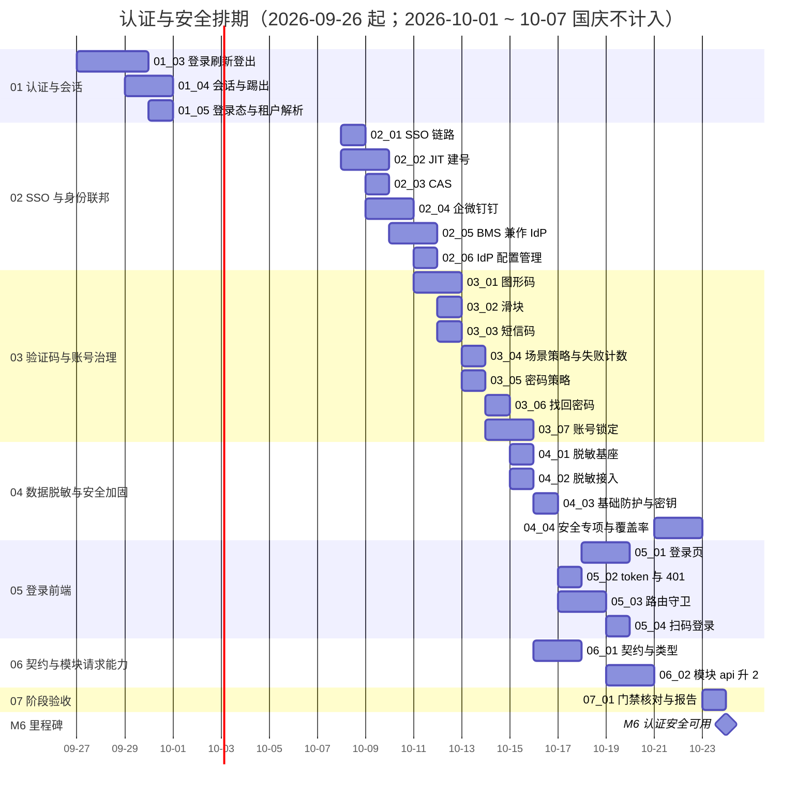

# 认证与安全计划

> BMS 基础管理系统 · 阶段六（认证与安全 / M6 认证安全可用）排期计划：**已完成 4 项，剩余 25 项**（域 01 认证与会话 5 项 / 80h、域 02 SSO 与身份联邦 6 项 / 90h、域 03 验证码与账号治理 7 项 / 68h、域 04 数据脱敏与安全加固 4 项 / 34h、域 05 登录前端 4 项 / 40h、域 06 契约与模块请求能力 2 项 / 18h、域 07 阶段验收 1 项 / 8h，合计 29 项 / **338h**；已完成 68h，剩余 270h）

[文档首页](../../../文档首页.md) › 认证与安全计划　|　[任务基线 →](../任务/01_认证与会话/01_认证与会话.md)　[需求基线 →](../需求/00_需求_认证与安全.md)

## 1. 计划说明 

- **排期对象**：阶段六 29 条需求、29 个子任务（域 01 认证与会话 5 / 域 02 SSO 与身份联邦 6 / 域 03 验证码与账号治理 7 / 域 04 数据脱敏与安全加固 4 / 域 05 登录前端 4 / 域 06 契约与模块请求能力 2 / 域 07 阶段验收 1），任务基线见[域 01](../任务/01_认证与会话/01_认证与会话.md)、[域 02](../任务/02_SSO与身份联邦/02_SSO与身份联邦.md)、[域 03](../任务/03_验证码与账号治理/03_验证码与账号治理.md)、[域 04](../任务/04_数据脱敏与安全加固/04_数据脱敏与安全加固.md)、[域 05](../任务/05_登录前端/05_登录前端.md)、[域 06](../任务/06_契约与模块请求能力/06_契约与模块请求能力.md)、[域 07](../任务/07_阶段验收/07_阶段验收.md)。
- **执行序（承前启后）**：`01_01 安全原语` → `01_02 令牌自签与校验源切换` → `01_03 登录 / 刷新 / 登出链路` → `01_04 会话管理与踢出` → `01_05 登录态依赖与租户解析` → `02_01 SSO 链路` → `02_02 JIT 建号` → `02_03 CAS` → `02_04 企微 / 钉钉` → `02_05 BMS 兼作 IdP` → `02_06 IdP 配置管理` → `03_01` ~ `03_07 验证码与账号治理`（图形 → 滑块 → 短信 → 场景策略 → 密码策略 → 找回密码 → 账号锁定）→ `04_01` ~ `04_03 脱敏与基础防护` → `06_01 认证契约与类型生成` → `05_02 token / 401` → `05_03 路由守卫` → `05_01 登录页` → `05_04 扫码登录` → `06_02 模块请求能力 api` → `04_04 安全专项与覆盖率` → `07_01 阶段验收`（收口）。
- **承接口径**：阶段二已交付服务化认证地基——网关 forward-auth 与身份头契约、OIDC 客户端与 JWKS 验签、服务 JWT 自签与统一校验（双类 JWT）、边缘信任与请求净化、验证码 / 密码策略 / 脱敏 / 会话存储基座占位；前端已交付服务段寻址 / 能力源分流 / 契约类型生成 / 请求层 token 与 401 钩子 / 守卫骨架（默认关闭）。本阶段在其上**接线与真实化**，不重复建设基座。
- **已定口径（2026-09-26 拍板）**：用户 JWT 由 BMS 自签、网关校验源切 identity JWKS；`sys_user` 最小模型落 org 服务（identity 经服务间契约调凭据接口）；BMS 兼作 IdP 交内核 + `sys_client` 最小接口（页面归阶段十）；SSO 四协议实现（OIDC 真联调 / CAS mock 联调 / 企微钉钉适配 + 单测，真实凭据与移动端内嵌留阶段十七）；踢出按 HTTP + Redis 即时拦截（广播占位归阶段八）；密码哈希 PBKDF2；Redis 故障验证码 fail-closed、限流 memory 降级；登录日志本期不落表（归阶段八）；账号锁定后端全做（页面归阶段七）；找回密码流程本期 + 通道占位；脱敏规则 + 序列化 / 日志 / 导出接入（`data:plain` RBAC 前一律掩码）；模块 `api` 契约版本升 2 本期交付；滑块服务端合成出图不下发坐标；`[security]` 配置本期定稿；启动时需求提出清单见 [README「启动时需求提出清单（转需求映射）」](../README.md#intake)。
- **排期口径**：自 2026-09-26 起串行排期（单人兼职，沿用《总体项目规划》阶段六 4 周基线，累计 30 周）；按 8h/日折算，2026-10-01 ~ 2026-10-07（国庆）不计入；窗口为估算基线，可按实际滚动调整并记录调整原因。
- **工时**：已完成 68h；剩余 270h；阶段合计 **338h**（域 01 80h = 12+16+24+16+12；域 02 90h = 16+12+12+14+24+12；域 03 68h = 8+10+8+10+10+10+12；域 04 34h = 12+8+6+8；域 05 40h = 14+12+6+8；域 06 18h = 6+12；域 07 8h）。任务级工时随详细设计重估并同步回写。
- **里程碑锚点**：M6 = **认证安全可用**（《总体项目规划》「里程碑」节），门禁见[本计划 §5 M6 验收门禁](#accept)。
- **负责人**：minjian（兼职，单人）。

## 2. 已完成任务（2026-09-26 起） 

| 编号 | 任务 | 工时（重估） | 完成日期 | 任务文件 | 偏差与遗留 |
| --- | --- | --- | --- | --- | --- |
| 01_01 | 安全原语真实实现与配置定稿（PBKDF2 / 令牌编解码 / 会话黑名单） | 12h | 2026-09-26 | [01_01](../任务/01_认证与会话/01_认证与会话_01_安全原语真实实现与配置定稿/01_认证与会话_01_安全原语真实实现与配置定稿.md) | 偏差：迭代次数配置落 `[password_hasher].options.iterations`、`[security].keys` 空允许装配但使用时 fail-closed（设计已回写）；遗留：Kiwi 33 停用标记（计划 §7 第 13 项）、生产密钥分发（运维阶段） |
| 01_02 | 用户令牌自签与网关校验源切换 | 16h | 2026-09-26 | [01_02](../任务/01_认证与会话/01_认证与会话_02_用户令牌自签与网关校验源切换/01_认证与会话_02_用户令牌自签与网关校验源切换.md) | 偏差：无（JWKS 端点描述更新与 01_01 遗留 `pbkdf2.py` 格式随门禁处理，见实施记录 §4）；遗留：登录 / 刷新 / 登出（01_03 / 01_04）、`require_auth`（01_05）、SSO 复用（02_05）、生产密钥治理（运维阶段） |
| 01_03 | 本地登录 / 刷新 / 登出链路 | 24h | 2026-09-26 | [01_03](../任务/01_认证与会话/01_认证与会话_03_本地登录刷新登出链路/01_认证与会话_03_本地登录刷新登出链路.md) | 偏差：会话错误码由概要 14 的 `20001~20006` 避让至 `20011~20016`（登录类占 `20002~20004`，已回写）；遗留：会话管理 / 踢出（01_04）、`require_auth`（01_05）、验证码强制与锁定管理（域三）、`sys_login_log`（阶段八） |
| 01_04 | 会话管理与强制踢出 | 16h | 2026-09-26 | [01_04](../任务/01_认证与会话/01_认证与会话_04_会话管理与强制踢出/01_认证与会话_04_会话管理与强制踢出.md) | 偏差：概要 14 §5 幂等口径改 `revoked_at` 语义（Idempotency-Key 归后续）、`max_active` 落 `[session]` 配置（sys_config 覆盖归后续）、测试落点改 `tests/auth/`（已回写）；遗留：真机冒烟（01_05 / 部署窗口）、RBAC 权限与 `20014`/`20016` 判定（阶段七）、操作日志与真实 Socket.IO 广播（阶段八）、踢出限流（阶段七）、会话管理页面（阶段十五）、批量撤销接口（03_06） |

## 3. 剩余任务排期（自 2026-09-26） 

| 编号 | 任务 | 工时 | 依赖 | 排期窗口 | 备注 | 偏差与遗留 |
| --- | --- | --- | --- | --- | --- | --- |
| 01_05 | 登录态依赖真实化与租户解析接线 | 12h | 01_03 / 阶段二 05-02 | 2026-09-30 | `require_auth` 真实化 | 无 || 02_01 | SSO 登录完整链路（OIDC 授权码） | 16h | 01_03 / 阶段二 07_01 | 2026-10-08 | Keycloak 真联调 | 无 |
| 02_02 | JIT 建号与身份映射 | 12h | 02_01 / 01_03 / 阶段二 05-03 | 2026-10-08 ~ 2026-10-09 | `sys_user_identity` 唯一约束 | 无 |
| 02_03 | CAS 兼容适配 | 12h | 02_01 | 2026-10-09 | mock CAS 联调 | 无 |
| 02_04 | 企业微信 / 钉钉免登适配 | 14h | 02_01 / 02_06 | 2026-10-09 ~ 2026-10-10 | 真联调按凭据 | 无 |
| 02_05 | BMS 兼作 IdP 与客户端注册 | 24h | 01_02 / 阶段二 07_02 | 2026-10-10 ~ 2026-10-11 | Provider 内核 + `sys_client` 最小接口 | 无 |
| 02_06 | 外部 IdP 配置管理 | 12h | 02_01 / 阶段二 02-3-11 | 2026-10-11 | `sys_identity_provider` CRUD / 连通性 | 无 |
| 03_01 | 图形验证码真实实现 | 8h | 阶段二 02-3-14 | 2026-10-11 ~ 2026-10-12 | Pillow + Redis 一次性 | 无 |
| 03_02 | 滑块挑战真实实现 | 10h | 阶段二 02-3-14 / 阶段四 06_04 | 2026-10-12 | 服务端出图不下发坐标 | 无 |
| 03_03 | 短信验证码真实实现 | 8h | 阶段二 02-3-14 / 02-20 / 02-25 / 02-29 | 2026-10-12 | 通道占位、脱敏与冷却 | 无 |
| 03_04 | 场景策略与失败计数联调 | 10h | 03_01/03_02/03_03 / 01_03 | 2026-10-13 | 按租户策略 + 连续失败强制 + 前端联调 | 无 |
| 03_05 | 密码策略真实实现 | 10h | 01_01 / 01_03 / 阶段二 02-3-07 | 2026-10-13 | 复杂度 / 90 天 / 近 5 次 / 180 天 | 无 |
| 03_06 | 找回密码流程 | 10h | 03_04 / 03_05 / 01_04 | 2026-10-14 | 通道占位、重置失效会话 | 无 |
| 03_07 | 账号锁定与解锁管理 | 12h | 01_03 / 03_04 / 03_05 | 2026-10-14 ~ 2026-10-15 | 三型锁定 + 手动解锁 + 审计 | 无 |
| 04_01 | 脱敏基座真实实现 | 12h | 阶段二 02-3-05 | 2026-10-15 | 规则分派 / 自定义 / reveal | 无 |
| 04_02 | 脱敏接入与明文权限口径 | 8h | 04_01 / 03_03 | 2026-10-15 | 序列化 / 日志 / 导出；`data:plain` 预留 | 无 |
| 04_03 | 基础防护与密钥管理落地 | 6h | 01_01 / 阶段一 02-* | 2026-10-16 | 响应头 / 关闭 Swagger / 密钥复核 | 无 |
| 06_01 | 认证契约快照与前端类型生成 | 6h | 01_03 / 02_01 / 02_05 / 02_06 | 2026-10-16 ~ 2026-10-17 | 契约「只加不删」+ 零漂移 | 无 |
| 05_02 | token 与 401 静默刷新接线 | 12h | 01_03 / 阶段二 04-1-1 | 2026-10-17 | 单例刷新 + 重放 + 登出 | 无 |
| 05_03 | 路由守卫默认开启与登录回跳 | 6h | 05_02 / 阶段二 04-1-1 | 2026-10-17 ~ 2026-10-18 | 白名单与公开路径一致 | 无 |
| 05_01 | 登录页真实实现 | 14h | 05_02 / 05_03 / 03_04 / 06_01 | 2026-10-18 ~ 2026-10-19 | 验证码 / SSO 入口 / 密码安全口径 | 无 |
| 05_04 | 扫码登录前端 | 8h | 02_04 / 05_02 / 阶段四 07_02 | 2026-10-19 | 轮询状态机 + 换取会话 | 无 |
| 06_02 | 模块请求能力 `api` 与契约版本升 2 | 12h | 05_02 / 阶段四 10_01 / 阶段五 03_02 | 2026-10-19 ~ 2026-10-20 | demo / sample 回归 | 无 |
| 04_04 | 安全专项用例与覆盖率门槛 | 8h | 域一~域三 / 阶段一 04-1 / 04-4 | 2026-10-21 ~ 2026-10-22 | 七类专项 + 认证 ≥80% 接 CI | 无 |
| 07_01 | 阶段验收门禁核对与测试报告 | 8h | 全部任务 | 2026-10-23 | M6 门禁逐条结论与证据 | 无 |

## 4. 排期甘特图 

> 甘特为串行估算基线（单人兼职）；实际推进可按里程碑门禁滚动调整。

## 5. M6 验收门禁 

门禁定义见《[总体项目规划](../../../规划/总体项目规划.md)》「阶段内容与完成标准」节（阶段六行）与「里程碑」节；**逐条结论与证据索引随收口回写本表**（当前为核对路径基线），阶段汇总见《阶段测试报告》（收口归档）。

| 验收点 | 对应任务 | 核对方式与证据来源（基线） |
| --- | --- | --- |
| 本地登录链路 E2E 通过（含验证码与限流） | 01_03 / 01_04 / 05_01 / 05_02 / 05_03 | 登录 → 受保护接口 → 刷新 → 登出 E2E；错误与锁定分支用例（Kiwi 登记） |
| SSO 登录链路 E2E 通过（OIDC 真联调） | 02_01 / 02_02 / 02_06 | Keycloak 端到端登录；state / nonce / PKCE 与降级分支用例 |
| JIT 建号落库正确 | 02_02 | 首次登录建号 + `sys_user_identity` 唯一约束用例与落库查询 |
| 前端登录与按服务寻址联通 | 05_01 / 05_02 / 05_03 / 06_01 | 登录页真实表单经 `api/identity` 联通；契约类型零漂移；守卫默认开启用例 |
| 策略强制生效（验证码 / 密码 / 锁定） | 03_04 / 03_05 / 03_07 / 01_03 | 连续失败强制验证码、密码四规则、三型锁定与手动解锁用例 |
| 会话强制踢出即时生效 | 01_04 | 踢出后下一请求 401、refresh 失效、多端上限用例 |
| 账号锁定与手动解锁可用（MVP 验收点） | 03_07 | 手动解锁恢复登录 + 留痕；被锁登录被拒 |
| BMS 作 IdP 通过（MVP 验收点） | 02_05 | 测试客户端授权码流程 E2E + Discovery / JWKS 合规 |
| 数据脱敏生效（安全专项） | 04_01 / 04_02 / 04_04 | 响应 / 日志 / 导出无敏感明文用例；`data:plain` 口径用例 |
| 安全与覆盖率门槛 | 04_04 | 七类安全专项全绿；认证模块覆盖率 ≥80% 且 CI 生效 |

**里程碑对照**（《总体项目规划》「里程碑」节）：

| 里程碑 | 基线（《总体项目规划》） | 本计划窗口 | 说明 |
| --- | --- | --- | --- |
| M6 认证安全可用 | 阶段六（4 周基线，累计 30 周） | 2026-09-26 ~ 2026-10-24（国庆不计入） | 门禁逐条达成后收口；结论与证据随收口回写 |

## 6. 风险与对策 

| 风险 | 影响 | 对策 |
| --- | --- | --- |
| 令牌签发方切换（外部 IdP → BMS 自签）连带网关与边缘回归面 | 既有 forward-auth / 边缘信任失效或漏改 | `01_02` 一次性切换并全量回归网关 / 边缘 / 身份头用例；架构 14 / 36 与阶段二配置同步回写 |
| `sys_user` 落 org 服务引入登录跨服务调用 | 登录链路延迟与故障面增加 | 内部接口契约先行冻结；超时与失败语义明确；缓存与索引按登录热路径设计 |
| 企微 / 钉钉与 CAS 缺真实凭据 / 环境 | 联调证据不足，M6 门禁受限 | 按拍板口径交付适配 + mock / 单测，遗留明确登记归口阶段十七；凭据就绪即补真联调 |
| 验证码与失败计数强依赖 Redis | Redis 故障时登录不可用或策略失效 | 验证码 fail-closed（明确报错）；限流 memory 降级；健康检查与告警沿用既有口径 |
| 滑块轨迹判定阈值偏差 | 误拒真人或放行机器人 | 真机取样调参；轨迹合理性双因子（落点 + 时间分布）；阈值常量集中维护 |
| 覆盖率门槛对既有代码不达标 | CI 门禁红，阻塞收口 | 认证模块路径子阈值单列（新增代码达标为准）；既有缺口登记遗留不扩面 |
| `data:plain` 过渡口径被误用（默认放行） | 敏感数据泄露 | 「无权限码一律掩码」写入实现与用例；阶段七接真实权限后回归 |
| 模块契约版本升 2 影响既有模块 | demo / sample 加载失败或行为不一致 | 版本门禁拒绝旧模块并明确提示；双模块回归纳入任务完成标准 |
| 单人兼职投入不稳 | M6 延期 | 串行保守基线 + 里程碑门禁；先打通「登录链路 → 会话 → SSO」主链，协议扩展与安全加固可顺延补 |

## 7. 后续阶段待办 

| # | 事项 | 来源 | 归口 |
| --- | --- | --- | --- |
| 1 | 企业微信 / 钉钉真实凭据联调与移动端内嵌 H5 免登 | 02_04 / 05_04 排期口径 | 阶段十七（移动端 H5）；凭据就绪可提前 |
| 2 | `session.revoked` 实时广播真实推送（Socket.IO） | 01_04 拍板口径 | 阶段八（通知中心 / 实时推送） |
| 3 | 登录日志（`sys_login_log` 分片 + 哈希链 + 异步落库）与操作日志审计 | 01_03 拍板口径（本期不落表） | 阶段八（通用能力 / 审计） |
| 4 | `data:plain` 明文权限真实判定（RBAC 权限码） | 04_02 排期口径 | 阶段七（RBAC） |
| 5 | 锁定列表 / 解锁管理页面 | 03_07 拍板口径 | 阶段七（用户管理） |
| 6 | 会话管理页面（在线会话查看 / 踢出） | 01_04 排期口径 | 阶段十五（前端全页面） |
| 7 | 找回密码 / 修改密码前端页面与个人中心 | 域三排期口径 | 阶段十五（前端全页面） |
| 8 | 多标签页登出与 token 失效同步口径 | 05_02 排期口径 | 阶段十五（随布局与体验收口） |
| 9 | BMS 兼作 IdP 客户端管理页面、调用审计（`sys_open_log`）与开放接口 OAuth2 | 02_05 拍板口径 | 阶段十（系统集成与消息） |
| 10 | 认证内部端点独立鉴权、mTLS、票据与网关令牌缓存优化 | 架构 31 / 36 口径 | K8s / 性能阶段 |
| 11 | 移动端宿主与模块请求能力（`api`）适配 | 06_02 范围外 | 阶段十七（移动端 H5） |
| 12 | 测试资产仓《Kiwi 用例台账》本阶段用例登记补齐 | 阶段五计划 §7 第 13 项同口径 | 随下次用例批次维护（测试资产仓） |
| 13 | Kiwi 33 历史用例（安全基座占位抛错）随占位退役，待平台标记停用 | 01_01 实施记录 §6 | 测试资产仓台账（随下次用例批次维护） |

> 本文档依《[文档生成规范](../../../规范/文档生成规范.md)》与《[计划文档规范](../../../规范/计划文档规范.md)》编写
