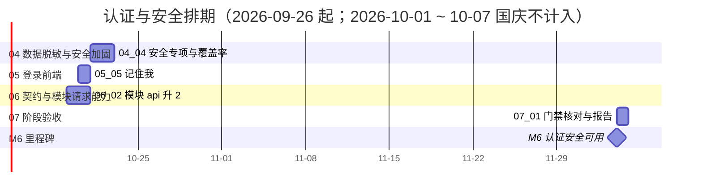

# 认证与安全计划

> BMS 基础管理系统 · 阶段六（认证与安全 / M6 认证安全可用）排期计划：**已完成 42 项，剩余 4 项**（域 01 认证与会话 6 项 / 88h、域 02 SSO 与身份联邦 6 项 / 90h、域 03 验证码与账号治理 8 项 / 90h、域 04 数据脱敏与安全加固 4 项 / 34h、域 05 登录前端 5 项 / 48h、域 06 契约与模块请求能力 3 项 / 30h、域 07 阶段验收 1 项 / 8h、域 08 裸无序集合治理 3 项 / 264h、域 09 类体系根治理 5 项 / 88h、域 10 租户标识内部化 5 项 / 64h，合计 46 项 / **804h**；已完成 768h，剩余 36h）

[文档首页](../../../文档首页.md) › 认证与安全计划　|　[任务基线 →](../任务/01_认证与会话/01_认证与会话.md)　[需求基线 →](../需求/00_需求_认证与安全.md)

## 1. 计划说明 

- **排期对象**：阶段六 40 条需求、46 个子任务（域 01 认证与会话 6 / 域 02 SSO 与身份联邦 6 / 域 03 验证码与账号治理 8 / 域 04 数据脱敏与安全加固 4 / 域 05 登录前端 5 / 域 06 契约与模块请求能力 3 / 域 07 阶段验收 1 / 域 08 裸无序集合治理 3 / 域 09 类体系根治理 5 / 域 10 租户标识内部化 5），任务基线见[域 01](../任务/01_认证与会话/01_认证与会话.md)、[域 02](../任务/02_SSO与身份联邦/02_SSO与身份联邦.md)、[域 03](../任务/03_验证码与账号治理/03_验证码与账号治理.md)、[域 04](../任务/04_数据脱敏与安全加固/04_数据脱敏与安全加固.md)、[域 05](../任务/05_登录前端/05_登录前端.md)、[域 06](../任务/06_契约与模块请求能力/06_契约与模块请求能力.md)、[域 07](../任务/07_阶段验收/07_阶段验收.md)、[域 08](../任务/08_裸无序集合治理/08_裸无序集合治理.md)、[域 09](../任务/09_类体系根治理/09_类体系根治理.md)、[域 10](../任务/10_租户标识内部化/10_租户标识内部化.md)。
- **执行序（承前启后）**：`01_01 安全原语` → `01_02 令牌自签与校验源切换` → `01_03 登录 / 刷新 / 登出链路` → `01_04 会话管理与踢出` → `01_05 登录态依赖与租户解析` → `02_01 SSO 链路` → `02_02 JIT 建号` → `02_03 CAS` → `02_04 企微 / 钉钉` → `02_05 BMS 兼作 IdP` → `02_06 IdP 配置管理` → `03_01 图形码` → `03_02 滑块` → `03_03 短信` → `03_08 系统参数读取基座` → `03_04 场景策略与失败计数联调` → `03_05 密码策略` → `03_07 账号锁定` → `03_06 找回密码` → `08_01 裸无序集合护栏与存量盘点` → `09_01 后端类体系根治理` → `09_02 前端框架层对称` → `09_03 值对象存量归位（批次 1）` → `09_04 术语统一（命名规则 + 租户视图对象自身编码）` → `09_05 框架对象与数据契约存量归位（批次 2/3）` → `10_01` ~ `10_05 租户标识内部化` → `04_01` ~ `04_03 脱敏与基础防护` → `06_01 认证契约与类型生成（含路由覆盖护栏，需求 06-3）` → `06_03 契约响应 schema 完整性与门禁（需求 06-4）` → `01_06 当前用户概要端点（需求 01-6）` → `05_02 token / 401` → `05_03 路由守卫` → `05_01 登录页` → `05_04 扫码登录` → `05_05 记住我` → `06_02 模块请求能力 api` → `04_04 安全专项与覆盖率` → `08_02 裸无序集合存量整改`（批次 1~4，逐批递减基线至归零）→ `08_03 集合体系收链`（跨副本形态回链）→ `07_01 阶段验收`（收口）。
- **承接口径**：阶段二已交付服务化认证地基——网关 forward-auth 与身份头契约、OIDC 客户端与 JWKS 验签、服务 JWT 自签与统一校验（双类 JWT）、边缘信任与请求净化、验证码 / 密码策略 / 脱敏 / 会话存储基座占位；前端已交付服务段寻址 / 能力源分流 / 契约类型生成 / 请求层 token 与 401 钩子 / 守卫骨架（默认关闭）。本阶段在其上**接线与真实化**，不重复建设基座。
- **已定口径（2026-09-26 拍板）**：用户 JWT 由 BMS 自签、网关校验源切 identity JWKS；`sys_user` 最小模型落 org 服务（identity 经服务间契约调凭据接口）；BMS 兼作 IdP 交内核 + `sys_client` 最小接口（页面归阶段十）；SSO 四协议实现（OIDC 真联调 / CAS mock 联调 / 企微钉钉适配 + 单测，真实凭据与移动端内嵌留阶段十七）；踢出按 HTTP + Redis 即时拦截（广播占位归阶段八）；密码哈希 PBKDF2；Redis 故障验证码 fail-closed、限流 memory 降级；登录日志本期不落表（归阶段八）；账号锁定后端全做（页面归阶段七）；找回密码流程本期 + 通道占位；脱敏规则 + 序列化 / 日志 / 导出接入（`data:plain` RBAC 前一律掩码）；模块 `api` 契约版本升 2 本期交付；滑块服务端合成出图不下发坐标；`[security]` 配置本期定稿；**系统参数（`sys_config`）读取基座按补充需求 03-8 本期补建**（管理面归阶段八，2026-09-27 拍板）；启动时需求提出清单见 [README「启动时需求提出清单（转需求映射）」](../README.md#intake)。
- **排期口径**：自 2026-09-26 起串行排期（单人兼职，沿用《总体项目规划》阶段六 4 周基线，累计 30 周）；按 8h/日折算，2026-10-01 ~ 2026-10-07（国庆）不计入；窗口为估算基线，可按实际滚动调整并记录调整原因。
- **工时**：已完成 768h；剩余 36h；阶段合计 **804h**（域 01 88h = 12+16+24+16+12+8（`01_06` 随需求 01-6 立项估 8h）；域 02 90h = 16+12+12+14+24+12；域 03 90h = 8+10+8+16+16+10+10+12；域 04 34h = 12+8+6+8；域 05 48h = 14+12+6+8+8（`05_05` 随补充需求 05-5 立项估 8h）；域 06 30h = 10+12+8（`06_01` 随需求 06-3 由 6h 重估至 10h；`06_03` 随需求 06-4 立项估 8h）；域 07 8h；域 08 **264h** = 16+156+26+50+16；域 09 88h = 16+8+32+8+24；域 10 64h = 8+16+16+16+8）。任务级工时随详细设计重估并同步回写（域 08 子任务 02~04 随 2026-09-29 二次拍板重估）。
- **里程碑锚点**：M6 = **认证安全可用**（《总体项目规划》「里程碑」节），门禁见[本计划 §5 M6 验收门禁](#accept)。
- **负责人**：minjian（兼职，单人）。

## 2. 已完成任务（2026-09-26 起） 

| 编号 | 任务 | 工时（重估） | 完成日期 | 任务文件 | 偏差与遗留 |
| --- | --- | --- | --- | --- | --- |
| 01_01 | 安全原语真实实现与配置定稿（PBKDF2 / 令牌编解码 / 会话黑名单） | 12h | 2026-09-26 | [01_01](../任务/01_认证与会话/01_认证与会话_01_安全原语真实实现与配置定稿/01_认证与会话_01_安全原语真实实现与配置定稿.md) | 偏差：迭代次数配置落 `[password_hasher].options.iterations`、`[security].keys` 空允许装配但使用时 fail-closed（设计已回写）；遗留：Kiwi 33 停用标记（计划 §7 第 13 项）、生产密钥分发（运维阶段） |
| 01_02 | 用户令牌自签与网关校验源切换 | 16h | 2026-09-26 | [01_02](../任务/01_认证与会话/01_认证与会话_02_用户令牌自签与网关校验源切换/01_认证与会话_02_用户令牌自签与网关校验源切换.md) | 偏差：无（JWKS 端点描述更新与 01_01 遗留 `pbkdf2.py` 格式随门禁处理，见实施记录 §4）；遗留：登录 / 刷新 / 登出（01_03 / 01_04）、`require_auth`（01_05）、SSO 复用（02_05）、生产密钥治理（运维阶段） |
| 01_03 | 本地登录 / 刷新 / 登出链路 | 24h | 2026-09-26 | [01_03](../任务/01_认证与会话/01_认证与会话_03_本地登录刷新登出链路/01_认证与会话_03_本地登录刷新登出链路.md) | 偏差：会话错误码由概要 14 的 `20001~20006` 避让至 `20011~20016`（登录类占 `20002~20004`，已回写）；遗留：会话管理 / 踢出（01_04）、`require_auth`（01_05）、验证码强制与锁定管理（域三）、`sys_login_log`（阶段八） |
| 01_04 | 会话管理与强制踢出 | 16h | 2026-09-26 | [01_04](../任务/01_认证与会话/01_认证与会话_04_会话管理与强制踢出/01_认证与会话_04_会话管理与强制踢出.md) | 偏差：概要 14 §5 幂等口径改 `revoked_at` 语义（Idempotency-Key 归后续）、`max_active` 落 `[session]` 配置（sys_config 覆盖归后续）、测试落点改 `tests/auth/`（已回写）；遗留：真机冒烟（01_05 / 部署窗口）、RBAC 权限与 `20014`/`20016` 判定（阶段七）、操作日志与真实 Socket.IO 广播（阶段八）、踢出限流（阶段七）、会话管理页面（阶段十五）、批量撤销接口（03_06） |
| 01_05 | 登录态依赖真实化与租户解析接线 | 12h | 2026-09-26 | [01_05](../任务/01_认证与会话/01_认证与会话_05_登录态依赖与租户解析接线/01_认证与会话_05_登录态依赖与租户解析接线.md) | 偏差：新增 `X-Session-Id` 身份头（网关生成件重生成）、`require_auth` 改异步返回 `AuthContext`、会话失效错误码取 `20012`/401（设计已回写）；遗留：真机端到端冒烟（网关生成件与后端同步发布，部署窗口）、RBAC 权限码判定与 `AuthContext` 主体消费（阶段七）、操作日志与真实 Socket.IO 广播（阶段八）、`sys_config` 租户级会话覆盖（后续阶段） |
| 02_01 | SSO 登录完整链路（OIDC 授权码） | 16h | 2026-09-27 | [02_01](../任务/02_SSO与身份联邦/02_SSO与身份联邦_01_SSO登录完整链路/02_SSO与身份联邦_01_SSO登录完整链路.md) | 偏差：设计 §9 实施回写 8 项（装配断言 / 前端类型生成件 / `test_units` / 回归复用既有 auth 用例 / 表与迁移落点 / Kiwi 2197 text 修正 / 真机部署态 / 跨任务修复 5 项：servicecall 出站身份、契约冒烟密钥、CI Node 预装、compose 注入、网关生成件同步）；遗留：JIT 与 `sso:bind`（02_02）、IdP 配置管理（02_06）、CAS / 企微钉钉（02_03 / 02_04）、BMS 兼作 IdP（02_05）、前端登录页消费（域五）、`sys_login_log`（阶段八）、无 `id_token` 的 `nonce` 降级（02_06） |
| 02_02 | JIT 建号与身份映射 | 12h | 2026-09-27 | [02_02](../任务/02_SSO与身份联邦/02_SSO与身份联邦_02_JIT建号与身份映射/02_SSO与身份联邦_02_JIT建号与身份映射.md) | 偏差：设计 §9 实施回写 3 项（用例 6 helper 落点由 `test_units.py` 改 `test_jit.py`；org 建号服务方法名 `create_user` 避 `BaseService.create` 覆盖冲突；契约与 api-types 生成件按实施重生成）；遗留：Redis 故障降级下极端孤儿用户（运维清理）、`sso:bind` 真实权限与本人 / 超管判定（阶段七）、`identity.user.jit_created` 内建消费方与 Webhook（阶段八 / 十） |
| 02_03 | CAS 兼容适配（mock CAS 联调） | 12h | 2026-09-27 | [02_03](../任务/02_SSO与身份联邦/02_SSO与身份联邦_03_CAS兼容适配/02_SSO与身份联邦_03_CAS兼容适配.md) | 偏差：设计 §9 实施回写 3 项（`IdentityUser` 同步增 `name`；OIDC / 占位以 `del service` 忽略新参数；CAS 测试专用流程启动 helper）；遗留：真实 CAS IdP 联调（凭据就绪时，与 02_04 同口径）、SLO / proxy / SAML（后续阶段）、CAS 行配置管理面与连通性（02_06）、登录页入口（域五）、`sys_login_log`（阶段八） |
| 02_04 | 企业微信 / 钉钉免登适配（PC 扫码 + 单测） | 14h | 2026-09-27 | [02_04](../任务/02_SSO与身份联邦/02_SSO与身份联邦_04_企业微信钉钉免登适配/02_SSO与身份联邦_04_企业微信钉钉免登适配.md) | 偏差：设计 §9 实施回写（`SsoAuthorizeResult` / `EnterpriseIdpError` 子段登记、`_exchange` 优先放行 EnterpriseIdpError、扫码前端轮询归 05_04）；遗留：企微 / 钉钉真实企业凭据联调与移动端内嵌 H5 免登（阶段十七，凭据就绪可提前）、两平台行配置管理面与连通性（02_06）、登录页入口与扫码对接（域五 05_01 / 05_04）、`sys_login_log`（阶段八）、前端 i18n 补 `20057`~`20062` 文案 |
| 02_05 | BMS 兼作 IdP 与客户端注册（OIDC Provider + `sys_client` 最小接口） | 24h | 2026-09-27 | [02_05](../任务/02_SSO与身份联邦/02_SSO与身份联邦_05_BMS兼作IdP与客户端注册/02_SSO与身份联邦_05_BMS兼作IdP与客户端注册.md) | 偏差：设计 §9 实施回写 8 项（服务层 helper 去下划线 / `OidcProviderService.jwks()` 未落地 / 内存状态键形对齐 Redis / 客户端审计参数必填 / 端点错误转换 / 契约与生成件重生成 / 基座清单补登 / 测试落点与 Kiwi 2202）；遗留：客户端管理页面 / Client Credentials / IP 白名单 / `sys_open_log` 与 refresh token（阶段十）、浏览器会话 cookie 联动与 `return_to`（域五）、ID Token `email`（用户管理阶段）、生产 issuer 与密钥治理（运维 / M6）、真机冒烟（本任务收尾窗口） |
| 02_06 | 外部 IdP 配置管理（`sys_identity_provider` CRUD / 连通性测试） | 12h | 2026-09-27 | [02_06](../任务/02_SSO与身份联邦/02_SSO与身份联邦_06_外部IdP配置管理/02_SSO与身份联邦_06_外部IdP配置管理.md) | 偏差：设计 §9 实施回写 10 项（企微探测凭据语义 / 脱敏兜底 / 读取容错 / `_KeyRule` 继承 / 路由顺序 / 契约与生成件重生成 / 基座清单补登 / 测试落点与 Kiwi 2203）；遗留：`secret:` 加密存取（域 04_03）、`idp:manage` 真实权限与页面（阶段七）、事件广播与操作日志（阶段八）、SSRF 域名解析强化与细粒度白名单（后续安全强化）、启用前预检 / 批量排序 / 钉钉凭据真伪（后续 / 阶段十七）、真机冒烟（M6 部署窗口） |
| 03_01 | 图形验证码真实实现（Pillow + Redis 一次性校验） | 8h | 2026-09-27 | [03_01](../任务/03_验证码与账号治理/03_验证码与账号治理_01_图形验证码真实实现/03_验证码与账号治理_01_图形验证码真实实现.md) | 偏差：失败回写 TTL 保留方式由 `KEEPTTL` 改「`PTTL` + `SET ... PX`」（设计已回写）；遗留：滑块 / 短信（03_02 / 03_03）、场景策略与失败计数强制（03_04）、脱敏改经基座（03_03 / 04_01）、登录前限流（03_04） |
| 03_02 | 滑块挑战真实实现（服务端合成出图 + 轨迹判定） | 10h | 2026-09-27 | [03_02](../任务/03_验证码与账号治理/03_验证码与账号治理_02_滑块挑战真实实现/03_验证码与账号治理_02_滑块挑战真实实现.md) | 偏差：滑块判定失败码按错误码语义定为 `20101`（任务 / 需求原写 `20102`，设计 §8 回写）、前端件归属按父任务端范围归 `03_04`（任务文档已回写）；遗留：前端 `06_04` 新 `payload` 渲染与端到端联调（**归 03_04**）、短信（**归 03_03**）、场景策略与失败计数强制（**归 03_04**）、真实图片底 / 拼图形状演进与轨迹阈值真机调参（后续） |
| 03_03 | 短信验证码真实实现（脱敏回显 / 冷却频次 / 通道占位） | 8h | 2026-09-27 | [03_03](../任务/03_验证码与账号治理/03_验证码与账号治理_03_短信验证码真实实现/03_验证码与账号治理_03_短信验证码真实实现.md) | 偏差：脱敏沿用 `mask_phone`、改经 `BaseMasker` 归 `04_02`（任务文档已回写）、`generate(kind=sms)` 改判 `ParamError`（10001）；遗留：脱敏回接基座（**归 04_02**）、前端短信件真实通路与联调（**归 03_04**）、策略按租户读取与失败计数强制（**归 03_04**）、短信模板 / 真实渠道（**归阶段八**） |
| 03_08 | 系统参数（`sys_config`）读取基座 | 16h | 2026-09-27 | [03_08](../任务/03_验证码与账号治理/03_验证码与账号治理_08_系统参数读取基座/03_验证码与账号治理_08_系统参数读取基座.md) | 偏差（设计已回写）：① 迁移编号由 0002 改 `0004_sys_config`（`down_revision=0003_sys_outbox_event_version`，避免与既有 `0002_sys_outbox` 分叉）；② config provider 口径与 dict 同构（dev `config_source=sql` / 生产非 platform 覆盖 `http`）；③ Kiwi 用例分类用既有「平台骨架」（编号 2207）；遗留：管理面（CRUD / 页面 / 审计 / 平台默认下发）**归阶段八** |
| 03_04 | 场景策略与失败计数联调 | 16h | 2026-09-27 | [03_04](../任务/03_验证码与账号治理/03_验证码与账号治理_04_场景策略与失败计数联调/03_验证码与账号治理_04_场景策略与失败计数联调.md) | 偏差（设计已回写）：① `default_scene_policy` 返回带 `channels` 的副本（恒等断言改等值，Kiwi 879 适配）；② Kiwi 用例分类用既有「平台骨架」（编号 2208）；遗留：宿主登录页接线（**归 05_01**）、真实通道可用性探测（**归阶段八**）、验证码校验失败是否纳入风控评分（**归后续安全强化**） |
| 03_05 | 密码策略真实实现 | 10h | 2026-09-27 | [03_05](../任务/03_验证码与账号治理/03_验证码与账号治理_05_密码策略真实实现/03_验证码与账号治理_05_密码策略真实实现.md) | 偏差（设计已回写）：① `sys_account_lock` 与 `pwd_reset_required` 由本任务交付（`org:tenant 0002`），`03_07` 复用扩展（拍板口径）；② `BasePasswordPolicy` 只增非抽象 `history_count()`（默认 5，向后兼容）；③ Kiwi 用例分类用既有「平台骨架」（编号 2209）；遗留：`fail_limit` / `manual` 两型与解锁（**归 03_07**）、Celery 定时调度（**归阶段八**）、改密 / 强度提示前端页面（**归阶段十五**） |
| 03_06 | 找回密码流程（Redis 单次 token + 重置失效会话） | 10h | 2026-09-28 | [03_06](../任务/03_验证码与账号治理/03_验证码与账号治理_06_找回密码流程/03_验证码与账号治理_06_找回密码流程.md) | 偏差（设计已回写）：① 重置 token 消费时机定为「先消费后改密」（严格单次，改密失败需重新发起）；② 租户解析抽 `bms_identity/api/tenancy.py` 供登录 / 找回共用（行为等价重构）；③ 测试替身 `FakeCaptcha` 增 `required_scene`（仅找回场景强制，避免影响登录用例）；Kiwi 编号 2210；遗留：真实邮件 / 企微 / 钉钉 / 短信渠道与模板（**归阶段八**）、找回 / 重置前端页面（**归阶段十五**）、`email` / `phone` 维护入口与唯一性 / 格式校验（**归阶段七**）、token 主动撤销与审计落表（**归阶段八**）、防枚举时序侧信道（**归后续安全强化**） |
| 03_07 | 账号锁定与解锁管理（三型锁定 + 手动解锁 + 审计） | 12h | 2026-09-28 | [03_07](../任务/03_验证码与账号治理/03_验证码与账号治理_07_账号锁定与解锁管理/03_验证码与账号治理_07_账号锁定与解锁管理.md) | 偏差（设计已回写）：① 管理接口取 org 命名空间 `/api/v1/org/locks`、新增 `user:lock` 动作码（决策确认）；② `sys_account_lock` 补 `expire_at` / `unlock_mode`（迁移 `org:tenant 0004`）；③ 仓储 `get_active_by_user` 改生效判定（含 `expire_at`）、新增 `get_open_by_user`；④ 被锁登录错误码统一 `20003`（需求原 `20004` / `20005` 旧口径已回写）；Kiwi 编号 2211；遗留：锁定管理页面（**归阶段七**）、Celery 定时与操作日志真实落库（**归阶段八**）、解锁不回调清 identity Redis 失败计数（**归后续评估**） |

| 04_01 | 脱敏基座真实实现（规则分派 / 自定义策略 / 明文揭示） | 12h | 2026-09-28 | [04_01](../任务/04_数据脱敏与安全加固/04_数据脱敏与安全加固_01_脱敏基座真实实现/04_数据脱敏与安全加固_01_脱敏基座真实实现.md) | 偏差（设计已回写）：占位掩码器工厂命名由 `NullMaskerFactory` 改 `PlaceholderMaskerFactory`（护栏 Kiwi 532：`null.py` 之外不得定义 `Null*` 类）；遗留：序列化 / 日志 / 导出接入与 `mask_phone` 回接（**归 04_02**）、`data:plain` 真实权限（**归阶段七**）、加密字段解密（**归 04_03**）、既有 2 处文档断链（范围外） |
| 08_01 | 裸无序集合护栏与存量盘点（AST 护栏 / 基线快照 / 盘点报告） | 16h | 2026-09-28 | [08_01](../任务/08_裸无序集合治理/08_裸无序集合治理_01_护栏与基线盘点/08_裸无序集合治理_01_护栏与基线盘点.md) | 偏差（已回写）：实施日期早于计划窗口（提前实施）；护栏实测 554 处与设计测绘口径差异已说明；遗留：存量整改分批（**归后续分批任务**）、`scripts/tools` 长期口径评估（**批次 4**）、`scripts/tools` 已纳入 CI lint（**2026-10-02 收口**，见 08_01 实施 §7） |
| 09_01 | 后端类体系根治理（三体系基类 / 继承链四段 / 直继承护栏与基线 / 盘点） | 16h | 2026-09-28 | [09_01](../任务/09_类体系根治理/09_类体系根治理_01_后端类体系根治理/09_类体系根治理_01_后端类体系根治理.md) | 偏差（已回写）：实施日期早于计划窗口（提前实施）、护栏链方向「子 → 父」表述校正；遗留：160 处存量归位分批（**归后续分批任务**）、前端框架层对称（**归 09_02**） |
| 09_02 | 前端框架层对称（框架对象层 / 组件链四段 / 清单与守卫对账） | 8h | 2026-09-28 | [09_02](../任务/09_类体系根治理/09_类体系根治理_02_前端框架层对称/09_类体系根治理_02_前端框架层对称.md) | 偏差（已回写）：实施日期早于计划窗口（提前实施）；遗留：前端数据契约体系层与「禁止直挂根系」前端护栏（**归后续任务**） |
| 09_03 | 值对象存量归位（批次 1）+ 体系根口径治理与角色链分层 | 32h | 2026-09-28 | [09_03](../任务/09_类体系根治理/09_类体系根治理_03_值对象存量归位/09_类体系根治理_03_值对象存量归位.md) | 偏差（已回写）：工时由 8h 重估至 32h（扩入口径治理与角色链分层，2026-09-28 拍板）；实施日期早于计划窗口（提前实施）；110 类落点＝层成员 64 / 单类链 45 / 迁出 1，**29 层角色链全部落地**（批次 ①~⑥，含 6 处设计校准、`trusted`→`allowed` 与 `sub`→`subject` 统一）；收口时修复存量缺陷（ORM 模型继承 `@dataclass` 体系根致 `to_dict()` 返回空）；遗留：租户编码字段名分叉（**转 09_04**）、数据契约 3 + 框架对象 47 处归位（**已由 09_05 完成**） |
| 09_04 | 术语统一（命名规则 + 租户视图对象自身编码 / 契约键隔离） | 8h | 2026-09-28 | [09_04](../任务/09_类体系根治理/09_类体系根治理_04_术语统一/09_类体系根治理_04_术语统一.md) | 偏差（已回写）：曾过度改名（`tenant_id`→`tenant_code` 全域，含 JWT / 事件 / 请求态 / API / DB）经复核后**整体回退**，仅保留命名规则（按值命名）+ `TenantContext.code` + `CODE_FIELD` 退场 + 契约键显式映射；「内部标识改以雪花 id 为准」另立**需求域 10**；遗留：无 |
| 09_05 | 框架对象与数据契约存量归位（批次 2/3） | 24h | 2026-09-28 | [09_05](../任务/09_类体系根治理/09_类体系根治理_05_框架对象与数据契约存量归位/09_类体系根治理_05_框架对象与数据契约存量归位.md) | 偏差（已回写）：实施日期早于计划窗口（提前实施）、工时以估算值收口（主体为逐类落点判定）；50 处归位＝`BaseDataContract` 3 / `BaseMiddleware` 5（新增 API 域能力域基类）/ `BaseFrameworkObject` 42，**基线 50 → 0**（需求 09-1「除体系根外零直继承」达成）；`ValueHolder` 迁出 `core/base.py` 至 `core/holder.py`（避循环导入）、`BizError` 错误体系根归位、`options.py` 的 `PluginError` 改使用处延迟导入（化解 `core.exceptions ↔ core.objects` 循环）；遗留：无 |
| 10_01 | 租户标识内部化：详细设计与口径定稿（库键 / 库名落点、兼容窗口、迁移策略） | 8h | 2026-09-28 | [10_01](../任务/10_租户标识内部化/10_租户标识内部化_01_详细设计与口径定稿/10_租户标识内部化_01_详细设计与口径定稿.md) | 偏差：实施日期早于计划窗口（提前实施）；13 项待拍板口径逐项确认（库键 / 库名保持 code 派生 + 新增对照表 `sys_tenant_database`；令牌 claim 全覆盖统一 `tenant_id`=雪花 id 字符串；无旧令牌兼容；DB 单次改类型 + 回填；接受一次强制重登；事件负载键改 `tenant_id`；网关注入头保持 code；`tenant_id` 必填；停机窗口一次性；`idp_key` 前缀改 id）；口径覆盖 09_04「事件负载键 `tenant_code` 保持」结论（回写归 10_03）；遗留：`sys_event_consumed` 是否加租户列与 `ai_chat_log` 半成品（**开放项 / 后续**）、`sys_tenant.db_key` 废弃列物理删列（**另立任务**）、跨服务事件消费方契约协调（**归 10_03**） |
| 10_02 | 令牌 claim + 请求态键 + 边界 `code → id` 解析 | 16h | 2026-09-28 | [10_02](../任务/10_租户标识内部化/10_租户标识内部化_02_令牌与请求态键/10_租户标识内部化_02_令牌与请求态键.md) | 偏差（已回写）：任务原「旧令牌兼容窗口」表述与 10_01 口径 6（现阶段不设兼容）冲突，已回写去除；服务 JWT / 跨服务租户位（`ServiceRequest`）一并改 id（接收端经 `EdgeIdentity.tenant_id`+`by_id` 解析）；限流 / 缓存键维持 code（**归 10_03** 统一改 id）；`sys_user_identity.tenant_id` 列类型仍 VARCHAR 写 id 字符串（**归 10_04** 改 BIGINT）；`oidc_provider.discovery` 签名改动更新裸集合基线条目；契约快照与前端 `api-types` 重生成；Kiwi 2217；遗留：事件 / 发件箱 / 缓存与限流键（**10_03**）、对照表与 DB 列迁移（**10_04**）、收口（**10_05**） |
| 10_03 | 事件信封 / 发件箱 / 缓存与限流键租户位改 `tenant_id` | 16h | 2026-09-29 | [10_03](../任务/10_租户标识内部化/10_租户标识内部化_03_事件与缓存键/10_租户标识内部化_03_事件与缓存键.md) | 偏差（设计已回写）：实施日期早于计划窗口（提前实施）；① 事件负载键改造与契约基座「字段只增不删」冲突，经拍板改走「租户事件升主版本 `2.0.0` + `check_event_compatibility` 补主版本严格升级豁免破坏性变更 + `RESERVED_PAYLOAD_KEYS` 移除 `tenant_id`」；② 信封 / 发件箱构造点值已为雪花 id（10_02 顺带），本任务以语义对齐 + 护栏断言收口；③ 缓存 / 限流 / 幂等键租户位改 id，演示兜底（无 id）落 `global`，无租户位的既有键不扩；Kiwi 2218；遗留：产品仓库消费方契约标注（**消费方实现时补「前置契约」**）、`sys_outbox` / 死信 / `sys_user_identity` 列类型迁移与对照表（**归 10_04**）、收口（**归 10_05**） |
| 10_04 | DB 列迁移（`code→id`）+ 模型 + `sys_tenant_database` 对照表 + 数据库设计回写 | 16h | 2026-09-29 | [10_04](../任务/10_租户标识内部化/10_租户标识内部化_04_DB列迁移与模型/10_租户标识内部化_04_DB列迁移与模型.md) | 偏差（设计已回写）：实施日期早于计划窗口（提前实施）；① 范围扩展（经拍板）：全链零漂移暴露 `identity:platform` / `identity:tenant` / `org:tenant` 三链发件箱三表缺口，一并补齐；② 达梦增量迁移基座缺陷（`has_table` 不认 `SET SCHEMA` + 无 `MODIFY` 编译）一并修复于 `alembic/env.py`；③ PostgreSQL 改类型经 `postgresql_using`、revision 标识 ≤ 32 字符、迁移只改类型（不动可空性 / 注释）；④ 存量回填为独立幂等 ops 脚本（结构与数据分离）；Kiwi 2219；三库真库 9 项增量迁移 drill 全通过、方言文档回写实测；遗留：达梦列注释变更（**后续评估**）、产品消费方前置契约标注（**消费方实现时补**）、收口（**归 10_05**） |
| 10_05 | 租户标识内部化收口回归与记录 | 8h | 2026-09-29 | [10_05](../任务/10_租户标识内部化/10_租户标识内部化_05_收口回归与记录/10_租户标识内部化_05_收口回归与记录.md) | 偏差（设计已回写）：实施日期早于计划窗口（提前实施）；① 设计断言组按实施回写（改为结构性断言 + 不重复既有用例 2217 / 2218；服务侧模型列类型不跨包断言，由 10_04 全链零漂移与 `check-base` 承接）；② 任务文档 §2.2「旧令牌兼容窗口」表述与 10_01 口径 6 冲突，回写为「不设兼容窗口」；③ 命名复查全域仅 3 处 docstring 误用（已修正），其余 `tenant_code` 均属白名单场景（外部边界 / 展示 / 库键字段名 / 编码形态校验）；④ 收口发现存量格式化漂移 1 处（`services/identity/tests/sso/test_jit.py`）并修正；Kiwi 2220；定向 1783 passed / 40 skipped、覆盖率整体 94%（认证 88.8%）、`preflight --fast` 全绿；遗留：`ops/backfill_tenant_id_columns.py` 单测覆盖率 62%（未覆盖达梦同步分支与 CLI 编排，真库路径由 10_04 三库 drill 承接）→ 如需达单模块门槛另立测试资产任务；达梦列注释变更（**归 §3.1 遗留 32**） |

| 08_02 | 裸无序集合存量整改（批次 1~4） | 232h | 2026-10-02 | [08_02](../任务/08_裸无序集合治理/08_裸无序集合治理_02_bms_core存量整改/08_裸无序集合治理_02_bms_core存量整改.md) | 偏差（已回写）：集合体系收敛为唯一链、护栏取消全部豁免，工作量口径扩面（原估算基于 594 处旧口径）；批次 1~4 覆盖 `libs` / `services` / `scripts/tools` / `ops`（各批实施记录见 §28~§45）；含 pyright 类型欠账 S1~S4 / T1~T4 收口（实施 §46）；遗留：无 |
| 08_03 | 集合体系收链（跨副本形态回链） | 16h | 2026-09-29 | [08_03](../任务/08_裸无序集合治理/08_裸无序集合治理_03_集合体系收链/08_裸无序集合治理_03_集合体系收链.md) | 偏差（已回写）：实施日期早于计划窗口（提前实施）；`version_key` 为属性非方法（层声明改抽象属性）；护栏「继承链对账」父类切分缺陷一并修复（相邻关系 692 → 724）；遗留：`collection_kind` 用途边界与更深异步公共段待后续评估（设计 §8） |
| 04_02 | 脱敏接入与明文权限口径（序列化自动掩码 / 日志脱敏配置化 / 导出脱敏 / `data:plain` 口径） | 8h | 2026-10-02 | [04_02](../任务/04_数据脱敏与安全加固/04_数据脱敏与安全加固_02_脱敏接入与明文权限口径/04_数据脱敏与安全加固_02_脱敏接入与明文权限口径.md) | 偏差（已回写）：实施日期早于计划窗口（提前实施）；① 掩码规格与纯函数迁 `masking/text.py`（`default.py` 再导出，避循环导入）并新增文本掩码辅助 `mask_text`；② `BaseSchema.masked_fields` 类型放宽为映射或集合（护栏禁 `Mapping` / `Set` 抽象落点，取基座集合类）；③ 掩码器注入由逐路由改应用工厂**全局标注依赖**（原做法易漏）；④ 递归掩码以结构化 `_MaskerProtocol` 类型规避 schemas 层反向依赖；Kiwi 2225；遗留：`data:plain` 真实权限判定（**归阶段七**）、`ai_chat_log` 真实落库前掩码与导出大文件审计（**归阶段八 / AI 阶段**） |
| 04_03 | 基础防护与密钥管理落地 | 6h | 2026-10-02 | [04_03](../任务/04_数据脱敏与安全加固/04_数据脱敏与安全加固_03_基础防护与密钥管理落地/04_数据脱敏与安全加固_03_基础防护与密钥管理落地.md) | 偏差（已回写）：实施日期早于计划窗口（提前实施）；① HSTS 环境差异实现由「`GATEWAY_ENV` 控制」调整为「整行变量 `GATEWAY_HSTS_HEADER`」（envsubst 无分支、空值 `add_header` 语义不稳）；② `secret:` 密钥加密存取与加密字段 `reveal` 解密经拍板**不纳入**本任务，改归后续（见 §7 待办）；③ CSP 采用基线严格档（前端产物接入时按需放宽，归部署阶段）。Kiwi 2226；遗留：生产 TLS / HSTS 真机验证、SBOM 上报与分发策略、`secret:` 与 `reveal` 解密归口（**均归后续**） |
| 06_01 | 认证契约快照与前端类型生成（含服务契约路由覆盖护栏） | 10h | 2026-10-02 | [06_01](../任务/06_契约与模块请求能力/06_契约与模块请求能力_01_认证契约快照与前端类型生成/06_契约与模块请求能力_01_认证契约快照与前端类型生成.md) | 偏差（已回写设计）：实施日期早于计划窗口（提前实施）；① 新增用例并入 `test_service_contract.py`（原定新文件，同被测模块内聚）；② 契约路由覆盖护栏命令去 `root` 参数（护栏不读文件系统）。需求侧新增 [需求 06-3](../需求/06_需求_契约与模块请求能力.md#r06-3)（域 06 计数 36 → 37 条需求）。Kiwi 2227；遗留：框架惰性路由结构随框架大版本复核（**开放项**，现以「提取为空即判失败」兜底）、契约版本自动回写（**归契约门禁需求**）、CI 远程实证（**推送后手动触发**） |

| 06_03 | 契约响应 schema 完整性与门禁 | 8h | 2026-10-02 | [06_03](../任务/06_契约与模块请求能力/06_契约与模块请求能力_03_契约响应schema完整性与门禁/06_契约与模块请求能力_03_契约响应schema完整性与门禁.md) | 偏差（已回写设计）：实施日期早于计划窗口（提前实施）；① **断言 D 收敛为「只判引用型」**——实测 19 处内联空 schema 来自直接返回 `Response` / `JSONResponse` / `RedirectResponse` 的原始端点（探针 / OIDC / SSO 回调），属另一缺陷类，不设路径级豁免清单；② 8 个服务基线现存漂移随同一口径一并重生成（结构差异核验零移除键、零值变更）。需求侧新增 [需求 06-4](../需求/06_需求_契约与模块请求能力.md#r06-4)（域 06 计数 3 → 4 条需求）。Kiwi 2228；遗留：19 处原始 `Response` 端点响应契约缺失（**§7 第 37 项**，域六后续子任务 `06_05` 待立项）、`handler.mode` 取法随 pydantic 大版本复核（**开放项**）、oasdiff 本地不可复现（**CI 兜底 / 推送后手动触发**） |

| 01_06 | 当前用户概要端点（`GET /auth/me`） | 8h | 2026-10-02 | [01_06](../任务/01_认证与会话/01_认证与会话_06_当前用户概要端点/01_认证与会话_06_当前用户概要端点.md) | 偏差（已回写设计）：实施日期早于计划窗口（提前实施）；① 任务文档「参考文档」的 05_02 链接层级修正（任务附属目录 → 兄弟任务目录 3 层）；② 「用户不存在 / 账号停用」按 401 处理（`20001` / `20004`），与域一 401 处理面口径一致、避免前端按码分流。需求侧新增 [需求 01-6](../需求/01_需求_认证与会话.md#r01-6)（域 01 计数 5 → 6 条需求）。Kiwi 2229；遗留：强制改密动作页面（**归阶段十五**）、`/auth/me` 缓存与访问审计（**归性能 / 阶段八**）、权限码装载（**归阶段七 RBAC**） |

| 05_02 | token 与 401 静默刷新接线（单例刷新 + 重放 + 登出 + 首屏续期） | 12h | 2026-10-02 | [05_02](../任务/05_登录前端/05_登录前端_02_token与401静默刷新接线/05_登录前端_02_token与401静默刷新接线.md) | 偏差（已回写设计）：实施日期早于计划窗口（提前实施）；① **失效提示文案用宿主常量**（宿主未引入国际化库，归国际化阶段；错误码 → 文案映射归 `05_01`）；② 401 失效路径用 `clearSession()`（同步、不调服务端）而非 `signOut()`——避免与刷新链互递归；③ `@bms/vue` 宿主实际未引用，故只声明 `@bms/api-types` / `@bms/core` / `@bms/ui-ep` 三个 workspace 依赖（不声明未用依赖）。Kiwi 2230；遗留：多标签页登出与 token 失效同步（**归阶段十五**）、`redirect` 站内校验与守卫等待态（**已由 05_03 交付**）、错误码 → 文案映射与宿主国际化（**归 05_01 / 国际化阶段**）、访问令牌过期前主动刷新（**归后续评估**） |

| 05_03 | 路由守卫默认开启与登录回跳（默认开启 / 公开页与 `redirect` 回跳 / `meta.perm` 占位 403 / 首屏等待态 / 守卫决策观测） | 6h | 2026-10-02 | [05_03](../任务/05_登录前端/05_登录前端_03_路由守卫默认开启与登录回跳/05_登录前端_03_路由守卫默认开启与登录回跳.md) | 偏差（已回写设计）：实施日期早于计划窗口（提前实施）；① **会话失效提示时机修正**——「本次失效前无会话」（冷启动续期失败）时不提示不跳转，由守卫按未登录处理（原 `05_02` 口径会误提示「会话已失效」，已回写其详细设计 §3.6）；② 菜单动态路由装载由「启动期无条件装载」改「会话就绪幂等装载 + 会话清理卸载」；③ 路由元信息增强落独立模块文件（`router/route-meta.d.ts`——全局 `.d.ts` 内声明会遮蔽 `vue-router` 真实类型）；Kiwi 2231；遗留：`meta.perm` 真实权限装载与真实菜单下发（**归阶段七 RBAC**）、`/403` 页增强（**归阶段七 / 十五**）、多标签页会话同步（**归阶段十五**） |
| 05_01 | 登录页真实实现（表单 / 验证码延迟提交 / SSO 入口 / 错误码文案） | 14h | 2026-10-02 | [05_01](../任务/05_登录前端/05_登录前端_01_登录页真实实现/05_登录前端_01_登录页真实实现.md) | 偏差（已回写设计）：实施日期早于计划窗口（提前实施）；① **范围扩展**——补建《布局设计 · 登录页》节点（组件设计指向而此前缺失）、阶段四件族增**「延迟提交」模式**（登录在请求内一次性校验并消费挑战，件层自校验会先行消费致 20102）、核心新增认证错误码文案表；② 需求侧「记住我」改由补充需求 [05-5](../需求/05_需求_登录前端.md#r05-5) 承接（本任务不渲染并登记前置契约待交付）、「密码强度提示」登录场景不显示（口径成文）；③ 阶段二骨架用例 2191 断言随占位页退役，改核「登录页可达 + 真实表单」；Kiwi 2232；遗留：找回 / 重置页面与「忘记密码」入口、改密页面与强制改密流转（**均归阶段十五**）、租户品牌资源（**归品牌化阶段**）、扫码入口（**归 05_04**）、记住我（**归 05-5**） |
| 05_04 | 扫码登录前端（四态状态机 / 可插拔状态源 / 过期重取 / 退避 / 换取会话） | 8h | 2026-10-03 | [05_04](../任务/05_登录前端/05_登录前端_04_扫码登录前端/05_登录前端_04_扫码登录前端.md) | 偏差（已回写设计）：实施日期早于计划窗口（提前实施）；① **机制取舍**——平台不对外暴露「已扫待确认」态且后端 `02_04` 冻结「不做轮询状态机与会话旁路存储」，经三轮逐项确认落「**自渲染二维码 + 可插拔状态源**」（能力域基类 `BaseSsoQr` + 状态源插件族与注册表 + 独立扫码页 `/login/qr`），四态 / 退避 / 过期重取 / 可见性全量真实、`scanned` 可注入；② **组件设计回写**——轮询编排由「随二维码件内聚」改「落扫码登录面板」，二维码件保持纯展示；③ **布局设计补节**——登录页节点补「扫码登录独立页」；④ 宿主状态源 `poll` 为占位（恒 `pending`、零请求），真实联调归阶段十七；Kiwi 2233；遗留：真实平台适配（企微 `@wecom/jssdk` / 钉钉内嵌登录或后端状态端点）与真实企业凭据 E2E（**归阶段十七**）、移动端内嵌 H5 免登（**归阶段十七**）、宿主国际化（**归国际化阶段**）、多标签页协同（**归阶段十五**）、`@mf-types` 生成物未纳入 eslint ignore（**环境遗留**，本地 lint 前需删除或补 ignore） |

## 3. 剩余任务排期（自 2026-09-26） 
|  | --- |
| 编号 | 任务 | 状态 | 工时 | 依赖 | 排期窗口 | 备注 | 偏差与遗留 |
| --- | --- | --- | --- | --- | --- | --- | --- |
| 05_05 | 记住我（登录保留时长选项） | 未开始 | 8h | 05_01 / 01_03 | 2026-10-20 | 后端 `LoginRequest` 增 `remember_me`（会话级 / 14 天）+ 前端勾选接入 | 无 |
| 06_02 | 模块请求能力 `api` 与契约版本升 2 | 未开始 | 12h | 05_02 / 阶段四 10_01 / 阶段五 03_02 | 2026-10-19 ~ 2026-10-20 | demo / sample 回归 | 无 |
| 04_04 | 安全专项用例与覆盖率门槛 | 未开始 | 8h | 域一~域三 / 阶段一 04-1 / 04-4 | 2026-10-21 ~ 2026-10-22 | 七类专项 + 认证 ≥80% 接 CI | 无 |
| 07_01 | 阶段验收门禁核对与测试报告 | 未开始 | 8h | 全部任务 | 2026-12-04 | M6 门禁逐条结论与证据 | 无 |
|  | --- |
## 4. 排期甘特图 

```mermaid
gantt
    title 认证与安全排期（2026-09-26 起；2026-10-01 ~ 10-07 国庆不计入）
    dateFormat  YYYY-MM-DD
    axisFormat %m-%d
    section 04 数据脱敏与安全加固
    04_04 安全专项与覆盖率 :d4, 2026-10-21, 2d
    section 05 登录前端
    05_05 记住我 :e5, 2026-10-20, 1d
    section 06 契约与模块请求能力
    06_02 模块 api 升 2 :f2, 2026-10-19, 2d
    section 07 阶段验收
    07_01 门禁核对与报告 :g1, 2026-12-04, 1d
    section M6 里程碑
    M6 认证安全可用 :milestone, mm6, 2026-12-04, 0d
```

> 甘特为串行估算基线（单人兼职）；实际推进可按里程碑门禁滚动调整。

## 5. M6 验收门禁 

门禁定义见《[总体项目规划](../../../规划/总体项目规划.md)》「阶段内容与完成标准」节（阶段六行）与「里程碑」节；**逐条结论与证据索引随收口回写本表**（当前为核对路径基线），阶段汇总见《阶段测试报告》（收口归档）。

| 验收点 | 对应任务 | 核对方式与证据来源（基线） |
| --- | --- | --- |
| 本地登录链路 E2E 通过（含验证码与限流） | 01_03 / 01_04 / 01_06 / 05_01 / 05_02 / 05_03 | 登录 → 受保护接口 → 刷新（首屏概要恢复）→ 登出 E2E；错误与锁定分支用例（Kiwi 登记） |
| SSO 登录链路 E2E 通过（OIDC 真联调） | 02_01 / 02_02 / 02_06 | Keycloak 端到端登录；state / nonce / PKCE 与降级分支用例 |
| JIT 建号落库正确 | 02_02 | 首次登录建号 + `sys_user_identity` 唯一约束用例与落库查询 |
| 前端登录与按服务寻址联通 | 05_01 / 05_02 / 05_03 / 05_04 / 06_01 / 06_03 | 登录页真实表单经 `api/identity` 联通；契约类型零漂移（响应侧 schema 完整）；守卫默认开启用例；扫码登录四态状态机、过期重取与换取会话用例（真实平台适配归阶段十七） |
| 策略强制生效（验证码 / 密码 / 锁定） | 03_04 / 03_05 / 03_07 / 01_03 | 连续失败强制验证码、密码四规则、三型锁定与手动解锁用例 |
| 会话强制踢出即时生效 | 01_04 | 踢出后下一请求 401、refresh 失效、多端上限用例 |
| 账号锁定与手动解锁可用（MVP 验收点） | 03_07 | 手动解锁恢复登录 + 留痕；被锁登录被拒 |
| BMS 作 IdP 通过（MVP 验收点） | 02_05 | 测试客户端授权码流程 E2E + Discovery / JWKS 合规 |
| 数据脱敏生效（安全专项） | 04_01 / 04_02 / 04_04 | 响应 / 日志 / 导出无敏感明文用例；`data:plain` 口径用例 |
| 安全与覆盖率门槛 | 04_04 | 七类安全专项全绿；认证模块覆盖率 ≥80% 且 CI 生效 |

**里程碑对照**（《总体项目规划》「里程碑」节）：

| 里程碑 | 基线（《总体项目规划》） | 本计划窗口 | 说明 |
| --- | --- | --- | --- |
| M6 认证安全可用 | 阶段六（4 周基线，累计 30 周） | 2026-09-26 ~ 2026-12-04（国庆不计入） | 门禁逐条达成后收口；结论与证据随收口回写；窗口由补充需求 08-2（存量整改 92h → **264h**，2026-09-29 二次拍板：口径扩为「全覆盖 + 业务只落插入序集合类」并把基座形态新增并入 `08_02`）与 08-3（集合体系收链 16h）顺延（2026-09-29 立项 / 二次拍板） |

## 6. 风险与对策 

| 风险 | 影响 | 对策 |
| --- | --- | --- |
| 令牌签发方切换（外部 IdP → BMS 自签）连带网关与边缘回归面 | 既有 forward-auth / 边缘信任失效或漏改 | `01_02` 一次性切换并全量回归网关 / 边缘 / 身份头用例；架构 14 / 36 与阶段二配置同步回写 |
| `sys_user` 落 org 服务引入登录跨服务调用 | 登录链路延迟与故障面增加 | 内部接口契约先行冻结；超时与失败语义明确；缓存与索引按登录热路径设计 |
| 企微 / 钉钉与 CAS 缺真实凭据 / 环境 | 联调证据不足，M6 门禁受限 | 按拍板口径交付适配 + mock / 单测，遗留明确登记归口阶段十七；凭据就绪即补真联调 |
| 验证码与失败计数强依赖 Redis | Redis 故障时登录不可用或策略失效 | 验证码 fail-closed（明确报错）；限流 memory 降级；健康检查与告警沿用既有口径 |
| 滑块轨迹判定阈值偏差 | 误拒真人或放行机器人 | 真机取样调参；轨迹合理性双因子（落点 + 时间分布）；阈值常量集中维护 |
| 覆盖率门槛对既有代码不达标 | CI 门禁红，阻塞收口 | 认证模块路径子阈值单列（新增代码达标为准）；既有缺口登记遗留不扩面 |
| `data:plain` 过渡口径被误用（默认放行） | 敏感数据泄露 | 「无权限码一律掩码」写入实现与用例；阶段七接真实权限后回归 |
| 模块契约版本升 2 影响既有模块 | demo / sample 加载失败或行为不一致 | 版本门禁拒绝旧模块并明确提示；双模块回归纳入任务完成标准 |
| 单人兼职投入不稳 | M6 延期 | 串行保守基线 + 里程碑门禁；先打通「登录链路 → 会话 → SSO」主链，协议扩展与安全加固可顺延补 |
| 裸无序集合护栏误报（白名单漏列新形态 / 误判迭代协议） | 护栏噪声高、被绕过或弃用 | 白名单与《后端基类清单》「集合体系」逐条对齐 + `--self-test` 覆盖新规则（迭代 / 调用协议不查）；误报即修口径并同步基线快照 |
| 裸无序集合存量整改（**1711 处**：`libs` 1036 / `services` 348 / `scripts/tools` 224 / `ops` 103，含测试目录与函数体局部变量）落点一律为**插入序集合类**（含契约字段、配置字段与参数位） | 运行期加锁与插入序为预期变化，契约序列化与调用方（含 `services` 传参）适配面大；豁免取消后整改面显著扩大 | 基座能力（只读 API / `ConcurrentStable*` 含分段写 / `CONTRACT_COLLECTION`）先行落地并过用例；契约 JSON Schema 与前端类型**零漂移**为门禁；升序形态退为体系内部基础实现、排序走排序契约；批内先类字段后签名后局部变量、逐批递减基线 + 定向回归与 `preflight --fast` 把关 |
| 集合体系收链（`08_03` / `08_02` 唯一链收口）改动集合体系公共段（`BaseCollection` 为 7 个体系根之一） | 波及全部集合类与依赖集合的模块，清单/护栏易再度漂移 | 设计先行并逐项确认；结构收敛为唯一链（`BaseCollection` 唯根，`RedisSnapshot` 归通用缓存层）；实施后全链回归 + `check-backend-base` 继承链对账与清单 §1/§4/§10 零漂移核对 |
| 继承链四段改动波及全部能力域基类与前端组件链 | 后端与前端基座回归面大、易漏改 | 09_01 / 09_02 全链回归 + 契约用例同步；后端 `check-backend-base` / `check-base` 与前端 `npm run check` 双门禁把关 |

## 7. 后续阶段待办 

| # | 事项 | 来源 | 归口 |
| --- | --- | --- | --- |
| 1 | 企业微信 / 钉钉真实凭据联调与移动端内嵌 H5 免登 | 02_04 / 05_04 排期口径 | 阶段十七（移动端 H5）；凭据就绪可提前 |
| 2 | `session.revoked` 实时广播真实推送（Socket.IO） | 01_04 拍板口径 | 阶段八（通知中心 / 实时推送） |
| 3 | 登录日志（`sys_login_log` 分片 + 哈希链 + 异步落库）与操作日志审计 | 01_03 拍板口径（本期不落表） | 阶段八（通用能力 / 审计） |
| 4 | `data:plain` 明文权限真实判定（RBAC 权限码） | 04_02 排期口径 | 阶段七（RBAC） |
| 5 | 锁定列表 / 解锁管理页面 | 03_07 拍板口径 | 阶段七（用户管理） |
| 6 | 会话管理页面（在线会话查看 / 踢出） | 01_04 排期口径 | 阶段十五（前端全页面） |
| 7 | 找回密码 / 修改密码前端页面与个人中心 | 域三排期口径 | 阶段十五（前端全页面） |
| 8 | 多标签页登出与 token 失效同步口径 | 05_02 排期口径 | 阶段十五（随布局与体验收口） |
| 9 | BMS 兼作 IdP 客户端管理页面、调用审计（`sys_open_log`）与开放接口 OAuth2 | 02_05 拍板口径 | 阶段十（系统集成与消息） |
| 10 | 认证内部端点独立鉴权、mTLS、票据与网关令牌缓存优化 | 架构 31 / 36 口径 | K8s / 性能阶段 |
| 11 | 移动端宿主与模块请求能力（`api`）适配 | 06_02 范围外 | 阶段十七（移动端 H5） |
| 12 | 测试资产仓《Kiwi 用例台账》本阶段用例登记补齐 | 阶段五计划 §7 第 13 项同口径 | 随下次用例批次维护（测试资产仓） |
| 13 | Kiwi 33 历史用例（安全基座占位抛错）随占位退役，待平台标记停用 | 01_01 实施记录 §6 | 测试资产仓台账（随下次用例批次维护） |
| 14 | 登录态真机端到端冒烟（网关生成件与后端同步发布：`X-Session-Id` 注入 → 每请求会话标记校验 → 踢出即时 401） | 01_05 拍板口径 | **已闭环（2026-09-27，随 02_01 真机冒烟同步发布网关生成件并验证 `X-Session-Id` 生效）** |
| 15 | 真实 CAS IdP 联调；CAS 单点登出（SLO）/ proxy 代理票 / SAML | 02_03 边界口径 | 真联调凭据就绪时（与 02_04 同口径）；SLO / proxy 归后续阶段 |
| 16 | 企微敏感信息（手机 / 邮箱，需 `mode=oauth` + `snsapi_privateinfo` + `getuserdetail`）、钉钉旧版（`oapi` / `sns` 签名链路）兼容、企微应用令牌跨实例缓存 | 02_04 边界与开放项 | 需求就绪时另立任务；令牌跨实例缓存可随 Redis 缓存后续优化 |
| 17 | `secret:` 密钥加密存取（`sys_identity_provider.config` 密钥类加密值入库 + 解密供出站使用） | 02_06 边界（当前仅 `env:` 引用） | **后续安全强化**（04_03 经 2026-10-02 拍板不纳入，见其详细设计 §7）；落地后接入管理面写入校验 |
| 18 | IdP 配置管理页面与菜单、`idp:manage` 真实 RBAC 判定 | 02_06 边界（管理面仅后端接口） | 阶段七（RBAC / 用户管理） |
| 19 | SSRF 域名解析后私网校验 / 出站白名单 / egress 代理、配置变更事件广播与操作日志真实落库 | 02_06 边界与开放项 | 后续安全强化 / 阶段八（通用能力与审计） |
| 20 | 系统参数（`sys_config`）管理面（CRUD 接口 / 页面 / `config:manage` 权限 / 字段级审计 / 平台默认向租户种子下发流程） | 03-8 边界口径（本轮仅读取链路 + 失效方法） | 阶段八（通用能力 / 系统参数模块） |
| 21 | 短信 / 邮件 / 企微 / 钉钉真实发送通道接入与模板体系（含找回密码重置通知）、通道可用性探测（连通性判定） | 03_03 / 03_04 / 03_06 边界与开放项（本轮经 `BaseNotifier` 占位、以 `captcha.channel.*` 开关表达可用性） | 阶段八（通用能力 / 通知中心） |
| 23 | `email` / `phone` 维护入口（用户管理编辑 / 导入）与唯一性、格式校验、验证码绑定（含 SSO 邮箱落库） | 03_06 边界与开放项（本轮字段仅作找回通道，无写入口） | 阶段七（用户管理） |
| 24 | 找回密码重置 token 主动撤销（发起重发 / 管理侧作废）与找回 / 重置审计落表 | 03_06 边界与开放项 | 阶段八（通用能力 / 审计） |
| 25 | 裸无序集合存量整改（1711 处：`libs` 1036 / `services` 348 / `scripts/tools` 224 / `ops` 103，在 `08_02` 内按区域分四批；含测试目录与函数体局部变量） | 需求 08-2（2026-09-29 立项；**同日二次拍板：口径扩为「全覆盖 + 业务只落插入序集合类 + 参数位也落」并把基座形态新增并入 `08_02`**）；08_01 边界口径（首轮仅护栏 + 基线 + 盘点） | **已完成**（2026-10-02）：`08_02`（批次 1 `bms_core` 1036 处 + 唯一链收口 + 基座新增 / 批次 2 `services` 348 处 / 批次 3 `ops` 75 + `scripts/tools` 145 = 220 处，含 `scripts/tools` 长期口径评估），基线先由 918 吸收至 1711 再逐批归零；原「批次 1＝直继承 `BaseObject` 类字段」经 09 域归位后实测仅剩 1 处，已并入批次 1 |
| 26 | 直继承 `BaseObject` 存量归位（按体系与模块分批）+ 值对象体系角色链分层 | 09_01 边界口径（首轮仅体系基类 + 护栏 + 基线 + 盘点）；批次 1 值对象 110 处归位已完成（[09_03](../任务/09_类体系根治理/09_类体系根治理_03_值对象存量归位/09_类体系根治理_03_值对象存量归位.md)，29 层角色链全部落地，2026-09-28） | **批次 2/3 已立项**（[09_05](../任务/09_类体系根治理/09_类体系根治理_05_框架对象与数据契约存量归位/09_类体系根治理_05_框架对象与数据契约存量归位.md)：数据契约 3 + 框架对象 47 → 基线归零；框架类需逐类判定落点） |
| 27 | `scripts/tools` 是否纳入 CI lint（ruff / pyright） | 08_01 边界（脚本暂以 `--self-test` 保障） | **已收口（2026-10-02）**：`scripts/tools` 纳入 **ruff（check + format）**——新增 CI job `tooling-lint`（按 `scripts/tools/**` 变更触发）+ preflight 同口径；存量 118 项 ruff 与 31 文件格式清零；**未纳入 pyright**（strict 对 `sys.path` 引导脚本不适用，维持现状）|
| 25 | 防枚举时序侧信道（不存在账号路径更短）等时化处理 | 03_06 边界与开放项 | 后续安全强化 |
| 22 | 验证码校验失败是否纳入风控评分（当前仅记挑战内 `fails`，不驱动锁定与风控） | 03_04 边界与开放项 | 后续安全强化 |
| 28 | `ai_chat_log` 真实落库前敏感文本掩码（消费基座 `mask_text`；真实落库实现随该阶段） | 04_02 边界与开放项 | AI 阶段 |
| 29 | 导出大文件记录审计（导出路径审计占位；消费 `mask_rows` 的调用方登记） | 04_02 边界与开放项 | 阶段八（通用能力 / 审计） |
| 28 | `sys_event_consumed` 是否加租户列（当前每服务每租户独立库已隔离） | 10_01 边界与开放项 | 出现同库多租户场景时再评估 |
| 29 | `ai_chat_log.tenant_id` 半成品（`BigInteger` 但无写入） | 10_01 边界与开放项 | 阶段十九（AI 能力） |
| 30 | `sys_tenant.db_key` 废弃列物理删列 | 10_01 边界与开放项 | 另立运维 / 迁移任务 |
| 31 | 跨服务事件负载键 `tenant_code` → `tenant_id` 的产品仓库消费方协调 | 10_01 边界（口径 9）；契约快照与计划登记已随 10_03 交付（2026-09-29，Kiwi 2218） | 消费方实现时按其任务文档补「前置契约（已交付）」标注（订阅 `supported_majors` 含 2） |
| 32 | 达梦列 / 表注释变更 DDL 支持（Alembic `ColumnComment` 无 `dm` 方言编译处理器）；由此遗留 `sys_user_identity.tenant_id` 库内注释仍为「租户编码（值传递）」（历史迁移 DDL 注释，语义已随 10_04 改为雪花 id） | 10_04 真库实测（方言文档 `03_DM8.md` 标「待验」）；10_05 命名复查确认该注释陈旧并归并本条（2026-09-29，Kiwi 2220） | 后续如需在达梦变更列 / 表注释时评估（迁移兼容补丁）；修注释随该补丁一并处理 |
| 33 | `ops/backfill_tenant_id_columns.py` 单测覆盖率 62%（达梦同步分支 `_tenant_records_sync` / `_run_sync`、非达梦引擎路径与 `run()` CLI 编排未覆盖） | 10_05 收口核对（2026-09-29，Kiwi 2220；真库路径由 10_04 三库 9 项 drill 承接） | 如需达单模块覆盖率门槛，另立测试资产任务（归 `test/` 仓库口径） |
| 34 | 加密字段 `reveal` 解密路径与密钥来源（`BaseMasker.reveal` 解密分支） | 04_01 / 04_02 边界（原挂 04_03）；04_03 经 2026-10-02 拍板不纳入 | **后续安全强化**（出现加密存储字段时连同 17 项 `secret:` 一并立项） |
| 35 | 契约门禁：框架惰性路由结构（FastAPI `_IncludedRouter` / `_EffectiveRouteContext`）随框架大版本变化的复核 | 06_01 边界与开放项（需求 06-3） | 框架升级时复核（现以「提取为空即判失败」兜底） |
| 36 | 契约版本自动回写（CI 取 OpenAPI 版本写入服务目录） | 06_01 边界（阶段二 `09_03` 开放项） | 契约门禁需求后续 |
| 37 | 原始 `Response` 端点响应契约缺失（19 处内联空 schema：`/readyz` × 9 + identity 的 `/oidc/jwks`、`/oidc/.well-known/openid-configuration`、`/oidc/authorize`、`/oidc/token`、`/oidc/userinfo`、`/auth/introspect`、`/auth/sso/{idp_key}/authorize`、`/callback`） | 06_03 实施期实测（2026-10-02；这些路由直接返回 `Response` / `JSONResponse` / `RedirectResponse`，OpenAPI 无从推导 schema） | 域六后续子任务（`06_05`，待立项）或归后续 |

> 本文档依《[文档生成规范](../../../规范/文档生成规范.md)》与《[计划文档规范](../../../规范/计划文档规范.md)》编写
