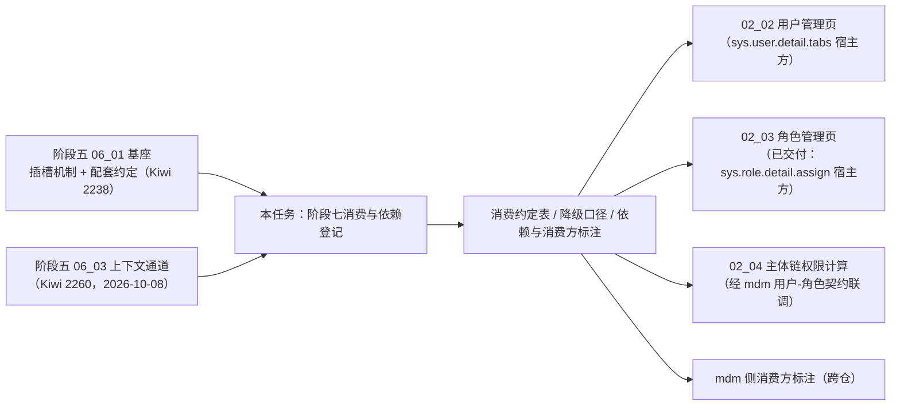

# 01 详细设计 · 具名插槽挂接消费与依赖登记

> RBAC 基础模块 · 01 插件化挂接 · 子任务 01（需求 07-1 · 索引阶段五 `05-10`）｜**定稿（2026-10-08，5 项决策确认）**；**2026-10-09 回写**（随需求 `07-11`：槽宿主位置细化 / 插件改名「岗位分配」/ 新增「用户分配部门」插件，决策记录补 3 项）

[文档首页](../../../../../../文档首页.md) › [01 插件化挂接](../../01_插件化挂接.md) › [01 具名插槽挂接消费与依赖登记](../01_插件化挂接_01_具名插槽挂接消费与依赖登记.md) › 详细设计　|　[← 任务文档](../01_插件化挂接_01_具名插槽挂接消费与依赖登记.md)

## 1. 背景与目标 

阶段七用户管理页要挂接**数据归 mdm 组织域**的功能（用户分配岗位），角色管理页「角色分配」页签要挂接 mdm 的岗位 / 部门分配——宿主页（bms）不得硬编码依赖插件或其后端，**插件缺失即降级隐藏**。机制本体（具名插槽基座 + 前后端配套约定 + 显式上下文注入通道）已在**阶段五交付**（需求 `05-10` / `05-11`）；本任务**不重复实现基座**，只做**阶段七侧的挂接消费与依赖登记**：

1. 把两个消费位（`sys.user.detail.tabs` / `sys.role.detail.assign`）的**消费约定**（槽标识、宿主页、插件声明、写契约、权限码、上下文通道）成文登记；
2. 成文**降级口径**（插件未注册 / 未启用 / 不可达 / 权限不满足 / 上下文缺失时宿主页的行为）；
3. 向**消费方**（mdm 侧、阶段七 `02_02` / `02_04`）标注**前置契约状态**与依赖边界，避免下游误按降级实现或重复造轮子。

**本次范围（2026-10-08 逐项确认）**：本任务拆两段——**前置登记**（本次交付：消费约定 / 降级口径 / 依赖与消费方标注）＋**闭环**（mdm 插件经槽**真挂接**且缺失即隐藏的验证）。闭环的宿主正式页由 `02_02` 交付，故**闭环随 `02_02` 交付后一并验收**，本次不做产物构建 / 发布 / 浏览器走查。

## 2. 范围与交付物 

| 含 | 不含（归口） |
| --- | --- |
| 两个消费位的消费约定登记（槽 / 宿主 / 插件声明 / 契约 / 权限码 / 上下文通道） | 具名插槽机制实现（阶段五 `06_01` 已交付，本任务不新建基座、不改注册表基座） |
| 降级口径成文（未注册 / 未启用 / 不可达 / 权限不满足 / 上下文缺失） | 真实挂接闭环验证（宿主正式页由 `02_02` 交付，闭环随之验收） |
| 依赖与消费方标注（前置契约状态、跨仓边界、下游消费方） | mdm 组织域实现与其插件开发（mdm 产品仓库自持，已交付） |
| mdm 侧一行纠偏回写（`05-11` 通道已就绪） | 生产环境模块清单启用与托管（部署阶段） |

**交付物**：本目录 `设计/`（本详设）、`实施/`（实施记录）、`测试/`（测试记录）——本任务为**登记型任务，无独立实现代码**。

## 3. 现状实测 

> 实测时点 2026-10-08；取证落点为当前工作区源码与文档。

| 项 | 实测结论 | 取证落点 |
| --- | --- | --- |
| 插槽机制（前置契约） | 已交付：区域项声明字段（`title` / `icon` / `perm` / `permMode` / `when`）、`inline` / `tabs` 两形态、宿主上下文来源约定、降级口径、平台样例插件全链路 | 阶段五 `06_01` 详设 §3.1 ~ §3.3、§3.9；其测试记录 Kiwi **2238** |
| 显式上下文通道 | 已交付（2026-10-08）：插槽件 `context` 只读注入 + 区域项 `useModuleSlotField('roleId')` 消费；未注入即 `undefined`（插件自行降级） | 阶段五 `06_03` 详设 / 测试记录 Kiwi **2260** |
| 宿主位 · 角色分配 | 已交付：`RoleAssignTab.vue` 留槽 `sys.role.detail.assign`（`variant="tabs"`）并注入 `{ roleId: props.roleId }`（非路由承载页） | `apps/desktop/src/views/system/role/RoleAssignTab.vue` |
| 宿主位 · 用户详情 | 阶段五**样例宿主页**已留槽 `sys.user.detail.tabs`（`/sys/users/:id`，读当前用户概要）；**阶段七正式用户页待 `02_02`**，其落点为**用户记录页「用户分配」页签内子 Tabs**（2026-10-09 细化） | `apps/desktop/src/views/SysUserDetailView.vue`、`apps/desktop/src/router/index.ts` |
| mdm 插件声明 | 已交付三件：`mdm-org:user-posts`→`sys.user.detail.tabs`(20) / `mdm-org:role-posts`→`sys.role.detail.assign`(20) / `mdm-org:role-depts`→同槽(30)，`title` 与 `perm: 'org:update'` 齐备；**2026-10-09 起**：`user-posts` 标题改「岗位分配」、新增 `mdm-org:user-depts`(30 / 「部门分配」)随需求 `07-11` | mdm `frontend/modules/org/src/index.ts`、`tests/module-definition.spec.ts` |
| mdm 后端契约 | 已交付：`/api/v1/org/user-posts`（用户-岗位）、`/api/v1/org/role-posts` / `/api/v1/org/role-depts`（角色-岗位 / 部门）、`/api/v1/org/user-roles`（按用户解析角色）；经产品命名空间 `/api/mdm/v1/org/...` 暴露 | mdm `deploy/contracts/org.json`（26 条路径） |
| mdm 侧登记 | 已自持：概要设计 02 §5.4 已标「平台侧前置契约已交付（2026-10-03）」；末句「`05-11` 通道就绪前按降级推进」**已滞后**（通道 2026-10-08 已交付） | mdm 概要设计 02 §5.4、`01_04` 详设区域项表 |
| 宿主不直连插件护栏 | 已交付并在跑 | `apps/desktop/tests/guard-slot-host-isolation.spec.ts` |
| 平台样例插件 | 已交付：`frontend/modules/slot-sample`（无路由、只注册区域项），供机制回归 | 阶段五 `06_01` §3.6 |

## 4. 消费约定登记 

### 4.1 两个消费位 

| 槽标识 | 宿主页（阶段七） | 宿主落点与状态 | 插件（mdm 提供） | 插件写契约 | 权限码 | 上下文通道 |
| --- | --- | --- | --- | --- | --- | --- |
| `sys.user.detail.tabs` | 用户记录页「**用户分配**」页签内（`02_02` 交付后接管） | `apps/desktop/src/views/`（`02_02` 落点）；阶段五样例宿主页 `SysUserDetailView.vue` 已留同槽 | `mdm-org:user-posts`（order 20 / 「岗位分配」，**2026-10-09 由「用户分配岗位」改名**）、`mdm-org:user-depts`（order 30 / 「部门分配」，**2026-10-09 新增**，随需求 `07-11`） | `/api/v1/org/user-posts`、`/api/v1/org/user-depts`（用户-岗位 / 用户-部门分配与解绑） | `org:update` | **路由参数** `:id`（插件经注入 `router` 只读读取） |
| `sys.role.detail.assign` | 角色记录页「角色分配」页签（`02_03` 已交付） | `views/system/role/RoleAssignTab.vue`（`variant="tabs"`，已注入上下文） | `mdm-org:role-posts`（order 20 / 「岗位分配」）、`mdm-org:role-depts`（order 30 / 「部门分配」） | `/api/v1/org/role-posts`、`/api/v1/org/role-depts` | `org:update` | **显式上下文注入** `useModuleSlotField('roleId')`（宿主注入 `{ roleId }`，`05-11` 通道） |

约定要点（沿阶段五 `06_01` §3.5「数据归属方提供插件」）：

- **同槽多来源**：平台内建项与模块插件项共用同一槽，按 `order` 稳定排序（同值保持登记序）；
- **插件成套**：前端模块（区域项）+ 后端契约（mdm 公开契约）同源同归属；插件**只经宿主注入的 `api`** 发请求（`api.product('mdm','org')`），**不自建 HTTP、不自拼前缀**；
- **权限码同源**：区域项 `perm` 与 mdm 后端写端点权限码同为 `org:update`；宿主与插槽项只做**前端显隐**，真正鉴权在后端；
- **上下文不假定存在**：插件侧未取得实体标识时不发起请求、不阻塞宿主页（自行降级提示）。

> **宿主位置细化（2026-10-09，随需求 `07-11`）**：`sys.user.detail.tabs` 的出口**不再挂在信息栏顶层 Tabs**，而是置于「**用户分配**」页签内的子 Tabs（与 bms 内建「角色分配」子页签并列，插件按 `order` 20 / 30 稳定排序）。**机制不变**（区域项声明与解析口径均不涉位置），仅消费侧登记细化，供 `02_02` 与其追加子任务实现对齐；同槽第三来源「用户分配部门」插件随需求 `07-11` 由 mdm 提供。

### 4.2 登记落点（本任务只登记，不改机制） 

| 内容 | 落点 |
| --- | --- |
| 机制语义（插槽命名 / 解析过滤 / 降级 / 上下文双通道） | 阶段五已登记：《架构设计 · 扩展点与插件化》§9.1 ~ §9.3、《架构设计 · 前端模块契约》§4 / §5、《组件设计 · 模块区域插槽》、《前端基类清单》§4——**本任务不改** |
| 阶段七消费位与消费约定 | 本详设 §4；`02_02` / `02_03` / `02_04` 任务文档「前置契约（已交付）」引用 |
| 降级口径 | 本详设 §5；测试记录 §3（引用既有护栏用例） |
| 依赖与消费方标注 | 本详设 §6；mdm 概要设计 02 §5.4（跨仓纠偏一行） |
| 进度与状态 | `项目/07_RBAC基础模块/计划/01_计划_RBAC基础模块.md`（**唯一进度落点**） |

## 5. 降级口径 

| 情形 | 处置 | 表现 |
| --- | --- | --- |
| 插件未注册 / 清单未启用 | 区域解析结果为空 → 该项不渲染（`tabs` 不渲染空页签） | 宿主页其余正常，不报错、不阻塞 |
| 提供方不可达（mdm 服务不可用） | 挂接照常（前端模块可独立加载），插件内取数失败按请求层统一错误态 | 宿主页不受影响；插件 Tab 内呈现错误态与重试 |
| 插件加载失败 / 超时 | 宿主模块错误边界兜底（带模块名与版本）+ 单模块手动重试 | 沿阶段五 `03_03` 口径 |
| 区域项 `perm` 不满足（含权限码为空集） | 该项不渲染（宿主不二次兜底） | RBAC 就绪前权限基座为 Null（超管口径），行为随基座 |
| 区域项 `when` 谓词抛错 | 该项按「不渲染」处置并上报，不影响同区其余项 | — |
| 上下文缺失（路由 `:id` 缺失 / `roleId` 未注入） | 插件侧自行降级：不请求、提示未选择实体 | 宿主页正常 |
| 宿主页直接 import 插件 | 由护栏拦截 | `guard-slot-host-isolation.spec.ts` 报错 |

> 降级口径**不新增机制**：均引自阶段五 `06_01` 详设 §4「失败分支与边界」，本任务只做阶段七消费侧的**登记与引用**。

## 6. 依赖与消费方标注 

### 6.1 前置契约（已交付） 

| 前置 | 内容 | 状态 |
| --- | --- | --- |
| 阶段五 `06_01`（需求 `05-10`） | 具名插槽基座 + 前后端配套约定 + 平台样例插件全链路 | **已交付**（2026-10-03，Kiwi **2238**） |
| 阶段五 `06_03`（需求 `05-11`） | 显式上下文注入通道（非路由承载页的实体标识注入） | **已交付**（2026-10-08，Kiwi **2260**） |
| mdm 组织域（阶段一 `01_02` / `01_03` / `01_04`） | org 五表与 19 端点、组织只读出口、三插件与 `@mdm/api-types` 管道 | **已交付**（mdm 仓） |

### 6.2 消费方标注 

| 消费方 | 用途 | 前置契约状态 |
| --- | --- | --- |
| 阶段七 `02_02` 用户管理前端 | 用户记录页「用户分配」页签内提供 `sys.user.detail.tabs` 挂接位（本任务闭环的宿主方；「用户分配」内含 角色分配 / 岗位分配 / 部门分配 三子页签） | 前置契约**已交付**（`06_01` + `06_03`）；插件缺失按降级（隐藏）推进 |
| 阶段七 `02_03` 角色管理（已交付） | 角色记录页「角色分配」页签提供 `sys.role.detail.assign` 挂接位 | 前置契约**已交付**（`06_01` + `06_03`，已于交付时留槽并注入 `roleId`） |
| 阶段七 `02_04` 主体链权限计算 | 岗位 / 部门角色经 mdm `/api/v1/org/user-roles` 跨服务解析 | mdm 只读契约**已交付**；联调随 `02_04` |
| mdm 组织域（跨仓） | 四插件（用户分配岗位→「岗位分配」 / 岗位分配 / 部门分配，**新增「用户分配部门」**）按本消费约定注册区域项 | 平台侧前置契约**已交付**（阶段五 `06_01` / `06_03`）；mdm 侧已自持登记（概要设计 02 §5.4 / 03 §…、`01_04` 详设）；**「用户分配部门」与 `org_user_dept` / 主要项标记随需求 `07-11`**（mdm `01_02` 追加子任务 `_02`），未就绪期间该子页签按降级隐藏 |

### 6.3 跨仓边界 

- **宿主不直连插件**：bms 宿主页不 import mdm 模块、不感知 mdm 服务地址；插件经清单加载、经注入 `api` 取数（沿阶段五护栏）。
- **数据与写操作归 mdm**：分配 / 解绑全部落 mdm 契约（`org_user_post` / `org_role_post` / `org_role_dept`），bms 不落副本；**即时提交**，不随宿主页工具栏保存。
- **mdm 侧文档纠偏**：mdm 概要设计 02 §5.4 末句由「`05-11` 通道就绪前按降级推进」改为「**已就绪（2026-10-08）**」，并在 mdm `01_04` 实施记录补一行引用本任务——避免 mdm 侧后续误按降级实现。

## 7. 测试设计与验收映射 

| 验收点（任务 §3） | 证据 |
| --- | --- |
| 消费约定（槽 / 插件声明 / 契约 / 权限码 / 上下文通道）成文 | 本详设 §4；实施记录 §3 |
| 降级口径成文（未注册 / 不可达 / 权限不满足 / 上下文缺失） | 本详设 §5；测试记录 §3（引用既有护栏用例，本次不改代码） |
| 依赖与消费方标注成文（含 mdm 侧） | 本详设 §6；mdm 概要设计 02 §5.4（跨仓回写） |
| 阶段五 `05-10` 完成标准已达成（引用其验收证据） | 阶段五 `06_01` 测试记录（Kiwi **2238**）结论；`06_03` 测试记录（Kiwi **2260**） |
| 宿主挂接位 + 插件真挂接 + 缺失即隐藏（闭环） | **待 `02_02` 交付后验收**（本次不做产物构建 / 发布 / 走查；阶段五样例宿主页已具备同槽，仅作机制佐证） |
| 既有护栏仍绿（宿主不直连插件 / 未登记不渲染 / 卸载无残留） | `apps/desktop/tests/guard-slot-host-isolation.spec.ts`、`apps/desktop/tests/role-assign-slot.spec.ts`、`packages/ui-ep/tests/module-area-outlet.spec.ts`（本次无代码变更，作现状证据引用） |

**Kiwi 用例（2026-10-08 拍板）**：本任务**不新增用例**（无代码、无新增断言）——测试记录引用阶段五 `06_01` 的 **2238** 与 `06_03` 的 **2260** 作前置契约证据。

## 8. 边界与开放项 

| # | 事项 | 归口 |
| --- | --- | --- |
| 1 | **本任务闭环**（mdm 插件经 `sys.user.detail.tabs` 真挂接 + 缺失即隐藏验证）：宿主正式页由 `02_02` 交付，闭环随之验收；「角色分配」侧宿主与插件双方已交付，真挂接走查一并并入该轮 | `02_02` 交付后（本任务闭环段） |
| 2 | 本机起 **mdm 组织域服务**的口径（本机裸跑，`本地全套.sh` 只纳管 tenant / platform / identity） | `02_04` 开工前解决（已拍板） |
| 3 | 岗位 / 部门角色经 mdm `/api/v1/org/user-roles` 的真实联调 | `02_04` |
| 4 | 生产环境模块清单启用与产物托管 | 部署阶段 |
| 5 | 插件内乐观并发与冲突提示（角色分配即时提交） | mdm 组织域 |
| 6 | 具名插槽「按插槽治理」（插槽清单面板 / 按插槽归因） | 可观测子系统阶段 |
| 7 | **「用户分配部门」插件与「主要项」标记**（`org_user_dept` + `is_primary` + `/api/v1/org/user-depts`；插件标题「用户分配岗位」→「岗位分配」）、`02_06` 出口 `dept_id` 移除 | 需求 `07-11` → mdm `01_02` 子任务 `_02` + bms `02_01` / `02_02` 各追加子任务 |

## 9. 决策记录 

| # | 决策项 | 结论 |
| --- | --- | --- |
| 1 | 本次完成口径 | **只交前置登记段**（消费约定 / 降级口径 / 依赖与消费方标注）；真挂接闭环随 `02_02` 交付后验收——阶段七正式用户页由 `02_02` 交付，在阶段五样例宿主页上验证代表不了阶段七消费，且届时仍需重验 |
| 2 | 留痕形态 | **详设 + 实施 + 测试三份**（对齐阶段内其它任务口径）；测试记录写「原型对照：不适用（登记型任务、无界面改动）」 |
| 3 | 计划回写口径 | `01_01` **留在计划的「剩余任务」表**，状态改「部分完成」+ 备注「前置登记段已完成（2026-10-08），闭环待 `02_02`」；阶段头部计数不变（已完成 5 项 / 剩余 7 项） |
| 4 | Kiwi 用例 | **不新增**；引用阶段五 `06_01`（2238）/ `06_03`（2260）作前置契约证据 |
| 5 | mdm 侧文档 | **回写一行纠偏**（概要设计 02 §5.4 + `01_04` 实施记录），mdm 仓单独提交、推送另行确认 |
| 6 | 登记范围 | 机制侧（架构 10 §9 / 前端模块契约 / 组件设计 / 前端基类清单）**不改**——阶段五已登记，本任务只登记阶段七消费侧 |
| 7 | 槽宿主位置细化（2026-10-09 回写） | `sys.user.detail.tabs` 出口从「信息栏顶层 Tabs」**细化为「用户分配」页签内子 Tabs**（与 bms 内建「角色分配」并列）；**机制不变**，仅消费侧登记 |
| 8 | 同槽第三来源（2026-10-09 回写） | 「用户分配部门」插件（order 30 / `/api/v1/org/user-depts`）+ 现有插件标题改「岗位分配」，随需求 `07-11`；未就绪按降级隐藏 |

## 10. 参考文档 

- [需求 07-1](../../../../需求/01_需求_插件化挂接.md#r07-1)
- [任务文档](../01_插件化挂接_01_具名插槽挂接消费与依赖登记.md)、[父任务](../../01_插件化挂接.md)
- 阶段五 [06_01 具名插槽基座功能与前后端配套插件](../../../../../05_前端插件化/任务/06_具名插槽与插件挂接/06_具名插槽与插件挂接_01_具名插槽基座功能与前后端配套插件/06_具名插槽与插件挂接_01_具名插槽基座功能与前后端配套插件.md)（前置契约已交付，Kiwi 2238）
- 阶段五 [06_03 具名插槽显式上下文注入通道](../../../../../05_前端插件化/任务/06_具名插槽与插件挂接/06_具名插槽与插件挂接_03_具名插槽显式上下文注入通道/06_具名插槽与插件挂接_03_具名插槽显式上下文注入通道.md)（Kiwi 2260）
- 《[架构设计 · 扩展点与插件化](../../../../../../设计/架构设计/10_架构设计_子系统_扩展点与插件化.md)》§8.2 / §9；《[架构设计 · 前端模块契约](../../../../../../设计/架构设计/35_架构设计_前端模块契约.md)》§4 / §5
- 《[前端开发规范](../../../../../../规范/前端开发规范.md)》「具名插槽与插件挂接」条；《[微前端 · 业务模块接入指南](../../../../../../资料/知识档案/微前端/10_微前端_业务模块接入指南.md)》
- 兄弟任务：[`02_02` 用户管理前端](../../../02_用户与角色/02_用户与角色_02_用户管理前端/02_用户与角色_02_用户管理前端.md)（宿主方）、[`02_03` 角色管理](../../../02_用户与角色/02_用户与角色_03_角色管理/02_用户与角色_03_角色管理.md)（已交付）
- [计划](../../../../计划/01_计划_RBAC基础模块.md)

> 本文档依《[文档生成规范](../../../../../../规范/文档生成规范.md)》编写 · 关键决策逐项确认
