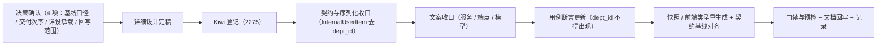

# 01 实施记录 · 平台用户只读出口字段收口（`dept_id` 移除）

> RBAC 基础模块 · 02 用户与角色 · 01 用户完整域后端 · 嵌套子任务 01（需求 07-11 / 07-2；2026-10-09）｜Kiwi **2275**

[文档首页](../../../../../../../文档首页.md) › [02 用户与角色](../../../02_用户与角色.md) › [01 用户完整域后端](../../02_用户与角色_01_用户完整域后端.md) › 实施记录　|　[← 任务文档](../02_用户与角色_01_用户完整域后端_01_平台用户只读出口字段收口.md) · [详细设计](../设计/01_详细设计_01_平台用户只读出口字段收口.md) · [测试记录](../测试/01_测试记录_01_平台用户只读出口字段收口.md)

## 1. 实施信息 <a id="meta"></a>

| 项 | 值 |
| --- | --- |
| 任务 | [01 平台用户只读出口字段收口](../02_用户与角色_01_用户完整域后端_01_平台用户只读出口字段收口.md)（需求 [07-11](../../../../../需求/02_需求_用户与角色.md#r07-11) / [07-2](../../../../../需求/02_需求_用户与角色.md#r07-2)） |
| 依据 | [详细设计](../设计/01_详细设计_01_平台用户只读出口字段收口.md)（定稿 2026-10-09，4 项决策确认） |
| 实施日期 | 2026-10-09 |
| 实施人 | minjian |
| 实施环境 | 开发机（Ubuntu，Python 3.14 / uv）；SQLite 内存库（用例级） |
| 前置 | mdm 阶段一 `01_02/_02`（用户-部门多分配与主要岗位标记，**已交付**）；`02_06` 平台用户只读出口内部契约（**已交付**） |
| Kiwi 用例 | **2275**（分类「平台骨架」/ P2 / CONFIRMED / 标签「自动化」，**先登记后编码**） |
| 结论 | 完成 |

## 2. 实施概览 <a id="overview"></a>



## 3. 实施过程 <a id="process"></a>

1. **上下文与口径**：读 bms《AI开发规范》《后端开发规范》、需求 07-11 / 07-2、阶段七计划与域 02 父任务、`02_06` 任务与详设、`internal_users` 端点与 `InternalUserItem` 契约、平台 `sys_user` 模型与表文件；并核对**消费方 mdm**（`mdm_org/org/user_source.py` 与 `test_org_open_read_api.py`）——两者均**已不消费** `dept_id`（`_ITEM_COLUMNS` 仅四列、用例断言 `"dept_id" not in`），确认本任务为**纯 platform 侧收口**、无功能缺口。
2. **决策确认（question 工具，4 项）**：① 契约基线口径——**就地移除 + 更新平台契约基线**（不升 `/api/v2`、不并行保留旧出口）；② 交付次序——**现在独立实施并先行交付**（原登记为与 `02_02` 同批）；③ 详设承载——**本子任务单独立详细设计**；④ 回写范围——**需求 07-2 正文修订**，概要设计 03 事件表与 mdm 陈旧文案**本次不改**（登记遗留）。
3. **Kiwi 先登记后编码**：登记输入 `test/scripts/kiwi/cases/2026-10-09_bms07_02-01-01_平台用户只读出口字段收口.json`（经 `register_cases.py` 走 Kiwi 容器 Django shell），平台回读编号 **2275**；用例代码以 `@pytest.mark.kiwi_id(2275)` 标注（叠加在既有 `2257` 之上）。
4. **契约与序列化收口**：`schemas/users.py` 的 `InternalUserItem` **删除 `dept_id` 字段**并补「不含组织字段」说明；`api/internal_users.py` 的 `_internal_item()` 删除 `dept_id=None` 并改 docstring；`services/users.py` 的 `InternalUserQueryService` docstring 与 `models/user.py` 模块 docstring 同步改口径（`sys_user` 不含组织字段、用户-部门 / 岗位关系归 mdm）。
5. **用例更新**：`tests/users/test_internal_query.py` 断言由 `item["dept_id"] is None` 改为 **`"dept_id" not in item`**；文件 docstring 与端点用例标注补 Kiwi 2275。
6. **契约产物与基线**：`ops.contract_snapshot export` 重生成（仅 `deploy/contracts/platform.json` 变更）→ `pnpm --filter @bms/api-types gen` 重生成前端类型（仅 `platform.ts` 变更）→ `ops.contract_gate baseline-update --service platform` 更新平台契约基线。
7. **文档回写**：本任务文档（状态块改交付物 / 交付次序修订 / 已完成块）、`02_06` 任务文档与详设（§3.3 / §6 / §8 #1 与 #6 / §9 #4）、`02_06` 实施与测试记录、需求 07-2（§1 域说明 / §2 内容与完成标准 / 实现期要点修订块）与 07-11（交付进度块）、**计划**（进度唯一落点）、域 02 父任务、`02_01` 实施记录遗留 #8。

## 4. 实施结果 <a id="result"></a>

| # | 交付物 | 落点 | 说明 |
| --- | --- | --- | --- |
| 1 | 响应契约移除 `dept_id` | `services/platform/src/bms_platform/schemas/users.py` | `InternalUserItem` 字段集 `id` / `username` / `name` / `status` / `phone` / `email` |
| 2 | 端点映射与文案 | `services/platform/src/bms_platform/api/internal_users.py` | `_internal_item()` 去 `dept_id=None`；说明改「不含组织字段」 |
| 3 | 服务与模型文案 | `services/platform/src/bms_platform/services/users.py`、`models/user.py` | 口径改「用户-部门关系归 mdm」 |
| 4 | 用例断言 | `services/platform/tests/users/test_internal_query.py` | `"dept_id" not in item`；标注 Kiwi 2257 + 2275 |
| 5 | 公开契约快照 | `deploy/contracts/platform.json` | 重生成（`InternalUserItem` 去 `dept_id`） |
| 6 | 前端契约类型 | `frontend/packages/api-types/src/platform.ts` | 重生成（`dept_id` 属性移除） |
| 7 | 平台契约基线 | `deploy/contracts/baseline/platform.json` | `contract_gate baseline-update --service platform` 对齐（破坏性变更口径） |

**无迁移**：`sys_user` **无 `dept_id` 列**（模型与《数据表设计 · `sys_user`》均不含该字段），故无 Alembic 变更。

## 5. 验证 <a id="verify"></a>

```bash
$ cd bms/backend
$ uv run pytest services/platform/tests/users -q        # 20 passed
$ uv run ruff check .                                   # All checks passed!
$ uv run ruff format --check .                          # 1101 files already formatted
$ uv run pyright                                        # 0 errors, 0 warnings, 0 informations
$ uv run python -m ops.contract_snapshot export         # 仅 platform.json 变更
$ uv run python -m ops.contract_snapshot check          # 通过：9 个启用服务快照与公开契约一致
$ uv run python -m ops.check_contracts                  # 通过（实现路由 ⊆ 契约 / 无空 schema）
$ python3 scripts/tools/preflight/check-preflight.py --fast   # 全部通过
```

**契约破坏性判定（本机 oasdiff 缺 docker，改用结构化比对）**：基线刷新前 ↔ 刷新后逐叶子比对——**删除 4 叶**全部属 `InternalUserItem.properties.dept_id`（`anyOf[0].type` / `anyOf[1].type` / `description` / `title`），**变更 1 处**为 `InternalUserItem.description`（本次文案补充），**新增 225 叶**系此前未追平的**加性变更**（`02_01` 用户完整域端点与 `05_07` 事务管理器分支端点在 platform 侧的新增路由 / schema），**无其他删除或收窄**。`ops.contract_gate check` 的 oasdiff `breaking` 判定在 CI（mjbk 预拉 `tufin/oasdiff:v1.32.1`）内复验。

> **基线一次性追平说明**：平台契约基线自 `527ba258a`（`02_03/_01`）后未再刷新，`02_01` 与 `05_07` 的公开契约新增均为**加性**（门禁放行）而未回写基线；本次经 `baseline-update` 一次性对齐（旧基线 + 本次破坏性移除 → 新口径），使基线与实时契约重新一致，后续破坏性变更可被门禁捕获。

## 6. 登记回写 <a id="register"></a>

| 内容 | 落点 | 状态 |
| --- | --- | --- |
| 公开契约快照 / 前端类型 / 契约基线 | `deploy/contracts/platform.json`、`frontend/packages/api-types/src/platform.ts`、`deploy/contracts/baseline/platform.json` | 已重生成 / 已对齐 |
| `02_06` 任务文档与详设（字段口径与开放项） | `02_06` 任务文档 §2 / 详设 §3.3 / §6 / §8 / §9 | 已回写 |
| `02_06` 实施与测试记录（遗留注销留痕） | `02_06` 实施记录 §7 / 测试记录 §6 | 已回写 |
| 需求 07-2（§1 域说明 / §2 内容 · 完成标准 / 实现期要点修订块）与 07-11（交付进度块） | 《02_需求_用户与角色》 | 已回写 |
| 阶段七计划（**进度唯一落点**）：头部计数与投入、执行序、§2 已完成表新增行、§3 剩余表移除行、§4 进度图去节点、§7 台账第 21 项 | 《01_计划_RBAC基础模块》 | 已回写 |
| 域 02 父任务（组织主数据依赖 / 执行序 / 追加子任务进展） | 《02_用户与角色》 | 已回写 |
| `02_01` 实施记录遗留 #8（组织字段与关系）闭环 | `02_01` 实施记录 §6 | 已回写 |
| Kiwi TCMS | 用例编号 **2275**（输入文件落 `test/scripts/kiwi/cases/`） | 已登记并回读编号 |

## 7. 偏差与遗留 <a id="open"></a>

| # | 事项 | 归口 |
| --- | --- | --- |
| 1 | 概要设计 03 §事件表仍列 `sys.user.created/updated/deleted` 载荷含 `dept_id`（`02_01` 交付时已移除）——**本次未选**（决策 4） | 概要设计收口（登记遗留，未执行） |
| 2 | mdm 侧陈旧文案：`mdm_org/org/default.py` docstring「`sys_user.dept_id` 落地后切换为平台字段过滤」与 `01_03` 详设 §5.2「过渡口径」/ §11 开放项——**本次未选**（决策 4） | mdm 仓库（登记遗留，未执行；mdm 代码已不消费该字段，无功能缺口） |
| 3 | 契约破坏性结论本机无 oasdiff 复验（缺 docker） | CI `contract-gate` 作业按需触发复验 |
| 4 | 服务白名单是否扩展（其余平台 / 产品服务经服务身份读取） | 按消费方接入追加 |
| 5 | 真实租户库（MySQL / PostgreSQL / 达梦）实建与网关联调 | 部署联调任务 |

> 本文档依《[文档生成规范](../../../../../../../规范/文档生成规范.md)》与《[AI开发规范](../../../../../../../规范/AI开发规范.md)》编写
