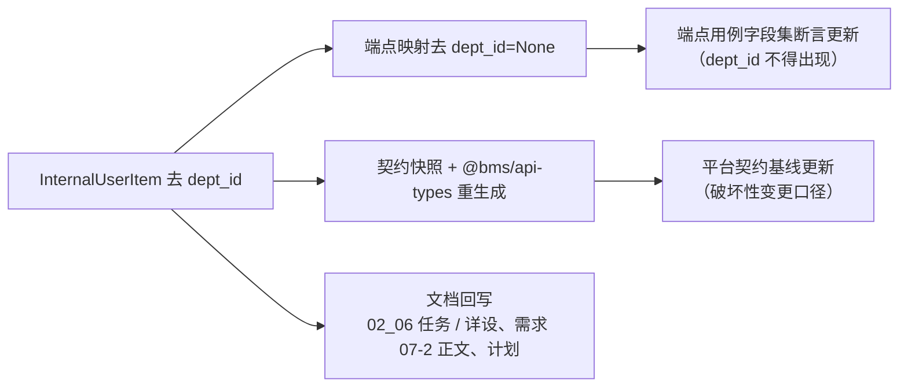

# 01 详细设计 · 平台用户只读出口字段收口（`dept_id` 移除）

> RBAC 基础模块 · 02 用户与角色 · 01 用户完整域后端 · 嵌套子任务 01（需求 07-11 / 07-2）｜**定稿（2026-10-09，共 4 项决策确认）**

[文档首页](../../../../../../../文档首页.md) › [02 用户与角色](../../../02_用户与角色.md) › [01 用户完整域后端](../../02_用户与角色_01_用户完整域后端.md) › 详细设计　|　[← 任务文档](../02_用户与角色_01_用户完整域后端_01_平台用户只读出口字段收口.md)

## 1. 背景与目标 

需求 [07-11](../../../../../需求/02_需求_用户与角色.md#r07-11)（2026-10-09 立项）确认：**用户-部门关系整体归 mdm**（`org_user_dept`，含 `is_primary` 主要部门标记），`sys_user` **不落任何组织字段**。原 `sys_user.dept_id` 单值逻辑外键设计**取消**——它与「组织关系归 mdm」的边界相抵（cws 无 mdm 时该字段恒空、无对象可指），也不支持「一人多部门」。

[`02_06` 平台用户只读出口内部契约](../../../02_用户与角色_06_平台用户只读出口内部契约/02_用户与角色_06_平台用户只读出口内部契约.md)在响应契约里保留了 `dept_id`（当时标注「可空——`sys_user.dept_id` 随需求 07-2 落字段后自动生效，未落恒 `null`」）。该字段**从未落库、恒 `null`**，且部门关系已由 mdm 自持、**无需 platform 回传**。

**目标**：把 `POST /api/v1/platform/internal/users/query` 的响应项中的 `dept_id` **移除**，并完成契约快照 / 前端类型 / 契约基线 / 用例断言 / 文档的零漂移收口。

## 2. 范围 

| 含 | 不含（归口） |
| --- | --- |
| `InternalUserItem` 响应字段移除 `dept_id`（契约 + 序列化） | 入参变更（**本就不含 `dept_id`**，无入参改动） |
| 模型 / 服务 / 端点内相关文案收口（`sys_user` 不含组织字段） | 组织关系本体（用户-部门 / 用户-岗位与主要项）——整体归 **mdm**（`01_02/_02`，**已交付**） |
| 公开契约快照与前端 `@bms/api-types` 重生成 + 平台契约基线更新 | 概要设计 03 §事件表 `sys.user.*` 载荷文案（属 `02_01` 自身口径收口，**登记遗留**） |
| 出口用例字段集断言更新（`dept_id` 不得出现） | mdm 侧陈旧文案（`org/default.py` docstring、`01_03` 详设 §5.2/§11，**归 mdm 仓库，登记遗留**） |
| 需求 07-2 正文（§1 域说明 / §2 内容 · 完成标准）口径修订 | 用户完整域 CRUD / 启停 / 删除 / 重置密码（归 `02_01` 主体，已交付） |

## 3. 现状实测 

| # | 落点 | 现状 |
| --- | --- | --- |
| 1 | `services/platform/src/bms_platform/schemas/users.py` | `InternalUserItem` 含 `dept_id: int \| None`（恒 `None`） |
| 2 | `services/platform/src/bms_platform/api/internal_users.py` | `_internal_item()` 硬编码 `dept_id=None`；docstring 提及该字段 |
| 3 | `services/platform/src/bms_platform/services/users.py` | `InternalUserQueryService` docstring 提及 `dept_id`（恒 `None`） |
| 4 | `services/platform/src/bms_platform/models/user.py` | 模块 docstring 写「用户归属部门 `dept_id` 引用组织主数据」 |
| 5 | `deploy/contracts/platform.json`、`deploy/contracts/baseline/platform.json` | 两份均含 `InternalUserItem.dept_id` |
| 6 | `frontend/packages/api-types/src/platform.ts` | `InternalUserItem.dept_id?: string \| null` |
| 7 | `services/platform/tests/users/test_internal_query.py` | 断言 `item["dept_id"] is None` |
| 8 | mdm 消费方 `services/org/src/mdm_org/org/user_source.py` | **已不消费**：`_ITEM_COLUMNS = {"id","username","name","status"}`、`_to_user()` 不读该字段 |
| 9 | mdm 用例 `services/org/tests/open_read/test_org_open_read_api.py` | **已断言** `"dept_id" not in user_items[0]` |
| 10 | `设计/数据库设计/数据表设计/sys_user.md` | **无** `dept_id` 列（该字段从未落库，无迁移） |

> **结论**：消费方（mdm）已在本仓前置子任务 `01_02/_02` 完成同批切换，本任务为**纯 platform 侧收口**，无功能缺口。

## 4. 交付物清单 

| # | 交付物 | 落点（bms 仓库） |
| --- | --- | --- |
| 1 | 响应契约移除 `dept_id` | `services/platform/src/bms_platform/schemas/users.py` |
| 2 | 端点映射与文案收口 | `services/platform/src/bms_platform/api/internal_users.py` |
| 3 | 服务文案收口 | `services/platform/src/bms_platform/services/users.py` |
| 4 | 模型文案收口 | `services/platform/src/bms_platform/models/user.py` |
| 5 | 出口用例断言更新 | `services/platform/tests/users/test_internal_query.py` |
| 6 | 公开契约快照 + 前端类型 + 契约基线 | `deploy/contracts/platform.json`、`deploy/contracts/baseline/platform.json`、`frontend/packages/api-types/src/platform.ts` |

## 5. 接口与字段变更 

端点与鉴权**不变**：`POST /api/v1/platform/internal/users/query`（`require_service("org")`，东西向直连不经网关）。

### 5.1 响应契约前后对比 

`ApiResponse[BasePageResponse[InternalUserItem]]`：

| 字段 | 类型 | 变更 |
| --- | --- | --- |
| `id` | `int` | 不变 |
| `username` | `str` | 不变 |
| `name` | `str` | 不变 |
| `status` | `str` | 不变 |
| `phone` | `str \| None` | 不变（原样返回，脱敏归消费方） |
| `email` | `str \| None` | 不变（原样返回，脱敏归消费方） |
| ~~`dept_id`~~ | ~~`int \| None`~~ | **移除**（本任务） |

**不返回**（口径不变）：口令哈希、失败计数、锁定字段、密码策略字段、语言时区偏好。
**入参**（口径不变）：`keyword` / `status` / `ids` / `page` / `size`——**本就不含 `dept_id`**，无入参变更。

### 5.2 破坏性变更判定 

对内部服务间契约属**移除响应字段**：契约门禁（`ops.contract_gate`，oasdiff `breaking --fail-on ERR`，「只加不删」）**会判破坏性**。

| 项 | 口径 |
| --- | --- |
| 端点性质 | 内部端点（`require_service("org")`、不经网关），**不对外承诺兼容** |
| 消费方 | 白名单仅 mdm 组织服务；mdm 代码**已不消费**该字段（见 §3 第 8/9 项） |
| 处置 | 重生成快照与前端类型后，**更新平台契约基线**（`ops.contract_gate baseline-update --service platform`），使基线即新口径 |
| 不含 | 不升 `/api/v2`、不并行保留旧出口（无对外消费者，双出口只增维护成本） |

## 6. 失败分支与边界 

| 场景 | 处置 |
| --- | --- |
| mdm 消费方仍传 / 读 `dept_id` | 不适用：`_to_user()` 只读 `id/username/name/status/phone/email`，多余字段本就被忽略；本变更为**移除**，不会新增消费方失败面 |
| 旧发布实例（未升级 platform）返回含 `dept_id` | mdm 侧忽略多余字段，**前向兼容**；升级顺序无强约束 |
| 新发布实例返回不含 `dept_id` | mdm 侧不读该字段，**零影响** |
| 契约门禁基线漂移 | 由 `ops.contract_gate baseline-update` 显式更新并随本任务提交（**本机缺 docker 时**以结构化比对复核，oasdiff 结论由 CI `contract-gate` 作业复验） |
| 前端类型消费方 | `@bms/api-types` 的 `InternalUserItem` 仅供平台内部端点契约面参考，无业务 `.vue` 消费该字段（用户管理页不硬依赖 mdm） |

## 7. 测试设计与验收映射 

| 验收点 | 用例（`services/platform/tests/`） |
| --- | --- |
| 响应字段集**不含** `dept_id` | `users/test_internal_query.py`（断言改 `"dept_id" not in item`） |
| 其余字段口径不回退（`id` 字符串化 / `username` / `name` / `status` / `phone` / `email` 原样） | 同上 |
| 鉴权白名单与筛选 / 分页语义不回退 | 同上（服务层 + 端点层既有断言全绿） |
| 契约零漂移 | `ops.contract_snapshot check` + `api-types gen:check` + `ops.check_contracts` |
| 契约基线即新口径 | `ops.contract_gate`（基线更新后与实时契约兼容；CI 内 oasdiff 复验） |
| 门禁 | `pytest`（受变更影响范围）/ `ruff` / `format` / `pyright`（strict）/ `preflight --fast` 全绿 |
| Kiwi 用例关联 | 一任务一条；**先登记 Kiwi 再编码**，代码标 `@pytest.mark.kiwi_id(<编号>)` |
| 原型对照 | **不适用**：变更集无界面源码（`frontend/apps/**` 与 `frontend/packages/ui-ep/**` 零改动；仅 `packages/api-types` 契约类型产物重生成） |

## 8. 登记落点 

| 内容 | 落点 |
| --- | --- |
| 出口响应字段收口 | `02_06` 详细设计（§3.3 响应契约、§8 开放项）+ 本任务与详设 |
| 需求 07-2 正文口径 | 需求《02_需求_用户与角色》§1 域说明、§2 内容 · 完成标准（正文与 2026-10-09 交付注块一致） |
| 进度（状态 / 投入 / 完成日期 / 窗口） | 阶段七计划（**唯一落点**） |
| 公开契约快照 / 前端类型 / 基线 | `deploy/contracts/platform.json`、`deploy/contracts/baseline/platform.json`、`frontend/packages/api-types/` |
| 跨仓消费方 | mdm 阶段一 `01_02/_02`（**已交付**）与其计划「遗留注销」登记 |

## 9. 边界与开放项 

| # | 事项 | 归口 |
| --- | --- | --- |
| 1 | 概要设计 03 §事件表 `sys.user.created/updated/deleted` 载荷仍列 `dept_id`（`02_01` 交付时已移除） | 概要设计收口（**登记遗留**，本次不改） |
| 2 | mdm 侧陈旧文案（`org/default.py` docstring、`01_03` 详设 §5.2「过渡口径」/ §11 开放项） | mdm 仓库（**登记遗留**，本次不改；mdm 代码已不消费该字段，无功能缺口） |
| 3 | 服务白名单是否扩展（其余平台 / 产品服务经服务身份读取） | 按消费方接入追加 |
| 4 | 真实租户库（MySQL / PostgreSQL / 达梦）实建与网关联调 | 部署联调任务 |

## 10. 决策记录 

| # | 决策项 | 结论 |
| --- | --- | --- |
| 1 | 契约基线口径 | **就地移除 + 更新平台契约基线**（不升 `/api/v2`、不并行保留旧出口） |
| 2 | 交付次序 | **现在独立实施并先行交付**（mdm 前置已就绪、与 `02_02` 无耦合） |
| 3 | 详设承载 | 本子任务**单独立详细设计**，并在 `02_06` 详设回写指向 |
| 4 | 回写范围 | 需求 07-2 **正文修订**；概要设计 03 事件表与 mdm 陈旧文案**本次不改**（登记遗留） |
| 5 | 移除方式 | 直接删字段（非弃用标记 / 非保留空值）——该字段从未落库、恒 `null`，无历史消费 |
| 6 | 迁移 | **无迁移**（`sys_user` 无 `dept_id` 列，模型与表文件均不含该字段） |

## 11. 参考文档 

- 需求 [07-11](../../../../../需求/02_需求_用户与角色.md#r07-11)、[07-2](../../../../../需求/02_需求_用户与角色.md#r07-2)
- [02_06 平台用户只读出口内部契约](../../../02_用户与角色_06_平台用户只读出口内部契约/02_用户与角色_06_平台用户只读出口内部契约.md) 与其[详细设计](../../../02_用户与角色_06_平台用户只读出口内部契约/设计/01_详细设计_06_平台用户只读出口内部契约.md)
- 《[概要设计 · 用户管理](../../../../../../../设计/概要设计/03_概要设计_用户管理.md)》§1（`sys_user` 不含组织字段）；[sys_user 表文件](../../../../../../../设计/数据库设计/数据表设计/sys_user.md)
- 《[后端开发规范](../../../../../../../规范/后端开发规范.md)》；《[文档生成规范](../../../../../../../规范/文档生成规范.md)》

> 本文档依《[文档生成规范](../../../../../../../规范/文档生成规范.md)》与《[AI开发规范](../../../../../../../规范/AI开发规范.md)》编写
