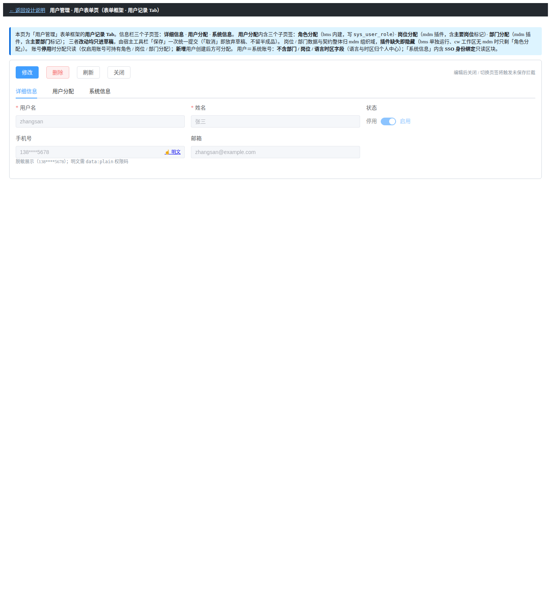

# 01 测试记录 · 用户分配页签与插件子页签挂接

> 归属：RBAC 基础模块 · 02 用户与角色 · 子任务 02 · 嵌套子任务 01

[文档首页](../../../../../../../文档首页.md) › [02 用户与角色](../../../02_用户与角色.md) › [02 用户管理前端](../../02_用户与角色_02_用户管理前端.md) › [01 用户分配页签与插件子页签挂接](../../02_用户与角色_02_用户管理前端_01_用户分配页签与插件子页签挂接.md) › 测试记录

## 1. 用例与覆盖 

**Kiwi 2276**（`07 02-02/_01 用户分配页签与插件子页签挂接`）+ **Kiwi 2277**（用户管理前端，页签结构性用例）

| 用例 | 断言要点 | 结果 |
| --- | --- | --- |
| `user-assign-slot.spec.ts` · 挂接位 | 「用户分配」页签内挂接位为**单个** `ModuleAreaOutlet`（`variant=tabs` / `tabType=card` / `area=sys.user.detail.tabs`），上下文注入 `userId` 与 `registerSubmitter`（函数） | passed |
| `user-assign-slot.spec.ts` · 停用态 | 账号停用时给出分配只读提示 | passed |
| `user-assign-slot.spec.ts` · 新增态 | 新增态不渲染插件挂接位，提示创建后可分配 | passed |
| `user-assign-slot.spec.ts` · 权限缺省空态 | `session.codes` 为空（区域项全被过滤）时挂接位显示空态文案、不留空白 | passed |
| `module-area-outlet.spec.ts` · 空态补白 | 区域项全被过滤时按 `emptyText` 渲染提示；未给 `emptyText` 保持空页签带 | passed |
| `module-registration.spec.ts` · 平台区域项 | 平台自身注册走统一装配入口；`sys:user-detail-roles` 与模块项**同槽**、按 `order` 稳定排序、按权限码显隐；释放后无残留 | passed（2 例更新） |
| mdm `slot-draft.spec.ts` · 宿主收草稿 | 有宿主通道 ⇒ 只记草稿（不写库）、`isDirty` 为真；`buildSegment()` 段名与全量集合正确、主要项越界置空；`reload()` 后回到干净态；无通道 ⇒ 自提交兜底 | passed |
| mdm `slots.spec.ts` / `module-definition.spec.ts` | 四插件挂接位与标题（用户侧「岗位分配」/「部门分配」） | passed |
| mdm `contract-alignment.spec.ts` | 契约管理面覆盖（排除出口 / 内部写通道 / 事务参与端点） | passed |

## 2. 原型对照 

原型依据：`设计/原型设计/08_用户管理/03_用户表单页.html`（2026-10-09 二次迭代版）。

| 原型要素 | 实现落点 | 对照要点 | 结论 |
| --- | --- | --- | --- |
| 「用户分配」页签内三子页签**同一行并列** | `UserRecordTab.vue` 单个 `ModuleAreaOutlet` + 平台区域项 `sys:user-detail-roles`(10) / mdm `user-posts`(20) / `user-depts`(30) | 三个页签由同一 outlet 渲染，顺序与原型一致 | 通过 |
| 子页签**卡片式**（`type="card"`） | `ModuleAreaOutlet` 透传 prop `tabType="card"` | 页签带样式与原型一致 | 通过 |
| 岗位 / 部门分配**改动进草稿、随宿主「保存」提交** | `useAssignment` 草稿契约 + `UserRecordTab` 收集并一次提交 | 文案与交互与原型一致（原型已同步修订） | 通过 |
| 分配列表**不设「操作（解绑）」列**，取消分配经弹窗取消勾选 | mdm 四面板（列表列集合与原型一致） | 列集合一致 | 通过 |
| 「主要岗位 / 主要部门」标记 | mdm 面板主要项单选列 + 段载荷 `primary_*` 字段 | 至多一项、越界即拒 | 通过 |
| 账号**停用**分配只读提示 / **新增**态提示先创建 | `UserRecordTab.vue` 停用提示与新增态降级 | 提示文案与原型一致 | 通过 |
| 插件缺失即隐藏、不报错 | `ModuleAreaOutlet` 空区域不渲染 | bms 单独运行（无 mdm）时仅剩「角色分配」 | 通过 |
| 子页签**空态补白**（权限缺省 / 插件全未加载） | `ModuleAreaOutlet` `emptyText` 透传 + `UserRecordTab` 传入文案 | 无可用子页签时显示「暂无可用的分配项…」、不留空白（原型已补） | 通过 |

**原型基准截图**（原型侧，由无头 Chrome 渲染 `file://` 原型页取得；实现侧运行截图取证见 §4 结论）：

**实现侧截图**（2026-10-09 真机走查：本地全套后端 + 宿主 dev，管理员登录；`localhost:5173`；无头 Chrome）

**走查发现与处置**（2026-10-09）

| # | 现象 | 判定 | 处置 |
| --- | --- | --- | --- |
| 1 | 挂接位渲染正确（DOM 含 `data-area="sys.user.detail.tabs"` / `data-variant="tabs"` / `el-tabs--card`），但**权限码集合为空**时三条子页签均被过滤 ⇒「用户分配」页签整体空白、无提示 | ①`tabType` 透传与挂接位**验证通过**；②页签空态缺文案（本任务改进项）；③**根因（2026-10-09 定位）**：宿主 `session.codes` 恒空——登录载荷不含权限码、`session.signIn` 未传 `codes`，按权限显隐读 `session.codes` 的项全被过滤 | ②**已闭环（2026-10-09）**：`ModuleAreaOutlet` 增 `emptyText` 透传 + 宿主记录页传入文案（不留空白）；ui-ep 与宿主用例各补 1 例；原型同步补空态。③**已修根因（2026-10-09，随 `02_03/_02`）**：菜单装载回填 `session.codes`（单一来源），`main.ts` 会话订阅改为仅 token 变化联动（防回环）；见[`02_03/_02` 实施记录 §4](../../../02_用户与角色_03_角色管理/02_用户与角色_03_角色管理_02_角色分配插件随宿主保存编排/实施/01_实施_02_角色分配插件随宿主保存编排.md)与计划 §7 台账第 22 项 |
| 2 | 模块宿主未起 ⇒ mdm 岗位 / 部门插件不渲染，仅剩平台内建项（本例因权限缺省同为隐藏） | **预期降级**（插件缺失即隐藏、不报错） | 无需处置 |
| 3 | 内置管理员未绑定 `system_admin` ⇒ 接口 `403`（种子缺口，归 `03_02` / `04_01`） | 环境（非本任务代码缺陷） | 本地临时补绑（仅本地库）；正式种子待 `03_02` / `04_01` |
| 4 | **宿主收草稿链路真机不可达**：mdm 插件取不到 `userId` / `registerSubmitter`（面板示「当前页面未提供实体标识」）——与父记录第 5 项同因：`@bms/core` / `@bms/ui-ep` 为 `notShared` ⇒ 宿主与插件各持一份 `MODULE_SLOT_CONTEXT_KEY`，`inject` 断裂 | **跨仓实质缺陷**（生产形态下显式上下文通道不生效；路由参数回退对页签式宿主页无效） | **需拍板**：基座包共享化（版本化 + 共享域）或 换不依赖 Symbol 单例的通道；修复后须重走「插件草稿随宿主保存」真机链路（含 mdm 在场） |
| 5 | `01_01` 闭环走查：本机托管重建后的 `mdm-org@0.1.0` 产物 ⇒ 三子页签真机渲染（角色 10 / 岗位 20 / 部门 30），标题与 order 与原型一致 | 挂接层**通过** | 证据见父记录 §2 附图（三子页签 / 岗位分配 / 部门分配） |

## 3. 门禁 

| 项 | 命令 | 结果 |
| --- | --- | --- |
| 宿主用例 | `npx vitest run`（`frontend/apps/desktop`） | 296 passed / 49 文件 |
| 组件库用例 | `npx vitest run`（`frontend/packages/ui-ep`） | 946 passed（含新增 `tabType` 透传与空态补白用例） |
| 类型 / 风格 | `npx vue-tsc -b` / `npx eslint . --max-warnings 0` | 0 问题 |
| mdm 模块用例 | `npx vitest run`（`mdm/frontend/modules/org`） | 37 passed |
| Kiwi 登记 | 用例编号 **2276**（本子任务）与 **2277**（父任务） | 已登记回读 |

## 4. 结论 

三子页签并列结构、卡片式形态、宿主收草稿提交口径与各类降级**按原型与详设落地**，组件级用例与结构性断言通过；逐页对照（见 §2）未发现缺失或偏离项。

**实现侧截图已取**（2026-10-09，真机 / 无头 Chrome，见 §2）：新增态降级提示、挂接位与卡片式页签形态（DOM 级复核）。逐页比对**未发现布局偏离或缺失项**；权限缺省时的页签空态已补白并复验（§2 表第 1 项，**已闭环**）。

> 本文档依《[文档生成规范](../../../../../../../规范/文档生成规范.md)》编写
