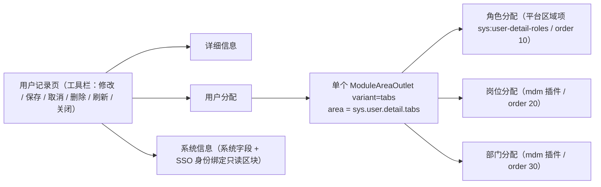

# 01 详细设计 · 用户分配页签与插件子页签挂接

> RBAC 基础模块 · 02 用户与角色 · 子任务 02 · 嵌套子任务 01（需求 07-11）

[文档首页](../../../../../../../文档首页.md) › [02 用户与角色](../../../02_用户与角色.md) › [02 用户管理前端](../../02_用户与角色_02_用户管理前端.md) › [01 用户分配页签与插件子页签挂接](../02_用户与角色_02_用户管理前端_01_用户分配页签与插件子页签挂接.md) › 详细设计

## 1. 背景与目标 <a id="goal"></a>

用户记录页的「用户分配」页签要与角色记录页「角色分配」页签对称：内含 角色分配（bms 内建）+ 岗位分配 / 部门分配（mdm 插件）三子页签，含「主要岗位 / 主要部门」标记，**插件缺失即隐藏、不报错**。三者都改同一批业务数据（用户直接角色 + mdm 组织分配），需求 [07-11](../../../../../需求/02_需求_用户与角色.md#r07-11) 要求**随宿主工具栏「保存」一次提交**，跨服务写入由 platform 编排端点（子任务 [`_02`](../../02_用户与角色_02_用户管理前端_02_用户保存编排端点/02_用户与角色_02_用户管理前端_02_用户保存编排端点.md)）保证原子。

本任务负责**宿主侧**：页签结构、具名插槽出口、上下文注入（`userId` + `registerSubmitter`）、插件草稿收集与一次提交、插件缺失降级；并同步改造 mdm 四插件的草稿契约（跨仓）。

## 2. 范围与交付物 <a id="scope"></a>

| 含 | 不含（归口） |
| --- | --- |
| 「用户分配」页签结构（三子页签同槽并列、卡片式页签） | 编排端点与后端一致性（`_02`） |
| 平台内建「角色分配」区域项注册；阶段五样例区域项退役 | 具名插槽机制本体（阶段五 `06_01` / `06_03` 已交付，**不改机制**） |
| 上下文注入 `{ userId, registerSubmitter }` 与宿主保存收集 | 用户列表页 / 账号锁定页（父任务 `02_02` 自有部分） |
| 插件草稿契约改造（mdm 四插件 + 无宿主时自提交兜底） | 角色侧同口径改造（`02_03/_02`） |
| 权限显隐、停用只读、新增态提示 | 岗位 / 部门主数据与分配写契约（mdm 已交付） |

**交付物**：本目录 `设计/`（本详设）、`实施/`、`测试/`；代码落点见第 4 ~ 7 节。

## 3. 现状实测 <a id="status"></a>

| 项 | 实测结论 | 取证落点 |
| --- | --- | --- |
| 插槽机制 | 已交付：区域项声明（`key` / `area` / `component` / `order` / `title` / `icon` / `perm` / `when`）、`inline` / `tabs` 两形态、显式上下文只读注入、权限过滤、缺失不渲染 | `packages/ui-ep/src/components/layout/ModuleAreaOutlet.vue`、`composables/useModuleArea.ts` |
| `tabs` 形态 | **自带一整套 `el-tabs`**（每项一个 `el-tab-pane`，标题取 `title`），页签类型固定为默认 `line` | 同上 |
| 平台内建区域项 | 当前挂 `sys:user-detail-basic`（「账号信息」，`sys.user.detail.tabs`，`order` 10）——为阶段五样例项 | `apps/desktop/src/module/registries.ts`、`components/UserDetailBasicTab.vue` |
| mdm 插件 | 四件已交付：`mdm-org:user-posts`(20)、`mdm-org:user-depts`(30) 挂 `sys.user.detail.tabs`；`mdm-org:role-posts`(20)、`mdm-org:role-depts`(30) 挂 `sys.role.detail.assign`；上下文 `userId`（显式优先 / 路由兜底）、均读 `registerSubmitter` | mdm `frontend/modules/org/src/index.ts`、`components/slots/*.vue` |
| 插件提交器 | 现契约为 `HostSubmitterEntry { submit(): Promise<void>; isDirty(): boolean }`——`submit` 由插件**自行提交到 mdm**；宿主未提供通道时插件自提交兜底 | mdm `composables/useAssignment.ts`、`components/slots/AssignPanel.vue` |
| 记录页框架 | 已交付：`FormFrame` + `stores/tabs.ts`（列表页签固定 + 记录页签、脏标记与关闭拦截） | `packages/ui-ep/src/components/layout/FormFrame.vue`、`apps/desktop/src/stores/tabs.ts` |
| 角色分配子页签参照 | 角色记录页「角色分配」页签已交付：bms 内建用户分配 + `ModuleAreaOutlet variant="tabs"` 挂 mdm 插件 | `apps/desktop/src/views/system/role/RoleAssignTab.vue` |
| 请求层与契约 | 宿主页面经 `@/api/request` 的 `get/post/put/del(service, path)`；类型取 `@bms/api-types` | `apps/desktop/src/api/request.ts`、`api/role.ts`、`api/user.ts` |

## 4. 页签结构与槽挂接 <a id="structure"></a>

### 4.1 记录页信息栏 <a id="layout"></a>

`详细信息` / `用户分配` / `系统信息` 三页签；「用户分配」内三子页签**同一行并列**：



**为什么用「平台区域项 + 单 `outlet`」**：`ModuleAreaOutlet` 的 `tabs` 形态自带一整套 `el-tabs`，无法与宿主自建 `el-tab-pane` 合到同一行；把 bms 内建「角色分配」也按**同一登记通道**注册为平台区域项，即可让三者由**同一个 `outlet`** 渲染为并列子页签——**机制零改动**，且与既有「同槽多来源（平台内建项 + 模块插件项共用同一槽、按 `order` 稳定排序）」口径一致。

### 4.2 平台区域项与样例项 <a id="platform-region"></a>

| 项 | 动作 | 说明 |
| --- | --- | --- |
| `sys:user-detail-roles` | **新增**平台区域项：`area=sys.user.detail.tabs`、`order=10`、`title=角色分配`、组件＝角色分配子面板 | 与 mdm 岗位 / 部门同槽并按 `order` 排在最前 |
| `sys:user-detail-basic`（「账号信息」） | **退役**：移除注册并删除其组件 | 正式页「详细信息」页签已承接账号信息，避免该样例项混入「用户分配」子页签 |
| 阶段五样例宿主页 `SysUserDetailView.vue` | **保留不动**（静态路由、不进生产菜单） | 其区域项来自同一注册表，退役样例项后该页仅渲染三方区域项（含平台「角色分配」）；宿主隔离护栏断言不变 |

### 4.3 子页签视觉形态 <a id="tab-type"></a>

原型「用户分配」子页签为卡片式（`type="card"`）。给 `ModuleAreaOutlet` 追加**透传 prop** `tabType`（`'' | 'card' | 'border-card'`，缺省 `''`＝默认 `line`）并透传给内部 `el-tabs`——属**展现层小改**，不涉注册 / 解析 / 降级 / 上下文机制。

### 4.4 上下文注入 <a id="context"></a>

记录页对 `outlet` 注入（响应式、浅冻结）：

| 键 | 值 | 说明 |
| --- | --- | --- |
| `userId` | 当前用户主键（字符串） | 非路由承载页，插件经 `useModuleSlotField('userId')` 读取（路由兜底保留） |
| `registerSubmitter` | 注册函数 `(entry) => void` | **值即函数本身**（`01_01` 约定）；插件挂载即登记，宿主保存时统一收集 |

## 5. 插件草稿契约（扩展） <a id="draft-contract"></a>

```ts
/** 分配段载荷（段名 + 全量值）。 */
export interface HostSubmitterSegment {
  key: 'user_posts' | 'user_depts'
  value: { post_ids?: string[]; dept_ids?: string[]; primary_post_id?: string | null; primary_dept_id?: string | null }
}

/** 宿主提交器登记入参（扩展：携带草稿）。 */
export interface HostSubmitterEntry {
  isDirty: () => boolean
  buildSegment: () => HostSubmitterSegment | null
  reload: () => Promise<void>
}

/** 注册通道（上下文字段 `registerSubmitter` 的**值即该函数本身**）。 */
export type HostSubmitterRegistrar = (entry: HostSubmitterEntry) => void
```

| 项 | 口径 |
| --- | --- |
| 宿主未提供通道 | 插件**自提交兜底**（弹窗「确定」即立即覆盖到 mdm 端点）——保证角色侧「角色分配」页签与独立运行场景不回归可用性 |
| 宿主提供通道 | 插件**只记草稿**：`buildSegment()` 无改动返回 `null`；`isDirty()` 供宿主做脏标记与离开拦截；编排成功后宿主调 `reload()` 刷新 |
| 段名与 op 的映射 | 段名（`user_posts` / `user_depts`）由 **platform 编排端点**映射为 mdm 分支 op；插件**不感知** mdm 分支 op 名 |
| 兜底不变式 | 「主要项至多一个」由 mdm 服务侧保证（含并发），插件与宿主均不做唯一性兜底 |

## 6. 宿主保存编排（调用端） <a id="host-save"></a>

1. **收集**：记录页持有 `submitters: HostSubmitterEntry[]`（`registerSubmitter` 追加）；脏态 = 自身表单脏 `||` 任一 `entry.isDirty()`。
2. **提交**（工具栏「保存」）：
   - 组装请求：`profile`（仅当基础资料有改动，带 `version`）+ `role_ids`（角色分配段，`null` 表示未参与）+ 各插件 `buildSegment()` 结果按 `key` 装配为 `user_posts` / `user_depts`；
   - 调 `PUT /api/v1/users/{id}/assignments`（带 `Idempotency-Key`）；
   - 成功后：重置脏态、`emit('saved')` 供列表刷新页签标题、并逐个 `entry.reload()`；
   - 失败：保留草稿与编辑态、按错误码提示（不自动补偿——原子性由编排端点保证）。
3. **取消 / 关闭**：丢弃草稿（`entry` 无草稿丢弃接口，靠组件重挂载 / `reload()` 复位）。
4. **新增态**：无 `userId` 时不渲染分配子页签（改为提示「创建后可分配」），保存建号成功后进入编辑态。
5. **停用态**：账号停用时分配子页签只读并提示先启用（提交入口禁用；后端 `30045` 兜底）。

## 7. mdm 侧改造（跨仓） <a id="mdm"></a>

| 项 | 内容 |
| --- | --- |
| 提交器契约 | `useAssignment.ts` 的 `HostSubmitterEntry` 按第 5 节扩展：宿主提供通道 ⇒ 只记草稿并暴露 `buildSegment` / `isDirty` / `reload`；未提供 ⇒ 保持自提交兜底 |
| 四插件 | `UserPostsPanel` / `UserDeptsPanel` / `RolePostsPanel` / `RoleDeptsPanel` 与共用骨架 `AssignPanel.vue` 同步适配（分配列表**不设「状态」与「操作（解绑）」列**，取消分配经选择弹窗取消勾选） |
| 标题 | 用户侧两插件标题改「岗位分配」/「部门分配」（区域键与 `order` 不变），对齐需求 `07-11` §2 与原型子页签文案 |
| 用例 | 更新 `slot-draft.spec.ts` / `slots.spec.ts` / `module-definition.spec.ts` 断言；新增「宿主收集草稿」用例 |

> mdm 仓单独提交，推送另行确认。

## 8. 权限与字段 <a id="perm"></a>

- **按钮显隐**：工具栏「修改 / 保存 / 删除 / 重置密码 / 手动锁定」等按动作码显隐（`user:update` / `user:delete` / `user:reset_pwd` / `user:lock` / `user:unlock` / `user:assign_role`）；分配子页签的操作按钮由插件自带 `perm`（`org:update`），宿主**不二次兜底**。
- **字段收窄**：基础资料字段按 `sys_role_field` 收窄（不可见不渲染、不可编辑禁用）；手机号 / 邮箱按脱敏标记展示，`data:plain` 权限码下显示明文。
- **停用只读**：`status = disabled` 时分配子面板只读。

## 9. 登记落点 <a id="register"></a>

| 内容 | 落点 |
| --- | --- |
| 提交时机与编排约定（`registerSubmitter` 扩展为「宿主收草稿」） | 阶段七 `01_01` 详设「消费约定」节（与 `_02` 同批回写） |
| 槽宿主位置细化（`sys.user.detail.tabs` 出口在「用户分配」页签内） | `01_01` 详设（已登记，本任务落地） |
| `ModuleAreaOutlet` 新增透传 prop | 《[前端基类清单](../../../../../../../前端基类清单.md)》（如需列组件件签名的落点）与 ui-ep 用例 |
| 进度 | `07_RBAC/计划/01_计划_RBAC基础模块.md`（唯一落点） |

## 10. 测试设计与验收映射 <a id="test"></a>

| 验收点（任务 §3） | 证据 |
| --- | --- |
| 三子页签同一行并列、按 `order` 稳定排序 | 组件用例（`outlet` + 平台区域项 + 探针插件按序渲染）+ 原型对照 |
| 插件缺失即隐藏、不报错 | 探针用例：仅注册平台区域项 ⇒ 只渲染「角色分配」；空区域 ⇒ 不渲染 |
| 上下文注入与草稿收集 | 用例：注入 `userId` / `registerSubmitter`；插件登记后宿主可读到草稿并组装请求 |
| 随宿主保存一次提交 | 用例：工具栏「保存」⇒ 断言只发生一次编排端点请求且载荷含三段；「取消」⇒ 草稿丢弃 |
| 停用 / 新增态 | 用例：停用账号分配面板只读；新增态不渲染分配并给出提示 |
| 权限与字段 | 用例：按权限码显隐；字段收窄与脱敏标记 |
| 插件草稿契约（mdm） | mdm 用例：有宿主通道 ⇒ 只记草稿；无通道 ⇒ 自提交兜底 |
| 原型对照 | 按 `设计/原型设计/08_用户管理/03_用户表单页.html` 逐页对照，结论与截图登记测试记录 |

**Kiwi 用例**：本任务新增用例**先登记再编码**（编号回填用例文件与测试记录）。

## 11. 边界与开放项 <a id="open"></a>

| # | 事项 | 归口 |
| --- | --- | --- |
| 1 | 角色侧「角色分配」页签同口径改造（宿主收草稿） | `02_03/_02` |
| 2 | 插件内乐观并发与冲突提示 | mdm 组织域 |
| 3 | 分配子面板的「取消 / 关闭」复位由组件重挂载保证（契约未含草稿丢弃入口） | 本任务（如需可后续扩展 `revert()`） |
| 4 | 具名插槽按插槽治理（清单面板 / 按插槽归因） | 可观测子系统阶段 |

## 12. 决策记录 <a id="decision"></a>

| # | 决策项 | 结论 |
| --- | --- | --- |
| 1 | 三子页签并列实现 | 平台内建「角色分配」注册为区域项 + **单个** `ModuleAreaOutlet variant=tabs`（机制零改动）；阶段五样例区域项退役 |
| 2 | 子页签形态 | `ModuleAreaOutlet` 增透传 prop `tabType`（对齐原型 `type="card"`） |
| 3 | 插件提交时机 | **跟随宿主保存**（草稿 + 一次提交），取代「即时提交」；同步回写任务文档与原型 |
| 4 | 插件契约改造 | `registerSubmitter` entry 扩展为**携带草稿**（`isDirty` / `buildSegment` / `reload`）；保留无宿主时自提交兜底 |
| 5 | 停用账号分配 | 只读（与后端 `30045` 一致） |
| 6 | 新增态分配 | 不渲染分配子页签，提示创建后可分配 |

## 13. 参考文档 <a id="ref"></a>

- 需求 [07-11](../../../../../需求/02_需求_用户与角色.md#r07-11)、[07-2](../../../../../需求/02_需求_用户与角色.md#r07-2)
- 阶段七 [01_01 具名插槽挂接消费与依赖登记](../../../../01_插件化挂接/01_插件化挂接_01_具名插槽挂接消费与依赖登记/01_插件化挂接_01_具名插槽挂接消费与依赖登记.md)（消费约定与降级口径）
- 阶段五 [06_01 具名插槽基座功能与前后端配套插件](../../../../../../05_前端插件化/任务/06_具名插槽与插件挂接/06_具名插槽与插件挂接_01_具名插槽基座功能与前后端配套插件/06_具名插槽与插件挂接_01_具名插槽基座功能与前后端配套插件.md)、[06_03 显式上下文注入通道](../../../../../../05_前端插件化/任务/06_具名插槽与插件挂接/06_具名插槽与插件挂接_03_具名插槽显式上下文注入通道/06_具名插槽与插件挂接_03_具名插槽显式上下文注入通道.md)
- 《[组件设计 · 模块区域插槽](../../../../../../../设计/组件设计/03_布局组件类/12_组件设计_模块区域插槽/12_组件设计_模块区域插槽.md)》
- 原型：[08_用户管理 · 用户表单页](../../../../../../../设计/原型设计/08_用户管理/03_用户表单页.html)
- 兄弟子任务 [`_02` 用户保存编排端点](../../02_用户与角色_02_用户管理前端_02_用户保存编排端点/02_用户与角色_02_用户管理前端_02_用户保存编排端点.md)

> 本文档依《[文档生成规范](../../../../../../../规范/文档生成规范.md)》编写 · 关键决策逐项确认
