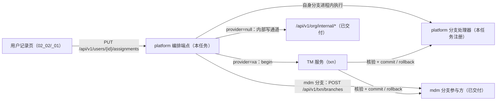
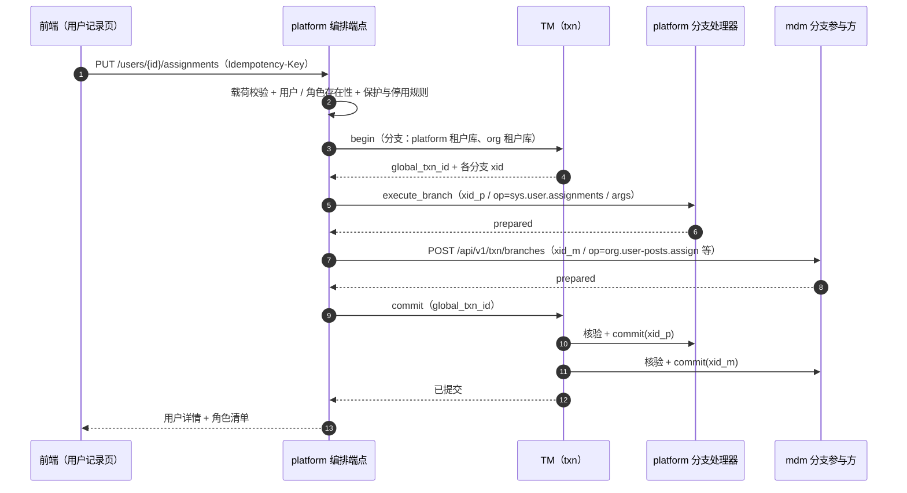

# 02 详细设计 · 用户保存编排端点（TM + XA）

> RBAC 基础模块 · 02 用户与角色 · 子任务 02 · 嵌套子任务 02（需求 07-11 · 接入阶段二 `05_07`）

[文档首页](../../../../../../../文档首页.md) › [02 用户与角色](../../../02_用户与角色.md) › [02 用户管理前端](../../02_用户与角色_02_用户管理前端.md) › [02 用户保存编排端点](../02_用户与角色_02_用户管理前端_02_用户保存编排端点.md) › 详细设计

## 1. 背景与目标 

用户记录页一次「保存」要同时改**两个服务的库**：本体（platform：用户基本信息 + 角色分配）与组织分配（mdm：用户-岗位 / 用户-部门 + 主要项）。需求 [07-11](../../../../../需求/02_需求_用户与角色.md#r07-11) §5 要求该组合**跨服务原子**；阶段二 [`05_07`](../../../../../../02_后端基座与服务化地基/任务/05_服务间通信与一致性/05_服务间通信与一致性_07_跨服务事务管理器强一致专项/05_服务间通信与一致性_07_跨服务事务管理器强一致专项.md) 已交付 **TM 基座 + 参与端点 + platform 分支路由 + mdm 分支参与方**，并把「**调用方接入**」明确归本任务（`05_07`「实施分解」节第 6 项）。

本任务在 platform 侧补上**编排端点**：一个请求内完成「platform 分支进程内执行 + mdm 分支远端执行」，由 TM 做提交决定，使「一次保存」要么全部生效、要么全部不生效（不产生「一侧已改、另一侧未改」）。

**为什么不做反向补偿**：`provider = xa` 下两阶段提交已给出原子性保证，`provider = null` 只存在于 dev / test（SQLite 无两阶段能力），mdm 侧已明确「过渡期基线与屏障判据属废路径」。故本设计**不含**补偿编排、基线快照与一致性屏障。

## 2. 范围与交付物 

| 含 | 不含（归口） |
| --- | --- |
| platform 编排端点（`PUT /api/v1/users/{user_id}/assignments`）与分段全量覆盖语义 | TM 基座与参与端点（`05_07` 已交付，本任务只接入） |
| platform 自身分支处理器注册（`sys.user.assignments`）与同步会话执行 | mdm 分支处理器与内部写通道（mdm `01_02/_03` 已交付） |
| 双路径：`xa` 全局事务 / `null` 顺序提交 | 角色侧的宿主保存编排（`02_03/_02`） |
| `LockItem` 增 `username` / `name`；`/sys/users` 字段元数据移除 `dept_id` | 插件草稿契约与前端页面（`02_02/_01`） |
| 契约快照 / 契约基线 / 前端 `@bms/api-types` 重生成 | 生产环境 `provider=xa` 的部署与参数（部署说明） |

**交付物**：本目录 `设计/`（本详设）、`实施/`、`测试/`；代码落点见第 4 ~ 6 节。

## 3. 现状实测 

> 实测时点 2026-10-09；取证落点为当前工作区源码与契约快照。

| 项 | 实测结论 | 取证落点 |
| --- | --- | --- |
| 调用方门面 | 已交付：`BaseTransactionManager`（`begin` / `commit` / `rollback` / `status`）与 `XaTransactionManager`（经服务间调用打 TM） | `libs/bms_core/src/bms_core/transaction/base.py`、`transaction/xa.py` |
| 参与方 | 已交付：`BaseTransactionParticipant.execute_branch/commit_branch/rollback_branch/branch_state/recover_branches` 与 XA 实现（单请求内 `XA_START → 写 → XA_END → XA_PREPARE`，`prepare` 后 `detach` 再 `close`） | `transaction/xa.py`、`transaction/base.py` |
| 参与端点契约 | 已交付：`build_branch_router()`（`POST /api/v1/txn/branches` 鉴权＝服务身份；commit / rollback / 状态核验＝`require_service("txn")`）+ 请求体 `BranchExecuteRequest{xid, db_key, op, args}` | `transaction/api.py` |
| platform 侧 | **分支路由已挂、分支处理器为空**：`build_branch_router()` 在 `api/router.py`；`app.state.branch_handlers = BranchHandlerRegistry()` 无任何 `op` 登记 | `services/platform/src/bms_platform/api/router.py`、`main.py` |
| mdm 侧 | 已交付：四组分支 op（`org.user-posts.assign` / `org.user-depts.assign` / `org.role-posts.assign` / `org.role-depts.assign`）与内部写通道 `/api/v1/org/internal/*`（服务身份白名单＝`platform`、支持 `Idempotency-Key`） | mdm `services/org/src/mdm_org/services/branch_handlers.py`、`api/internal.py` |
| TM 配置 | `[transaction_manager].provider` 缺省 `null`（**未启用强一致**）；另有 `branch_timeout_seconds` / `prepare_timeout_seconds` / `deadline_seconds` / `recovery_interval_seconds` / 领导者选举锁键 | `libs/bms_core/src/bms_core/core/config.py`「TransactionManagerSettings」、`core/assembly.py` |
| 库键口径 | `build_tenant_db_key(db_basis, service=...)`（本服务取相对键、他服务带 `{service}_` 段）；`db_basis` 为建库时冻结的租户编码 | `libs/bms_core/src/bms_core/db/keys.py` |
| 角色分配既有能力 | 已交付：`UserRoleRepository`（`list_role_ids_by_user` / `get_by_role_user` / `get_deleted_by_role_user` / `restore` / `soft_delete_by_role_user` / `count_by_user`）与 `RoleAssignService`（幂等 upsert、权限版本 +1） | `services/platform/src/bms_platform/repositories/role.py`、`services/role_assign.py` |
| 用户写能力 | 已交付：`UserAdminService`（`update_user` 乐观锁 / `update_status` 保护规则 / 事件发件箱） | `services/platform/src/bms_platform/services/users_admin.py` |

## 4. 接口设计 

### 4.1 端点与契约 

| 项 | 口径 |
| --- | --- |
| 方法 / 路径 | `PUT /api/v1/users/{user_id}/assignments` |
| 语义 | **分段全量覆盖**：请求中出现的段即「以请求内容为准」；段为 `null` 表示**不参与**（不改） |
| 权限码 | **分段校验**：`profile` 非空 ⇒ 需 `user:update`；`role_ids` / `user_posts` / `user_depts` 任一段参与 ⇒ 需 `user:assign_role` |
| 幂等 | 接受 `Idempotency-Key`（同租户归一）；同键重复提交返回同结果 |
| 审计 | 沿用 `AuditCapturer` 占位（用户段 + `sys_user_role` 段各记一条） |
| 事件 | 用户段变更发射 `sys.user.updated`（与分支同事务、经事务性发件箱）；角色分配变更**递增权限版本** |

请求（`UserAssignmentsRequest`）：

| 字段 | 类型 | 说明 |
| --- | --- | --- |
| `profile` | 对象 / `null` | `null` = 不改基本信息；非空时 `version` 必填（乐观锁） |
| `profile.name` / `email` / `phone` | 字符串 / 可空 | 语义同既有 `UserUpdateRequest`（`None` 不改、空串清空） |
| `profile.status` | `enabled` / `disabled` / 可空 | 与既有启停同语义（停用即失效会话、内置保护沿用 `30009`） |
| `profile.version` | 整数 | 乐观锁版本（`profile` 非空时必填） |
| `role_ids` | 整数集合 / `null` | `null` = 不改角色；`[]` = 清空全部角色 |
| `user_posts` | 对象 / `null` | `null` = 不改岗位；`{post_ids: [...], primary_post_id: ...}` 全量覆盖 |
| `user_depts` | 对象 / `null` | 同上（部门） |

响应（`UserAssignmentsResult`）：`user`（用户详情）+ `roles`（生效后直接角色清单）+ 各段「是否参与」标记。

> **mdm 侧生效后集合为何不在响应内回带**：XA 分支执行端点契约只回**分支状态**（`prepared`），不回业务集合；若在提交后另发跨服务读请求回带，既增加一次耦合读、又与「插件保存后自行 `reload()`」重复。故响应只回带 **platform 侧**生效后集合（用户详情 + 角色清单），岗位 / 部门段的生效后集合由插件在宿主保存成功后经各自读契约取回（见 `02_02/_01` 详设）。`provider = null` 路径同样按此口径，两条路径响应形状一致。

### 4.2 校验与错误码 

| 场景 | 错误码 | 说明 |
| --- | --- | --- |
| 用户不存在 / 已软删 | 30002 | 请求入口先取用户 |
| 内置管理员被停用 / 删除，或操作人自身 | 30009 | 沿用 `UserAdminService` 保护规则 |
| 停用账号参与分配段 | 30045 | 「只有启用用户可持有角色 / 岗位 / 部门分配」；判定以**本次请求生效后的状态**为准（同一请求内先启用再分配不被拒） |
| 乐观锁版本不一致 | 10003 | `profile.version` 比对失败 |
| 角色不存在 | 30041（既有角色段语义） | 分配前校验角色存在 |
| 载荷形态非法（分段缺失 / 类型不符 / 主要项不在集合内） | 10001 | 校验前置于编排，避免把非法载荷带进分支 |
| `provider=null` 且 mdm 内部写通道不可达 | 10007（服务不可用） | 顺序提交路径失败即整体报错（**不做补偿**，dev / test 限定） |
| 分支执行被参与方否决 / 未达 `PREPARED` | 10013（强一致不可用 / 分支否决） | 由 TM 回滚全部分支后抛出 |

### 4.3 主要项一致性 

`primary_post_id` / `primary_dept_id` 必须在 `post_ids` / `dept_ids` 内（含则接受、缺则 `10001`）；`profile` 段不涉及主要项。清空集合时主要项自动置空。

## 5. 一致性路径 

### 5.1 `provider = "xa"`（强一致路径） 

实现要点：

1. **分支清单**：platform 分支 `branch_id` 取 `p`、`db_key` 取本服务当前租户库键；org 分支 `branch_id` 取 `m`、`db_key` 取 `build_tenant_db_key(db_basis, service="org")`（`db_basis` 与 `get_uow` 同源）。`branch_id` 满足 ≤ 16 字符约束。
2. **自身分支进程内执行**：经 `get_transaction_participant()` 的 `execute_branch(xid=…, db_key=…, op="sys.user.assignments", args=…)`——不另开 HTTP；处理器把 `args` 解包后调用**已有服务层**（`UserAdminService` / 角色分配服务），承载该分支全部同库写（业务表 + 发件箱）。
3. **mdm 分支远端执行**：经服务间调用客户端 `POST /api/v1/txn/branches`，请求体用基座 `BranchExecuteRequest`；服务身份由客户端附上（参与端点鉴权＝服务身份）。
4. **op 与 `args` 映射**：岗位 / 部门段分别对应一个分支请求；若两个段都参与，则**同一分支**内顺序执行两个处理器（同一 `xid`、同一连接、同一两阶段事务），保证「岗位 + 部门」也在一个分支内原子。

   > 分支以「服务 + 库键」标识，故 mdm 的岗位与部门写入必须**合并到同一个分支请求**；实现方式：分支 `args` 携带 `ops: [{op, args}, …]` 列表，由参与方按序执行（mdm 侧需支持「一次分支执行多个 op」；若不便扩展，则以 `op=org.user-assignments.assign` 的**聚合处理器**承载两段——见 §9 开放项第 1 条）。
5. **否决与失败**：任一步抛错 ⇒ 调 `tm.rollback(global_txn_id)`（TM 逐分支回滚，未 `PREPARED` 者按幂等忽略）；`begin` 后未提交即异常退出时，TM 依 `deadline_seconds` 到期回滚。

### 5.2 `provider = null`（顺序提交路径，dev / test） 

`tm.enabled()` 为假时走顺序提交：

1. platform 本地事务：`profile` + 角色全量覆盖 + 发件箱（一次 `uow.begin()`）；
2. 依次调 mdm 内部写通道 `/api/v1/org/internal/user-posts` / `user-depts`（服务身份 `platform` + `Idempotency-Key`）；
3. 任一步失败 ⇒ 立即返回明确错误码；**不补偿**（`provider=null` 仅用于本地 SQLite 开发与用例，生产恒 `xa`）。

> 该路径**不写入**任何「基线快照 / 收敛版本 / 屏障判据」——与 mdm 侧「废路径」判定一致。

### 5.3 幂等与重试 

- **跨服务幂等键**：一次编排生成**同一业务幂等键**，透传给 mdm 分支（`args.idempotency_key`）与内部写通道（`Idempotency-Key` 头）；TM 重驱动分支时参与方按分支状态机幂等返回。
- **恢复原语**：TM 崩溃 / 参与方重启后由 TM 恢复器重驱动（`XA_RECOVER` 对账）；**禁止手工改数据**。

## 6. 实现落点 

| 内容 | 落点 |
| --- | --- |
| 契约 schema（请求 / 响应 / 分段） | `services/platform/src/bms_platform/schemas/users.py`（追加） |
| 编排服务（校验 + 编排 + 双路径） | `services/platform/src/bms_platform/services/user_assignments.py`（新增） |
| platform 分支处理器注册 | `services/platform/src/bms_platform/services/branch_handlers.py`（新增）+ `main.py` 装配 `app.state.branch_handlers` |
| 端点 | `services/platform/src/bms_platform/api/users.py`（追加 `PUT /{user_id}/assignments`） |
| 角色全量覆盖仓储能力 | `services/platform/src/bms_platform/repositories/role.py` 追加「按用户取分配行 / 按用户批量软删（保留集合外）」 |
| 账号锁定用户名回显 | `services/platform/src/bms_platform/api/account_locks.py` + `schemas/account_lock.py` + `services/account_lock.py`（同库取用户账号与姓名） |
| 菜单字段元数据 | `backend/ops/seed_menu.py`（`/sys/users` 移除 `dept_id`） |
| 契约与类型 | `deploy/contracts/platform.json` 快照重生成 → 契约基线更新 → `frontend/packages/api-types` 重生成 |

## 7. 登记落点 

| 内容 | 落点 |
| --- | --- |
| 接入路径（`05_07` 实施分解第 6 项、§11 编排切换清单） | 阶段二 `05_07` 任务文档与详设（本任务交付后由「尚未建」改为「已建，用户侧」） |
| 提交时机与编排约定 | 阶段七 `01_01` 详设「消费约定」节（与 `_01` 同批回写） |
| 需求侧交付注 | `07_RBAC/需求/02_需求_用户与角色.md`（`07-11` 条） |
| 进度 | `07_RBAC/计划/01_计划_RBAC基础模块.md`（唯一落点） |
| 契约事实源 | `deploy/contracts/platform.json` + 契约基线 + `@bms/api-types` |

## 8. 测试设计与验收映射 

| 验收点（任务 §3） | 证据 |
| --- | --- |
| 端点可用、分段全量覆盖语义正确 | 服务层用例：分段 `null` 不参与 / `[]` 清空 / 主要项必须在集合内 |
| 权限码分段校验 | 端点用例：仅 `user:assign_role` 时 `profile` 段被拒；仅 `user:update` 时分配段被拒 |
| `provider=xa` 原子性 | 真库两阶段用例（CI `2pc` 作业）：任一分支失败 ⇒ 两侧均无变更；全部分支成功 ⇒ 两侧一致 |
| `provider=null` 顺序提交 | dev / test 用例：各段独立生效、失败明确报错（SQLite，不涉两阶段） |
| 停用账号不可分配 | 用例：停用账号带分配段 ⇒ `30045`；同请求内先启用再分配 ⇒ 通过 |
| `LockItem` 含 `username` / `name` | 账号锁定端点用例 + 契约快照断言 |
| `/sys/users` 无 `dept_id` | 种子用例断言 |
| 契约零漂移 | `ops.contract_snapshot export` + 契约基线校验 + `api-types gen:check` |

**Kiwi 用例**：本任务新增用例**先登记再编码**（编号回填用例文件与测试记录）。

## 9. 边界与开放项 

| # | 事项 | 归口 |
| --- | --- | --- |
| 1 | ~~**mdm 分支「一次执行多个 op」**~~ → **已解决（2026-10-09 拍板）**：基座分支执行契约由「单 `op`」扩为 **`ops` 列表**（`BranchExecuteRequest.ops`），参与方按序在**同一分支、同一条连接**内执行；故岗位 + 部门合并为**一次分支请求**，mdm 侧无需聚合 op | 本任务（已实施） |
| 2 | 角色侧宿主保存编排（`02_03/_02`）同口径接入 | 阶段七 `02_03/_02` |
| 3 | 生产 `provider=xa` 的部署与实例参数 | 部署说明（达梦 / PostgreSQL） |
| 4 | 真库两阶段实测（`05_07` 唯一待验项） | 阶段二 `05_07` 收尾 / CI `2pc` 作业 |

## 10. 决策记录 

| # | 决策项 | 结论 |
| --- | --- | --- |
| 1 | 跨服务一致性实现方式 | **原子化分布式事务**（TM + 各服务 XA 分支）；**不做反向补偿**（补偿基线属过渡期口径，mdm 已判为废路径） |
| 2 | 编制者（调用方） | **platform**（`05_07` §3.3：调用方对自身分支进程内执行、对其他服务的分支经参与端点） |
| 3 | 端点形态 | 单端点**分段全量覆盖**（`profile` 可空 + `role_ids` + `user_posts` + `user_depts`），取代原拟的独立 `PUT /users/{id}/roles` |
| 4 | 权限码 | **分段校验**（`profile` → `user:update`；分配段 → `user:assign_role`） |
| 5 | 停用账号分配 | **拒**（`30045`），与角色侧单一口径一致；判定以请求生效后状态为准 |
| 6 | 响应形状 | 只回带 platform 侧生效后集合（用户详情 + 角色清单）；mdm 侧集合由插件保存后 `reload()` 取回（XA 分支端点只回分支状态） |
| 7 | `provider = null` | 顺序提交、**无补偿**（dev / test 限定） |
| 8 | `LockItem` 字段 | 增 `username` / `name`（同库取数，非破坏性） |
| 9 | 计划登记 | 本任务为**新增嵌套子任务** `02_02/_02`，与 `_01` 分列 |
| 10 | 同分支多 op 的实现方式（2026-10-09 补充拍板） | **扩基座**：`BranchExecuteRequest` 由「单 `op`」改为 **`ops` 列表**（参与方按序在同一分支执行，任一 `op` 未登记即整体否决），而非让 mdm 提供聚合 op——更通用（任何调用方都能在同一分支合并多个写入），代价是重开 `05_07` 已交付的基座公开契约并同步两参与方与用例 |

## 11. 参考文档 

- 需求 [07-11](../../../../../需求/02_需求_用户与角色.md#r07-11)、[07-2](../../../../../需求/02_需求_用户与角色.md#r07-2)
- 阶段二 [`05_07` 跨服务事务管理器强一致专项](../../../../../../02_后端基座与服务化地基/任务/05_服务间通信与一致性/05_服务间通信与一致性_07_跨服务事务管理器强一致专项/05_服务间通信与一致性_07_跨服务事务管理器强一致专项.md)（总架构与时序、分支执行形状、参与端点契约）
- 《[概要设计 · 用户管理](../../../../../../../设计/概要设计/03_概要设计_用户管理.md)》§5 / §6.2 / §7 / §8.2
- 阶段七 [01_01 具名插槽挂接消费与依赖登记](../../../../01_插件化挂接/01_插件化挂接_01_具名插槽挂接消费与依赖登记/01_插件化挂接_01_具名插槽挂接消费与依赖登记.md)
- 兄弟子任务 [`_01` 用户分配页签与插件子页签挂接](../../02_用户与角色_02_用户管理前端_01_用户分配页签与插件子页签挂接/02_用户与角色_02_用户管理前端_01_用户分配页签与插件子页签挂接.md)

> 本文档依《[文档生成规范](../../../../../../../规范/文档生成规范.md)》编写 · 关键决策逐项确认
