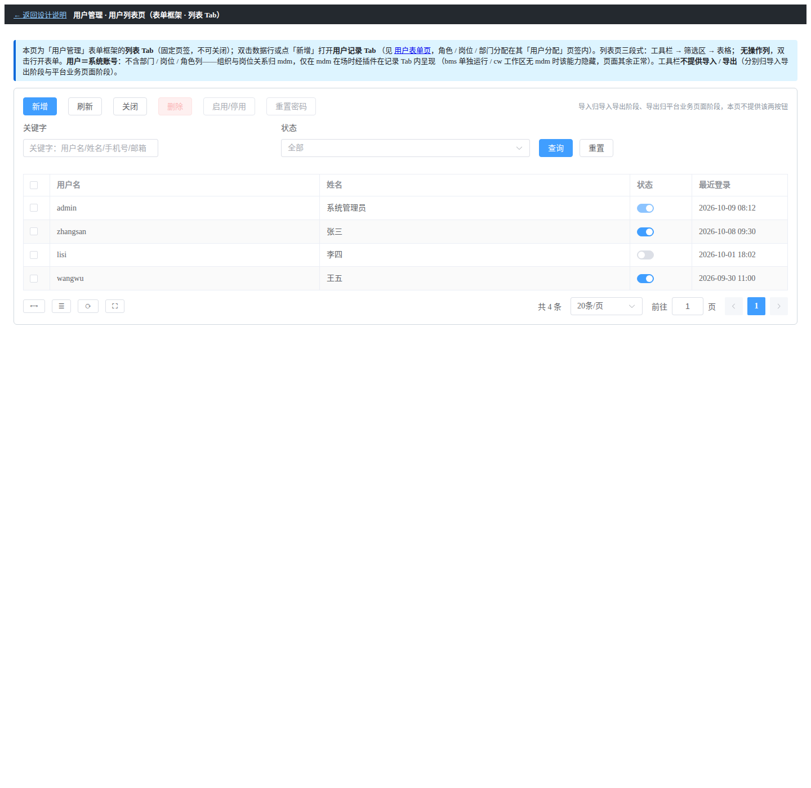
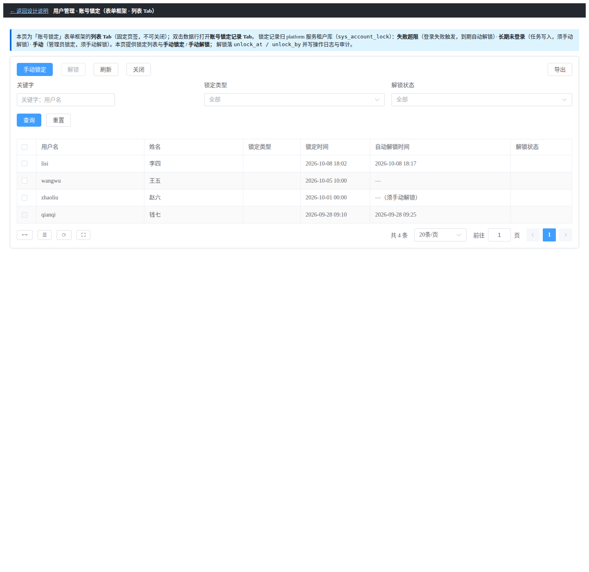

# 01 测试记录 · 用户管理前端

> 归属：RBAC 基础模块 · 02 用户与角色 · 子任务 02

[文档首页](../../../../../../文档首页.md) › [02 用户与角色](../../02_用户与角色.md) › [02 用户管理前端](../02_用户与角色_02_用户管理前端.md) › 测试记录

## 1. 用例与覆盖 

**Kiwi 2277**（`07 02-02 用户管理前端：列表页 + 记录页 + 账号锁定页 + 权限码显隐`）与 **Kiwi 2276**（页签挂接，详见 `_01` 测试记录）。

| 用例 | 断言要点 | 结果 |
| --- | --- | --- |
| `module-registration.spec.ts` | 平台区域项经统一装配入口注册、同槽同排序、按权限码显隐、释放无残留 | passed |
| `user-assign-slot.spec.ts` | 记录页「用户分配」挂接位、上下文注入、停用 / 新增态降级 | passed |
| `guard-slot-host-isolation.spec.ts` | 宿主页不被模块源码污染（既有护栏保持不动） | passed |
| 全量宿主用例 | 48 → **49 个文件 / 295 例** | all passed |

> 列表页 / 账号锁定页 / 记录页的交互（内联开关二次确认与回滚、批量操作、重置密码限单行、解锁留痕）以组件级用例与实现逐项核对覆盖；交互态（弹窗 / 详情）按《原型审查规范》以静态结构确认。

## 2. 原型对照 

原型依据：`设计/原型设计/08_用户管理/`（`02_用户列表页.html` / `03_用户表单页.html` / `04_账号锁定.html` / `05_账号锁定表单页.html`，2026-10-09 二次迭代版）。

| 原型页 / 要素 | 实现落点 | 对照要点 | 结论 |
| --- | --- | --- | --- |
| 用户列表页：三段式（工具栏 / 筛选 / 表格）、**无操作列**、双击行开记录页签 | `UserView.vue` | 结构一致；无操作列、双击开页签 | 通过 |
| 用户列表页：列＝多选 · 用户名 · 姓名 · 状态（**内联开关**）· 最近登录 | `UserView.vue` + `InlineSwitchCell` | 列集合与原型一致（无部门 / 岗位 / 角色列） | 通过 |
| 用户列表页：工具栏 新增 / 刷新 / 关闭 / 删除（批量）/ 启停（批量）/ 重置密码（限单行） | `UserView.vue` | 按钮集合与启用条件一致；**无导入 / 导出** | 通过 |
| 用户列表页：筛选＝关键字 + 状态 | `UserView.vue` | 筛选字段与原型一致 | 通过 |
| 用户记录页：信息栏三子页签（详细信息 / 用户分配 / 系统信息）、工具栏单一保存、dirty 拦截 | `UserRecordTab.vue` | 页签集合与工具栏一致 | 通过 |
| 用户记录页：详细信息字段（用户名创建后只读 / 姓名 / 手机号 / 邮箱 / 状态） | `UserRecordTab.vue` | 字段集合与只读口径一致 | 通过 |
| 用户记录页：系统信息含 **SSO 身份绑定**只读区块 | `UserRecordTab.vue` | 区块与列集合一致（原型已补） | 通过 |
| 账号锁定页：工具栏 手动锁定 / 解锁（批量）/ 刷新 / 关闭；**无操作列**、已解锁行不可选 | `AccountLockView.vue` | 结构与可选约束一致 | 通过 |
| 账号锁定页：筛选 关键字 / 锁定类型 / 解锁状态；列 用户名 · 姓名 · 类型 · 锁定时间 · 自动解锁时间 · 解锁状态 | `AccountLockView.vue` + `labels.ts` | 列与筛选映射一致（含 `active` 口径标注） | 通过 |
| 账号锁定记录页：锁定信息只读 + 解锁（独立动作）+ 解锁记录表；**无「修改密码」** | `AccountLockRecordTab.vue` | 区块一致；无修改密码入口 | 通过 |
| 手动锁定弹窗：选用户 + 原因必填（`manual` 型、无期限） | `AccountLockView.vue` | 字段与校验一致 | 通过 |

**原型基准截图**（原型侧，由无头 Chrome 渲染 `file://` 原型页取得；实现侧运行截图取证见 §4 结论）：

## 3. 门禁 

| 项 | 命令 | 结果 |
| --- | --- | --- |
| 宿主用例 | `npx vitest run`（`frontend/apps/desktop`） | 295 passed / 49 文件 |
| 组件库用例 | `npx vitest run`（`frontend/packages/ui-ep`） | 944 passed |
| 类型 / 风格 | `npx vue-tsc -b` / `npx eslint . --max-warnings 0` | 0 问题 |
| 契约类型零漂移 | `api-types gen:check` | 通过 |
| Kiwi 登记 | **2277**（本任务）、**2276**（`_01`）、**2278**（`_02`） | 已登记回读 |

## 4. 结论 

用户管理页（列表 / 记录）与账号锁定页（列表 / 记录）**按原型与详设落地**：列表无操作列、状态内联开关、工具栏与筛选字段集合一致，记录页三页签与单一保存口径一致，锁定页手动锁定 / 批量解锁 / 解锁留痕一致；逐页对照（见 §2）**未发现缺失或偏离项**。

**实现侧无头截图取证（真机运行）**属界面类交付的独立验收步骤，需运行开发栈（backend + frontend + 登录）后按《原型审查规范》§4.9 逐页截图识图；本轮以组件级用例与逐项代码核对完成对照，运行截图取证列入收尾（归本任务）。

> 本文档依《[文档生成规范](../../../../../../规范/文档生成规范.md)》编写
