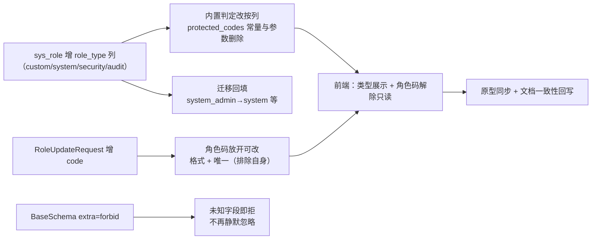

# 01 详细设计 · 角色码可改与内置判定脱钩

> RBAC 基础模块 · 02 用户与角色 · 03 角色管理 · 嵌套子任务 01（需求 07-3）｜**定稿（2026-10-08，共 8 项决策确认）**

[文档首页](../../../../../../../文档首页.md) › [02 用户与角色](../../../02_用户与角色.md) › [03 角色管理](../../02_用户与角色_03_角色管理.md) › 详细设计　|　[← 任务文档](../02_用户与角色_03_角色管理_01_角色码可改与内置判定脱钩.md)

## 1. 背景与目标 

用户复核「角色管理中的角色码为何不能修改」——按项目口径「内部传输用 ID」，`code` 应只是**对外业务标识**。排查结论：

- **内部无任何按角色 `code` 的引用**：`sys_user_role` / `sys_role_permission` / `sys_role_field` / `sys_data_scope` 全部 `role_id`；mdm 侧 `org_role_post` / `org_role_dept` / `user-roles` 亦一律 `role_id`；无角色域事件与审计载荷；
- **唯一真实耦合**：「内置角色判定按 `code`」（`role.protected_codes` 常量 + 可覆盖系统参数）——若放开改码而不解耦，用户可改内置角色码绕过「禁删 / 禁停用」保护；
- 另有两处一致性问题：「`PUT /roles/{id}` 带 `code` 被**静默忽略**」（`BaseSchema` 未设 `extra="forbid"`）、概要设计 06 把 `code` 列入可修改与详设 / 表文件冲突。

**目标**：内置判定**脱钩为 `role_type` 列**，角色码回归「可纠错的对外标识」（任何角色可改），并顺带把契约口径改为**未知字段即拒**。

## 2. 范围 

| 含 | 不含（归口） |
| --- | --- |
| `sys_role.role_type` 列（模型 / 迁移 / 表文件 / 总览登记） | 内置三类管理员的**创建种子**（属租户开通：`03_02` / `04_01`） |
| 内置判定改按 `role_type`（服务判定 + 响应 `builtin` 标记） | 三权互斥校验本身（`03_02`，本次仅备好类型位） |
| `role.protected_codes` 常量与系统参数删除（含文档回写） | 权限引擎内置豁免判定（`02_04`，消费 `role_type`） |
| 角色码可改（契约 + 服务 + 前端 + 原型） | 角色码的历史数据治理（现役无重码，无需处理） |
| 全局 `BaseSchema` 严格（未知字段即拒） | 其它契约字段级严格化（如响应模型收敛） |
| 类型展示（列表列 + 表单只读）与原型同步 | 类型筛选 / 类型编辑入口（本次不做） |

## 3. 现状实测 

| 项 | 实测结论 | 取证落点 |
| --- | --- | --- |
| 模型与约束 | `SysRole.code  String(64)`，注释「创建后不可修改」；唯一约束 `(code, deleted_at)` | `services/platform/src/bms_platform/models/role.py`、迁移 `platform/tenant/0007_role_tables.py` |
| 「不可改」实现 | 契约 `RoleUpdateRequest` **不含 code**、服务 `update_role` 只写 name/status、前端 `:disabled="!isNew"` | `schemas/role.py`、`services/role.py`、`apps/desktop/src/views/system/RoleRecordTab.vue` |
| 内置判定 | `PROTECTED_ROLE_CODES`（缺省 `system_admin` / `security_admin` / `audit_admin`）+ 系统参数 `role.protected_codes`；用于创建禁建、停用 / 删除保护、响应 `builtin` 标记 | `services/role.py`（`protected_codes()`）、`api/role.py`（4 处）、`schemas/role.py` |
| 按 code 的查找 | 仅 `RoleRepository.get_by_code`（创建去重） | `repositories/role.py` |
| 其它按 code 使用 | 列表关键字筛选 / 排序可命中；无跨边界引用（关联表 / 事件 / 审计 / mdm 均 `role_id`） | 全仓排查（子代理 A ~ D 组） |
| 契约严格性 | `BaseSchema.model_config` 未设 `extra` → Pydantic 默认 `ignore`（多传字段静默丢弃） | `libs/bms_core/src/bms_core/schemas/base.py` |
| 前端消费 | 列表列 `code`、页签标题 `${name}（${code}）`、删除失败提示用 `code`；无类型展示 | `apps/desktop/src/views/system/RoleView.vue`、`RoleRecordTab.vue` |
| 原型 | 列表页无类型列；表单页角色码 `:disabled="!isNew"` | `设计/原型设计/09_角色管理/{02_角色列表页,03_角色表单页}.html` |
| 文档冲突 | 概要设计 06 概览表写「新建/修改/删除角色 ｜ code/name/status」；详设与 `sys_role.md` 写「不可改」 | `设计/概要设计/06_*`、`02_03` 详设、`数据表设计/sys_role.md` |

## 4. 交付物清单 

| # | 交付物 | 落点 |
| --- | --- | --- |
| 1 | `sys_role.role_type` 列（模型 + 常量 + 校验） | `services/platform/src/bms_platform/models/role.py` |
| 2 | 迁移（加列 + 按 code 回填 + 降级） | `backend/alembic/versions/platform/tenant/0009_role_type.py` |
| 3 | 表文件与总览登记（新列 + 变更记录） | `设计/数据库设计/数据表设计/sys_role.md`、《数据库设计总览》 |
| 4 | 内置判定改造（删 `protected_codes` 常量 / 参数与 `protected_codes()` 方法） | `services/role.py`、`api/role.py`、`services/role_grant.py`（如引用） |
| 5 | 角色码可改（契约 + 服务校验） | `schemas/role.py`、`services/role.py` |
| 6 | 全局契约严格（`BaseSchema` `extra="forbid"`） | `libs/bms_core/src/bms_core/schemas/base.py` |
| 7 | 契约快照与前端类型重生成 | `deploy/contracts/platform.json`、`frontend/packages/api-types` |
| 8 | 前端（角色码解除只读、类型展示） | `apps/desktop/src/views/system/{RoleView,RoleRecordTab}.vue` |
| 9 | 原型同步（列表页类型列、表单页解除只读 + 类型展示） | `设计/原型设计/09_角色管理/{02,03}_*.html` |
| 10 | 文档一致性（概要设计 06、`02_03` 详设口径注） | `设计/概要设计/06_*`、`02_03` 详设 |
| 11 | 用例（后端 + 前端）与 Kiwi 登记 | `services/platform/tests/**`、`apps/desktop/tests/**` |
| 12 | 实施记录 / 测试记录 / 计划与需求回写 | 本目录 `实施/` `测试/`；`项目/07_RBAC基础模块/**` |

## 5. 设计 

### 5.1 数据模型：`role_type` 

| 项 | 口径 |
| --- | --- |
| 列 | `role_type` `String(16)`，非空，缺省 `custom`，注释「角色类型（内置判定；custom 为自定义角色）」 |
| 取值 | `custom`（自定义，缺省）/ `system`（系统管理员）/ `security`（安全管理员）/ `audit`（审计管理员） |
| 常量 | `ROLE_TYPE_CUSTOM` / `ROLE_TYPE_SYSTEM` / `ROLE_TYPE_SECURITY` / `ROLE_TYPE_AUDIT` + `ROLE_TYPES`（模块常量，落 `models/role.py`，供服务与迁移引用） |
| 索引 | 不建索引（低基数、仅等值判定；如需「按类型筛选」再评估） |
| 唯一约束 | 无（同一类型可多角色；三权互斥由 `03_02` 校验） |
| 可改性 | **不可改**：契约不接受、服务不写；`role_type != custom` 即内置 |

### 5.2 迁移与回填 

- 新迁移 `platform:tenant/0009_role_type`（平台租户链新头）：
  1. `add_column`（`nullable=False` + `server_default='custom'`，四库兼容）；
  2. **回填**：按 `code` 匹配缺省清单更新 —— `system_admin → system`、`security_admin → security`、`audit_admin → audit`；
  3. 保留 `server_default`（新插入缺省 `custom`，服务侧仍显式写入）；
  4. `downgrade`：`drop_column`；
- **方言注意**：SQLite 用 `batch_alter_table`；达梦侧**不写** `alter_column(..., nullable=True)`（既有口径）；回填用 `UPDATE ... WHERE code = ?`（幂等，可重复执行）；
- 迁移仅做结构 + 回填，**不写业务种子**（内置角色创建仍归租户开通）。

### 5.3 服务与判定改造 

| 变更 | 口径 |
| --- | --- |
| 常量与参数退役 | 删除 `PROTECTED_ROLE_CODES`、`PROTECTED_ROLE_CODES_KEY`、`resolve_protected_role_codes()`、`RoleService.protected_codes()`；配置示例 / 文档同步清理 |
| 内置判定 | 统一 `role.role_type != ROLE_TYPE_CUSTOM`；创建新角色时 `role_type` 恒为 `custom`（**契约不透出该字段**，杜绝外部指定） |
| 保护行为 | 内置角色：**禁删、禁停用**（沿用现行为）；**角色码可改**（本次放开）；`role_type` 不可改 |
| 角色码更新 | `update_role` 增 code 分支：`strip()` → `role.code_pattern` 格式校验（失败 `10001`）→ 唯一校验 `get_by_code`（命中且非自身 → **`30042`**）→ 写库；与 name / status 同事务、同一乐观锁版本递增 |
| 唯一校验口径 | 「自身豁免」按 `id` 比较（`existing.id != role.id`），与创建路径共用同一私有方法 |

### 5.4 契约变更 

| 契约 | 变更 |
| --- | --- |
| `RoleCreateRequest` | 不变（`code` / `name` / `status`；**不含 `role_type`**——新建恒 `custom`） |
| `RoleUpdateRequest` | **增 `code`**（可选；缺省不变更）；保留 `name` / `status` / `version` |
| `RoleItem` / `RoleDetail` | **增 `role_type`**（字符串枚举值；`builtin` 标记保留，判定改按 `role_type`） |
| 严格性 | 全局 `BaseSchema.model_config` 增 `extra="forbid"` → 请求体未知字段报校验错（`10001`）；契约快照出现 `additionalProperties: false` |

> 影响面：全部请求契约（所有服务）——按红线**全量回归**；响应模型不受影响（`extra` 只作用于校验）。

### 5.5 前端变更 

| 项 | 口径 |
| --- | --- |
| 角色码 | 解除 `:disabled="!isNew"`（新增 / 编辑均可填改）；编辑态提交时随 `RoleUpdateRequest` 带 `code` |
| 类型展示 | 列表新增列「类型」（取值 → 中文映射：自定义 / 系统管理员 / 安全管理员 / 审计管理员；内置三类同时保留现有「内置」标记语义）；表单详细信息区**只读展示**类型 |
| 内置标记 | 判定改按 `role_type !== 'custom'`（`builtin` 字段仍由后端下发，前端不做本地推导） |
| 契约类型 | 由 `@bms/api-types` 重生成后用（`role_type` 入类型） |

### 5.6 原型同步 

| 原型 | 变更 |
| --- | --- |
| `09_角色管理/02_角色列表页.html` | 表格新增「类型」列（自定义 / 内置三类文案） |
| `09_角色管理/03_角色表单页.html` | 角色码输入**去掉 `:disabled="!isNew"`**；详细信息区增「类型」只读项 |

> **原型即验收基准**：实现与原型同批更新，测试记录按《原型审查规范》给出逐页对照结论。

### 5.7 兼容与数据面 

- 迁移回填只影响 `code` 命中缺省清单的存量行（现役本地 / 部署库的内置角色即此三类）；
- 若某租户曾用系统参数覆盖 `role.protected_codes`（现役无覆盖），其覆盖值随参数退役失效 —— 已在实施记录登记为**迁移提示**（如需保留，须在迁移前按覆盖清单补 `role_type`）；
- 角色码放开修改后，**前端页签标题 / 删除提示**等展示用 `code` 的位置自动反映新值（无缓存）。

## 6. 失败分支与边界 

| 场景 | 处置 | 错误码 / 表现 |
| --- | --- | --- |
| 更新角色码与既有角色重复 | 服务层唯一校验拒 | **`30042`**（角色码已存在） |
| 角色码格式非法（不合 `role.code_pattern`） | 服务层格式校验拒 | `10001` |
| 请求体带未知字段（含响应只读字段） | 契约层拒（`extra="forbid"`） | 契约校验失败（`10001`） |
| 请求体带 `role_type` | 同上（`RoleUpdateRequest` 无该字段） | 契约校验失败（`10001`） |
| 内置角色停用 / 删除 | 保护拒（按 `role_type != custom`） | `30043`（内置角色保护） |
| 内置角色改角色码 | **允许**（本次放开） | 正常 |
| 迁移重复执行 | 回填幂等；加列按 `checkfirst` 语义 | 无副作用 |
| 存量库无内置角色行 | 回填 0 行，不报错 | 无副作用 |

## 7. 测试设计与验收映射 

| 验收点 | 用例 |
| --- | --- |
| 内置判定按 `role_type`（创建 / 停用 / 删除保护 + `builtin` 标记） | `tests/role/test_role_service.py`（改造既有 `protected_codes` 断言）、`tests/api/test_role_api.py` |
| 角色码可改（成功 / 重复 30042 / 格式 10001 / 自身豁免） | `tests/role/test_role_service.py`、`tests/api/test_role_api.py` |
| `role_type` 不可改（请求体带即拒） | `tests/api/test_role_api.py`（严格模式断言） |
| 未知字段即拒（全局口径） | `libs/bms_core/tests/schemas/`（新增严格模式用例） |
| 迁移回填正确 | `libs/bms_core/tests/alembic/`（链头与表集断言同步）+ 迁移用例 |
| 前端（角色码可编辑、类型展示、内置标记） | `apps/desktop/tests/role-view.spec.ts` / `role-record.spec.ts`（扩展） |
| 原型对照 | 本目录 `测试/`（逐页对照 + 截图） |
| 回归 | **后端全量 `pytest`（全服务 + 基座）+ 前端全量 `pnpm run check` 与各包用例** |
| Kiwi | 先登记取号再写用例 |

## 8. 登记落点 

| 内容 | 落点 |
| --- | --- |
| 数据表（新列 + 变更记录） | `设计/数据库设计/数据表设计/sys_role.md`、《数据库设计总览》§7.3 登记 |
| 概要设计 06（code 可改、内置判定口径、参数退役） | `设计/概要设计/06_概要设计_角色管理.md` |
| 父任务详设口径注（角色码只读 → 可改） | `02_03` 详细设计 §… |
| 契约与前端类型 | `deploy/contracts/platform.json`、`frontend/packages/api-types`（重生成） |
| 配置示例（`role.protected_codes` 退役） | `backend/config.toml` / `config.dev.toml` / `deploy/.env.example`（如登记过） |
| 计划 / 需求 / 任务状态 | `项目/07_RBAC基础模块/{计划,需求,任务}/**`（**唯一进度落点**） |

## 9. 边界与开放项 

| # | 事项 | 归口 |
| --- | --- | --- |
| 1 | 内置三类管理员的**创建种子**（按 `role_type` 写入） | `03_02` / `04_01`（租户开通） |
| 2 | 三权互斥校验（同一租户三类管理员不得兼任） | `03_02`（类型位已备） |
| 3 | 类型筛选 / 类型编辑入口 | 暂不做；如需另立 |
| 4 | 曾覆盖 `role.protected_codes` 的历史租户补齐 `role_type` | 部署迁移提示（实施记录登记） |
| 5 | 全局严格模式对既有调用方的连锁影响 | 本次全量回归覆盖；第三方 / 产品服务调用面纳入部署联调观察 |

## 10. 决策记录 

| # | 决策项 | 结论 |
| --- | --- | --- |
| 1 | 归口 | 重开 `02_03`，追加**嵌套子任务**（不新增需求编号） |
| 2 | 内置判定脱钩 | **`sys_role.role_type` 列**（`custom` / `system` / `security` / `audit`），为 `03_02` 三权互斥备好类型位 |
| 3 | `role.protected_codes` | **彻底删除**（常量 + 系统参数），迁移按缺省清单回填 |
| 4 | 角色码可改性 | **放开可改**（含内置角色）；格式 + 唯一（排除自身）校验 |
| 5 | `role_type` 可改性 | **不可改**（创建恒 `custom`，契约不透出） |
| 6 | 类型展示 | **列表列 + 表单只读展示**（原型同批同步） |
| 7 | 未知字段口径 | **全局 `BaseSchema` 严格**（`extra="forbid"`），横切破坏性变更 |
| 8 | 回归范围 | **后端全量 + 前端全量**（破坏性变更，先说明并确认后执行） |

## 11. 参考文档 

- [需求 07-3](../../../../../需求/02_需求_用户与角色.md#r07-3)、[任务文档](../02_用户与角色_03_角色管理_01_角色码可改与内置判定脱钩.md)、[父任务](../../02_用户与角色_03_角色管理.md)
- 《[概要设计 · 角色管理](../../../../../../../设计/概要设计/06_概要设计_角色管理.md)》；《[架构设计 · 权限计算引擎](../../../../../../../设计/架构设计/15_架构设计_子系统_权限计算引擎.md)》§2
- 《[数据库开发规范](../../../../../../../规范/数据库开发规范.md)》《[后端开发规范](../../../../../../../规范/后端开发规范.md)》（编码字段命名：内部键一律 id）《[测试规范](../../../../../../../规范/测试规范.md)》
- [计划](../../../../../计划/01_计划_RBAC基础模块.md)（`02_03` 重开口径）

> 本文档依《[文档生成规范](../../../../../../../规范/文档生成规范.md)》编写 · 关键决策逐项确认
