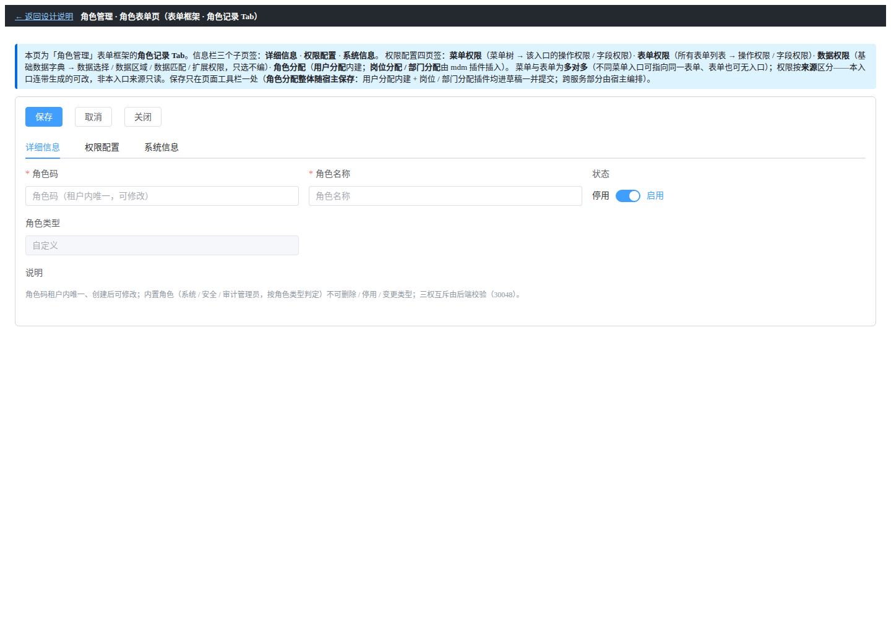
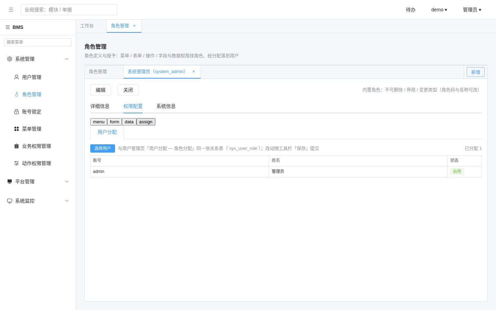

# 02 测试记录 · 角色分配插件随宿主保存编排

> RBAC 基础模块 · 02 用户与角色 · 03 角色管理 · 嵌套子任务 02

[文档首页](../../../../../../../文档首页.md) › [02 用户与角色](../../../02_用户与角色.md) › [03 角色管理](../../02_用户与角色_03_角色管理.md) › 测试记录　|　[← 任务](../02_用户与角色_03_角色管理_02_角色分配插件随宿主保存编排.md) · [详细设计](../设计/01_详细设计_02_角色分配插件随宿主保存编排.md) · [实施记录](../实施/01_实施_02_角色分配插件随宿主保存编排.md)

## 1. 任务信息 

| 项 | 值 |
| --- | --- |
| 任务 | [02 角色分配插件随宿主保存编排](../02_用户与角色_03_角色管理_02_角色分配插件随宿主保存编排.md)（父任务 [03 角色管理](../../02_用户与角色_03_角色管理.md)） |
| 对应需求 | 需求 `07-11`（宿主保存编排 · 角色侧切片） |
| 用例编号 | 后端 **2283**、前端 **2284**（已登记回读） |
| 被测物 | bms `platform` 编排端点 + 分支处理器 + 角色记录页前端（消费固定版本产物口径见《测试规范》） |

## 2. 用例与验收映射 

| 验收点（[任务 §3](../02_用户与角色_03_角色管理_02_角色分配插件随宿主保存编排.md#accept)） | 用例要点 | 结果 |
| --- | --- | --- |
| 端点可用、分段全量覆盖 | `collect_segments`：`null` 不参与；`role` 段乐观锁冲突（10003）/ 内置角色停用（30043）/ 角色码与名称更新 | passed |
| `provider=null` 顺序提交 | 顺序提交编排顺序（platform 本地写入 → mdm 内部写通道 `role-posts` / `role-depts`）；幂等键透传；仅组织段不递增平台版本 | passed |
| 组织域分支载荷 | 岗位 / 部门各一 op、同一分支一次请求按序执行（`build_org_ops`） | passed |
| 角色 × 用户全量覆盖 | 「保留集合外软删 + 恢复原行」行数不膨胀；用户不存在 / 停用 → 30045（30045） | passed |
| 宿主收草稿与单保存 | `RoleAssignTab` 注入 `registerSubmitter`（值即函数）→ 记录页收集分段并一次编排请求；「撤销」调 `reload` 复位 | passed |
| 降级与权限 | 无 `org:update` / 插件缺失 ⇒ 子页签不渲染、分配段为空、保存只提交 platform 部分 | passed |
| 运行时接线（`session.codes`） | 菜单装载回填 `session.codes`（`stores/menu.ts` → `session.setCodes`），按权限显隐恢复 | passed |
| 契约零漂移 | 快照 / 基线重生成 + `api-types` 生成一致 | passed |

**用例文件**：后端 `services/platform/tests/role/test_role_assignments.py`（`@pytest.mark.kiwi_id(2283)`）、前端 `apps/desktop/tests/role-assignments.spec.ts`（`kiwi_id: 2284`）与 `role-assign-slot.spec.ts`（`kiwi_id: 2260`，宿主侧插槽/草稿通道）。

## 3. 执行结果与覆盖率 

| 层 | 命令 | 结果 |
| --- | --- | --- |
| 后端 · 本任务 | `uv run pytest services/platform/tests/role/test_role_assignments.py -q` | **7 passed** |
| 后端 · 角色域回归 | `uv run pytest services/platform/tests/role services/platform/tests/api -q` | **17 passed** |
| 后端 · 静态 | `ruff check` / `ruff format --check` / `pyright` | 0 问题 |
| 契约 | `ops.contract_snapshot check` | 通过（零漂移） |
| 前端 · 类型 / 风格 | `vue-tsc --noEmit` / `eslint --max-warnings 0` | 0 问题 |
| 前端 · 受影响用例 | `vitest run`（role-assign-slot / role-assignments / guard-slot-host-isolation / role-view / module-registration / session / menu-store） | 全绿 |
| 前端 · 全量（宿主） | `vitest run`（`frontend/apps/desktop`） | **301 passed / 1 failed**（既有失败，见 §5 第 1 项） |
| 组件库 | `vitest run`（`frontend/packages/ui-ep`） | **946 passed** |
| mdm 模块 | 复用已交付（mdm `a4bcac9`）；本任务**零改动** | — |

## 4. 原型对照 

原型依据：`设计/原型设计/09_角色管理/03_角色表单页.html`（2026-10-06 定稿；「角色分配」页签内「用户分配」子页签 + 岗位 / 部门分配插件位）。

| 原型要素 | 实现落点 | 对照要点 | 结论 |
| --- | --- | --- | --- |
| 「角色分配」页签内**用户分配**子页签（内建）排首位 | 平台区域项 `sys:role-detail-users`（`order` 10）+ `RoleUsersPanel.vue` | 与 mdm 岗位(20)/部门(30)同槽、单 `outlet` 渲染、按 `order` 排序 | 通过 |
| 子页签**卡片式** | `ModuleAreaOutlet` 透传 `tab-type="card"` | 页签带样式与原型一致 | 通过 |
| 用户分配：已分配**列表**（账号 / 姓名 / 状态）+「选择用户」多选弹窗 + 计数 | `RoleUsersPanel.vue`（表格 + 弹窗 + `已分配 N`） | 列集合与计数一致；列表**不设「操作（解绑）」列**（全量覆盖语义） | 通过 |
| 分配改动**进草稿、随宿主「保存」提交**、「撤销」放弃 | `RoleAssignTab` 收草稿 + `RoleRecordTab` 单保存编排 + 插槽上下文 `registerSubmitter` | 工具栏单一保存、脏数据提示 | 通过 |
| 插件缺失即隐藏、不报错 | `ModuleAreaOutlet` 空区域不渲染 + `empty-text` 补白 | bms 单独运行仅剩平台内建「用户分配」 | 通过 |
| 角色本体与分配**一次保存原子生效** | 编排行经 `PUT /roles/{id}/assignments`（`provider=xa` 全局事务） | 事务口径由详设承载（原型不可视） | 通过（详设 §5） |

**原型基准截图**（原型侧，无头 Chrome 渲染 `file://` 原型页取得）：

**实现侧截图**（2026-10-09 真机走查：本地全套后端 + 宿主 dev，管理员登录；`localhost:5173`；Playwright/chrome 无头）

**走查发现与处置**：

| # | 现象 | 判定 | 处置 |
| --- | --- | --- | --- |
| 1 | 首次真机走查：「角色分配」页签**空白**（显示「暂无可用的分配项」）——排查为宿主 `session.codes` 恒空（登录载荷不含权限码、`session.signIn` 未传 `codes`），带 `perm` 的区域项（含用户侧三子页签）全被过滤 | **跨任务平台缺陷**（非本任务独有；用户侧同源） | **已按拍板修根因**：菜单装载回填 `session.codes`（单一来源）→ 复走查「用户分配」子页签与列表正常渲染（见实现截图）；用户侧一并修复；登记实施记录 §4 第 3 项与计划 §7 台账 |
| 2 | mdm 岗位 / 部门插件未加载（本机无模块宿主运行环境） | **预期降级**（缺失即隐藏、不报错） | 无需处置；真机 mdm 在场挂接归跨仓联调窗口 |

## 5. 偏差与遗留 

| # | 事项 | 处置 |
| --- | --- | --- |
| 1 | 前端全量 `shared-dependencies.spec.ts` 失败（`^0.1.0` vs `workspace:*`） | **既有失败、非本任务**（`git stash` 验证：去掉本任务改动后仍失败）；归阶段五 `05_14` |
| 2 | 插件即时提交改跟随宿主保存后，Kiwi **2256** 等既有用例步骤口径需同步修订 | 平台侧后续修订（登记为偏差，不擅自改派编号） |
| 3 | 真库两阶段端到端（CI `2pc`）与 mdm 在场真机挂接 | 阶段二 `05_07` 收尾 / 跨仓联调窗口 |
| 4 | `session.codes` 根因修复波及用户侧 `02_02/_01` 与 `02_01` 记录口径 | 已回写 [用户侧 `_01` 测试记录 §2 第 1 项](../../../02_用户与角色_02_用户管理前端/02_用户与角色_02_用户管理前端_01_用户分配页签与插件子页签挂接/测试/01_测试记录_01_用户分配页签与插件子页签挂接.md#prototype) 与计划 §7 台账 |

## 6. 结论 

角色侧编排端点、platform 分支处理器、角色 × 用户全量覆盖、宿主收草稿与单一保存编排**按详设落地**；后端定向用例、前端受影响用例与契约零漂移门禁全绿；原型逐项对照（见 §4）未发现布局偏离或缺失项。运行时接线缺陷（`session.codes` 恒空）已按拍板修根因并复验。真库两阶段与 mdm 在场真机挂接归 CI / 跨仓联调窗口。

> 本文档按 bms《[测试规范](../../../../../../../规范/测试规范.md)》「测试记录」专项编写
