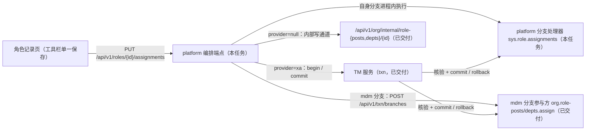
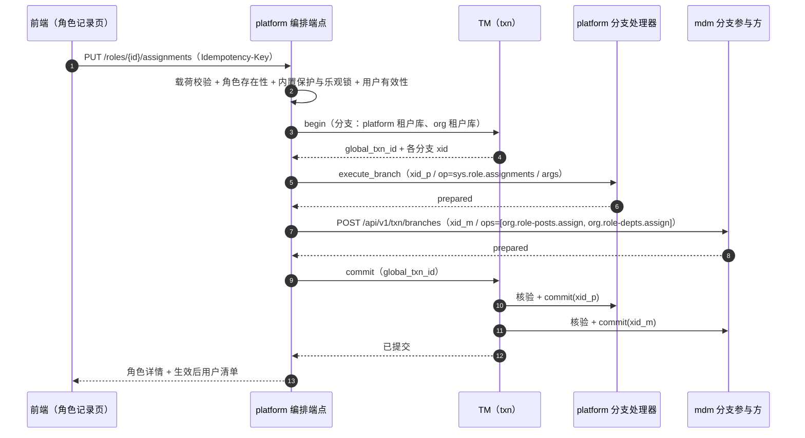
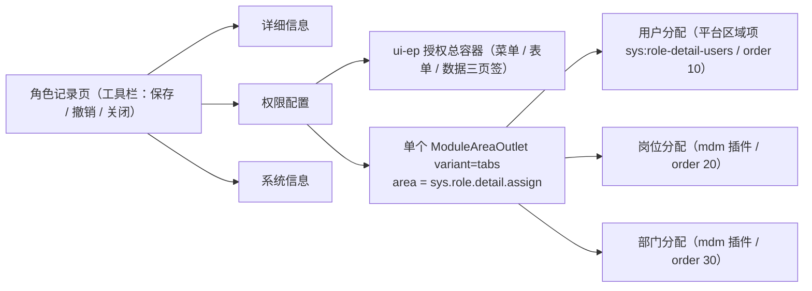

# 02 详细设计 · 角色分配插件随宿主保存编排

> RBAC 基础模块 · 02 用户与角色 · 03 角色管理 · 嵌套子任务 02（需求 07-11 · 接入阶段二 `05_07`）· 详细设计

[文档首页](../../../../../../../文档首页.md) › [02 用户与角色](../../../02_用户与角色.md) › [03 角色管理](../../02_用户与角色_03_角色管理.md) › [任务](../02_用户与角色_03_角色管理_02_角色分配插件随宿主保存编排.md) › 详细设计　|　[实施记录 →](../实施/01_实施_02_角色分配插件随宿主保存编排.md) · [测试记录 →](../测试/01_测试_02_角色分配插件随宿主保存编排.md)

## 1. 背景与目标 <a id="goal"></a>

角色记录页一次「保存」要同时改**两个服务的库**：本体（platform：角色基本信息 `code` / `name` / `status` + 用户分配 `sys_user_role`）与组织分配（mdm：角色-岗位 / 角色-部门）。角色记录页「角色分配」页签与用户记录页「用户分配」页签结构对称（内建「用户分配」+ mdm「岗位分配 / 部门分配」插件，插件缺失即隐藏），需求 [07-11](../../../../../需求/02_需求_用户与角色.md#r07-11) §5 要求该组合**跨服务原子**。

阶段二 [`05_07`](../../../../../../02_后端基座与服务化地基/任务/05_服务间通信与一致性/05_服务间通信与一致性_07_跨服务事务管理器强一致专项/05_服务间通信与一致性_07_跨服务事务管理器强一致专项.md) 已交付 **TM 基座 + 参与端点 + platform 分支路由 + mdm 分支参与方**；**用户侧同口径调用方接入已交付**（[`02_02/_02` 用户保存编排端点](../../../02_用户与角色_02_用户管理前端/02_用户与角色_02_用户管理前端_02_用户保存编排端点/02_用户与角色_02_用户管理前端_02_用户保存编排端点.md)）。本任务在**角色侧**补上同口径编排，**复用用户侧已交付实现作模板**（`UserRecordTab.vue` 宿主收草稿 + 单一保存；`PUT /api/v1/users/{id}/assignments` 编排端点；`services/user_assignments.py`；`services/branch_handlers.py`）。

**为什么不做反向补偿**：`provider = "xa"` 下两阶段提交已给出原子性保证；`provider = null` 只存在于 dev / test（SQLite 无两阶段能力），mdm 侧已明确「过渡期基线与屏障判据属**废路径**」。故本设计**不含**补偿编排、基线快照与一致性屏障——与用户侧口径一致（`05_07` §11 编排切换清单）。

## 2. 范围与交付物 <a id="scope"></a>



| 含（本任务） | 不含（归口） |
| --- | --- |
| platform 编排端点 `PUT /api/v1/roles/{role_id}/assignments` 与分段全量覆盖语义 | TM 基座与参与端点（`05_07` 已交付，本任务只接入） |
| platform 分支处理器注册（`sys.role.assignments`）与角色×用户全量覆盖写入 | mdm 角色两分支 op 与内部写通道（mdm `01_02/_03` 已交付） |
| 双路径：`provider=xa` 全局事务 / `provider=null` 顺序提交 | mdm 四插件草稿契约（mdm `01_02/_02`，`useAssignment.ts`，已交付） |
| 前端角色记录页宿主收草稿 + 单一保存；「用户分配」注册为平台区域项 | 用户侧同口径编排（`02_02/_01` / `_02` 已交付） |
| 契约快照 / 契约基线 / 前端 `@bms/api-types` 重生成 | 权限配置（菜单 / 表单 / 数据）写接口（既有端点，**不并入**本编排） |

**交付物**：本目录 `设计/`（本详设）、`实施/`、`测试/`；代码落点见第 6 ~ 7 节。

## 3. 现状实测 <a id="status"></a>

> 实测时点 2026-10-09；取证落点为当前工作区源码与契约快照。

| 项 | 实测结论 | 取证落点 |
| --- | --- | --- |
| 用户侧编排模板 | 已交付：编排端点 `PUT /api/v1/users/{id}/assignments`（分段全量覆盖 + 双路径 + 分支 `ops` 列表）、写入器「不复制业务逻辑、分支内 SAVEPOINT」、提交后副作用（版本递增 / 会话失效） | `services/platform/src/bms_platform/services/user_assignments.py`、`api/users.py` |
| platform 分支路由 | 已挂 `build_branch_router()`；`app.state.branch_handlers` 由 `build_branch_handlers(app)` 装配，**当前仅登记 `sys.user.assignments`** | `api/router.py`、`main.py`、`services/branch_handlers.py` |
| mdm 角色分支 op | 已交付：`org.role-posts.assign`（`{role_id, post_ids}`）/ `org.role-depts.assign`（`{role_id, dept_ids}`）——**角色侧无主要项**；四 op 经 `/api/v1/txn/branches` 的 `ops` 列表按序在同一分支执行 | mdm `services/org/src/mdm_org/services/branch_handlers.py` |
| mdm 内部写通道 | 已交付：`PUT /api/v1/org/internal/role-posts/{role_id}`（`{post_ids}`）/ `role-depts/{role_id}`（`{dept_ids}`），服务身份白名单＝`platform`、支持 `Idempotency-Key` | mdm `api/internal.py`、`schemas/internal.py` |
| mdm 插件草稿契约 | 已交付：`useAssignment.ts` 的 `HostSubmitterEntry ＝ { isDirty(), buildSegment(), reload() }`；`RolePostsPanel` / `RoleDeptsPanel` 已按 `registrar` + `segment: {key:'role_posts'|'role_depts', idsField:'post_ids'|'dept_ids'}` 接入，宿主无通道时自提交兜底 | mdm `frontend/modules/org/src/composables/useAssignment.ts`、`components/slots/RolePostsPanel.vue` / `RoleDeptsPanel.vue`（mdm 提交 `a4bcac9`） |
| 用户侧宿主模板 | 已交付：`UserRecordTab.vue` 持 `submitters`、`registerSubmitter` 注入插槽上下文、`dirty ＝ 本体脏 || 任一 isDirty()`、`save()` 组装分段并调编排端点；平台内建「角色分配」按区域项注册（`sys:user-detail-roles`，`order` 10） | `frontend/apps/desktop/src/views/system/user/UserRecordTab.vue`、`RoleAssignPanel.vue`、`module/registries.ts` |
| 角色侧现状 | 「角色分配」页签＝`RoleAssignTab.vue`（**内建用户分配表格 + 分页 + 下方 outlet**，仅注入 `{ roleId }`，**无 `registerSubmitter`**）；`sys.role.detail.assign` 下已挂 mdm 岗位 / 部门两插件（`order` 20 / 30，**无平台区域项**） | `views/system/role/RoleAssignTab.vue`、mdm `index.ts` |
| 角色分配既有能力 | `RoleService`（CRUD + 内置保护 `30043` + 角色码唯一 `30042` + 乐观锁）、`RoleAssignService`（幂等 upsert / 解绑 / 版本 +1）、`UserRoleRepository`（`get_by_role_user` / `get_deleted_by_role_user` / `restore` / `soft_delete_by_role_user` / `list_filtered_by_role`）；**缺**「按角色批量软删（保留集合外）」全量覆盖原语（用户侧有 `soft_delete_by_user_except`） | `services/role.py`、`services/role_assign.py`、`repositories/role.py` |
| 库键口径 | `build_tenant_db_key(db_basis, service=...)`；`db_basis` 与 `get_uow` 同源；平台分支取本服务当前租户库键、mdm 分支带 `org_` 段 | `libs/bms_core/src/bms_core/db/keys.py` |
| TM 配置 | `[transaction_manager].provider` 缺省 `null`（未启用强一致）；`xa` 为生产口径 | `core/config.py`「TransactionManagerSettings」 |

## 4. 接口设计 <a id="api"></a>

### 4.1 端点与契约 <a id="endpoint"></a>

| 项 | 口径 |
| --- | --- |
| 方法 / 路径 | `PUT /api/v1/roles/{role_id}/assignments`（对称用户侧 `/users/{id}/assignments`） |
| 语义 | **分段全量覆盖**：请求中出现的段即「以请求内容为准」；段为 `null` 表示**不参与**（不改） |
| 权限码 | **分段校验**：`role` 段非空 ⇒ 需 `role:update`；`user_ids` / `role_posts` / `role_depts` 任一段参与 ⇒ 需 `role:grant` |
| 幂等 | 接受 `Idempotency-Key`（同租户归一）；同键重复提交返回同结果 |
| 审计 | 沿用 `AuditCapturer` 占位（角色段 + `sys_user_role` 段各记一条） |
| 事件 | 角色段变更随既有 `RoleService` 语义；`user_ids` 变更**提交后**递增权限版本（`bms:{tenant}:permission:version`） |

请求（`RoleAssignmentsRequest`）：

| 字段 | 类型 | 说明 |
| --- | --- | --- |
| `role` | 对象 / `null` | `null` = 不改角色本体；非空时 `version` 必填（乐观锁） |
| `role.code` | 字符串 / 可空 | 角色码（语义同 `RoleUpdateRequest`，含格式与唯一校验；`role_type` 不可改） |
| `role.name` | 字符串 / 可空 | 角色名称 |
| `role.status` | `enabled` / `disabled` / 可空 | 状态（内置角色改状态 → `30043`） |
| `role.version` | 整数 | 乐观锁版本（`role` 非空时必填） |
| `user_ids` | 整数集合 / `null` | 角色直接用户全量集合（`null` = 不改；`[]` = 清空） |
| `role_posts` | 对象 / `null` | `{post_ids: [...]}` 全量覆盖（**角色侧无主要项**） |
| `role_depts` | 对象 / `null` | `{dept_ids: [...]}` 同理 |

响应（`RoleAssignmentsResult`）：`role`（生效后角色详情）+ `users`（生效后已分配用户清单，platform 侧）+ `applied`（本次参与的分段名）。

> **mdm 侧生效后集合为何不在响应内回带**：XA 分支执行端点契约只回**分支状态**（`prepared`），不回业务集合；岗位 / 部门段的生效后集合由插件在宿主保存成功后经各自读契约 `reload()` 取回（与用户侧 `02_02/_02` §4.1 同口径）。`provider = null` 路径响应形状一致。

### 4.2 校验与错误码 <a id="errors"></a>

| 场景 | 错误码 | 说明 |
| --- | --- | --- |
| 角色不存在 / 已软删 | 30041 | 请求入口先取角色 |
| 角色码重复 | 30042 | `role.code` 变更校验（沿用 `RoleService`） |
| 内置角色改状态 | 30043 | 沿用 `RoleService` 保护规则 |
| 乐观锁版本不一致 | 10003 | `role.version` 比对失败 |
| 分配主体（用户）不存在 / 已停用 | 30045 | 仅启用用户可持有角色分配（沿用 `RoleAssignService`） |
| 载荷形态非法（分段类型不符 / 无任何分段） | 10001 | 校验前置于编排，避免把非法载荷带进分支 |
| `provider=null` 且 mdm 内部写通道不可达 | 10007 | 顺序提交路径失败即整体报错（**不做补偿**，dev / test 限定） |
| 分支执行被参与方否决 / 未达 `PREPARED` | 10013 | 由 TM 回滚全部分支后抛出 |

> **角色侧无主要项**：`role_posts` / `role_depts` 只含标识集合（与 mdm 分支 op、插件段规格一致）；「主要岗位 / 主要部门」仅用户侧语义。

### 4.3 分段与插件段的映射 <a id="segment-map"></a>

| 用户侧模板 | 角色侧本任务 | 归属 |
| --- | --- | --- |
| `profile`（用户本体） | `role`（角色本体） | platform（分支进程内 / 顺序提交本地事务） |
| `role_ids`（用户直接角色） | `user_ids`（角色直接用户） | platform（同库 `sys_user_role`） |
| `user_posts` / `user_depts` | `role_posts` / `role_depts` | mdm（分支 / 内部写通道） |
| op `sys.user.assignments` | op `sys.role.assignments` | platform 分支处理器注册键 |
| op `org.user-posts.assign` / `org.user-depts.assign` | op `org.role-posts.assign` / `org.role-depts.assign` | mdm（**复用已交付**，不新增） |

## 5. 一致性路径 <a id="consistency"></a>

### 5.1 `provider = "xa"`（强一致路径） <a id="path-xa"></a>



实现要点（对称用户侧 `02_02/_02`）：

1. **分支清单**：platform 分支 `branch_id = "p"`、`db_key` 取本服务当前租户库键；mdm 分支 `branch_id = "m"`、`db_key = build_tenant_db_key(db_basis, service="org")`（`db_basis` 与 `get_uow` 同源）。
2. **自身分支进程内执行**：经 `get_transaction_participant().execute_branch(xid=…, db_key=…, ops=(BranchOp(op="sys.role.assignments", args=…),))`——不另开 HTTP；处理器解包后调用**已有服务层**（`RoleService` / 新增角色×用户全量覆盖写入）。
3. **mdm 分支远端执行**：经服务间调用客户端 `POST /api/v1/txn/branches`，`ops` 列表**一次请求**承载岗位 + 部门（同一分支、同一条连接、同一两阶段事务，保证两段也在一个分支内原子）；`mdm` 两 op 已交付，**不新增**。
4. **否决与失败**：任一步抛错 ⇒ 调 `tm.rollback(global_txn_id)`（TM 逐分支回滚，未 `PREPARED` 者按幂等忽略）；`begin` 后未提交即异常退出时，TM 依 `deadline_seconds` 到期回滚。

### 5.2 `provider = null`（顺序提交路径，dev / test） <a id="path-null"></a>

`tm.enabled()` 为假时走顺序提交：

1. platform 本地事务：`role`（角色本体）+ `user_ids`（角色×用户全量覆盖）+ 发件箱（一次 `uow.begin()`）；
2. 依次调 mdm 内部写通道 `PUT /api/v1/org/internal/role-posts/{role_id}` / `role-depts/{role_id}`（服务身份 `platform` + 同一 `Idempotency-Key`）；
3. 任一步失败 ⇒ 立即返回明确错误码；**不补偿**（`provider=null` 仅用于本地 SQLite 开发与用例，生产恒 `xa`）。

> 该路径**不写入**任何「基线快照 / 收敛版本 / 屏障判据」——与 mdm 侧「废路径」判定一致。

### 5.3 幂等与重试 <a id="idempotency"></a>

- **跨服务幂等键**：一次编排生成**同一业务幂等键**，透传给 mdm 分支（`args.idempotency_key`）与内部写通道（`Idempotency-Key` 头）；TM 重驱动分支时参与方按分支状态机幂等返回。
- **恢复原语**：TM 崩溃 / 参与方重启后由 TM 恢复器重驱动（`XA_RECOVER` 对账）；**禁止手工改数据**。

## 6. 前端设计 <a id="frontend"></a>

### 6.1 页签结构与区域项 <a id="structure"></a>

按用户侧模板（`02_02/_01` §4）——**同一登记通道 + 单 `outlet`**：



| 项 | 动作 |
| --- | --- |
| `sys:role-detail-users` | **新增**平台区域项：`area=sys.role.detail.assign`、`order=10`、`title=用户分配`、组件＝新建 `RoleUsersPanel.vue`（承担原 `RoleAssignTab.vue` 的已分配用户表格 + 选择用户弹窗） |
| `RoleAssignTab.vue` | **改造**为 outlet 宿主：持 `submitters`，在上下文注入 `{ roleId, registerSubmitter }`，经**单个** `ModuleAreaOutlet variant="tabs"` 渲染三子页签；不再自带用户表格 / `save()`（改为向记录页暴露草稿收集） |
| mdm `mdm-org:role-posts` / `role-depts` | **不动**（`order` 20 / 30，已按新契约注册 `registerSubmitter`） |

**为什么用「平台区域项 + 单 `outlet`」**：`ModuleAreaOutlet` 的 `tabs` 形态自带一整套 `el-tabs`；把内建「用户分配」也按**同一登记通道**注册为区域项，即可与 mdm 两插件由**同一个 `outlet`** 渲染为并列子页签——**机制零改动**，与用户侧完全对称。

### 6.2 提交器契约与草稿收集 <a id="draft"></a>

沿用用户侧契约（`@bms/ui-ep` 的 `HostSubmitterEntry` / `HostSubmitterRegistrar`）：

```ts
export interface HostSubmitterSegment {
  key: 'user_ids' | 'role_posts' | 'role_depts'
  value: Record<string, unknown>
}

export interface HostSubmitterEntry {
  isDirty: () => boolean
  buildSegment: () => HostSubmitterSegment | null
  reload: () => Promise<void>
}

export type HostSubmitterRegistrar = (entry: HostSubmitterEntry) => void
```

| 项 | 口径 |
| --- | --- |
| 内建「用户分配」 | `RoleUsersPanel.vue` 经 `useModuleSlotField('roleId')` 取实体、`registerSubmitter` 注册草稿；`buildSegment()` 无改动返回 `null`，段值 `{ user_ids: [...] }`（**全量集合**） |
| mdm 两插件 | 已交付（`registrar` + `segment`）；宿主提供通道 ⇒ 只记草稿；未提供 ⇒ 自提交兜底 |
| 段名与 mdm op 映射 | 段名（`role_posts` / `role_depts` / `user_ids`）由 **platform 编排端点**映射为 mdm 分支 op；插件不感知分支 op 名 |
| 全量集合基线 | 内建「用户分配」面板须载入该角色**全部**已分配用户主键作为草稿基线（`GET /roles/{id}/users` 按 `total` 分页合并；如体量成为问题，见 §10 开放项） |

### 6.3 保存流程与脏数据 <a id="save"></a>

`RoleAssignTab.vue`（宿主页签）持 `submitters`，向 `RoleRecordTab.vue` 暴露 `collectSegments()` / `isDirty()` / `revert()`（同步用户侧 `UserRecordTab` 的 `submitters` 语义）：

1. **脏态**：`RoleRecordTab` 的 `dirty ＝ 角色本体脏 || 权限配置脏 || 分配草稿脏`；分配草稿脏 ＝ `assignRef.isDirty()`（＝任一 `entry.isDirty()`，响应式自动追踪）。
2. **保存（工具栏唯一入口）**：
   - 收集 `user_ids` / `role_posts` / `role_depts` 三段（`buildSegment()` 为 `null` 的段不参与）；
   - `hasAssignments ＝ 三段任一段参与`；`roleChanged ＝ 角色本体脏`；
   - `hasAssignments` ⇒ 调 `PUT /api/v1/roles/{id}/assignments`（带 `Idempotency-Key`），`role` 段仅在 `roleChanged` 时装配（含 `version`）；
   - **仅** `roleChanged` 且无分配段 ⇒ 沿用既有 `PUT /api/v1/roles/{id}`（对称用户侧「仅本体改动走 `PUT /users/{id}`」）；
   - `permissionDirty` ⇒ 另调 `permissionRef.save()`（菜单 / 表单 / 数据三页签**各自既有端点**，**不并入**编排）；
   - 成功后：重置脏态、`emit('saved')` 供列表刷新页签标题、逐个 `entry.reload()`；
   - 失败：保留草稿与编辑态、按错误码提示（**不自动补偿**——原子性由编排端点保证）。
3. **取消 / 关闭**：「撤销」调 `revert()`（内建面板丢弃草稿、插件靠组件重挂载 / `reload()` 复位）；插件契约未含草稿丢弃入口，与用户侧同口径（见 §10 开放项）。
4. **降级**：无 `org:update` 时插件子页签不渲染；插件未注册 / 不可达 ⇒ 平台区域项仍在、`registerSubmitter` 无插件注册 ⇒ 分配段为空 ⇒ 保存照常提交 platform 部分（不阻塞）。
5. **停用角色**：角色本体改 `disabled` 与否不影响分配（沿用既有 `RoleAssignService` 语义，**不新增**「停用角色不可分配」判据）。

## 7. 实现落点 <a id="impl"></a>

| 内容 | 落点 |
| --- | --- |
| 契约 schema（请求 / 响应 / 分段） | `services/platform/src/bms_platform/schemas/role.py`（追加 `RoleAssignmentProfile` / `RoleAssignmentPosts` / `RoleAssignmentDepts` / `RoleAssignmentsRequest` / `RoleAssignmentsResult`） |
| 编排服务（校验 + 编排 + 双路径 + 提交后版本递增） | `services/platform/src/bms_platform/services/role_assignments.py`（新增：`RoleAssignmentWriter` + `RoleAssignmentsService`） |
| platform 分支处理器注册 | `services/platform/src/bms_platform/services/branch_handlers.py`（追加 `sys.role.assignments` 与 `BRANCH_OPS`）+ `main.py` 已装配（不改） |
| 端点 | `services/platform/src/bms_platform/api/role.py`（追加 `PUT /{role_id}/assignments`，依赖 `_REQUIRE_GRANT` + `role` 段命令式复校 `role:update`） |
| 角色×用户全量覆盖仓储能力 | `services/platform/src/bms_platform/repositories/role.py` 追加「按角色批量软删（保留集合外）」`soft_delete_by_role_except`（对称用户侧 `soft_delete_by_user_except`） |
| 前端 API 与类型 | `apps/desktop/src/api/role.ts` 追加 `applyRoleAssignments` + 载荷类型（ID 字符串口径） |
| 前端平台区域项 | `apps/desktop/src/module/registries.ts` 追加 `sys:role-detail-users`（`order` 10） |
| 前端内建面板 | `apps/desktop/src/views/system/role/RoleUsersPanel.vue`（新建：已分配用户表格 + 选择用户弹窗 + `registerSubmitter`） |
| 前端宿主页签 / 记录页 | `apps/desktop/src/views/system/role/RoleAssignTab.vue`（改 outlet 宿主）、`apps/desktop/src/views/system/RoleRecordTab.vue`（持 `submitters` / 组装请求 / 单保存）、`RolePermissionConfig.vue`（`save` 不再代提交分配草稿） |
| 契约与类型 | `deploy/contracts/platform.json` 快照重生成 → 契约基线更新 → `frontend/packages/api-types` 重生成 |
| 测试 | `services/platform/tests/`（编排服务 + 端点 + 分支处理器）、`apps/desktop/tests/`（宿主收草稿 / 单保存 / 降级 / 脏数据） |

## 8. 登记落点 <a id="register"></a>

| 内容 | 落点 |
| --- | --- |
| 接入路径（`05_07` §「实施分解」第 6 项、§11 编排切换清单） | 阶段二 `05_07` 任务文档与详设（角色侧由「尚未建」改「**已建，角色侧**」，与用户侧并列） |
| 提交时机与编排约定（`registerSubmitter` ＝ 宿主收草稿；跨服务走 TM + XA） | 阶段七 `01_01` 详设「消费约定」节 + 任务文档注记（纠正 `{ submit, isDirty }` 旧契约与 `06_03` 滞后表述） |
| 角色侧页签结构（平台区域项 + 单 `outlet`） | 本详设 §6；《组件设计 · 权限配置》如需列接入位 |
| 概要设计 | 《概要设计 · 角色管理》§2 / §8（角色分配跨服务编排口径：由「本地事务 + 反向补偿 + 屏障」改「TM + XA 分支」） |
| 需求 | 需求 `07-11`（宿主保存编排的角色侧切片交付注） |
| 父任务 | `02_03` 任务文档 reopened 注记（口径修订） |
| 进度 | `07_RBAC/计划/01_计划_RBAC基础模块.md`（**唯一落点**）：`02_03` 行 / 头部计数 / 投入行 / 进度图 / 台账**五处**同改 |
| 契约事实源 | `deploy/contracts/platform.json` + 契约基线 + `@bms/api-types` |

## 9. 测试设计与验收映射 <a id="test"></a>

| 验收点（任务 §3） | 证据 |
| --- | --- |
| 端点可用、分段全量覆盖语义正确 | 服务层用例：分段 `null` 不参与 / `[]` 清空 / `role` 段乐观锁 |
| 权限码分段校验 | 端点用例：仅 `role:grant` 时 `role` 段被拒；仅 `role:update` 时分配段被拒 |
| `provider=xa` 原子性 | 真库两阶段用例（CI `2pc` 作业）：任一分支失败 ⇒ 两侧均无变更；全部分支成功 ⇒ 两侧一致 |
| `provider=null` 顺序提交 | dev / test 用例：各段独立生效、失败明确报错（SQLite，不涉两阶段） |
| 分支处理器 / 角色×用户全量覆盖 | 分支处理器用例：`sys.role.assignments` 解包 → 写入；「保留集合外软删 + 恢复原行」行数不膨胀 |
| 宿主收草稿与单保存 | 前端用例：注入 `registerSubmitter`；「保存」⇒ 断言只发生一次编排端点请求且载荷含三段；「取消」⇒ 草稿丢弃 |
| 降级与权限 | 用例：无 `org:update` 插件不渲染；插件缺失注册表为空 ⇒ 保存只提交 platform 部分 |
| 契约零漂移 | `ops.contract_snapshot export` + 契约基线校验 + `api-types gen:check` |
| 原型对照 | 按 `设计/原型设计/09_角色管理/03_角色表单页.html` 逐页比对（插件列表零操作列、宿主保存），结论与截图登记测试记录 |

**Kiwi 用例**：后端 **2283**、前端 **2284**（已登记回读，编号回填用例文件与测试记录）。

## 10. 边界与开放项 <a id="open"></a>

| # | 事项 | 归口 |
| --- | --- | --- |
| 1 | 内建「用户分配」全量集合基线：大角色（成员数大）需分页合并；若体量成为问题，可加「仅主键」轻量出口 | 本任务（实施中评估；必要时登记） |
| 2 | 插件契约未含草稿丢弃入口（「取消」靠组件重挂载 / `reload()` 复位） | 本任务（如需可后续扩展 `revert()`），与用户侧 `02_02/_01` §11 同项 |
| 3 | 生产 `provider=xa` 的部署与实例参数 | 部署说明（达梦 / PostgreSQL） |
| 4 | 真库两阶段实测（`05_07` 唯一待验项） | 阶段二 `05_07` 收尾 / CI `2pc` 作业 |
| 5 | 权限配置（菜单 / 表单 / 数据）与分配在同一「保存」点击内的**非原子**（前者平台内部、无跨服务诉求） | 本任务（有意为之，见 §6.3） |

## 11. 决策记录 <a id="decision"></a>

| # | 决策项 | 结论 |
| --- | --- | --- |
| 1 | 跨服务一致性实现方式 | **原子化分布式事务**（TM + 各服务 XA 分支）；**不做反向补偿、不做一致性屏障**（补偿基线属过渡期口径，mdm 已判为废路径） |
| 2 | 编排端点覆盖分段 | **本体 + 分配段**（`role` + `user_ids` + `role_posts` + `role_depts`）；权限配置（菜单 / 表单 / 字段 / 数据）**不并入**（各自既有端点） |
| 3 | 端点形态与命名 | `PUT /api/v1/roles/{role_id}/assignments`（对称用户侧 `/users/{id}/assignments`）；platform 分支 op `sys.role.assignments` |
| 4 | mdm 侧 | **零改动**：复用已交付的 `org.role-posts.assign` / `org.role-depts.assign`、内部写通道与插件草稿契约 |
| 5 | 内建「用户分配」页签落法 | 按用户侧模板注册为**平台区域项**（`sys:role-detail-users` / `order` 10）+ 单 `outlet` 三子页签并列 |
| 6 | 插件契约 | 宿主收草稿：`HostSubmitterEntry ＝ { isDirty(), buildSegment(), reload() }`；无宿主通道时插件自提交兜底 |
| 7 | 实现模板 | **复用用户侧已交付物**（`UserRecordTab.vue` / `user_assignments.py` / `branch_handlers.py` / `useAssignment.ts`） |
| 8 | 计划登记 | 本任务为 `02_03` **新增嵌套子任务** `_02`；`02_03` 记「部分完成」，`_02` 数值按详设重估并同改计划**五处**（唯一落点） |
| 9 | **运行时接线缺陷（实施中发现）** | 真机走查发现宿主 `session.codes` 恒空（登录载荷不含权限码、`session.signIn` 未传 `codes`），按权限显隐的宿主页与区域项全被过滤 → 经拍板**修根因**：菜单装载回填 `session.codes`（`stores/menu.ts` → `session.setCodes`，单一来源）；`main.ts` 会话订阅改为**仅 token 变化**联动（防回环）；用户侧同源同缺陷一并修复 |
| 10 | 用例编号 | 后端 **2283**、前端 **2284**（平台自增，已登记回读） |

## 12. 参考文档 <a id="ref"></a>

- 需求 [07-11](../../../../../需求/02_需求_用户与角色.md#r07-11)、[07-3](../../../../../需求/02_需求_用户与角色.md#r07-3)
- 用户侧同口径模板：[`02_02/_01` 用户分配页签与插件子页签挂接](../../../02_用户与角色_02_用户管理前端/02_用户与角色_02_用户管理前端_01_用户分配页签与插件子页签挂接/02_用户与角色_02_用户管理前端_01_用户分配页签与插件子页签挂接.md)、[`02_02/_02` 用户保存编排端点（TM + XA）](../../../02_用户与角色_02_用户管理前端/02_用户与角色_02_用户管理前端_02_用户保存编排端点/02_用户与角色_02_用户管理前端_02_用户保存编排端点.md)
- 阶段二 [`05_07` 跨服务事务管理器强一致专项](../../../../../../02_后端基座与服务化地基/任务/05_服务间通信与一致性/05_服务间通信与一致性_07_跨服务事务管理器强一致专项/05_服务间通信与一致性_07_跨服务事务管理器强一致专项.md)（总架构与时序、分支执行形状、参与端点契约、编排切换清单）
- 阶段五 [`02_03` 基座包发布版本化与共享域化](../../../../../../05_前端插件化/任务/02_运行时加载/02_运行时加载_03_基座包发布版本化与共享域化/02_运行时加载_03_基座包发布版本化与共享域化.md)（需求 `05-14`；插件上下文真机可达）
- 《[概要设计 · 角色管理](../../../../../../../设计/概要设计/06_概要设计_角色管理.md)》§2 / §8；《[组件设计 · 权限配置](../../../../../../../设计/组件设计/08_交互类/07_组件设计_权限配置/07_组件设计_权限配置.md)》
- 阶段七 [`01_01` 具名插槽挂接消费与依赖登记](../../../../01_插件化挂接/01_插件化挂接_01_具名插槽挂接消费与依赖登记/01_插件化挂接_01_具名插槽挂接消费与依赖登记.md)
- 原型：[09_角色管理 · 角色表单页](../../../../../../../设计/原型设计/09_角色管理/03_角色表单页.html)

> 本文档依 bms《[文档生成规范](../../../../../../../规范/文档生成规范.md)》与《[AI开发规范](../../../../../../../规范/AI开发规范.md)》编写 · 关键决策逐项确认
