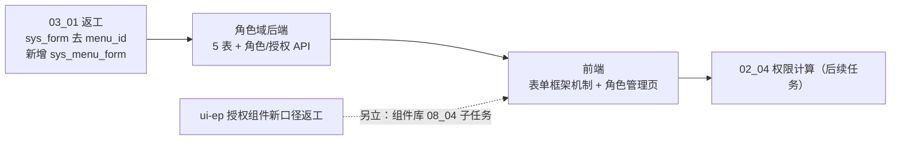
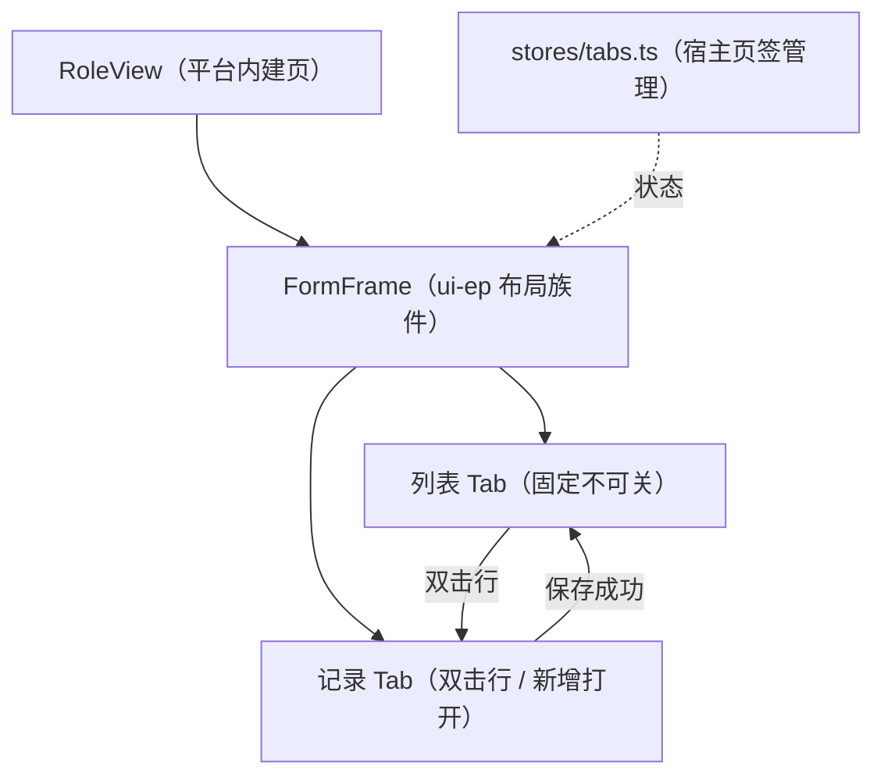

# 03 角色管理（后端授权 + 前端角色管理页）详细设计

> RBAC 基础模块 · 02 用户与角色 · 子任务 03（需求 07-3）｜**定稿（2026-10-06，共 28 项决策确认）**

[文档首页](../../../../../../文档首页.md) › [02 用户与角色](../../02_用户与角色.md) › [03 角色管理](../02_用户与角色_03_角色管理.md) › 详细设计　|　[← 任务文档](../02_用户与角色_03_角色管理.md)

## 1. 背景与目标 <a id="goal"></a>

角色是 RBAC 的**授权载体**：菜单 / 表单 / 操作 / 字段权限与数据权限都挂角色、再经角色分配落到用户。本任务补齐角色定义与授予能力，并交付角色管理页（列表 Tab + 角色记录 Tab + 权限配置四页签），为 `02_04`（主体链权限计算引擎）提供授权数据来源。

**本任务范围**（2026-10-06 逐项确认）：



| 含 | 不含（归口） |
| --- | --- |
| `sys_form` 去 `menu_id` 返工 + 新增 `sys_menu_form` 多对多（模型 / 迁移 / 契约 / 种子 / `my_menu` 查询 / 既有用例） | 三权分立互斥真实校验（`03_02`；本任务 `30048` 仅登记占位） |
| 角色域 5 表（`sys_role` / `sys_user_role` / `sys_role_permission` / `sys_role_field` / `sys_data_scope`）落 **platform 服务租户库**（与权限元数据同服务） | 字段级审计（阶段八） |
| 角色 CRUD、角色分配（用户）、菜单 / 表单 / 操作 / 字段授权、数据权限配置 | 岗位 / 部门分配（mdm 组织域插件，缺失即隐藏） |
| 授权变更的权限版本 +1 与缓存失效 | 权限计算 / 权限缓存读写（`02_04`） |
| 通用「表单框架」宿主机制（列表 Tab + 记录 Tab）+ 角色管理页 | 用户完整域 CRUD（`02_01`；本任务只加**最小用户只读查询**接口） |
| 最小用户只读查询接口（供「选择用户」弹窗） | ui-ep 授权组件新口径返工（组件库 `08_04` 子任务；本任务权限配置区渲染「待返工」空态） |

## 2. 现状实测 <a id="status"></a>

> **组织服务退役（2026-10-07）**：下表 `org 服务` 行为退役前实测快照——bms `org` 服务已定**一步到位退役**，组织主数据（部门 / 岗位 / 用户-岗位）归 **mdm 产品服务**，bms 经 mdm 组织契约消费；本详设续做时该行与相关跨库措辞（§5 / §8 及交付物表 org 侧落点）随**组织服务退役任务**回写。

| 项 | 实测结论 | 取证落点 |
| --- | --- | --- |
| 角色域 | **零实现**：无表 / 无模型 / 无 API / 无契约；数据库设计 5 张表文件与《07_数据库设计_角色管理.md》节点**均未建**（总览已引节点） | 全仓检索 `sys_role` 仅文档命中 |
| `03_01` 菜单元数据 | 已交付：`models/menu.py` 十模型、6 仓储、`MenuMetadataService` / `MyMenuService`、6 路由、契约 `platform.json`；platform 链 head = `0007_menu_metadata` | `services/platform/src/bms_platform/` |
| `sys_form` | **仍是 1:1**：`SysForm.menu_id` + 唯一约束 `uq_sys_form_menu_id_deleted_at`；`FormRepository.get_by_menu`；`_build_snapshot` 用 `form_by_menu={row.menu_id: row}`；`MyMenuNode.form` 单值 | 同上 |
| `sys_menu_form` | **仅表文件**（v2 已去 `menu_id`）；代码零落地 | `设计/数据库设计/数据表设计/sys_menu_form.md` |
| 基座 | `BasePermissionChecker`(+`NullPermissionChecker`) / `require_permission` / `PLUGIN_WIRINGS`（83 条）/ `AuthContext`（无 `permissions` 字段）/ `get_uow`（租户库）/ `get_platform_uow`（平台库）齐备 | `libs/bms_core/` |
| 权限版本计数器 | **不存在**；已有 `bms:global:*:version` 范式仅 `tenant`（`TENANT_VERSION_KEY`）与 `menu`（`menu_version_key()`） | `db/tenant_registry.py`、`menu/base.py` |
| org 服务 | `org:tenant` 链 head = `0005_sys_outbox`，表集 = `{sys_user, sys_account_lock, sys_outbox, sys_event_consumed, sys_event_dead_letter}`；`SERVICE_CATALOG` 中 `service_key="org"`、`table_prefix="org_"`、**`errcode_segment=None`**；**无平台库访问**；无用户列表接口 | `services/org/`、`services/module_registry.py` |
| `sys_user` 字段 | `username / password_hash / name / status / failed_count / locked_until / pwd_* / last_login_at / email / phone / locale / timezone`；**字段是 `name`（无 `nickname`）**、**无 `dept_id`** | `models/user.py` |
| 字典链路 | **已落库并有实现**：`bms_core/dict/`、`platform/api/dict.py`；`GET /dicts/{dict_type}/attrs` 返回属性清单（`attr_key/name/data_type/...`）；迁移 `platform:tenant/0001_dict_and_query_scheme` | `libs/bms_core/dict/` |
| 前端 ui-ep | 授权件**旧口径**：`PermissionConfig`（tree/field/scope/subject）、`PermissionTree`、`FieldPermMatrix`、`DataScopePanel`（动作→表达式）、`SubjectBinding`（user/position/dept） | `packages/ui-ep/src/components/interaction/` |
| 前端宿主 | **无角色页 / 路由 / api / store**；**无「列表 Tab + 记录 Tab」机制**（仅 `ModuleAreaOutlet` 具名插槽宿主 + `dynamic.ts` 菜单占位路由 + `useListPage`）；`PLACEHOLDER_MENU` 含 `/system/role` | `apps/desktop/src/` |
| 种子 | `seed_menu.py` **已含**角色种子：业务码 `role`（文案「角色管理与主体绑定」）、动作码 `role:{query,create,update,delete,grant}`、菜单 `/sys/roles`、按钮 4、字段 `code/name/status` | `backend/ops/seed_menu.py` |

## 3. 交付物清单 <a id="deliver"></a>

### 3.1 数据库设计（先表文件后代码） <a id="deliver-db"></a>

```text
bms文档/设计/数据库设计/
├── 07_数据库设计_角色管理.md                       # 新建节点（总览 §7.2 已引用）
└── 数据表设计/
    ├── sys_role.md                                # 新建
    ├── sys_user_role.md                           # 新建
    ├── sys_role_permission.md                     # 新建
    ├── sys_role_field.md                          # 新建
    ├── sys_data_scope.md                          # 新建
    ├── sys_menu_form.md                           # 状态：待落库 → 已落库
    └── sys_form.md                                # 状态与变更记录：随本任务落库（去 menu_id）
```

- `01_数据库设计_总览.md`：「已设计数据表登记」补 5 行、`sys_menu_form` / `sys_form` 状态改「已落库」；§6.1 / §6.2 表清单核对。

### 3.2 后端（`bms/backend/`） <a id="deliver-backend"></a>

| 层 | 落点 | 内容 |
| --- | --- | --- |
| 基座 | `libs/bms_core/src/bms_core/core/error_codes.py` | 新增 `ErrorCode`：`ROLE_NOT_FOUND=30041`、`ROLE_CODE_EXISTS=30042`、`ROLE_PROTECTED=30043`、`ROLE_ASSIGNED=30044`、`ROLE_SUBJECT_INVALID=30045`、`ROLE_TARGET_INVALID=30046`、`ROLE_SCOPE_VALUE_INVALID=30047`、`ROLE_SEPARATION_CONFLICT=30048`、`ROLE_FIELD_MISMATCH=30049` |
| 基座 | `libs/bms_core/src/bms_core/core/exceptions.py` | 新增 `RoleError(UserOrgError)` 基类 + 9 个子类（命名 `RoleNotFoundError` 等） |
| 基座 | `libs/bms_core/src/bms_core/permission/version.py`（新建） | 权限版本键构造 + `PermissionCacheRegion` 风格辅助（键名见 §5.4） |
| 基座 | `libs/bms_core/src/bms_core/scope/extensions.py`（新建） | `DataScopeExtensionRegistry`（能力域注册表范式）+ `DataScopeExtension` 契约 + Null 空注册表 |
| 基座 | `libs/bms_core/src/bms_core/core/assembly.py` | `PLUGIN_WIRINGS` 增 `data_scope_extension` 条 |
| 基座 | `libs/bms_core/src/bms_core/services/table_registry.py` | `TABLE_OWNERSHIP` 增 5 表（`owner="platform"`、`datasource=TENANT`、`enabled`）；**增 `sys_menu_form`（platform / PLATFORM）**，`sys_form` 备注随多对多更新 |
| platform | `services/platform/src/bms_platform/models/role.py`（新建） | `SysRole` / `SysUserRole` / `SysRolePermission` / `SysRoleField` / `SysDataScope` + 常量（`PERM_TYPE_*` / `POLICY_TYPE_*` / `NO_SOURCE_MENU_ID`） |
| platform | `services/platform/src/bms_platform/models/__init__.py` | `MODEL_MODULES` 追加 `bms_platform.models.role` |
| platform | `alembic/versions/platform/tenant/0007_role_tables.py`（新建） | `platform:tenant` 链建 5 表 |
| platform | `services/platform/src/bms_platform/repositories/role.py`（新建） | 5 仓储（`RoleRepository` / `UserRoleRepository` / `RolePermissionRepository` / `RoleFieldRepository` / `DataScopeRepository`）+ 分配批量软删 / 恢复原行 / 同库筛选 |
| platform | `services/platform/src/bms_platform/services/role.py`（新建） | `RoleService`（CRUD + 内置保护 + 删除保护） |
| platform | `services/platform/src/bms_platform/services/role_grant.py`（新建） | `RoleGrantService` + `MenuMetadataChecker`（授权全量覆盖 + 来源 / 目标校验 + 版本 +1） |
| platform | `services/platform/src/bms_platform/services/role_assign.py`（新建） | `RoleAssignService`（用户分配：幂等 upsert（恢复原行）+ 解绑 + 已分配列表 + 版本 +1） |
| platform | `services/platform/src/bms_platform/services/users.py` | 追加 `UserQueryService`（最小只读查询，**同库**） |
| platform | `services/platform/src/bms_platform/schemas/role.py`（新建） | 角色 / 分配 / 授权 / 字段 / 数据权限请求与响应模型（含清单包装类型） |
| platform | `services/platform/src/bms_platform/schemas/users.py` | 追加 `UserItem`（最小只读查询行） |
| platform | `services/platform/src/bms_platform/api/role.py`（新建） | `router`（`/roles` 及 `users` / `permissions` / `fields` / `data-permissions`；租户库 UoW + 平台库只读会话双依赖；分配与授权接 `Idempotency-Key`） |
| platform | `services/platform/src/bms_platform/api/users.py`（新建） | `router`（`/users` 最小只读查询） |
| platform | `services/platform/src/bms_platform/api/router.py` | 登记两 router |
| platform | `services/platform/tests/role/` + `tests/api/test_role_api.py`（新建） | 后端用例（服务层 + 端点） |
| 返工 | `alembic/versions/platform/platform/0008_menu_form_multi.py`（新建） | 建 `sys_menu_form`、删 `sys_form.menu_id` 与唯一约束、数据搬迁 |
| 返工 | `services/platform/src/bms_platform/models/menu.py` | 新增 `SysMenuForm`；`SysForm` 去 `menu_id` 与唯一约束 |
| 返工 | `services/platform/src/bms_platform/repositories/menu.py` | 新增 `MenuFormRepository`；`FormRepository` 去 `get_by_menu`（改按业务 / 全量） |
| 返工 | `services/platform/src/bms_platform/services/menu.py` | `_build_snapshot` 改多对多（`form_by_menu` → `forms_by_menu`）；`SnapshotMenu.form` → `forms`；表单 CRUD 去 `menu_id`、增关联维护 |
| 返工 | `services/platform/src/bms_platform/services/my_menu.py` | `_is_link_visible` / `_to_node` 改多表单 |
| 返工 | `services/platform/src/bms_platform/schemas/menu.py` | `FormCreateRequest` 去 `menu_id` 增 `menu_ids`；`FormItem` 改 `menu_ids`；`MyMenuNode.form` → `forms` |
| 返工 | `services/platform/src/bms_platform/api/menu.py` | `/forms` 端点随 schema 调整 |
| 返工 | `libs/bms_core/tests/alembic/test_alembic_chains.py`、`tests/services/test_table_registry.py`、`tests/ops/test_migration_ops.py` | 链头与表集断言同步 |
| 返工 | `services/platform/src/bms_platform/__init__.py`、`libs/bms_core/src/bms_core/services/module_registry.py` | `CONTRACT_VERSION` 与 `SERVICE_CATALOG` 的 `sys` 记录升 **0.2.0**（破坏性变更口径见 N8） |
| 种子 | `ops/seed_menu.py` | role 业务码文案改「角色管理」；表单挂接改 `sys_menu_form`（表单按 `business_id` upsert + 关联入口） |
| 契约 | `deploy/contracts/platform.json` + `baseline/platform.json` | 重生成与基线更新（org 无变化） |
| 类型 | `frontend/packages/api-types/src/platform.ts` | `pnpm --filter @bms/api-types gen` 重生成 |
| 消费链 | `apps/desktop/src/stores/menu.ts` | 动态菜单表单元数据改多表单（`node.forms`，全部进索引、按路径取首个为主表单） |

### 3.3 前端（`bms/frontend/`） <a id="deliver-frontend"></a>

| 层 | 落点 | 内容 |
| --- | --- | --- |
| ui-ep | `packages/ui-ep/src/components/layout/FormFrame.vue`（新建，N7 定名） | 表单框架：列表 Tab（固定）+ 记录 Tab（可关）容器、页签渲染与切换、脏标记、`beforeClose` 关闭拦截、`#list` / `#record` 插槽 |
| ui-ep | `packages/ui-ep/src/components/display/SysInfoPanel.vue`（新建） | 系统信息面板（记录页「系统信息」子页签通用件）：主键 / 版本 / 表单 / 创建人·时间 / 更新人·时间（**本轮确认新增**，见 §12 第八轮） |
| ui-ep | `packages/ui-ep/src/index.ts` | 导出 `FormFrame`（+`FormFrameTab`）与 `SysInfoPanel`（+`SysInfoData`） |
| ui-ep | `packages/ui-ep/tests/form-frame.spec.ts`、`tests/sys-info-panel.spec.ts`（新建） | 护栏用例 |
| ui-ep | `packages/ui-ep/tests/layout-style.spec.ts` | 布局族冻结范围 18 → **19 件**（含 `FormFrame`） |
| 宿主 | `apps/desktop/src/stores/tabs.ts`（新建） | 页签管理 store（列表 Tab 固定、记录 Tab 增删、脏态、关闭拦截 + `discard` 强关） |
| 宿主 | `apps/desktop/src/api/role.ts`（新建） | 角色 CRUD / 分配 / 授权 / 数据权限（`@bms/api-types` 的 `platform` 命名空间；ID 字符串口径载荷类型） |
| 宿主 | `apps/desktop/src/api/user.ts`（新建） | 最小用户查询（「选择用户」弹窗取数） |
| 宿主 | `apps/desktop/src/views/system/RoleView.vue`（新建） | 角色管理页（表单框架宿主：列表 Tab + 记录 Tab） |
| 宿主 | `apps/desktop/src/views/system/RoleRecordTab.vue`（新建） | 角色记录 Tab（详细信息 / 权限配置 / 系统信息） |
| 宿主 | `apps/desktop/src/views/system/role/RolePermissionConfig.vue`（新建） | 权限配置容器（四页签；内容区由 ui-ep 新口径件承载，未就绪渲染空态；`save` / `revert` 向记录页暴露） |
| 宿主 | `apps/desktop/src/views/system/role/RoleAssignTab.vue`（新建） | 角色分配（用户分配内建：选择用户弹窗 + 已分配列表 + 挂起变更随宿主保存；mdm 插件挂接位降级隐藏） |
| 宿主 | `apps/desktop/src/router/index.ts` | 静态注册 `/sys/roles` → `RoleView` |
| 宿主 | `packages/core/src/domain/menu.ts` | `PLACEHOLDER_MENU` 的 `/system/role` 占位作废（口径统一为 `/sys/roles`） |
| 宿主 | `apps/desktop/src/dev/RoleCheck.vue` + `dev/roleCheck.ts` + `role-check.html`（新建） | 开发态核对页（表单框架 + 记录页三子页签 + 系统信息件真实组装） |
| 配置 | `.vscode/launch.json`（工作区根 + `bms/` 两处） | 登记核对页选页 `role-check.html` |
| 测试 | `apps/desktop/tests/`（新建 `role-view.spec.ts` / `tabs-store.spec.ts` / `role-api.spec.ts`；更新 `menu-store.spec.ts` 多表单） | 用例 |

## 4. 数据设计要点 <a id="data"></a>

### 4.1 表结构 <a id="data-tables"></a>

**`sys_role`（角色）** — platform 服务租户库 `bms_platform_{code}`

| 字段 | 类型 | 可空 | 约束 / 默认 | 说明 |
| --- | --- | --- | --- | --- |
| `id` | BIGINT | 否 | 主键，雪花 ID | 主键 |
| `code` | VARCHAR(64) | 否 | 与 `deleted_at` 复合唯一 | 角色码（租户内唯一；内置角色码固定） |
| `name` | VARCHAR(128) | 否 | — | 角色名称 |
| `status` | VARCHAR(16) | 否 | 默认 `enabled` | 状态（`enabled` / `disabled`） |
| 公共字段 | — | — | `BaseModel` | 审计 / 软删除 / 乐观锁 |

- 唯一：`uq_sys_role_code_deleted_at (code, deleted_at)`；索引：`idx_sys_role_status (status)`。
- **内置角色不落库标记**：按 `role.protected_codes`（`system_admin` / `security_admin` / `audit_admin`）常量判定 —— 判定为「配置常量」而非库列，避免内置标记被改。
  > **改定（2026-10-08，子任务 [`_01 角色码可改与内置判定脱钩`](../02_用户与角色_03_角色管理_01_角色码可改与内置判定脱钩/02_用户与角色_03_角色管理_01_角色码可改与内置判定脱钩.md)）**：改为按 **`role_type` 列**判定（`custom` / `system` / `security` / `audit`）；常量与系统参数已退役。原「不落库标记」的顾虑（避免标记被改）由「`role_type` 不提供修改入口」承接——改列判定换来的是**角色码可放开修改**（内部无任何按 `code` 的引用）。

**`sys_user_role`（角色 × 用户分配）**

| 字段 | 类型 | 可空 | 约束 / 默认 | 说明 |
| --- | --- | --- | --- | --- |
| `id` | BIGINT | 否 | 主键，雪花 ID | 主键 |
| `role_id` | BIGINT | 否 | 索引 | 逻辑外键 → `sys_role.id`（同库） |
| `user_id` | BIGINT | 否 | 索引 | 逻辑外键 → `sys_user.id`（**跨服务**，org 服务租户库） |
| 公共字段 | — | — | `BaseModel` | — |

- 唯一：`uq_sys_user_role_role_user_deleted_at (role_id, user_id, deleted_at)`；索引：`idx_sys_user_role_role_id`、`idx_sys_user_role_user_id`。
- **与用户管理页「用户分配角色」同一张表**（`02_02` 复用；不设数量上限）。

**`sys_role_permission`（角色授权：菜单 / 表单 / 操作）**

| 字段 | 类型 | 可空 | 约束 / 默认 | 说明 |
| --- | --- | --- | --- | --- |
| `id` | BIGINT | 否 | 主键，雪花 ID | 主键 |
| `role_id` | BIGINT | 否 | 索引 | 逻辑外键 → `sys_role.id`（同库） |
| `perm_type` | VARCHAR(16) | 否 | — | `menu` / `form` / `action` |
| `target_id` | BIGINT | 否 | 索引 | 授权目标（平台实体雪花 id：`sys_menu.id` / `sys_form.id` / `sys_action.id`；跨库逻辑外键） |
| `source_menu_id` | BIGINT | 否 | 默认 `0` | 来源菜单入口 id；**`0` = 表单级直接授予**（不用 NULL，避免唯一约束在 NULL 上跨库失效） |
| 公共字段 | — | — | `BaseModel` | — |

- 唯一：`uq_sys_role_permission_role_type_target_source_deleted_at (role_id, perm_type, target_id, source_menu_id, deleted_at)`；索引：`idx_sys_role_permission_role_type (role_id, perm_type)`、`idx_sys_role_permission_target (target_id)`。
- **菜单连带表单查看**：勾选菜单入口 `M`（关联表单 `F`）→ 落 `(form, F, source=M)`；取消勾选 → 仅删 `source_menu_id = M` 的连带行，其它来源行保留。
- 权限码默认无；字段权限见下表；**业务权限不落表**（由已授予表单按「表单→业务」对照关系推导）。

**`sys_role_field`（角色字段权限）**

| 字段 | 类型 | 可空 | 约束 / 默认 | 说明 |
| --- | --- | --- | --- | --- |
| `id` | BIGINT | 否 | 主键，雪花 ID | 主键 |
| `role_id` | BIGINT | 否 | 索引 | 逻辑外键 → `sys_role.id`（同库） |
| `form_id` | BIGINT | 否 | — | 表单 id（平台实体，跨库逻辑外键） |
| `field_id` | BIGINT | 否 | — | 字段 id（平台实体，跨库逻辑外键） |
| `visible` | BOOLEAN | 否 | 默认 `true` | 是否可见 |
| `editable` | BOOLEAN | 否 | 默认 `true` | 是否可编辑 |
| `source_menu_id` | BIGINT | 否 | 默认 `0` | 来源菜单入口（同 `sys_role_permission` 口径） |
| 公共字段 | — | — | `BaseModel` | — |

- 唯一：`uq_sys_role_field_role_form_field_source_deleted_at (role_id, form_id, field_id, source_menu_id, deleted_at)`；索引：`idx_sys_role_field_role_form (role_id, form_id)`。
- **默认全开**：只存**收窄项**（`visible=false` 或 `editable=false`）；`PUT` 全量覆盖（先删后插）。

**`sys_data_scope`（角色数据权限）**

| 字段 | 类型 | 可空 | 约束 / 默认 | 说明 |
| --- | --- | --- | --- | --- |
| `id` | BIGINT | 否 | 主键，雪花 ID | 主键 |
| `role_id` | BIGINT | 否 | 索引 | 逻辑外键 → `sys_role.id`（同库） |
| `dict_type_id` | BIGINT | 否 | — | 字典类型 id（platform 服务租户库实体，跨服务逻辑外键） |
| `policy_type` | VARCHAR(16) | 否 | — | `select` / `region` / `match` / `extension` |
| `config` | JSON | 否 | 默认 `[]` | 结构化策略配置（只选不编，按 `policy_type` 分结构，后端 schema 强校验） |
| 公共字段 | — | — | `BaseModel` | — |

- 唯一：`uq_sys_data_scope_role_dict_policy_deleted_at (role_id, dict_type_id, policy_type, deleted_at)`；索引：`idx_sys_data_scope_role_id (role_id)`。
- `config` 按策略分结构（示例）：
  - `select`：`[{"item_code": "enabled"}, ...]`（勾选字典数据）
  - `region`：`[{"start": "a", "end": "m"}, ...]`（开始值 / 结束值）
  - `match`：`[{"field": "code", "pattern": "user_*"}, ...]`（字段 + 通配符值）
  - `extension`：`[{"key": "dept_subtree", "params": {...}}, ...]`（扩展权限 + 参数 JSON）
- 四类**并集兜底**；全部为空 = 无数据权限；租户过滤由 `02_04` 强制叠加。

### 4.2 返工：`sys_menu_form` 与 `sys_form` <a id="data-rework"></a>

- **`sys_menu_form`（平台库）**：字段 `menu_id` / `form_id` + 公共字段；唯一 `(menu_id, form_id, deleted_at)`；索引 `menu_id`、`form_id`；**多对多**（一个菜单入口可关联多个表单、同一表单可被多入口引用、表单可无入口）。
- **`sys_form` 去 `menu_id`**：删列 + 删唯一约束 `uq_sys_form_menu_id_deleted_at`；`component` / `status` 保留；表单仍 1:1 挂业务（`uq_sys_form_business_id_deleted_at` 保留）。
- **迁移数据搬迁**：`0008` 迁移中把既有 `sys_form.menu_id` 逐行写入 `sys_menu_form`（幂等；`menu_id` 为 0 / NULL 的行不写），随后删列。

### 4.3 跨库引用与库归属 <a id="data-boundary"></a>

| 实体 | 库 | 引用方式 |
| --- | --- | --- |
| 角色 5 表 | platform 服务租户库 `bms_platform_{code}` | 同库 join（`sys_role` 及各授权表、`sys_dict_type`）；`sys_user` 在 org 服务租户库（**跨服务**）；平台元数据在 platform 服务平台库（同服务、跨库） |
| `sys_menu` / `sys_form` / `sys_action` | platform 服务平台库 | 授权表存雪花 id（逻辑外键，不 join） |
| `sys_dict_type` / `sys_dict_attr` | platform 服务租户库 | 数据权限表存 id；匹配字段白名单经 `GET /dicts/{dict_type}/attrs` |

- **不建物理外键**（沿用既有口径）。

## 5. 接口设计 <a id="api"></a>

> **角色与授权落 platform 服务**（`/api/v1/roles` 及授权子资源）；**最小用户只读查询落 platform 服务**（`/api/v1/users`，用户表随 `02_05` 归口 platform 服务租户库，与角色分配**同库**）。查询类用 `role:query` / `user:query`，写与授权类用 `role:create/update/delete/grant`。

### 5.1 角色 CRUD 与角色分配 <a id="api-role"></a>

| 方法 | 路径 | 权限码 | 请求要点 | 响应要点 / 失败分支 |
| --- | --- | --- | --- | --- |
| GET | `/api/v1/roles` | `role:query` | `kw`（角色码 / 名称）、`status`、`page`、`size` | `{list, total, page, size}`；每项 `id/code/name/status/builtin/subject_count` |
| POST | `/api/v1/roles` | `role:create` | `code`（`role.code_pattern` 校验）、`name`、`status?` | 返回新建项；`code` 重复 → **30042** |
| GET | `/api/v1/roles/{id}` | `role:query` | — | 角色详情 + `version`；不存在 → **30041** |
| PUT | `/api/v1/roles/{id}` | `role:update` | `name`、`status`、`version`（乐观锁） | 内置角色改 `status` → **30043**；版本冲突 → 409 |
| DELETE | `/api/v1/roles/{id}` | `role:delete` | — | 内置角色 → **30043**；仍有用户分配 → **30044** |
| GET | `/api/v1/roles/{id}/users` | `role:query` | `kw`、`page`、`size` | 已分配用户（`user_id/username/name/status`，同库 join `sys_user`） |
| POST | `/api/v1/roles/{id}/users` | `role:grant` | `user_ids[]` + `Idempotency-Key` | 批量分配（幂等 upsert）；用户不存在 / 停用 → **30045** |
| DELETE | `/api/v1/roles/{id}/users/{user_id}` | `role:grant` | — | 解绑（软删）；版本 +1 |

- **内置角色保护**：`code ∈ role.protected_codes` ⇒ 禁删、禁停用、禁改归属（本任务不提供「改归属」接口）；判定取配置常量。
  > **改定（2026-10-08）**：判定改为 **`role_type != custom`** ⇒ 禁删、禁停用、**禁改类型**；**角色码随之放开可改（含内置角色）**。见[子任务 `_01` 详细设计](../02_用户与角色_03_角色管理_01_角色码可改与内置判定脱钩/设计/01_详细设计_01_角色码可改与内置判定脱钩.md)。
- **角色码不可改**：`PUT` 不接受 `code`（原型：角色码创建后只读）。
- **分配幂等 upsert（第八轮确认）**：已生效分配行跳过；仅存历史软删行时**恢复原行**（清 `deleted_at`）——同角色同用户恒只有一行有效记录、行数不膨胀；其余新建。重复分配不触发版本递增（无变更即不 +1）。
- **解绑幂等**：软删生效分配行；该用户本就未分配时**无操作**且不递增版本。
- **用户有效性同库校验**：`sys_user` 与 `sys_user_role` 同在 platform 服务租户库，用户不存在 / 已停用 → `30045`。

### 5.2 授权接口（全量覆盖） <a id="api-grant"></a>

| 方法 | 路径 | 权限码 | 说明 |
| --- | --- | --- | --- |
| GET | `/api/v1/roles/{id}/permissions` | `role:query` | 授权数据（含来源）；**元数据（菜单树 / 表单 / 动作 / 字段）由前端调 platform 契约取** |
| PUT | `/api/v1/roles/{id}/permissions` | `role:grant` | 全量覆盖：菜单 / 表单 / 操作授权（含来源）+ `Idempotency-Key` |
| GET | `/api/v1/roles/{id}/fields` | `role:query` | 字段权限（只返回收窄项） |
| PUT | `/api/v1/roles/{id}/fields` | `role:grant` | 全量覆盖：字段权限 |
| GET | `/api/v1/roles/{id}/data-permissions` | `role:query` | 数据权限（按字典 × 策略） |
| PUT | `/api/v1/roles/{id}/data-permissions` | `role:grant` | 全量覆盖：数据权限 |

**`permissions` 载荷**（统一条目结构）：

```json
{
  "entries": [
    {"perm_type": "menu", "target_id": 1001, "source_menu_id": 0},
    {"perm_type": "form", "target_id": 2001, "source_menu_id": 1001},
    {"perm_type": "permission", "target_id": 3001, "source_menu_id": 1001}
  ]
}
```

- **来源校验（写时）**：`source_menu_id != 0` 时须满足「该菜单已授权（`perm_type=menu, target_id=source_menu_id` 存在）且该菜单关联该表单 / 动作」；不满足 → **30046**。
- **表单查看连带**：由前端呈现、后端**落库为显式 `form` 条目**（`source_menu_id` = 入口菜单 id）；取消菜单勾选仅删该来源的连带行。
- **白名单校验**：`target_id` 须在对应实体内存在（经 platform 只读校验 / 契约校验），否则 **30046**。
- **幂等与事务**：`Idempotency-Key` 头；单事务**先删后插**全量覆盖；失败整体回滚；成功**一次**版本 +1。

**`fields` 载荷**：

```json
{
  "entries": [
    {"form_id": 2001, "field_id": 4001, "visible": false, "editable": false, "source_menu_id": 0}
  ]
}
```

- 校验：`field_id` 须属该 `form_id` 字段集合，否则 **30049**；`editable=false` 时 `visible` 必须 `false`（不可见即不可编辑）。

**`data-permissions` 载荷**：

```json
{
  "entries": [
    {"dict_type_id": 1, "policy_type": "select", "config": [{"item_code": "enabled"}]},
    {"dict_type_id": 1, "policy_type": "match", "config": [{"field": "code", "pattern": "user_*"}]}
  ]
}
```

- **结构校验**：`policy_type` ∈ `{select, region, match, extension}`；`config` 按策略 schema 校验；`match.field` 须属该字典类型白名单（内置 `code/name/remark` + 已启用 `attr_key`，经 `GET /dicts/{dict_type}/attrs` 同口径）；`match.pattern` 仅允许 `*` `?` 与中英文 / 数字 / 下划线（越界 → **30047**）；`extension.key` 须在扩展权限注册表内（未注册 → **30047**）。

### 5.3 最小用户只读查询 <a id="api-user"></a>

| 方法 | 路径 | 权限码 | 说明 |
| --- | --- | --- | --- |
| GET | `/api/v1/users` | `user:query` | `kw`（账号 / 姓名）、`status`、`page`、`size` → `{list, total, page, size}`，每项 `id/username/name/status` |

- 供「选择用户」弹窗与已分配列表回显；**接口按终态设计**（完整用户域 `02_01` 复用同一服务与表）。
- 仅返回最小字段（不含 `password_hash` / `email` / `phone` 等敏感项）。

### 5.4 版本失效与缓存 <a id="api-version"></a>

- **权限版本键**：`bms:{tenant_id}:permission:version`（按租户；与 `menu` 的全局版本键区分），常量与辅助落 `libs/bms_core/src/bms_core/permission/version.py`，供 `02_04` 复用。
- **触发点**：角色 / 授权 / 字段 / 数据权限 / 用户分配变更 → 同事务提交后 `aincrease` 版本键；本任务另按受影响角色关联用户删除用户权限缓存键（键模式与 `02_04` 对齐；缓存未落地时为空操作）。
- **一次递增**：同一请求内多处变更（菜单 + 表单 + 操作 + 字段 + 数据权限）只递增一次。

## 6. 前端设计 <a id="frontend"></a>

### 6.1 表单框架机制（本任务新建） <a id="frontend-frame"></a>



- **件（ui-ep `layout/`）**：容器 + 页签栏 + 内容区，props 受控（`tabs` / `active` / `closable`）、emits（`open` / `close` / `activate`）、插槽 `#list` / `#record`；脏数据拦截由宿主经 `beforeClose` 回调注入。
- **store（宿主 `stores/tabs.ts`）**：`tabs`（含 `key/type/title/closable/dirty`）、`open` / `close` / `activate` / `setDirty` / `reset`；与既有菜单动态路由 / 页签装配协同。
- 护栏用例：件渲染与页签契约；store 的增删 / 脏数据拦截。
- 《前端基类清单》登记新件与 store。

### 6.2 角色管理页结构与数据接入 <a id="frontend-page"></a>

- **列表 Tab**：三段式（工具栏 → 筛选 → 表格），**无操作列**、多选、`subject_count` 列、「内置」标记、状态标签；双击行 / 「新增」打开记录 Tab；批量删除（内置保护）；分页（缺省 20）。
- **记录 Tab**：信息栏三子页签——**详细信息**（角色码只读 / 名称 / 状态；只读 ⇄ 编辑分态）、**权限配置**（四页签）、**系统信息**（复用 `02_公共原型/04_系统信息组件`）。
- **工具栏单一保存**：详细信息页签保存基本信息；权限配置页签保存授权（脏数据提示 + 「撤销」）；授权变更不入其它保存入口。
- 取数：角色 CRUD / 授权走 `api/role.ts`（`org` 命名空间契约类型）；菜单树 / 表单 / 动作 / 字段元数据走 `platform` 契约（`03_01` 已交付）；匹配字段白名单走 `GET /dicts/{dict_type}/attrs`。

### 6.3 权限配置区空态与接入位 <a id="frontend-placeholder"></a>

- 权限配置四页签（菜单权限 / 表单权限 / 数据权限 / 角色分配）**结构按原型搭好**；「菜单权限 / 表单权限 / 数据权限」三页签的内容件属 ui-ep 新口径返工件（组件库 `08_04` 子任务）。
- 返工件未就绪时渲染**「权限配置组件待组件库 08_04 返工」空态**（不接旧口径件，避免与新设计混淆）；「角色分配」页签由本任务实现（用户分配内建）。
- **接入位契约**：空态处预留 `#permission-panel` 插槽与统一 props（`roleId` / `readonly` / `jobs` 注入），返工件就绪后直接替换，不改页面结构。

### 6.4 降级口径 <a id="frontend-degrade"></a>

| 场景 | 降级 |
| --- | --- |
| ui-ep 授权返工件未就绪 | 权限配置三页签渲染「待返工」空态（页面其余正常） |
| mdm 岗位 / 部门分配插件缺失 | 「岗位分配 / 部门分配」子页签**隐藏**（用户分配不受影响） |
| 平台元数据（菜单 / 表单 / 动作）取数失败 | 对应页签置空 + 一次错误提示（不阻塞记录页其余部分） |
| 字典 `attrs` 取数失败 | 匹配字段退为仅内置 `code/name/remark` |

### 6.5 路由与菜单 <a id="frontend-route"></a>

- 菜单 `/sys/roles`（`seed_menu.py` 已下发，挂 `role` 业务）由动态菜单装载；角色页作为**平台内建页**在宿主静态注册真实路由（`installMenuRoutes` 对已存在路径跳过，占位路由不顶替）。
- `PLACEHOLDER_MENU` 的 `/system/role` 占位**作废**（口径统一 `/sys/roles`）。

## 7. 原型依据与对照口径 <a id="prototype"></a>

- **原型依据**：`bms文档/设计/原型设计/09_角色管理/02_角色列表页.html`、`03_角色表单页.html`、`01_设计说明.html`（2026-10-06 定稿）。
- **验收基准**：以原型为准；布局冲突以《布局设计 · 表单框架》《布局设计 · 列表页》为准。
- **对照项**（交付前逐项截图比对，同视口 1440×900）：
  1. 列表页三段式 / 无操作列 / 内置标记 / 批量删除保护；
  2. 记录页三子页签与工具栏单一保存；
  3. 权限配置四页签结构（菜单入口 → 操作 / 字段；所有表单 → 操作 / 字段）；
  4. 角色分配（用户分配列表 + 选择用户弹窗 + 计数）；
  5. 数据权限（字典列表 → 选择 / 区域 / 匹配 / 扩展；只选不编；通配符校验提示）；
  6. 偏离项（**权限配置内容区为「待返工」空态**）须在测试记录登记并说明归口。

## 8. 测试设计 <a id="test"></a>

| 层 | 用例范围 | 说明 |
| --- | --- | --- |
| 后端 · 角色 | CRUD、`code` 唯一（30042）、内置保护（30043）、删除保护（30044）、乐观锁冲突 | `tests/role/test_role_service.py` |
| 后端 · 分配 | 批量分配 / 解绑、重复分配幂等、**解绑后再分配恢复原行**、用户不存在 / 停用（30045）、同库筛选 | `tests/role/test_role_assign.py` + `tests/api/test_role_api.py` |
| 后端 · 授权 | 全量覆盖（先删后插）、`Idempotency-Key` 幂等、来源校验（30046）、目标不存在（30046）、条目重复（10001） | `tests/role/test_role_grant.py` + `tests/api/test_role_api.py`（授权目标经 `MenuMetadataChecker` 校验） |
| 后端 · 字段 | 只存收窄项、默认全开、`visible/editable` 约束、字段不匹配（30049） | `tests/role/test_role_grant.py` |
| 后端 · 数据权限 | 四策略结构校验、通配符越界（30047）、`match.field` 白名单（内置 + `attr_key`）、扩展未注册（30047）、字典不存在（30047）、全量覆盖 | `tests/role/test_role_grant.py` |
| 后端 · 版本 | 变更一次 +1、无变更不递增（重复分配 / 未分配解绑）、多点变更只增一次 | `tests/role/test_role_assign.py`（内存缓存 Region 替身） |
| 后端 · 用户查询 | 分页 / 筛选、敏感字段不返回 | platform 用例（用户表同库） |
| 后端 · 返工 | `sys_menu_form` 多对多、`sys_form` 去 `menu_id`、`/menus/my` 多表单、迁移数据搬迁、链头与表集断言 | platform + 基座用例 |
| 前端 · 件 | `FormFrame` 渲染 / 页签契约 / 脏数据拦截；`stores/tabs.ts` 增删 | ui-ep + desktop 用例 |
| 前端 · 页 | 列表页（筛选 / 双击开记录 / 内置禁用删除）、记录页（分态 / 单一保存 / 脏数据）、角色分配（弹窗选择 / 移除）、授权空态 | desktop 用例 + 宿主护栏 |
| 原型对照 | §7 六项逐页截图比对 | 测试记录登记结论 |
| Kiwi | 一条策展用例（角色 CRUD + 授权 + 数据权限 + 版本失效），**先登记取得编号**后再编码并标注 | 分类「平台骨架」/ P2 / CONFIRMED / 标签「自动化」 |

## 9. 登记落点 <a id="register"></a>

| 落点 | 内容 |
| --- | --- |
| 数据库设计 | 节点《07_数据库设计_角色管理.md》+ 5 表文件；`sys_menu_form` / `sys_form` 状态与变更记录；总览登记两处 |
| 《后端基类清单》 | 错误码 3xxxx 新增码位与 `RoleError`；权限版本基座；`DataScopeExtensionRegistry`；`PLUGIN_WIRINGS` 新增条 |
| 《前端基类清单》 | 表单框架件与页签 store；权限配置容器接入位 |
| 规范 | 《后端开发规范》「后端基座体系」节（权限版本 / 数据权限扩展注册表）；《前端开发规范》如涉件族口径 |
| 计划 | `计划/01_计划_RBAC基础模块.md`：`02_03` 统计与窗口、已完成 / 剩余计数、后续窗口顺延（唯一进度落点） |
| 需求 | 需求 07-3：错误码登记、`sys_form` 返工与多对多说明、最小用户查询接口边界 |
| 任务 | 本文档 + 实施记录 + 测试记录；任务文档范围与依赖回写 |
| 其他 | `seed_menu.py` role 业务码文案；契约 `platform.json` / `org.json` 与基线；`api-types` 重生成 |

## 10. 实施步骤 <a id="steps"></a>


## 11. 边界与开放项 <a id="open"></a>

**新增待决项 N1~N8 已全部确认**（结论见 §12「第六轮 / 第七轮」），无遗留待定项。

**其它边界**：

- 岗位 / 部门分配依赖基座「显式上下文注入通道」（需求 `05-11`，另立项）→ 本任务按降级（子页签隐藏）。
- 列表导出（`export`）、查询方案（`query`）消费 RBAC 权限归对应业务阶段。
- 角色纳入全文检索、回收站恢复授权回补归后续。
- 三权互斥（`30048`）真实校验归 `03_02`。
- 字段级审计归阶段八。

## 12. 决策确认 <a id="decide"></a>

**第一轮（范围与边界，2026-10-06 确认）**

| # | 待决项 | 结论 |
| --- | --- | --- |
| 1 | 交付范围 | 后端全套（角色 5 表 + 授权 API + 契约 + 种子）+ 前端角色页；ui-ep 授权组件返工**另立**组件库 `08_04` 子任务 |
| 2 | 角色表落点 | 归 **platform 服务租户库**（与权限元数据同服务、授权校验不跨服务）。**2026-10-07 改定**：原定 org 租户库，因「权限体系与平台元数据同服务」更内聚而改；`sys_user` 迁 platform 另立专项任务（中间期 `sys_user_role.user_id` 为跨服务逻辑外键） |
| 3 | `sys_form` 多对多返工 | **并入本任务**（去 `menu_id`、落 `sys_menu_form`） |
| 4 | 表单框架宿主机制 | **本任务新建通用机制**（列表 Tab + 记录 Tab），角色页为首个消费者 |

**第二轮（授权数据与控制边界）**

| # | 待决项 | 结论 |
| --- | --- | --- |
| 5 | 授权表结构 | `perm_type`=menu/form/permission；`target_id` 存平台实体雪花 id；勾选菜单**显式落连带 `form` 记录 + `source_menu_id`** |
| 6 | 数据权限存储 | `sys_data_scope` **单表 + `config` JSON**（按 `policy_type` 分结构，后端 schema 强校验） |
| 7 | 用户来源 | 本任务在 org 新增**最小用户只读查询接口**（完整 CRUD 仍归 `02_01`） |
| 8 | 版本与审计 | 本任务做**权限版本 +1 与缓存失效**；字段级审计归阶段八 |

**第三轮（落点与配套口径）**

| # | 待决项 | 结论 |
| --- | --- | --- |
| 9 | 表单框架落点 | ui-ep `layout/` 新增件 + 宿主页签 store；《前端基类清单》登记 |
| 10 | 组件返工立项 | 组件库 `08_04` 下新增嵌套子任务先行（不新增需求编号）；本任务权限配置区渲染**空态** |
| 11 | 错误码与契约 | 新增 `RoleError` + `30041~30049`；契约落 `org.json`；`CONTRACT_VERSION` 不升 |
| 12 | 匹配字段白名单 | **按字典扩展属性动态生成**（用户选定） |

**第四轮（数据权限与设计件）**

| # | 待决项 | 结论 |
| --- | --- | --- |
| 13 | 匹配字段组成 | 内置 `code/name/remark` + 该字典类型 `attr_key`（复用 `GET /dicts/{dict_type}/attrs`）；后端同口径白名单校验 |
| 14 | 扩展权限接入 | 基座建 `DataScopeExtensionRegistry`，本期 **Null 空注册表**（未注册即隐藏该 Tab） |
| 15 | 数据库设计件 | 新建《07_数据库设计_角色管理.md》节点 + 5 表文件；`sys_menu_form` / `sys_form` 状态改「已落库」，总览两处回写 |
| 16 | 三权边界 | 只做内置角色保护（30043）；`30048` 登记占位，互斥校验归 `03_02` |

**第五轮（进度与登记）**

| # | 待决项 | 结论 |
| --- | --- | --- |
| 17 | 进度与窗口 | 按新增范围重估并回写阶段计划表；窗口 **2026-10-17 ~ 2026-10-29**（后续窗口顺延） |
| 18 | 组件库返工安排 | 本次**只建任务文档 + 计划登记**，实施另行安排（先于本任务前端开工） |
| 19 | Kiwi 登记 | 沿用「平台骨架」分类 / P2 / CONFIRMED / 标签「自动化」，一条策展用例 |
| 20 | 路由与挂接 | 菜单 `/sys/roles` 由 `seed_menu.py` 下发；角色页为**平台内建页**宿主静态注册；`/system/role` 占位作废 |

**第六轮（新增待决项 N1~N4，2026-10-06 确认）**

| # | 待决项 | 结论 |
| --- | --- | --- |
| N1 | 权限版本键作用域 | **按租户** `bms:{tenant_id}:permission:version`（与 `02_04` 缓存键同租户口径） |
| N2 | `source_menu_id` 无来源表示 | 用 **`0`**（替代 NULL，规避唯一约束在 NULL 上的跨库语义差异；概要需回写） |
| N3 | 是否冗余 `target_code` | **不冗余**，只存 `target_id`；`02_04` 经平台只读契约批量回显 code |
| N4 | 字典引用键与取数 | `dict_type_id`（BIGINT）+ 新增基座**字典属性 schema 读出口**（`BaseDictAttrSource` local / http 双实现 + 注册表），org 经能力域读 `attr_key` 白名单 |

**第七轮（新增待决项 N5~N8，2026-10-06 确认）**

| # | 待决项 | 结论 |
| --- | --- | --- |
| N5 | org `errcode_segment` | **保持 `None` 不变**（`"03"` 已被 report 占用；本任务只在 `error_codes.py` 登记码位） |
| N6 | API 路径前缀 | **`/api/v1/roles`、`/api/v1/users`**（与概要一致；既有 `/api/v1/org/*` 占位路由保留，边界写入文档） |
| N7 | 新件命名 | ui-ep 件 **`FormFrame`** + 宿主 store **`stores/tabs.ts`（`useTabsStore`）**（定稿前按《命名规范》核对） |
| N8 | `platform.json` 破坏性变更 | **`CONTRACT_VERSION` 升 `0.2.0`** + 更新 baseline + 重生成 `api-types` + 改造 `stores/menu.ts`（`form` → `forms`） |

**第八轮（续做段新增待决项，2026-10-07 确认）**

| # | 待决项 | 结论 |
| --- | --- | --- |
| N9 | 解绑后再分配语义 | **恢复原行**（清 `deleted_at`；仓储增 `restore`）——同角色同用户恒一行有效记录，长期统计与去重成本最低 |
| N10 | 最小用户只读查询落点命名 | **`services/platform/src/bms_platform/api/users.py`**（前缀 `/users`，与 `roles` / `account-locks` 成组；`02_01` 用户完整域可直接在同文件扩展 CRUD，避免二次搬迁） |
| N11 | `GET /forms` 的 `menu_id` 参数 | **保留参数、语义改「按菜单关联过滤」**（经 `sys_menu_form` join）；不传参即全量（含无入口表单），服务端过滤能力保留 |
| N12 | 记录页「系统信息」子页签实现 | **新增 ui-ep 通用件 `SysInfoPanel`**（props 受控；后续「记录 Tab」可复用），角色页为首个消费者；同步登记《前端基类清单》落点 |

## 13. 对齐记录 <a id="align"></a>

| # | 事项 | 处置 |
| --- | --- | --- |
| 1 | 任务文档「后端改动」写「随**后端返工任务**落表」 | 改为**随本任务落**（第 3 项确认） |
| 2 | 任务文档「组件未就绪前按现有组件占位推进」 | 收敛为「渲染待返工空态，不接旧口径件」（第 10 项确认） |
| 3 | 概要 06 §4.1 写「sys_role（租户库）」 | 与本设计一致（明确归 **platform 服务租户库**；2026-10-07 改定） |
| 4 | 概要 06 §4.1 `source_menu_id`「NULL = 表单级直接授予」 | **已统一为 `0`**（第 N2 项确认；概要 06 §4.1 / §核心表、需求 07-3 与《组件设计 · 权限配置》口径同步回写） |
| 5 | 概要 06 §5.1 授权接口路径 `/roles/{id}/...` | 与本设计一致；前缀口径待 N6 确认 |
| 6 | 需求 07-3 完成标准「字段级审计可查」 | 字段级审计归阶段八（第 8 项确认），本任务登记偏差 |
| 7 | 计划 §3 `02_03` 备注「随本任务与后端返工任务落表」 | 改为随本任务落；随计划回写同步 |
| 8 | `PLACEHOLDER_MENU` 的 `/system/role` 与种子 `/sys/roles` 不一致 | 统一为 `/sys/roles`，占位作废（第 20 项确认） |
| 9 | 落点改定（2026-10-07）：角色域由 org 租户库改落 **platform 服务租户库** | 授权引用平台元数据同服务、校验不跨服务；`sys_user` / `sys_account_lock` 迁 platform **另立专项任务**（用户与角色/授权终态同库），中间期 `sys_user_role.user_id` 跨服务；计划 §7 台账已登记 |
| 10 | 详设 §3.2 写「`PLUGIN_WIRINGS` 增 `data_scope_extension` 条」 | 实施改为**模块级注册表**（范式同 `db/tenant_source.py`）——扩展权限为多实现注册，非单一 provider |
| 11 | 详设 §5.2 授权目标校验「经平台只读校验 / 契约校验」 | 落点改 platform 后**同服务内**校验（platform 平台库元数据 + platform 租户库角色表，同服务两库），不再需要跨服务校验端点 |
| 12 | 用户表（`sys_user` / `sys_account_lock`）随 `02_05` 归口 platform 服务租户库 | 本任务「最小用户只读查询」落点由 **org 服务**改为 **platform 服务**（`/api/v1/users`）——角色分配（`sys_user_role`）与用户查询**同库**完成；§5 / §8 与 `sys_user_role` 表文件的跨库措辞随之更新（§2 现状实测在续做本任务时一并刷新） |
| 13 | 详设 §3.2 交付物表仍写 org 侧落点（`services/org/…`、`api/user_query.py`） | 随续做段实施回写为 **platform 侧落点**（§3.2 全表重写），文件名定 `api/users.py`（第 N10 项）；§3.3 同步补 `SysInfoPanel`、核对页文件与消费链改动 |
| 14 | 详设 §5.1「批量分配（幂等 upsert）」未定义「解绑后再分配」 | 补语义：**恢复原行**（第 N9 项）；并明确「重复分配 / 未分配解绑」均不递增权限版本 |
| 15 | 服务实现「先读后 `uow.begin()`」在 SQLAlchemy 2.0 下抛 `InvalidRequestError` | 读 + 写收进同一事务块（`RoleService` / `RoleGrantService` / `RoleAssignService` 共 8 处）；口径同 `AccountLockService`，已随本任务修复并登记实施记录 §4 |
| 16 | `sys_data_scope.config` 声明裸 `JSON`，写入集合类报「非 JSON 序列化」 | ORM 列类型改 `StableJson`（写前 `normalize_collections` 规整、读回转插入序集合类），与 `sys_dict_attr.operators` 同口径；迁移 DDL 不变（`StableJson.impl = JSON`） |
| 17 | 详设 §5.2 数据权限校验仅显式要求 `match.field` 白名单（隐含字典存在性） | `_validate_data_scopes` 补**字典类型存在性**校验（所有策略，`_dict_type_exists`）；`30047` 语义不变 |
| 18 | 布局族护栏 `layout-style.spec.ts` 冻结「18 件齐备」 | 护栏更新为 **19 件**（含本轮新增 `FormFrame`），样式齐备与「无硬编码色值」两项断言不变 |

> 本文档依《[文档生成规范](../../../../../../规范/文档生成规范.md)》编写 · 详细设计定稿后提交并续行实施
