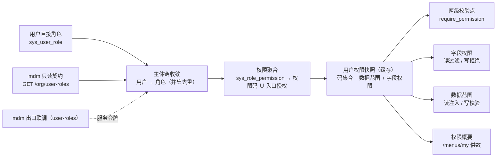

# 04 主体链权限计算引擎（含组织主数据只读出口联调）详细设计

> RBAC 基础模块 · 02 用户与角色 · 子任务 04（需求 07-4）｜**定稿（2026-10-08，共 16 项决策确认：实现口径 12 项 + 档位与演进 4 项）**

[文档首页](../../../../../../文档首页.md) › [02 用户与角色](../../02_用户与角色.md) › [04 主体链权限计算引擎](../02_用户与角色_04_主体链权限计算引擎.md) › 详细设计　|　[← 任务文档](../02_用户与角色_04_主体链权限计算引擎.md)

## 1. 背景与目标 <a id="goal"></a>

阶段六认证链已就绪但 **token 不内嵌权限**；`02_03` 已把「角色 / 授权 / 用户分配」落在 platform 服务租户库（角色域 5 表），并已落「授权变更 → 权限版本 +1」。当前基座 `permission` 插件仍是 `NullPermissionChecker`（恒放行），`MyMenuService` 逐码 `check` 恒真、字段权限恒开。本任务补齐**主体链权限计算引擎**，让权限成为菜单 / 按钮 / 字段显隐与后端强制校验的**唯一依据**：

1. **主体链收敛**：用户直接角色（`sys_user_role`）∪ 岗位 / 部门角色（mdm 按用户解析角色只读契约）→ 去重为「用户 → 角色」；
2. **权限聚合**：角色集合 → `sys_role_permission` → **权限码集合** ∪ **入口授权集合**（菜单 / 表单，经平台元数据两段解析）；
3. **快照与失效**：一次计算落「用户权限快照」（码集合 + 数据范围规则 + 字段权限收窄）缓存，版本失效保证变更即时生效；
4. **双轨校验**：入口可见性（界面维度，入口授权独立判定）+ 权限码级 `require_permission`（安全维度）真实生效（切换 provider）；
5. **字段权限与数据范围**：读时不返回 / 写时拒绝；数据范围读时注入 SQL、写时校验，强制叠加租户过滤；
6. **权限概要装载**：登录后随 `/menus/my` 一次性装载（前端链路零改动）；
7. **组织主数据只读出口联调**：跨服务取「按用户解析角色」走 mdm 只读出口。

## 2. 范围 <a id="scope"></a>



| 含 | 不含（归口） |
| --- | --- |
| 主体链收敛（直接角色 + mdm 跨服务角色并集去重，含降级） | 角色 / 授权维护 UI 与写接口（`02_03` 已交付） |
| 权限聚合（菜单 / 表单 → 业务码；动作 → `业务:动作`） | mdm 组织域实现与其契约（已交付，跨仓） |
| 用户权限快照缓存 + 版本失效 + 跨服务失效端点 | 事件订阅式失效（终态，登记遗留） |
| `permission` provider 切真实实现（含超管 / 系统管理员豁免、种子补齐） | 三权分立互斥校验（`03_02`） |
| 字段权限（序列化层读过滤 + 写拒绝） | 字段权限的**前端渲染接入**（`02_02` 表单消费） |
| 数据范围（四策略读时注入 + 写时校验 + 强制租户过滤） | 数据权限配置 UI（`02_03` 已交付） |
| 权限概要装载（复用 `/menus/my`） | 独立「权限概要」端点（不新增） |
| 组织只读出口联调（本机起 mdm 服务 + `user-roles` 走通） | 组织出口三端点（users / posts / dept-tree）的业务侧真实取数（`02_01` / 前端消费） |

## 3. 现状实测 <a id="status"></a>

> 实测时点 2026-10-08；取证落点为当前工作区源码。

| 项 | 实测结论 | 取证落点 |
| --- | --- | --- |
| 校验器契约 | `BasePermissionChecker`（`check` / `require`，失败 `30001`）、依赖提供者 `get_permission_checker(request)`、`require_permission(code)` 依赖工厂**均已就位**；缺省实现 `NullPermissionChecker.check` 恒 `True` | `libs/bms_core/src/bms_core/permission/{base,null}.py`；装配 `core/assembly.py` |
| 已挂码端点 | platform 服务 **29 处** `require_permission`（role / user / account_locks / menu / user_extensions）——切真实校验器后**立即生效**，须防自锁 | `services/platform/src/bms_platform/api/*.py` |
| 权限版本范式 | `permission_version_key(tenant_id)` → `bms:{租户}:permission:version`；`permission_user_cache_key(tenant_id, user_id, version)` → `bms:{租户}:perm:{用户}:{版本}` **已交付**；`02_03` 已在授权 / 分配变更处 `+1` | `bms_core/permission/version.py`；`services/platform/.../role_grant.py`、`role_assign.py` |
| 角色域数据 | 5 表落 platform 租户库；`sys_role_permission` 只有 `perm_type`(`menu`/`form`/`permission`) + `target_id`（平台实体雪花 id）+ `source_menu_id`（`0` = 表单级直接授予）——**权限码不在表内**（`target_id` 指向 `sys_permission.id`） | `services/platform/src/bms_platform/models/role.py` |
| 元数据与解析 | `MenuMetadataService.load_snapshot()` 返回 `MenuSnapshot`（`permission_codes` / `menus(forms(business_code, buttons(permission_code)))`）；快照缓存走 `menu_version_key()` | `services/platform/src/bms_platform/services/menu.py` |
| 现有消费口径 | `MyMenuService.build` 用 `self._checker.check(code)` 逐码判定得 `permissions`；**入口可见按入口授权集合**（`granted_menu_ids` / `granted_form_ids`）、按钮按 `button.permission_code`（`{业务码}:{动作码}` 已在 `_snapshot_form` 拼好）；字段权限按快照收窄 | `services/platform/src/bms_platform/services/my_menu.py`、`services/menu.py` |
| 平台实体表 | `SysBusiness(code)` / `SysAction(code)`（全局动词）/ `SysPermission(business_id, action_id)` / `SysForm(business_id)` / `SysButton(form_id, permission_id)` / `SysField(form_id, field_key)` | `services/platform/src/bms_platform/models/menu.py` |
| 数据范围基座 | 契约 `DataScope`（`read_predicate` / `allow_write`）+ 空实现 + 扩展注册表 + 注入点 `BaseScopedRepository._scope_conditions`（软删 → 数据范围 → 租户）**均已就位**；四策略存 `sys_data_scope.config`（`StableJson`） | `bms_core/scope/*`、`bms_core/repositories/base_scoped_repository.py` |
| 字段权限基座 | 序列化侧仅有**脱敏**钩子（`BaseSchema.masked_fields` / `_apply_masking`）；**字段权限机制未见** | `bms_core/schemas/*` |
| mdm 只读出口 | `GET /api/v1/org/user-roles?user_id=`（必填整数）→ `data.role_ids: integer[]`；出口鉴权 `require_org_reader` **双通道**：服务身份白名单 `ORG_READER_SERVICES = ("platform",)` 优先，否则回落登录态 | mdm `deploy/contracts/org.json`、`services/org/src/mdm_org/api/open_read.py` |
| 服务间客户端 | 基座 `service_client` 支持 `http` provider + `attach_service_token`（自签服务 JWT，`aud=service`） | `bms_core/services/*`、`backend/config.toml` |
| 前端消费面 | `/menus/my` → `stores/menu.ts::apply` → `setPermissionCodes` → `utils/perm.ts` / `v-perm`；`FormRenderer` 支持 `permissions` 但**应用面无引用**（仅开发态核对页） | `apps/desktop/src/stores/menu.ts`、`utils/perm.ts`、`directives/perm.ts` |
| 本机运行（本次实测） | mdm 组织域服务已本机裸跑：`uv sync` → `ops.migrate --target all --code demo` → 复用 bms 开发密钥 → `python -m mdm_org`（绑 `org` 别名 `127.0.0.3:8000`），`healthz` / `readyz` 200；出口端点可达且按双通道鉴权生效 | 见 §5.8 |

## 4. 交付物清单 <a id="deliver"></a>

| # | 交付物 | 落点 |
| --- | --- | --- |
| 1 | 主体链收敛器（直接角色 ∪ mdm 跨服务角色，含降级与上报） | `services/platform/src/bms_platform/services/permission_subject.py`（新增） |
| 2 | 权限聚合（两段解析：菜单 / 表单 → 业务码；动作 → `业务:动作`） | `services/platform/src/bms_platform/services/permission.py`（新增，`PermissionService`） |
| 3 | 用户权限快照与缓存（码集合 + 数据范围 + 字段权限，租户版本键 + TTL） | 同上 + `bms_core/permission/version.py`（复用）、快照模型落 `services/platform/.../schemas/permission.py` |
| 4 | 真实校验器实现 + 请求级快照复用 | `services/platform/src/bms_platform/permission/checker.py`（新增）+ 装配登记 |
| 5 | 超管 / 系统管理员豁免判定 | 同 4（豁免角色集合 + 快照标记） |
| 6 | 服务间失效端点（`platform` 内部通道，供 mdm 变更后调用） | `services/platform/src/bms_platform/api/permission.py`（新增）+ 路由登记 |
| 7 | 字段权限机制（基座序列化层：读不返回不可见字段 / 写拒绝不可编辑） | `bms_core/permission/field.py`（新增）+ `bms_core/schemas` 接入点 |
| 8 | 数据范围实现（四策略 → 读时 SQL 条件；写时 `allow_write` 校验） | `services/platform/src/bms_platform/scope/*`（新增）+ 装配登记 |
| 9 | 权限概要供数（`/menus/my` 的 `permissions` 由新引擎统一供出） | `services/menu.py` / `my_menu.py` / `api/menu.py`（改造） |
| 10 | 种子补齐（内置角色在册端点授权，防 403 自锁） | `ops/seed_menu.py`（扩展）或 `ops/seed_roles.py`（新增） |
| 11 | 组织出口联调与 mdm 本机运行口径 | 本目录 `实施/`、`测试/`；mdm 侧运行说明（跨仓） |
| 12 | 契约与类型（新增内部端点后重生成快照 + 前端类型） | `deploy/contracts/platform.json`、`frontend/packages/api-types` |
| 13 | 基线 / 清单回写（后端基类清单、架构 15、配置示例） | `bms文档/后端基类清单.md`、`设计/架构设计/15_*.md`、`backend/config.toml` + `.env.example` |
| 14 | 用例、实施记录、测试记录、计划与需求回写 | `services/platform/tests/permission/**`、本目录 `实施/` `测试/`、`项目/07_RBAC基础模块/**` |

## 5. 设计 <a id="design"></a>

### 5.1 主体链收敛 <a id="subject"></a>

```ts
/** 解析某用户的角色集合（并集去重）。 */
resolveRoles(userId: number): Promise<Set<number>>
```

1. **直接角色**：`sys_user_role` 按 `user_id` 取未软删 `role_id`（platform 租户库，同库查询）；
2. **岗位 / 部门角色**：经服务间客户端调 mdm `GET /api/v1/org/user-roles?user_id=`（服务令牌 `aud=service` 且服务标识为 `platform`——mdm 出口白名单只放行 `platform`），取 `data.role_ids`；
3. **并集去重**（集合类，插入序稳定）；
4. **降级**：mdm 不可达 / 超时 / 非 2xx → 记录 warning + 上报，**仅用户直接角色生效**（不阻塞）；`[permission].options.require_org_roles`（缺省 `false`）可切严格模式（失败即拒，供后续强一致场景）。

### 5.2 权限聚合 <a id="aggregate"></a>

输入角色集合 → 输出 `{permission_codes: set[str], menu_ids: set[int], form_ids: set[int]}`（权限码已含业务前缀），**两段解析**：

| 来源 | 解析路径 |
| --- | --- |
| `perm_type="menu"` | 菜单 id → 记入 `menu_ids`，并连带其快照 `forms` 的 `form.id` 记入 `form_ids`（菜单勾选**连带授予其表单查看权限**） |
| `perm_type="form"` | 表单 id → 记入 `form_ids` |
| `perm_type="permission"` | 权限码 id → 快照按钮元数据 `permission_id → permission_code` 索引 → `{业务码}:{动作码}` |

- 菜单 / 表单侧元数据取 `MenuMetadataService.load_snapshot()`（复用其缓存与 `menu_version_key()` 失效），**不另建元数据源**；
- 权限码侧以快照的按钮元数据建 `permission_id → permission_code` 索引（同源于 `sys_button` ⋈ `sys_permission`，免跨库二次查询）；
- 仓储新增批量方法 `SysRolePermissionRepository.list_by_roles(role_ids)`（按角色集合一次取，避免 N 次查询）；
- **不新增冗余列、不新增表**（决策 2）。

### 5.3 用户权限快照与缓存 <a id="snapshot"></a>

**快照结构**（一份数据供四处消费）：

| 字段 | 说明 |
| --- | --- |
| `version` | 生成时的租户权限版本（用于校验与调试） |
| `permission_codes` | 权限码集合（`业务码:动作码`，安全维度唯一校验单位） |
| `granted_menu_ids` / `granted_form_ids` | 入口授权集合（菜单 / 表单，界面维度入口可见性判定） |
| `data_scopes` | 数据范围规则列表（`dict_type` / `policy_type` / `config`，读注入与写校验用） |
| `field_perms` | 字段权限收窄项（`form_id → field_id → (visible, editable)`，读过滤与写拒绝用） |
| `tier` | 主体层级标记（超管 / 系统管理员 → 豁免） |

**缓存口径**：键＝`permission_user_cache_key(tenant_id, user_id, version)`（基座已有），值＝快照 JSON；TTL＝`[permission].options.snapshot_ttl_seconds`（缺省 300）；租户内版本变更即换键（旧键自然过期 + 主动删除）。

**版本与失效**：

1. **本地变更**（授权 / 用户-角色分配）：`02_03` 已落 `permission_version_key(tenant_id) +1` ✓；
2. **跨服务变更**（mdm 岗位 / 部门 / 角色分配）：platform 提供 **服务间失效端点** `POST /api/v1/platform/internal/permissions/invalidate`（body：`user_ids?`，缺省全租户；鉴权走服务身份白名单），mdm 在变更后调用 → 版本 `+1`；
3. **终态**：改 mdm `org.*` 事件订阅驱动（架构 15 §3 口径）——本轮登记为遗留（消费端框架未建）。

### 5.4 两级校验点接线 <a id="check"></a>

| 项 | 口径 |
| --- | --- |
| 实现 | `RbacPermissionChecker(BasePermissionChecker)`：`check(code)` → 取**当前请求**的快照（`permission_codes` 命中即通过；入口可见性另由快照入口授权集合判定） |
| 请求态 | 依赖提供者 `get_permission_checker(request)` 已带 `request` → 实现类持有请求态（用户 / 租户）；**请求级复用**：同一请求内首次加载快照后缓存到 `request.state`，供 `MyMenuService` 逐码判定复用（避免 N 次取快照） |
| 豁免 | `tier` 标记为超管 / 系统管理员的用户 `check` 恒 `True`；豁免角色集合可配（`[permission].options.exempt_roles`） |
| 切换 | `[permission].provider` 由 `null` 切为 `rbac`，实现类在装配处登记（`PLUGIN_WIRINGS` 既有 key 不变）；`config.dev.toml` / `config.toml` 同口径 |
| 防自锁 | 种子补齐：内置角色（系统 / 安全 / 审计管理员）按「在册端点权限码」预授（含 `role:*` / `user:*` / `menu:*` / `business:query` / `action:query` 等 29 处已挂码）——`ops/seed_menu.py` 扩展或新增 `ops/seed_roles.py`；平台超管走豁免不依赖种子 |
| 前端 | 零改动：`/menus/my` 的 `permissions` 由同一 checker 判定 → 自动反映真实权限 |

### 5.5 字段权限（读不返回 / 写拒绝） <a id="field"></a>

| 项 | 口径 |
| --- | --- |
| 存储 | 复用 `sys_role_field`（`role_id` / `form_id` / `field_id` / `visible` / `editable`；**只存收窄项**，默认全开） |
| 聚合 | 角色集合 → `sys_role_field` → 按 `form_id` 归并：`visible=false` 任一即不可见；`editable=false` 任一即不可编辑（收窄取并集，从严） |
| 读时 | 基座新增 `bms_core/permission/field.py`：请求态字段权限集经**序列化层**统一剔除不可见字段（与脱敏并列、互补：先字段权限剔除、再掩码），**调用方不可绕过** |
| 写时 | 服务层写入口按表单字段权限校验：含不可编辑字段即拒（`30001`）；校验在服务层，仓储不承担业务判定 |
| 前端 | 本轮不做（`FormRenderer` 的 `permissions` 消费归 `02_02`，当前应用面无表单消费点） |

### 5.6 数据范围 <a id="scope"></a>

| 策略 | 读时条件 | 说明 |
| --- | --- | --- |
| 数据选择（`select`） | 勾选字典值集合 → 对应列 `IN (...)` | 与配置字段映射经字典属性元数据解析 |
| 数据区域（`region`） | 开始值 / 结束值 → 区间条件 | — |
| 数据匹配（`match`） | 字段 + 通配符值 → `LIKE`（仅 `*` `?` 与中英文 / 数字 / 下划线，越界拒绝） | 默认代码字段 |
| 扩展权限（`extension`） | 注册的后端筛选器（每行一条 + 参数 JSON） | 扩展方自行解析；未注册即拒 |

- **并集兜底**：多策略结果 `OR` 合并；
- **读时注入**：复用基座注入点 `BaseScopedRepository._scope_conditions`（软删 → 数据范围 → 租户），实现 `DataScope` provider 即全局生效；
- **写时校验**：服务层写方法显式调 `allow_write(...)`，失败拒（`30001`）；
- **租户边界**：条件强制叠加租户过滤，任何策略不得跨租户（越界规则在配置期与运行期双向拒绝）。
- **实现口径（2026-10-08 回写，见[实施记录 §3](../实施/01_实施记录_04_主体链权限计算引擎.md)）**：
  ①「多策略结果 OR 合并」在注入点（条件列表按 **AND 合取**）下只可对**同字段同 `in`** 做真合并，
  不同字段 / 操作符**退化合取**（从严，不越权）+ 上报；
  ②「无数据范围规则」按**不过滤**（收窄语义）处置——「用户无任何角色 → 数据范围为全无」由权限码集合为空
  在菜单 / 接口层体现（快照不含角色 id，本层无法区分）；
  ③非法 / 未注册策略（区间起止倒置、通配符越界、扩展未注册）退化为**永假条件**（该条不产生放行）；
  ④**消费侧未接线**：`BaseScopedRepository._apply_data_scope` 全仓无调用方，业务仓储需显式接入。

### 5.7 权限概要装载 <a id="summary"></a>

- `GET /api/v1/menus/my` 的 `permissions` **改由新引擎供数**（同一 checker，且复用请求级快照）——前端 `stores/menu.ts → setPermissionCodes` **零改动**；
- 菜单链可见性（入口 / 按钮）与字段权限同理受益：`MyMenuService._to_form` 的 `visible/editable` 硬编码改为读快照收窄结果。

### 5.8 组织主数据只读出口联调 <a id="org"></a>

- **调用形态**：platform（服务标识 `platform`）→ mdm `http://org:8000/api/v1/org/user-roles?user_id=`，带服务令牌（`aud=service`）——mdm 白名单只放行 `platform`，与调用方一致；
- **本机起 mdm 服务口径（本次实测）**：

```text
1) cd mdm/backend && uv sync                 # 依赖（含跨仓 bms-core git 源）已在位
2) uv run python -m ops.migrate --target all --code demo
   → database/mdm/mdm_org.db（平台库，无脚本）/ mdm_org_demo.db（租户库，org 五表 + 发件箱三表）/ mdm_archive.db
3) set -a && . bms/backend/.dev-keys.local && set +a   # 复用 bms 开发密钥（用户令牌 + 服务令牌同一套）
4) BMS_SERVER__HOST=127.0.0.3 BMS_SERVER__PORT=8000 .venv/bin/python -m mdm_org
   → 绑 hosts 已有别名 org（127.0.0.3，与 bms 服务间基址模板 http://{service}:8000 同形）
5) 验证：curl http://127.0.0.3:8000/healthz → 200；/readyz → 200
```

- **降级**：mdm 不可达 → 主体链仅直接角色（见 §5.1）；
- **开放项**：mdm 启动时 `service_catalog_snapshot_unavailable`（platform `/api/v1/modules/snapshot` 401）——联调时排查（不阻塞本任务）。

## 6. 失败分支与边界 <a id="edge"></a>

| 场景 | 处置 | 错误码 / 表现 |
| --- | --- | --- |
| 用户无任何角色 | 权限码集合为空、数据范围为「全无」 | 菜单 / 按钮不显示；后端校验拒（`30001`） |
| mdm 不可达 / 超时 | 仅直接角色生效 + 上报（warning + 指标） | 不阻塞；严格模式（配置开关）下拒 |
| 权限版本读失败（Redis 不可用） | 按 MISS 处理、直算不回写缓存（降级不缓） | 请求仍正确，仅性能下降 |
| 快照反序列化失败 | 视为未命中并重算；连续失败上报 | — |
| 数据范围规则引用字典不存在 | 配置期拒绝（`02_03` 已落）；运行期兜底跳过该条并上报 | 不越权（从严） |
| 数据范围 `extension` 未注册 | 规则不生效 + 上报（`sys_data_scope` 写入期已校验） | 从严：该条不产生放行 |
| 字段权限：响应体含不可见字段 | 序列化层剔除 | 不返回、不渲染 |
| 字段权限：写入含不可编辑字段 | 服务层拒绝 | `30001` |
| 跨租户访问 | 租户过滤强制叠加 | 拒（`80001` / 空结果） |
| 超管 / 系统管理员 | 豁免全权 | 恒通过 |
| 内部失效端点被未授权服务调用 | 服务身份白名单校验 | `20001` |

## 7. 测试设计与验收映射 <a id="test"></a>

| 验收点（需求 07-4 完成标准） | 用例 |
| --- | --- |
| 主体链并集正确（直接 + 岗位 / 部门） | `tests/permission/test_subject.py`：直接角色命中、跨服务并集去重、mdm 不可达降级、严格模式拒绝 |
| 聚合正确（两段解析） | `tests/permission/test_engine.py`：菜单 / 表单计入入口集合、权限码授权取 `业务:动作`、多角色并集、无角色空集 |
| 版本失效即时生效 | `tests/permission/test_cache.py`：版本 +1 后旧键不命中、内部失效端点默认全租户 / 指定用户、TTL 兜底 |
| 越权与跨租户被拒 | `tests/permission/test_checker.py` + 端点用例：无码 `30001`、有码通过、跨租户空结果、超管豁免 |
| 字段权限读不返回 / 写拒绝 | `tests/permission/test_field.py`：不可见字段剔除（含嵌套列表）、不可编辑字段写入拒、与脱敏叠加顺序 |
| 数据范围读写双向 + 强制租户 | `tests/permission/test_scope.py`：四策略条件生成、并集兜底、写校验拒、越界规则拒绝、租户强制叠加 |
| 权限概要装载正确 | `tests/api/test_my_menu.py`（扩展）：`permissions` 与授权一致、请求级快照复用（一次加载）、切 provider 后旧用例同步 |
| 组织只读出口联通、过滤与脱敏不可绕过 | `tests/permission/test_org_export.py`（替身驱动）+ 实施记录 §3 的真 HTTP 对打证据（本机 mdm 服务） |
| 门禁 | `uv run ruff check/format`、`pyright` 0 err、定向 `pytest`、`pnpm run api-types:gen:check`、`preflight --fast` |
| Kiwi | **先登记取号**（一任务一条），再回填代码标注 |

**前端**：本轮无前端改动（概要通道复用、字段渲染归 `02_02`）→ 测试记录写「原型对照：不适用（后端改动，无界面变更）」+ 理由。

## 8. 登记落点 <a id="register"></a>

| 内容 | 落点 |
| --- | --- |
| 后端基类清单（新增校验器 / 数据范围实现 / 字段权限机制） | `bms文档/后端基类清单.md` |
| 架构 15（§3 缓存与失效、§4 校验点、§5 字段权限、§6 数据范围）实现事实回写 | `设计/架构设计/15_架构设计_子系统_权限计算引擎.md` |
| 配置项（provider、TTL、豁免角色、严格模式） | `backend/config.toml` + `config.dev.toml` + `deploy/.env.example` |
| 契约与前端类型（新增内部失效端点） | `deploy/contracts/platform.json`、`frontend/packages/api-types`（重生成） |
| 种子（内置角色预授） | `ops/seed_menu.py` / `ops/seed_roles.py` |
| 计划 / 需求 / 任务状态 | `项目/07_RBAC基础模块/{计划,需求,任务}/**`（**唯一进度落点**） |
| mdm 侧（本机运行口径 + 失效端点调用） | mdm 仓文档（跨仓，mdm 仓单独提交） |

## 9. 边界与开放项 <a id="open"></a>

| # | 事项 | 归口 |
| --- | --- | --- |
| 1 | **事件订阅式失效**（mdm `org.*` → 版本 +1，架构 15 终态）；本期以内部失效端点先行 | 事件总线接入（后续阶段） |
| 2 | 字段权限**前端渲染接入**（`FormRenderer.permissions` 消费） | `02_02` 用户管理前端 |
| 3 | 组织出口三端点（users / posts / dept-tree）业务侧真实取数 | `02_01` / 前端消费 |
| 4 | mdm 启动 `service_catalog_snapshot_unavailable`（401）排查 | 联调 / 部署阶段 |
| 5 | 权限码**来源标记**（本菜单入口连带可改 / 非本入口只读）未纳入概要与校验 | 表单框架后续（`02_02`） |
| 6 | **执行前收敛（一致性屏障）**：跨服务写侧「先保证已应用版本」场景 | 一致性屏障接入（有跨服务写需求时） |
| 7 | 平台超管跨租户运营与三权分立边界 | `03_02` / `04_01` |
| 8 | 前端权限码为**显隐体验**，真正鉴权在后端（本轮已真实生效） | 口径已定，无遗留 |

## 10. 决策记录 <a id="decision"></a>

| # | 决策项 | 结论 |
| --- | --- | --- |
| 1 | 引擎落点 | **platform 服务内**新建 `PermissionService`；基座保留契约与缓存键范式 |
| 2 | 聚合口径 | **两段解析**（菜单 / 表单 → 业务码；动作 → `业务:动作`），**不增冗余列、不新增表** |
| 3 | 版本与缓存粒度 | **租户级版本** + 用户级缓存键；本地变更 `+1`（已落），mdm 变更经失效端点 `+1` |
| 4 | 权限深度 | **数据范围与字段权限全量交付**（读注入 / 读过滤 + 写校验 / 写拒绝） |
| 5 | 前端概要通道 | **复用 `/api/v1/menus/my`**，前端零改动 |
| 6 | 字段读过滤落点 | **序列化层统一过滤**（与脱敏并列互补） |
| 7 | 数据范围写校验落点 | **服务层写入口**显式校验，仓储不承担业务判定 |
| 8 | 跨服务失效通道 | **内部失效端点先行**，事件订阅登记遗留 |
| 9 | 缓存形态 | **统一用户权限快照**（码集合 + 数据范围 + 字段权限，同 key / TTL） |
| 10 | 字段权限范围 | **后端全量**，前端渲染接入归 `02_02` |
| 11 | 校验器启用口径 | **切真实实现 + 超管 / 系统管理员豁免 + 种子补齐在册端点授权**（防 403 自锁） |
| 12 | 组织出口联调 | 本机裸跑 mdm 服务（`127.0.0.3:8000`，复用 bms 开发密钥），`user-roles` 走服务通道验证 |
| 13 | **引擎档位命名** | 配置 `[permission].profile`，取值 `smb`（中小企业）/ `enterprise`（大型企业）/ `enterprise_hr`（大型企业人事）；与 `tier`（主体层级豁免标记）分列，不可混用 |
| 14 | **扩展接缝力度** | **显式框架化**：先定义协议与骨架（角色解析器链 / 字段权限 provider / 校验链 / 数据范围策略注册表 / 快照扩展位），基础版作为其默认实现 |
| 15 | **后代能力轮廓** | 只固定受众定位与「下一代从哪个接缝接」；具体能力清单待各代启动时定（不猜方向） |
| 16 | **演进登记落点** | 本详设 §11 + 《架构设计 · 权限计算引擎》新增「引擎档位与演进」节 + 需求 07-4 档位与演进注 |

## 11. 引擎档位与演进 <a id="profile"></a>

> 2026-10-08 拍板：引擎按**档位（`profile`）**分三代演进；本次交付第一代（`smb`，中小企业基础版），后两代从本节固定接缝接入。

### 11.1 三代档位 <a id="profile-levels"></a>

| 档位 | 受众 | 定位 | 状态 |
| --- | --- | --- | --- |
| `smb` | 中小企业 | **基础版权限引擎**：主体链（直接角色 ∪ 岗位 / 部门链角色）→ 权限码集 + 数据范围（四策略）+ 字段权限（可见 / 可编辑）+ 两级校验 + 概要装载 | **本次交付**（本详设 §1 ~ §10） |
| `enterprise` | 大型企业 | **精细化权限管理引擎**：在 `smb` 之上扩展更细的授权与生效规则 | 方向已定（接入位见 §11.3） |
| `enterprise_hr` | 大型企业（人事） | **结构化权限管理引擎**：在 `enterprise` 之上扩展面向人事（组织结构 / 岗位层级 / 汇报关系）的权限管理 | 方向已定（接入位见 §11.3） |

**配置键**：`[permission].profile = "smb"`（缺省）；**非 `smb` 档在未实现前启动即 fail-closed 拒绝启动**（明确提示属后续版本），避免「配了却不生效」。

**与 `tier` 的区别（易混，务必区分）**：`tier` 是**主体层级豁免标记**（超管 / 系统管理员 → `check` 恒真，见 §5.4）；`profile` 是**引擎档位**（能力集合）。二者维度不同、不可互相替代；快照中分列 `tier` 与 `profile` 两个字段。

### 11.2 扩展接缝（显式框架化） <a id="profile-seams"></a>

基础版按「**显式框架化**」落地：协议与骨架先定义，基础版作为其默认实现——后代接入时改装配与注册，**不改核心主流程**。

| # | 接缝 | 协议（基座） | 基础版默认实现 | 注册 / 装配 |
| --- | --- | --- | --- | --- |
| 1 | **角色解析器链** | `bms_core/permission/resolver.py::BaseRoleResolver`（`resolve(user_id) -> 角色 id 集合` + `resolve_order`） | `DirectRoleResolver`（`sys_user_role`）、`OrgRoleResolver`（mdm `/org/user-roles`，含降级与严格模式） | 经基座注册表登记，按 `resolve_order` 有序执行；主流程只做并集去重 |
| 2 | **字段权限 provider** | `bms_core/permission/field.py::BaseFieldPermissionProvider`（`resolve(form_id, role_ids) -> 字段收窄集`） | `StaticFieldPermissionProvider`（`sys_role_field` 静态收窄：`visible` / `editable` 两态） | 装配登记；后代可换「条件化 / 按值域」求值器 |
| 3 | **校验链（guard）** | `bms_core/permission/guard.py::BasePermissionGuard`（`allow(ctx) -> bool` + 有序链） | **空链**（基础版只做码集命中判定与 `tier` 豁免） | 装配登记；后代可追加「业务条件 / 人事关系」校验器 |
| 4 | **数据范围求值策略** | 基座既有 `DataScope` 契约 + **策略扩展注册表** | 四策略：`select` / `region` / `match` / `extension`（§5.6） | 经既有注册表登记（`extension` 策略即该机制的首个用例） |
| 5 | **权限快照扩展位** | 快照结构（§5.3） | `profile`（档位）+ `extensions`（后代自有数据，基础版为空） | 后代新增维度一律入 `extensions`，**不改既有核心字段** |

**主流程不变式（对后代的接口承诺）**：

1. 主流程（`PermissionService`）只做「**解析器并集 → 聚合 → 快照 → 缓存 → 供数**」五步；来源与规则一律经上述接缝注入；
2. 快照核心字段（`permission_codes` / `granted_menu_ids` / `granted_form_ids` / `data_scopes` / `field_perms` / `tier` / `profile`）语义**不得变更**，新增只进 `extensions`；
3. 校验入口签名（基座 `BasePermissionChecker.check(code)`）不变，扩展一律经 guard 链；
4. 数据范围策略经注册表扩展，核心不判策略类型。

### 11.3 后代接入位清单 <a id="profile-next"></a>

| 后代档位 | 从哪些接缝接 | 说明 |
| --- | --- | --- |
| `enterprise`（精细化） | 解析器链（条件化 / 继承类解析器）、字段权限 provider（条件化求值）、校验链（业务条件 guard）、数据范围策略（组合条件 / 新策略）、快照 `extensions` | 能力清单待该代启动时确认；**不得改主流程与快照核心字段** |
| `enterprise_hr`（结构化） | 在 `enterprise` 之上再新增人事维度解析器（组织结构 / 岗位层级 / 汇报关系）与人事 guard；快照 `extensions` 承载人事矩阵 | 同上 |

**能力轮廓（方向，非实现承诺）**：`enterprise` 偏向「条件化授权 + 组织维度继承 + 更细的数据 / 字段规则」；`enterprise_hr` 偏向「按组织结构与人事关系的权限推导与矩阵」。具体清单待各代启动时定（避免现在猜错方向）。

### 11.4 登记落点 <a id="profile-register"></a>

- 本文档：本节（档位、接缝、接入位清单）；
- 《[架构设计 · 权限计算引擎](../../../../../../设计/架构设计/15_架构设计_子系统_权限计算引擎.md)》：新增「引擎档位与演进」节（产品分层事实）；
- 需求 [07-4](../../../../需求/02_需求_用户与角色.md#r07-4)：档位与演进注；
- 配置：`[permission].profile`（`backend/config.toml` / `config.dev.toml` / `deploy/.env.example`）。

## 12. 参考文档 <a id="ref"></a>

- [需求 07-4](../../../../需求/02_需求_用户与角色.md#r07-4)、[任务文档](../02_用户与角色_04_主体链权限计算引擎.md)
- 《[架构设计 · 权限计算引擎](../../../../../../设计/架构设计/15_架构设计_子系统_权限计算引擎.md)》§2 ~ §9；《[架构设计 · 认证与会话](../../../../../../设计/架构设计/14_架构设计_子系统_认证与会话.md)》
- 《[架构设计 · 数据访问与分片](../../../../../../设计/架构设计/13_架构设计_子系统_数据访问与分片.md)》《[架构设计 · 多租户路由](../../../../../../设计/架构设计/12_架构设计_子系统_多租户路由.md)》
- 兄弟任务：[`02_03` 角色管理](../../02_用户与角色_03_角色管理/02_用户与角色_03_角色管理.md)（授权数据来源）、[`02_01` 用户完整域后端](../../02_用户与角色_01_用户完整域后端/02_用户与角色_01_用户完整域后端.md)、[`02_02` 用户管理前端](../../02_用户与角色_02_用户管理前端/02_用户与角色_02_用户管理前端.md)
- 《[数据库开发规范](../../../../../../规范/数据库开发规范.md)》《[后端开发规范](../../../../../../规范/后端开发规范.md)》《[测试规范](../../../../../../规范/测试规范.md)》
- mdm 侧：组织只读出口契约（`/api/v1/org/user-roles`）与「按用户解析角色」
- [计划](../../../../计划/01_计划_RBAC基础模块.md)

> 本文档依《[文档生成规范](../../../../../../规范/文档生成规范.md)》编写 · 关键决策逐项确认
