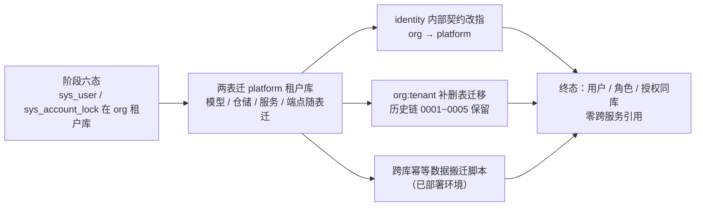
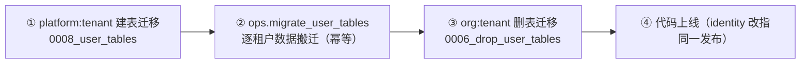

# 05 用户账号归口平台详细设计

> RBAC 基础模块 · 02 用户与角色 · 子任务 05（需求 07-10）｜**定稿（2026-10-07，共 7 项决策确认）**

[文档首页](../../../../../../文档首页.md) › [02 用户与角色](../../02_用户与角色.md) › [05 用户账号归口平台](../02_用户与角色_05_用户账号归口平台.md) › 详细设计　|　[← 任务文档](../02_用户与角色_05_用户账号归口平台.md)

## 1. 背景与目标 <a id="goal"></a>

阶段六按当时口径把 `sys_user` / `sys_account_lock` 落在 **org 服务租户库**；2026-10-07 复核确认术语边界——**组织域＝集团 / 公司 / 部门 / 岗位 / 人员**（归 mdm），**用户＝系统账号**属权限 / 身份体系（归 platform）。同一轮已把角色域 5 表落 platform 服务租户库（`02_03` 落点改定），`sys_user_role.user_id` 暂为跨服务逻辑外键。

本任务把「**用户（账号）/ 角色 / 授权**」收敛到 platform 服务同一租户库，消除全部跨服务引用：



**本任务范围**（2026-10-07 逐项确认）：

| 含 | 不含（归口） |
| --- | --- |
| `sys_user` / `sys_account_lock` 迁 platform 服务租户库（表归属 / 模型 / 迁移链） | 用户完整域 CRUD / 启停 / 删除 / 重置密码（`02_01`） |
| 用户 / 凭据 / 账号锁定的仓储与服务随表迁 platform | 前端用户管理页与账号锁定页（`02_02`） |
| 内部端点改指（`/api/v1/platform/internal/credentials/*`、`/users/*`、`/account-locks/*`） | 岗位 / 部门角色分配与组织主数据出口（mdm 组织域） |
| 账号锁定管理端点迁 platform（`/api/v1/account-locks`） | 权限计算与权限缓存读写（`02_04`） |
| identity 客户端与契约映射改指平台（命名同步 `Platform*`） | 用户偏好 / 扩展信息表结构（仅引用方向措辞回写） |
| 跨库数据搬迁脚本；`seed_user` 等运维脚本核查同步 | 三库真库迁移演练（随部署窗口） |

## 2. 现状实测 <a id="status"></a>

| 项 | 实测结论 | 取证落点 |
| --- | --- | --- |
| 两表归属 | `sys_user` / `sys_account_lock` owner 均为 `org`、库类别 `tenant` | `libs/bms_core/src/bms_core/services/table_registry.py` |
| org 侧代码 | 模型 `bms_org/models/{user,account_lock}.py`；仓储 `repositories/{user,account_lock}.py`；服务 `services/{users,credentials,account_lock}.py`；端点 `api/{internal,internal_users,internal_account_locks,account_locks}.py` | `services/org/src/bms_org/` |
| org 侧模型声明 | `MODEL_MODULES = ("bms_org.models.user", "bms_org.models.account_lock")` | `bms_org/models/__init__.py` |
| `org:tenant` 链 | `0001_sys_user` → `0002_password_policy_and_account_lock` → `0003_sys_user_reset_contact` → `0004_sys_account_lock_expire` → `0005_sys_outbox`（head） | `alembic/versions/org/tenant/` |
| platform 侧租户链 | head = `0007_role_tables`（角色域 5 表）；platform 已具备 `require_service("identity", "org")` 内部端点范式 | `alembic/versions/platform/tenant/`、`bms_platform/api/internal_config.py` |
| identity 客户端 | `OrgCredentialClient`（`services/org_client.py`），目标服务常量 `ORG_SERVICE = "org"`；请求路径 `/api/v1/org/internal/credentials/*` 与 `/api/v1/org/internal/users/*` | `services/identity/src/bms_identity/services/org_client.py` |
| identity 契约 schema | `OrgVerifyResult` / `OrgUpdatePasswordResult` / `OrgLoginState` / `OrgUserSummary` / `OrgProfileUser` / `OrgProfileResult` / `OrgUserCreateResult` / `OrgResetTargetResult` | `bms_identity/schemas/{auth,sso,password_reset}.py` |
| 运维脚本 | `ops/seed_user.py`（`DEFAULT_SERVICE = "org"`，直连 org 租户库建 / 重置账号）；`ops/init_tenant.py` / `provision_tenant.py` / `migrate_tenants.py` 按服务维度通用 | `backend/ops/` |
| 表集门禁 | `ops/check_tables.py::_check_script_tables` 断言 `建表 ∪ (批量改表 − 删表) ⊆ 链表集`——历史建表脚本在新归属下会误报 | `backend/ops/check_tables.py` |
| 契约与类型 | org 契约含用户 / 锁定端点（`deploy/contracts/org.json`）；前端 `api-types` 有 `org.ts` / `platform.ts`（由快照生成） | `deploy/contracts/`、`frontend/packages/api-types/src/` |

## 3. 交付物清单 <a id="deliver"></a>

### 3.1 后端迁移与归属（`bms/backend/`） <a id="deliver-db"></a>

```text
alembic/versions/
├── platform/tenant/0008_user_tables.py            # 新建：platform 侧建 sys_user + sys_account_lock
└── org/tenant/0006_drop_user_tables.py            # 新建：org 侧删两表（down 复原）
libs/bms_core/src/bms_core/services/table_registry.py   # sys_user / sys_account_lock 归属 org → platform
```

### 3.2 后端代码搬迁 <a id="deliver-backend"></a>

| 动作 | 落点 | 内容 |
| --- | --- | --- |
| 新建 | `services/platform/src/bms_platform/models/user.py` | `SysUser` / `SysAccountLock` + 锁定类型与解锁方式常量 |
| 改动 | `services/platform/src/bms_platform/models/__init__.py` | `MODEL_MODULES` 追加 `bms_platform.models.user` |
| 删除 | `services/org/src/bms_org/models/{user,account_lock}.py` | 随表迁出 |
| 改动 | `services/org/src/bms_org/models/__init__.py` | `MODEL_MODULES` 收敛为空元组（org 无自有模型） |
| 新建 | `services/platform/src/bms_platform/repositories/{user,account_lock}.py` | 用户仓储（含最小只读筛选）/ 账号锁定仓储 |
| 删除 | `services/org/src/bms_org/repositories/{user,account_lock}.py` | 随表迁出 |
| 新建 | `services/platform/src/bms_platform/services/{users,credentials,account_lock}.py` | 概要 / 重置目标 / 统一建号；凭据校验与改密；锁定治理与不活跃扫描 |
| 删除 | `services/org/src/bms_org/services/{users,credentials,account_lock}.py` | 随表迁出 |
| 新建 | `services/platform/src/bms_platform/schemas/{users,credentials,account_lock}.py` | 请求 / 响应契约（随服务迁，内容不变） |
| 删除 | `services/org/src/bms_org/schemas/{users,credentials,account_lock}.py` | 随服务迁出 |
| 新建 | `services/platform/src/bms_platform/api/{internal_credentials,internal_users,internal_account_locks,account_locks}.py` | 内部端点三组 + 锁定管理面 |
| 删除 | `services/org/src/bms_org/api/{internal,internal_users,internal_account_locks,account_locks}.py` | 随端点迁出 |
| 改动 | `services/platform/src/bms_platform/api/router.py` | 登记 4 个新 router |
| 改动 | `services/org/src/bms_org/api/router.py` | 仅保留组织主数据占位路由 |
| 改动 | `services/identity/src/bms_identity/services/platform_client.py`（`org_client.py` 改名） | `PlatformCredentialClient`；目标服务 `platform`；四组路径改指 |
| 改动 | `services/identity/src/bms_identity/schemas/{auth,sso,password_reset}.py` | `Org*` → `Platform*` |
| 改动 | identity api / services 全部引用方 | `org_client` → `platform_client`、参数与属性改名 |
| 改动 | `services/identity/tests/**` | 客户端用例改名 / 改指；替身端点路径同步 |
| 搬移 | `services/org/tests/{credentials,users,account_lock}/` → `services/platform/tests/` | 导入改 `bms_platform`；用例编号保留 |

### 3.3 运维脚本 <a id="deliver-ops"></a>

| 动作 | 落点 | 内容 |
| --- | --- | --- |
| 改动 | `ops/seed_user.py` | 归属服务改 `platform`、模型导入改 `bms_platform.models.user`、帮助文案同步 |
| 新建 | `ops/migrate_user_tables.py` | 跨库幂等数据搬迁（按租户逐库，按主键 upsert；`--code` / `--all-tenants` / `--dry-run`） |
| 核查 | `ops/init_tenant.py` / `provision_tenant.py` / `migrate_tenants.py` | 按服务维度通用，**无需改动**（结论入实施记录） |
| 改动 | `ops/check_tables.py` | 脚本表集断言改「净新建」口径（见 §7） |

### 3.4 契约与前端类型 <a id="deliver-contract"></a>

| 动作 | 落点 | 内容 |
| --- | --- | --- |
| 重生成 | `deploy/contracts/{org,platform}.json` | 按新路由面重生成（org 移除、platform 新增） |
| 更新 | `deploy/contracts/baseline/{org,platform}.json` | org 移除端点属预期破坏性变更，同步更新基线 |
| 重生成 | `frontend/packages/api-types/src/{org,platform}.ts` | `pnpm --filter @bms/api-types gen` |

### 3.5 文档 <a id="deliver-docs"></a>

| 动作 | 落点 |
| --- | --- |
| 改动 | `设计/数据库设计/数据表设计/{sys_user,sys_account_lock}.md`（归属库 / ORM 模型 / 迁移 / 状态 / 变更记录） |
| 改动 | `设计/数据库设计/数据表设计/{sys_user_role,sys_user_extension,sys_user_preference}.md`（引用方向措辞：跨服务 → 同库） |
| 改动 | `设计/数据库设计/01_数据库设计_总览.md`（登记两行所属库） |
| 改动 | `设计/数据库设计/07_数据库设计_角色管理.md`（§3 / §4 跨库说明 → 同库） |
| 改动 | 《后端基类清单》如涉表归属 / 契约条目则同步 |

## 4. 数据设计要点 <a id="data"></a>

### 4.1 两表迁库 <a id="data-move"></a>

- **归属库**：`sys_user` / `sys_account_lock` 由 org 服务租户库 `bms_org_{code}` 迁 **platform 服务租户库** `bms_platform_{code}`（与角色 / 授权、字典 / 系统参数、用户扩展同库）。
- **字段不变**：两表结构与各表文件逐列一致（`sys_user` 含 `pwd_reset_required` / `email` / `phone`；`sys_account_lock` 含 `expire_at` / `unlock_mode`），本次**不增删字段**。
- **平台侧建表迁移** `platform/tenant/0008_user_tables.py`：按各表文件的最终结构建两表 + 唯一约束 + 业务索引 + 软删除索引；`down_revision = 0007_role_tables`。
- **org 侧删表迁移** `org/tenant/0006_drop_user_tables.py`：删 `sys_account_lock` → 删 `sys_user`（逆序）；`down_revision = 0005_sys_outbox`；`downgrade()` 按最终结构复原两表（保证链可回滚）。

### 4.2 迁移链口径 <a id="data-chain"></a>

| 链 | 变更 | 说明 |
| --- | --- | --- |
| `org:tenant` | `0001~0005` **原样保留**；新增 `0006_drop_user_tables` | 已部署库链不破；历史建表 + 本次删表**净零**（表集门禁口径见 §7） |
| `platform:tenant` | 新增 `0008_user_tables`（新 head） | 建两表；与角色域 5 表同库 |

- 链表集由归属登记派生：org:tenant 收敛为「基础设施三表」，platform:tenant 增 `sys_user` / `sys_account_lock`。相关断言（`test_alembic_chains.py` / `test_table_registry.py` / `test_migration_ops.py`）同步更新。

### 4.3 跨库引用收敛 <a id="data-refs"></a>

| 引用 | 迁移前 | 迁移后 |
| --- | --- | --- |
| `sys_user_role.user_id` → `sys_user.id` | 跨服务（platform 租户库 → org 租户库） | **同库**（platform 租户库内逻辑外键，可 join） |
| `sys_account_lock.user_id` → `sys_user.id` | 同库（org 租户库） | **同库**（platform 租户库） |
| `sys_user_extension.user_id` / `sys_user_preference.user_id` → `sys_user.id` | 同库（platform 租户库） | 不变（措辞由「逻辑外键」保持，注明同库） |
| `sys_session.user_id` / `sys_user_identity.user_id` → `sys_user.id` | 跨服务（identity → org） | **跨服务**（identity → platform）；identity 侧仍只持值、不直连 |

- 一律**逻辑外键**（不建物理外键）。
- `sys_user_role` 表结构不变，仅引用语义降为同库；`02_03` 剩余的「用户分配 / 最小用户查询」由此可在**同库**完成。

## 5. 接口设计 <a id="api"></a>

### 5.1 内部端点（服务间，不经网关） <a id="api-internal"></a>

| 方法 | 路径 | 鉴权 | 说明 |
| --- | --- | --- | --- |
| POST | `/api/v1/platform/internal/credentials/verify` | `require_service("identity")` | 账号口令校验（含重哈希回写、超期置强制改密） |
| POST | `/api/v1/platform/internal/credentials/update-password` | 同上 | 改密（复杂度 / 历史闸门 + 写历史 + 清强制改密） |
| POST | `/api/v1/platform/internal/credentials/login-state` | 同上 | 登录态写回（成功清零 / 失败累计与 `fail_limit` 锁） |
| POST | `/api/v1/platform/internal/users/profile` | 同上 | 按主键取用户概要（`found=false` 语义不变） |
| POST | `/api/v1/platform/internal/users/reset-target` | 同上 | 找回密码投递目标解析 |
| POST | `/api/v1/platform/internal/users/create` | 同上 | 统一建号（SSO JIT；撞名 `created=false`） |
| POST | `/api/v1/platform/internal/account-locks/scan-inactive` | `require_service("identity", "platform")` | 长期未登录账号扫描锁定（运维触发） |

- 租户仍由服务 JWT `tenant` claim 经全局租户中间件解析；载荷 / 响应结构与迁移前**逐字段一致**（仅路径与服务变更）。
- 计入 platform 公开契约；org 契约同步移除旧路径。

### 5.2 账号锁定管理面 <a id="api-locks"></a>

| 方法 | 路径 | 权限码 | 说明 |
| --- | --- | --- | --- |
| GET | `/api/v1/account-locks` | `user:query` | 锁定记录列表（筛选 + 分页） |
| GET | `/api/v1/account-locks/{lock_id}` | `user:query` | 锁定记录详情 |
| POST | `/api/v1/account-locks` | `user:lock` | 手动锁定（`manual` 型；幂等） |
| PUT | `/api/v1/account-locks/{lock_id}/unlock` | `user:unlock` | 手动解锁（回填解锁信息 + 留痕） |

- 载荷与留痕口径不变；`AuditCapturer` 占位继续挂接。路径由 `/api/v1/org/locks` 改为 `/api/v1/account-locks`（与 `/api/v1/roles`、`/api/v1/users` 同级，不预占 `02_01` 用户域的子资源形态）。

### 5.3 identity 契约改指 <a id="api-identity"></a>

- 目标服务常量 `ORG_SERVICE = "org"` → `PLATFORM_SERVICE = "platform"`；请求路径四组同步改指。
- 类与 schema 命名由 `Org*` 改为 `Platform*`（`PlatformCredentialClient` / `PlatformVerifyResult` / `PlatformUpdatePasswordResult` / `PlatformLoginState` / `PlatformUserSummary` / `PlatformProfileUser` / `PlatformProfileResult` / `PlatformUserCreateResult` / `PlatformResetTargetResult`）。
- 服务 JWT 出站仍以 `sub=identity` 签发；platform 侧 `require_service("identity")` 放行（与既有 `internal_config` 同口径）。
- 失败语义不变：下游不可达 / 非 2xx / 响应契约非法 → `ServiceUnavailableError`（fail-closed，不降级为「密码错误」）。

## 6. 迁移与数据搬迁 <a id="migration"></a>

### 6.1 已部署环境执行顺序（强制） <a id="migration-order"></a>



- **顺序颠倒即有数据丢失风险**：先跑 org 删表迁移会连数据一起删。故顺序写入本设计、两处迁移脚本头注释与实施记录；`ops/` 批量迁移默认按链推进，运维需按上述顺序分批执行。
- **本地开发库**：直接删库重建（不走搬迁脚本）。
- identity 内部契约改指与 platform 端点上线须**同一次发布**，否则登录链路两端不一致。

### 6.2 跨库搬迁脚本 <a id="migration-script"></a>

- 落点 `ops/migrate_user_tables.py`；口径同 `ops/migrate_tenants.py`（服务目录 / 租户注册库 / 库名基对照表为单一来源）。
- **参数**：`--code`（可重复）、`--all-tenants`（读租户注册库未软删全集）、`--dry-run`（只打印清单不建连）、`--url` + `--target-url`（单库演练：源 / 目标连接串须成对给出）。
- **行为**：逐租户解析 org 租户库与 platform 租户库连接串 → 按主键 `id` 逐行搬迁 `sys_user` 与 `sys_account_lock` → **幂等 upsert**（已存在同 `id` 行则更新，缺失则插入）→ 输出 新增 / 更新 / 跳过 计数。
- **容错**：单租户失败记 ERROR 并继续下一租户，末尾汇总；存在失败退出码 1（可幂等重跑）。
- **不写结构**：只搬数据，建表由 ① 的 Alembic 迁移负责。

### 6.3 回滚口径 <a id="migration-rollback"></a>

| 阶段 | 回滚 |
| --- | --- |
| ① 后、② 前 | `platform:tenant` 降级到 `0007_role_tables`（删两表）；数据仍在 org 库 |
| ② 后、③ 前 | 同上 + 直接丢弃 platform 侧副本（org 库为事实源，未删） |
| ③ 后 | 先 `org:tenant` 升回 `0006_drop_user_tables` 的 down（复原两表）→ 反向搬迁（platform → org）需按需人工执行；故建议 ③ 与代码上线同窗口、确认无异常后再执行 |

## 7. 机器门禁调整：脚本表集断言改「净新建」 <a id="guard"></a>

- **现状**：`ops/check_tables.py::_check_script_tables` 断言每条**有脚本**的链中，脚本建表 / 批量改表名集合 ⊆ 该链派生表集，口径为 `建表 ∪ (批量改表 − 删表)`。
- **问题**：org 链 `0001~0005` 仍建 `sys_user` / `sys_account_lock`，而两表归属已改 platform——旧口径会把历史建表脚本判为越界。
- **改定**：断言口径改为 **「净新建」**——`(建表 ∪ 批量改表) − 删表 ⊆ 该链派生表集`。历史建表 + 本次补删表**净零**，自然放行；其他链（无删表）行为不变。
- **自证**：既有用例 `test_check_offline_rejects_script_table_outside_chain` 仍应拦截（无配对删表）；新增一条「建表 + 删表配对 → 放行」用例覆盖新口径。
- **不引入第二事实源**：不为 org 链维护「历史表集豁免清单」（避免与归属登记漂移）。

## 8. 契约与类型 <a id="contract"></a>

- **platform 契约版本不升**：本次仅新增端点（非破坏性）；`0.2.0` 保留给 `02_03` 的 `sys_form` 破坏性变更（该任务 N8 决策）。
- **org 契约**：移除用户 / 锁定端点属**预期破坏性变更**，按 §6.1 顺序不涉及数据，纯接口搬家；同步 `ops.contract_gate baseline-update --service org` 与 `--service platform`，随本次提交入库并在实施记录登记理由。
- **前端 `api-types`**：重生成 `org.ts` / `platform.ts`；前端尚无引用用户 / 锁定接口的页面代码（角色页尚未开工），故仅类型文件变更。

## 9. 测试设计 <a id="test"></a>

| 层 | 用例范围 | 落点 |
| --- | --- | --- |
| 迁移链 | `org:tenant` head = `0006_drop_user_tables`、`platform:tenant` head = `0008_user_tables`；两链表集断言（org 收敛为基础设施三表、platform 增两表） | `libs/bms_core/tests/alembic/test_alembic_chains.py`、`tests/services/test_table_registry.py`、`tests/ops/test_migration_ops.py` |
| 表集门禁 | 净新建口径：建表 + 配对删表放行；无配对删表的越界建表仍拦截 | `libs/bms_core/tests/ops/test_check_tables.py` |
| 搬迁脚本 | 幂等（首跑新增、重跑更新 0 / 跳过）、`--dry-run` 不建连、单租户失败不中断并汇总、按主键 upsert 保数据一致 | `libs/bms_core/tests/ops/`（新建 `test_migrate_user_tables.py`） |
| 平台侧用户 / 锁定 | 迁移后的概要 / 重置目标 / 建号 / 凭据 / 锁定列表 / 手动锁定 / 解锁 / 不活跃扫描用例（导入改 `bms_platform`、用例编号保留） | `services/platform/tests/{users,credentials,account_lock}/` |
| platform 端点 | 内部端点鉴权（`require_service`）/ 锁定管理端点权限码与留痕占位 | `services/platform/tests/api/`（随搬移用例覆盖） |
| identity 改指 | 客户端目标服务 / 路径 / 响应解析与失败语义；JIT 建号与登录链路 | `services/identity/tests/`（`test_org_client.py` → `test_platform_client.py`） |
| org 收敛 | org 侧不再暴露用户 / 锁定端点；组织主数据占位路由不受影响 | `services/org/tests/org/` |
| Kiwi | 一条策展用例（用户账号归口平台：两表迁库 + identity 契约改指 + 链头与表集断言 + 搬迁幂等），**先登记取得编号**后再编码并标注 | 分类「平台骨架」/ P2 / CONFIRMED / 标签「自动化」 |

## 10. 登记落点 <a id="register"></a>

| 落点 | 内容 |
| --- | --- |
| 数据库设计 | 表文件 `sys_user` / `sys_account_lock`（归属库 / ORM / 迁移 / 状态 / 变更记录）；`sys_user_role` 等引用措辞；总览登记两行；角色节点 §3 / §4 |
| 《后端基类清单》 | 表归属登记变更条目（如需）；无新增基类 |
| 规范 | 无需改动（表归属与迁移口径既有规范已覆盖） |
| 计划 | `计划/01_计划_RBAC基础模块.md`：`02_05` 行、`02_03` 状态与遗留、计数与统计行、后续窗口顺延（唯一进度落点） |
| 需求 | `需求/00_需求_RBAC基础模块.md`（计数 / 总清单 / 域地图）、`需求/02_需求_用户与角色.md`（新增 `07-10`） |
| 任务 | 父任务 `02_用户与角色.md`（子任务清单 / 执行序 / 风险）；本任务文档 + 实施记录 + 测试记录 |
| 其他 | 契约 `{org,platform}.json` 与 `baseline/`；`api-types`；`ops/` 脚本 |

## 11. 实施步骤 <a id="steps"></a>


## 12. 边界与开放项 <a id="open"></a>

- `sys_user` 迁 platform 后，`sys_session.user_id` / `sys_user_identity.user_id` 仍为跨服务逻辑外键（identity → platform）；identity 侧不直连 platform 表。
- 已部署环境的三库真库迁移演练（MySQL / PostgreSQL / 达梦）随部署窗口执行。
- `02_03` 剩余的「用户分配 / 最小用户查询」改在**同库**完成（原设计 §5.3 的「org 侧最小用户查询」改为 platform 侧），随 `02_03` 详设回写。
- 用户偏好 / 扩展信息等表对 `sys_user.id` 的引用方向措辞随本次回写，表结构不变。

## 13. 决策确认 <a id="decide"></a>

**第一轮（2026-10-07 确认，范围与落点）**

| # | 待决项 | 结论 |
| --- | --- | --- |
| 1 | org 侧用户 / 锁定代码迁走范围 | **全部迁 platform**（模型 / 仓储 / 服务 / 内部端点 / 锁定管理端点随表走）；org 仅留组织主数据占位路由——终态零跨服务引用 |
| 2 | 锁定管理端点路径 | **`/api/v1/account-locks`**（与 `/api/v1/roles`、`/api/v1/users` 同级） |
| 3 | identity 客户端与 schema 命名 | **重命名为 `Platform*`**（终态命名与事实一致；契约快照与用例同步） |
| 4 | 跨库搬迁脚本 | **新增 `ops/migrate_user_tables.py`**（结构迁移与数据搬迁分离，各自可独立重跑） |

**第二轮（2026-10-07 确认，契约与门禁）**

| # | 待决项 | 结论 |
| --- | --- | --- |
| 5 | platform 契约版本 | **不升**（本次为接口搬家；`0.2.0` 留给 `02_03` 的 `sys_form` 破坏性变更） |
| 6 | 脚本表集门禁 | **改「净新建」口径**（`(建表 ∪ 批量改表) − 删表 ⊆ 链表集`），不引入历史豁免清单 |
| 7 | 迁移顺序与契约基线 | 固定「**platform 建表 → 数据搬迁 → org 删表**」；org 移除端点为预期破坏性变更，**同步更新基线**（org + platform） |

## 14. 对齐记录 <a id="align"></a>

| # | 事项 | 处置 |
| --- | --- | --- |
| 1 | 阶段六 `sys_user` 文档口径「组织主数据服务」 | 术语边界澄清后归口 platform；表文件「归属库 / ORM 模型 / 迁移」三处同步 |
| 2 | `sys_role` / `sys_user_role` 表文件写 `user_id` 为「跨服务逻辑外键（org 租户库）」 | 改为**同库**引用（platform 租户库）；角色节点 §3 / §4 同步 |
| 3 | `02_03` 详设 §5.3「最小用户只读查询落 org 服务」 | 改为落 **platform**（用户表同库），随 `02_03` 详设回写 |
| 4 | 计划 §7 台账第 16 项「另立专项任务」 | 已立项：需求 `07-10` / 任务 `02_05`；`02_03` 状态改「部分完成」并登记已交付 / 剩余 |
| 5 | `ops/check_tables.py` 脚本表集断言与「表迁出、历史脚本保留」冲突 | 改「净新建」口径；新增配对放行用例 |

> 本文档依《[文档生成规范](../../../../../../规范/文档生成规范.md)》编写 · 详细设计定稿后提交并续行实施
