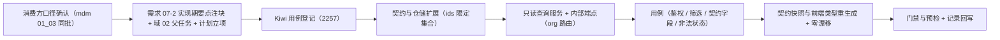

# 06 平台用户只读出口内部契约实施记录

> RBAC 基础模块 · 02 用户与角色 · 子任务 06（需求 07-2）· 实施记录

[文档首页](../../../../../../文档首页.md) › [02 用户与角色](../../02_用户与角色.md) › 实施　|　[详细设计](../设计/01_详细设计_06_平台用户只读出口内部契约.md) · [测试记录](../测试/01_测试_06_平台用户只读出口内部契约.md)

## 1. 实施信息 <a id="meta"></a>

| 项 | 值 |
| --- | --- |
| 任务 | [06 平台用户只读出口内部契约](../02_用户与角色_06_平台用户只读出口内部契约.md) |
| 对应需求 | [07-2 用户完整域](../../../../需求/02_需求_用户与角色.md#r07-2) |
| 详细设计 | [01_详细设计_06_平台用户只读出口内部契约](../设计/01_详细设计_06_平台用户只读出口内部契约.md) |
| 实施日期 | 2026-10-07 |
| 实施人 | minjian |
| 实施环境 | 开发机（Ubuntu，Python 3.14 / uv）；SQLite 内存库（用例级） |
| 前置 | 02_05 用户账号归口平台（已交付：`sys_user` 在 platform 服务租户库，内部端点前缀 `/api/v1/platform/internal/*`） |
| Kiwi 用例 | 2257（分类「平台骨架」/ P2 / CONFIRMED / 标签「自动化」，**先登记后编码**） |
| 结论 | 完成 |

## 2. 实施概览 <a id="overview"></a>



## 3. 实施过程 <a id="process"></a>

1. **上下文与口径**：读 bms《AI开发规范》、阶段七需求 07-2 / 计划 / 域 02 父任务、`internal_users` 既有端点与 `UserRepository` / `UserQueryService`、平台 `sys_user` 模型与表文件；与 mdm 阶段一任务 `01_03`（消费方）同步契约口径。
2. **立项**：需求 07-2 补实现期要点注块；域 02 父任务改「6 个子任务」并在执行序与子任务清单登记 `02_06`；阶段七计划新增本任务行并同步项数与统计行；落任务文档与详细设计。
3. **Kiwi 先登记后编码**：登记输入 `test/scripts/kiwi/cases/2026-10-07_阶段七02-06_平台用户只读出口内部契约.json`（经 `register_cases.py` 走 Kiwi 容器 Django shell），平台回读编号 **2257**；用例代码以 `@pytest.mark.kiwi_id(2257)` 标注。
4. **契约**：`schemas/users.py` 增 `InternalUserQueryRequest`（`keyword` / `status` / `ids` 限定集合 / `page` / `size`）与 `InternalUserItem`（`id` / `username` / `name` / `status` / `phone` / `email` / `dept_id`）；集合字段经内联 `Annotated[ConcurrentStableList, CONTRACT_COLLECTION]` 声明（防契约 `$defs` 漂移）。
5. **仓储**：`UserRepository.list_filtered` / `count_filtered` / `_filter_conditions` 增 `ids` 限定集合（`id IN (...)`；空 / None 不限定），与既有 `keyword` / `status` 同口径复用。
6. **服务**：`InternalUserQueryService`（只读：不写库、不开写事务、不产事件）；`dept_id` 字段未落地恒 `None`；联系方式原样返回（脱敏归消费方）。
7. **端点**：`internal_users.py` 增**第二条路由** `query_router`（`key=platform_internal_users_query`，前缀同 `/platform/internal/users`，`require_service("org")`）——与既有 `router`（`require_service("identity")`）**按调用方白名单分道**，避免同路由级依赖相互放宽；`api/router.py` 登记 `query_router`；非法 `status` 抛 `ParamError`（10001）。
8. **用例**：`services/platform/tests/users/test_internal_query.py`（服务层筛选 / 分页 / 限定集合、端点鉴权白名单、契约字段与非法状态）。
9. **契约产物**：`ops.contract_snapshot export` 重生成（仅 `deploy/contracts/platform.json` 变更）+ 前端 `@bms/api-types` 重生成（`frontend/packages/api-types/src/platform.ts`）；**契约基线未更新**（加性变更）。

## 4. 实施结果 <a id="result"></a>

| # | 交付物 | 落点 | 说明 |
| --- | --- | --- | --- |
| 1 | 请求 / 响应契约 | `services/platform/src/bms_platform/schemas/users.py` | `InternalUserQueryRequest` / `InternalUserItem`（集合字段内联契约标注） |
| 2 | 仓储筛选扩展 | `services/platform/src/bms_platform/repositories/user.py` | `ids` 限定集合（与 `keyword` / `status` 同口径） |
| 3 | 只读查询服务 | `services/platform/src/bms_platform/services/users.py` | `InternalUserQueryService`（只读、无副作用） |
| 4 | 内部端点 | `services/platform/src/bms_platform/api/internal_users.py`、`api/router.py` | `POST /api/v1/platform/internal/users/query`（`require_service("org")` 独立路由） |
| 5 | 用例 | `services/platform/tests/users/test_internal_query.py` | Kiwi 2257 标注；服务层 + 端点层 |
| 6 | 契约与类型 | `deploy/contracts/platform.json`、`frontend/packages/api-types/src/platform.ts` | 重生成、零漂移；基线不动 |

## 5. 验证 <a id="verify"></a>

```bash
$ cd bms/backend
$ uv run ruff check .                                  # All checks passed!
$ uv run ruff format --check .                         # 1035 files already formatted
$ uv run pyright                                       # 0 errors, 0 warnings, 0 informations
$ uv run pytest services/platform/tests/users -q       # 14 passed
$ uv run python -m ops.contract_snapshot export        # 仅 platform.json 变更
$ uv run python -m ops.contract_snapshot check         # 通过：8 个启用服务快照与公开契约一致
$ uv run python -m ops.check_contracts                 # 通过（实现路由 ⊆ 公开契约 + 无空 schema）
$ uv run python -m ops.event_contracts check           # 通过（契约 23 条 / 快照零漂移）
$ python3 scripts/tools/preflight/check-preflight.py --fast   # 全部通过
```

**契约破坏性判定（本机 oasdiff 缺 docker，改用结构化比对）**：基线 ↔ 当前快照比对为**纯加性**——新增端点 `POST /api/v1/platform/internal/users/query`，**无删除端点、无既有端点变更、无既有 schema 变更**（新增长度仅限本端点相关 schema）；`ops.contract_gate check` 的 oasdiff breaking 判定在 CI（mjbk 预拉 `tufin/oasdiff:v1.32.1`）内复验。

## 6. 登记回写 <a id="register"></a>

| 内容 | 落点 | 状态 |
| --- | --- | --- |
| 需求 07-2 实现期要点注块（新增子任务 / 契约字段 / 白名单 / `dept_id` 可空） | 需求《02_需求_用户与角色》§2 | 已回写 |
| 域 02 父任务（6 个子任务 / 执行序 / 子任务清单） | 《02_用户与角色》父任务 | 已回写 |
| 阶段七计划（项数与统计行、已完成表新增行、剩余表移除行、进度图去节点、计划口径补记） | 《01_计划_RBAC基础模块》 | 已回写 |
| 公开契约快照与前端类型 | `deploy/contracts/platform.json`、`frontend/packages/api-types/` | 已重生成（零漂移） |
| Kiwi TCMS | 用例编号 2257（输入文件落 `test/scripts/kiwi/cases/`） | 已登记并回读编号 |

## 7. 遗留与开放项 <a id="open"></a>

| # | 事项 | 归口 |
| --- | --- | --- |
| 1 | `sys_user.dept_id` 落地（响应 `dept_id` 生效 + 入参补部门筛选） | 需求 07-2 / 任务 `02_01` 用户完整域后端 |
| 2 | 用户完整域 CRUD / 启停 / 删除 / 重置密码 | 任务 `02_01` |
| 3 | 数据范围过滤与敏感字段脱敏真实策略 | 消费方 mdm 组织出口（实现侧强制接入）+ 后续 RBAC / 脱敏阶段 |
| 4 | 服务身份白名单扩展（其余平台 / 产品服务经服务身份读取） | 按消费方接入追加 |
| 5 | 真实租户库（MySQL / PostgreSQL / 达梦）实建与网关联调；CI 内 oasdiff 复验 | 部署联调任务 / CI |

> 本文档依《[文档生成规范](../../../../../../规范/文档生成规范.md)》与《[AI开发规范](../../../../../../规范/AI开发规范.md)》编写
