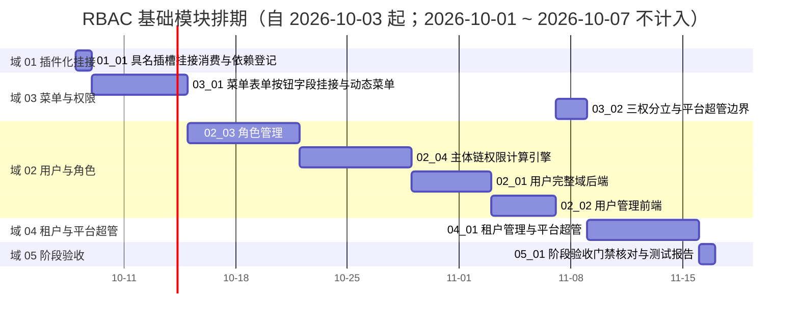

# RBAC 基础模块计划

> BMS 基础管理系统 · 阶段七（RBAC 基础模块）排期计划：**已完成 0 项，剩余 9 项**（域 01 插件化挂接 1 项 / 4h、域 02 用户与角色 4 项 / 184h、域 03 菜单与权限 2 项 / 64h、域 04 租户与平台超管 1 项 / 56h、域 05 阶段验收 1 项 / 8h，合计 9 项 / **316h**）；**已完成 0h；剩余 316h；阶段合计 316h**

[文档首页](../../../文档首页.md) › RBAC 基础模块计划　|　[任务基线 →](../任务/02_用户与角色/02_用户与角色.md)　[需求基线 →](../需求/00_需求_RBAC基础模块.md)

## 1. 计划说明 

- **排期对象**：阶段七 8 条需求、9 个子任务（域 01 插件化挂接 1 / 域 02 用户与角色 4 / 域 03 菜单与权限 2 / 域 04 租户与平台超管 1 / 域 05 阶段验收 1），任务基线见[域 01](../任务/01_插件化挂接/01_插件化挂接.md)、[域 02](../任务/02_用户与角色/02_用户与角色.md)、[域 03](../任务/03_菜单与权限/03_菜单与权限.md)、[域 04](../任务/04_租户与平台超管/04_租户与平台超管.md)、[域 05](../任务/05_阶段验收/05_阶段验收.md)。
- **执行序（承前启后）**：`01_01 具名插槽挂接消费与依赖登记` → `03_01 菜单/表单/按钮/字段挂接与动态菜单` → `02_03 角色管理` → `02_04 主体链权限计算引擎` → `02_01 用户完整域后端` → `02_02 用户管理前端` → `03_02 三权分立与平台超管边界` → `04_01 租户管理与平台超管` → `05_01 阶段验收门禁核对与测试报告`（收口）。
- **承接口径**：阶段六已交付 `sys_user` 最小模型、认证链与会话踢出通道、账号锁定记录读写；阶段五域 06 子任务 `06_01`（需求 `05-10` 具名插槽基座与前后端配套约定）已交付；阶段四已交付前端动态路由 / 注册表基座与组织选择字段族（组织主数据只读出口消费链路）。本阶段在其上**补齐 RBAC 主体链权限、用户 / 角色 / 菜单 / 租户治理**，不重复建设基座。
- **已定口径（2026-10-03 拍板）**：需求 8 条 / 5 域（`07-1` ~ `07-8`）；`07-1` 为索引性需求、阶段七侧只作挂接消费与依赖登记（实施随阶段五 `05-10`）；三权分立归域 03（`07-6`）；任务取**一需求一子任务**粗粒度（`07-2` 拆后端 / 前端两子任务），详细设计阶段可按需递归拆子任务；**mdm 组织域（`org_dept`/`org_post`/`org_user_post` 与用户-岗位契约、组织只读出口）为外部前置依赖，未就绪时相关子项降级 / 占位推进**，不阻塞其余功能；各需求优先级一律 2 高。
- **排期口径**：自 2026-10-03 起串行排期（单人兼职）；按 8h/日折算，2026-10-01 ~ 2026-10-07（国庆）不计入；窗口为估算基线，可按实际滚动调整并记录调整原因。
- **工时**：剩余 316h（域 01 4h = `01_01` 4h；域 02 184h = `02_01` 40h + `02_02` 32h + `02_03` 56h + `02_04` 56h；域 03 64h = `03_01` 48h + `03_02` 16h；域 04 56h = `04_01` 56h；域 05 8h = `05_01` 8h）；任务级工时随详细设计重估并同步回写。
- **里程碑锚点**：M7 = **RBAC 基础模块可用**（《总体项目规划》「里程碑」节），门禁见[本计划 §5 M7 验收门禁](#accept)。
- **负责人**：minjian（兼职，单人）。

## 2. 已完成任务（暂无） 

| 编号 | 任务 | 工时（重估） | 完成日期 | 任务文件 | 偏差与遗留 |
| --- | --- | --- | --- | --- | --- |

> 阶段七尚在启动排期，暂无已完成任务；任务完成后自「剩余任务排期」迁入本表。

## 3. 剩余任务排期（自 2026-10-03） 

| 编号 | 任务 | 状态 | 工时 | 依赖 | 排期窗口 | 备注 | 偏差与遗留 |
| --- | --- | --- | --- | --- | --- | --- | --- |
| 01_01 | 具名插槽挂接消费与依赖登记 | 未开始 | 4h | 阶段五 `06_01`（已交付） | 2026-10-08 | 索引性登记任务，无独立实现 | 无 |
| 03_01 | 菜单/表单/按钮/字段挂接与动态菜单（后端 + 前端消费） | 未开始 | 48h | 平台库基座 | 2026-10-09 ~ 2026-10-14 | 角色授予对象元数据 | 无 |
| 02_03 | 角色管理（后端授权 + 前端角色管理页） | 未开始 | 56h | 03_01 | 2026-10-15 ~ 2026-10-21 | 授权载体（主体绑定 / 授予 / 数据范围） | 无 |
| 02_04 | 主体链权限计算引擎（含组织主数据只读出口联调） | 未开始 | 56h | 02_03/03_01 | 2026-10-22 ~ 2026-10-28 | 两级校验 / 版本失效 / 字段权限 / 数据范围 | 遗留：组织只读出口联调依赖 mdm 就绪，未就绪按降级推进（归口 mdm 组织域） |
| 02_01 | 用户完整域后端（CRUD / 启停 / 删除 / 重置密码 / 锁定解锁） | 未开始 | 40h | 02_04/02_03 | 2026-10-29 ~ 2026-11-02 | 依赖阶段六 `sys_user` 最小模型 | 无 |
| 02_02 | 用户管理前端（列表 / 详情 / 表单 / 账号锁定页） | 未开始 | 32h | 02_01/03_01/01_01 | 2026-11-03 ~ 2026-11-06 | 具名插槽岗位 Tab（mdm 插件） | 遗留：岗位分配 Tab 依赖 mdm 插件，未就绪按隐藏降级（归口 mdm 组织域） |
| 03_02 | 三权分立与平台超管边界 | 未开始 | 16h | 02_03 | 2026-11-07 ~ 2026-11-08 | 内置三类管理员互斥 + 平台超管边界 | 无 |
| 04_01 | 租户管理与平台超管（后端 + 前端） | 未开始 | 56h | 03_02/02_03 | 2026-11-09 ~ 2026-11-15 | 开通建库迁移种子 / 域名 / 配额 / 模块开关 | 无 |
| 05_01 | 阶段验收门禁核对与测试报告 | 未开始 | 8h | 01_01 ~ 04_01 | 2026-11-16 | 收口 | 无 |

## 4. 排期甘特图 

## 5. M7 验收门禁 

门禁定义见《[总体项目规划](../../../规划/总体项目规划.md)》「阶段内容与完成标准」节（阶段七行）；**逐项结论与证据索引随阶段收口填实**（当前阶段在途，下表为门禁对照与达成路径）。

| 验收点 | 对应任务 | 达成路径（结论与证据索引） |
| --- | --- | --- |
| 主体链任意长度权限计算正确 | 02_04 | 主体链收敛按用户直接 + 岗位 + 部门多链并集去重（`sys_role_assign`）；用例覆盖任意长度链与多链合并（待收口填结论） |
| 越权与跨租户访问被拒验证通过 | 02_04 / 02_01 | 业务级 / 动作级两级校验 + 租户过滤；越权与跨租户用例全拒（待收口填结论） |
| 数据范围读写检查生效 | 02_03 / 02_04 | `sys_data_scope` 规则解析注入读时过滤、写时校验，强制租户过滤（待收口填结论） |
| 字段权限生效 | 02_03 / 02_04 | 字段权限读不返回、写拒绝；前端按字段权限显隐（待收口填结论） |
| 配额超限拦截生效 | 04_01 | `sys_tenant_quota` 用户数 / 存储 / 开放接口调用量超限拦截与告警（待收口填结论） |
| 三权互斥生效 | 03_02 / 04_01 | 内置三类管理员互斥校验前置 + 开通种子互斥预授（待收口填结论） |
| 租户模块开关生效 | 04_01 | `sys_tenant_module` 开关：停用模块入口 / 接口被拒、存量可查、重开恢复（待收口填结论） |

**里程碑对照**（《总体项目规划》「里程碑」节）：

| 里程碑 | 基线（《总体项目规划》） | 本计划实际 | 说明 |
| --- | --- | --- | --- |
| M7 RBAC 基础模块可用 | 阶段七（5 周基线，上一阶段为阶段六） | 待达成（自 2026-10-03 起排期） | 7 行门禁逐条核对后填实 |

## 6. 风险与对策 

| 风险 | 影响 | 对策 |
| --- | --- | --- |
| mdm 组织域未就绪（岗位 / 部门主数据与用户-岗位契约） | 岗位分配插件、post/dept 主体链、组织只读出口无法真实联调 | 相关子项降级 / 占位推进（插件缺失隐藏、主体链先覆盖 user 主体）；登记外部依赖与归口，mdm 就绪后补联调 |
| 权限缓存版本失效与授权写入不一致 | 授权已改而权限未即时生效 | 授权写入与版本递增同事务；缓存读取校验版本；用例覆盖即时生效 |
| 字段权限读过滤漏接序列化层 | 敏感字段越权返回 | 序列化层统一过滤不可见字段；读写双向用例覆盖 |
| 数据范围规则未强制叠加租户过滤 | 跨租户数据泄漏 | 规则解析结果强制叠加租户条件；跨租户规则拒绝并用例覆盖 |
| 租户开通重型操作半途失败 | 残留半开通租户 | 建库 / 迁移 / 种子任一步失败清理已建库并告警；幂等键防重复开通 |
| 模块开关只拦前端入口 | 停用模块仍可经接口写数据 | 前端入口 + 后端接口双拦；停用模块接口返回明确错误码并用例覆盖 |
| 单人兼职投入不稳 | M7 延期 | 串行保守排期；先打通「元数据挂接 → 角色授予 → 权限计算 → 用户管理」主链，租户与验收可顺延补 |

## 7. 后续阶段待办 

| # | 事项 | 来源 | 归口 |
| --- | --- | --- | --- |
| 1 | mdm 组织域实现（`org_dept` / `org_post` / `org_user_post` 与用户-岗位契约、组织主数据只读出口）——本阶段岗位分配插件与 post/dept 主体链联调的前置 | 审 07-2 / 07-4；mdm 概要 02 | mdm 组织域实施 |
| 2 | 会话管理页 / 个人中心收口 | 需求范围外 | 阶段十五 |
| 3 | 操作 / 登录日志落库与哈希链、Socket.IO 实时推送后端 | 需求范围外；阶段六遗留 | 阶段八 |
| 4 | 字段 / 展示类组件回补 | 需求范围外 | 阶段八 |
| 5 | Excel 批量导入流程（用户导入入口衔接） | 审 07-2；概要 03 | 导入导出阶段 |
| 6 | 自定义图标管理（`icon:manage`） | 审 07-5；概要 07 | 菜单管理后续演进 |
| 7 | 平台业务页面（列表导出 `export` / 查询方案 `query`）消费 RBAC 权限 | 审 07-3 / 07-5 | 对应业务阶段 |

> **台账说明**：上表汇总本阶段需求范围外项与外部依赖（共 7 项），逐条给归口、无「无归口」条目；阶段收口时随 `05_01` 补全各任务遗留并同步本表。

> 本文档依《[文档生成规范](../../../规范/文档生成规范.md)》与《[计划文档规范](../../../规范/计划文档规范.md)》编写
