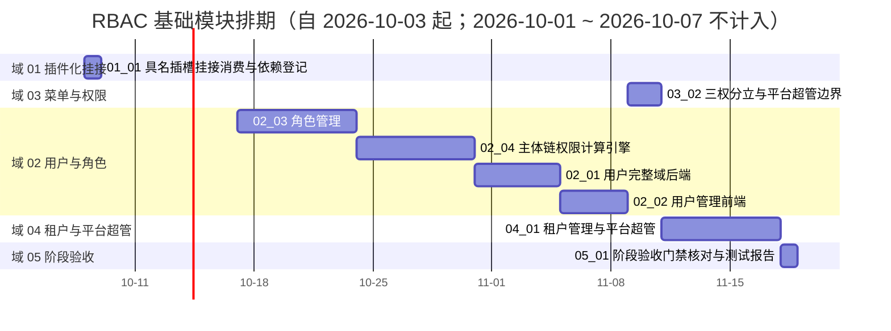

# RBAC 基础模块计划

> BMS 基础管理系统 · 阶段七（RBAC 基础模块）排期计划：**已完成 2 项，剩余 8 项**（域 01 插件化挂接 1 项 / 4h、域 02 用户与角色 4 项 / 184h、域 03 菜单与权限 1 项 / 16h、域 04 租户与平台超管 1 项 / 56h、域 05 阶段验收 1 项 / 8h；域 03 `03_01` 48h 与域 06 布局样式 1 项 / 24h 已完成，合计 10 项 / **340h**）；**已完成 72h；剩余 268h；阶段合计 340h**

[文档首页](../../../文档首页.md) › RBAC 基础模块计划　|　[任务基线 →](../任务/02_用户与角色/02_用户与角色.md)　[需求基线 →](../需求/00_需求_RBAC基础模块.md)

## 1. 计划说明 

- **排期对象**：阶段七 9 条需求、10 个子任务（域 01 插件化挂接 1 / 域 02 用户与角色 4 / 域 03 菜单与权限 2 / 域 04 租户与平台超管 1 / 域 05 阶段验收 1 / 域 06 布局样式 1），任务基线见[域 01](../任务/01_插件化挂接/01_插件化挂接.md)、[域 02](../任务/02_用户与角色/02_用户与角色.md)、[域 03](../任务/03_菜单与权限/03_菜单与权限.md)、[域 04](../任务/04_租户与平台超管/04_租户与平台超管.md)、[域 05](../任务/05_阶段验收/05_阶段验收.md)、[域 06](../任务/06_布局样式/06_布局样式.md)。
- **执行序（承前启后）**：`01_01 具名插槽挂接消费与依赖登记`（**拆口径**：前置登记先行，闭环——mdm「用户分配岗位」插件经槽挂接验证——待 mdm 组织域，见 §3 备注与 §7 第 1 项） → `06_01 前端主框架布局样式`（**先行**：为界面消费提供可见外壳） → `03_01 菜单/表单/按钮/字段挂接与动态菜单` → `02_03 角色管理` → `02_04 主体链权限计算引擎` → `02_01 用户完整域后端` → `02_02 用户管理前端` → `03_02 三权分立与平台超管边界` → `04_01 租户管理与平台超管` → `05_01 阶段验收门禁核对与测试报告`（收口）。**补遗项 `01_01` 为登记件、`06_01` 为先行样式支撑件；主链首个可完整交付的实现任务为 `03_01`**（无阶段七与外部阻塞）。
- **承接口径**：阶段六已交付 `sys_user` 最小模型、认证链与会话踢出通道、账号锁定记录读写；阶段五域 06 子任务 `06_01`（需求 `05-10` 具名插槽基座与前后端配套约定）已交付；阶段四已交付前端动态路由 / 注册表基座与组织选择字段族（组织主数据只读出口消费链路）。本阶段在其上**补齐 RBAC 主体链权限、用户 / 角色 / 菜单 / 租户治理**，不重复建设基座。
- **已定口径（2026-10-03 拍板；2026-10-04 补充）**：需求 8 条 / 5 域（`07-1` ~ `07-8`）；`07-1` 为索引性需求、阶段七侧只作挂接消费与依赖登记（实施随阶段五 `05-10`）；三权分立归域 03（`07-6`）；任务取**一需求一子任务**粗粒度（`07-2` 拆后端 / 前端两子任务），详细设计阶段可按需递归拆子任务；**mdm 组织域（`org_dept`/`org_post`/`org_user_post` 与用户-岗位契约、组织只读出口）为外部前置依赖，未就绪时相关子项降级 / 占位推进**，不阻塞其余功能；各需求优先级一律 2 高。**补充（2026-10-04）**：新增需求 `07-9`（前端主框架布局样式，域 06）——`03_01` 前置排查发现 `ui-ep` 布局族（18 件）无样式实现、宿主外壳呈裸骨架，经拍板补立并**先行于 `03_01`**；需求计数 8 → 9 条，任务 9 → 10 项。
- **排期口径**：自 2026-10-03 起串行排期（单人兼职）；按 8h/日折算，2026-10-01 ~ 2026-10-07（国庆）不计入；窗口为估算基线，可按实际滚动调整并记录调整原因。
- **工时**：剩余 268h（域 01 4h = `01_01` 4h；域 02 184h = `02_01` 40h + `02_02` 32h + `02_03` 56h + `02_04` 56h；域 03 16h = `03_02` 16h；域 04 56h = `04_01` 56h；域 05 8h = `05_01` 8h）；已完成 72h（域 03 `03_01` 48h、域 06 `06_01` 24h）；阶段合计 340h；任务级工时随详细设计重估并同步回写。
- **里程碑锚点**：M7 = **RBAC 基础模块可用**（《总体项目规划》「里程碑」节），门禁见[本计划 §5 M7 验收门禁](#accept)。
- **负责人**：minjian（兼职，单人）。

## 2. 已完成任务 

| 编号 | 任务 | 工时（重估） | 完成日期 | 任务文件 | 偏差与遗留 |
| --- | --- | --- | --- | --- | --- |
| 06_01 | 前端主框架布局样式（布局族 18 件补样式 / 主题令牌 / 响应式） | 24h | 2026-10-04 | [06_01](../任务/06_布局样式/06_布局样式_01_前端主框架布局样式/06_布局样式_01_前端主框架布局样式.md) | 遗留 7 项（见任务实施记录 §7 与 §7 台账）：`useResponsive` 同档位缩放不重算断点、标签栏「更多」接线、标签拖拽 / 中键关闭 / 菜单展开持久化、顶栏业务项装配、EP 完整深色适配与亮色色阶评估、标签栏视觉形态不逐像素照抄。**2026-10-05 用户复核补修**：顶栏改 56px 全宽横条 + 顶栏业务项装配（全局搜索 / 待办 / 租户 / 用户下拉含退出登录），并修「侧栏菜单为空 / 页签标题显示 `/` / 菜单图标缺失 / 满屏高度塌陷」四缺陷 —— **「顶栏业务项装配」遗留已收口** |
| 03_01 | 菜单/表单/按钮/字段挂接与动态菜单（后端 + 前端消费） | 48h | 2026-10-05 | [03_01](../任务/03_菜单与权限/03_菜单与权限_01_菜单表单按钮字段挂接与动态菜单/03_菜单与权限_01_菜单表单按钮字段挂接与动态菜单.md) | 遗留 4 项（见任务测试记录 §5 与实施记录 §5）：菜单管理维护页 / 权限码管理页与业务 · 动作码维护写接口不在本任务（归后续维护页任务）；字段权限真实收窄随 `02_04`；三库真库迁移演练与联调随部署窗口；标签栏「更多」溢出接线 / 拖拽排序 / 中键关闭归标签 / 导航族（菜单展开持久化本任务已落地）。**2026-10-05 补记**：收口期修前端消费链缺陷「侧栏菜单为空」（`toMenuNode` 叶子 `children` 误为 `[]`，被权限过滤整链丢弃），提交 `c89452a99` |

## 3. 剩余任务排期（自 2026-10-03） 

| 编号 | 任务 | 状态 | 工时 | 依赖 | 排期窗口 | 备注 | 偏差与遗留 |
| --- | --- | --- | --- | --- | --- | --- | --- |
| 01_01 | 具名插槽挂接消费与依赖登记 | 未开始 | 4h | 阶段五 `06_01`（已交付） | 2026-10-08 | **拆口径**：前置登记先行（消费约定 / 降级口径 / 依赖标注，产出给 `02_02` 与 mdm 的前置契约）；闭环（mdm「用户分配岗位」插件经 `sys.user.detail.tabs` 挂接验证）待 mdm 组织域 | 闭环依赖 mdm 组织域（外部，未启动）——本项**不占「首个完成」位** |
| 02_03 | 角色管理（后端授权 + 前端角色管理页） | 未开始 | 56h | 03_01 | 2026-10-17 ~ 2026-10-23 | 授权载体（角色分配 / 授予 / 数据权限） | **菜单 ↔ 表单多对多关联表 `sys_menu_form`（`sys_form` 去 `menu_id`，`03_01` 已交付实现待返工）**；`sys_role_permission` 增**来源字段** `source_menu_id`；`sys_data_scope` 改**结构化（角色 × 字典 × 策略，只选不编）**；权限配置交互待进一步调整（细则待补）；前端「表单权限件」「动态字典组件」及操作/字段权限面板归组件库「08 交互类 04 权限配置」新增子任务 |
| 02_04 | 主体链权限计算引擎（含组织主数据只读出口联调） | 未开始 | 56h | 02_03/03_01 | 2026-10-24 ~ 2026-10-30 | 两级校验 / 版本失效 / 字段权限 / 数据范围 | 遗留：组织只读出口联调依赖 mdm 就绪，未就绪按降级推进（归口 mdm 组织域） |
| 02_01 | 用户完整域后端（CRUD / 启停 / 删除 / 重置密码 / 锁定解锁） | 未开始 | 40h | 02_04/02_03 | 2026-10-31 ~ 2026-11-04 | 依赖阶段六 `sys_user` 最小模型 | 无 |
| 02_02 | 用户管理前端（列表 / 详情 / 表单 / 账号锁定页） | 未开始 | 32h | 02_01/03_01/01_01 | 2026-11-05 ~ 2026-11-08 | 具名插槽岗位 Tab（mdm 插件）：提供 `sys.user.detail.tabs` 挂接位（`01_01` 闭环的宿主方） | 遗留：岗位分配 Tab 依赖 mdm 插件，未就绪按隐藏降级（归口 mdm 组织域 / 计划 §7 第 1 项） |
| 03_02 | 三权分立与平台超管边界 | 未开始 | 16h | 02_03 | 2026-11-09 ~ 2026-11-10 | 内置三类管理员互斥 + 平台超管边界 | 无 |
| 04_01 | 租户管理与平台超管（后端 + 前端） | 未开始 | 56h | 03_02/02_03 | 2026-11-11 ~ 2026-11-17 | 开通建库迁移种子 / 域名 / 配额 / 模块开关 | 无 |
| 05_01 | 阶段验收门禁核对与测试报告 | 未开始 | 8h | 01_01 ~ 04_01 | 2026-11-18 | 收口 | 无 |

> **`01_01` 完成口径说明（2026-10-04 拍板）**：本任务拆为**前置登记**（消费约定 / 降级口径 / 依赖标注与 mdm 侧消费方标注，可先行）与**闭环**（mdm「用户分配岗位」插件经 `sys.user.detail.tabs` 真挂接且缺失即隐藏的验证）两段；前者无阻塞、后者**外部依赖 mdm 组织域**（演进路线阶段三，未启动）。故 `01_01` 的完成时点实际落在 `02_02` 与 mdm 插件之后，**主链首个可完整交付的实现任务为 `03_01`**（补遗项 `06_01` 为先行样式支撑件）。mdm 侧未就绪期间，用户管理页（`02_02`）的挂接位按降级（隐藏）推进，不阻塞用户完整域其余功能。

> **补充需求 `07-9` / 任务 `06_01` 说明（2026-10-04 拍板）**：`03_01` 前置排查发现 `ui-ep` 布局族（`layout/` 下 18 件）无任何样式实现、宿主主框架外壳呈裸骨架，直接制约 `03_01` 的界面消费与观感验收；经拍板顺延新增需求 `07-9` 与任务域 06，**先行于 `03_01`** 交付。需求 8 → 9 条、任务 9 → 10 项、合计 316 → 340h 已并入本表与 §1。**该任务已于 2026-10-04 交付**（布局族 18 件样式齐备 + 令牌与 EP 映射补全 + 开发态核对页；遗留见 §7 台账）。

## 4. 排期甘特图 

## 5. M7 验收门禁 

门禁定义见《[总体项目规划](../../../规划/总体项目规划.md)》「阶段内容与完成标准」节（阶段七行）；**逐项结论与证据索引随阶段收口填实**（当前阶段在途，下表为门禁对照与达成路径）。门禁表 7 行为**基线**（不增删）；补充需求 `07-9` / 任务 `06_01`（布局族样式）不属门禁条目，但为「字段权限生效」等界面消费类结论的**可视核对前提**（`06_01` 已于 2026-10-04 交付）。

| 验收点 | 对应任务 | 达成路径（结论与证据索引） |
| --- | --- | --- |
| 角色分配权限计算正确 | 02_04 | 用户直接角色读 `sys_user_role` + 岗位/部门角色经 mdm 只读契约跨服务汇总取并集；用例覆盖并集与跨服务降级（待收口填结论） |
| 越权与跨租户访问被拒验证通过 | 02_04 / 02_01 | 业务级 / 动作级两级校验 + 租户过滤；越权与跨租户用例全拒（待收口填结论） |
| 数据范围读写检查生效 | 02_03 / 02_04 | `sys_data_scope` 规则解析注入读时过滤、写时校验，强制租户过滤（待收口填结论） |
| 字段权限生效 | 02_03 / 02_04 | 字段权限读不返回、写拒绝；前端按字段权限显隐（待收口填结论） |
| 配额超限拦截生效 | 04_01 | `sys_tenant_quota` 用户数 / 存储 / 开放接口调用量超限拦截与告警（待收口填结论） |
| 三权互斥生效 | 03_02 / 04_01 | 内置三类管理员互斥校验前置 + 开通种子互斥预授（待收口填结论） |
| 租户模块开关生效 | 04_01 | `sys_tenant_module` 开关：停用模块入口 / 接口被拒、存量可查、重开恢复（待收口填结论） |

**里程碑对照**（《总体项目规划》「里程碑」节）：

| 里程碑 | 基线（《总体项目规划》） | 本计划实际 | 说明 |
| --- | --- | --- | --- |
| M7 RBAC 基础模块可用 | 阶段七（5 周基线，上一阶段为阶段六） | 待达成（自 2026-10-03 起排期） | 7 行门禁逐条核对后填实 |

## 6. 风险与对策 

| 风险 | 影响 | 对策 |
| --- | --- | --- |
| mdm 组织域未就绪（岗位 / 部门主数据与用户-岗位契约） | 岗位分配插件、岗位/部门角色分配链、组织只读出口无法真实联调 | 相关子项降级 / 占位推进（插件缺失隐藏、角色分配先覆盖用户主体）；登记外部依赖与归口，mdm 就绪后补联调 |
| 权限缓存版本失效与授权写入不一致 | 授权已改而权限未即时生效 | 授权写入与版本递增同事务；缓存读取校验版本；用例覆盖即时生效 |
| 字段权限读过滤漏接序列化层 | 敏感字段越权返回 | 序列化层统一过滤不可见字段；读写双向用例覆盖 |
| 数据范围规则未强制叠加租户过滤 | 跨租户数据泄漏 | 规则解析结果强制叠加租户条件；跨租户规则拒绝并用例覆盖 |
| 租户开通重型操作半途失败 | 残留半开通租户 | 建库 / 迁移 / 种子任一步失败清理已建库并告警；幂等键防重复开通 |
| 模块开关只拦前端入口 | 停用模块仍可经接口写数据 | 前端入口 + 后端接口双拦；停用模块接口返回明确错误码并用例覆盖 |
| 布局族样式缺口（`ui-ep` 18 件无样式实现） | 主框架外壳裸骨架，界面消费与页面交付观感受限、界面类验收无据 | **已消解**：需求 `07-9` / 任务 `06_01` 先行补足并于 **2026-10-04 交付**（样式一律入件 `scoped` + 设计令牌；令牌与 EP 映射同步补全） |
| 单人兼职投入不稳 | M7 延期 | 串行保守排期；先打通「元数据挂接 → 角色授予 → 权限计算 → 用户管理」主链，租户与验收可顺延补 |

## 7. 后续阶段待办 

| # | 事项 | 来源 | 归口 |
| --- | --- | --- | --- |
| 1 | **mdm 组织域实施**：`org_dept` / `org_post` / `org_user_post` 与用户-岗位契约（`/api/v1/org/user-posts`）、**角色-岗位 `org_role_post` / 角色-部门 `org_role_dept` 与角色分配契约**（含「按用户解析角色」只读契约）、组织主数据只读出口，以及 **「用户分配岗位」插件**（挂 `sys.user.detail.tabs`）、**「岗位分配 / 部门分配」插件**（挂角色表单「角色分配」页签）——本阶段 `01_01` 闭环、`02_02` 岗位 Tab、`02_03` 角色分配页签与 `02_04` 岗位/部门角色链联调的前置 | 审 07-2 / 07-3 / 07-4；`01_01` 闭环依赖；mdm 概要 02 §5.4；mdm 规划 §7「阶段三 主数据实现」 | mdm 组织域实施（外部，未排期） |
| 2 | 会话管理页 / 个人中心收口 | 需求范围外 | 阶段十五 |
| 3 | 操作 / 登录日志落库与哈希链、Socket.IO 实时推送后端 | 需求范围外；阶段六遗留 | 阶段八 |
| 4 | 字段 / 展示类组件回补 | 需求范围外 | 阶段八 |
| 5 | Excel 批量导入流程（用户导入入口衔接） | 审 07-2；概要 03 | 导入导出阶段 |
| 6 | 自定义图标管理（`icon:manage`） | 审 07-5；概要 07 | 菜单管理后续演进 |
| 7 | 平台业务页面（列表导出 `export` / 查询方案 `query`）消费 RBAC 权限 | 审 07-3 / 07-5 | 对应业务阶段 |
| 8 | 布局族组件视觉样式缺失（`ui-ep` 的 `layout/` 18 件均无样式实现，宿主外壳呈裸骨架）—— 按《[布局设计 · 主框架](../../../设计/布局设计/04_布局设计_主框架.html)》《[布局设计 · 导航](../../../设计/布局设计/05_布局设计_导航.html)》补样式 | 2026-10-03 启动链路排查发现（环境无问题，属实现缺口） | **已交付（2026-10-04）**：需求 `07-9` + 任务域 06（`06_01`）先行补足，18 件样式齐备 + 令牌与 EP 映射补全 + 开发态核对页；**租户品牌化部分**仍归品牌化阶段 |
| 10 | `useResponsive` 同一档位内缩放不重算断点（`onMediaChange` 仅监听跨阈值变化）→ 移动端 / 窄屏判定可能滞后 | `06_01` 实测 | 响应式改进（后续界面任务） |
| 11 | 多标签栏「更多」溢出按钮未接线（`maxVisible` 缺省 0、宿主未传）；标签拖拽排序 / 鼠标中键关闭未实现（**菜单展开状态持久化 `bms_menu_expanded` 已随 `03_01` 落地**） | `06_01` 实测；`03_01` 部分收口（2026-10-05） | 标签 / 导航族后续任务 |
| 12 | ~~顶栏业务内容（全局搜索 / 通知铃铛 / 租户切换 / 用户下拉）未装配（宿主仅留 `layout.header` 区域插槽）~~ → **已交付（2026-10-05 复核补修）** | `06_01` 实测；2026-10-05 复核补修 | 宿主装配（**已交付**）：`AppHeaderSearch`（全局搜索，按原型靠左）+ `AppHeaderBar`（待办 / 租户 / 用户下拉含退出登录）经 `#header-left` / `#header-right` 装配；待办真实角标（通知中心 Socket.IO）/ 租户切换列表 / 偏好 · 改密页归相关后续任务 |
| 14 | 菜单种子图标键为小写 / kebab-case（`el:setting`、`el:office-building`），与官方图标注册表 PascalCase 键（`el:Setting`）不一致 | 2026-10-05 复核补修实测 | **前端已兼容**（`IconRenderer` 对 `el:` 键做 PascalCase 归一）；后端种子图标键命名口径统一归菜单管理后续任务 |
| 13 | EP 组件**完整**深色适配（未映射变量与色阶派生）与 EP 映射带来的亮色轻微色阶变化统一评估 | `06_01` 实测 | 品牌化阶段 |
| 9 | 文档校验脚本：界面类任务「原型依据」登记校验（任务详细设计须含原型引用、界面类交付须附对照结论）——`scripts/tools/check-docs/` 新增校验 + self-test + preflight 接入 | 2026-10-04 规范强化（《[原型审查规范](../../../规范/原型审查规范.md)》三向对齐 / 《[AI开发规范](../../../规范/AI开发规范.md)》「界面先原型」）落地机器护栏 | **工具治理**（判定口径——如何自动识别「界面类任务」——须先设计；随下次文档校验批次或本阶段界面任务前立项） |
| 15 | **具名插槽「显式上下文注入通道」**（基座，需求 `05-11`）：现行上下文仅支持「路由参数」，非路由页面（角色表单为记录 Tab）插件无通道取实体 id；须补显式上下文注入，供 mdm「岗位分配 / 部门分配」插件挂角色表单「角色分配」页签 | 审 `07-3`（角色分配页签）；需求 [05-11](../../05_前端插件化/需求/06_需求_具名插槽与插件挂接.md#r05-11)（2026-10-06 回补） | 阶段五具名插槽基座（`05-11`，另立项）——`02_03` 角色分配页签与 mdm 岗位/部门分配插件的**前置**；mdm 组织域就绪前按降级推进 |

> **台账说明**：上表汇总本阶段需求范围外项、外部依赖与任务遗留（共 13 项），逐条给归口、无「无归口」条目；阶段收口时随 `05_01` 补全各任务遗留并同步本表。

> 本文档依《[文档生成规范](../../../规范/文档生成规范.md)》与《[计划文档规范](../../../规范/计划文档规范.md)》编写
