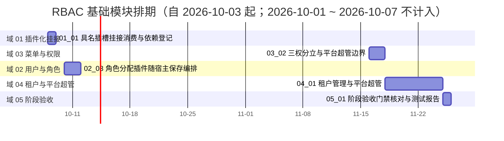

# RBAC 基础模块计划

> BMS 基础管理系统 · 阶段七（RBAC 基础模块）排期计划：**已完成 7 项，剩余 5 项**（域 01 插件化挂接 1 项 / 4h、域 02 用户与角色 1 项 / 72h（`02_03`；含 `07-11` 追加子任务 44h）、域 03 菜单与权限 1 项 / 16h、域 04 租户与平台超管 1 项 / 56h、域 05 阶段验收 1 项 / 8h；域 03 `03_01` 48h、域 06 布局样式 1 项 / 24h、域 02 `02_05` 16h、`02_06` 8h、`02_04` 56h、`02_02` 72h（自有 32h ＋ `07-11` 追加子任务 `_01` 16h 与 `_02` 24h）与 `02_01` 44h（自有 40h ＋ `07-11` 追加子任务 `_01` 4h）已于 2026-10-09 交付，合计 12 项 / **424h**（含 bms `07-11` 追加子任务 44h）**＋ `02_03` 追加子任务 `_02`（工时待确认）**）；**已完成 268h；剩余 156h；阶段合计 424h（含 bms `07-11` 追加子任务 44h）**；**另追加需求 `07-11`（域 02）：跨仓共 60h（2026-10-09 确认）——mdm `01_02` 追加子任务 16h、bms `02_01` 追加子任务 `_01` 4h、bms `02_02` 追加子任务 `_01` 16h 与 `_02` 24h；实施路径为 mdm `_02` 先行 → **bms `02_01/_01` 独立先行交付（2026-10-09）** → bms `02_02`（主体 + `_01` + `_02`）**

[文档首页](../../../文档首页.md) › RBAC 基础模块计划　|　[任务基线 →](../任务/02_用户与角色/02_用户与角色.md)　[需求基线 →](../需求/00_需求_RBAC基础模块.md)

## 1. 计划说明 

- **排期对象**：阶段七 11 条需求、12 个子任务（域 01 插件化挂接 1 / 域 02 用户与角色 6 / 域 03 菜单与权限 2 / 域 04 租户与平台超管 1 / 域 05 阶段验收 1 / 域 06 布局样式 1），任务基线见[域 01](../任务/01_插件化挂接/01_插件化挂接.md)、[域 02](../任务/02_用户与角色/02_用户与角色.md)、[域 03](../任务/03_菜单与权限/03_菜单与权限.md)、[域 04](../任务/04_租户与平台超管/04_租户与平台超管.md)、[域 05](../任务/05_阶段验收/05_阶段验收.md)、[域 06](../任务/06_布局样式/06_布局样式.md)。
- **执行序（承前启后）**：`01_01 具名插槽挂接消费与依赖登记`（**拆口径**：前置登记先行，闭环——mdm「用户分配岗位」插件经槽挂接验证——待 mdm 组织域，见 §3 备注与 §7 第 1 项） → `06_01 前端主框架布局样式`（**先行**：为界面消费提供可见外壳） → `03_01 菜单/表单/按钮/字段挂接与动态菜单` → `02_05 用户账号归口平台`（**先行**：用户 / 角色 / 授权同库收敛，为 `02_03` 剩余部分与 `02_01` 清障） → `02_03 角色管理` → `02_06 平台用户只读出口内部契约`（**跨仓协同，随 mdm 阶段一 `01_03` 提前实施**，为 `02_01` 前置） → `02_04 主体链权限计算引擎` → `02_01 用户完整域后端`（自有部分与追加子任务 `_01` 出口去 `dept_id` 均已交付，2026-10-09） → **mdm 阶段一 `01_02` 嵌套子任务 `_02`（跨仓先行：`org_user_dept` / `is_primary` / `/user-depts` 契约 / 两插件，已交付）** → `02_02 用户管理前端`（含追加子任务 `_01`） → `03_02 三权分立与平台超管边界` → `04_01 租户管理与平台超管` → `05_01 阶段验收门禁核对与测试报告`（收口）。**补遗项 `01_01` 为登记件、`06_01` 为先行样式支撑件；主链首个可完整交付的实现任务为 `03_01`**（无阶段七与外部阻塞）。
- **承接口径**：阶段六已交付 `sys_user` 最小模型、认证链与会话踢出通道、账号锁定记录读写；阶段五域 06 子任务 `06_01`（需求 `05-10` 具名插槽基座与前后端配套约定）已交付；阶段四已交付前端动态路由 / 注册表基座与组织选择字段族（组织主数据只读出口消费链路）。本阶段在其上**补齐 RBAC 主体链权限、用户 / 角色 / 菜单 / 租户治理**，不重复建设基座。
- **已定口径（2026-10-03 拍板；2026-10-04 补充）**：需求 8 条 / 5 域（`07-1` ~ `07-8`）；`07-1` 为索引性需求、阶段七侧只作挂接消费与依赖登记（实施随阶段五 `05-10`）；三权分立归域 03（`07-6`）；任务取**一需求一子任务**粗粒度（`07-2` 拆后端 / 前端两子任务），详细设计阶段可按需递归拆子任务；**mdm 组织域（`org_dept`/`org_post`/`org_user_post` 与用户-岗位契约、组织只读出口）为外部前置依赖，未就绪时相关子项降级 / 占位推进**，不阻塞其余功能；各需求优先级一律 2 高。**补充（2026-10-04）**：新增需求 `07-9`（前端主框架布局样式，域 06）——`03_01` 前置排查发现 `ui-ep` 布局族（18 件）无样式实现、宿主外壳呈裸骨架，经拍板补立并**先行于 `03_01`**；需求计数 8 → 9 条，任务 9 → 10 项。**补充（2026-10-07）**：新增需求 `07-10`（用户（账号）归口平台，域 02）——复核确认术语边界（**组织域＝集团 / 公司 / 部门 / 岗位 / 人员，归 mdm；用户＝系统账号，属权限 / 身份体系归 platform**），把 `sys_user` / `sys_account_lock` 迁 platform 服务租户库并收敛跨服务引用，**先行于 `02_03` 剩余部分与 `02_01`**；需求计数 9 → 10 条，任务 10 → 11 项。**补充（2026-10-09）**：新增需求 `07-11`（用户-部门多分配与主要岗位 / 主要部门，域 02）——用户管理页原型对齐「表单框架」时确认用户-部门关系应与其他组织关系一致归 mdm、且「用户所属岗位 / 部门」需以主要项确定（原 `sys_user.dept_id` 单值逻辑外键设计**取消**）；任务按 §3.1 挂现有父任务：mdm `01_02` 追加嵌套子任务、bms `02_01` / `02_02` 各追加嵌套子任务。需求计数 10 → **11 条**。**实施路径与投入（2026-10-09 拍板 / 粗估）**：mdm `01_02/_02` **先行**（唯一跨仓硬前置——bms 两子任务均依赖其「两端同批切换」与两插件）→ bms `02_02`（主体 + `_01`）与 `02_01/_01` **同批发布**（跨仓一轮联合回归）；投入——mdm `_02` 16h、bms `02_01/_01` 4h、`02_02/_01` 16h、`02_02/_02` 24h（**2026-10-09 重估确认**）。**2026-10-09 第三次拍板**：跨服务一致性改走**原子化分布式事务**（TM + 各服务 XA 分支，**不做反向补偿**）——由此新增嵌套子任务 `02_02/_02 用户保存编排端点（TM + XA）`，并把插件契约由「自提交」改为「**宿主收草稿**」（`registerSubmitter` entry 扩展为携带草稿）。
- **排期口径**：自 2026-10-03 起串行排期（单人兼职）；按 8h/日折算，2026-10-01 ~ 2026-10-07（国庆）不计入；窗口为估算基线，可按实际滚动调整并记录调整原因。**补记（2026-10-07）**：新增子任务 `02_06`（平台用户只读出口内部契约）**随 mdm 阶段一 `01_03` 同批提前交付**（跨仓协同——mdm 组织只读出口需经平台用户只读出口取用户明细），并作为 `02_01` 前置。
- **工时**：剩余 156h（域 01 4h = `01_01` 4h；域 02 72h = `02_03` 72h（自有 56h + 追加子任务 `_01` 16h）＋ `02_03` 追加子任务 `_02`（**工时待确认**）；域 03 16h = `03_02` 16h；域 04 56h = `04_01` 56h；域 05 8h = `05_01` 8h）；已完成 268h（域 03 `03_01` 48h、域 06 `06_01` 24h、域 02 `02_05` 16h、`02_06` 8h、`02_04` 56h、`02_02` 72h（自有 32h + 追加子任务 `_01` 16h + `_02` 24h）与 `02_01` 44h（自有 40h + 追加子任务 `_01` 4h））；阶段合计 424h（含 bms `07-11` 追加子任务 44h）＋ `02_03` 追加子任务 `_02` 待估；任务级工时随详细设计重估并同步回写。
- **里程碑锚点**：M7 = **RBAC 基础模块可用**（《总体项目规划》「里程碑」节），门禁见[本计划 §5 M7 验收门禁](#accept)。
- **负责人**：minjian（兼职，单人）。

## 2. 已完成任务 

| 编号 | 任务 | 工时（重估） | 完成日期 | 任务文件 | 偏差与遗留 |
| --- | --- | --- | --- | --- | --- |
| 06_01 | 前端主框架布局样式（布局族 18 件补样式 / 主题令牌 / 响应式） | 24h | 2026-10-04 | [06_01](../任务/06_布局样式/06_布局样式_01_前端主框架布局样式/06_布局样式_01_前端主框架布局样式.md) | 遗留 7 项（见任务实施记录 §7 与 §7 台账）：`useResponsive` 同档位缩放不重算断点、标签栏「更多」接线、标签拖拽 / 中键关闭 / 菜单展开持久化、顶栏业务项装配、EP 完整深色适配与亮色色阶评估、标签栏视觉形态不逐像素照抄。**2026-10-05 用户复核补修**：顶栏改 56px 全宽横条 + 顶栏业务项装配（全局搜索 / 待办 / 租户 / 用户下拉含退出登录），并修「侧栏菜单为空 / 页签标题显示 `/` / 菜单图标缺失 / 满屏高度塌陷」四缺陷 —— **「顶栏业务项装配」遗留已收口** |
| 03_01 | 菜单/表单/按钮/字段挂接与动态菜单（后端 + 前端消费） | 48h | 2026-10-05 | [03_01](../任务/03_菜单与权限/03_菜单与权限_01_菜单表单按钮字段挂接与动态菜单/03_菜单与权限_01_菜单表单按钮字段挂接与动态菜单.md) | 遗留 4 项（见任务测试记录 §5 与实施记录 §5）：菜单管理维护页 / 权限码管理页与业务 · 动作码维护写接口不在本任务（归后续维护页任务）；字段权限真实收窄随 `02_04`；三库真库迁移演练与联调随部署窗口；标签栏「更多」溢出接线 / 拖拽排序 / 中键关闭归标签 / 导航族（菜单展开持久化本任务已落地）。**2026-10-05 补记**：收口期修前端消费链缺陷「侧栏菜单为空」（`toMenuNode` 叶子 `children` 误为 `[]`，被权限过滤整链丢弃），提交 `c89452a99` |
| 02_04 | 主体链权限计算引擎（含组织主数据只读出口联调） | 56h | 2026-10-08 | [02_04](../任务/02_用户与角色/02_用户与角色_04_主体链权限计算引擎/02_用户与角色_04_主体链权限计算引擎.md) | 主体链并集（直接角色 ∪ mdm 岗位/部门链，降级 + 严格模式）、权限聚合（菜单/表单→业务码、动作→动作码）、统一权限快照与租户版本失效、两级校验（豁免/码集/校验链，未预加载从严拒）、字段权限（静态收窄 + 写拒绝接缝）、数据范围四策略（越界即拒、读写双向）、内部失效端点、动态菜单字段标记与权限概要；用例 Kiwi 2269；遗留 5 项见其[实施记录 §6](../任务/02_用户与角色/02_用户与角色_04_主体链权限计算引擎/实施/01_实施记录_04_主体链权限计算引擎.md#open) |
| 02_05 | 用户账号归口平台（`sys_user` / `sys_account_lock` 迁 platform、identity 内部契约改指、跨库搬迁） | 16h | 2026-10-07 | [02_05](../任务/02_用户与角色/02_用户与角色_05_用户账号归口平台/02_用户与角色_05_用户账号归口平台.md) | 遗留 3 项（见任务测试记录 §6 与实施记录 §6）：三库真库迁移演练与联调随部署窗口；`ops/init_tenant` / `provision_tenant` / `migrate_tenants` 经核查无需改动（结论入实施记录）；已部署库若 `sys_user_role` 存量行 `user_id` 指向 org 库，须随搬迁脚本一并核对（本地 dev 库重建免此步） |
| 02_06 | 平台用户只读出口内部契约（`/api/v1/platform/internal/users/query` 服务间只读出口，供 mdm 组织只读出口取用户明细） | 8h | 2026-10-07 | [02_06](../任务/02_用户与角色/02_用户与角色_06_平台用户只读出口内部契约/02_用户与角色_06_平台用户只读出口内部契约.md) | 交付：`require_service("org")` 只读出口（关键字 / 状态 / 限定集合 `ids` + 分页）+ 契约字段（含 `dept_id` 可空、联系方式原样返回）+ 契约快照与前端类型零漂移。**提前实施**（随 mdm 阶段一 `01_03` 同批，为 `02_01` 前置）；遗留：~~`dept_id` 入参与响应生效随需求 07-2 落字段（开放项 §8）~~ **已注销**（`sys_user` 不落组织字段，出口 `dept_id` 由 `02_01` 追加子任务 `_01` **移除**，2026-10-09）；数据范围 / 脱敏归消费方与后续阶段（见任务实施记录 §7） |
| 02_01 | 用户完整域后端（CRUD / 启停 / 删除 / 重置密码 / 锁定解锁）**含追加子任务** | 44h | 2026-10-09 | [02_01](../任务/02_用户与角色/02_用户与角色_01_用户完整域后端/02_用户与角色_01_用户完整域后端.md) | **自有部分**（2026-10-09，Kiwi 2270）：七个管理面方法 + identity 内部撤销端点 + 保护 / 闭锁 + `sys.user.*` 事件（载荷去 `dept_id`）+ 种子。**追加子任务** [`_01 平台用户只读出口字段收口`](../任务/02_用户与角色/02_用户与角色_01_用户完整域后端/02_用户与角色_01_用户完整域后端_01_平台用户只读出口字段收口/02_用户与角色_01_用户完整域后端_01_平台用户只读出口字段收口.md)（Kiwi **2275**）**独立先行交付**：`02_06` 出口移除 `dept_id` + 契约快照 / 前端类型重生成 + 平台契约基线对齐；**11 项遗留**见 [实施记录 §6](../任务/02_用户与角色/02_用户与角色_01_用户完整域后端/实施/01_实施记录_01_用户完整域后端.md#open)（归口其他阶段 / 部署窗口，**非本任务阻塞项**；原第 8 项「组织字段与关系」随本子任务交付**已闭环**） |
| 02_02 | 用户管理前端（列表 / 详情 / 表单 / 账号锁定页）**含追加子任务** | 72h | 2026-10-09 | [02_02](../任务/02_用户与角色/02_用户与角色_02_用户管理前端/02_用户与角色_02_用户管理前端.md) | **自有部分**：用户列表页（无操作列 / 双击开记录页签 / 状态内联开关 / 筛选关键字 + 状态 / 批量启停 / 重置密码限单行；**不渲染导入 / 导出**）、用户记录页（详细信息 / 用户分配 / 系统信息三页签、工具栏单一保存、dirty 拦截、SSO 身份绑定只读区块、停用分配只读、新增态提示先创建）、账号锁定页（列表 / 记录、手动锁定 / 批量解锁 / 解锁留痕、已解锁行不可选）；**追加子任务** [`_01 用户分配页签与插件子页签挂接`](../任务/02_用户与角色/02_用户与角色_02_用户管理前端/02_用户与角色_02_用户管理前端_01_用户分配页签与插件子页签挂接/02_用户与角色_02_用户管理前端_01_用户分配页签与插件子页签挂接.md)（平台内建「角色分配」按区域项注册 + 单个 outlet 三子页签并列 + `tabType` 透传 + 宿主收草稿）与 [`_02 用户保存编排端点（TM + XA）`](../任务/02_用户与角色/02_用户与角色_02_用户管理前端/02_用户与角色_02_用户管理前端_02_用户保存编排端点/02_用户与角色_02_用户管理前端_02_用户保存编排端点.md)（`PUT /users/{id}/assignments` 分段全量覆盖 + `provider=xa` 全局事务 / `null` 顺序提交 + 分支 `ops` 列表）；Kiwi 2276 / **2277** / **2278**；**遗留 5 项**见[实施记录 §5](../任务/02_用户与角色/02_用户与角色_02_用户管理前端/实施/01_实施记录_02_用户管理前端.md#leftover)（含：权限缺省时「用户分配」页签空态缺文案；导入 / 导出归口后续阶段；真库两阶段端到端保存归 CI / `05_07` 收尾） |

## 3. 剩余任务排期（自 2026-10-03） 

| 编号 | 任务 | 状态 | 工时 | 依赖 | 排期窗口 | 备注 | 偏差与遗留 |
| --- | --- | --- | --- | --- | --- | --- | --- |
| 01_01 | 具名插槽挂接消费与依赖登记 | 部分完成 | 4h | 阶段五 `06_01` / `06_03`（均已交付） | 2026-10-08 | **前置登记段已完成（2026-10-08）**：消费约定（`sys.user.detail.tabs` / `sys.role.detail.assign` 两消费位）、降级口径与依赖 / 消费方标注成文（[详设](../任务/01_插件化挂接/01_插件化挂接_01_具名插槽挂接消费与依赖登记/设计/01_详细设计_01_具名插槽挂接消费与依赖登记.md)） | **闭环**（mdm「用户分配岗位」插件经 `sys.user.detail.tabs` 真挂接 + 缺失即隐藏）待宿主正式页 `02_02` 交付后验收；mdm 组织域与 `05-11` 上下文通道均已就绪——本项**不占「首个完成」位** |
| 02_03 | 角色管理（后端授权 + 前端角色管理页）**含追加子任务** | 部分完成 | 72h | 02_05/03_01/02_04/01_01 | 搁置（`_02` 自 2026-10-10 起，窗口待定） | **2026-10-09 二次追加子任务** [`_02 角色分配插件随宿主保存编排`](../任务/02_用户与角色/02_用户与角色_03_角色管理/02_用户与角色_03_角色管理_02_角色分配插件随宿主保存编排/02_用户与角色_03_角色管理_02_角色分配插件随宿主保存编排.md)：插件提交时机改「跟随宿主保存」+ 宿主经 `registerSubmitter` 收集草稿并**编排**跨服务提交（本地事务 + 幂等 + 反向补偿 + 一致性屏障，**「排除 2PC / XA」属默认路径口径**——跨服务原子性已拍板经专项立项改走强一致，见 bms `05_07`）；**追加子任务工时待确认** | 自有部分（72h / 2026-10-08）与追加子任务 `_01`（Kiwi 2267）**均已交付**（遗留见本表下方 `02_03` 相关块引与任务记录 §6 / §8）；**`_02` 未开工** |
| 03_02 | 三权分立与平台超管边界（内置三类管理员 + 互斥校验 + 平台超管边界） | 未开始 | 16h | 02_03（`role_type` 类型位与 `role:grant`）；与 04_01 开通种子协同 | 2026-11-16 ~ 2026-11-17 | [任务文档](../任务/03_菜单与权限/03_菜单与权限_02_三权分立与平台超管边界/03_菜单与权限_02_三权分立与平台超管边界.md)（需求 `07-6`）：内置三类管理员互斥**前置**校验（30010 / 30048）、`role` 业务仅安全管理员持有、平台超管仅到租户级（不进租户业务数据）、开通种子互斥预授；错位/越权尝试落字段级审计 | 无 |
| 04_01 | 租户管理与平台超管（后端 + 前端） | 未开始 | 56h | 03_02/02_03/02_05 | 2026-11-18 ~ 2026-11-24 | 开通建库迁移种子 / 域名 / 配额 / 模块开关 | 无 |
| 05_01 | 阶段验收门禁核对与测试报告 | 未开始 | 8h | 01_01 ~ 04_01 | 2026-11-25 | 收口 | 无 |

> **`01_01` 完成口径说明（2026-10-04 拍板）**：本任务拆为**前置登记**（消费约定 / 降级口径 / 依赖标注与 mdm 侧消费方标注，可先行）与**闭环**（mdm「用户分配岗位」插件经 `sys.user.detail.tabs` 真挂接且缺失即隐藏的验证）两段；前者无阻塞、后者**外部依赖 mdm 组织域**（演进路线阶段三，未启动）。故 `01_01` 的完成时点实际落在 `02_02` 与 mdm 插件之后，**主链首个可完整交付的实现任务为 `03_01`**（补遗项 `06_01` 为先行样式支撑件）。mdm 侧未就绪期间，用户管理页（`02_02`）的挂接位按降级（隐藏）推进，不阻塞用户完整域其余功能。

> **`01_01` 进展更新（2026-10-08）**：**前置登记段已交付**（消费约定 / 降级口径 / 依赖与消费方标注成文，落[详设](../任务/01_插件化挂接/01_插件化挂接_01_具名插槽挂接消费与依赖登记/设计/01_详细设计_01_具名插槽挂接消费与依赖登记.md)），计划表记「部分完成」。原「外部依赖 mdm 组织域未启动」**已解除**——mdm 组织域（阶段一 `01_01` ~ `01_04`）与其三插件（用户分配岗位 / 岗位分配 / 部门分配）、基座 `05-11` 上下文通道均已交付；**闭环现仅待宿主正式页 `02_02`**。

> **`02_03` 重开口径（2026-10-08 拍板）**：用户复核「角色码为何不可改」→ 排查确认**内部无任何按角色 `code` 的引用**（`sys_user_role` / `sys_role_permission` / `sys_role_field` / `sys_data_scope`，以及 mdm 侧 `org_role_post` / `org_role_dept` / `user-roles` 一律 `role_id`；无角色域事件与审计载荷），唯一真实耦合是「**内置角色判定按 `code`**」（`role.protected_codes` 常量）。经拍板：内置判定改由 **`sys_role.role_type` 列**承担（`custom` / `system` / `security` / `audit`，为 `03_02` 三权互斥备好类型位），`role.protected_codes` 常量与配置项**删除**（迁移按缺省清单 `system_admin` / `security_admin` / `audit_admin` 回填存量行），角色码随之**放开可改（含内置角色）**；并顺带把全局 `BaseSchema` 改为**严格模式**（未知字段即拒，杜绝「带 code 更新被静默忽略」一类问题）。父任务 `02_03` 重开为「部分完成」，父行工时＝自有 56h + 直属子任务 16h。

> **`02_03` 收口（2026-10-08）**：追加子任务 [`_01 角色码可改与内置判定脱钩`](../任务/02_用户与角色/02_用户与角色_03_角色管理/02_用户与角色_03_角色管理_01_角色码可改与内置判定脱钩/02_用户与角色_03_角色管理_01_角色码可改与内置判定脱钩.md) **已交付**（Kiwi 2267）——`sys_role` 增 `role_type` 列、`role.protected_codes` 常量与系统参数退役、角色码放开可改（含内置角色）、全局 `BaseSchema` 严格（未知字段即拒）、前端类型展示与原型同步；后端全量 **2093 通过 / 0 失败**、前端基座 **944 例** + 宿主 **292 例**全通过。父任务**自有部分与直属子任务均已完成 → 收口**：回到「已完成任务」表，工时按「自有 + 直属子任务合计」记 **72h**，完成日期 2026-10-08。

> **补充需求 `07-9` / 任务 `06_01` 说明（2026-10-04 拍板）**：`03_01` 前置排查发现 `ui-ep` 布局族（`layout/` 下 18 件）无任何样式实现、宿主主框架外壳呈裸骨架，直接制约 `03_01` 的界面消费与观感验收；经拍板顺延新增需求 `07-9` 与任务域 06，**先行于 `03_01`** 交付。需求 8 → 9 条、任务 9 → 10 项、合计 316 → 340h 已并入本表与 §1。**该任务已于 2026-10-04 交付**（布局族 18 件样式齐备 + 令牌与 EP 映射补全 + 开发态核对页；遗留见 §7 台账）。

## 4. 排期甘特图 

## 5. M7 验收门禁 

门禁定义见《[总体项目规划](../../../规划/总体项目规划.md)》「阶段内容与完成标准」节（阶段七行）；**逐项结论与证据索引随阶段收口填实**（当前阶段在途，下表为门禁对照与达成路径）。门禁表 7 行为**基线**（不增删）；补充需求 `07-9` / 任务 `06_01`（布局族样式）不属门禁条目，但为「字段权限生效」等界面消费类结论的**可视核对前提**（`06_01` 已于 2026-10-04 交付）。

| 验收点 | 对应任务 | 达成路径（结论与证据索引） |
| --- | --- | --- |
| 角色分配权限计算正确 | 02_04 | 用户直接角色读 `sys_user_role` + 岗位/部门角色经 mdm 只读契约跨服务汇总取并集；用例覆盖并集与跨服务降级（`test_engine`：并集去重 + 不可达降级 + 严格模式抛错） |
| 越权与跨租户访问被拒验证通过 | 02_04 / 02_01 | 业务级 / 动作级两级校验 + 租户过滤；越权与跨租户用例全拒（`test_engine` 码级判定 + `test_end_to_end` 非豁免主体未授权码拒） |
| 数据范围读写检查生效 | 02_03 / 02_04 | `sys_data_scope` 规则解析注入读时过滤、写时校验，强制租户过滤（`test_scope` 四策略 + 越界永假 + 写校验；租户条件由注入点强制叠加） |
| 字段权限生效 | 02_03 / 02_04 | 字段权限读不返回、写拒绝；前端按字段权限显隐（`test_field_permission` 从严合并 + `test_end_to_end` 非豁免字段态与写拒绝；前端渲染归 `02_02`） |
| 配额超限拦截生效 | 04_01 | `sys_tenant_quota` 用户数 / 存储 / 开放接口调用量超限拦截与告警（待收口填结论） |
| 三权互斥生效 | 03_02 / 04_01 | 内置三类管理员互斥校验前置 + 开通种子互斥预授（待收口填结论） |
| 租户模块开关生效 | 04_01 | `sys_tenant_module` 开关：停用模块入口 / 接口被拒、存量可查、重开恢复（待收口填结论） |

**里程碑对照**（《总体项目规划》「里程碑」节）：

| 里程碑 | 基线（《总体项目规划》） | 本计划实际 | 说明 |
| --- | --- | --- | --- |
| M7 RBAC 基础模块可用 | 阶段七（5 周基线，上一阶段为阶段六） | 待达成（自 2026-10-03 起排期） | 7 行门禁逐条核对后填实 |

## 6. 风险与对策 

| 风险 | 影响 | 对策 |
| --- | --- | --- |
| mdm 组织域未就绪（岗位 / 部门主数据与用户-岗位契约） | 岗位分配插件、岗位/部门角色分配链、组织只读出口无法真实联调 | 相关子项降级 / 占位推进（插件缺失隐藏、角色分配先覆盖用户主体）；登记外部依赖与归口，mdm 就绪后补联调 |
| 权限缓存版本失效与授权写入不一致 | 授权已改而权限未即时生效 | 授权写入与版本递增同事务；缓存读取校验版本；用例覆盖即时生效 |
| 字段权限读过滤漏接序列化层 | 敏感字段越权返回 | 序列化层统一过滤不可见字段；读写双向用例覆盖 |
| 数据范围规则未强制叠加租户过滤 | 跨租户数据泄漏 | 规则解析结果强制叠加租户条件；跨租户规则拒绝并用例覆盖 |
| 租户开通重型操作半途失败 | 残留半开通租户 | 建库 / 迁移 / 种子任一步失败清理已建库并告警；幂等键防重复开通 |
| 模块开关只拦前端入口 | 停用模块仍可经接口写数据 | 前端入口 + 后端接口双拦；停用模块接口返回明确错误码并用例覆盖 |
| 布局族样式缺口（`ui-ep` 18 件无样式实现） | 主框架外壳裸骨架，界面消费与页面交付观感受限、界面类验收无据 | **已消解**：需求 `07-9` / 任务 `06_01` 先行补足并于 **2026-10-04 交付**（样式一律入件 `scoped` + 设计令牌；令牌与 EP 映射同步补全） |
| 单人兼职投入不稳 | M7 延期 | 串行保守排期；先打通「元数据挂接 → 角色授予 → 权限计算 → 用户管理」主链，租户与验收可顺延补 |

## 7. 后续阶段待办 

| # | 事项 | 来源 | 归口 |
| --- | --- | --- | --- |
| 1 | **mdm 组织域实施**：`org_dept` / `org_post` / `org_user_post` 与用户-岗位契约（`/api/v1/org/user-posts`）、**角色-岗位 `org_role_post` / 角色-部门 `org_role_dept` 与角色分配契约**（含「按用户解析角色」只读契约）、组织主数据只读出口，以及 **「用户分配岗位」插件**（挂 `sys.user.detail.tabs`）、**「岗位分配 / 部门分配」插件**（挂角色表单「角色分配」页签）——本阶段 `01_01` 闭环、`02_02` 岗位 Tab、`02_03` 角色分配页签与 `02_04` 岗位/部门角色链联调的前置 | 审 07-2 / 07-3 / 07-4；`01_01` 闭环依赖；mdm 概要 02 §5.4；mdm 规划 §7「阶段三 主数据实现」 | **已交付（mdm 阶段一 `01_01` ~ `01_04`，2026-10-07 / 2026-10-08）**：org 五表与 19 端点、组织只读出口、三插件与 `@mdm/api-types` 管道；余生产托管与跨仓联合验收随部署 |
| 2 | 会话管理页 / 个人中心收口 | 需求范围外 | 阶段十五 |
| 3 | 操作 / 登录日志落库与哈希链、Socket.IO 实时推送后端 | 需求范围外；阶段六遗留 | 阶段八 |
| 4 | 字段 / 展示类组件回补 | 需求范围外 | 阶段八 |
| 5 | Excel 批量导入流程（用户导入入口衔接） | 审 07-2；概要 03 | 导入导出阶段 |
| 6 | 自定义图标管理（`icon:manage`） | 审 07-5；概要 07 | 菜单管理后续演进 |
| 7 | 平台业务页面（列表导出 `export` / 查询方案 `query`）消费 RBAC 权限 | 审 07-3 / 07-5 | 对应业务阶段 |
| 8 | 布局族组件视觉样式缺失（`ui-ep` 的 `layout/` 18 件均无样式实现，宿主外壳呈裸骨架）—— 按《[布局设计 · 主框架](../../../设计/布局设计/04_布局设计_主框架.html)》《[布局设计 · 导航](../../../设计/布局设计/05_布局设计_导航.html)》补样式 | 2026-10-03 启动链路排查发现（环境无问题，属实现缺口） | **已交付（2026-10-04）**：需求 `07-9` + 任务域 06（`06_01`）先行补足，18 件样式齐备 + 令牌与 EP 映射补全 + 开发态核对页；**租户品牌化部分**仍归品牌化阶段 |
| 10 | `useResponsive` 同一档位内缩放不重算断点（`onMediaChange` 仅监听跨阈值变化）→ 移动端 / 窄屏判定可能滞后 | `06_01` 实测 | 响应式改进（后续界面任务） |
| 11 | 多标签栏「更多」溢出按钮未接线（`maxVisible` 缺省 0、宿主未传）；标签拖拽排序 / 鼠标中键关闭未实现（**菜单展开状态持久化 `bms_menu_expanded` 已随 `03_01` 落地**） | `06_01` 实测；`03_01` 部分收口（2026-10-05） | 标签 / 导航族后续任务 |
| 12 | ~~顶栏业务内容（全局搜索 / 通知铃铛 / 租户切换 / 用户下拉）未装配（宿主仅留 `layout.header` 区域插槽）~~ → **已交付（2026-10-05 复核补修）** | `06_01` 实测；2026-10-05 复核补修 | 宿主装配（**已交付**）：`AppHeaderSearch`（全局搜索，按原型靠左）+ `AppHeaderBar`（待办 / 租户 / 用户下拉含退出登录）经 `#header-left` / `#header-right` 装配；待办真实角标（通知中心 Socket.IO）/ 租户切换列表 / 偏好 · 改密页归相关后续任务 |
| 14 | 菜单种子图标键为小写 / kebab-case（`el:setting`、`el:office-building`），与官方图标注册表 PascalCase 键（`el:Setting`）不一致 | 2026-10-05 复核补修实测 | **前端已兼容**（`IconRenderer` 对 `el:` 键做 PascalCase 归一）；后端种子图标键命名口径统一归菜单管理后续任务 |
| 13 | EP 组件**完整**深色适配（未映射变量与色阶派生）与 EP 映射带来的亮色轻微色阶变化统一评估 | `06_01` 实测 | 品牌化阶段 |
| 9 | 文档校验脚本：界面类任务「原型依据」登记校验（任务详细设计须含原型引用、界面类交付须附对照结论）——`scripts/tools/check-docs/` 新增校验 + self-test + preflight 接入 | 2026-10-04 规范强化（《[原型审查规范](../../../规范/原型审查规范.md)》三向对齐 / 《[AI开发规范](../../../规范/AI开发规范.md)》「界面先原型」）落地机器护栏 | **工具治理**（判定口径——如何自动识别「界面类任务」——须先设计；随下次文档校验批次或本阶段界面任务前立项） |
| 15 | **具名插槽「显式上下文注入通道」**（基座，需求 `05-11`）：现行上下文仅支持「路由参数」，非路由页面（角色表单为记录 Tab）插件无通道取实体 id；须补显式上下文注入，供 mdm「岗位分配 / 部门分配」插件挂角色表单「角色分配」页签 | 审 `07-3`（角色分配页签）；需求 [05-11](../../05_前端插件化/需求/06_需求_具名插槽与插件挂接.md#r05-11)（2026-10-06 回补） | 阶段五具名插槽基座（`05-11`，另立项）——`02_03` 角色分配页签与 mdm 岗位/部门分配插件的**前置**；mdm 组织域就绪前按降级推进 |

| 16 | **用户与账号表迁归 platform**（`sys_user` / `sys_account_lock`）：使「用户（账号）/ 角色 / 授权」与权限功能同库，消除 `sys_user_role.user_id` 跨服务；含 identity 内部契约改指（平台内部端点）、跨库数据搬迁、`seed_user` / `init_tenant` / `provision_tenant` / `migrate_tenants` 改造与文档回写。**术语边界（2026-10-07 用户澄清）**：组织域承载**集团 / 公司 / 部门 / 岗位 / 人员**主数据（归 mdm，bms 原 `org` 服务已于 2026-10-07 退役，经 mdm 组织契约读），**用户＝系统账号属权限 / 身份体系**——二者不得混用；`sys_user` 现落 org 仅为阶段六历史落地 | `02_03` 落点改定（2026-10-07：角色 / 授权已落 platform 租户库）；用户与角色终态同库 | **已完成（2026-10-07）**：需求 [07-10](../需求/02_需求_用户与角色.md#r07-10) / 任务 [02_05 用户账号归口平台](../任务/02_用户与角色/02_用户与角色_05_用户账号归口平台/02_用户与角色_05_用户账号归口平台.md) 交付（两表迁 platform、identity 契约改指、跨库搬迁脚本）；`02_03` 剩余的「用户分配 / 最小用户查询」**同库**完成并收口 |
| 17 | **权限配置内容件（菜单 / 表单 / 数据权限）待组件库返工**：`02_03` 权限配置前三页签按详设渲染「权限配置组件待组件库 08_04 返工」空态，接入位（`roleId` / `readonly` / 元数据）已预留 | `02_03` 详细设计 §6.3 / 测试记录 §8 第 1 项 | 组件库「08 交互类 04 权限配置」子任务（另立项）；返工件就绪后在 `RolePermissionConfig` 替换空态、不改页面结构 |
| 18 | **菜单管理维护页**：`/api/v1/forms` 契约已改 `menu_ids`（菜单 ↔ 表单多对多），但入口关联编辑 UI 尚未交付 | `02_03` 交付（`sys_menu_form` 返工）与 `03_01` 遗留 | 菜单管理后续维护页任务 |
| 19 | **`01_01` 闭环段**：mdm 插件经 `sys.user.detail.tabs` 真挂接 + 缺失即隐藏验证（宿主正式页就绪后；「角色分配」侧真挂接走查一并并入该轮） | `01_01` 拆口径（2026-10-04 拍板）；`01_01` 实施记录 §6 第 1 项 | **宿主正式页已交付（2026-10-09）**：「插件缺失即隐藏」经真机走查验证（模块宿主未起 ⇒ 仅剩平台内建项、不报错）；mdm 在场真挂接待模块宿主运行环境 |
| 20 | **角色码可改与内置判定脱钩**（`02_03` 重开追加子任务）：`sys_role` 增 `role_type` 列、`role.protected_codes` 常量与配置项退役、角色码放开可改（含内置角色）、全局 `BaseSchema` 严格（未知字段即拒）、前端类型展示与原型同步 | 2026-10-08 用户复核（「角色码为何不可改」）+ 排查结论（内部无 code 引用，唯一耦合为内置判定按 code） | **已交付（2026-10-08，Kiwi 2267）**：`02_03` 随之收口；余项——内置三类管理员创建种子（`03_02` / `04_01`）、三权互斥（`03_02`，改按 `role_type` 判定）、曾覆盖参数的历史租户补列值（部署迁移提示）、类型筛选入口（暂不做），见[子任务实施记录 §6](../任务/02_用户与角色/02_用户与角色_03_角色管理/02_用户与角色_03_角色管理_01_角色码可改与内置判定脱钩/实施/01_实施记录_01_角色码可改与内置判定脱钩.md#open) |

| 21 | **需求 `07-11` 用户-部门多分配与主要岗位 / 主要部门**（2026-10-09 原型对齐「表单框架」时新识别）：mdm 建 `org_user_dept`（含 `is_primary`）+ `org_user_post.is_primary` + `/api/v1/org/user-depts` 契约 + 「用户分配岗位」插件改名「岗位分配」+ 新增「用户分配部门」插件；bms 侧 `sys_user` 不落组织字段、`02_06` 出口移除 `dept_id`、用户记录页「用户分配」页签承载 角色 / 岗位 / 部门三子页签 | 审 `07-2`；原型迭代（2026-10-09）；「组织关系归 mdm」边界 | **已立项登记 + 实施路径已定（2026-10-09）**：mdm 阶段一 `01_02` 追加嵌套子任务（纯文本路径 `mdm/mdm文档/项目/01_mdm 产品奠基/…`，其计划 §3）+ bms `02_01` / `02_02` 各追加嵌套子任务；**实施路径（拍板）**：mdm `_02` **先行**（唯一跨仓硬前置——bms 两子任务均依赖其「两端同批切换」与两插件、插件改名越早落地 `02_02` 联调免二次回归）→ bms `02_02`（主体 + `_01`）与 `02_01/_01`（出口去 `dept_id`）**同批发布**（跨仓一轮联合回归）；**投入（2026-10-09 确认）**：mdm `_02` 16h、bms `02_01/_01` 4h、`02_02/_01` 8h，跨仓合计 **28h**；**bms 侧 `02_01` 自有部分已于 2026-10-09 交付**（Kiwi 2270）；**`02_01` 追加子任务 `_01`（出口去 `dept_id`）已于 2026-10-09 独立先行交付**（Kiwi 2275，`02_01` 随之收口；mdm `01_02/_02` 与其「遗留注销」亦已交付，跨仓两端切换完成）。**范围扩写（2026-10-09 二次拍板）**：四插件提交时机由「即时提交」改**「跟随宿主保存」**（改动进草稿 + 宿主「保存」一次提交 + 宿主「取消」放弃草稿）、插件分配列表去「状态」与「操作（解绑）」列；跨服务一致性由宿主**编排**（各服务本地事务 + 幂等 + 反向补偿 + 一致性屏障，**「排除 2PC / XA」属默认路径口径**——跨服务原子性已拍板经专项立项改走强一致，见 bms `05_07`）；**角色侧**（`02_03` 已交付的「角色分配」两插件）同口径调整 → 归 `02_03` 追加子任务（宿主保存编排改造）。**2026-10-09 第三次拍板**：跨服务一致性改走**原子化分布式事务**（TM + 各服务 XA 分支，**不做反向补偿**）——新增 bms `02_02` 嵌套子任务 [`_02 用户保存编排端点（TM + XA）`](../任务/02_用户与角色/02_用户与角色_02_用户管理前端/02_用户与角色_02_用户管理前端_02_用户保存编排端点/02_用户与角色_02_用户管理前端_02_用户保存编排端点.md)（24h），`_01` 重估 16h；四插件契约由「自提交」改「宿主收草稿」（`registerSubmitter` entry 扩展，mdm 仓改造与 mdm 计划登记）；**导出 / 导入不渲染**（归口第 7 / 5 项）；**SSO 身份绑定查看**落用户记录页「系统信息」页签（原型先补） |

> **台账说明**：上表汇总本阶段需求范围外项、外部依赖与任务遗留，逐条给归口、无「无归口」条目；阶段收口时随 `05_01` 补全各任务遗留并同步本表。

> 本文档依《[文档生成规范](../../../规范/文档生成规范.md)》与《[计划文档规范](../../../规范/计划文档规范.md)》编写
