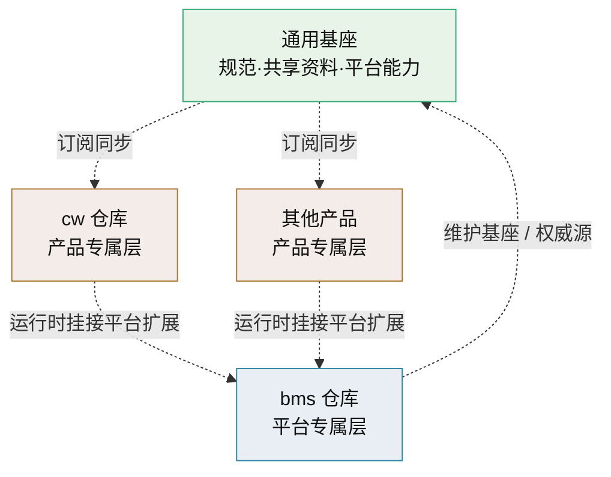

# 平台可扩展性规划

> BMS 平台支撑独立产品（如 CW 创作系统）复用与扩展的三层模型与落地路线

[文档首页](../文档首页.md) › 规划 › 平台可扩展性规划　|　[同级：项目规划说明 →](项目规划说明.md)

## 1. 背景与问题 <a id="background"></a>

BMS 规划之初定位为「基础管理系统」，但对**在其之上孵化独立项目**的可扩展性考虑不足。当要在 BMS 基础上开发 CW 创作系统（独立项目、复用 BMS 能力）时，暴露出文档与代码两个层面的障碍。

### 1.1 文档体系单体专属，无法复制扩展 <a id="bg-doc"></a>

- **规范文档虽通用但带 BMS 专属措辞**：[《文档生成规范》](../规范/文档生成规范.md)、《[命名规范](../规范/命名规范.md)》等 19 篇规范均为 BMS 视角编写（如命名规范写死「仓库与根目录：`bms`」），CW 复制后仍需逐篇人工改编，两仓库随后各自漂移。
- **设计体系整体专属**：架构设计（01-31）、概要设计（01-38）、布局/原型/数据库体系编号全局连续、内容围绕 BMS 系统（租户、RBAC、收付款、采购）展开，无法作为「骨架模板」抽取复用。
- **规划文档无立项模板**：[《项目规划说明》](项目规划说明.md)等规划围绕 BMS 技术栈与模块定义，CW 想建立自己的规划无从下手。
- **共享基础设施资料无同步机制**：开发服务器/开发机/AI/工具等部署资料是跨项目共享资产，CW 已复制，但 BMS 后续更新两边互不感知。

### 1.2 代码扩展只覆盖两条路 <a id="bg-code"></a>

[《项目规划说明》](项目规划说明.md)第 23 节（附加业务模块规划）给出两条追加路径：

| 路径 | 形态 | 适用场景 |
| --- | --- | --- |
| 内置模块 | monorepo 内新增，随 BMS 主版本发版 | 采购、销售、仓储等与平台深度绑定的业务 |
| 独立服务 | 独立部署，经 /api/open 与 OIDC IdP 集成 | 大型独立系统、强隔离、异构技术栈 |

两条路都**缺失**中间形态：一个项目要**独立仓库、独立演进，但运行时高度复用平台能力**（认证、权限、文件、工作流、审计等），CW 就是典型需求。

### 1.3 需求定义 <a id="bg-need"></a>

- 文档：把跨项目共享的文档资产抽成**通用基座**，BMS、CW 等产品引用基座、只维护自己的专属部分；新产品可低成本初始化。
- 代码：明确 BMS 作为**平台**向产品暴露的可复用能力边界，以及产品以何种形态「挂进平台」运行，补上第三条路。
- 目标项目：CW 创作系统——独立仓库、独立演进，运行时作为 BMS 平台扩展复用平台基础能力，自身只做创作业务域。

## 2. 目标与原则 <a id="goals"></a>

### 2.1 目标 <a id="goals-list"></a>

1. **文档可复制可扩展**：新产品在基座上初始化时「复制即用、增量扩展」，不必逐篇改编，也不担心基座漂移。
2. **代码可复用边界清晰**：BMS 平台的认证/权限/文件/通知/工作流/审计等能力以声明的方式供产品复用，产品不复制平台代码。
3. **产品独立演进**：CW 独立仓库、独立发版节奏，升级 BMS 平台不阻塞 CW 迭代，反之亦然。
4. **规模可控**：沿用「单体 + 模块 + 独立 worker」路线，不因扩展需求引入微服务（延续《项目规划说明》第 24 节「明确不采用」口径）。

### 2.2 设计原则 <a id="principles"></a>

- **基座唯一权威源**：通用基座文档只在 BMS 仓库演进，产品侧以同步刷新方式订阅，不 fork 二次维护。
- **中性措辞**：基座文档只描述通用方法与共享基础设施，不写某项目专属事实；项目专属细节落到「平台专属层」或「产品专属层」。
- **扩展点显式化**：产品挂接平台必须走登记机制（模块/表前缀/错误码段/事件域等注册），冲突在启动与 CI 阶段被拒绝。
- **先文档后代码**：文档体系机制先行落地（CW 的文档扩展立刻受益）；代码扩展点随 BMS 进入架构/开发阶段再实现。

## 3. 总体模型：平台 + 多产品三层分层 <a id="model"></a>

统一的**三层分层**同时作用于文档与代码：

| 层 | 定义 | 文档内容 | 代码内容 | 托管与演进 |
| --- | --- | --- | --- | --- |
| **通用基座** | 跨项目共享的规范与基础设施 | 规范 19 篇、共享基础设施资料（开发服务器/开发机/工具/AI/知识档案）、用户文档（凭据模板）、资源 | BMS 平台的通用能力组件（认证/权限/文件/通知/工作流/审计/报表/事件/任务/i18n/开放接口/租户路由等），以「平台能力」形式提供 | 由 BMS 维护（权威源），产品订阅同步 |
| **平台专属** | BMS 平台自身 | 规划（总体/项目规划说明/开发部署规划/本规划）、项目基线、设计体系、平台专属资料 | BMS 平台管理端与自带业务模块（采购/收付款/供应商） | 随 BMS 仓库演进 |
| **产品专属** | 各独立产品 | 各产品的规划/项目基线/设计/专属资料（如 CW 的 ComfyUI 工作流、词库、模型选型、创作管线设计） | 各产品业务域代码（如 CW 创作域），部署为平台扩展 | 各产品独立仓库 |



### 3.1 判定规则 <a id="model-rule"></a>

判断一段内容（文档或代码）属于哪一层：

1. 内容只在本产品内有效（产品业务、产品专属工具）→ **产品专属**。
2. 内容描述 BMS 平台本身（平台架构、平台管理功能、平台自带的采购/收付款等）→ **平台专属**。
3. 内容对任意基于平台的产品都适用（规范方法论、共享基础设施、平台通用能力）→ **通用基座**。

## 4. 文档体系设计 <a id="doc-design"></a>

### 4.1 目录归属映射 <a id="doc-map"></a>

BMS 仓库文档目录（现状）与层级的对应：

```text
bms/文档/
├── 规范/              # 通用基座（19 篇，随 bms 演进）
├── 资料/              # 部分属基座、部分属平台/产品专属
│   ├── 开发服务器/     # 基座（mjbk/mjw 共享基础设施）
│   ├── 开发机/         # 基座通用部分（git/opencode/防火墙等）；平台专属部分（BMS 接入记录）标注
│   ├── 工具/          # 基座（通用工具链，如 bg/reorder-design）
│   ├── AI/            # 基座（graphify/llamacpp/dsh/LM Studio 等）
│   └── 知识档案/       # 基座（技术栈知识顾问）
├── 规划/              # 平台专属（总体规划/项目规划说明/开发部署规划/本规划）
├── 项目/              # 平台专属（阶段需求/任务/计划基线）
├── 设计/              # 平台专属（架构/概要/布局/原型/数据库）
├── 用户文档/           # 基座模板（本地资源凭据，各仓库自带副本，gitignore）
└── 资源/              # 基座（公共样式、mermaid 资产）
```

产品仓库（如 CW）目标文档结构：

```text
cw/文档/
├── 文档首页.md         # 产品导航（产品专属）
├── 规范/              # 通用基座（源自 bms，同步刷新）
├── 资料/              # 基座（源自 bms 同步）+ 产品专属（ComfyUI 工作流/模型选型/词库/实验记录）
├── 规划/              # 产品专属（cw 项目规划，待建）
├── 项目/              # 产品专属（需求/任务/计划基线）
├── 设计/              # 产品专属（创作体系设计，取代现在孤立的「插件」子目录）
├── 用户文档/           # 凭据副本（gitignore）
└── 资源/              # 基座（公共样式，源自 bms 同步）
```

### 4.2 通用基座中性化改造 <a id="doc-neutral"></a>

基座文档（以 bms 仓库内为权威源）需消除平台专属措辞，让产品原样复用：

| 改造项 | 现状示例 | 目标写法 |
| --- | --- | --- |
| 项目称谓 | 「BMS 项目」 | 「{项目}项目」或「本平台」「本项目」 |
| 仓库/根目录 | 「仓库与根目录：`bms`」 | 「仓库与根目录：`{项目名}`（平台仓库为 `bms`）」 |
| 平台专属事实 | monorepo 目录布局、`sys_` 前缀、租户概念 | 从基座抽离到平台专属文档，或标注为「平台示例」 |
| 共享对象的可选性 | 某些规范条目仅 BMS 适用 | 标注「仅平台适用」或用「如适用」限定 |

> 具体落点逐篇标注在落地阶段的改造清单中（见下文 6 节 R1），不在此逐一展开。

### 4.3 基座同步机制 <a id="doc-sync"></a>

- **权威源**：通用基座文档在 bms 仓库维护（bms 即平台，天然承担基座职责）。
- **同步清单 + 脚本**：在 bms 建立《基座文档清单》（列出基座目录与文件的权威清单），配套 `scripts/tools/base-sync/` 同步脚本：按清单比较 bms 与产品仓库的差异 → 输出变更明细 → 人工确认后覆盖。**不引入 git submodule**（单人开发、避免耦合复杂度），用「清单 + 脚本 + 人工确认」。
- **变更提示**：bms 提交涉及基座路径（`文档/规范/`、`文档/资料/` 基础设施部分、`文档/资源/`）时，提交信息与 AGENTS 提示「基座变更，产品仓库需同步」；产品侧运行同步脚本刷新。
- **首次同步**：cw 已人工复制的规范/资料作为基准，切到权威源后由同步脚本接管。

### 4.4 新产品文档初始化流程 <a id="doc-init"></a>

新产品的文档初始化按以下流程（以 cw 为样本验证可行性）：

1. **取基座**：从 bms 获取同步清单与脚本，拉取规范/共享资料/公共资源到产品仓库。
2. **建产品骨架**：创建 README、AGENTS、文档首页、产品目录骨架（规划/项目/设计/资料/用户文档/资源）。
3. **立产品规划**：参照 [《项目规划说明》](项目规划说明.md) 的章节结构组织产品自己的《XX项目规划》，聚焦产品业务；平台能力不重复设计，引用本规划与 bms 架构文档。
4. **建产品设计**：按《文档生成规范》第 8 节「总纲 + 节点」建立产品设计体系（如 cw 的创作体系架构/概要），编号独立于 bms 从 01 起。
5. **登记与图谱**：登记产品文档首页，运行 `graphify update .` 纳入产品图谱。

> 产品设计体系（架构/概要/布局/原型）与 bms 同构但独立编号、独立内容，二者通过指向平台设计文档的链接衔接，不复制平台设计。

### 4.5 产品专属文档约定 <a id="doc-product"></a>

- 产品文档遵循同一套通用规范（基座），命名、格式、图形画法一致。
- 产品专属表前缀/模块简称等标识符按《[命名规范](../规范/命名规范.md)》与[《英文简称规范》](../规范/英文简称规范.md)申请（如 cw 模块 `cw_`），与平台注册表查重防冲突。
- 产品文档首页与 README 指引「平台相关机制见 BMS《平台可扩展性规划》与 bms 架构设计」以交叉链接。

## 5. 代码复用能力边界 <a id="code-design"></a>

### 5.1 平台能力清单 <a id="code-cap"></a>

BMS 作为平台暴露的通用能力（产品通过既有 API/机制复用，不复制实现）：

| 能力 | 说明 | 产品接入方式 |
| --- | --- | --- |
| 认证与会话 | 本地 + SSO（OIDC IdP、JIT 建号）、双 token、会话管理 | 产品用户以平台 SSO 登入，免自建认证 |
| 用户与组织架构 | 部门/岗位/用户/角色 | 复用平台用户体系，产品侧做绑定展示 |
| RBAC 权限 | 菜单/表单/按钮/字段权限、动作级数据范围、动态菜单 | 产品注册菜单/表单/业务码/动作码即得权限 | 
| 多租户隔离 | 租户独立库路由 | 产品业务数据落租户库，天然隔离 |
| 文件管理 | 分片上传/断点续传/在线预览/预签名下载 | 复用 /api/v1 文件接口与 MinIO 存储 |
| 消息通知 | 站内信/邮件/短信/公告、Socket.IO 待办推送 | 复用通知中心与推送链路 |
| 工作流 | BPMN 建模与执行、会签/或签、待办/已办 | 产品单据挂流程定义即得审批链 |
| 报表与大屏 | 数据集管理、ECharts 报表设计器、大屏 | 产品数据集挂接平台报表能力 |
| 审计合规 | 操作/登录/字段级审计、哈希链防篡改、三权分立 | 对平台开放的能力自动纳入审计 |
| 国际化 | 文案入库、i18n 附表、动态语言 | 产品文案入 sys_i18n_message 免发版 |
| 任务调度 | 定时任务入库、Celery beat | 产品任务注册到平台调度器 |
| 事件总线 | RocketMQ 事件、Webhook 订阅 | 产品注册事件域、订阅/发布事件 |
| 开放接口 | /api/open、OAuth2 Client Credentials | 第三方与外部系统接入统一走平台开放接口 |

### 5.2 产品扩展接入形态（第三条路） <a id="code-shape"></a>

在[《项目规划说明》](项目规划说明.md)第 23 节两条路径之外新增「**平台扩展**」，作为 CW 采用的第三条路：

| 维度 | 说明 |
| --- | --- |
| 仓库与版本 | 产品独立 git 仓库、独立分支与发版节奏，不与 BMS 主版本绑定 |
| 前端挂接 | 产品前端模块源码由产物构建期合并进 BMS 前端应用；菜单/表单/按钮/字段走平台注册，动态路由生效，前端无需随 BMS 发版 |
| 后端挂接 | 保持「单体模块化 + 独立 worker」原则（不引入微服务）：产品业务以扩展包方式并入 BMS backend 同一进程，经产品注册表挂载路由/模型/任务/事件；产品代码独立演进、随平台构建发布 |
| 数据边界 | 产品业务表用产品前缀（如 `cw_`）落租户库，遵守[《数据架构》](../设计/架构设计/05_架构设计_数据架构.md)数据规范；跨库引用走逻辑外键 |
| 注册要素 | 在平台登记表前缀/业务码/错误码段/事件域/前端包来源（扩展 `sys_module` 机制或新增产品级注册表），启动与 CI 校验唯一 |
| 权限与审计 | 复用 RBAC 与审计，产品自身不重复实现 |

### 5.3 需要 BMS 后续补齐的扩展点 <a id="code-evolve"></a>

以下机制在 BMS 进入架构/开发阶段时落地（本规划定方向，不替代架构设计）：

1. **产品注册机制**：`sys_module` 或新增 `sys_product` 支持产品级注册（表前缀/错误码段/事件域/前端包来源）。
2. **错误码段扩展**：既有附加段（10xxxx 起）继续顺延分配，cw 等产品按注册段使用。
3. **前端多包合并**：BMS 前端构建流水线支持从产品仓库拉取模块产物合并发布，兼顾独立仓库与运行时合并。
4. **后端扩展包加载**：backend 支持产品扩展包加载（路由/模型/任务/事件注册），进程内插件化但非微服务。
5. **契约稳定化**：产品对平台的依赖只允许走 /api/v1 平台接口与公开事件，禁止直连平台内部表，平台内部重构不破坏产品。

### 5.4 三条路径的取舍 <a id="code-choice"></a>

| 路径 | 代码所有权 | 演进节奏 | 平台复用度 | 适用场景 |
| --- | --- | --- | --- | --- |
| 内置模块 | BMS | 随 BMS 主版本 | 最高 | 平台自带业务、轻量模块 |
| 平台扩展（新增，CW 采用） | 产品独立仓库 | 产品独立 | 高 | 独立项目、高度复用平台、独立演进 |
| 独立服务 | 产品独立 | 完全独立 | 低（API/IdP） | 强隔离、异构技术栈、外部团队 |

## 6. 落地路线图 <a id="roadmap"></a>

| 步骤 | 内容 | 完成标准 | 责任仓库 |
| --- | --- | --- | --- |
| R1 基座中性化 | 逐篇改造 bms 规范与共享资料的专项措辞，生成《基座文档清单》 | 基座文档无 bms 专属硬编码；清单收录全部基座文件 | bms |
| R2 基座同步机制 | `scripts/tools/base-sync/` 同步脚本 + 变更提示约定；cw 切到权威源完成首次同步 | 运行脚本可输出差异并刷新 cw 侧基座 | bms（cw 侧执行） |
| R3 cw 立项 | 按 4.4 初始化流程建 cw 规划/项目/设计骨架与《cw 项目规划》 | cw 文档可在基座上增量扩展 | cw |
| R4 平台扩展机制 | BMS 进入开发阶段时实现 5.3 各扩展点，随架构设计与阶段一完成标准落地 | 产品注册/前端合并/后端扩展加载可用 | bms |
| R5 机制推广 | 后续新产品复用同一流程，白皮书沉淀为《产品接入指南》 | 第二条产品初始化全流程通过 | bms |

> R1-R3 属文档层，可立即推进（cw 文档扩展立刻受益）；R4 属代码层，随 BMS 开发阶段推进；R5 为后续产品预留。

## 7. 风险与对策 <a id="risk"></a>

| 风险 | 影响 | 概率 | 缓解措施 |
| --- | --- | --- | --- |
| 中性化改造牵动 bms 现有文档，改动量大 | 中 | 中 | 逐篇小批量提交；仅改措辞不动结构；git 保留历史 |
| 双仓库基座二次漂移 | 高 | 中 | 基座清单 + 同步脚本 + 提交信息/AGENTS 变更提示 |
| 平台扩展机制复杂度上升（与「不采用微服务」冲突的担忧） | 中 | 中 | 明确机制是「进程内扩展包 + 构建期合并」，非服务拆分；能力边界以 5.1 清单收敛 |
| cw 正式开发时机不确定，机制过早实现 | 低 | 中 | 文档层（R1-R3）先行；代码层（R4）跟随 BMS 开发节奏自然落地 |
| 产品间标识符/错误码段/事件域冲突 | 高 | 低 | 注册表启动与 CI 唯一性校验（沿用阶段一基础能力），本规划 R4 落实产品级注册 |

## 8. 影响文档与后续修订 <a id="impact"></a>

- **[《项目规划说明》](项目规划说明.md)**：第 23 节增加「平台扩展（独立产品）」路径说明，使之与本文档一致；错误码段分配表补充产品段。
- **[《命名规范》](../规范/命名规范.md)**：第 3 节仓库名与根目录改为中性表述，平台示例保留。
- **[《文档首页》](../文档首页.md)**：登记本规划；后续产品仓库文档首页与 BMS 首页做交叉链接。
- **《英文简称规范》**：补充产品级形前缀（如 `cw`）登记口径。
- **cw 仓库**：AGENTS/文档首页按基座同步机制更新，文档结构按第 4.1 节对齐。

> 本文档为规划类文档，机制方向一经评审即定稿；具体实现（注册表字段、构建合并流水线等）在 BMS 架构设计中细化 · 依《文档生成规范》编写