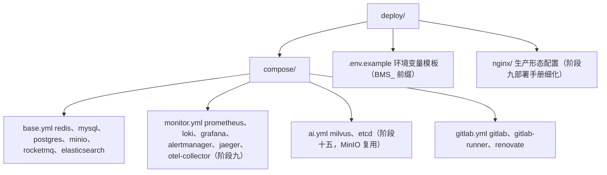

# 开发部署规划

> BMS 开发环境部署方案 · 两台机器分工

[文档首页](../文档首页.md) › [规划](项目规划说明.md) › 开发部署规划　|　[同级：项目规划说明 →](项目规划说明.md)

## 1. 目的与依据 <a id="purpose"></a>

本文档规划 BMS 项目开发环境的整体部署方案：在《[本地资源](../用户文档/本地资源.md)》记载的两台机器上（开发服务器 **mjbk** 已装 Ubuntu 24.04.4 LTS 桌面版，开发机 mjpc 为 Windows 11），搭建可支撑《[项目规划说明](项目规划说明.md)》全部 15 个开发阶段、直至 MVP 验收（含 500 并发压测）的完整开发环境，包括代码托管与 CI/CD、开发依赖服务、常驻数据库、监控与备份。

依据与约束：

- 《项目规划说明》「环境与配置」「部署与运维」「开发计划与验收标准」各节的技术选型与阶段划分
- 《[架构设计-部署与运维](../设计/架构设计/30_架构设计_部署与运维.md)》的部署拓扑与集群设计要点
- 《[命名规范](../规范/命名规范.md)》对基础设施命名（Compose 服务名、环境变量、数据库、容器镜像）的约定
- 《[文档生成规范](../规范/文档生成规范.md)》对文档格式与布局的要求

本文档为规划性质，确定方案、目录、端口与落地节奏；命令级细节（Compose 文件内容、环境变量清单、备份恢复演练步骤）由阶段九交付的《部署手册》细化。

**取值说明**：本文档中的 `<mjbk-IP>` / `<mjpc-IP>` / `<内网网段>` / `<SSH账号>` 等占位符对应的具体值见《[本地资源](../用户文档/本地资源.md)》与 mjbk 本机 `deploy/.env`（键 `MJBK_IP` / `MJBK_SSH_USER`），不在仓库文档中记录。

## 2. 环境总览与职责分工 <a id="overview"></a>

### 2.1 硬件资源 <a id="hardware"></a>

| 项目 | mjbk（开发服务器） | mjpc（开发机） |
| --- | --- | --- |
| IP 地址 | `<mjbk-IP>` | `<mjpc-IP>` |
| 操作系统 | Ubuntu 24.04.4 LTS（桌面版） | Windows 11 专业版 |
| 处理器 | i7-8750H，6 核 12 线程 | i7-13700K，16 核 24 线程 |
| 内存 | 32 GB | 64 GB |
| 硬盘 | 512 GB SSD（`/`）+ 1 TB HDD（`/mnt/data`，ext4）+ 2 TB NVMe SSD（`/mnt/ssd2t`，ext4） | C 512 GB SSD + D 4 TB SSD |

### 2.2 职责分工 <a id="duty"></a>

采用「一台常开服务器承载全部服务、一台高性能开发机纯本地开发」的模式：

| 职责 | mjbk | mjpc |
| --- | --- | --- |
| 代码托管与 CI/CD | GitLab CE（HTTP 8080 + Registry 5050）、gitlab-runner（Docker executor） | git 客户端，推送与 MR |
| 开发依赖服务 | Redis、RocketMQ、MinIO、ElasticSearch（按阶段引入，见第 10 节） | 不装原生服务，内网访问 mjbk |
| 常驻数据库 | MySQL 8 + PostgreSQL 16 + 达梦 DM8（开发联调与 CI 三库测试共用） | 日常开发默认 SQLite（本地零依赖） |
| 测试基础设施 | Kiwi TCMS（测试用例唯一用例库，复用 MySQL，宿主端口 8060） | 浏览器访问用例库与执行记录 |
| 项目管理 | 文档体系（需求/任务/计划三类文档，见《项目管理规范》） | 编辑文档管理进度 |
| 监控与追踪（阶段九） | Prometheus、Loki、Grafana、Alertmanager、Jaeger、otel-collector | 浏览器查看 Grafana / Jaeger |
| AI 基础设施（阶段十五） | Milvus + etcd（MinIO 复用），PaddleOCR 可选 | — |
| 日常开发 | — | 编辑代码、uv 后端开发服务器、Vite 前端开发服务器、本地 SQLite、压测客户端（阶段十） |

> 选择依据：mjbk 定位常开服务器（GitLab CE 要求内存 ≥4GB，32GB 总量够用）；mjpc 硬件更强（16 核 / 64GB / 4T SSD），适合承担编译、前端构建、压测等计算密集工作。mjpc 关机不影响 mjbk 上共享服务与 CI 的持续运行。

### 2.3 网络拓扑 <a id="topology"></a>

- 两台机器同处 `<内网网段>` 内网网段，直连互访，无需域名与证书。
- 开发期租户识别不启用子域名（《项目规划说明》已定：dev 环境以 token 内租户标识替代子域名），因此不需要泛域名 DNS 与泛 TLS 证书。
- mjpc 后端/前端开发服务器指向 mjbk 的 `<mjbk-IP>` 各服务端口；mjbk 上 ufw 防火墙按第 4.6 节放行。
- mjbk 需可访问外网（下载容器镜像、GitLab 向 GitHub 的 push mirror 同步、Renovate 拉取依赖更新）；不可达时镜像同步与依赖升级暂缓，见第 11 节。

## 3. 关键决策记录 <a id="decision"></a>

以下决策已逐项与项目方确认，作为本方案的实施依据：

| 决策点 | 选择 | 理由 |
| --- | --- | --- |
| 机器职责分工 | mjbk 跑全部服务（GitLab + CI + 基础设施全家桶），mjpc 纯开发机 | 共享服务常开不中断，开发机专注编码，互不抢占资源 |
| 容器引擎 | Docker Engine（apt 清华 docker-ce 源直装） | Linux 原生标准方案，docker / docker compose 行为与生产一致；系统已换装 Ubuntu，Rancher Desktop（Windows/WSL2 方案）不再适用 |
| 开发期数据库 | dev 默认 SQLite（零部署）；mjbk 常驻 MySQL 8 + PostgreSQL 16 + 达梦 DM8（官方镜像）供联调 | 日常开发零数据库依赖；方言问题尽早暴露，CI 三库测试复用常驻库 |
| 数据落盘 | IO 敏感数据与 Docker 镜像走 SSD（默认 `/var/lib/docker` 命名卷）；大容量数据走 HDD `/mnt/data`（GitLab 数据、备份） | SSD 512GB 装镜像与数据库绰绰有余；HDD 1TB 承接仓库与备份等读多写少数据 |
| 磁盘扩容（2T SSD） | Docker data-root 迁移至 `/mnt/ssd2t/docker`（镜像/容器/命名卷全部上 NVMe）；GitLab 数据迁至 `/mnt/ssd2t/gitlab`；HDD 仅承接备份与 Timeshift 快照 | 2T NVMe 性能与容量最优，数据库/ES/GitLab 仓库等 IO 敏感数据集中其上；备份与数据异盘存放，单盘故障可恢复 |
| 开发机开发方式 | mjpc 本地开发 + 内网访问 mjbk 服务 | 开发机性能强、与运行环境分离；代码经 git push 上 mjbk GitLab 触发 CI |
| gitlab-runner 安装方式 | 容器化运行（gitlab/gitlab-runner 镜像，挂载 docker.sock，executor=docker） | 官方推荐做法，升级简单、行为跨平台一致 |
| CI 三库方言测试 | 复用 mjbk 常驻 MySQL/PostgreSQL/达梦 DM8，job 内建独立测试库（bms_test 前缀）执行迁移与集成测试后清理 | 免去每次 job 拉镜像起容器，速度快、省资源；测试库隔离不污染开发数据 |
| 测试用例管理平台 | Kiwi TCMS（mjbk Docker Compose 常驻，复用 mjbk MySQL，宿主端口 8060） | 唯一用例库：手工与自动化用例统一登记、执行结果导入归档；轻量 Python 栈，pytest 官方插件结果回流；GPL 许可仅作测试基础设施、不随产品交付 |
| 项目管理平台 | 文档体系（需求/任务/计划三类文档，见《[项目管理规范](../规范/项目管理规范.md)》） | 个人开发期以文档为唯一事实源：需求/任务/计划按阶段编写、维护状态与进度；平台工具（如项目管理平台）待项目扩大后按需再引入 |
| GitLab 端口 | HTTP 8080（容器内 80 映射）+ Registry 5050；SSH 2222（容器内 22） | 系统 SSH 已占用宿主 22 端口，GitLab SSH 映射 2222；内网开发无标准端口诉求 |

## 4. 开发服务器 mjbk 部署 <a id="server"></a>

### 4.1 基础环境准备 <a id="server-base"></a>

mjbk 已完成系统层准备：Ubuntu 24.04.4 LTS（桌面版）、静态 IP `<mjbk-IP>/24`、SSH 免密（mjpc 公钥）、apt 清华源、数据盘 `/mnt/data`（HDD，ext4，fstab 自动挂载）、2T NVMe SSD `/mnt/ssd2t`（ext4，fstab 自动挂载）、Timeshift 系统快照（见《[Ubuntu安装部署使用说明](../资料/工具/Ubuntu安装部署使用说明.md)》第 7 节）。本节点安装容器引擎：

1. **添加清华 docker-ce 源**并安装 Docker Engine：

```bash
sudo apt install -y ca-certificates curl
sudo install -m 0755 -d /etc/apt/keyrings
curl -fsSL https://mirrors.tuna.tsinghua.edu.cn/docker-ce/linux/ubuntu/gpg | sudo tee /etc/apt/keyrings/docker.asc > /dev/null
echo "deb [arch=$(dpkg --print-architecture) signed-by=/etc/apt/keyrings/docker.asc] https://mirrors.tuna.tsinghua.edu.cn/docker-ce/linux/ubuntu noble stable" | sudo tee /etc/apt/sources.list.d/docker.list
sudo apt update
sudo apt install -y docker-ce docker-ce-cli containerd.io docker-buildx-plugin docker-compose-plugin
```

2. **开机自启**：Docker 服务由 systemd 管理，确认开机自启并立即启动：

```bash
sudo systemctl enable --now docker
```

3. **镜像加速**：配置国内镜像加速器（拉取官方镜像更快），写入 `/etc/docker/daemon.json` 后重启 docker：

```bash
sudo mkdir -p /etc/docker
echo '{ "registry-mirrors": ["https://docker.m.daocloud.io"] }' | sudo tee /etc/docker/daemon.json
sudo systemctl restart docker
```

4. **验证**：

```bash
docker info
docker compose version
```

5. **docker 用户组**（可选）：当前用户免 sudo 执行 docker：

```bash
sudo usermod -aG docker <SSH账号>
```

> 镜像与容器数据默认存 2T NVMe SSD（`/mnt/ssd2t/docker`，data-root 已迁移，见 4.2）；GitLab 等大容量数据 bind mount 指向 `/mnt/ssd2t/gitlab`（见 4.2、4.5）。

### 4.2 磁盘规划 <a id="server-disk"></a>

| 盘 | 容量 | 存放内容 | 目录约定 |
| --- | --- | --- | --- |
| 系统盘 SSD（挂载 `/`） | 512 GB | Ubuntu 系统 + Docker Engine 本体；Docker 运行数据已迁走，当前仅用约 40 GB，余量充足 | — |
| NVMe SSD（挂载 `/mnt/ssd2t`，ext4） | 2 TB | Docker 运行数据（镜像、容器层、全部命名卷——MySQL / PostgreSQL / 达梦 DM8 / ES / MinIO / Redis / RocketMQ / Milvus 等 IO 敏感数据）；GitLab 数据（仓库、配置） | `/mnt/ssd2t/docker`（Docker data-root，`daemon.json` 指定）<br>`/mnt/ssd2t/gitlab`（gitlab 数据卷 bind mount） |
| HDD（挂载 `/mnt/data`，ext4） | 1 TB | 开发服务器备份产物、Timeshift 系统快照（读多写少，机械盘胜任） | `/mnt/data/backup`（备份，见第 8 节）<br>`/mnt/data/timeshift`（系统快照，Timeshift 默认位置） |

> Docker data-root 迁移前须先清空并停用 Docker（`systemctl stop docker` 后迁移 `/var/lib/docker`，再在 `/etc/docker/daemon.json` 写入 `"data-root": "/mnt/ssd2t/docker"` 并重启）；迁移后原 `/var/lib/docker` 留空作为备份，验证无误后可释放。数据（NVMe）与备份（HDD）异盘存放，单盘故障可恢复。

### 4.3 基础设施服务 <a id="server-services"></a>

Compose 编排文件统一放在仓库 `deploy/` 目录（与《项目规划说明》目录结构一致，随代码版本管理）：



mjbk 上启动（以 base 组为例）：

```bash
docker compose -f deploy/compose/base.yml --env-file deploy/.env up -d
```

服务清单（服务名遵循《命名规范》第 10 节「Compose 服务名小写单名、与组件同名」）：

| 服务 | 镜像 | 端口 | 数据位置 | 内存预算 | 引入阶段 |
| --- | --- | --- | --- | --- | --- |
| redis | redis:8 | 6379 | 命名卷（NVMe SSD） | 0.5 GB | 阶段一 |
| mysql | mysql:8.4 | 3306 | 命名卷（NVMe SSD） | 1.5 GB | 阶段一 |
| postgres | postgres:16 | 5432 | 命名卷（NVMe SSD） | 1 GB | 阶段一 |
| dameng | dmdbms/dm8（官方镜像，含试用授权） | 5236 | 命名卷（NVMe SSD） | 2 GB | 阶段一 |
| minio | minio/minio | 9000 / 9001（控制台） | 命名卷（NVMe SSD） | 0.5 GB | 阶段一 |
| rocketmq | apache/rocketmq:5.x（nameserver + broker 两个容器） | 9876 / 10911 | 命名卷（NVMe SSD） | 1 GB | 阶段四 |
| elasticsearch | docker.elastic.co/elasticsearch/elasticsearch:8.x（single-node） | 9200 / 9300 | 命名卷（NVMe SSD） | 2 GB（堆 1–2 GB） | 阶段十四（可提前） |
| prometheus | prom/prometheus | 9090 | 命名卷 | 2.5 GB（合计） | 阶段九 |
| loki / grafana / alertmanager | grafana/loki、grafana/grafana、prom/alertmanager | 3100 / 3000 / 9093 | 命名卷 | 2.5 GB（合计） | 阶段九 |
| jaeger / otel-collector | jaegertracing/all-in-one、otel/opentelemetry-collector | 16686 / 4317、4318 | — | 1 GB | 阶段九 |
| milvus / etcd | milvusdb/milvus、quay.io/coreos/etcd | 19530 / 2379（内部） | 命名卷（NVMe SSD） | 4 GB | 阶段十五 |

> ES 按《项目规划说明》「环境与配置」节属开发环境依赖，阶段一即可随 base 组拉起（单节点、`discovery.type=single-node`、生产安全认证配置不启用），也可推迟至阶段十四按需引入；上表按内存预算给出两种节奏，见第 10 节。

内存合计：阶段一约 8 GB，阶段九后约 15 GB，阶段十五后约 19 GB；叠加 GitLab（4 GB）与 Ubuntu 桌面 + Docker 开销（约 5 GB），峰值约 28 GB，32 GB 预算内留有余量，部署后监控实际占用并按第 11 节调优。

### 4.4 常驻数据库 <a id="server-db"></a>

- MySQL 8、PostgreSQL 16 与达梦 DM8 三库常驻 mjbk，供开发联调与 CI 三库方言集成测试共用（决策 3、决策 7）。达梦用官方镜像 `dmdbms/dm8`（含试用授权，商业交付需采购商业许可）。
- 日常开发仍以本地 SQLite 为主（零部署）；需要验证方言行为时，后端以环境变量覆盖数据源连接指向 mjbk 三库。
- 库名遵循《命名规范》第 7 节环境库约定与多租户库划分（达梦以模式 schema 承载库语义）：

| 用途 | MySQL / PostgreSQL / 达梦库名 | 说明 |
| --- | --- | --- |
| 开发联调 | `bms_dev`（平台库 + 租户库模拟可再建 `bms_platform`、`bms_tenant_*`、`bms_archive`） | 开发期按需创建，模拟多数据源拓扑 |
| CI 集成测试 | `bms_test` 前缀（job 内建库 → 迁移 → 测试 → 删库） | 每次 job 独立、互不污染，与开发数据隔离 |

- 账号与密码只写入 `deploy/.env`（不入库、不入镜像、不写入本文档），详见第 6 节。
- 三库均开启慢查询日志（开发联调排查用）；MySQL 字符集 `utf8mb4`、PostgreSQL 与达梦 `UTF8`（规划「数据规范」节约定）。
- 达梦 Python 驱动 dmPython 为官方同步驱动（dialect `dm+dmPython`），对 Python 3.14 兼容性未知，纳入阶段一逐依赖验证，不兼容则按规划口径整体回退 Python 3.13。

### 4.5 GitLab 与 CI 基础设施 <a id="server-gitlab"></a>

1. **GitLab CE 容器**（`deploy/compose/gitlab.yml`）：
   - 镜像 `gitlab/gitlab-ce`，端口映射 HTTP 8080（容器内 80）、Registry 5050；SSH 22 映射宿主机 2222（系统 SSH 已占用宿主 22）。
   - 数据目录 bind mount `/mnt/ssd2t/gitlab`（配置、仓库数据、备份），NVMe SSD 上仓库读写更快，且不占系统盘空间。
   - 首次访问 `http://<mjbk-IP>:8080` 设置 root 密码；访问地址需写入容器 `external_url` 配置，否则 GitLab 生成的仓库/克隆 URL 不正确。
   - GitLab 内存 ≥ 4GB 预算（《项目规划说明》要求），mjbk 32GB 满足。
2. **gitlab-runner 容器**（同文件）：
   - 镜像 `gitlab/gitlab-runner`，挂载宿主机 docker.sock 供 executor=docker 使用。
   - 注册命令（token 在 GitLab 管理界面生成）：

```bash
docker exec -it gitlab-runner gitlab-runner register \
  --url http://<mjbk-IP>:8080 \
  --token <runner-registration-token> \
  --executor docker \
  --docker-image python:3.14-slim \
  --docker-volumes /var/run/docker.sock:/var/run/docker.sock \
  --tag-list bms,docker
```

   - runner 并发限制：mjbk 为 6 核 12 线程，注册后设置并发上限（config.toml 中 `concurrent = 2`），避免 CI 抢占 GitLab 与开发服务的资源。
3. **Renovate**：阶段二起以容器方式随 gitlab.yml 编排，自动提依赖升级 MR；需 mjbk 可访问外网。
4. **GitHub 归档镜像**：GitLab 配置 push mirror 将 main 单向同步至 GitHub 归档仓库；同样依赖外网，不可达时暂缓。

### 4.6 防火墙与访问控制 <a id="server-firewall"></a>

- ufw 仅对 **`<内网网段>` 内网**放行第 9 节端口清单（SSH 22 已在系统安装时放行）：

```bash
sudo ufw allow from <内网网段> to any port 8080,5050,2222,3306,5432,5236,6379,9000,9001,9876,10911,8070,9200,9090,3100,3000,9093,16686,4317,4318 proto tcp
sudo ufw enable
```

- 容器端口映射默认绑定 0.0.0.0，以 ufw 限制来源即可；需外网访问的服务再单独放行。
- 敏感端口（MySQL/PostgreSQL/达梦/Redis）密码强度按第 6 节管理，避免仅靠防火墙单点防护。

## 5. 开发机 mjpc 环境 <a id="devpc"></a>

### 5.1 工具链 <a id="devpc-tools"></a>

| 工具 | 版本 | 说明 |
| --- | --- | --- |
| uv | 最新稳定版 | Python 依赖管理与虚拟环境一体化；`uv python install 3.14` 安装项目固定解释器（`.python-version` 已锁定 3.14） |
| Node.js | ≥ 20.19（`.nvmrc` 锁定） | 用 fnm 或 volta 管理，自动读取 `.nvmrc` 切换版本 |
| VSCode | 最新稳定版 | 扩展：Python、pyright、ruff、Vue-Official（Volar）、ESLint、Prettier |
| Git for Windows | 最新稳定版 | 凭证保存 GitLab HTTP 凭据 |

```bash
uv python install 3.14
fnm install --use-on-cd   # 或 volta install node
```

### 5.2 仓库获取 <a id="devpc-repo"></a>

```bash
git clone http://<mjbk-IP>:8080/bms/bms.git
cd bms
git checkout -b feature/xxx
```

### 5.3 后端开发运行 <a id="devpc-backend"></a>

- 依赖安装与虚拟环境由 uv 管理（`pyproject.toml`），日常命令：

```bash
uv sync                          # 安装依赖
uv run uvicorn app.main:app --reload --port 8000
```

- 数据库：`BMS_ENV=dev` 默认 SQLite（本地文件，多个 SQLite 文件模拟平台库 / 租户库 / 归档库，与规划「多数据源策略」一致）；需要验证 MySQL/PostgreSQL/达梦方言时以环境变量覆盖数据源连接指向 mjbk：

```bash
$env:BMS_DB_URL = "mysql+aiomysql://bms_dev:<password>@<mjbk-IP>:3306/bms_dev"
$env:BMS_DB_URL = "postgresql+psycopg://bms_dev:<password>@<mjbk-IP>:5432/bms_dev"
$env:BMS_DB_URL = "dm+dmPython://bms_dev:<password>@<mjbk-IP>:5236/bms_dev"
```

- 接口调试：FastAPI 自带 Swagger UI（`http://localhost:8000/docs`）。
- 测试：`uv run pytest`（SQLite 库，与 CI 同源）。

### 5.4 前端开发运行 <a id="devpc-frontend"></a>

frontend 与 frontend-mobile 双工程独立，各自安装与启动：

```bash
cd frontend
npm ci
npm run dev            # Vite 开发服务器，默认 5173
```

```bash
cd frontend-mobile
npm ci
npm run dev
```

- 开发服务器跨域由后端 dev 配置放行（规划「环境与配置」节：CORS dev 放行前端开发服务器，生产不开放）。
- 类型契约：后端 OpenAPI 经 openapi-typescript 生成 TS 类型，保持前后端一致。

### 5.5 联调配置 <a id="devpc-integrate"></a>

mjpc 本地后端需要消费 mjbk 共享服务时，通过环境变量覆盖 config.toml（连接地址均为 mjbk 的 `<mjbk-IP>`）：

| 依赖 | 环境变量 | 开发值示例 |
| --- | --- | --- |
| Redis | `BMS_REDIS_URL` | `redis://<mjbk-IP>:6379/0` |
| RocketMQ | `BMS_ROCKETMQ_NAMESERVER` | `<mjbk-IP>:9876` |
| MinIO | `BMS_MINIO_ENDPOINT` 等 | `http://<mjbk-IP>:9000` |
| ElasticSearch | `BMS_ES_URL` | `http://<mjbk-IP>:9200` |
| MySQL / PostgreSQL / 达梦 | `BMS_DB_URL`（按数据源） | 见 5.3 |

> 环境变量名以仓库 config 实现为准，上表为规划口径（均带 `BMS_` 前缀，符合《命名规范》第 10 节）；完整清单随《部署手册》交付。

## 6. 配置与凭据管理 <a id="config"></a>

- 三套环境 dev / test / prod 由 `BMS_ENV` 指定，config.toml 按环境分层 + 环境变量覆盖（《项目规划说明》「环境与配置」节）。
- 仓库只提交 `deploy/.env.example`（键名模板、无真实值）；真实 `deploy/.env` 加入 `.gitignore`，仅存在于 mjbk。
- 密钥类配置（DB/Redis 密码、JWT secret、MinIO 凭据、GitLab token）只走环境变量，不落配置文件、不入库、不入镜像、不写入本文档。
- 机器登录凭据以《[本地资源](../用户文档/本地资源.md)》为准，本文档不重复记载。
- GitLab root 密码、runner 注册 token、数据库账号初始密码在首次部署时生成并记录于 mjbk 本地密码管理器（或仅限本机的密钥文件），不随文档与仓库流转。

## 7. 开发工作流与 CI <a id="workflow"></a>

1. **分支模型**：单人开发期（2026-08-23 起）**直推 main，不走 MR**——尚无基本产品且单人开发，MR 门禁收益为零、流程开销显著；纯文档推送 CI 自动跳过，含代码改动 main 自动跑门禁冒烟。MR 全流程（feature 分支 → MR → 流水线门禁 → Squash 合入）**暂缓至产品成型或多人协作期恢复**（暂缓说明见《[Git协作规范](../规范/Git协作规范.md)》）；届时口径——main 保护分支、核心模块改动提交前 AI 交叉评审、MR 附评审结论（见《[项目规划说明](项目规划说明.md)》「环境与配置」节 git 分支条目）。
2. **分层流水线**（gitlab-runner 在 mjbk 执行；按改动内容与分支分层，避免文档类小改动空耗 CI）：
   - **免跑层**：纯文档/资料推送不建任何流水线（workflow rules 以 changes 排除法判定——paths 仅列代码与基础设施路径，任一命中即建，宁可多跑不可漏跑）；
   - **冒烟层**（含代码改动的 main 直推自动触发）：gate-smoke 门禁冒烟 + 后端 ruff + pytest（SQLite，pytest-cov 覆盖率门禁：核心 ≥ 80%、整体 ≥ 70%）+ 前端 ESLint + Vitest + frontend / frontend-mobile 双端构建——各 job 以 exists 守卫随代码目录落地自动激活；
   - **重验证层**（仅 main）：Playwright E2E（服务容器起 backend（SQLite）与前端产物）、三库方言集成测试（连 mjbk 常驻三库，建 `bms_test` 前缀测试库 → Alembic 迁移 → 集成测试 → 删库清理）、构建 `bms-backend` / `bms-frontend` 镜像推送 Registry（5050）、Trivy 镜像扫描（CVSS ≥ 9 高危阻断发版）、swagger.json 契约快照、Allure 报告归档并导入 Kiwi TCMS；
   - **指令驱动兜底**：web/api 来源始终可显式发起任意分支流水线。
   - 测试失败自动上报：任一自动化测试 job 失败时先导出测试库现场 dump 再清理，调 `scripts/tools/defect/defect_capture.py` 生成 REPRO 复现包（dump + 日志 + repro.json + REPRO.md）并自动建/复用 GitLab Issue；指派修复由 `ai_fix.py`（本地模型优先、云端兜底，bot 提 MR 人工合入）处理，`reproduce.py` 一键复现验证（详见《[测试规范](../规范/测试规范.md)》9 节）
3. **依赖升级**：Renovate 自动提升级 MR（原生支持自托管 GitLab）。
4. **GitHub 归档**：GitLab push mirror 单向同步 main 至 GitHub 只读归档仓库。

## 8. 备份与恢复 <a id="backup"></a>

开发服务器的数据同样需要防丢失（《项目规划说明》「备份与恢复」节针对产品功能，本节约束开发服务器自身运维）：

| 对象 | 策略 | 保留 |
| --- | --- | --- |
| 云容灾 | 每日备份产物 gpg 加密后上传百度网盘 /apps/bms-backup/（backup_daily.sh 总控尾部自动执行，BaiduPCS-Go + 官方客户端凭据）；云端建议保留 30 天，网页端手动清理；详见《[百度网盘云备份部署使用说明](../资料/开发服务器/百度网盘云备份部署使用说明.md)》 | — |
| 系统（装坏还原） | Timeshift 系统快照已部署（每日自动、保留 5 份，存 HDD `/mnt/data/timeshift`），装坏环境用安装 U 盘 `sudo timeshift --restore` 还原，详见《[Ubuntu安装部署使用说明](../资料/工具/Ubuntu安装部署使用说明.md)》第 7 节 | 5 份 |
| MySQL / PostgreSQL / 达梦 | 每日 dump 至 `/mnt/data/backup/{mysql,postgres,dameng}/`（达梦用 dmrman；cron 每日 2 点执行 `scripts/` 目录 shell 脚本） | 7 天 |
| 缺陷现场 dump | 测试失败自动/人工归档至 `/mnt/data/backup/defects/`（《[测试规范](../规范/测试规范.md)》9 节） | 30 天 |
| GitLab | 每日 `gitlab-backup`（容器内命令），备份文件落 `/mnt/data/backup/gitlab/` | 7 天 |
| MinIO / ES 数据 | 开发期数据量小，随 Docker 命名卷所在盘（NVMe SSD `/mnt/ssd2t/docker`）做整机级镜像即可；不单独做增量 | — |
| 恢复演练 | 每季度一次从备份目录恢复验证（与产品「恢复演练登记」流程分开，开发服务器单独登记） | — |

> 开发服务器数据虽非生产数据，但 GitLab 仓库与 CI 记录丢失代价高（代码、MR 历史、镜像）。每日备份脚本在 mjbk 上落地部署时即应就位。数据主体（NVMe SSD `/mnt/ssd2t`）与备份（HDD `/mnt/data/backup`）异盘存放，单盘故障不影响备份恢复。

## 9. 端口与网络规划 <a id="ports"></a>

| 端口 | 服务 | 说明 |
| --- | --- | --- |
| 8080 / 5050 / 2222 | GitLab HTTP / Registry / SSH | 容器内 80 / 5000 / 22 映射；2222 为 GitLab SSH（系统 SSH 占 22） |
| 8060 | Kiwi TCMS | 第一批起（阶段一），容器内 8443（nginx HTTPS 实际服务）；8080 已被 GitLab 占用故映射 8060，仅内网 |
| 3306 / 5432 / 5236 | MySQL 8 / PostgreSQL 16 / 达梦 DM8 | mjbk 常驻，仅内网 |
| 6379 | Redis | 仅内网 |
| 9000 / 9001 | MinIO API / 控制台 | 仅内网 |
| 9876 / 10911 | RocketMQ nameserver / broker | 阶段四起，仅内网 |
| 9200 / 9300 | ElasticSearch HTTP / 节点通信 | 阶段十四起（可提前），仅内网 |
| 9090 / 3100 / 3000 / 9093 | Prometheus / Loki / Grafana / Alertmanager | 阶段九起，仅内网 |
| 16686 / 4317 / 4318 | Jaeger UI / otel-collector OTLP | 阶段九起，仅内网 |
| 19530 | Milvus | 阶段十五起，仅内网 |
| 8000 / 5173 | uvicorn / Vite（mjpc 本地） | 仅本机，不对外放行 |

> 若 mjbk 上某端口已被本机服务占用（如 IIS 占 80、已有 MySQL 占 3306），Compose 映射改端口并同步调整后端配置；上表为默认规划值。

## 10. 分阶段落地计划 <a id="schedule"></a>

与《项目规划说明》「开发计划与验收标准」的阶段对齐，环境按需引入、避免一次性拉满：

| 阶段 | 环境准备动作 | 对应项目阶段 |
| --- | --- | --- |
| 准备期 | mjbk：Ubuntu 基础（静态 IP / 清华源 / SSH 免密 / HDD 挂载 / 2T NVMe SSD 挂载与 Docker data-root 迁移 / Timeshift，均已完成）+ Docker Engine 安装（清华 docker-ce 源）+ 防火墙 ufw；mjpc：uv / Node / VSCode 工具链 | 阶段一前 |
| 第一批 | mjbk：redis、mysql、postgres、dameng、minio 容器 + GitLab CE + gitlab-runner + 仓库初始化 + .gitlab-ci.yml 落地（达梦 dmPython 驱动兼容性同步验证）+ kiwi-tcms（复用 mysql，宿主 8060） | 阶段一 |
| 第二批 | mjbk：rocketmq（nameserver + broker） | 阶段四（消息与任务基础设施） |
| 第三批 | mjbk：monitor 组（prometheus / loki / grafana / alertmanager / jaeger / otel-collector）+ 开发服务器备份脚本 | 阶段九（分布式与监控） |
| 第四批 | mjbk：elasticsearch（单节点）；若已提前引入则无需动作 | 阶段十四（全文检索） |
| 第五批 | mjbk：milvus + etcd（MinIO 复用）；PaddleOCR 按需本地部署（可选） | 阶段十五（AI 能力） |

每批环境就位后，对应阶段验收标准中的「环境相关项」即可验证（如阶段一 /healthz /readyz、阶段九监控链路与追踪可见、阶段十压测在 mjpc 发起、目标 500 并发 / P99 ≤ 1s）。

## 11. 风险与注意事项 <a id="risk"></a>

| 风险 / 注意项 | 应对 |
| --- | --- |
| Docker 官方源/镜像拉取慢 | docker-ce 使用清华源安装；镜像拉取配置国内加速器（daemon.json registry-mirrors）；必要时提前拉取所需镜像 |
| mjbk HDD 为机械盘，随机读写慢 | 已消除：Docker 运行数据（全部命名卷）与 GitLab 数据均已迁移至 NVMe SSD `/mnt/ssd2t`，HDD 仅承接备份与系统快照等读多写少数据 |
| 内存预算约 28 GB（三库常驻 + 桌面 + Docker） | ES 堆限 1–2 GB；GitLab 4 GB 封顶；达梦仅联调与 CI 时段可停（docker compose stop dameng）；按需关闭 Grafana/Loki（阶段九前不启动）；部署后监控 `docker stats` 与实际占用 |
| dmPython 对 Python 3.14 兼容性未知 | 纳入阶段一逐依赖验证；不兼容则按规划既定口径整体回退 Python 3.13（`.python-version` 同步调整） |
| Python 3.14 与核心依赖兼容性（规划已定回退口径） | 阶段一骨架阶段逐依赖验证，任一核心依赖不兼容整体回退 Python 3.13（`.python-version` 同步调整） |
| mjbk 外网可用（2026-08-22 复核：Renovate 依赖的 api.github.com 通；GitHub push mirror 实测一直正常同步；GitHub release 下载走 ghfast.top 镜像代理） | 无阻塞——02-6 Renovate 与 GitHub 归档均已具备运行条件 |
| Ubuntu 安全更新 / 重启导致常驻服务中断 | Docker 服务 systemd 开机自启；系统更新安排在维护时段；重启后验证脚本一键拉起全部容器；系统装坏由 Timeshift 快照还原 |
| CI 与开发服务抢资源（mjbk 6 核 12 线程） | runner `concurrent = 2` 限制并发；压测与大规模构建避开 CI 高峰时段 |
| runner 容器挂载 docker.sock 的安全边界 | 仅内网开发环境使用；GitLab runner 注册 token 严格保密，runner 只注册本项目 |

## 12. 与后续文档的衔接 <a id="handoff"></a>

- 本文档确定方案与节奏；**《部署手册》**（阶段九交付，规划「文档计划」节）细化 Compose 文件、环境变量清单、备份恢复演练步骤、安全响应头说明；开发期工具的容器编排与备份细节一并纳入。
- **《运维手册》**（阶段九）覆盖监控告警配置、日志检索、常见故障排查。
- Compose 编排与环境变量模板随代码仓库 `deploy/` 目录版本管理，与《[命名规范](../规范/命名规范.md)》保持一致。
- 文档变更后运行 `graphify update .` 保持知识图谱最新；graphify 工具使用见《[graphify 部署使用说明](../资料/AI/graphify部署使用说明.md)》。

> 本文档依《文档生成规范》编写 · 关键决策已逐项确认 · 更新日期：2026-08-23（第 7 节工作流简化：单人期直推 main、MR 流程暂缓、流水线改分层门禁） · 此前修订：2026-08-22（同步《[项目规划说明](项目规划说明.md)》：阶段数笔误 14→15、main 流水线补镜像扫描（Trivy，CVSS≥9 阻断）、分支模型补 MR 单人 + AI 交叉评审口径）、2026-08-15（mjbk 新增 2T NVMe SSD：Docker data-root 与 GitLab 数据迁至 NVMe，HDD 仅备份与快照）