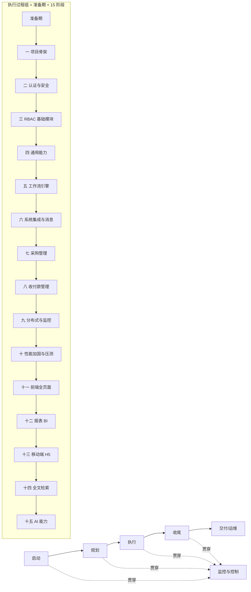
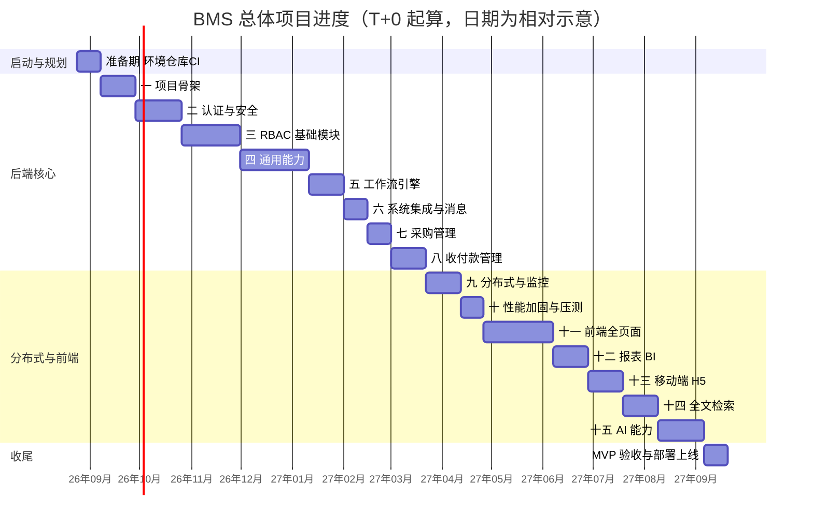

# 总体项目规划

> BMS 基础管理系统 · 从启动到收尾的总体规划（项目管理 + 工程排期）

[文档首页](../文档首页.md) › [规划](项目规划说明.md) › 总体项目规划　|　[同级：项目规划说明 →](项目规划说明.md)　[开发部署规划 →](开发部署规划.md)

## 1. 文档说明 

本文档是 BMS 项目的**总体项目规划**，回答三个问题：这个项目**怎么管**（目标/范围/组织/风险/质量/沟通）、**按什么顺序做**（阶段划分与 WBS）、**做到什么程度算完成**（里程碑与验收）。与既有文档分工互补：

| 文档 | 回答的问题 |
| --- | --- |
| 本文档《总体项目规划》 | 项目管理与实施排期（启动→执行→收尾） |
| 《[项目规划说明](项目规划说明.md)》 | 技术与方案（用什么做、模块/数据/权限怎么设计、15 阶段做什么） |
| 《[开发部署规划](开发部署规划.md)》 | 开发环境（在哪做、两台机器怎么分工） |

依据与约束：

- 《项目规划说明》第 20 节「开发计划与验收标准」的 15 个开发阶段与完成标准
- 《[开发部署规划](开发部署规划.md)》的环境批次与分阶段落地节奏
- 《[命名规范](../规范/命名规范.md)》与《[文档生成规范](../规范/文档生成规范.md)》的命名与格式约定
- 《[测试规范](../规范/测试规范.md)》的分层测试、覆盖率门禁、缺陷管理与准出标准
- 《[架构设计总纲](../设计/架构设计/01_架构设计_总览.md)》的总体架构与子系统划分

**取值说明**：

- **时间基准**：以开工日为 T+0，采用**相对工期**（周）表达，不写具体日历日期；甘特图中的日期仅为画图示意，真实开工日以项目启动令为准。
- **人力口径**：按**单人兼职全栈开发**估算；因兼职投入，实际日历耗时会长于全职人周口径，故工期以「周（兼职）」为单位。
- **工期性质**：各阶段工期为**建议估算基线**，可按实际进度滚动调整（见第 15 节）；调整走第 12 节变更管理。

## 2. 项目概述 

### 2.1 项目背景 

BMS 基础管理系统（简称 BMS），主要用作后端管理。支持分布式、集群部署；多租户 SaaS 架构（租户独立库）；支持 SSO 单点登录；内置报表 BI 与移动端 H5。

后端基于 FastAPI + SQLAlchemy，前端基于 Vue 3 + Vite（PC 管理端 + 移动端 H5 双工程）。项目当前**尚无源代码**，规划已定案，处于「启动→规划完成、即将进入执行」节点，本规划即从该节点起指导后续全部开发。

### 2.2 项目目标 

交付一个可商业交付的 BMS MVP：登录（含图形验证码）→ 主体链 RBAC 权限 → 各模块 CRUD → 日志与审计 → 文件管理全链路可用；采购申请三级审批生成采购订单、收付款单据登记与审批闭环、报表与大屏、移动端审批与免登、全文检索与 AI 辅助能力；多租户独立库隔离；监控、链路追踪、任务调度、备份归档可运维；最终达到 **500 并发 / P99 ≤ 1s** 的性能目标。

### 2.3 成功标准 

项目成功的判定以 MVP 验收为准，具体验收项见第 14 节，核心三条：

1. **功能可用**：MVP 验收清单逐项通过，功能用例通过率 ≥ 98%，P0/P1 缺陷清零。
2. **质量达标**：核心模块（认证/RBAC/工作流/审计/收付款）行覆盖 ≥ 80%、整体 ≥ 70%；安全专项用例集全部通过；MySQL/PostgreSQL/达梦 DM8 三库 CI 通过。
3. **可交付可运维**：压测达到 500 并发 / P99 ≤ 1s；Docker Compose 一键部署成功；部署手册、运维手册、测试报告等文档交付齐全。

## 3. 项目范围 

### 3.1 范围内（MVP） 

MVP 范围即《项目规划说明》第 5 节「功能模块」清单与第 20 节 15 个开发阶段，共约 40 个模块。按交付性质归为四类：

| 类别 | 模块 | 交付阶段 |
| --- | --- | --- |
| 平台基座 | 认证安全、RBAC 权限体系（用户/岗位/部门/角色/菜单/表单/按钮/字段/业务/动作/数据范围/三权分立）、租户管理、多租户路由、国际化 | 一 ~ 三 |
| 通用能力 | 字典、系统参数、文件管理、导入导出、通知中心、公告、帮助中心、回收站、邮件短信、操作/登录日志、审计合规、归档、备份、任务调度、首页工作台、表单定制 | 四 |
| 业务与集成 | 工作流引擎、开放接口、Webhook、事件总线、采购管理、收付款管理、报表 BI、全文检索 | 五 ~ 八、十二、十四 |
| 工程与体验 | 分布式监控、性能加固、前端全页面、移动端 H5、AI 能力 | 九 ~ 十一、十三、十五 |

### 3.2 范围外 / 明确不采用 

- **范围外（预留）**：附加业务模块（销售管理 `sale_`、仓储管理 `wh_`，启动时间另行确定，不纳入 MVP 排期）；独立服务集成（单独立项）。
- **明确不采用**（详见《项目规划说明》第 24 节）：Kubernetes（MVP 用 Docker Compose）、Kafka（RocketMQ 已覆盖）、MFA/2FA、原生 WebSocket（统一 Socket.IO）、APNs/FCM 系统推送、微服务拆分、前端 SSR/Nuxt。

### 3.3 范围变更控制 

MVP 范围一经确认即冻结；新增需求、模块或技术方案一律走第 12 节变更流程，评估对进度、质量、风险的影响并更新本规划与《项目规划说明》后方可执行，不擅自扩展。

## 4. 组织与职责 

本项目为**单人兼职全栈开发**，一人兼任全部角色。角色矩阵如下，按阶段切换工作侧重：

| 角色 | 职责 | 兼任说明 |
| --- | --- | --- |
| 项目负责人 | 目标/范围/计划制定、里程碑评审、风险与变更决策、禅道任务与里程碑维护 | 全程 |
| 后端开发 | backend 分层开发、Alembic 迁移、Celery/事件/工作流 | 阶段一 ~ 十为主 |
| 前端开发 | frontend / frontend-mobile 双工程、组件与页面、E2E | 阶段十一 ~ 十五为主，与后端穿插 |
| 测试 | 单元/接口/组件测试编写、CI 三库测试、缺陷复现 | 随各阶段，验收前集中 |
| 运维/部署 | mjbk 服务编排、监控告警、备份恢复、发布 | 阶段九起 |
| 文档 | 规范/设计/手册/报告编写，graphify 图谱维护 | 随各阶段交付 |

> 单人兼职意味着：任务以串行为主、多角色切换有切换成本、工期对个人可用时间高度敏感。因此进度基线取保守值，并以**里程碑门禁 + 阶段末复盘**替代多人协作的例会机制（见第 11、13 节）。

## 5. 项目生命周期与阶段划分 

采用标准项目管理五大过程组，**执行过程组**展开为《项目规划说明》的「准备期 + 15 个开发阶段」：

过程组与阶段对应关系：

| 过程组 | 内容 | 对应阶段/产物 |
| --- | --- | --- |
| 启动 | 立项、目标与范围确认、环境/仓库/项目管理平台（禅道）初始化 | 准备期 |
| 规划 | 本规划、《项目规划说明》《开发部署规划》定稿 | 阶段一前（已交付） |
| 执行 | 15 个开发阶段按序交付 | 阶段一 ~ 十五 |
| 监控与控制 | CI 门禁、阶段末测试报告、里程碑评审、风险跟踪 | 贯穿全程 |
| 收尾 | MVP 验收、部署上线、文档归档、复盘 | 阶段十五后 |

> 15 阶段的详细内容与**完成标准**以《项目规划说明》第 20 节为准，本文档只做排期、里程碑与交付物管理，不重复罗列技术细节。

## 6. 工作分解结构（WBS） 

WBS 分三层：**阶段 → 工作包 → 可交付成果**。下表给出阶段 → 工作包概要（可交付成果见第 8 节）：

| 阶段 | 工作包概要 |
| --- | --- |
| 准备期 | 开发环境（mjbk/mjpc）、GitLab 仓库与 CI、Kiwi TCMS、工具链 |
| 一 项目骨架 | monorepo、配置/日志/健康检查、SQLAlchemy 接入、平台库/租户库拓扑与租户解析、批量迁移、CI 流水线、模块注册表 |
| 二 认证与安全 | 双 token、登录/刷新/登出、限流、图形验证码、会话管理、账号锁定、SSO、密码策略、数据脱敏 |
| 三 RBAC 基础模块 | 部门/岗位/用户/角色、主体链角色绑定、业务/动作权限、菜单/表单/按钮/字段挂接、字段权限、数据范围、三权分立、平台超管与租户管理、动态菜单接口 |
| 四 通用能力 | 消息与任务基础设施、字典、系统参数、文件管理、导入导出、通知中心、公告、帮助中心、回收站、邮件短信、操作/登录日志、审计链、国际化、归档、工作台后端、表单定制后端 |
| 五 工作流引擎 | SpiffWorkflow 集成、bpmn-js 建模、会签/或签、条件分支、流程版本管理 |
| 六 系统集成与消息 | 开放接口（OAuth2）、Webhook、事件总线事件模型 |
| 七 采购管理 | 采购申请三级审批、供应商档案、采购订单（含 Webhook 事件推送） |
| 八 收付款管理 | 收款/付款/退款单登记与审批、统一流水台账、支付渠道配置（manual） |
| 九 分布式与监控 | 真实分片规则、租户独立库路由与批量迁移、系统监控、缓存管理、备份管理、链路追踪、任务调度 |
| 十 性能加固与压测 | 缓存三防、限流/降级/熔断、索引与慢查询走查、locust 压测 |
| 十一 前端全页面 | 主布局、首页工作台、表单布局管理、全部管理页、i18n、个人中心、E2E 抽样 |
| 十二 报表 BI | 数据集管理、拖拽报表设计器、大屏设计器与轮播、工作台图表卡 |
| 十三 移动端 H5 | frontend-mobile 工程、审批中心、通知、公告、个人中心、数据查询、企业微信/钉钉免登 |
| 十四 全文检索 | ElasticSearch 接入、事件异步同步、索引规划与重建、文件内容解析、全局搜索、检索权限与租户隔离 |
| 十五 AI 能力 | LLM 适配层、NL2SQL、审批辅助、内容生成、语义搜索与文件问答、OCR、异常检测、知识库问答、帮助文档智能维护、写操作/自动审批开关 |

## 7. 进度计划 

### 7.1 里程碑 

以「阶段完成标准」为里程碑门禁，未达标不进入下一阶段。累计工期为**相对工期（周，兼职）**，估算基线，可滚动调整：

| 里程碑 | 对应阶段 | 达成标志（验收要点） | 建议累计工期 |
| --- | --- | --- | --- |
| M0 启动就绪 | 准备期 | 环境/仓库/CI 就绪，可进入骨架开发 | 2 周 |
| M1 骨架可用 | 一 | 本地起服务、CI 通过、/healthz /readyz 正常、三库拓扑可路由、模块注册校验生效 | 5 周 |
| M2 认证安全可用 | 二 | 本地 + SSO 登录链路 E2E 通过、密码策略强制生效 | 9 周 |
| M3 权限体系可用 | 三 | 主体链权限计算正确、越权与跨租户被拒、数据范围/字段权限/三权/租户模块开关生效 | 14 周 |
| M4 通用能力可用 | 四 | 各模块 CRUD + 日志落库、审计链/归档/工作台/表单定制后端可用 | 20 周 |
| M5 工作流可用 | 五 | 管理端可建流程并执行完整流转 | 23 周 |
| M6 集成消息可用 | 六 | 开放接口鉴权通过、事件推送成功 | 25 周 |
| M7 业务链路演示 | 七/八 | 采购申请→审批→订单全链路；收付款单据/流水/退款/渠道可用 | 30 周 |
| M8 分布式监控可用 | 九 | 分片查询正确、租户隔离、监控与追踪可见、缓存/备份/任务可用 | 33 周 |
| M9 性能达标 | 十 | 500 并发 / P99 ≤ 1s | 35 周 |
| M10 前端全页面 | 十一 | 前端全链路可用 | 41 周 |
| M11 报表 BI | 十二 | 报表与大屏全链路、工作台图表卡可挂数据集渲染 | 44 周 |
| M12 移动端 H5 | 十三 | 移动端审批、附件预览与免登 E2E 通过 | 47 周 |
| M13 全文检索 | 十四 | 检索命中与高亮、权限租户过滤、索引重建、降级兜底 | 50 周 |
| M14 AI 能力 | 十五 | NL2SQL 安全执行、默认仅辅助、租户隔离、审计落库、帮助 AI 草稿发布 | 54 周 |
| M15 MVP 验收 | 十五结束 | 准出标准全部满足，Docker Compose 一键部署成功 | 54 周 |

> 阶段十五后另需约 2 周收尾活动（验收报告、部署上线、复盘归档），项目总工期约 56 周（兼职，约 13 个月），见第 15 节。
>
> **里程碑分层映射**（《项目规划说明》第 20 节）：Alpha 内部可用 = M0~M6（阶段一~六）；Beta 功能完整 = M7~M10（阶段七~十一，**此后冻结功能范围**）；GA 正式发布 = M11~M15 + 收尾（阶段十二~十五）。任一层级未达成不进入下一层级的演示 / UAT。

### 7.2 甘特图 

按串行保守基线绘制（单人兼职以串行为主；前端、移动端、全文检索、AI 等阶段在前置能力就绪后可部分并行，届时以里程碑门禁为准调整）：

## 8. 交付物清单 

### 8.1 代码交付物 

按阶段交付可运行的代码与配置，CI 通过为准入：

- backend / frontend / frontend-mobile 三工程代码、Alembic 迁移、种子数据
- deploy/ 下的 Docker Compose 编排、nginx 配置、CI（.gitlab-ci.yml）
- 每个阶段对应模块的接口测试（pytest + httpx）、前端组件/单元测试（Vitest）与关键链路 E2E（Playwright）
- 模块注册种子（sys_module）、权限码种子（sys_business/sys_action）、菜单/表单/按钮/字段种子

### 8.2 文档交付物 

对齐《项目规划说明》第 21 节「文档计划」：

| 文档 | 产出阶段 | 说明 |
| --- | --- | --- |
| 总体项目规划（本文档） | 阶段一前 | 项目管理与实施排期 |
| 开发部署规划 | 阶段一前（已交付） | 开发环境两台机器分工 |
| 后端开发规范 / 前端开发规范 | 阶段一 | 分层职责、代码约定、测试写法 |
| README | 阶段一起持续更新 | 项目简介、快速启动、目录导航 |
| 接口契约快照 | 阶段二起随版本维护 | CI 导出 swagger.json 存档 |
| 测试报告 | 阶段一起每阶段末 | 用例执行、缺陷、覆盖率、风险与遗留项；CI 数据脚本汇总 + AI 初稿，人工补充结论 |
| 部署手册 / 运维手册 | 阶段九 | Compose/环境变量/备份演练、监控告警/日志/排障 |
| 压测报告 | 阶段十 | 场景、结果与优化记录 |
| 用户操作手册 / 系统管理员手册 | Beta 起、GA 前定稿 | 最终用户与管理员指南；AI 依功能代码、表单元数据与帮助中心内容生成初稿，人工审核定稿 |
| 培训材料 | 按需（合同要求时） | 图文/视频脚本，AI 辅助生成；自用场景不出 |

> 设计文档（架构设计、概要设计、布局/原型设计）随对应阶段在《文档生成规范》设计体系下产出，其中概要设计逐模块随阶段交付，见《[概要设计总纲](../设计/概要设计/01_概要设计_总览.md)》。

## 9. 质量管理 

质量目标与手段以《测试规范》为准，本项目层面要点：

- **分层测试**：后端 pytest + httpx、前端 Vitest、关键链路 Playwright E2E；CI 三库方言集成测试（MySQL/PostgreSQL/达梦 DM8）。
- **个人开发 + AI 辅助**：用例初稿由 AI 依概要设计与验收标准生成、人工审核入库；手工用例仅覆盖自动化不可覆盖场景；E2E 以录制器 + AI 补全断言辅助编写（总则见《项目规划说明》16.1 节）。
- **覆盖率门禁**：核心模块（认证/RBAC/工作流/审计/收付款）行覆盖 ≥ 80%、整体 ≥ 70%，CI 低于门槛即失败。
- **用例管理**：Kiwi TCMS 为唯一用例库，手工与自动化用例统一登记（用例 ID 与代码关联），执行结果导入归档。
- **缺陷管理**：GitLab Issue 分级（P0~P3），P0/P1 阻断合入；自动化失败自动归档 REPRO 复现包并建 Issue，AI 辅助修复（人工 review 合入）。
- **镜像扫描**：main 流水线 GitLab Container Scanning（Trivy）扫描 Registry 镜像，CVSS ≥ 9 高危阻断发版。
- **准出标准**（阶段交付与 MVP 验收共用，见《项目规划说明》第 16.4 节）：P0/P1 清零、功能用例通过率 ≥ 98%、安全专项全通过、压测达标、三库 CI 通过、覆盖率达标。

## 10. 风险管理 

风险登记册（按发生概率 × 影响排序，阶段内滚动更新）：

| 风险 | 影响 | 应对 |
| --- | --- | --- |
| Python 3.14 与核心依赖/dameng/SpiffWorkflow 兼容性未知 | 骨架阶段阻塞 | 阶段一逐依赖验证，任一核心依赖不兼容整体回退 Python 3.13（既定口径） |
| 单人兼职投入不稳，工期易延 | 里程碑延期 | 串行保守基线 + 里程碑门禁 + 阶段末复盘，必要时收缩/顺延非核心功能（走变更） |
| 阶段四（通用能力）、阶段十一（前端全页面）工作量最大 | 进度瓶颈 | 拆子任务分批交付，优先核心链路（认证→权限→工作流→收付款） |
| 500 并发 / P99 ≤ 1s 不达标 | 验收失败 | 阶段九/十提前预留，缓存三防、索引、连接池规划前置，压测发现问题即调优 |
| 开发服务器外网不可达（镜像/GitHub 归档/Renovate） | 环境与依赖更新受阻 | 镜像提前缓存，GitHub 归档与 Renovate 暂缓，不影响内网主链路 |
| 第三方许可合规（AGPL/GPL/达梦/ES） | 商业交付风险 | 独立部署、不改第三方源码、交付附 SBOM + NOTICE |
| 密钥/凭据泄露 | 数据安全 | 密钥只走环境变量、deploy/.env 与本地资源 gitignore、不入库不入镜像 |
| 单人知识/状态中断 | 恢复成本高 | 文档完备、CI 与 Issue 留痕、graphify 知识图谱辅助理解 |

> 本节管**项目管理层面**风险；技术实现类风险（达梦方言、动态 DDL 安全、依赖停维等）另见《[项目规划说明](项目规划说明.md)》第 25 章「风险管理」风险登记册，两册互补、阶段末复盘时一并走查。

## 11. 沟通与协作管理 

单人项目以**留痕化**替代例会沟通，保证中断可恢复、决策可追溯：

- 提交信息遵循 `type(scope): 中文描述`，分支 `类型/描述`（见《[Git协作规范](../规范/Git协作规范.md)》）。
- 代码缺陷以 GitLab Issue 为唯一记录，MR 关联 Issue；关键决策记录于规划/设计文档。
- 需求/任务/迭代在**禅道**（ZenTao 开源版，mjbk 常驻）登记管理：阶段任务对应里程碑（M0~M15）建迭代与看板，进度以禅道甘特图为准，任务与 GitLab Issue 以链接互指（选型与分工见《[项目规划说明](项目规划说明.md)》3.3 节）。
- 阶段末输出测试报告与复盘小节，作为进度与问题的正式沟通产物。
- 文档变更后运行 `graphify update .` 保持知识图谱最新，辅助架构理解。

## 12. 配置与变更管理 

- **分支模型**：`main` 保护分支，`feature/xxx` 开发，MR 合入需 CI 通过；单人开发口径——核心模块（认证/RBAC/工作流/审计/收付款）改动提交前经 AI 交叉评审、MR 描述附评审结论，多人协作时再启用强制人工批准。
- **版本管理**：里程碑 tag 语义化版本（`v1.0.0`），镜像 `bms-组件:版本`；发布检查单、Schema 向后兼容与应用回滚规则见《[项目规划说明](项目规划说明.md)》第 19.5 节。
- **依赖升级**：Renovate 自动提 MR，安全更新优先。
- **变更流程**：新需求/范围/技术方案变更 → 先在禅道登记需求/任务 → 评估对范围、进度、风险影响 → 更新本规划与《项目规划说明》→ 确认后执行；未走流程不得自行扩展范围。
- **配置基线**：config.toml + 环境变量覆盖，三套环境 dev / test / prod 由 `BMS_ENV` 区分。

## 13. 监控与报告 

- **CI 门禁**：MR 流水线（ruff + pytest + ESLint + Vitest + 双端构建）、main 流水线（E2E + 三库集成测试 + 镜像构建 + 镜像扫描 + 契约快照 + Allure 报告导入 Kiwi TCMS）。
- **阶段报告**：每阶段末输出测试汇总报告（用例/缺陷/覆盖率/风险与遗留项），由 CI 数据脚本汇总 + AI 生成初稿、人工补充结论；里程碑评审决定是否进入下一阶段。
- **运行监控**：阶段九起 Prometheus + Loki + Grafana + Alertmanager + Jaeger 全程可见，作为性能与稳定性证据；可用性目标 99.9% 与核心链路 SLO 作为告警阈值锚点（严重/警告两级，定义见《[项目规划说明](项目规划说明.md)》「可用性目标与 SLO」小节）。

## 14. 验收与收尾 

### 14.1 MVP 验收标准 

MVP 验收以《项目规划说明》第 20 节「MVP 验收标准」逐项走查为准，覆盖：登录→RBAC→CRUD→日志→文件全链路、采购三级审批、收付款闭环、开放接口鉴权、真实分片、监控追踪、缓存/任务调度、会话踢出、账号锁定、公告/通知、帮助中心、工作台、表单定制、用户喜好、回收站、多租户隔离、配额拦截、SSO/JIT、报表大屏、供应商、移动端审批免登、审计合规、国际化、归档、备份演练、导入导出、分片上传、短信记录，以及安全专项、浏览器/移动端兼容基线、压测、三库 CI、一键部署。

### 14.2 准出标准 

见第 9 节「准出标准」，与《项目规划说明》第 16.4 节一致。

### 14.3 收尾活动 

1. 全量回归 + 安全专项 + 压测 + UAT（E2E 全量回归先行、按验收清单抽检）+ 探索性测试通过。
2. Docker Compose 一键部署验证（dev/test/prod 三环境）。
3. 部署手册、运维手册、测试报告、README 定稿交付。
4. 归档镜像同步 GitHub、版本 tag、依赖 SBOM + NOTICE。
5. 项目复盘会（单人：复盘记录落文档），遗留项列入演进路线。

## 15. 阶段工期估算基线 

工期为**建议估算基线（周，兼职）**，依赖为串行前提下的前置关系；可按实际滚动调整并记录调整原因：

| 阶段 | 建议工期（周） | 前置依赖 | 关键交付物 | 累计工期 |
| --- | --- | --- | --- | --- |
| 准备期 | 2 | 无 | 环境、仓库、CI、Kiwi TCMS | 2 |
| 一 项目骨架 | 3 | 准备期 | monorepo、健康检查、租户解析、迁移、模块注册表 | 5 |
| 二 认证与安全 | 4 | 一 | 双 token、登录链路、SSO、密码策略、脱敏 | 9 |
| 三 RBAC 基础模块 | 5 | 二 | 主体链权限、权限码、动态菜单、三权、租户管理 | 14 |
| 四 通用能力 | 6 | 三 | 字典/文件/通知/日志/审计链/归档/工作台/表单定制后端 | 20 |
| 五 工作流引擎 | 3 | 四 | SpiffWorkflow + bpmn-js 全流程 | 23 |
| 六 系统集成与消息 | 2 | 五 | 开放接口、Webhook、事件模型 | 25 |
| 七 采购管理 | 2 | 五/六 | 采购申请→审批→订单 | 27 |
| 八 收付款管理 | 3 | 七 | 收付款单据、流水台账、退款、渠道 | 30 |
| 九 分布式与监控 | 3 | 四/八 | 分片、租户路由、监控追踪、缓存/备份/任务 | 33 |
| 十 性能加固与压测 | 2 | 九 | 缓存三防、限流降级、压测报告 | 35 |
| 十一 前端全页面 | 6 | 一~八 | 主布局、工作台、表单设计器、全部管理页 | 41 |
| 十二 报表 BI | 3 | 十一 | 数据集、报表设计器、大屏、图表卡 | 44 |
| 十三 移动端 H5 | 3 | 十一 | 审批/通知/公告/个人中心/免登 | 47 |
| 十四 全文检索 | 3 | 四/十一 | ES 同步、索引重建、全局搜索、文件解析 | 50 |
| 十五 AI 能力 | 4 | 四/十一/十四 | LLM 适配、NL2SQL、语义搜索、帮助 AI | 54 |
| MVP 验收与收尾 | 2 | 十五 | 验收报告、部署上线、复盘 | 56 |

> 累计工期约 56 周（兼职，约 13 个月）；若投入强度提高、或前端/移动端/检索/AI 阶段与后端并行推进，可显著缩短，届时以第 7.2 节甘特图按里程碑门禁滚动调整。

> 本文档依《文档生成规范》编写 · 关键决策已逐项确认 · 生成日期：2026-08-20 · 修订：2026-08-22（同步《[项目规划说明](项目规划说明.md)》：里程碑分层 Alpha/Beta/GA 映射、AI 辅助测试与报告汇总、镜像扫描 CI 门禁、MR 单人口径、SLO 监控口径、用户侧文档交付物）
