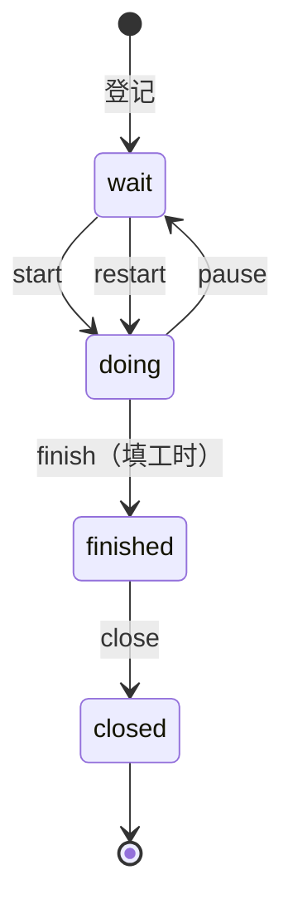

# 项目管理规范

> 禅道需求/任务录入 · 描述三段式 · 迭代与里程碑 · 缺陷流程 · 状态与工时

[文档首页](../文档首页.md) › [规范](文档生成规范.md) › 项目管理规范　|　[关联：禅道 API 使用说明 →](../资料/AI/禅道API使用说明.md)

## 1. 目的与适用范围 <a id="purpose"></a>

统一 BMS 项目管理口径：禅道（ZenTao）需求与任务的录入标准、描述模板、迭代与里程碑约定、缺陷与测试用例的跨平台流程，保证任务卡自解释、进度可核对、工作可追溯。

适用于本项目全部需求、任务、迭代、缺陷与测试用例登记。平台部署与访问见《[禅道部署使用说明](../资料/开发服务器/禅道部署使用说明.md)》（管理员 `minjian`，地址 `http://<mjbk-IP>:8070`，`<mjbk-IP>` 取值见《[本地资源](../用户文档/本地资源.md)》）；API 端点与工具包用法见《[禅道 API 使用说明](../资料/AI/禅道API使用说明.md)》。

### 1.1 三方平台分工 <a id="platforms"></a>

| 载体 | 承载职责 | 不使用 |
| --- | --- | --- |
| 禅道（mjbk 8070） | 需求/任务/迭代/甘特图/看板与进度管理 | 缺陷模块、测试模块 |
| GitLab Issue（mjbk 8080） | 代码缺陷（P0–P3，见《[测试规范](测试规范.md)》第 9 节）与 MR 关联 | 需求与任务（一律走禅道） |
| Kiwi TCMS（mjbk） | 测试用例登记与执行，平台缺陷链接指向 GitLab Issue | 缺陷登记 |

## 2. 需求录入规范 <a id="story"></a>

### 2.1 必填字段 <a id="story-fields"></a>

| 字段 | 必填 | 口径 |
| --- | --- | --- |
| 主题（title） | 是 | 「对象 + 动作（要点）」，见 2.2 |
| 描述（spec） | 是 | 强制三段式，见第 4 节 |
| 优先级（pri） | 是 | 1–4，见 2.3 |
| 分类（category） | 是 | feature/interface/performance/safe/experience/improve/other 择一 |
| 所属产品 | 是 | 「BMS 基础管理系统」 |
| 关联里程碑 | 是 | 对应 M0–M15 里程碑（见第 5 节），在描述中写明 |

### 2.2 主题命名 <a id="story-name"></a>

「对象 + 动作（要点）」——对象是业务或模块，动作是动词，要点用括号列举：

- `用户管理（CRUD/租户隔离/导出）`
- `表单定制（拖拽/条件显示/字段权限）`

- 主题独立成句可看懂，不堆叠「需求」「开发」「功能」等后缀；一个主题只做一件事。

### 2.3 优先级口径 <a id="priority"></a>

| 级别 | 含义 | 使用口径 |
| --- | --- | --- |
| 1 紧急 | 阻塞他人或线上事故，立即处理 | 阻塞并行工作或发布，当日升级处理 |
| 2 高 | 本迭代必做 | M0–M15 内 WBS 任务的默认级别 |
| 3 中 | 正常排期 | 迭代内可顺延 |
| 4 低 | 积压待议 | 后续迭代或不采纳候选 |

> 需求与任务共用本口径表；创建时不填优先级默认 2，仍须显式确认。

### 2.4 录入方式 <a id="story-how"></a>

- 需求**创建走 CLI/API**（22.5 实测可用，工具包已内置 reviewer 数组）：

```bash
python deploy/tools/zentao/zentao.py stories create --product 1 \
  --title "用户管理（CRUD/租户隔离/导出）" --category feature --pri 2 \
  --spec "见三段式描述" --reviewer minjian
```

  > `reviewer` 必须传数组（22.5 服务端 bug，不传/传字符串报错），CLI `--reviewer` 不传则默认当前登录账号；`--spec` 缺失会被 API 以「『描述』不能为空」拒绝。详见《[禅道 API 使用说明](../资料/AI/禅道API使用说明.md)》踩坑 #7。
- 列表/查看/更新/删除用 CLI（REST，22.5 已验证）：

```bash
python deploy/tools/zentao/zentao.py stories list --product 1
python deploy/tools/zentao/zentao.py stories search --product 1 --name 用户
python deploy/tools/zentao/zentao.py stories delete --id 5
```

## 3. 任务录入规范 <a id="task"></a>

### 3.1 必填字段 <a id="task-fields"></a>

| 字段 | 必填 | 口径 |
| --- | --- | --- |
| 主题（name） | 是 | 「对象 + 动作（要点）」，见 2.2 |
| 描述（desc） | 是 | 强制三段式，见第 4 节 |
| 父任务 | 子任务必填 | 子任务必须挂父任务（WBS 拆解，见第 5 节） |
| 指派人（assignedTo） | 是 | 当前阶段一律 `minjian` |
| 优先级（pri） | 是 | 1–4，见 2.3 |
| 预计开始（estStarted） | 是 | API 硬要求，建议用迭代开始日期 |
| 截止日期（deadline） | 是 | API 硬要求，建议用迭代结束日期 |
| 预计工时（estimate） | 是 | 单位小时 |

> `estStarted`/`deadline` 缺失会静默失败（踩坑 #4）；子任务父级走 URL 参数 `?task={id}`，body 写 `parent` 无效（踩坑 #11）；batchCreate 的 body 不接受 `assignedTo`，建后补指派（踩坑 #12）。端点细节见《[禅道 API 使用说明](../资料/AI/禅道API使用说明.md)》。

### 3.2 录入方式 <a id="task-how"></a>

任务创建**只走**批量入口 `batchCreate`（单条入口静默失败，踩坑 #3），指派在创建后补齐（`left` 必填，踩坑 #5）：

```bash
# 单个任务（创建 + 指派）
python deploy/tools/zentao/zentao.py tasks create --execution 3 --name "mjbk Ubuntu 基础（静态IP/清华源/SSH免密）" \
  --estimate 4 --begin 2026-08-24 --end 2026-09-07 --to minjian

# 批量拆子任务（--parent 走 URL 参数）
python deploy/tools/zentao/zentao.py tasks batch-create --execution 3 --parent 1 --file subtasks.json
```

- 子任务工时合计应与父任务一致（如任务 1「开发服务器环境与工具链就绪」16h = 4+2+4+3+2+1）。
- 创建后读回校验：`tasks search --parent 1`（确认条数、父级、指派人）。

## 4. 描述三段式模板（强制） <a id="desc"></a>

需求与任务的描述一律采用**三段式**：内容编号清单 + 完成标准 + 参考文档，使任务卡自解释、验收可核对：

```text
内容（《开发部署规划》4.1/4.2）：
1. Ubuntu 24.04.4 LTS 桌面版、静态 IP、apt 换清华源
2. SSH 免密：mjpc 公钥上 mjbk
3. 磁盘挂载：HDD /mnt/data、2T NVMe SSD /mnt/ssd2t（fstab 自动挂载）
完成标准：mjpc 免密 SSH；重启后双盘自动挂载。
参考文档：《Ubuntu安装部署使用说明》第 7 节、《开发部署规划》4.1/4.2
```

- **内容**：编号清单，一条一事，写清「做什么」，带具体值（版本/端口/路径/账号）；
- **完成标准**：可验证的验收点（命令、现象、结果）；
- **参考文档**：出处与章节号，Web 录入时写文档名，仓库内文档给出相对链接。
- 存量任务补描述：描述存文件后 `--desc-file` 更新，读回校验一致：

```bash
python deploy/tools/zentao/zentao.py tasks update --id 85 --desc-file desc-85.txt
python deploy/tools/zentao/zentao.py tasks get --id 85   # 读回校验
```

回填方法见《[禅道 API 使用说明](../资料/AI/禅道API使用说明.md)》6.4。

## 5. 迭代与里程碑 <a id="execution"></a>

- 层级：产品「BMS 基础管理系统」→ 项目「BMS 开发」（scrum）→ 迭代 **M0–M15**（禅道 id 3–18）。
- 迭代与《[总体项目规划](../规划/总体项目规划.md)》里程碑一一对应（T+0 相对工期，日期为示意，实际以里程碑门禁调整与滚动修订）。
- 任务按阶段 WBS 登记、指派 `minjian`；迭代内看板流转，甘特图为进度跟踪依据。
- 甘特偏差（任务逾期或里程碑延期）触发里程碑评审与工期基线滚动调整，评审结论回写迭代起止日期（`executions update`）。
- 常用查询：

```bash
python deploy/tools/zentao/zentao.py tasks list --execution 3                 # 迭代 3 全部任务
python deploy/tools/zentao/zentao.py tasks search --assigned-to minjian --status doing
python deploy/tools/zentao/zentao.py executions list --project 1              # 全部迭代（M0–M15）
```

## 6. 缺陷流程 <a id="defect"></a>

- **载体**：代码缺陷**只登记**在 GitLab Issue（禅道缺陷模块不使用）；Kiwi TCMS 用例的缺陷链接指向对应 Issue。
- **分级**：P0（阻断主流程/数据安全）、P1（严重功能缺失/可用性降级）、P2（一般缺陷）、P3（轻微/建议）；P0/P1 阻断 MR 合入。
- **流程**：上报（复现步骤 + 关联用例 ID）→ 指派修复 → CI 回归验证 → 关闭。
- **与禅道互链**：修复任务的描述中记录关联 Issue 地址；Issue 描述注明禅道任务号（如「禅道任务 87」），双向可追溯。
- **现场数据**：P0/P1 必须附问题现场数据库 dump 与代码 commit（归档于 mjbk 缺陷目录，路径与命令见《[测试规范](测试规范.md)》第 9 节）。
- **自动上报**：流水线测试失败自动建 Issue（`defect-auto` 标签），人工补充复现步骤与定级后进入指派修复，细则见《[测试规范](测试规范.md)》第 9 节。

## 7. 状态与工时 <a id="status"></a>

### 7.1 状态流转 <a id="status-flow"></a>



- `wait` 等待 → `doing` 处理中 → `finished` 已完成（待验收/关闭）→ `closed` 已关闭；中断用 `pause`，恢复后 `restart`。
- 状态变更必须走 API 动作（`/start`、`/finish`、`/close`），不得直接改 `status` 字段。

### 7.2 工时字段 <a id="time"></a>

| 字段 | 含义 | 填写时机 |
| --- | --- | --- |
| estimate | 预计总工时（小时） | 录入时 |
| left | 预计剩余（小时） | 录入时（= estimate），随进展递减 |
| realStarted | 实际开始日期 | 开始时（start） |
| currentConsumed | 实际消耗工时（小时） | 完成时（finish） |
| finishedDate | 完成日期 | 完成时（finish） |

规则：

- 录入必填 `estimate` 与 `deadline`（API 硬要求）；未开始时 `left = estimate`。
- 完成必填 `currentConsumed`/`realStarted`/`finishedDate`（API 硬要求，踩坑 #6）。
- 实际工时按小时计；大任务先拆子任务再分别计工时，避免单任务工时虚高。

常用命令：

```bash
python deploy/tools/zentao/zentao.py tasks start --id 85
python deploy/tools/zentao/zentao.py tasks finish --id 85 --consumed 4
python deploy/tools/zentao/zentao.py tasks close --id 85
```

## 8. 检查清单 <a id="checklist"></a>

- □ 需求：主题「对象 + 动作（要点）」、描述三段式、优先级/分类/所属产品/关联里程碑齐全，经 CLI/API 录入（22.5 已通）
- □ 任务：主题、描述、指派人、优先级、预计开始、截止日期、预计工时齐全；子任务有父任务且工时合计一致
- □ 迭代：归属 M0–M15，起止日期与《总体项目规划》一致；甘特偏差触发里程碑评审
- □ 缺陷：走 GitLab Issue（P0–P3 分级）并与禅道任务互链；测试用例在 Kiwi TCMS
- □ 状态与工时：流转走 start/finish/close；完成时填齐 currentConsumed/realStarted/finishedDate
- □ 存量任务缺描述已按三段式补写并读回校验（`--desc-file` + `tasks get`）

> 依《文档生成规范》编写 · 与《测试规范》《Git协作规范》《总体项目规划》配套 · 生成日期：2026-08-21
