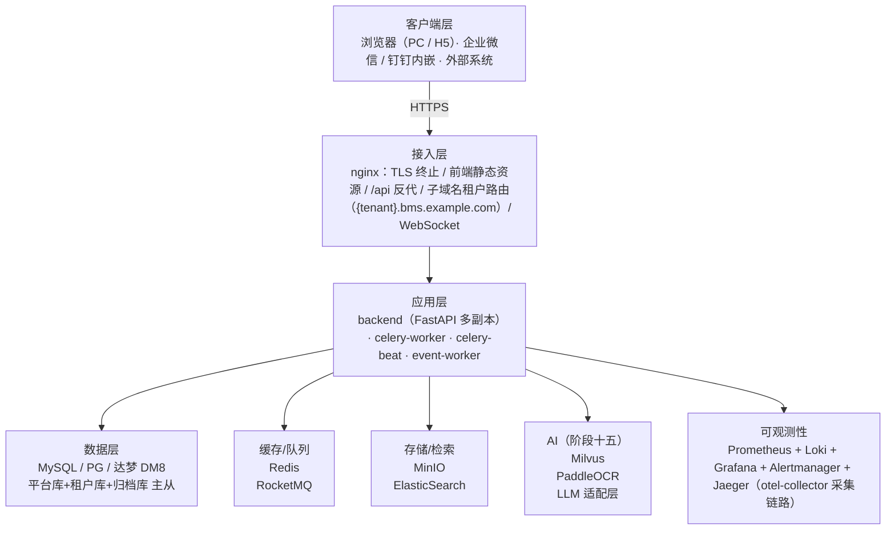
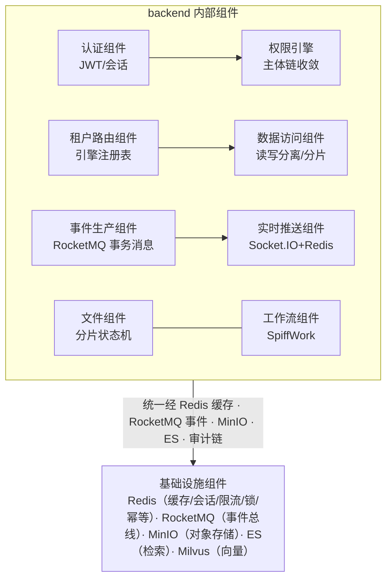

# 架构设计 · 总体架构

> BMS · 分层、进程、组件与技术栈全景

[架构设计](01_架构设计_总览.md) › 03-总体架构　|　[← 02-目标与约束](02_架构设计_目标与约束.md) · [04-核心交互时序 →](04_架构设计_核心交互时序.md)

## 1. 概述 

本节点给出 BMS 的总体架构：分层视图、进程模型、组件协作、仓库目录结构与技术栈全景，
并给出开发计划（十五阶段）与架构落地章节的映射关系。对应[《项目规划说明》](../../规划/项目规划说明.md)的「技术栈」
「项目目录结构」「开发计划与验收标准」章节。

## 2. 分层视图 

## 3. 进程模型 

| 进程 | 职责 | 部署形态 |
| --- | --- | --- |
| backend | FastAPI 应用：REST API（/api/v1、/api/open）、Socket.IO 实时推送、动态数据源路由、Swagger/ReDoc（仅开发） | 多副本（uvicorn 多 worker，如 4 worker） |
| celery-worker | 定时/异步任务执行：孤儿分片清理、日志归档、分片表预创建、每日全量备份、未登录账号锁定扫描等；broker 用 Redis | 多副本 |
| celery-beat | 定时调度：任务定义入库（`sys_task`），自研数据库调度器；Redis 分布式锁防重复调度 | 单副本 |
| event-worker | RocketMQ 事件消费者（多消费组）：操作日志异步化、Webhook 推送、审计链分区有序消费、ES 索引同步（阶段十四）、embedding 管线（阶段十五） | 多副本 |
| frontend / frontend-mobile | 构建产物由 nginx 托管（PC + 移动端静态资源） | 静态资源 |

## 4. 组件视图与协作 

**协作规则**：

- 分层职责：api 层只做参数校验与路由分发；services 承载业务逻辑与事务边界；repositories 承载数据访问与数据源/分片路由，禁止在 api 层直接操作模型
- 认证组件与权限引擎在中间件/依赖注入层协作：先认证会话，再校验权限码，后做数据范围过滤
- 业务模块不直接调用通知/审计：通过事件总线发布事件，由 event-worker 消费落库/推送（模块解耦）
- 关键写操作经 ORM 事件自动触发审计捕获，审计事件走 RocketMQ 分区有序消费（见审计哈希链子系统）

## 5. Monorepo 目录结构 

- bms/
  - backend/ FastAPI 后端
    - app/
      - core/ 配置、安全、异常处理
      - api/ 路由层（按模块），依赖注入
      - models/ SQLAlchemy 模型
      - schemas/ Pydantic 请求/响应模型
      - services/ 业务逻辑
      - repositories/ 数据访问，多数据源/分片路由
      - db/ 异步引擎、AsyncSession、读写分离路由
      - tasks/ Celery 任务定义
      - ws/ Socket.IO 连接与会话事件
      - i18n/ 国际化管理（语言包接口、运行时翻译）
    - alembic/ 迁移脚本（三套方言）
    - tests/ pytest
    - config.toml
    - pyproject.toml
  - frontend/ Vue 3 + Vite（PC 管理端）
    - src/
      - api/ Axios 封装与接口定义
      - router/ 动态路由生成
      - stores/ Pinia
      - views/ 页面（按模块）
      - layouts/ 主布局
      - components/ 通用组件
      - i18n/ 中英文文案
      - utils/
    - package.json
    - .nvmrc
  - frontend-mobile/ Vue 3 + Vant（移动端 H5：审批、通知、数据查询）
  - deploy/ Docker Compose、nginx 配置（含 GitLab CE、gitlab-runner、Renovate 编排）
  - scripts/ 种子数据、备份恢复等运维脚本
  - .gitlab-ci.yml CI 流水线定义（GitLab CE）
  - .github/ GitHub 归档镜像辅助文件（README 说明等）
  - 文档/ 规划/规范/设计/资料
  - graphify-out/ 知识图谱产物（勿手动修改）

## 6. 技术栈全景 

### 6.1 后端核心 

| 层面 | 技术选型 |
| --- | --- |
| 语言 | Python 3.14+（uv 管理） |
| Web 框架 | FastAPI（uvicorn 多 worker 部署） |
| 数据校验 | Pydantic v2 |
| 数据库抽象 | SQLAlchemy 2.0+（异步 ORM/Core，多数据源） |
| 数据库迁移 | Alembic（三套方言，URL 来自 config.toml） |
| 数据库 | SQLite（开发/测试，aiosqlite）/ MySQL 8.x（aiomysql）/ PostgreSQL 16+（psycopg 3）/ 达梦 DM8（dmPython，信创选配） |
| 缓存 | Redis（redis-py 异步客户端，集群统一缓存）+ dogpile.cache（进程内内存字典缓存，Region 分域管理：小字典整类型 + 超大字典已查条目局部子集，全局版本号 `bms:{tenant}:dict:version` 惰性比对保证多实例一致） |
| 认证 | JWT（PyJWT）+ Redis 会话状态校验 + PBKDF2 密码哈希（标准库） |
| SSO | authlib（OIDC 客户端/Provider + CAS 客户端；企业微信/钉钉免登） |
| 验证码 | 图形验证码（Pillow 生成，Redis 存储校验） |
| 限流 | slowapi（limits 库，Redis 后端） |
| 文件上传 | python-multipart |
| 文件存储 | MinIO（S3 兼容对象存储，预签名 URL 下载） |
| Excel 处理 | openpyxl（导入导出） |
| 后端国际化 | 消息文案入库（sys_i18n_message）+ Babel 开发期提取；Accept-Language 驱动；数据文案走 i18n 附表 |
| 配置格式 | TOML（config.toml + 环境变量覆盖） |
| ID 生成 | yitter/IdGenerator（雪花算法，时钟回拨处理） |
| 日志 | structlog（结构化 JSON，携带 request_id） |
| 工作流引擎 | SpiffWorkflow（BPMN 2.0，线程池运行） |
| 模板渲染 | Jinja2（邮件模板入库在线编辑、通知模板） |
| 实时推送 | python-socketio（Socket.IO，Redis 适配器跨实例广播） |
| 消息队列 | RocketMQ 5.x（事件总线：操作日志异步化、Webhook 推送、审计链串行消费；分区有序消息） |
| 定时任务 | Celery（Redis broker；beat 数据库调度器） |
| 邮件发送 | aiosmtplib（SMTP，Jinja2 模板） |
| 全文检索 | ElasticSearch 8.x（elasticsearch-py；PDF/Word/Excel/TXT 文本解析） |
| AI（阶段十五） | LLM 适配层（外部 API + 私有化端点可配）、Milvus 向量库、PaddleOCR（本地 + 多模态 API 可切换） |
| 链路追踪 | OpenTelemetry（otel-collector + Jaeger） |

### 6.2 前端 

| 层面 | 技术选型 |
| --- | --- |
| 框架 | Vue 3 + Vite + TypeScript |
| UI 库 | Element Plus（PC）/ Vant（移动端） |
| 路由 / 状态 | Vue Router 4 / Pinia |
| HTTP 客户端 | Axios（token 注入、401 刷新） |
| 流程建模 | bpmn-js（拖拽绘制 BPMN 流程图） |
| 图表 | ECharts（报表与大屏渲染） |
| 网格拖拽 | gridstack.js（工作台卡片与报表设计器统一布局：网格拖拽/尺寸调整/响应式） |
| 表单设计器 | vuedraggable（SortableJS 官方封装，表单设计器字段排序/分组/跨区拖拽，与 gridstack 分工：列表排序 vs 网格布局） |
| 大屏画布 | vue-flow（@vue-flow/core，大屏自由画布：绝对定位拖拽、连线与缩放；与 gridstack 网格布局、vuedraggable 列表排序三者分工：自由画布/网格布局/列表排序） |
| 实时推送 | socket.io-client |
| 国际化 | vue-i18n（语言包运行时拉取、RTL 适配、localStorage 持久化） |
| 样式 | SCSS（Element Plus 主题定制） |
| 包管理 | npm（frontend / frontend-mobile 各自独立） |
| 代码规范 | ESLint + Prettier |
| 测试 | Vitest（单元）+ Playwright（E2E） |

### 6.3 工程化与质量 

| 层面 | 技术选型 |
| --- | --- |
| Python 包管理 | uv |
| 代码规范 | ruff（lint + format） |
| 类型检查 | pyright（严格模式） |
| 后端测试 | pytest + httpx（ASGITransport）+ pytest-cov（覆盖率门禁） |
| API 文档 | Swagger UI / ReDoc（FastAPI 内置，生产关闭） |
| 知识图谱 | graphify（代码理解与架构分析） |
| 缺陷管理 | `deploy/tools/defect/`：defect_capture.py（测试失败自动上报 + REPRO 复现包：dump/堆栈/repro.json/REPRO.md）、reproduce.py（一键复现：检出 commit + 导入 dump + 跑用例）、ai_fix.py（双轨 AI 修复代理：本地模型优先云端兜底，bot 提 MR 人工合入） |
| 压测 | locust（登录/列表/审批场景） |

### 6.4 部署与运维 

| 层面 | 技术选型 |
| --- | --- |
| 容器 | Docker + Docker Compose |
| Web 服务器 | nginx（负载均衡 / TLS 终止 / 子域名租户路由，泛域名证书） |
| 对象存储 | MinIO（S3 兼容） |
| 消息队列 | RocketMQ 5.x（nameserver + broker） |
| 监控 | Prometheus + Loki + Grafana + Alertmanager（告警：邮件/企业微信/钉钉/短信） |
| 链路追踪 | Jaeger + otel-collector |
| 检索 | ElasticSearch 8.x（MVP 单节点，生产集群多副本） |
| AI（阶段十五） | Milvus（milvus + etcd，MinIO 复用）、PaddleOCR（可选） |
| 健康检查 | /healthz、/readyz |
| CI/CD | GitLab CE（自托管，仓库 + MR + CI + Registry 一体，gitlab-runner 容器化挂载 docker.sock；ruff + pytest（覆盖率门禁）+ 前端双端构建 + Playwright E2E + 三库集成测试（复用开发服务器常驻库）+ Allure 报告 + 结果导入 Kiwi TCMS + 镜像 + swagger.json 快照）+ Renovate 依赖升级；GitHub push mirror 只读归档 |

## 7. 阶段映射 

《项目规划说明》开发计划十五阶段与架构落地章节对应关系（概要设计与详细设计按阶段展开）。十五阶段按**里程碑分层**分组（定义见规划第 20 节）：**Alpha 内部可用 = 阶段一~六**（平台底座完整）、**Beta 功能完整 = 阶段七~十一**（实际业务闭环 + 非功能加固 + 全部前端，此后冻结功能范围）、**GA 正式发布 = 阶段十二~十五**（增强能力齐备，通过 MVP 验收后定版）：

| 阶段 | 内容 | 对应架构节点 |
| --- | --- | --- |
| 一 项目骨架 | monorepo、配置/日志/健康检查、SQLAlchemy 接入、平台/租户库拓扑、批量迁移、CI、模块注册表（sys_module：模块简称/表前缀/错误码段/事件域平台统一维护，启动与 CI 校验唯一） | 总体架构、数据访问与分片、多租户路由、测试与质量、部署与运维、模块注册 |
| 二 认证与安全 | 双 token、限流、验证码、会话、锁定、SSO、密码策略、脱敏 | 认证与会话、性能与安全 |
| 三 RBAC 基础模块 | 用户/岗位/角色/菜单/权限码/字段权限/数据范围/三权分立/平台超管与租户管理（含模块开通勾选与租户模块开关） | 权限计算引擎、多租户路由、数据架构、模块注册 |
| 四 通用能力 | 事件总线 + Celery 接入、字典/参数、文件、导入导出、通知/公告、帮助中心、回收站、邮件短信、日志异步化、字段审计、国际化、归档、首页工作台后端（卡片注册表/平台与角色模板/个人布局与一键重置接口）、表单定制后端（布局配置表与三级解析/字段属性/租户自建字段动态 DDL 与跨方言类型映射/服务端动态校验/查询区与明细区配置） | 事件总线、任务调度、文件管理、通知公告、帮助中心、国际化、审计哈希链、首页工作台、表单定制 |
| 五 工作流引擎 | SpiffWorkflow、bpmn-js、会签/或签、版本管理 | 工作流 |
| 六 系统集成与消息 | 开放接口（OAuth2）、Webhook、事件模型 | 接口与集成、事件总线 |
| 七 采购管理 | 申请三级审批、供应商、生成订单（模拟业务） | 工作流、通知公告 |
| 八 收付款管理 | 收款/付款/退款单据与审批、收付款流水台账、支付渠道配置（渠道抽象预留，实际使用模块） | 工作流、事件总线、通知公告 |
| 九 分布式与监控 | 分片落地、租户路由演练、监控告警、缓存管理、备份、链路追踪、任务调度 | 数据访问与分片、可观测性、任务调度、部署与运维 |
| 十 性能加固与压测 | 缓存三防、限流降级熔断、索引、locust | 性能与安全 |
| 十一 前端全页面 | 主布局、首页工作台（卡片拖拽定制/自建图表卡片/一键重置，登录后默认页）、表单布局管理（vuedraggable 设计器：分区/分组/列数/跨列/顺序/标签宽度、查询表单区、明细区列配置、字段属性、租户自建字段）、全部管理页（含用户喜好：主题/列表页个性化/通知偏好/工作台自定义）、i18n、个人中心、E2E | 前端架构、首页工作台、表单定制、测试与质量 |
| 十二 报表 BI | 数据集、报表设计器、大屏、工作台数据集图表卡挂接（gridstack 统一布局） | 报表 BI、首页工作台 |
| 十三 移动端 H5 | 审批中心、通知、公告、免登 | 前端架构、认证与会话、工作流 |
| 十四 全文检索 | ES 接入、事件同步、索引重建、文件解析 | 全文检索、事件总线 |
| 十五 AI 能力 | LLM 适配、智能报表助手（NL2SQL）、智能审批辅助、AI 内容生成、语义搜索与文件问答（RAG/Milvus）、OCR 与自动分类、审计异常检测、问答机器人、帮助文档智能维护；AI 自动执行写操作与 AI 自动审批（独立开关，默认关闭） | AI 服务、帮助中心、性能与安全 |
| 附加业务模块（预留） | 销售管理（sale_）、仓储管理（wh_）等按「附加业务模块规划」标准流程接入（模块注册制，sys_module 登记）；独立服务按需集成；不纳入 MVP 排期 | 模块注册、接口与集成、事件总线 |

### 7.1 MVP 验收标准 

MVP 交付验收清单（架构侧对应各节点；测试侧执行见 [27-测试与质量节点](27_架构设计_测试与质量.md)）：

- 登录（含图形验证码）→ 主体链 RBAC（用户→岗位/部门→角色收敛、业务/动作权限、字段权限、动作级数据范围）→ 各模块 CRUD → 日志 → 文件管理全链路可用
- 采购申请三级审批（部门经理 → 财务 → 分管领导）通过并生成采购订单，待办提醒经 Socket.IO 实时触达、审批事件经 Webhook/消息总线推送成功
- 收款/付款/退款单据登记与审批（复用工作流）通过、收付款流水台账一致、退款金额校验生效、支付渠道配置（manual 渠道）可用
- 外部系统经 OAuth2 Client Credentials 调用开放接口鉴权通过；真实分片规则查询正确
- 系统监控（指标/日志/告警，邮件/企业微信/钉钉通知可达）与链路追踪（Jaeger）可见；缓存管理（清理与刷新）可用；任务调度页面可管理、执行记录可查
- 会话强制踢出即时生效；账号锁定与手动解锁可用、解锁记录可查；公告发布与已读统计可用；通知批量已读可用；帮助中心可用（分类/文章维护与前台展示、页面内帮助按钮、阅读反馈统计）；用户喜好可用（主题切换、列表页个性化、通知偏好、工作台自定义，PC 与移动端跨端同步）；回收站查看/恢复可用且审计留痕
- 首页工作台可用（内置卡片展示、个人布局定制、角色模板与平台默认模板、一键重置）；表单定制可用（三级布局解析与权限叠加、字段属性动态校验、租户自建字段动态 DDL 加列、查询区与明细区配置、导入导出联动）
- 多租户独立库隔离验证通过（跨租户访问拒绝、批量迁移正确）；租户配额超限拦截生效
- SSO 登录（OIDC）与 JIT 建号可用、BMS 作 IdP 供第三方登录通过；报表与大屏可用；供应商档案 CRUD 与采购引用可用
- 移动端审批与企业微信/钉钉免登可用、移动端附件预览与个人中心（改密）可用
- 审计合规可用（字段级变更审计可查、哈希链校验通过、三权分立互斥生效、密码策略强制执行）
- 国际化扩展可用（动态新增语言、语言包页面维护、用户时区与 RTL 切换）
- 归档管理可用（策略执行、归档数据在线查询、物理清理生效、审计链跨归档校验通过）；备份任务与记录可查、恢复演练登记可用
- Excel 导入导出可用；分片上传与断点续传可用；短信发送记录可用
- 安全专项用例集通过；浏览器与移动端真机兼容基线通过
- 压测达到 500 并发 / P99 ≤ 1s；MySQL/PostgreSQL/达梦 DM8 三库 CI 通过；Docker Compose 一键部署成功

## 8. 关联节点 

- [目标与约束](02_架构设计_目标与约束.md)：约束依据
- [核心交互时序](04_架构设计_核心交互时序.md)：主流程全景
- [数据架构](05_架构设计_数据架构.md)：数据分布与规范
- [多租户路由](08_架构设计_子系统_多租户路由.md)：租户机制
- [数据访问与分片](09_架构设计_子系统_数据访问与分片.md)：数据访问层
- [认证与会话](10_架构设计_子系统_认证与会话.md)：身份基座
- [权限计算引擎](11_架构设计_子系统_权限计算引擎.md)：权限机制
- [事件总线](12_架构设计_子系统_事件总线.md)：模块解耦
- [任务调度](13_架构设计_子系统_任务调度.md)：异步任务
- [可观测性](23_架构设计_子系统_可观测性.md)：日志/指标/链路
- [前端架构](26_架构设计_前端架构.md)：双端工程
- [部署与运维](28_架构设计_部署与运维.md)：运行期拓扑

> 架构设计节点 · 与《项目规划说明》《文档生成规范》《命名规范》配套 · 生成日期：2026-08-15 · 修订：2026-08-22（同步《项目规划说明》：阶段映射补里程碑分层 Alpha/Beta/GA 说明）