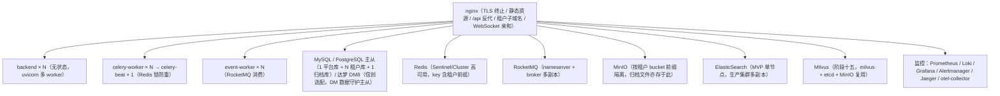

# 架构设计 · 部署与运维

> BMS · 拓扑、集群、配置、初始化与容灾

[架构设计](01_架构设计_总览.md) › 28-部署与运维　|　[← 27-测试与质量](27_架构设计_测试与质量.md)　|　[29-决策与风险 →](29_架构设计_决策与风险.md)

## 1. 概述 

本节点定义部署与运维架构：部署拓扑、集群设计要点、基础设施编排、配置分层、初始化数据、故障应对与备份恢复。对应[《项目规划说明》](../../规划/项目规划说明.md)的「部署与运维」「集群设计要点」「基础设施编排」「环境与配置」「初始化数据」「备份与恢复」章节。

## 2. 部署拓扑 

## 3. 集群设计要点 

- 无状态：JWT 无状态（会话标记存 Redis，鉴权顺带校验）；token 黑名单、限流计数存 Redis；文件存 MinIO；定时任务分布式执行——任一实例可随时停机、随时扩容
- 缓存一致性：统一走 Redis 作为共享缓存源；一般业务数据不引入本地内存缓存；字典为只读热配置例外——进程内内存字典缓存（全局版本号 `bms:{tenant}:dict:version` 惰性比对保证多实例一致）
- 分布式锁：Redis SETNX（幂等前置去重、beat 防重、引擎创建防重）
- 实时推送：Socket.IO 经 Redis 适配器广播；nginx ip_hash / Cookie 亲和
- 连接池：pool_size / max_overflow 按 worker 数规划，总连接数 ≤ 数据库 max_connections 的 70%
- 数据库高可用：主从 + 故障切换；主库故障预案（从库提升、只读模式）
- 消息队列高可用：RocketMQ 多副本（主从、同步刷盘 + 消息持久化）；Celery beat 单副本 + 锁
- 检索高可用：ES 多节点集群（多副本、故障自动分片迁移）；事件重放全量重建；故障降级 DB 模糊查询
- 安全响应头：nginx 统一配置 CSP、HSTS（dev 关闭）、X-Frame-Options（SAMEORIGIN，兼容 Grafana 嵌入）、X-Content-Type-Options、Referrer-Policy、Permissions-Policy
- 优雅停机：SIGTERM 后停止接收新请求、等待在途请求完成

## 4. 基础设施编排 

- 初版 Docker Compose：backend（多副本）+ celery-worker（多副本）+ celery-beat（单副本）+ event-worker（多副本）+ frontend（nginx，托管 PC + 移动端静态资源）+ redis + rocketmq（nameserver + broker）+ elasticsearch + milvus（含 etcd，MinIO 复用）+ minio + 数据库（按环境选择 MySQL、PostgreSQL 或达梦 DM8）+ 监控（Prometheus/Loki/Grafana/Alertmanager）+ jaeger（trace）+ otel-collector
- nginx 需支持 WebSocket：/socket.io 路径放行 Upgrade/Connection 头
- 健康检查：/healthz（存活）、/readyz（依赖就绪），供编排系统滚动发布
- TLS 与 HTTPS：nginx 层配置，cookie Secure 标志随环境启用
- 演进：数据量或部署规模增长后迁移 Kubernetes

## 5. 配置分层 

- 三套环境 dev / test / prod，config.toml 按环境分层（BMS_ENV 指定）+ 环境变量覆盖
- 密钥（DB/Redis 密码、JWT secret、MinIO 凭据、短信/AI key）走 Secret 管理（K8s Secret / Docker secrets），不落库不入镜像
- 开发环境依赖（Redis/RocketMQ/ES/MinIO）由 Docker Compose 统一提供；Milvus 随阶段十五加入；MySQL/PostgreSQL/达梦 DM8 三库常驻开发服务器（见《[开发部署规划](../../规划/开发部署规划.md)》）
- Python 版本 .python-version 固定 3.14（uv 管理）；前端 Node 版本 .nvmrc 固定
- CORS：dev 放行前端跨域；生产 nginx 同源反代不开放跨域
- 租户域名：生产泛域名 DNS（*.bms.example.com）+ 泛 TLS 证书
- git 分支：main 保护分支，feature 分支经 PR 合入（CI 通过方可合并）

## 6. 初始化数据 

- 初始菜单/表单/按钮/字段与业务/动作种子（后端模块定义与 sys_menu/sys_form/sys_button/sys_field/sys_business/sys_action 对齐，含 i18n 附表英文文案）
- 基础字典种子（状态、类型等通用字典，含 i18n）
- 初始工作流定义种子：采购申请三级审批流程模板、付款申请审批流程模板
- 初始支付渠道种子：线下转账（manual）；bank/third_party 类型占位（渠道抽象预留）
- 基础邮件模板种子（审批提醒、告警通知，中英文）
- 初始工作台卡片种子（待办/已办、通知、公告、快捷入口、帮助入口、数据统计等内置卡，含 i18n 英文文案）与平台默认模板种子（租户开通流程自动执行）
- 初始定时任务种子（孤儿分片清理、日志归档、分片表预创建、每日全量备份）
- 平台库种子：平台超管账号（首次启动创建，强制改密）、平台统一菜单/表单/按钮/字段挂接与权限码、平台默认字典/参数/邮件模板
- 租户开通种子：三类内置管理员角色（权限互斥，分别预授权限）与初始系统管理员账号、默认 IdP 占位、归档策略（四类审计日志 90 天）
- 语言包种子：中文/英文语言与前后端文案

## 7. 故障应对 

| 故障 | 应对 |
| --- | --- |
| Redis 故障 | 缓存失效直连 DB + 日志告警；限流降级 memory 后端（slowapi）；会话校验降级（凭 access token 有效期）并告警 |
| 主库故障 | 只读模式：从库响应查询，写接口返回明确错误；从库提升预案 |
| RocketMQ 故障 | 审计/日志写入降级为同步直写（标记降级时段，恢复后补发）；业务主流程不受影响 |
| ElasticSearch 故障 | 检索降级数据库模糊查询兜底；恢复后重放事件重建索引 |
| MinIO 故障 | 上传/下载接口报错 + 告警；预签名依赖 MinIO，故障期间文件不可用 |
| 邮件/短信渠道故障 | 发送记录标记失败，重试策略生效；告警渠道可降级企业微信/钉钉 |
| 依赖接口故障 | httpx 短超时 + 熔断快速失败；Webhook 指数退避重试 |

## 8. 备份与恢复 

- 数据库：每日全量备份 + 开启 Binlog/WAL（时间点恢复 PITR），达梦 DM8 用 dmrman 备份/归档；保留 30 天，异机存储；归档库纳入备份范围
- 备份任务与记录由页面管理（sys_backup_task / sys_backup_log，Celery 调度，支持手动备份与恢复演练登记）
- MinIO：对象数据定期增量备份 + 生命周期策略；元数据随数据库备份
- 恢复：定期演练恢复流程，目标 RTO ≤ 4 小时、RPO ≤ 1 小时
- 数据归档：全表可配归档策略（sys_archive_policy），两段式流转（热表 → 归档库可在线查询 → 对象存储冷化）；过期归档文件与软删除残留由 Celery 物理清理

## 9. 关联节点 

- [多租户路由](08_架构设计_子系统_多租户路由.md)：子域名与泛域名 TLS
- [事件总线](12_架构设计_子系统_事件总线.md)：event-worker 消费组
- [任务调度](13_架构设计_子系统_任务调度.md)：celery-beat 单副本
- [可观测性](23_架构设计_子系统_可观测性.md)：监控组件编排
- [性能与安全](25_架构设计_性能与安全.md)：降级矩阵/安全响应头
- [前端架构](26_架构设计_前端架构.md)：nginx 静态托管与 WebSocket 亲和

> 本文档为 AI 生成 · 架构设计节点 · 与《项目规划说明》《文档生成规范》《命名规范》配套 · 生成日期：2026-08-15