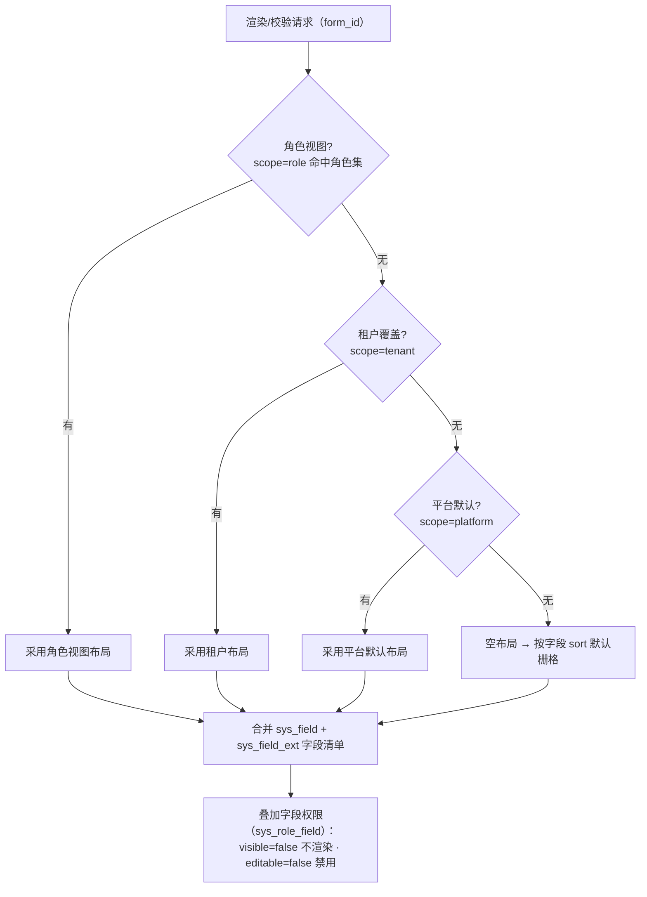

# 架构设计 · 表单定制

> BMS · 三级布局、字段属性与租户自建字段（动态 DDL）

[架构设计](01_架构设计_总览.md) › 31-表单定制　|　[← 30-首页工作台](30_架构设计_子系统_首页工作台.md)

## 1. 概述 

表单定制子系统定义业务表单在线定制的架构机制：**三级布局**（平台默认 → 租户覆盖 → 角色视图）与字段权限叠加、**字段属性**在线调整与服务端动态校验、**租户自建字段**（运行时动态 DDL 加物理列）、查询表单与明细区配置。对应[《项目规划说明》](../../规划/项目规划说明.md)「表单定制」模块与「权限模型」「初始化数据」章节，落地规范见[《概要设计-表单定制》](../概要设计/38_概要设计_表单定制.md)与[《布局设计-表单定制》](../布局设计/14_布局设计_表单定制.html)。

## 2. 职责与边界 

- **本子系统负责**：布局配置（sys_form_layout）管理接口、租户自建字段（sys_field_ext）管理与动态 DDL 执行服务、字段属性维护、布局解析与下发（动态菜单接口字段来源合并）、服务端动态校验器、查询表单与明细区配置。
- **明确不负责**：平台字段定义（sys_field 仍由菜单管理模块平台超管维护）；字段权限授予（sys_role_field 仍由角色管理模块维护）；业务数据本身。
- **边界约束**：平台库表（sys_menu/sys_form/sys_field 等）不可定制；日志类分片表不可加自定义字段；自定义字段停用不删列；动态 DDL 仅作用于目标租户库，不触碰其他租户与平台库。

## 3. 布局体系（三级解析与权限叠加） 

- **优先级**：角色视图（用户角色集中优先级最高的角色）> 租户覆盖 > 平台默认 > 空布局回退（字段 sort 默认栅格，即既有表单页行为，保证无配置时系统照常可用）。
- **权限叠加**：布局定义**结构可见性**（分区/分组/列数/字段引用），sys_role_field 定义**数据安全**（角色级 visible/editable）——两处任一判定不可见则不渲染；布局不含的字段数据仍保留，仅不展示。角色视图与角色字段权限并存：布局定结构、权限定安全。
- **布局内容**：layout_config（JSON）含主表单区（分区/分组、列数 1/2/3、字段引用与跨列/顺序、标签宽度）、查询表单区（字段与顺序）、明细区（列引用/顺序/宽度，主从模块）。
- **变更传导**：布局/字段属性/自建字段变更发布 `form.updated` 事件（与菜单管理一致，AI 帮助更新触发）；布局解析结果短缓存，变更即失效。

## 4. 字段扩展机制（动态 DDL） 

- **物理列**：租户自建字段 = 运行时在目标租户库业务表上 ALTER TABLE ADD COLUMN，列名 `ext_{field_key 蛇形}`（如 ext_project_no），避开系统列；Alembic 基线不参与（基线管理平台/租户 schema 版本，动态列由元数据驱动）。
- **类型映射**：跨方言类型映射表（SQLite/MySQL/PostgreSQL/达梦 DM8 四库一致）：单行文本→VARCHAR(255)、长文本→TEXT（达梦 CLOB）、数字→DECIMAL(18,4)、日期时间→TIMESTAMP、开关→SMALLINT/BOOLEAN 映射、文件→VARCHAR(255)（存文件 ID/URL）；下拉单选/多选→VARCHAR 存选项 code（多选逗号分隔）。
- **生命周期**：停用=不删列（数据保留，防止误删与迁移风险）；重建同名字段复用物理列；删列不提供（合规销毁走归档链路）。
- **执行策略**：DDL 服务单租户串行（每租户一把 Redis 锁，防止并发加列冲突）；DDL 前校验（表/字段名白名单、类型合法、列不存在）；执行失败记录 sys_task_log 并可重试，告警通知管理员；MySQL 8 在线加列/PG 快速加列，表锁窗口可控（运维按业务低谷执行提示）。
- **一致性**：先写 sys_field_ext 元数据（状态=待建列）→ 执行 DDL → 置已生效；失败回滚元数据状态并留日志；字段清单接口只下发已生效字段。

## 5. 服务端动态校验 

- 新增/编辑接口（/api/v1/{resource}）在 service 层读取**当前生效布局配置 + 字段属性**（缓存）构建校验器：必填、长度/数值范围、正则、选项集（字典/自定义）、多选格式——与前端一致，改属性无需发版。
- 校验规则来源：平台字段属性（sys_field 扩展属性，平台维护）→ 租户覆盖（sys_field_ext 或租户级属性覆盖）→ 无规则不校验（与原接口行为一致，不破坏既有模块）。
- **防绕过**：校验在 service 层强制执行（不依赖前端）；自定义字段同样校验；动态校验失败返回统一错误码，字段级错误信息走 i18n。

## 6. 前端渲染与设计器架构 

- **布局驱动渲染器**：表单页/列表页渲染器按布局接口下发的 layout_config 渲染（分区、栅格列数、跨列、顺序、标签宽度、查询区、明细列），字段组件按 type 映射（复用既有字段组件 + 自建字段类型映射）；空布局回退默认栅格。
- **设计器**（vuedraggable，SortableJS 封装）：字段列表（平台 + 租户字段）⇄ 布局画布的分区/分组拖拽，查询区/明细列顺序拖拽；属性面板编辑字段属性（必填/默认值/校验/组件类型/选项集/只读/隐藏）与自建字段（类型选择 → 保存触发后端 DDL）；实时预览。
- **三态共用**：新增/编辑/详情共用一套布局，只读态由字段权限（editable）与字段类型自动决定纯文本/输入框展示，不做三套布局。
- **拖拽库分工**：vuedraggable（列表排序/分组拖拽，设计器）· gridstack（网格布局，工作台/报表）· vue-flow（自由画布，大屏）。

## 7. 数据与缓存 

| 项 | 设计 |
| --- | --- |
| 表 | sys_form_layout（布局：scope/role_id/layout_config）、sys_field_ext（自建字段：form_id 逻辑引用平台 sys_form.code、column_name、type、options）、sys_field_ext_i18n（多语言）；业务表动态 ext_* 物理列 |
| 缓存键 | 布局 `bms:{tenant}:form:layout:{form_id}`；字段清单（平台 + 租户合并）`bms:{tenant}:form:fields:{form_id}`；动态校验规则随布局缓存 |
| 一致性 | 先写库后删缓存；布局/字段/DDL 变更后失效对应 form_id 缓存；DDL 成功后同时失效字段清单缓存 |
| 导入导出 | 模板列 = 布局配置（平台字段 + 已生效自定义字段），列头动态映射 column_name，导入校验规则与表单一致 |

## 8. 与其他子系统的协作 

- **[权限计算引擎（11）](11_架构设计_子系统_权限计算引擎.md)**：formdesign 业务码控制布局/字段管理；角色视图定位角色集；sys_role_field 权限叠加
- **[菜单管理/动态菜单（06）](06_架构设计_接口与集成.md)**：字段清单接口合并 sys_field（平台）+ sys_field_ext（租户）下发；form.updated 事件同源
- **[数据访问与分片（09）](09_架构设计_子系统_数据访问与分片.md)**：动态 DDL 按租户路由到目标库执行；分片表禁止自建字段
- **[任务调度（13）](13_架构设计_子系统_任务调度.md)**：DDL 失败重试任务、元数据一致性巡检任务入库
- **[文件管理（16）](16_架构设计_子系统_文件管理.md)**：文件类型自定义字段走文件组件与上传链路
- **[国际化（20）](20_架构设计_子系统_国际化.md)**：自建字段名多语言（sys_field_ext_i18n），布局接口按 locale 下发
- **[前端架构（26）](26_架构设计_前端架构.md)**：布局驱动渲染器替换固定栅格、设计器页面、vuedraggable 选型
- **[审计合规（15）](15_架构设计_子系统_审计哈希链.md)**：布局/字段属性/自建字段变更落字段级审计（sys_data_audit_log 关键表）

## 9. 性能、安全与测试 

- **性能**：布局与字段清单走 Redis 短缓存，渲染接口命中缓存毫秒级；动态校验器从缓存构建，不打库；DDL 低频操作（每租户串行 + 锁）
- **安全**：DDL 输入强校验（表/列名白名单与格式、类型枚举，防注入与越权建列）；动态校验在 service 层强制；布局/字段接口 require_permission（formdesign:manage）；跨租户隔离——DDL 仅执行于当前租户库；停用字段禁止出现在新增布局中（存量布局引用自动跳过）
- **测试**：三级布局解析矩阵（角色/租户/平台/空 × 字段权限叠加）、动态 DDL 四库类型映射与失败重试、停用不删列与重建复用、服务端动态校验（必填/范围/正则/选项集）、布局变更缓存失效、分片表拒绝自建字段、导入导出列联动（纳入[测试与质量](27_架构设计_测试与质量.md)）
- **验收**：见[《概要设计-表单定制》](../概要设计/38_概要设计_表单定制.md)验收要点

> 架构设计节点 · 与《项目规划说明》《文档生成规范》《命名规范》配套 · 生成日期：2026-08-15