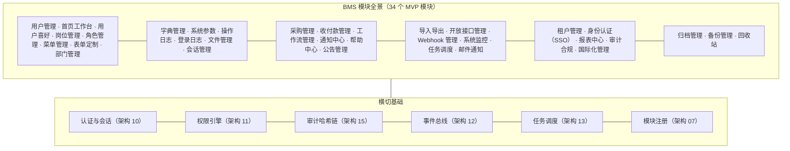

# 概要设计

> BMS 基础管理系统 · 总纲

[文档首页](../../文档首页.html) › [项目规划说明](../../规划/项目规划说明.html) › 01_概要设计_总览　|　[03-用户管理 →](03_概要设计_用户管理.md)

## 1. 文档目的 

本文档是 BMS（基础管理系统）概要设计的**总纲**：说明概要设计的范围、方法与文档组织方式，并作为入口引用全部概要设计节点文件。概要设计在[《项目规划说明》](../../规划/项目规划说明.html)与[《架构设计》](../架构设计/01_架构设计_总览.md)之上，将**每一个 MVP 模块**落到「模块职责、功能流程、数据模型、接口清单、权限配置、错误码与验收要点」的粒度，供开发人员按模块直接实现，也为后续《详细设计》（表结构、Schema、页面交互）划定边界。

> 概要设计遵循架构设计已定案的决策，不做架构级新决策；任何与架构设计冲突的内容以架构设计为准，并须先修订架构设计对应节点。

## 2. 设计范围与输入 

| 输入 | 路径 | 作用 |
| --- | --- | --- |
| 项目规划说明 | [`../../规划/项目规划说明.html`](../../规划/项目规划说明.html) | 功能模块清单、核心数据表清单、权限模型、API 设计规范、事件模型等定案 |
| 架构设计 | `../架构设计/01_架构设计_总览.html` | 分层视图、进程模型、子系统机制、性能安全约束、部署运维约束 |
| 文档生成规范 | `../../规范/文档生成规范.html` | 本文档及全部节点文件的格式与布局要求 |
| 命名规范 | `../../规范/命名规范.html` | 代码、数据库、API、基础设施命名的统一约定 |
| 后端开发规范 | `../../规范/后端开发规范.html` | 分层职责、异常与错误码用法 |
| 前端开发规范 | `../../规范/前端开发规范.html` | 目录约定、组件与状态管理约定 |

## 3. 设计方法与章节模板 

以《项目规划说明》「功能模块」清单为唯一模块划分依据，**每个 MVP 模块独立成篇**，不跨模块合并，保证模块边界清晰、与权限码/菜单/页面一一对应。每篇节点统一采用**八段式**章节模板（小模块中内容较少的段落从简，但保持八段框架）：

| 段 | 章节 | 内容 |
| --- | --- | --- |
| 1 | 模块概述与职责 | 模块定位、职责边界、对应架构设计节点、与相邻模块的协作关系 |
| 2 | 功能分解与业务流程 | 功能点分解表、业务规则、流程步骤（含异常分支） |
| 3 | 关键时序与协作 | 与缓存/消息队列/工作流/对象存储等组件的协作时序 |
| 4 | 数据模型与表设计 | 核心表、关键字段、索引/分片/归档策略、数据流转 |
| 5 | 接口设计 | REST 接口清单表（方法、路径、说明、权限码）、分页/幂等/限流要求、发布的事件 |
| 6 | 权限与配置 | 权限码分配、菜单挂接、sys_config 参数、种子数据 |
| 7 | 错误码与异常处理 | 错误码段分配、异常处理与告警要求 |
| 8 | 页面清单与验收要点 | PC/移动端页面清单、验收标准 |

> **通用页面约定**：表单详情页「系统信息」统一展示 **ID / 版本号 / 创建用户 / 创建时间 / 修改用户 / 修改时间 / 表单标识**（label 上方三列只读栅格，disabled 输入框、与主表业务字段形态一致仅不可编辑、表单标识为禁用下拉框，对应数据表审计字段 version / created_by / updated_by 与模块标识），详见[《布局设计-表单页》](../布局设计/08_布局设计_表单页.html)2.1.1 节；各模块节点不再逐表重复。

## 4. 文档结构（节点引用） 

概要设计采用「总纲 + 节点文件」结构：每个模块独立成文、自包含可单独阅读；本总纲统一引用。

### 4.1 MVP 模块设计节点 

| 节点 | 文件 | 模块说明（规划说明） |
| --- | --- | --- |
| 模块注册 | [02_概要设计_模块注册.html](02_概要设计_模块注册.md) | 平台基础能力（阶段一）：业务模块注册表 sys_module 维护与唯一性校验（表前缀/错误码段/事件域），新增模块注册制接入 |
| 用户管理 | [03_概要设计_用户管理.html](03_概要设计_用户管理.md) | 用户增删改查、启用/停用、重置密码、分配岗位、主体角色绑定、SSO 身份绑定查看、账号锁定/解锁 |
| 用户喜好 | [04_概要设计_用户喜好.html](04_概要设计_用户喜好.md) | 主题模式、列表页个性化、通知偏好、工作台自定义，PC 与移动端跨端同步 |
| 岗位管理 | [05_概要设计_岗位管理.html](05_概要设计_岗位管理.md) | 岗位增删改查（归属部门），主体链中间实体分配角色 |
| 角色管理 | [06_概要设计_角色管理.html](06_概要设计_角色管理.md) | 角色增删改查、主体绑定、菜单/表单权限授予、动作权限授予、动作数据范围配置 |
| 菜单管理 | [07_概要设计_菜单管理.html](07_概要设计_菜单管理.md) | 菜单/表单/按钮/字段维护与字段权限授予，业务/动作码平台统一维护 |
| 部门管理 | [08_概要设计_部门管理.html](08_概要设计_部门管理.md) | 组织架构树，用户归属部门，主体链中间实体分配角色，数据权限依据 |
| 字典管理 | [09_概要设计_字典管理.html](09_概要设计_字典管理.md) | 通用数据字典维护 |
| 系统参数 | [10_概要设计_系统参数.html](10_概要设计_系统参数.md) | 系统级参数配置 |
| 操作日志 | [11_概要设计_操作日志.html](11_概要设计_操作日志.md) | 关键操作审计日志（谁在何时做了什么） |
| 登录日志 | [12_概要设计_登录日志.html](12_概要设计_登录日志.md) | 登录成功/失败记录 |
| 文件管理 | [13_概要设计_文件管理.html](13_概要设计_文件管理.md) | 文件上传/下载与在线预览（分片上传+断点续传，预签名 URL 限时下载） |
| 会话管理 | [14_概要设计_会话管理.html](14_概要设计_会话管理.md) | 查看在线会话、强制踢出 |
| 采购管理 | [15_概要设计_采购管理.html](15_概要设计_采购管理.md) | 采购申请单提交与审批、审批通过生成采购订单、供应商档案维护（模拟业务） |
| 工作流管理 | [16_概要设计_工作流管理.html](16_概要设计_工作流管理.md) | BPMN 流程定义、流程实例、我的待办/已办、审批记录、会签/或签、流程版本管理 |
| 通知中心 | [17_概要设计_通知中心.html](17_概要设计_通知中心.md) | 站内信、审批待办提醒（Socket.IO 实时推送）、批量已读/全部已读 |
| 帮助中心 | [18_概要设计_帮助中心.html](18_概要设计_帮助中心.md) | 帮助分类与文章维护、前台展示、页面内帮助按钮、阅读反馈与统计 |
| 公告管理 | [19_概要设计_公告管理.html](19_概要设计_公告管理.md) | 全员公告发布/编辑/置顶/过期自动下线、已读回执统计 |
| 导入导出 | [20_概要设计_导入导出.html](20_概要设计_导入导出.md) | Excel 批量导入（用户等）、列表导出 |
| 开放接口管理 | [21_概要设计_开放接口管理.html](21_概要设计_开放接口管理.md) | 第三方应用注册、scope 分配、IP 白名单、调用日志 |
| Webhook 管理 | [22_概要设计_Webhook管理.html](22_概要设计_Webhook管理.md) | 事件订阅注册、推送状态与重试记录 |
| 系统监控 | [23_概要设计_系统监控.html](23_概要设计_系统监控.md) | 健康检查、指标与日志聚合、Socket.IO 连接数监控、缓存管理、告警 |
| 任务调度 | [24_概要设计_任务调度.html](24_概要设计_任务调度.md) | 定时任务入库、页面动态管理与手动触发、执行记录 |
| 邮件通知 | [25_概要设计_邮件通知.html](25_概要设计_邮件通知.md) | 邮件模板在线编辑、邮件/短信发送、发送记录 |
| 租户管理 | [26_概要设计_租户管理.html](26_概要设计_租户管理.md) | 租户开通（自动建库+迁移+种子）、停用/启用、域名配置、配额管理、平台超管运营视图 |
| 身份认证（SSO） | [27_概要设计_身份认证SSO.html](27_概要设计_身份认证SSO.md) | 外部 IdP 配置、JIT 自动建号、BMS 兼作 IdP、本地登录并存 |
| 报表中心 | [28_概要设计_报表中心.html](28_概要设计_报表中心.md) | 数据集管理、拖拽报表设计器、可视化大屏、报表移动端查看 |
| 审计合规 | [29_概要设计_审计合规.html](29_概要设计_审计合规.md) | 字段级变更审计、哈希链防篡改与校验、三权分立管理、合规留存归档 |
| 国际化管理 | [30_概要设计_国际化管理.html](30_概要设计_国际化管理.md) | 语言清单维护、语言包页面维护、用户时区偏好 |
| 归档管理 | [31_概要设计_归档管理.html](31_概要设计_归档管理.md) | 归档策略配置、两段式归档、归档数据查询、物理清理与合规销毁、执行记录 |
| 备份管理 | [32_概要设计_备份管理.html](32_概要设计_备份管理.md) | 备份任务配置、手动备份、备份记录与恢复演练登记 |
| 回收站 | [33_概要设计_回收站.html](33_概要设计_回收站.md) | 软删除数据查看与恢复、过期数据物理清理 |
| 收付款管理 | [36_概要设计_收付款管理.html](36_概要设计_收付款管理.md) | 收款/付款/退款单据登记与审批（复用工作流）、统一收付款流水台账、支付渠道配置（渠道抽象预留，实际使用模块） |
| 首页工作台 | [37_概要设计_首页工作台.html](37_概要设计_首页工作台.md) | 登录默认首页：卡片式工作台（待办/通知/公告/快捷入口/统计/图表）、三级模板（平台→角色→个人）与个人定制、卡片双轨制扩展（内置卡注册表 + 数据集图表卡）、待办角标 |
| 表单定制 | [38_概要设计_表单定制.html](38_概要设计_表单定制.md) | 三级布局（平台/租户/角色）与字段权限叠加、字段属性在线调整（服务端动态校验）、租户自建字段（动态 DDL 物理列）、查询表单区与明细区配置、导入导出联动 |

### 4.2 阶段十四/十五节点 

| 节点 | 文件 | 模块说明（规划说明） |
| --- | --- | --- |
| 全文检索（阶段十四） | [34_概要设计_全文检索.html](34_概要设计_全文检索.md) | 主数据全局搜索、审计日志全文检索、文件内容检索；事件同步、索引重建、检索权限与租户过滤 |
| AI 能力（阶段十五） | [35_概要设计_AI能力.html](35_概要设计_AI能力.md) | 智能问数、审批辅助、内容生成、语义搜索、OCR、异常检测、问答机器人、帮助智能维护；LLM 适配层与 AI 审计 |

## 5. 模块划分总览 

模块划分与《项目规划说明》功能模块清单完全一致（34 个 MVP 模块 + 阶段十四全文检索 + 阶段十五 AI 能力）。每个模块有独立的权限码（业务:动作）、菜单挂接与页面；模块间协作一律经接口或事件总线，不产生循环依赖：

阶段十四全文检索、阶段十五 AI 能力随阶段引入；模块注册（02 号）为平台基础能力（阶段一交付，非用户功能模块）；模块间协作一律经接口或事件总线，不产生循环依赖。

## 6. 阅读指南 

1. **先读总纲**（本文档），了解范围、方法与文档地图
2. **先读横切性架构节点**：[10-认证与会话](../架构设计/10_架构设计_子系统_认证与会话.md)、[11-权限计算引擎](../架构设计/11_架构设计_子系统_权限计算引擎.md)、[15-审计哈希链](../架构设计/15_架构设计_子系统_审计哈希链.md)、[12-事件总线](../架构设计/12_架构设计_子系统_事件总线.md)——模块文档只描述模块自身，机制细节以这些节点为准
3. **按开发阶段读模块文档**：开发某模块前，通读该模块节点；阶段与模块的对应见[架构设计 03-总体架构节点](../架构设计/03_架构设计_总体架构.md)「阶段映射」
4. **交叉对照**：实现时以对应架构设计节点为机制依据、以本节点为模块依据；两者冲突时先修订架构设计

## 7. 与上下游文档的关系 

### 7.1 上游：规划与架构设计 

- 技术选型、子系统机制、性能安全指标、部署拓扑均以《项目规划说明》与《架构设计》为唯一来源，本设计只做落地展开
- 每篇节点开头标注其对应的规划文档章节与架构设计节点，保证规划 → 架构 → 概要可追溯

### 7.2 下游：详细设计与实施 

- **详细设计**：在概要设计基础上落到字段级表结构、接口 Schema、页面交互，不推翻本设计的模块划分与流程
- **实施落地**：各阶段开发按本设计节点实现；设计变更（模块职责、流程、接口、权限）须先更新本设计相应节点，再传导到下游文档
- 接口契约快照（swagger.json）与本文档接口清单互为印证，以快照为联调验收依据

> 本文档为 AI 生成 · 概要设计总纲 · 与《项目规划说明》《架构设计》《文档生成规范》《命名规范》配套 · 生成日期：2026-08-15