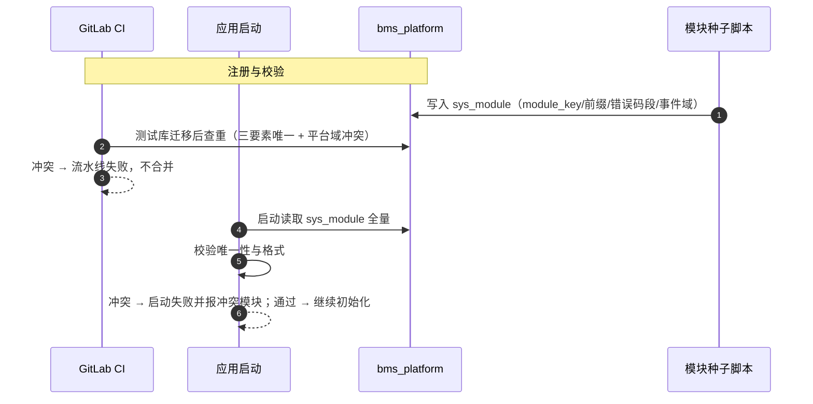

# 概要设计 · 模块注册

> BMS · 业务模块注册表 sys_module 与注册校验（平台基础能力）

[概要设计](01_概要设计_总览.md) › 02-模块注册　|　[← 01-概要设计（总纲）](01_概要设计_总览.md) · [03-用户管理 →](03_概要设计_用户管理.md)

## 1. 模块概述与职责 

本节对应[《项目规划说明》](../../规划/项目规划说明.md)「附加业务模块规划」（23 章）与「核心数据表清单」（sys_module）；架构设计依据[《架构设计》](../架构设计/01_架构设计_总览.md)[07-模块注册](../架构设计/07_架构设计_子系统_模块注册.md)节点。

- **模块定位**：平台级基础能力（非用户可见业务模块），阶段一项目骨架交付：平台库 sys_module 统一登记业务模块的模块简称、表前缀、错误码段与事件域，启动与 CI 校验唯一，为附加业务模块（销售/仓储等）提供注册制接入底座。
- **职责边界**：只管"模块注册与校验"本身——注册表维护（开发期种子）、唯一性校验（启动/CI）、平台超管只读视图；模块的业务权限码注册（sys_business/sys_action）、菜单挂接等归对应机制（见权限计算引擎、菜单管理节点）。
- **协作关系**：与 sys_business/sys_action 同为平台库种子机制；错误码段与事件域以本注册表为权威，供接口与集成、事件总线引用。

## 2. 功能分解与业务流程 

### 2.1 功能点分解 

| 功能点 | 说明 | 权限码 |
| --- | --- | --- |
| 模块注册（开发期种子） | 新增业务模块时以种子数据登记 module_key、table_prefix、errcode_segment、event_domain、status（含 i18n 附表英文文案） | —（开发期） |
| 启动唯一性校验 | 应用启动读取 sys_module，校验表前缀/错误码段/事件域唯一且格式正确，冲突即启动失败并给出冲突模块 | —（启动期） |
| CI 校验 | 流水线对种子与迁移脚本执行同规则校验（测试库迁移后查重），冲突不允许合并 | —（CI 期） |
| 平台超管查看 | 平台超管运营视图只读查询模块注册表（模块/前缀/错误码段/事件域/状态），便于核对与排障 | sys（平台超管） |

### 2.2 业务规则 

- 三要素唯一：table_prefix、errcode_segment、event_domain 在 sys_module 内全局唯一，且不得与平台域内置种子（sys/wf/rpt/ai）冲突。
- 格式约束：table_prefix 形如 {简称}_（如 pur_）；errcode_segment 为两位段号（10 起）；event_domain 默认与 module_key 一致，为多事件域模块预留扩展。
- 注册先行：新模块必须先注册 sys_module 再建表/建码/建菜单，错误码段与事件命名以注册值为准。
- 租户隔离：sys_module 位于平台库，租户侧可见、不可增删；租户开通时无需复制（与 sys_business 同模式，平台统一维护）。
- 独立服务轨不注册：独立部署的服务不进平台库与租户库，仅经认证/开放接口/Webhook 集成。
- 租户开关分离：租户开通的模块清单存 sys_tenant_module（平台库，运行期可配），module_key 只允许引用本表已注册且启用的模块；启停由租户管理模块（平台超管）维护，本模块不提供开关操作（见 26-租户管理）。

### 2.3 流程步骤 

1. 模块立项：确定模块简称、表前缀、业务码、错误码段、事件域，查注册表确认不冲突。
2. 种子注册：编写 sys_module 种子（Alembic 数据迁移或种子脚本，含 sys_module_i18n 文案），提交 MR。
3. CI 校验：流水线在测试库执行迁移后校验唯一性，冲突不通过。
4. 启动校验：应用启动重复校验，冲突即失败（双保险）。
5. 建表建码：按注册值创建 {前缀}_ 业务表、注册 sys_business/sys_action、挂接菜单/表单/按钮/字段种子。
6. 发布验收：模块随版本发布，注册表状态置启用。

## 3. 关键时序与协作 

协作要点：注册表为平台库静态元数据，无运行时写路径（页面不提供增删），校验为幂等只读操作，启动开销可忽略。

## 4. 数据模型与表设计 

遵循核心数据表统一规范：雪花 ID、软删除、审计字段、乐观锁、时间 UTC 存储。sys_module 位于**平台库**。

| 表 | 关键字段 | 说明 |
| --- | --- | --- |
| sys_module | module_key、name、table_prefix、errcode_segment、event_domain、status | 业务模块注册表：module_key 模块简称（如 purchase）；table_prefix 表前缀（如 pur_）；errcode_segment 错误码段号（如 10）；event_domain 事件域（如 purchase）；status 启用/停用 |
| sys_module_i18n | module_id、locale、name | 模块名多语言附表，联合主键（module_id + locale），缺省回退主表 name |
| sys_tenant_module | tenant_id、module_key、status（enabled/disabled）、opened_by、opened_at、closed_at | 【平台库】租户-模块关系表：module_key 逻辑引用 sys_module，仅允许已注册且启用的模块；租户开通勾选写入，平台超管运营期启停 |

- **索引与唯一约束**：module_key、table_prefix、errcode_segment、event_domain 均建唯一索引（含 deleted_at 复合唯一，软删除后释放）。
- **内置种子**：平台域 sys/wf/rpt/ai 与 MVP 业务模块 purchase（pur_/10）/payment（pay_/11）/supplier（sup_）为初始种子；销售（sale_/12）、仓储（wh_/13）预留。
- **数据流转**：开发期种子写入 → 启动/CI 校验 → 各机制引用（错误码分段、事件命名、前缀规范）。

## 5. 接口设计 

内部管理接口前缀 `/api/v1`，统一响应 `{code, message, data}`。

### 5.1 接口清单 

| 方法 | 路径 | 说明 | 权限码 / 鉴权 |
| --- | --- | --- | --- |
| GET | /api/v1/modules | 模块注册表列表（模块/前缀/错误码段/事件域/状态，分页 + 筛选），平台超管运营视图使用 | sys（平台超管） |
| GET | /api/v1/modules/{id} | 模块注册详情（含 i18n 名称按当前 locale） | sys（平台超管） |

### 5.2 公共要求 

- 分页：查询参数 page（从 1 起）、size；响应 {list, total, page, size}。
- 只读：本模块接口均为只读查询，不提供增删改（注册表维护走开发期种子）；写路径若未来开放须走平台超管 + 审计。
- 幂等与限流：查询接口按常规限流规则，无特殊要求。

### 5.3 发布事件 

本模块不发布业务事件；模块注册变更属开发期种子变更，随版本发布，不进入运行时事件总线。

## 6. 权限与配置 

- **权限码**：无独立业务码；注册表查看归平台超管（sys 业务），租户侧不可见不可操作。
- **菜单挂接**：平台超管运营视图（可选菜单「模块注册表」，随平台菜单种子下发）。
- **种子数据**：平台域内置种子（sys/wf/rpt/ai）+ MVP 业务模块种子（purchase/payment/supplier），含 sys_module_i18n 英文文案。
- **sys_config**：无配置项；校验规则随版本固定。

## 7. 错误码与异常处理 

错误码 5/6 位数字，段号 + 段内序号，一经发布稳定不变；文案由前端按 i18n 映射（error.{code}），后端不承担文案拼装。本模块错误码：

| 段 | 区间 | 覆盖场景 |
| --- | --- | --- |
| 1xxxx（通用） | 10001-19999 | 模块注册冲突/格式错误等平台内部校验错误（段内序号分配见详细设计） |

- 错误码覆盖：module_key 重复、table_prefix 冲突、errcode_segment 冲突、event_domain 冲突、格式错误（非 {简称}_、非两位段号）、与平台域种子冲突。
- 异常处理要求：启动校验失败直接拒绝启动并输出冲突模块清单；CI 校验失败使流水线不通过；均为确定性校验，无运行时降级。

## 8. 页面清单与验收要点 

| 端 | 页面 | 说明 |
| --- | --- | --- |
| PC 管理端 | 模块注册表（平台超管运营视图，可选） | 只读列表与详情（模块/前缀/错误码段/事件域/状态），无增删改入口 |
| 移动端 H5 | 无页面 | 平台基础能力，不面向租户 |

**验收要点**（对齐《项目规划说明》阶段一完成标准）：

- 注册表种子完整：平台域（sys/wf/rpt/ai）与 MVP 业务模块（purchase/payment/supplier）齐备，含 i18n 英文文案；
- 启动校验生效：构造前缀/错误码段/事件域冲突种子后启动被拒并输出冲突模块；
- CI 校验生效：冲突种子提交后流水线失败、不允许合并；
- 三库方言验证：sys_module 迁移脚本在 MySQL/PostgreSQL/达梦 DM8 均可执行，唯一索引生效；
- 租户开关校验：sys_tenant_module 只能引用已注册且启用的模块（引用未注册模块被拒）；停用模块在租户侧菜单/接口不可用、存量数据保留、重新开通恢复（验证见 26-租户管理验收）。

> 概要设计节点 · 与《项目规划说明》《架构设计》《文档生成规范》《命名规范》配套 · 生成日期：2026-08-14