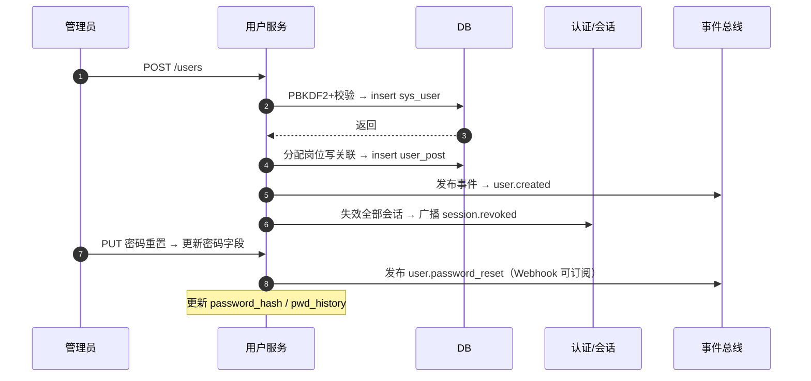

# 概要设计 · 用户管理

> BMS · 用户生命周期与账号治理

[概要设计](01_概要设计_总览.md) › 03-用户管理　|　[← 01-概要设计（总纲）](01_概要设计_总览.md) · [04-用户喜好 →](04_概要设计_用户喜好.md)

## 1. 模块概述与职责 

本节对应[《项目规划说明》](../../规划/项目规划说明.html)「功能模块」之**用户管理**模块，与「核心数据表清单」「认证与安全」「权限模型」「事件总线事件模型」章节。架构设计依据[《架构设计》](../架构设计/01_架构设计_总览.md)10-认证与会话、11-权限计算引擎节点。

用户管理负责用户生命周期的全量治理：账号的增删改查、启用/停用、密码重置、岗位分配、主体角色绑定、SSO 身份绑定查看，以及账号锁定/解锁（锁定列表、手动解锁、解锁记录审计）。模块承载 `sys_user` 密码策略字段（`pwd_reset_required / pwd_changed_at / pwd_history / last_login_at`）与个人化字段（`locale / timezone`），并衔接 Excel 批量导入（`import:execute`）。

职责边界：密码的哈希与校验（PBKDF2）、登录防爆破、双 token 签发、会话生命周期属于《认证与会话》子系统；本模块只负责账号数据治理与密码重置动作，不触碰会话实现细节。角色授予本体在[角色管理](06_概要设计_角色管理.md)（`role:grant`），本模块提供「主体角色绑定」的功能入口并按 `user` 业务收敛权限码。

## 2. 功能分解与业务流程 

### 2.1 功能点分解 

| 功能点 | 说明 | 权限码 |
| --- | --- | --- |
| 用户列表/详情 | 筛选（username/nickname/email/phone/status/dept_id/岗位）、分页查询 | user:query |
| 新建用户 | 创建账号并初始化密码（哈希存储）；可选分配部门/岗位；强制首登改密开关 | user:create |
| 修改用户 | 昵称/邮箱/手机/部门/语言/时区等基础信息维护；`locale/timezone` 供时区与多语言展示 | user:update |
| 启用/停用 | status 切换；停用即时失效会话（踢出），复用会话子系统能力 | user:update |
| 删除用户 | 软删除（deleted_at）；同步清理账号锁定记录并注销在线会话 | user:delete |
| 重置密码 | 管理员重置：PBKDF2 重新哈希、强制首登改密、失效全部会话、可发通知 | user:reset_pwd |
| 分配岗位 | 维护 sys_user_post 多对多关系，关联岗位部门级联展示 | user:assign_role |
| 主体角色绑定 | 查看/维护该用户直接绑定的角色（角色管理侧亦可按主体维度绑定） | user:assign_role |
| SSO 身份绑定查看 | 查看 sys_user_identity 全局身份映射（IdP、外部账号）；绑定管理在 sso 业务 | user:query |
| 锁定列表/手动解锁 | 查询 sys_account_lock 锁定记录，手动解锁（记录解锁人与时间） | user:unlock |
| Excel 批量导入 | 衔接导入导出模块（`import:execute`），模板校验后批量建号 | import:execute |

### 2.2 业务规则 

- 唯一性：`username` 唯一，采用 `(username, deleted_at)` 复合唯一索引——删除即释放用户名，三库均允许多个 NULL 不冲突
- 密码策略（sys_config 可配）：复杂度校验（长度/字符组合）、90 天有效期强制改密（`pwd_changed_at` 驱动）、近 5 次历史密码不可重复（`pwd_history`）、180 天未登录自动锁定（定时任务扫描 `last_login_at`）
- 账号锁定类型：`fail_limit`（登录失败触发，认证子系统写入）/ `inactive`（长期未登录，任务写入）/ `manual`（管理员手动锁定）；本模块负责查看与手动解锁
- 停用/锁定/删除的用户：登录即被拒绝；停用与删除时注销该用户全部在线会话（删 Redis 会话标记 + 吊销 refresh）
- 安全约束：不得停用/删除当前操作人自身；内置管理员（系统/安全/审计）不得被停用删除，且同一用户不得兼任两类管理员（三权分立）
- 重置密码后强制失效该账号全部会话；被重置用户 `pwd_reset_required=true`，下次登录必须改密
- 批量导入：同模板字段校验（用户名唯一、格式校验），逐行失败可跳过并输出失败明细，整体提交用幂等键防重

### 2.3 流程步骤 

1. **新建用户**：填表单（含初始密码/强制改密标志）→ 校验用户名唯一与密码复杂度 → PBKDF2 哈希入库 → 分配岗位 → 发布 `user.created` → 落操作日志与字段级审计
2. **重置密码**：校验操作人权限（user:reset_pwd）→ 新密码策略校验 → 更新 `password_hash / pwd_changed_at / pwd_history / pwd_reset_required` → 作废全部会话 → 发布 `user.password_reset`（Webhook 可订阅）
3. **解锁**：查看锁定列表（含锁定类型/时间/原因）→ 手动解锁 → 写 `sys_account_lock.unlock_at / unlock_by` → 落操作日志（解锁动作审计）
4. **异常分支**：用户名冲突（30002）→ 提示修改；账号已锁定/已停用仍可维护资料但不可登录；删除失败（存在未解除的引用或内置管理员）→ 明确错误码返回，不做部分提交

## 3. 关键时序与协作 

协作要点：重置密码/停用/删除的会话失效复用《认证与会话》的踢出通道（Redis 会话标记删除 + refresh 吊销 + Socket.IO 广播），本模块仅发起动作；用户变更影响权限计算时，权限引擎按 `sys_role_assign` 主体绑定变化触发权限版本 +1，保证权限变更即时生效。

## 4. 数据模型与表设计 

### 4.1 核心表 

| 表 | 关键字段 | 说明 |
| --- | --- | --- |
| sys_user | username、password_hash、nickname、email、phone、status、dept_id、avatar、pwd_reset_required、pwd_changed_at、pwd_history、last_login_at、locale、timezone | 用户主表（租户库）；密码策略字段与语言/时区偏好；软删除 + 审计字段 + version 乐观锁 |
| sys_user_post | user_id、post_id | 用户-岗位多对多关联，联合主键；岗位归属部门经 sys_post.dept_id 派生 |
| sys_role_assign | subject_type（user/post/dept…）、subject_id、role_id | 主体-角色通用绑定，subject_type=user 即本模块主体绑定记录；权限计算收敛为用户→角色 |
| sys_account_lock | user_id、lock_type（fail_limit/inactive/manual）、locked_at、unlock_at、unlock_by | 账号锁定/解锁记录（解锁操作审计依据） |
| sys_user_identity | idp_key、external_id、tenant_id、user_id | 【平台库】SSO 全局身份映射，本模块只读展示（sso:bind 管理） |

### 4.2 索引与唯一约束 

- `sys_user`：复合唯一索引 `(username, deleted_at)`；索引 `dept_id`、`status`、`last_login_at`（未登录扫描任务用）
- `sys_user_post`：联合主键 (user_id, post_id)，另建 post_id 反向索引支撑「岗位下用户」查询
- `sys_role_assign`：索引 (subject_type, subject_id) 与 (role_id)，支撑主体链收敛与角色反向查询
- `sys_account_lock`：索引 (user_id, locked_at) 与 (unlock_by)；解锁记录保留 90 天后随审计归档

### 4.3 数据流转 

- 创建/更新/删除经 ORM 事件自动落审计字段与字段级变更审计（sys_data_audit_log，按月分表）
- 用户变更经 RocketMQ 事件驱动：操作日志异步落库、Webhook 推送、全文检索主数据索引同步（阶段十四）
- 删除为软删除：数据进回收站（recycle 业务查看/恢复）；过期残留由 Celery 定时物理清理
- 解锁记录与字段级审计同属审计域：90 天热表后按归档策略冷化，哈希链随归档导出

## 5. 接口设计 

### 5.1 接口清单 

| 方法 | 路径 | 说明 | 权限码 |
| --- | --- | --- | --- |
| GET | /api/v1/users | 用户列表（page/size；username/nickname/status/dept_id/岗位筛选） | user:query |
| POST | /api/v1/users | 新建用户（支持 Idempotency-Key） | user:create |
| GET | /api/v1/users/{id} | 用户详情（含部门/岗位/角色绑定摘要） | user:query |
| PUT | /api/v1/users/{id} | 修改用户（version 乐观锁） | user:update |
| DELETE | /api/v1/users/{id} | 软删除用户 | user:delete |
| PUT | /api/v1/users/{id}/status | 启用/停用（停用即时失效会话） | user:update |
| PUT | /api/v1/users/{id}/password | 重置密码（强制改密、失效会话） | user:reset_pwd |
| PUT | /api/v1/users/{id}/posts | 分配岗位（全量覆盖提交） | user:assign_role |
| GET | /api/v1/users/{id}/roles | 主体角色绑定查看 | user:query |
| GET | /api/v1/users/{id}/identities | SSO 身份绑定查看（sys_user_identity） | user:query |
| GET | /api/v1/locks | 账号锁定列表（类型/时间/解锁状态筛选） | user:query |
| PUT | /api/v1/locks/{id}/unlock | 手动解锁（记录 unlock_by） | user:unlock |
| POST | /api/v1/imports/users | Excel 批量导入（衔接导入导出模块） | import:execute |

### 5.2 分页/幂等/限流 

- 分页统一 `page`（从 1 起）/ `size`，响应 `{list, total, page, size}`；常规列表 limit/offset（限深 100 页）
- 幂等：新建用户、批量导入等写接口支持请求头 `Idempotency-Key`——Redis SETNX 前置拦截 + 幂等键字段唯一约束兜底
- 限流：用户列表按用户维度限流（slowapi，Redis 后端）；重置密码、导入接口叠加更严限流防滥用
- 统一响应 `{code, message, data}`；登录/刷新外的全部接口 Bearer access token + `require_permission` 两级校验

### 5.3 事件发布 

| 事件 | 触发时机 | 主要载荷 | Webhook 订阅 |
| --- | --- | --- | --- |
| user.created / user.updated / user.deleted | 用户创建/修改/删除后 | 用户 ID、username、dept_id、status | 是 |
| user.password_reset | 管理员重置密码或自助找回后 | 用户 ID | 是 |
| sso.user.jit_created | SSO 首登自动建号 | user_id、idp_key | 是 |

## 6. 权限与配置 

### 6.1 权限码 

本模块对应 `user` 业务（sys_business 平台库维护，默认归属系统管理员），动作按 sys_action 分配：

| 权限码 | 动作 | 说明 |
| --- | --- | --- |
| user:query | query | 列表/详情/锁定列表/SSO 绑定查看 |
| user:create / user:update / user:delete | create / update / delete | 账号增删改与启停 |
| user:reset_pwd | reset_pwd | 重置密码 |
| user:unlock | unlock | 手动解锁 |
| user:assign_role | grant | 分配岗位/主体角色绑定 |
| import:execute | execute | Excel 批量导入（import 业务） |

### 6.2 菜单挂接 

- 菜单「用户管理」（form=user_form，挂 user 业务）与「账号锁定」（form=lock_form）
- 按钮挂接：新增/编辑/删除（create/update/delete）、重置密码（reset_pwd）、启用/停用（update）、分配岗位（grant）、解锁（unlock）、导入（import:execute）——默认无按钮权限，按角色授予后显隐
- 字段权限：手机号/邮箱等敏感字段注册脱敏标记（data:plain 查看明文）；字段可见可编辑由 sys_role_field 按角色收窄

### 6.3 sys_config 参数 

| 参数 | 默认 | 说明 |
| --- | --- | --- |
| pwd.min_length / pwd.complexity | 8 / 字母+数字 | 密码复杂度 |
| pwd.expire_days | 90 | 密码有效期，pwd_changed_at 驱动强制改密 |
| pwd.history_count | 5 | 历史密码不可重复数 |
| pwd.lock_inactive_days | 180 | 未登录自动锁定阈值（定时任务扫描 last_login_at） |
| session.max_active | 5 | 活跃会话上限（多端并发） |

### 6.4 种子数据 

- 平台库种子：user 业务码与动作码（create/update/delete/query/reset_pwd/unlock/grant）、用户管理/账号锁定菜单表单按钮字段挂接与 i18n 文案
- 租户开通种子：初始系统管理员账号（租户开通首建，由其创建安全/审计管理员）、内置三类管理员角色互斥预授

## 7. 错误码与异常处理 

本模块错误码段 3xxxx（用户与组织）。非 0 即业务错误，文案由前端按 i18n 映射，后端不承担文案拼装。

| 错误码 | 说明 |
| --- | --- |
| 30001 | 用户不存在 |
| 30002 | 用户名已存在 |
| 30003 | 账号已锁定 |
| 30004 | 账号已停用 |
| 30005 | 密码不符合复杂度策略 |
| 30006 | 新密码与近 5 次历史密码重复 |
| 30007 | 锁定记录不存在或已解锁 |
| 30008 | 用户已删除（软删除） |
| 30009 | 内置管理员不可停用/删除，或操作人不得操作自身 |
| 30010 | 三权分立约束：同一用户不得兼任两类管理员 |
| 30011 | 用户仍被角色/流程引用，禁止删除 |

异常处理要求：多步骤写操作（建号+分配岗位）显式事务边界，任一步失败整体回滚；并发冲突用 version 乐观锁返回 30001 上下文错误；敏感字段（密码、token）日志脱敏，不落原始值；导入文件逐行失败收集明细，不中断整体。

## 8. 页面清单与验收要点 

### 8.1 页面清单 

| 页面 | 端 | 说明 |
| --- | --- | --- |
| 用户管理 | PC | 列表筛选、新建/编辑/删除、启停、重置密码、分配岗位、主体角色绑定、SSO 身份绑定查看、导入入口 |
| 账号锁定 | PC | 锁定列表（类型/时间/解锁状态）、手动解锁、解锁记录 |

### 8.2 验收标准 

- 用户 CRUD 全链路可用，软删除后回收站可见、username 可复用（复合唯一索引生效）
- 重置密码后强制改密生效、全部会话失效；停用/删除即时踢出（Redis 标记 + Socket.IO）
- 锁定列表/手动解锁可用、解锁记录（unlock_by/unlock_at）可查，解锁动作落操作日志
- 分配岗位后权限计算即时生效（权限版本 +1）；三权分立互斥校验通过
- 批量导入成功/失败明细可查，幂等键防重提交验证通过；user.* 事件 Webhook 推送成功
- 密码策略（复杂度/90 天/近 5 次历史/180 天未登录锁定）强制执行；字段级审计与哈希链校验通过

> 本文档为 AI 生成 · 概要设计节点 · 与《项目规划说明》《架构设计》《文档生成规范》《命名规范》配套 · 生成日期：2026-08-06