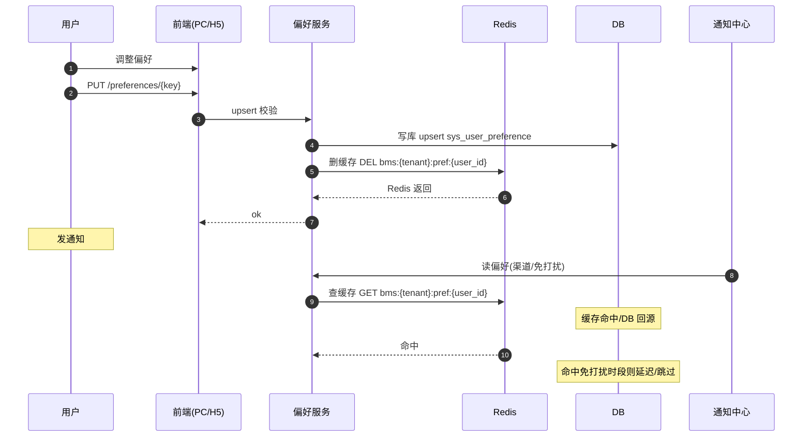

# 概要设计 · 用户喜好

> BMS · 主题、列表个性化与通知偏好

[概要设计](01_概要设计_总览.md) › 04-用户喜好　|　[← 03-用户管理](03_概要设计_用户管理.md) · [05-岗位管理 →](05_概要设计_岗位管理.md)

## 1. 模块概述与职责 

本节对应[《项目规划说明》](../../规划/项目规划说明.md)「功能模块」之**用户喜好**模块，与「核心数据表清单」（sys_user_preference）、「前端页面清单与菜单机制」「[国际化管理](30_概要设计_国际化管理.md)」章节。架构设计依据[《架构设计》](../架构设计/01_架构设计_总览.md)28-前端架构、10-认证与会话节点。

用户喜好模块管理登录用户的个人化偏好：主题模式（深色/浅色）、列表页个性化（列显隐/顺序/宽度、每页条数、密度）、通知偏好（站内信/邮件/短信渠道开关、免打扰时段）、工作台自定义（快捷入口/卡片排序）。偏好统一存 `sys_user_preference`（user_id + pref_key 联合主键、pref_value JSON），PC 与移动端跨端同步。

职责边界：语言（`locale`）与时区（`timezone`）偏好已有，存于 `sys_user` 并在个人中心维护，本模块不重复存储；主题/列表/通知/工作台四类偏好与本模块，登录用户即可读写，不设独立权限码。

## 2. 功能分解与业务流程 

### 2.1 功能点分解 

| 功能点 | 说明 | 存储键（pref_key 约定） |
| --- | --- | --- |
| 主题模式 | 深色/浅色/跟随系统；切换即时生效并持久化 | ui.theme |
| 列表页个性化 | 每张列表页的列显隐/顺序/宽度、每页条数、表格密度 | list.{form_key}（列配置 JSON） |
| 通知偏好 | 站内信/邮件/短信渠道开关（逐通知类型）、免打扰时段 | notify.channels、notify.dnd |
| 工作台自定义 | 快捷入口集合与顺序、卡片排序/显隐 | dashboard.layout |
| 语言/时区 | 个人中心维护 sys_user.locale / timezone（已有能力，本模块只读引用） | — |

### 2.2 业务规则 

- 偏好按 key 存储，值统一 JSON 序列化（跨端通用）；未知 key 拒绝写入，防脏数据
- 免打扰时段生效时：站内信/推送仍落库不实时触达，邮件/短信延迟至时段结束后补发（或按类型配置是否补发）
- 列表个性化按表单维度（form_key）隔离，不同列表互不影响；列宽/顺序仅作用于展示层
- 跨端同步：偏好存后端库，PC 与移动端登录同一账号读取同一份数据；前端以本地缓存为快速回退（登录拉取后覆盖）
- 主题切换为前端即时态 + 后端持久化，刷新后不丢失；无需实时广播
- 偏好数据不参与权限计算、不参与审计链（非敏感业务数据），仅落操作日志（修改动作）

### 2.3 流程步骤 

1. **读取偏好**：登录成功 → 前端拉取 `GET /preferences`（Redis 缓存，短 TTL）→ 应用到主题/列表/通知/工作台渲染
2. **保存偏好**：用户在个人中心或页面内调整 → `PUT /preferences/{key}`（upsert）→ 写库 + 删缓存 → 前端本地态同步
3. **免打扰校验**（通知链路）：通知中心发送前读取 notify.dnd 与渠道开关 → 命中则延迟/跳过（邮件短信走任务重排）
4. **异常分支**：偏好值 JSON 解析失败 → 回退默认值并告警；写入超过单 key 大小上限（如 64KB）→ 拒绝并提示

## 3. 关键时序与协作 

协作要点：偏好读写与「通知中心」协作（发送前按渠道开关与免打扰时段过滤/重排）；与「前端架构」协作（主题变量、表格列配置、工作台卡片均按偏好 JSON 渲染）；Redis 缓存键 `bms:{tenant}:pref:{user_id}`，先写库后删缓存。

## 4. 数据模型与表设计 

### 4.1 核心表 

| 表 | 关键字段 | 说明 |
| --- | --- | --- |
| sys_user_preference | user_id、pref_key、pref_value（JSON）、updated_at | 用户喜好（主题/列表个性化/通知偏好/工作台自定义）；user_id + pref_key 联合主键，无软删除 |
| sys_user（引用） | locale、timezone | 语言与时区偏好，个人中心维护，本模块只读引用 |

### 4.2 索引与唯一约束 

- 联合主键 (user_id, pref_key) 天然覆盖查询与唯一性；无需额外索引
- 用户删除时级联清理其全部偏好行（与回收站语义一致，偏好不随软删除保留）
- 历史偏好版本不做留存（无审计要求）；updated_at 记录最近修改时间

### 4.3 数据流转 

- 写路径：接口 upsert → 事务写库 → 删除该用户偏好缓存（先写库后删缓存）
- 读路径：Redis 缓存（短 TTL + 随机偏移）→ 未命中查库 → 回填缓存；缓存故障直连 DB
- 迁移：pref_value 为跨方言 JSON 类型；老版本偏好以默认值兜底，不做数据回迁

## 5. 接口设计 

### 5.1 接口清单 

| 方法 | 路径 | 说明 | 权限码 |
| --- | --- | --- | --- |
| GET | /api/v1/preferences | 当前用户全部偏好（登录即可） | —（登录用户） |
| GET | /api/v1/preferences/{key} | 单个偏好值（缺省返回默认值） | —（登录用户） |
| PUT | /api/v1/preferences/{key} | 保存单个偏好（upsert，JSON 校验） | —（登录用户） |
| PUT | /api/v1/preferences/batch | 批量保存（工作台/列表配置整体提交） | —（登录用户） |
| DELETE | /api/v1/preferences/{key} | 恢复默认（删除该 key） | —（登录用户） |

### 5.2 分页/幂等/限流 

- 偏好为单用户级数据，不启用分页；批量保存接口支持幂等键（Idempotency-Key）防重复提交
- 限流：按用户维度叠加（slowapi），防止恶意高频写偏好（如 30 次/分钟）
- 统一响应 `{code, message, data}`；仅登录态（Bearer access token），无 require_permission 业务校验
- pref_key 白名单校验（服务端枚举），非法 key 返回 400；pref_value 大小上限校验

### 5.3 事件发布 

本模块不发布领域事件（偏好为个人数据，无跨模块/Webhook 订阅诉求）。

## 6. 权限与配置 

### 6.1 权限码 

无独立权限码：偏好属于登录用户个人数据，接口仅要求登录态即可读写（随用户管理业务体系，不做租户管理角色分配）。

### 6.2 菜单挂接 

- 无独立菜单：入口为「个人中心」页签（偏好设置），PC 与移动端均有；工作台自定义在首页工作台内直接编辑
- 个人中心同时承载改密/语言/时区/偏好四类设置（语言时区走 sys_user 接口）

### 6.3 sys_config 参数 

| 参数 | 默认 | 说明 |
| --- | --- | --- |
| pref.key_max_size | 65536（字节） | 单条偏好值大小上限 |
| pref.max_keys | 200 | 单用户偏好 key 数上限（防滥用） |
| notify.dnd_apply_delayed | true | 免打扰时段内通知是否延迟补发（邮件/短信） |

### 6.4 种子数据 

- 初始化种子：无偏好数据（用户首次登录应用默认值）；默认主题浅色、列表默认配置、通知渠道全开、工作台默认卡片布局由前端常量提供
- 偏好 key 白名单随版本维护，新增偏好类型由后端枚举扩展（免迁移）

## 7. 错误码与异常处理 

本模块错误码段 3xxxx（用户与组织），文案由前端按 i18n 映射。

| 错误码 | 说明 |
| --- | --- |
| 30021 | 偏好 key 不在白名单 |
| 30022 | 偏好值 JSON 解析失败或超出大小上限 |
| 30023 | 偏好 key 数量超限 |
| 30024 | 免打扰时段配置非法（起止时间颠倒） |

异常处理要求：读偏好解析失败一律回退默认值并返回成功（不影响主流程）；写偏好失败返回明确错误码，不静默；批量保存为单事务，部分 key 非法时整批拒绝并回滚。

## 8. 页面清单与验收要点 

### 8.1 页面清单 

| 页面 | 端 | 说明 |
| --- | --- | --- |
| 个人中心偏好设置 | PC + 移动端 | 主题模式、通知偏好（渠道开关/免打扰时段）、语言/时区（sys_user） |
| 工作台设置（内嵌） | PC + 移动端 | 快捷入口、卡片排序与显隐；列表页内列设置弹窗（逐列表） |

### 8.2 验收标准 

- 主题深色/浅色切换即时生效且刷新后保持；PC 与移动端登录同一账号偏好一致（跨端同步验证）
- 列表列显隐/顺序/宽度、每页条数、密度按表单维度隔离保存，刷新/重进不丢失
- 通知渠道开关生效：关闭邮件后不发送、关闭站内信后不落待办角标；免打扰时段内延迟或跳过验证通过
- 工作台快捷入口与卡片排序可自定义并跨端同步
- 偏好接口无权限码校验（登录即可），写路径落操作日志；非法 key/超限拒绝

> 概要设计节点 · 与《项目规划说明》《架构设计》《文档生成规范》《命名规范》配套 · 生成日期：2026-08-06