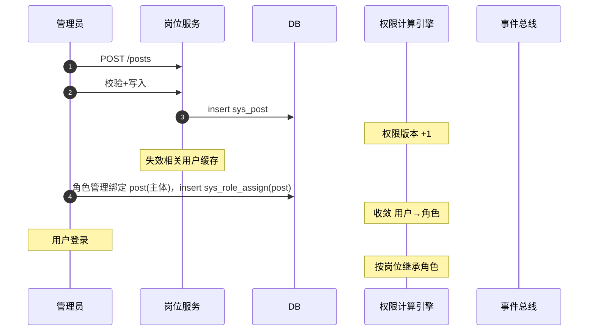

# 概要设计 · 岗位管理

> BMS · 岗位定义与主体链角色分配

[概要设计](01_概要设计_总览.md) › 05-岗位管理　|　[← 04-用户喜好](04_概要设计_用户喜好.md) · [06-角色管理 →](06_概要设计_角色管理.md)

## 1. 模块概述与职责 

本节对应[《项目规划说明》](../../规划/项目规划说明.md)「功能模块」之**岗位管理**模块，与「核心数据表清单」（sys_post、sys_user_post、sys_role_assign）、「权限模型」（主体链）章节。架构设计依据[《架构设计》](../架构设计/01_架构设计_总览.md)11-权限计算引擎节点。

岗位管理负责岗位定义的增删改查（归属部门 `dept_id`、`code / name / sort / status`）与用户-岗位多对多维护（sys_user_post），并作为主体链中间实体参与角色分配（`sys_role_assign` subject_type=post）。

职责边界：岗位不直接授权，只承载「用户 → 岗位 → 角色」链条的角色绑定关系；绑定操作入口在[角色管理](06_概要设计_角色管理.md)（role:grant）与本模块的只读回显；岗位变更驱动权限计算版本失效，由权限计算引擎消费。

## 2. 功能分解与业务流程 

### 2.1 功能点分解 

| 功能点 | 说明 | 权限码 |
| --- | --- | --- |
| 岗位列表/详情 | 按部门/状态/关键字筛选，分页或树形视图 | post:query |
| 新建岗位 | 归属部门、code/name、排序、状态 | post:create |
| 修改岗位 | 名称/归属部门/排序/状态调整 | post:update |
| 删除岗位 | 软删除；存在用户或角色绑定时拒绝 | post:delete |
| 岗位下用户查看 | 反查 sys_user_post（该岗位在职用户） | post:query |
| 岗位角色绑定回显 | 查看岗位已绑定的角色（主体链中间实体） | post:query |

### 2.2 业务规则 

- 唯一性：岗位 code 租户内唯一，复合唯一索引 `(code, deleted_at)`；name 可重复但建议唯一
- 岗位归属部门必须存在且启用；岗位状态 status：enabled/disabled，停用岗位不再参与主体链权限收敛（权限计算过滤）
- 删除约束：岗位仍有关联用户（sys_user_post）或角色绑定（sys_role_assign subject_type=post）时禁止删除，先解绑/调岗
- 岗位变更（增删改/启停）触发权限版本号 +1，相关用户权限缓存即时失效
- 用户-岗位为多对多：一个用户可任多岗，一个岗位可多人任职；删除用户级联清理其 sys_user_post 记录

### 2.3 流程步骤 

1. **新建岗位**：选择归属部门 → 校验 code 唯一 → 入库（审计字段自动填充）→ 触发权限版本 +1 → 落操作日志与字段级审计
2. **分配用户**（用户管理侧入口）：用户管理调用 post 查询可选岗位 → 写入 sys_user_post（联合主键防重）
3. **删除岗位**：检查关联用户与角色绑定 → 有则拒绝（明确提示）→ 无则软删除 → 版本 +1
4. **异常分支**：停用岗位后其绑定角色仍保留（恢复启用即恢复继承），不自动解绑；code 冲突返回错误码

## 3. 关键时序与协作 

协作要点：主体链收敛由权限计算引擎统一处理——从用户出发沿 sys_role_assign 收集「用户直接 + 岗位 + 部门」绑定角色，多链取并集去重；岗位启停直接改变收敛结果（版本失效后即时生效）；岗位变更不发布领域事件（无 Webhook 订阅场景，权限链一致性靠版本机制保证）。

## 4. 数据模型与表设计 

### 4.1 核心表 

| 表 | 关键字段 | 说明 |
| --- | --- | --- |
| sys_post | code、name、dept_id、sort、status | 岗位主表（租户库）；归属部门；软删除 + 审计字段 + version |
| sys_user_post | user_id、post_id | 用户-岗位多对多关联，联合主键；无软删除，用户删除级联清理 |
| sys_role_assign | subject_type（post…）、subject_id、role_id | 主体-角色通用绑定；subject_type=post 即岗位角色绑定；新增实体仅扩枚举 |

### 4.2 索引与唯一约束 

- `sys_post`：复合唯一索引 `(code, deleted_at)`；索引 dept_id、status、sort
- `sys_user_post`：联合主键 (user_id, post_id)；索引 post_id（岗位下用户反查）
- `sys_role_assign`：索引 (subject_type, subject_id) 支撑主体链收敛；索引 role_id 支撑反向查询

### 4.3 数据流转 

- 岗位增删改经 ORM 事件落字段级变更审计（sys_data_audit_log，按月分表）
- 岗位软删除数据进回收站（recycle 恢复即清除 deleted_at，恢复动作落审计）；过期残留由 Celery 物理清理
- 岗位数据纳入全文检索主数据索引（阶段十四，用户/部门/角色/字典/单据搜索），经 RocketMQ 事件驱动同步

## 5. 接口设计 

### 5.1 接口清单 

| 方法 | 路径 | 说明 | 权限码 |
| --- | --- | --- | --- |
| GET | /api/v1/posts | 岗位列表（page/size；dept_id/status/关键字筛选） | post:query |
| POST | /api/v1/posts | 新建岗位 | post:create |
| GET | /api/v1/posts/{id} | 岗位详情 | post:query |
| PUT | /api/v1/posts/{id} | 修改岗位（version 乐观锁） | post:update |
| DELETE | /api/v1/posts/{id} | 删除岗位（有引用拒绝） | post:delete |
| GET | /api/v1/posts/{id}/users | 岗位下用户列表 | post:query |
| GET | /api/v1/posts/{id}/roles | 岗位角色绑定回显（主体链） | post:query |

### 5.2 分页/幂等/限流 

- 列表分页 `page/size`，响应 `{list, total, page, size}`；岗位量级小，可另供全量下拉选项接口（不分页）
- 写接口支持 `Idempotency-Key` 幂等（Redis SETNX 前置拦截 + 唯一约束兜底）
- 限流：岗位写操作按用户维度叠加 slowapi 限制；查询走常规限流

### 5.3 事件发布 

本模块不发布独立领域事件；岗位变更经权限版本失效机制即时影响权限计算，角色绑定记录变更（sys_role_assign）落字段级审计。岗位数据供全文检索索引同步（事件由检索域统一触发）。

## 6. 权限与配置 

### 6.1 权限码 

本模块对应 `post` 业务（默认归属系统管理员），动作：`post:query`（查询）、`post:create`（新建）、`post:update`（修改/启停）、`post:delete`（删除）。岗位角色绑定操作使用 `role:grant`（角色管理侧，安全管理员）。

### 6.2 菜单挂接 

- 菜单「岗位管理」（form=post_form，挂 post 业务），置于系统管理菜单组
- 按钮挂接：新增/编辑/删除（create/update/delete）按角色授予后显隐；详情按钮（query）
- 三权分立：post 业务归属系统管理员角色，安全管理员可查看（由角色授权决定），不互斥冲突

### 6.3 sys_config 参数 

| 参数 | 默认 | 说明 |
| --- | --- | --- |
| post.code_pattern | ^[a-z][a-z0-9_-]{1,31}$ | 岗位 code 格式约束 |
| post.max_per_user | 10 | 单用户可任岗位数上限（防滥用） |

### 6.4 种子数据 

- 平台库种子：post 业务码与动作码（query/create/update/delete）、岗位管理菜单/表单/按钮/字段挂接与 i18n 文案
- 租户开通种子：无预置岗位（由系统管理员按组织创建）；不预置岗位角色绑定

## 7. 错误码与异常处理 

本模块错误码段 3xxxx（用户与组织），文案由前端按 i18n 映射。

| 错误码 | 说明 |
| --- | --- |
| 30031 | 岗位不存在 |
| 30032 | 岗位 code 已存在 |
| 30033 | 归属部门不存在或已停用 |
| 30034 | 岗位仍关联用户，禁止删除 |
| 30035 | 岗位仍绑定角色，禁止删除（需先解绑） |
| 30036 | 岗位 code 不符合格式约束 |

异常处理要求：删除前引用检查与删除在同一事务内（防并发插入引用）；并发删除用 version 乐观锁拒绝；岗位变更导致权限计算的版本递增操作失败时，回滚业务写入（一致性优先）。

## 8. 页面清单与验收要点 

### 8.1 页面清单 

| 页面 | 端 | 说明 |
| --- | --- | --- |
| 岗位管理 | PC | 岗位列表（按部门筛选）、新建/编辑/删除、启停、岗位下用户/角色绑定查看 |

### 8.2 验收标准 

- 岗位 CRUD 全链路可用；code 唯一与格式校验生效；软删除后回收站可恢复
- 用户分配岗位后（用户管理侧），权限计算按「用户→岗位→角色」收敛正确，多岗取并集去重验证通过
- 停用岗位后相关用户继承权限即时失效（权限版本 +1）；重新启用即恢复
- 删除约束验证：有关联用户/角色绑定的岗位拒绝删除并给出明确提示
- 字段级审计与操作日志落库，角色绑定变更哈希链校验通过

> 本文档为 AI 生成 · 概要设计节点 · 与《项目规划说明》《架构设计》《文档生成规范》《命名规范》配套 · 生成日期：2026-08-06