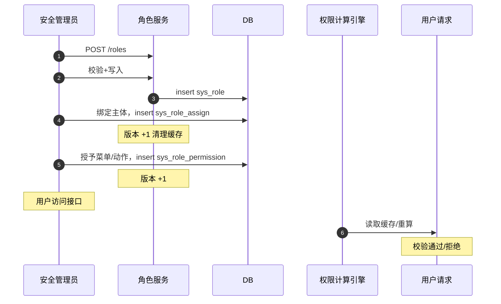

# 概要设计 · 角色管理

> BMS · 角色、授权与数据范围

[概要设计](01_概要设计_总览.md) › 06-角色管理　|　[← 05-岗位管理](05_概要设计_岗位管理.md) · [07-菜单管理 →](07_概要设计_菜单管理.md)

## 1. 模块概述与职责 

本节对应[《项目规划说明》](../../规划/项目规划说明.md)「功能模块」之**角色管理**模块，与「权限模型」「业务与动作清单（权限码总表）」「核心数据表清单」「[审计合规](29_概要设计_审计合规.md)」（三权分立）章节。架构设计依据[《架构设计》](../架构设计/01_架构设计_总览.md)11-权限计算引擎节点。

角色管理负责角色定义（`code / name / status`）、主体绑定（sys_role_assign，用户/岗位/部门任意主体链）、菜单/表单权限授予（业务权限按表单→业务对照关系推导）、动作权限授予（按钮级，默认无）、动作数据范围配置（sys_data_scope，默认无）与字段权限授予（sys_role_field，默认全部可见可编辑）。

职责边界：角色管理归**安全管理员**（三权分立），权限码命名 `业务:动作`；角色只做授权不承载业务数据；权限计算（主体链收敛、缓存与版本失效）由权限计算引擎承担，本模块仅维护授权数据。

## 2. 功能分解与业务流程 

### 2.1 功能点分解 

| 功能点 | 说明 | 权限码 |
| --- | --- | --- |
| 角色列表/详情 | 按 code/name/status 筛选分页 | role:query |
| 新建/修改/删除角色 | code/name/status；删除前校验引用 | role:create / role:update / role:delete |
| 主体绑定 | sys_role_assign：subject_type（user/post/dept…）+ subject_id + role_id，任意主体链；新增实体仅扩枚举 | role:grant |
| 菜单/表单权限授予 | sys_role_permission perm_type=menu/form；业务权限按「表单→业务」对照关系推导 | role:grant |
| 动作权限授予 | perm_type=action（按钮级），默认无任何按钮权限 | role:grant |
| 动作数据范围配置 | sys_data_scope：动作→范围规则（字段+运算符+预置变量），默认无数据权限，写读双向校验 | role:grant |
| 字段权限授予 | sys_role_field：visible/editable，默认全部可见可编辑，授予后收窄 | role:grant |

### 2.2 业务规则 

- 角色 code 租户内唯一（复合唯一索引 `(code, deleted_at)`）；内置角色（系统/安全/审计管理员）不可删改归属业务域
- 三权分立：三类内置管理员角色权限互斥、同一用户不得兼任；安全管理员管理角色时不得授予/修改自己的越权权限
- 权限分层不可越级：菜单权限隐含表单权限，表单权限隐含业务权限；业务权限不直接授予，由对照关系推导
- 动作权限默认全无：未授予按钮级动作的角色不显示任何按钮（前端显隐 + 后端 require_permission 双重控制）
- 数据范围默认无：未配置 sys_data_scope 的动作不附加数据范围条件；规则解析结果强制叠加租户过滤，不得跨租户
- 字段权限默认全开：未授予 sys_role_field 的字段全部可见可编辑；授予后不可见字段读时过滤（不返回不渲染）、不可编辑字段写时拒绝
- 授权变更即时生效：角色/授权/主体绑定变更 → 权限版本号 +1 并清理对应用户缓存
- 防止自锁：删除/停用角色前校验是否仍有主体绑定与有效授权引用

### 2.3 流程步骤 

1. **创建角色**：填写 code/name → 唯一性校验 → 入库 → 授权页面逐步授予菜单/表单/动作/字段权限与数据范围
2. **主体绑定**：选择主体类型（用户/岗位/部门）与主体 → 写入 sys_role_assign → 权限版本 +1 → 该主体关联用户缓存失效
3. **权限授予**：勾选菜单/表单树（自动推导业务权限）→ 勾选按钮动作（默认空）→ 批量写入 sys_role_permission
4. **数据范围配置**：选择动作 → 配置规则表达式（如 dept_id = @current_dept）→ 保存 sys_data_scope
5. **异常分支**：授予的菜单隐含表单/业务存在缺失（平台未挂接）→ 提示先完成菜单挂接；规则表达式非法 → 拒绝保存；版本递增失败 → 回滚

## 3. 关键时序与协作 

协作要点：授权数据写入后经版本失效即时生效（用户下次请求重算权限并回填缓存 `bms:{tenant}:perm:{user_id}:{version}`）；数据范围规则在数据访问层注入（读时）与写入口校验（写时）；角色/授权变更落字段级审计（审计哈希链）。

## 4. 数据模型与表设计 

### 4.1 核心表 

| 表 | 关键字段 | 说明 |
| --- | --- | --- |
| sys_role | code、name、status | 角色主表（租户库）；数据范围已移至动作级 sys_data_scope；软删除 + 审计字段 + version |
| sys_role_assign | subject_type（user/post/dept…）、subject_id、role_id | 主体-角色通用绑定，联合主键（subject_type+subject_id+role_id）；权限计算收敛为用户→角色 |
| sys_role_permission | role_id、perm_type（menu/form/action）、target_id | 角色授予菜单/表单/动作权限；业务权限按表单→业务对照推导；target_id 跨库逻辑引用平台码 |
| sys_role_field | role_id、form_id、field_id、visible、editable | 角色字段权限，联合主键（role_id+form_id+field_id）；默认全部可见可编辑，授予后收窄 |
| sys_data_scope | action_id、config（规则表达式） | 动作级数据范围配置（动作→范围规则），写读双向校验，默认无数据权限 |

### 4.2 索引与唯一约束 

- `sys_role`：复合唯一索引 `(code, deleted_at)`；索引 status
- `sys_role_assign`：联合主键 (subject_type, subject_id, role_id)；索引 (role_id)、索引 (subject_type, subject_id)
- `sys_role_permission`：索引 (role_id, perm_type)、索引 (target_id)（反查授权引用）
- `sys_role_field`：联合主键 (role_id, form_id, field_id)
- `sys_data_scope`：action_id 唯一（一动作一条范围规则）

### 4.3 数据流转 

- 角色/授权/主体绑定/字段权限/数据范围全部关键表，经 ORM 事件自动落字段级变更审计（sys_data_audit_log，按月分表）
- 角色软删除进回收站（recycle 恢复）；删除前清理解绑引用，恢复后授权数据不自动回补（按回收语义人工重授）
- 角色数据纳入全文检索主数据索引（阶段十四）

## 5. 接口设计 

### 5.1 接口清单 

| 方法 | 路径 | 说明 | 权限码 |
| --- | --- | --- | --- |
| GET | /api/v1/roles | 角色列表（code/name/status 筛选） | role:query |
| POST | /api/v1/roles | 新建角色 | role:create |
| GET | /api/v1/roles/{id} | 角色详情（含授权摘要） | role:query |
| PUT | /api/v1/roles/{id} | 修改角色（version 乐观锁） | role:update |
| DELETE | /api/v1/roles/{id} | 删除角色（有主体绑定拒绝） | role:delete |
| GET | /api/v1/roles/{id}/subjects | 主体绑定列表 | role:query |
| POST | /api/v1/roles/{id}/subjects | 绑定主体（user/post/dept…） | role:grant |
| DELETE | /api/v1/roles/{id}/subjects/{subject_type}/{subject_id} | 解绑主体 | role:grant |
| GET | /api/v1/roles/{id}/permissions | 菜单/表单/动作授权列表 | role:query |
| PUT | /api/v1/roles/{id}/permissions | 批量授予/撤销菜单/表单/动作 | role:grant |
| GET | /api/v1/roles/{id}/fields | 字段权限列表 | role:query |
| PUT | /api/v1/roles/{id}/fields | 批量设置字段权限（visible/editable） | role:grant |
| GET | /api/v1/roles/{id}/data-scopes | 动作数据范围列表 | role:query |
| PUT | /api/v1/roles/{id}/data-scopes | 配置动作数据范围规则 | role:grant |

### 5.2 分页/幂等/限流 

- 列表分页 `page/size`，响应 `{list, total, page, size}`；批量授予/绑定接口支持 `Idempotency-Key` 幂等
- 批量授权为单事务全量覆盖提交（先删后插），失败整体回滚；变更后统一触发权限版本 +1（一次递增，避免多次失效）
- 限流：角色写操作按安全管理员维度叠加 slowapi 限制；授权接口敏感操作落操作日志（含操作前后权限概要）

### 5.3 事件发布 

本模块不发布领域事件；授权变更经权限版本失效机制即时生效，变更明细落字段级审计（sys_data_audit_log）与操作日志，审计链按租户分区有序消费保证顺序。

## 6. 权限与配置 

### 6.1 权限码 

本模块对应 `role` 业务（默认归属**安全管理员**），动作：`role:query`（查询）、`role:create / role:update / role:delete`（增删改）、`role:grant`（授权/分配：主体绑定、菜单/表单/动作授予、字段权限、数据范围）。权限码命名统一 `业务:动作`。

### 6.2 菜单挂接 

- 菜单「角色管理」（form=role_form，挂 role 业务），含主体绑定、数据范围配置页签
- 按钮挂接：新增/编辑/删除、绑定主体/解绑（grant）、菜单/表单授权（grant）、字段权限（grant）、数据范围（grant）
- 三权分立：role 业务仅安全管理员内置角色持有；系统管理员/审计管理员互斥不可越权授予

### 6.3 sys_config 参数 

| 参数 | 默认 | 说明 |
| --- | --- | --- |
| role.code_pattern | ^[a-z][a-z0-9_-]{1,31}$ | 角色 code 格式约束 |
| role.max_per_subject | 20 | 单主体可绑定角色数上限 |
| role.protected_codes | system_admin、security_admin、audit_admin | 内置角色 code，禁删禁改归属 |

### 6.4 种子数据 

- 平台库种子：role 业务码与动作码（query/create/update/delete/grant）、角色管理菜单/表单/按钮/字段挂接与 i18n 文案
- 租户开通种子：三类内置管理员角色（系统/安全/审计，权限互斥）分别预授菜单/表单/动作权限；初始系统管理员账号由开通流程创建，由其创建另两类管理员

## 7. 错误码与异常处理 

本模块错误码段 3xxxx（用户与组织），文案由前端按 i18n 映射。

| 错误码 | 说明 |
| --- | --- |
| 30041 | 角色不存在 |
| 30042 | 角色 code 已存在 |
| 30043 | 内置角色不可删除/停用/变更归属 |
| 30044 | 角色仍存在主体绑定，禁止删除 |
| 30045 | 主体不存在或已停用（绑定校验） |
| 30046 | 授权目标不存在或未挂接（菜单缺表单/表单缺业务） |
| 30047 | 数据范围规则表达式非法或引用未注册字段 |
| 30048 | 三权分立冲突：授予操作将造成管理员职责互斥或兼任 |
| 30049 | 字段权限配置与表单字段实体不匹配 |

异常处理要求：批量授权单事务回滚；版本递增与授权写入同事务（权限变更强一致）；授权接口为高敏感操作，记录操作人、前后差异与 IP；规则表达式保存前做沙箱解析校验，防止注入。

## 8. 页面清单与验收要点 

### 8.1 页面清单 

| 页面 | 端 | 说明 |
| --- | --- | --- |
| 角色管理 | PC | 角色列表、新建/编辑/删除、主体绑定、菜单/表单/动作授予、字段权限配置、数据范围配置 |

### 8.2 验收标准 

- 主体链任意长度（用户→岗位→角色、用户→部门→角色、多链并集）权限计算正确，越权访问被拒验证通过
- 菜单→表单→业务推导正确：授予菜单即隐含表单与业务权限；动作权限默认无，按钮显隐验证通过
- 数据范围默认无；配置规则后读时过滤/写时校验双向生效；跨租户规则拒绝
- 字段权限默认全开；收窄后不可见字段读时过滤（响应不返回）、不可编辑字段写时拒绝
- 授权变更即时生效（版本失效）；三权分立互斥（同一用户不得兼任两类管理员）验证通过
- 角色/授权变更字段级审计与哈希链校验通过；批量授予幂等验证通过

> 概要设计节点 · 与《项目规划说明》《架构设计》《文档生成规范》《命名规范》配套 · 生成日期：2026-08-06