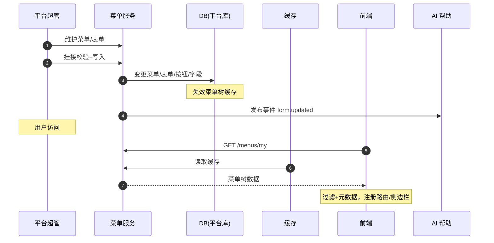

# 概要设计 · 菜单管理

> BMS · 菜单/表单/按钮/字段与权限挂接

[概要设计](01_概要设计_总览.md) › 07-菜单管理　|　[← 06-角色管理](06_概要设计_角色管理.md) · [08-部门管理 →](08_概要设计_部门管理.md)

## 1. 模块概述与职责 

本节对应[《项目规划说明》](../../规划/项目规划说明.md)「功能模块」之**菜单管理**模块，与「权限模型」（菜单→表单→业务、按钮→动作、字段可见可编辑）、「前端页面清单与菜单机制」「初始化数据」「核心数据表清单」章节。架构设计依据[《架构设计》](../架构设计/01_架构设计_总览.md)11-权限计算引擎、26-前端架构节点。

菜单管理负责权限元数据的统一维护：菜单/表单/按钮/字段的实体定义与挂接关系（菜单挂表单 1:1、表单挂业务、按钮挂动作、字段挂表单），字段权限授予（visible/editable），以及业务/动作码的可见与分配管理。数据存于**平台库**，是动态路由与侧边栏生成、表单元数据下发的唯一依据。

职责边界：菜单/表单/按钮/字段实体与业务/动作码由**平台超管**统一维护（menu / business / action 业务）；租户侧可见、可分配、不可增删；字段权限授予（sys_role_field）落[角色管理](06_概要设计_角色管理.md)（role:grant），本模块提供配置入口；菜单变更发布 `form.updated` 事件，触发 AI 帮助文档自动更新草稿。

## 2. 功能分解与业务流程 

### 2.1 功能点分解 

| 功能点 | 说明 | 权限码 |
| --- | --- | --- |
| 菜单维护 | 菜单树（parent_id/name/path/component/icon/sort/hidden/status），挂接表单 1:1 | menu:query / menu:create / menu:update / menu:delete |
| 表单维护 | 表单实体：挂菜单（menu_id）、挂业务（business_id）、component | menu 业务（同段） |
| 按钮维护 | 按钮实体：挂表单（form_id）、挂动作（action_id）、type（toolbar/interface）、sort | menu 业务 |
| 字段维护 | 字段实体：挂表单（form_id）、field_key/name/type/sort/status | menu 业务 |
| 字段权限配置 | 按角色设置字段 visible/editable（sys_role_field 写入口） | role:grant |
| 业务权限码管理 | sys_business 平台统一维护：租户侧可见、可分配、不可增删 | business:query |
| 动作权限码管理 | sys_action 归属业务：租户侧可见、可分配、不可增删 | action:query |
| 动态菜单接口 | 按用户权限动态返回菜单树 + 表单元数据（按钮/字段与可见可编辑状态） | —（登录用户） |

### 2.2 业务规则 

- 挂接链完整性：菜单 1:1 挂表单、表单 1:1 挂业务、按钮 1:1 挂动作、字段挂表单——任一挂接缺失导致该链路用户不可见/不可用（角色授予时校验并提示）
- 平台库维护：sys_menu/sys_form/sys_button/sys_field/sys_business/sys_action 均存平台库，租户侧只读引用（跨库 code 逻辑外键）
- 业务/动作码一经发布稳定不变（错误码/接口契约耦合）；停用而非删除业务/动作码
- 菜单多语言：名称存 sys_menu_i18n（联合主键 主表 ID + locale），查询按当前 locale 关联，缺省回退主表默认文案；业务/动作/字段名同理存各自 _i18n 附表
- 菜单 hidden 标记：仅隐藏侧边栏入口，权限仍生效（路由可直达）；component/path 变更影响前端动态路由注册
- 按钮 type：toolbar（工具栏）/ interface（表单界面内按钮）；默认无任何按钮权限，角色授予动作后才显隐
- 菜单/表单/字段/按钮变更（增删改、挂接调整）发布 `form.updated` 事件（AI 帮助更新触发，不订阅 Webhook）
- 变更即实时：菜单树与表单元数据缓存（Redis 短 TTL）随变更失效，用户下次请求取新元数据，无需发版

### 2.3 流程步骤 

1. **新增菜单**：平台超管建菜单（含 path/component）→ 挂表单 → 表单挂业务码 → 配置按钮（挂动作）与字段 → 补 i18n 文案 → 发布 form.updated
2. **动态菜单下发**：用户登录/刷新 → GET /menus/my → 按已授予的菜单/表单权限过滤 + 表单元数据（按钮按动作权限、字段按字段权限标记）→ 前端注册路由与侧边栏
3. **字段权限配置**：角色管理/菜单管理入口 → 选择角色与表单 → 勾选字段 visible/editable → 写入 sys_role_field → 权限版本 +1
4. **异常分支**：挂接链断裂（表单未挂业务）→ 拒绝发布并提示；停用的业务码被角色引用 → 提示先解除授权；component 路径冲突 → 校验拒绝

## 3. 关键时序与协作 

协作要点：菜单树与表单元数据是前端动态路由与侧边栏的唯一依据（前端不硬编码路由表，新增菜单/表单/按钮/字段无需发版）；form.updated 事件驱动 AI 帮助文档智能维护（自动生成更新草稿并通知维护人，人工审核后发布）；菜单缓存键 `bms:{tenant}:menu:{locale}:{version}`，含 locale 维度。

## 4. 数据模型与表设计 

### 4.1 核心表 

| 表 | 关键字段 | 说明 |
| --- | --- | --- |
| sys_menu | parent_id、name、path、component、icon、sort、hidden、status | 【平台库】菜单树平台统一维护，动态路由依据；多语言名存 sys_menu_i18n |
| sys_form | menu_id、business_id、component、status | 【平台库】表单：菜单 1:1 挂接业务权限（菜单→表单→业务） |
| sys_button | form_id、action_id、name、type（toolbar/interface）、sort | 【平台库】表单按钮：按钮 1:1 挂接动作权限；默认无任何按钮权限 |
| sys_field | form_id、field_key、name、type、sort、status | 【平台库】表单界面字段实体，字段权限控制依据 |
| sys_role_field | role_id、form_id、field_id、visible、editable | 角色字段权限（联合主键 role_id+form_id+field_id）；默认全部可见可编辑，授予后收窄 |
| sys_business | code（user）、name、status | 【平台库】业务权限码平台统一维护，租户侧可见、可分配、不可增删 |
| sys_action | code（create）、name、business_id、status | 【平台库】动作权限码归属业务，平台统一维护 |
| sys_menu_i18n / sys_business_i18n / sys_action_i18n / sys_field_i18n | 主表 ID、locale、翻译字段 | 多语言附表，联合主键（主表 ID + locale） |

### 4.2 索引与唯一约束 

- sys_menu：索引 parent_id、status；sys_form：menu_id 唯一（1:1）、business_id 唯一（1:1）
- sys_button：索引 form_id、action_id；sys_field：索引 form_id、字段 (form_id, field_key) 唯一
- sys_business / sys_action：code 唯一；sys_action 索引 business_id
- sys_role_field：联合主键 (role_id, form_id, field_id)
- i18n 附表：联合主键（主表 ID + locale）

### 4.3 数据流转 

- 平台库元数据 → 租户库引用（code 逻辑外键）→ 动态菜单接口按租户权限过滤下发 → 前端渲染
- 变更 → 菜单缓存失效（短 TTL）→ 用户下次请求取新元数据；form.updated 事件 → AI 帮助更新草稿
- 菜单/表单/按钮/字段变更落字段级审计（sys_data_audit_log）；平台库数据不做软删除（停用代替），物理清理不适用

## 5. 接口设计 

### 5.1 接口清单 

| 方法 | 路径 | 说明 | 权限码 |
| --- | --- | --- | --- |
| GET | /api/v1/menus | 菜单树（平台维护视图，含 hidden） | menu:query |
| POST / PUT / DELETE | /api/v1/menus、/api/v1/menus/{id} | 菜单增改删（含 i18n 名称） | menu:create / menu:update / menu:delete |
| GET / POST / PUT / DELETE | /api/v1/forms、/api/v1/forms/{id} | 表单维护（挂菜单/挂业务/component） | menu 业务 |
| GET / POST / PUT / DELETE | /api/v1/buttons、/api/v1/buttons/{id} | 按钮维护（挂表单/挂动作/type/sort） | menu 业务 |
| GET / POST / PUT / DELETE | /api/v1/fields、/api/v1/fields/{id} | 字段维护（挂表单/field_key/type） | menu 业务 |
| PUT | /api/v1/fields/permissions | 批量设置角色字段权限（visible/editable） | role:grant |
| GET | /api/v1/businesses | 业务码列表（租户侧可见，只读） | business:query |
| GET | /api/v1/actions | 动作码列表（租户侧可见，只读） | action:query |
| GET | /api/v1/menus/my | 当前用户动态菜单树 + 表单元数据（按钮/字段与可见可编辑状态），登录即可 | —（登录用户） |

### 5.2 分页/幂等/限流 

- 菜单树/表单/按钮/字段为元数据，量级小：树形返回不分页，字段/按钮按表单维度一次性返回
- 写接口支持 `Idempotency-Key` 幂等；批量字段权限单事务提交
- 动态菜单接口为高频读接口：Redis 缓存 + 短 TTL + 随机偏移（防雪崩），限流按用户维度
- 统一响应 `{code, message, data}`；菜单/表单/按钮/字段接口双库引用（平台库读、租户库过滤）

### 5.3 事件发布 

| 事件 | 触发时机 | 主要载荷 | Webhook 订阅 |
| --- | --- | --- | --- |
| form.updated | 菜单/表单/字段/按钮变更（平台统一维护） | form_id、menu_id、business_id、changed_type | 否（AI 帮助更新触发） |

## 6. 权限与配置 

### 6.1 权限码 

本模块涉及三个业务：`menu`（菜单/表单/按钮/字段维护，平台超管）、`business`（业务权限维护）、`action`（动作权限维护）；字段权限写入走 `role:grant`（安全管理员）。动作按 sys_action 分配：

| 权限码 | 说明 |
| --- | --- |
| menu:query / menu:create / menu:update / menu:delete | 菜单树与表单/按钮/字段实体的查增改删（平台超管） |
| business:query | 业务码可见（租户侧分配用，只读） |
| action:query | 动作码可见（租户侧分配用，只读） |
| role:grant | 字段权限授予（角色管理侧入口） |

### 6.2 菜单挂接 

- 平台侧菜单：「菜单管理」（含表单/按钮/字段维护与字段权限配置）、「业务权限管理」、「动作权限管理」
- 租户侧只读可见业务/动作码清单（角色管理授权时选择），不可进入维护功能
- 三权分立：menu/business/action 归属平台超管，不进入租户侧三类管理员权限域

### 6.3 sys_config 参数 

| 参数 | 默认 | 说明 |
| --- | --- | --- |
| menu.tree_cache_ttl | 300（秒） | 菜单树/表单元数据缓存 TTL（含随机偏移） |
| menu.field_max_per_form | 200 | 单表单字段数上限（防元数据膨胀） |
| menu.button_max_per_form | 50 | 单表单按钮数上限 |

### 6.4 种子数据 

- 平台库种子：初始菜单/表单/按钮/字段与业务/动作种子（后端模块定义对齐，清单见「业务与动作清单」节，含 i18n 附表英文文案）
- 全部 MVP 页面（用户管理、角色管理、采购、报表等）挂接完整：菜单→表单→业务、按钮→动作链路齐全
- 租户开通种子：租户侧按平台码初始化可见清单与内置角色预授（随开通流程自动执行）

## 7. 错误码与异常处理 

本模块错误码段 4xxxx（系统配置：菜单/字典/系统参数/国际化语言包），文案由前端按 i18n 映射。

| 错误码 | 说明 |
| --- | --- |
| 40001 | 菜单/表单/按钮/字段实体不存在 |
| 40002 | 挂接链断裂：表单未挂业务、菜单未挂表单（角色授予校验提示） |
| 40003 | component/path 冲突或格式非法 |
| 40004 | 业务/动作码为平台维护，租户侧不可增删改 |
| 40005 | 字段 key 在表单内重复 |
| 40006 | 表单/业务/动作码被角色引用，禁止停用（先解除授权） |
| 40007 | 字段权限配置与字段实体不匹配（表单变更后未同步） |

异常处理要求：挂接链校验在保存时前置执行（保存前模拟链路完整性）；元数据变更与缓存失效同事务；平台库变更涉及多租户可见性，变更后版本递增保证租户侧缓存一致性。

## 8. 页面清单与验收要点 

### 8.1 页面清单 

| 页面 | 端 | 说明 |
| --- | --- | --- |
| 菜单管理 | PC | 菜单树维护、表单/按钮/字段维护（含挂接关系）、字段权限配置入口 |
| 业务权限管理 | PC | 业务码清单查看与状态（平台维护） |
| 动作权限管理 | PC | 动作码清单查看与状态（平台维护） |

### 8.2 验收标准 

- 新增菜单/表单/按钮/字段后，前端动态注册路由与侧边栏生效（免发版验证）；新增菜单名多语言显示正确（含缺省回退）
- 菜单→表单→业务、按钮→动作挂接校验生效，断裂链路在角色授予时被拦截并提示
- 动态菜单接口按权限过滤正确：未授予菜单不可见、未授予按钮不渲染、字段权限读时过滤/写时校验
- 业务/动作码租户侧只读验证通过；平台侧停用/启用即时影响角色授予选项
- form.updated 事件触发 AI 帮助更新草稿链路验证通过；元数据缓存失效即时生效

> 本文档为 AI 生成 · 概要设计节点 · 与《项目规划说明》《架构设计》《文档生成规范》《命名规范》配套 · 生成日期：2026-08-06