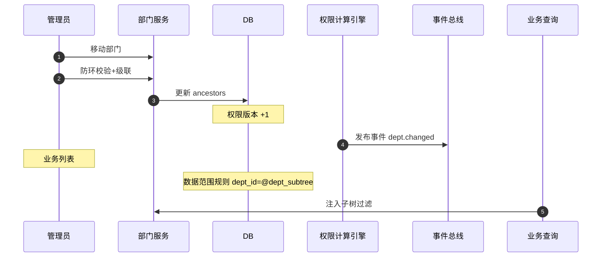

# 概要设计 · 部门管理

> BMS · 组织架构树与数据权限依据

[概要设计](01_概要设计_总览.md) › 08-部门管理　|　[← 07-菜单管理](07_概要设计_菜单管理.md) · [09-字典管理 →](09_概要设计_字典管理.md)

## 1. 模块概述与职责 

本节对应[《项目规划说明》](../../规划/项目规划说明.md)「功能模块」之**部门管理**模块，与「核心数据表清单」（sys_dept）、「权限模型」（主体链、动作级数据权限）「事件总线事件模型」章节。架构设计依据[《架构设计》](../架构设计/01_架构设计_总览.md)11-权限计算引擎节点。

部门管理维护组织架构树（`parent_id / ancestors / name / sort / status`），用户归属部门（sys_user.dept_id），作为主体链中间实体分配角色（`sys_role_assign` subject_type=dept），并作为动作级数据范围的部门维度依据（数据权限规则引用部门维度，如 dept_id = @current_dept）。

职责边界：部门不直接授权；「用户→部门→角色」收敛由权限计算引擎处理；数据范围规则配置在[角色管理](06_概要设计_角色管理.md)（role:grant），本模块提供部门数据支撑；部门变更发布 `dept.changed` 事件（不订阅 Webhook）。

## 2. 功能分解与业务流程 

### 2.1 功能点分解 

| 功能点 | 说明 | 权限码 |
| --- | --- | --- |
| 部门树/详情 | 组织架构树（含状态/排序），节点详情与路径（ancestors）展示 | dept:query |
| 新建部门 | 选择父部门（根部门默认存在）、name/sort/status | dept:create |
| 修改部门 | 名称/排序/状态调整 | dept:update |
| 移动部门 | 调整父部门，级联维护子树 ancestors | dept:update |
| 删除部门 | 存在子部门或归属用户/岗位时拒绝；软删除 | dept:delete |
| 部门用户查看 | 按部门（含子树）查看归属用户 | dept:query |
| 部门角色绑定回显 | 查看部门已绑定角色（主体链中间实体） | dept:query |

### 2.2 业务规则 

- 树结构：parent_id 指向父部门，根部门 parent_id 为空；ancestors 存储祖先 id 路径（如 /1/5/9/），用于子树查询与数据权限下钻
- 部门移动：校验新父部门不能是自身或其后代（防环）；移动后级联更新子树全部 ancestors 并发布 dept.changed
- 删除约束：存在子部门、归属用户（sys_user.dept_id）或岗位（sys_post.dept_id）引用时禁止删除；停用部门不参与主体链收敛与数据范围匹配
- 主体链：部门作为中间实体可绑定角色（subject_type=dept），收敛为「用户→部门→角色」；部门变更触发权限版本 +1
- 数据权限依据：动作级数据范围规则（sys_data_scope）可引用部门维度预置变量（如 @current_dept、@dept_subtree），解析结果强制叠加租户过滤
- 部门停用：其下用户仍可登录但失去部门继承的角色权限；恢复启用后权限即时恢复

### 2.3 流程步骤 

1. **新建部门**：选择父部门 → 生成 ancestors（父 ancestors + 父 id）→ 入库 → 权限版本 +1（若涉及角色绑定）→ 落审计
2. **移动部门**：校验防环 → 更新节点 parent_id/ancestors → 级联更新子树 ancestors（单事务）→ 发布 `dept.changed` → 权限版本 +1
3. **删除部门**：引用检查（子部门/用户/岗位/角色绑定）→ 无引用则软删除 → 发布 dept.changed
4. **异常分支**：防环校验失败拒绝移动；存在引用拒绝删除（明确提示引用对象）；并发移动用 version 乐观锁

## 3. 关键时序与协作 

协作要点：数据范围规则按部门维度下钻（@dept_subtree 展开为子树 id 集合注入查询）；部门角色绑定收敛与权限版本失效由权限计算引擎统一处理；dept.changed 事件供全文检索索引同步等消费（Webhook 不可订阅）。

## 4. 数据模型与表设计 

### 4.1 核心表 

| 表 | 关键字段 | 说明 |
| --- | --- | --- |
| sys_dept | parent_id、ancestors、name、sort、status | 部门树（租户库）；作为主体链中间实体可分配角色，数据权限依据；软删除 + 审计字段 + version |
| sys_user（引用） | dept_id | 用户归属部门 |
| sys_post（引用） | dept_id | 岗位归属部门 |
| sys_role_assign（引用） | subject_type（dept…）、subject_id、role_id | 主体-角色通用绑定；subject_type=dept 即部门角色绑定 |
| sys_data_scope（引用） | action_id、config | 动作级数据范围规则可引用部门维度（预置变量） |

### 4.2 索引与唯一约束 

- `sys_dept`：索引 parent_id、status、sort；ancestors 前缀索引支撑子树查询与 @dept_subtree 展开
- `sys_user`：索引 dept_id（部门用户查询、数据范围过滤字段强制建索引）
- `sys_role_assign`：索引 (subject_type, subject_id)（subject_type=dept 收敛查询）
- `sys_data_scope`：action_id 唯一；规则引用的部门字段须为已索引字段（性能约束）

### 4.3 数据流转 

- 部门增删改/移动经 ORM 事件落字段级变更审计（sys_data_audit_log，按月分表，ancestors 变更亦记录）
- dept.changed 事件：驱动全文检索主数据索引同步（阶段十四）、数据范围缓存失效
- 部门软删除进回收站（recycle 恢复）；恢复时若父部门已删除则挂回原父或根节点（按回收语义处理）
- 过期软删除残留由 Celery 定时物理清理（与归档清理任务衔接）

## 5. 接口设计 

### 5.1 接口清单 

| 方法 | 路径 | 说明 | 权限码 |
| --- | --- | --- | --- |
| GET | /api/v1/depts | 部门树（含 status/sort 过滤） | dept:query |
| POST | /api/v1/depts | 新建部门（parent_id/name/sort） | dept:create |
| GET | /api/v1/depts/{id} | 部门详情（含 ancestors 路径） | dept:query |
| PUT | /api/v1/depts/{id} | 修改部门（名称/排序/状态） | dept:update |
| PUT | /api/v1/depts/{id}/move | 移动部门（新 parent_id，级联维护 ancestors） | dept:update |
| DELETE | /api/v1/depts/{id} | 删除部门（有引用拒绝） | dept:delete |
| GET | /api/v1/depts/{id}/users | 部门（含子树）归属用户列表 | dept:query |
| GET | /api/v1/depts/{id}/roles | 部门角色绑定回显（主体链） | dept:query |

### 5.2 分页/幂等/限流 

- 部门树量级小：树形返回不分页；部门用户列表分页 `page/size`，响应 `{list, total, page, size}`
- 移动/新建/删除等写接口支持 `Idempotency-Key` 幂等；移动操作为单事务（节点 + 子树级联）
- 限流：部门写操作按用户维度叠加 slowapi 限制；查询走常规限流

### 5.3 事件发布 

| 事件 | 触发时机 | 主要载荷 | Webhook 订阅 |
| --- | --- | --- | --- |
| dept.changed | 部门增删改/移动 | dept_id、parent_id | 否 |

## 6. 权限与配置 

### 6.1 权限码 

本模块对应 `dept` 业务（默认归属系统管理员），动作：`dept:query`（查询）、`dept:create`（新建）、`dept:update`（修改/移动/启停）、`dept:delete`（删除）。部门角色绑定操作使用 `role:grant`（角色管理侧，安全管理员）。

### 6.2 菜单挂接 

- 菜单「部门管理」（form=dept_form，挂 dept 业务），置于系统管理菜单组
- 按钮挂接：新增/编辑/删除/移动（create/update/delete）按角色授予后显隐；部门树默认 query 可见
- 部门树被多表单引用（用户管理选择归属部门、数据范围配置选择部门）——引用方按各自权限码校验

### 6.3 sys_config 参数 

| 参数 | 默认 | 说明 |
| --- | --- | --- |
| dept.tree_max_depth | 10 | 部门树最大深度（防无限层级） |
| dept.max_children | 500 | 单节点直接子部门数上限 |
| dept.scope_subtree_enabled | true | 数据范围规则是否允许 @dept_subtree 下钻 |

### 6.4 种子数据 

- 平台库种子：dept 业务码与动作码（query/create/update/delete）、部门管理菜单/表单/按钮/字段挂接与 i18n 文案
- 租户开通种子：根部门（如「总公司」）自动创建，ancestors=/根id/；系统管理员账号归属根部门

## 7. 错误码与异常处理 

本模块错误码段 3xxxx（用户与组织），文案由前端按 i18n 映射。

| 错误码 | 说明 |
| --- | --- |
| 30051 | 部门不存在 |
| 30052 | 父部门不存在或已停用 |
| 30053 | 移动形成环：父部门不能是自身或其后代 |
| 30054 | 部门仍存在子部门，禁止删除 |
| 30055 | 部门仍被用户/岗位引用，禁止删除 |
| 30056 | 部门仍绑定角色，禁止删除（需先解绑） |
| 30057 | 部门树深度超出上限 |

异常处理要求：移动操作级联更新与校验同事务，失败整体回滚（防半棵树）；并发移动/删除用 version 乐观锁；停用部门不影响历史数据引用（仅退出权限收敛与范围匹配）；dept.changed 发布失败不影响主事务（事件总线重试）。

## 8. 页面清单与验收要点 

### 8.1 页面清单 

| 页面 | 端 | 说明 |
| --- | --- | --- |
| 部门管理 | PC | 组织架构树、新建/编辑/删除/移动、部门用户查看、部门角色绑定查看 |

### 8.2 验收标准 

- 部门树增删改/移动全链路可用；移动后子树 ancestors 级联正确（含二次移动验证）
- 防环校验生效：将父部门移入其子树被拒绝；删除有引用的部门被拒绝并给出明确提示
- 「用户→部门→角色」收敛权限计算正确；停用部门后继承权限即时失效、恢复即生效
- 数据范围规则按部门维度（含子树下钻）读时过滤/写时校验双向生效
- dept.changed 事件发布与消费验证通过；字段级审计与哈希链校验通过

> 本文档为 AI 生成 · 概要设计节点 · 与《项目规划说明》《架构设计》《文档生成规范》《命名规范》配套 · 生成日期：2026-08-06