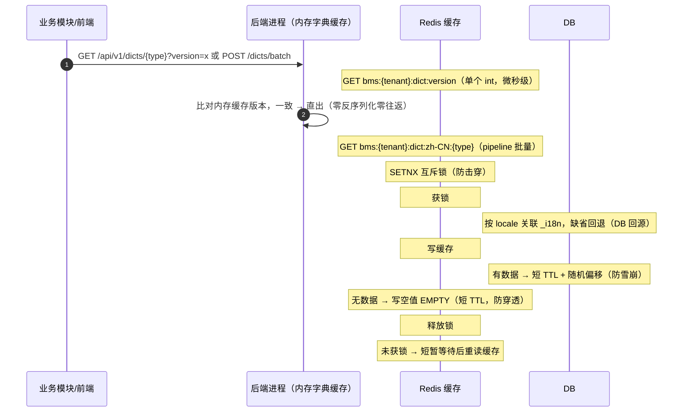
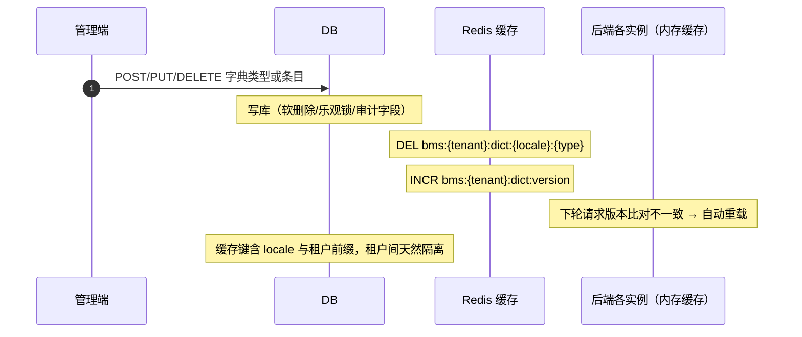

# 概要设计 · 字典管理

> BMS · 通用数据字典维护

[概要设计](01_概要设计_总览.md) › 09-字典管理　|　[← 08-部门管理](08_概要设计_部门管理.md) · [10-系统参数 →](10_概要设计_系统参数.md)

## 1. 模块概述与职责 

本节对应[《项目规划说明》](../../规划/项目规划说明.md)「功能模块」之**字典管理**模块，与「核心数据表清单」「数据规范（多语言）」「性能与高并发设计（缓存策略）」「权限模型」「初始化数据」等章节；架构设计依据[《架构设计》](../架构设计/01_架构设计_总览.md)**05-数据架构**节点（4.1 字典与[系统参数](10_概要设计_系统参数.md)管理、5 缓存架构）与 **09-数据访问与分片**节点。

字典管理为全系统提供**通用数据字典**的统一维护入口：状态、类型、优先级等业务枚举值（如用户状态、字典自身的"状态/类型"通用字典）不再散落硬编码于各模块，统一在字典中定义并引用。业务模块仅通过运行时查询接口取字典，界面展示的多语言 label 由字典模块按当前 locale 下发。

| 维度 | 说明 |
| --- | --- |
| 模块定位 | 字典类型（sys_dict_type）与字典条目（sys_dict_item）的增删改查、多语言 label、租户覆盖、Redis 缓存 |
| 职责边界 | 只负责字典数据的维护与下发；不承载具体业务枚举逻辑，业务模块按 type 引用字典 |
| 架构依据 | 05-数据架构（字典与系统参数管理、缓存架构三防）、09-数据访问与分片（租户库路由）、06-接口与集成（API 规范） |
| 相邻协作 | 用户/菜单/公告等模块的枚举下拉经运行时查询接口取数；国际化模块提供 locale 体系，本模块走 `{主表}_i18n` 附表 |

## 2. 功能分解与业务流程 

### 2.1 功能点分解 

| 功能点 | 说明 | 权限码 |
| --- | --- | --- |
| 字典类型维护 | 类型增删改查：type 编码、名称、排序、启用/停用 | dict:manage |
| 字典条目维护 | 条目增删改查：code、label、value、排序、启用/停用 | dict:manage |
| 多语言 label 维护 | 类型与条目各自关联 `_i18n` 附表，按语言维护翻译文案 | dict:manage |
| 运行时字典查询 | 按类型 + locale 返回启用条目列表，供各业务模块下拉/展示 | 登录即可（业务通用依赖） |
| 缓存失效管理 | 字典变更后删除 Redis 缓存 key（先写库后删缓存）并递增全局版本号（INCR `bms:{tenant}:dict:version`），前端与后端进程内内存缓存按版本比对自动重载 | 系统内部 |

### 2.2 业务规则 

- **唯一性**：字典类型 type 唯一；同一类型下条目 code 唯一；唯一约束按数据规范建为 (唯一字段, deleted_at) 复合唯一索引，软删除后释放唯一键
- **平台默认、租户覆盖**：平台库存默认字典（租户开通种子自动下发）；租户库可覆盖默认字典（停用/修改 label 与排序等）或自建类型；租户间物理隔离（独立库）
- **状态**：启用/停用；停用的条目在运行时查询结果中不可见，已引用旧值的业务数据不受影响
- **多语言**：查询按当前 locale 关联 `_i18n` 附表取翻译，缺省回退主表默认 label（缺省回退规则见数据规范）
- **引用校验**：删除被业务引用的字典条目前校验引用（字段级防呆），避免业务数据出现悬空枚举值；引用校验规则在详细设计细化
- **软删除**：类型/条目删除为软删除（deleted_at），进入回收站可恢复；恢复动作落操作日志与字段级审计

### 2.3 流程步骤与异常分支 

1. **新增字典类型**：校验 type 唯一 → 入库（雪花 ID、审计字段、乐观锁 version）→ 删除缓存 key → 结束；异常：type 重复 → 返回业务错误码（4xxxx）
2. **修改字典条目**：乐观锁 version 比对（失败提示并发冲突，刷新后重试）→ 更新主表与 i18n 附表 → 删除缓存 key
3. **删除字典条目**：引用校验 → 软删除 → 删除缓存 key；异常：被业务引用 → 拒绝删除并提示
4. **运行时查询**：读缓存 → 未命中走互斥锁回源重建（三防）→ 返回条目列表；查询不存在的类型 → 缓存空值防穿透
5. **停用**：停用类型/条目即时从运行时结果消失（缓存删除后生效）

## 3. 关键时序与协作 

读路径（Redis 缓存三防：防穿透空值、防击穿互斥锁、防雪崩随机偏移；后端进程内内存字典缓存按全局版本号比对，免反序列化与网络往返）：

写路径（先写库后删缓存 + 递增版本号，保证一致性）：

> Redis 故障时缓存失效直连 DB 并日志告警（降级协议见[架构 05](../架构设计/05_架构设计_数据架构.md) 与规划「降级」节）；Redis key 命名遵循 `bms:{租户|global}:{域}:{业务键}` 规范。

## 4. 数据模型与表设计 

### 4.1 核心表 

| 表 | 关键字段 | 说明 |
| --- | --- | --- |
| sys_dict_type | id（雪花）、type、name、sort、status、deleted_at、审计字段、version | 字典类型（租户库；平台库种子下发） |
| sys_dict_item | id（雪花）、type_id、code、label、value、parent_id、sort、status、deleted_at、审计字段、version | 字典条目，type_id 逻辑引用字典类型，parent_id 逻辑引用条目自身 id（级联联动：上级字典值过滤下级选项） |
| sys_dict_type_i18n | dict_type_id、locale、label | 类型名多语言，联合主键（dict_type_id + locale） |
| sys_dict_item_i18n | dict_item_id、locale、label | 条目 label 多语言，联合主键（dict_item_id + locale） |

### 4.2 索引与存储策略 

- 索引：sys_dict_type (type) 唯一索引；sys_dict_item (type_id, code) 复合唯一索引（与 deleted_at 组复合唯一索引）、sort 排序字段索引、`(type_id, parent_id, sort)` 复合索引（级联过滤）、`(type_id, label)` 复合索引（远程搜索前缀匹配）、`(type_id, value)` 复合索引（单值翻译）；`_i18n` 附表按 (主表 ID + locale) 联合主键查询
- 分片：字典为小型热配置数据，不做按月分片
- 归档：字典为在用配置数据，不进入归档流转；审计留痕走操作日志与字段级审计（sys_data_audit_log，按月分片）
- 缓存：`bms:{tenant}:dict:{locale}:{type}`，短 TTL + 随机偏移；缓存键含 locale 与租户前缀；全局版本键 `bms:{tenant}:dict:version`（字典变更 INCR）；进程内内存字典缓存（dogpile.cache 双 Region：小字典整类型 + 超大字典已查条目局部子集，按版本惰性比对）供查询接口与业务翻译共用，零网络往返；超大字典批量翻译走「局部缓存 + 一次性 IN 查询」防 N+1

### 4.3 数据流转 

平台库种子字典（含 i18n 英文文案）→ 租户开通时下发至租户库 → 租户按需覆盖（同 type/code 改 label、排序、停用）或自建新类型 → Redis 缓存（按租户 + locale 分键）→ 各业务模块运行时查询消费。字典变更只影响后续查询，已落库的业务数据保持原值。

## 5. 接口设计 

### 5.1 接口清单 

全部接口前缀 `/api/v1`，统一响应 `{code, message, data}`，鉴权 Bearer access token：

| 方法 | 路径 | 说明 | 权限码 |
| --- | --- | --- | --- |
| GET | /dict-types | 字典类型分页查询（筛选：type/名称/状态） | dict:manage |
| POST | /dict-types | 新增字典类型 | dict:manage |
| PUT | /dict-types/{id} | 修改字典类型（含 i18n 附表） | dict:manage |
| DELETE | /dict-types/{id} | 删除字典类型（软删除，校验下挂条目） | dict:manage |
| GET | /dict-types/{id}/items | 类型下条目分页查询 | dict:manage |
| POST | /dict-types/{id}/items | 新增字典条目 | dict:manage |
| PUT | /dict-items/{id} | 修改字典条目（含 i18n 附表） | dict:manage |
| DELETE | /dict-items/{id} | 删除字典条目（软删除，引用校验） | dict:manage |
| GET | /dicts/{type} | 运行时字典查询（按 locale 返回启用条目；登录即可，业务通用依赖）。可选参数：`version`（客户端本地版本，一致时 items 返回 null）、`keyword`（远程搜索，模糊匹配 label/value/code）、`parent_id`（级联过滤）、`values`（逗号分隔指定 value 集合，仅返回这些条目的子集——超大字典列批量翻译用）、`limit`（条数上限，探针传 2001 判别超大字典）；响应 data 为 `{version, items, has_more, total}` | 登录即可 |
| POST | /dicts/batch | 批量运行时字典查询（表单页多字典字段合并为一次请求）：请求体 `{types: [...], version?, locale?}`；响应 data 为 `{version, items: {type: {items, has_more, total} \| null}}`，items 为 null 表示该类型版本一致（前端复用本地缓存）；每类型统一 limit 截断（2001）判别超大字典 | 登录即可 |

### 5.2 分页/幂等/限流 

- 分页：查询参数 `page`（从 1 起）、`size`；响应 `{list, total, page, size}`；limit/offset 分页限深 100 页
- 幂等：写接口支持幂等键（请求头 Idempotency-Key），Redis SETNX 前置拦截 + 唯一约束兜底
- 限流：接口级限流（slowapi，Redis 后端，IP/用户维度）；运行时查询接口为高频路径，单独配置较宽限流；批量接口（/dicts/batch）与远程搜索（keyword 参数）分别限流，防止超大字典场景被刷
- 命名：RESTful 资源式，列表筛选用查询参数

### 5.3 事件 

本模块不发布独立事件；字典变更通过缓存删除 + 全局版本号递增即时生效（各实例内存缓存与前端缓存按版本比对自动重载），无需异步通知消费方（事件总线事件清单中无 dict 域事件）。

## 6. 权限与配置 

### 6.1 权限码分配 

| 权限码 | 业务 | 动作 | 默认归属 |
| --- | --- | --- | --- |
| dict:manage | dict（字典管理） | manage（管理，含查询与维护） | 系统管理员 |

dict 业务码平台统一维护（sys_business），租户侧可见、可分配、不可增删；动作 manage 归属 dict 业务（sys_action）。

### 6.2 菜单挂接 

菜单「字典管理」→ 表单挂接 dict 业务（菜单→表单→业务）；表单按钮挂接 manage 动作（查询/新建/编辑/删除/启用停用），按钮默认无权限，按角色授予动作权限后显隐；字段按字段权限控制（默认全部可见可编辑）。

### 6.3 sys_config 参数 

本模块不新增 sys_config 参数：缓存 TTL 与三防策略全局统一（见规划「性能与高并发设计·缓存策略」），安全类可配项（密码策略、上传上限等）由系统参数模块统一维护，见 [10-系统参数](10_概要设计_系统参数.md) 节点。

### 6.4 种子数据 

- 平台库种子：基础字典种子（状态、类型等通用字典，含 i18n 附表英文文案）
- 租户开通：种子字典随租户开通流程自动下发至租户库（初始化数据节）
- 语言包种子：中文/英文语言与前后端固定文案（sys_i18n_message）

## 7. 错误码与异常处理 

| 段 | 区间 | 覆盖模块 | 本模块建议分配 |
| --- | --- | --- | --- |
| 4xxxx | 40001-49999 | 系统配置（菜单/字典/系统参数/国际化语言包） | 401xx 段（示例：40101 字典类型已存在、40102 字典类型不存在、40103 字典条目已存在、40104 字典条目被业务引用不可删除） |

- 错误码一经发布稳定不变；文案由前端按 i18n 映射，后端不承担文案拼装
- 参数校验错误走 1xxxx 通用段；HTTP 状态码与业务错误码分离
- 并发冲突（乐观锁）返回明确错误提示，前端刷新重试
- Redis 故障：缓存失效直连 DB + 日志告警，不影响查询正确性

## 8. 页面清单与验收要点 

### 8.1 页面清单 

| 端 | 页面 | 说明 |
| --- | --- | --- |
| PC 管理端 | 字典管理 | 类型列表 + 条目列表双栏布局；类型/条目 CRUD 弹窗；多语言 label 维护；启用/停用；排序 |
| 移动端 H5 | — | 不提供字典维护页面；业务表单枚举下拉经运行时查询接口取数 |

### 8.2 验收标准 

- 类型与条目 CRUD、启用/停用、排序全流程可用
- 多语言切换 label 正确；未配置翻译时缺省回退主表默认文案
- 缓存失效即时生效：修改后立即查询返回新值（先写库后删缓存验证）
- 租户隔离：A 租户修改/停用不影响 B 租户（独立库 + 缓存租户前缀）
- 停用条目在运行时查询中不可见；软删除条目可在回收站恢复且审计留痕
- 种子字典（状态、类型等通用字典）下发正确，含 i18n 英文文案
- 越权验证：无 dict:manage 权限用户访问维护接口被拒

> 本文档为 AI 生成 · 概要设计节点 · 与《项目规划说明》《架构设计》《文档生成规范》《命名规范》配套 · 生成日期：2026-08-15