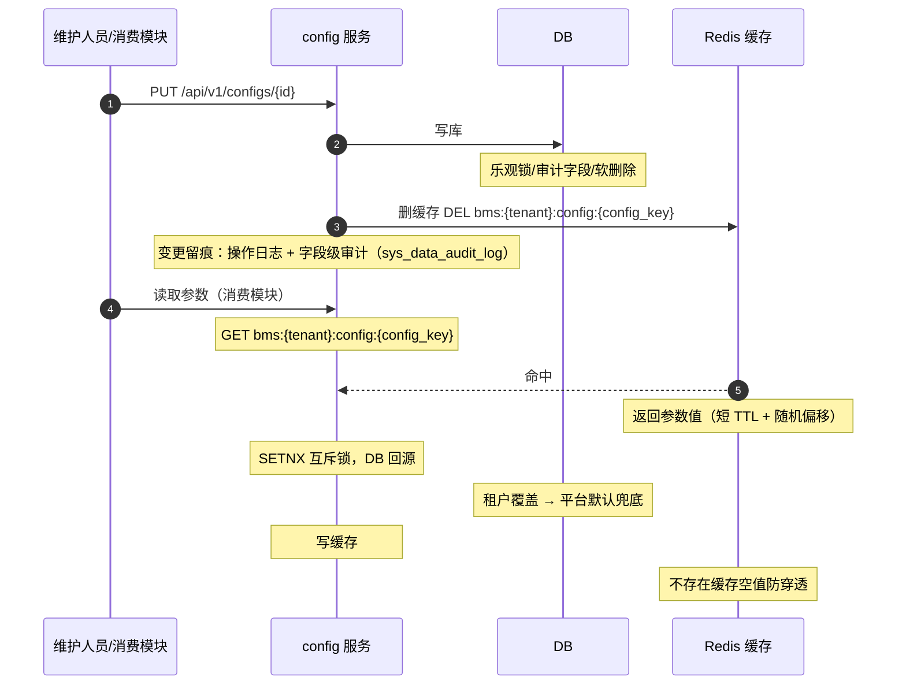

# 概要设计 · 系统参数

> BMS · 系统级参数配置

[概要设计](01_概要设计_总览.md) › 10-系统参数　|　[← 09-字典管理](09_概要设计_字典管理.md) · [11-操作日志 →](11_概要设计_操作日志.md)

## 1. 模块概述与职责 

本节对应[《项目规划说明》](../../规划/项目规划说明.md)「功能模块」之**系统参数**模块，与「核心数据表清单」「认证与安全」「性能与高并发设计（缓存策略）」「初始化数据」等章节；架构设计依据[《架构设计》](../架构设计/01_架构设计_总览.md)**05-数据架构**节点（4.1 字典与系统参数管理、5 缓存架构）与 **10-认证与会话**、**15-[文件管理](13_概要设计_文件管理.md)**等消费方节点。

系统参数为系统级配置的统一入口（sys_config），供认证、文件、会话、AI 等模块运行时读取：密码策略、账号锁定、会话上限、上传大小上限等安全相关参数均为 sys_config 可配项。参数以 `config_key` 为唯一标识（**因 key 为 MySQL 保留字，字段名用 config_key**）。

| 维度 | 说明 |
| --- | --- |
| 模块定位 | 系统级参数配置（sys_config）的维护、租户覆盖、Redis 缓存与运行时下发 |
| 职责边界 | 只维护参数本身；参数的具体业务语义（密码校验、上传上限执行等）由各消费模块实现 |
| 架构依据 | 05-数据架构（4.1 字典与系统参数管理、缓存三防）、06-接口与集成（API 规范）、10-认证与会话（安全参数消费） |
| 相邻协作 | 认证域（密码策略/会话上限/找回密码限流）、文件管理（上传大小上限）、[会话管理](14_概要设计_会话管理.md)（活跃会话数）、[AI 能力](35_概要设计_AI能力.md)（自动执行/审批开关，阶段十五） |

## 2. 功能分解与业务流程 

### 2.1 功能点分解 

| 功能点 | 说明 | 权限码 |
| --- | --- | --- |
| 参数查询 | 参数分页查询（按 config_key 筛选、分组浏览） | config:manage |
| 参数新增 | 新增系统参数（config_key、value、remark） | config:manage |
| 参数修改 | 修改参数值（租户库覆盖平台默认值） | config:manage |
| 参数重置/删除 | 租户覆盖项重置回平台默认值（软删除） | config:manage |
| 运行时读取 | 各模块经参数服务 + Redis 缓存读取参数值（内部服务，不开放接口） | 系统内部 |
| 缓存失效管理 | 参数变更后删除缓存 key（先写库后删缓存） | 系统内部 |

### 2.2 业务规则 

- **唯一性**：config_key 唯一；字段名用 config_key（key 为 MySQL 保留字）
- **平台默认、租户覆盖**：平台库存默认参数（租户开通种子自动下发）；租户库可覆盖参数值，覆盖后按租户隔离生效
- **安全敏感**：密码策略、会话上限等安全参数修改即时生效（缓存删除后按读取时机生效）；修改动作落操作日志与字段级审计
- **软删除**：参数删除为软删除（deleted_at），进入回收站可恢复
- **命名**：config_key 采用点分小写命名（如 password.max_age_days），具体命名遵循《命名规范》，详细设计确定最终清单

### 2.3 流程步骤与异常分支 

1. **修改参数**：校验 config_key 存在与 value 合法性 → 乐观锁 version 比对 → 更新 → 删除缓存 key → 结束；异常：version 冲突 → 返回并发冲突错误，刷新重试
2. **租户覆盖**：租户库写入覆盖值（平台默认值保留在平台库）→ 删除本租户缓存；异常：平台库默认项被删除 → 拒绝并提示
3. **运行时读取**：读缓存（短 TTL）→ 未命中回源本租户参数（含平台默认兜底）→ 写缓存；安全参数变更后依赖缓存失效保证尽快生效
4. **重置**：租户覆盖项删除 → 恢复读取平台默认值 → 删除缓存 key

## 3. 关键时序与协作 

参数写入与读取时序（短 TTL 缓存 + 三防）：

> 参数缓存键含租户前缀，租户间隔离；Redis 故障时直连 DB 并告警（降级协议）。

## 4. 数据模型与表设计 

### 4.1 核心表 

| 表 | 关键字段 | 说明 |
| --- | --- | --- |
| sys_config | id（雪花）、config_key、value、remark、deleted_at、审计字段、version | 系统参数（租户库；平台库种子默认值下发）；config_key 唯一，字段名规避 MySQL 保留字 key |

### 4.2 索引与存储策略 

- 索引：sys_config (config_key) 唯一索引（与 deleted_at 组复合唯一索引）
- 分片：参数为小型热配置数据，不做按月分片
- 归档：参数为在用配置数据，不进入归档流转
- 缓存：`bms:{tenant}:config:{config_key}`，短 TTL + 随机偏移

### 4.3 数据流转 

平台库默认参数（平台超管维护）→ 租户开通种子下发至租户库 → 租户库覆盖（config:manage）→ Redis 缓存（按租户分键）→ 认证/文件/会话等消费模块运行时读取。租户未覆盖项读取平台默认值兜底。

## 5. 接口设计 

### 5.1 接口清单 

全部接口前缀 `/api/v1`，统一响应 `{code, message, data}`，鉴权 Bearer access token：

| 方法 | 路径 | 说明 | 权限码 |
| --- | --- | --- | --- |
| GET | /configs | 参数分页查询（筛选：config_key/remark） | config:manage |
| GET | /configs/{config_key} | 单参数查询（页面回显） | config:manage |
| POST | /configs | 新增系统参数 | config:manage |
| PUT | /configs/{id} | 修改参数（租户覆盖） | config:manage |
| DELETE | /configs/{id} | 删除参数（软删除；租户覆盖项即重置回平台默认） | config:manage |

运行时读取为内部服务（config service + Redis），不对外暴露接口。

### 5.2 分页/幂等/限流 

- 分页：查询参数 `page`（从 1 起）、`size`；响应 `{list, total, page, size}`；limit/offset 分页限深 100 页
- 幂等：写接口支持幂等键（Idempotency-Key），Redis SETNX 前置拦截 + 唯一约束兜底
- 限流：接口级限流（slowapi，Redis 后端，IP/用户维度）

### 5.3 事件 

本模块不发布独立事件；参数变更通过缓存删除即时生效（事件总线事件清单中无 config 域事件）。

## 6. 权限与配置 

### 6.1 权限码分配 

| 权限码 | 业务 | 动作 | 默认归属 |
| --- | --- | --- | --- |
| config:manage | config（系统参数） | manage（管理，含查询与维护） | 系统管理员 |

### 6.2 菜单挂接 

菜单「系统参数」→ 表单挂接 config 业务；表单按钮挂接 manage 动作（查询/新建/编辑/重置），按钮默认无权限，按角色授予动作权限后显隐。

### 6.3 sys_config 参数清单 

以下为 sys_config 可配项（来源：规划「认证与安全」章节，key 命名为示意，详细设计按《命名规范》最终确定）：

| config_key（示意） | 默认值 | 说明 | 消费方 |
| --- | --- | --- | --- |
| password.complexity | 长度/字符组合 | 密码复杂度校验规则 | 认证（改密/重置） |
| password.max_age_days | 90 | 密码有效期，到期强制改密（pwd_changed_at 驱动） | 认证 |
| password.history_count | 5 | 近 5 次历史密码不可重复（pwd_history） | 认证 |
| account.inactive_lock_days | 180 | 180 天未登录自动锁定（定时任务扫描 last_login_at） | 认证 + 任务调度 |
| session.max_active | 5 | 活跃会话数上限，超出后最旧会话自动失效 | 会话管理 |
| file.upload.max_size | 20971520（20MB） | 整包上传大小上限，超限走分片上传 | 文件管理 |
| file.upload.max_file_size | 2147483648（2GB） | 单文件上传上限（分片上传） | 文件管理 |
| captcha.required_after_failures | 3 | 登录连续失败次数达阈值强制图形验证码 | 认证 |
| ai.auto_execute | false | AI 自动执行写操作开关（阶段十五，默认关闭） | AI 能力 |
| ai.auto_approve | false | AI 自动审批开关（阶段十五，默认关闭；依赖 ai.auto_execute 开启，未开启时配置拒绝保存） | AI 能力 + 工作流 |

> 安全敏感参数（密码策略、会话上限、AI 开关等）修改须谨慎，变更全程落操作日志与字段级审计；AI 开关依赖校验（ai.auto_approve 依赖 ai.auto_execute）在保存时强制校验。

### 6.4 种子数据 

- 平台库种子：平台默认参数（初始化数据节），租户开通时自动下发至租户库
- 安全参数默认值（90 天有效期、近 5 次历史、180 天未登录锁定、活跃会话上限 5、上传上限 20MB 等）随平台库种子写入

## 7. 错误码与异常处理 

| 段 | 区间 | 覆盖模块 | 本模块建议分配 |
| --- | --- | --- | --- |
| 4xxxx | 40001-49999 | 系统配置（菜单/字典/系统参数/国际化语言包） | 402xx 段（示例：40201 参数已存在、40202 参数不存在、40203 参数值不合法、40204 并发冲突请重试） |

- 错误码一经发布稳定不变；文案由前端按 i18n 映射
- 参数校验错误走 1xxxx 通用段；HTTP 状态码与业务错误码分离
- AI 开关依赖校验失败（ai.auto_execute 未开启时启用 ai.auto_approve）返回明确业务错误
- Redis 故障：缓存失效直连 DB + 日志告警

## 8. 页面清单与验收要点 

### 8.1 页面清单 

| 端 | 页面 | 说明 |
| --- | --- | --- |
| PC 管理端 | 系统参数 | 参数列表（config_key/value/remark 分组浏览）；新增/编辑/重置弹窗；安全参数敏感提示 |
| 移动端 H5 | — | 不提供参数维护页面；参数读取为后端内部服务 |

### 8.2 验收标准 

- 参数 CRUD、租户覆盖、重置回平台默认全流程可用
- 缓存失效即时生效：修改参数后各消费模块读取到新值
- 安全参数强制生效：修改密码有效期/历史次数/未登录锁定/会话上限后，对应策略按新值执行
- AI 开关依赖校验：ai.auto_execute 未开启时 ai.auto_approve 配置被拒
- 租户隔离：A 租户参数覆盖不影响 B 租户
- 参数修改审计留痕（操作日志 + 字段级审计可查）
- 越权验证：无 config:manage 权限访问维护接口被拒

> 概要设计节点 · 与《项目规划说明》《架构设计》《文档生成规范》《命名规范》配套 · 生成日期：2026-08-06