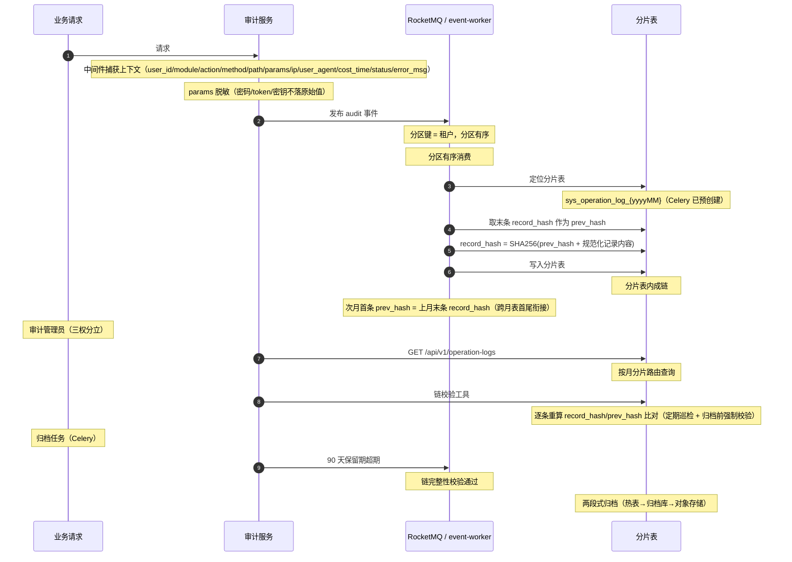

# 概要设计 · 操作日志

> BMS · 关键操作审计日志

[概要设计](01_概要设计_总览.md) › 11-操作日志　|　[← 10-系统参数](10_概要设计_系统参数.md) · [12-登录日志 →](12_概要设计_登录日志.md)

## 1. 模块概述与职责 

本节对应[《项目规划说明》](../../规划/项目规划说明.html)「功能模块」之**操作日志**模块，与「核心数据表清单」「[审计合规](29_概要设计_审计合规.md)」
「性能与高并发设计」「多数据源策略（分库分表）」「初始化数据」等章节；架构设计依据[《架构设计》](../架构设计/01_架构设计_总览.md)
**15-审计哈希链**、**09-数据访问与分片**、**12-事件总线**、
**12-[任务调度](24_概要设计_任务调度.md)**等节点。

操作日志记录**关键操作审计**（谁在何时做了什么）：用户、模块、权限码动作、请求方法/路径、
参数（脱敏）、IP、User-Agent、耗时、结果与错误信息。日志经 RocketMQ 异步写入降低主库写压力，
按月分表存储，并以哈希链防篡改；保留 90 天后进入归档冷存储。

| 维度 | 说明 |
| --- | --- |
| 模块定位 | 关键操作审计日志的捕获、异步落库、哈希链防篡改、查询与归档 |
| 职责边界 | 只做审计记录本身；登录审计归[登录日志](12_概要设计_登录日志.md)模块，字段级变更审计归审计合规模块（sys_data_audit_log） |
| 架构依据 | 15-审计哈希链（prev_hash/record_hash 构造、链序、校验巡检）、09-数据访问与分片（按月分片路由）、12-事件总线（RocketMQ 分区有序消费）、13-任务调度（分片表预创建/归档） |
| 相邻协作 | 认证与会话（登录审计联动）、权限引擎（log 业务三权分立审计管理员）、[归档管理](31_概要设计_归档管理.md)（90 天归档）、[全文检索](34_概要设计_全文检索.md)（阶段十四按月索引） |

## 2. 功能分解与业务流程 

### 2.1 功能点分解 

| 功能点 | 说明 | 权限码 |
| --- | --- | --- |
| 审计捕获 | 请求中间件收集操作上下文（user_id/module/action/method/path/params/ip/user_agent/cost_time/status/error_msg） | 系统内部 |
| 参数脱敏 | 敏感字段（密码/token/密钥）脱敏后记录，不落原始值 | 系统内部 |
| 异步写链落库 | 审计事件经 RocketMQ 分区有序消费，逐条哈希串联写入按月分片表 | 系统内部 |
| 日志查询 | 按用户/模块/动作/状态/时间范围筛选的分页查询与详情 | log:query |
| 链完整性校验 | 链校验工具逐条重算比对（定期巡检 + 归档前强制校验） | log:query + 系统内部任务 |
| 归档 | 保留 90 天热表，超期按归档策略两段式归档 | archive 业务（归档管理） |

### 2.2 业务规则 

- **action 记录权限码**：operation 的 action 字段记录权限码（业务:动作），与权限体系对齐（如 `user:create`、`dict:manage`），保证日志可与权限模型对照审计
- **脱敏**：params 中密码、token、密钥等敏感字段脱敏后记录，不落原始值
- **哈希链**：`record_hash = SHA256(prev_hash + 规范化记录内容)`；prev_hash 取当前分片表末条 record_hash；分片表内成链、跨月表首尾衔接（新分片表首条 prev_hash = 上月末条 record_hash，首月链头为约定初始值）
- **链序保证**：审计事件经 RocketMQ **分区有序消息**按租户分区串行消费，杜绝并发写乱序破坏 prev_hash 衔接
- **物理保留**：审计类数据不做软删除（审计数据物理保留），不支持页面删除
- **保留周期**：90 天热表，超期归档；归档前执行链完整性校验，链完整方可归档（哈希链随归档导出供事后校验）

### 2.3 流程步骤与异常分支 

1. **捕获**：请求进入 → 中间件记录开始时间与上下文 → 业务执行 → 响应后组装审计记录（含 cost_time、status、error_msg）
2. **脱敏**：params 按敏感字段注册规则脱敏（密码/token/密钥不落原始值）
3. **发布**：组装完成后发布审计事件至 RocketMQ（按租户分区）→ 接口立即返回，不等待落库（异步化降主库写压力）
4. **消费落库**：event-worker 分区有序消费 → 取当前分片表末条 record_hash 作 prev_hash → 计算 record_hash → 写入 `sys_operation_log_yyyyMM`；异常：消费失败重试（ack 确认），持续失败告警
5. **跨月**：新月份分片表由 Celery 定时任务提前预创建，跨月首条 prev_hash 衔接上月末条
6. **查询**：审计管理员按条件分页查询（游标分页兜底大结果集）；日志不可修改、不可删除
7. **归档**：归档任务按策略处理超 90 天数据，归档前链完整性校验，链完整方可归档

## 3. 关键时序与协作 

> 写入经 RocketMQ 分区有序消费保证链序；接口侧异步化（先发布事件后返回）显著降低主库写压力（规划「超时与资源」节）。

## 4. 数据模型与表设计 

### 4.1 核心表 

| 表 | 关键字段 | 说明 |
| --- | --- | --- |
| sys_operation_log（逻辑表名） | id、user_id、module、action、method、path、params、ip、user_agent、cost_time、status、error_msg、prev_hash、record_hash、created_at | 操作审计；物理表按月分片 `sys_operation_log_yyyyMM`，逻辑表名不带后缀；审计数据物理保留（无 deleted_at） |

### 4.2 分片与索引 

- 分片：分片键 = 时间（yyyyMM），物理表名带后缀（如 sys_operation_log_202608）；新月份分片表由 Celery 定时任务提前创建；ShardingRouter 按时间路由
- 索引：created_at（排序键）、user_id、module + action 复合、status；排序字段与外键必须建索引
- 查询优化：常规列表 limit/offset 限深 100 页；大数据量列表用**游标分页兜底**（last_id + 排序键索引）
- 归档：sys_archive_policy 配置（时间阈值/保留期/目标），两段式归档（归档库 bms_archive → 对象存储），归档数据只读查询
- 哈希链：prev_hash/record_hash 成链，跨月表首尾衔接；链校验结果与异常告警接入系统监控

### 4.3 数据流转（哈希链与归档） 

请求上下文 → RocketMQ 审计事件 → 分区有序消费 → 按月分片落库（链内成链）→ 90 天热表 →
归档（归档前链完整性校验，链完整方可归档；哈希链随归档导出含链头尾哈希供事后校验）→
归档库只读查询（审计管理员）→ 合规销毁记录销毁日志。阶段十四全文检索经事件同步至 ES 按月索引。

## 5. 接口设计 

### 5.1 接口清单 

全部接口前缀 `/api/v1`，统一响应 `{code, message, data}`，鉴权 Bearer access token：

| 方法 | 路径 | 说明 | 权限码 |
| --- | --- | --- | --- |
| GET | /operation-logs | 操作日志分页查询（筛选：user_id、module、action、status、时间范围；支持游标分页参数） | log:query |
| GET | /operation-logs/{id} | 日志详情（含 prev_hash/record_hash 展示） | log:query |

日志为只读审计数据：不提供新增/修改/删除接口；导出复用通用列表导出能力（export 业务，含脱敏）。

### 5.2 分页/幂等/限流 

- 分页：查询参数 `page`（从 1 起）、`size`；响应 `{list, total, page, size}`；大数据量列表游标分页兜底（last_id + 排序键索引）
- 幂等：本模块无写接口，不涉及幂等键
- 限流：查询接口走接口级限流（slowapi，Redis 后端，IP/用户维度）

### 5.3 事件 

本模块**不发布独立事件**：日志由各业务模块产生的 audit 事件经 RocketMQ 消费落库
（事件总线事件模型中无 operation 域独立事件）；阶段十四全文检索消费同源事件同步 ES 索引。

## 6. 权限与配置 

### 6.1 权限码分配 

| 权限码 | 业务 | 动作 | 默认归属 |
| --- | --- | --- | --- |
| log:query | log（审计日志） | query（查询/查看） | 审计管理员（三权分立只读全部日志与审计数据） |

log 业务码平台统一维护；操作日志查询仅审计管理员可见，与其他角色权限互斥（三权分立）。

### 6.2 菜单挂接 

菜单「操作日志」→ 表单挂接 log 业务；表单按钮挂接 query 动作（查询/详情/导出）。

### 6.3 sys_config 参数 

本模块不新增 sys_config 参数；保留期（90 天）与归档目标由归档管理模块的 sys_archive_policy 策略配置。

### 6.4 种子数据 

- 初始归档策略种子：四类审计日志（操作/登录/开放接口/数据变更）90 天归档，租户开通流程自动执行
- 初始定时任务种子：分片表预创建任务（新月份分片表提前创建）

## 7. 错误码与异常处理 

| 段 | 区间 | 覆盖模块 | 本模块建议分配 |
| --- | --- | --- | --- |
| 9xxxx | 90001-99999 | 报表/审计/归档/监控 | 902xx 段（示例：90201 日志不存在、90202 日志不支持修改/删除、90203 查询时间范围过大请缩小范围） |

- 错误码一经发布稳定不变；文案由前端按 i18n 映射
- 消费异常：RocketMQ 消费失败重试 + ack 确认，持续失败告警（审计链路不得静默丢失）
- Redis/消息队列故障：异步链路降级（事件积压时监控告警），不阻塞业务主链路
- 链校验异常：定位被篡改记录并告警，接入系统监控

## 8. 页面清单与验收要点 

### 8.1 页面清单 

| 端 | 页面 | 说明 |
| --- | --- | --- |
| PC 管理端 | 操作日志 | 筛选查询（用户/模块/动作/状态/时间范围）、分页列表、详情（含哈希值）、导出 |
| 移动端 H5 | — | 不提供操作日志页面（审计数据仅管理端审计管理员查看） |

### 8.2 验收标准 

- 关键操作审计落库完整：字段（user_id/module/action/method/path/params/ip/user_agent/cost_time/status/error_msg）齐全
- params 脱敏生效：密码/token/密钥不落原始值
- 哈希链校验通过：逐条重算比对无篡改；篡改模拟（改库）被校验工具定位
- 跨月衔接正确：新分片表首条 prev_hash = 上月末条 record_hash（跨月链校验通过）
- 异步写入生效：接口不等待日志落库；分片表按月正确路由；次月分片表预创建
- 归档：超 90 天数据按策略归档，归档前链校验，归档后只读可查
- 权限：非审计管理员不可访问（三权分立互斥）；游标分页大结果集正确

> 本文档为 AI 生成 · 概要设计节点 · 与《项目规划说明》《架构设计》《文档生成规范》《命名规范》配套 · 生成日期：2026-08-06