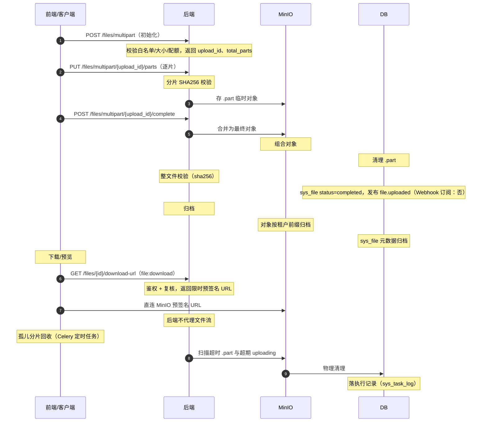

# 概要设计 · 文件管理

> BMS · 文件上传/下载与在线预览

[概要设计](01_概要设计_总览.md) › 13-文件管理　|　[← 12-登录日志](12_概要设计_登录日志.md) · [14-会话管理 →](14_概要设计_会话管理.md)

## 1. 模块概述与职责 

本节对应[《项目规划说明》](../../规划/项目规划说明.md)「功能模块」之**文件管理**模块，与「核心数据表清单」「认证与安全（上传安全）」
「选型说明（MinIO）」「初始化数据」等章节；架构设计依据[《架构设计》](../架构设计/01_架构设计_总览.md)
**16-文件管理**节点（分片状态机、安全控制、在线预览与下载）与 **12-[任务调度](24_概要设计_任务调度.md)**、
**12-事件总线**节点。

文件管理承载文件上传/下载与在线预览（图片/PDF 预签名 URL 直开）：内容存储于 MinIO/S3 对象存储
（私有桶、按租户 bucket 前缀隔离、多实例共享无本地磁盘依赖），数据库只存元数据（sys_file）。
类型白名单 + 大小上限（默认 20MB，超限分片上传 + 断点续传，单文件上限可配置如 2GB），
下载/预览走预签名 URL 限时直开，后端不代理文件流。

| 维度 | 说明 |
| --- | --- |
| 模块定位 | 文件元数据管理、整包/分片上传、断点续传、预签名下载与在线预览、孤儿分片回收 |
| 职责边界 | 只负责文件存取本身；业务模块（审批附件、帮助图片等）经文件服务上传并持有 file_id 引用 |
| 架构依据 | 16-文件管理（分片状态机、安全控制、预览下载）、13-任务调度（孤儿分片清理）、12-事件总线（file.uploaded）、08-多租户路由（存储配额） |
| 相邻协作 | [租户管理](26_概要设计_租户管理.md)（storage_bytes 存储配额超限拦截）、任务调度（孤儿分片回收）、审计哈希链（上传/下载关键操作落[操作日志](11_概要设计_操作日志.md)）、[全文检索](34_概要设计_全文检索.md)（阶段十四文件内容索引） |

## 2. 功能分解与业务流程 

### 2.1 功能点分解 

| 功能点 | 说明 | 权限码 |
| --- | --- | --- |
| 整包上传 | ≤20MB 文件一次性上传（类型白名单 + 大小校验） | file:upload |
| 分片上传 | 超限文件分片上传：初始化 → 逐片上传（SHA256 校验）→ 合并 | file:upload |
| 断点续传 | 按 part_no 状态列表仅重传缺失片 | file:upload |
| 下载 | 预签名 URL 限时下载（后端不代理文件流） | file:download |
| 在线预览 | 图片/PDF 预签名 URL 直开预览（PC + 移动端） | file:download |
| 文件列表与删除 | 文件元数据列表查询；删除（含对象清理） | file:manage / file:delete |
| 孤儿分片回收 | Celery 定时任务扫描超时 .part 与超期 uploading 记录并清理 | 系统内部任务 |

### 2.2 业务规则与状态机 

| 状态 | 迁移 | 说明 |
| --- | --- | --- |
| 上传中（uploading） | 初始化上传 → 上传中 | 记录 upload_id、total_parts；sys_file 跟踪每片状态 |
| 完成（completed） | 全部片校验通过合并后 → 完成 | 合并为最终对象并清理 .part；落 file.uploaded 事件 |
| 失败（failed） | 校验失败/合并失败 → 失败 | 清理临时对象；允许重新初始化上传 |
| 孤儿（orphan） | 超时未完成 → 回收 | Celery 扫描超时 .part 与超期 uploading 记录，物理清理 |

- **大小规则**：≤20MB 整包上传；超限分片上传 + 断点续传；单文件上限可配置（如 2GB）
- **类型白名单**：上传前校验文件类型（MIME 白名单），禁止绕过上传（安全专项用例覆盖上传绕过）
- **校验**：分片 SHA256 校验 + 整文件校验；文件元数据记录 sha256
- **对象标识**：分片临时对象 key 加 `.part` 标识；全部上传后合并为最终对象并清理分片；合并用 MinIO 组合对象
- **租户隔离**：私有桶（bms-files），按租户 bucket 前缀隔离；查询强制租户过滤
- **配额联动**：上传前校验租户存储配额（storage_bytes），超限拦截与告警
- **下载安全**：预签名 URL 限时有效；类型与大小检查在下载前复核；后端不代理文件流

### 2.3 流程步骤与异常分支 

1. **整包上传**：类型白名单 + 大小（≤20MB）校验 → 上传至 MinIO 私有桶（租户前缀）→ 记录 sys_file（status=completed）→ 发布 file.uploaded；异常：类型/大小不合法 → 拒绝
2. **分片上传**：初始化（返回 upload_id、total_parts、分片大小）→ 逐片上传（每片 SHA256 校验，key 带 .part 标识）→ 全部完成后合并为最终对象 → 清理 .part → 整文件校验 → status=completed → 发布 file.uploaded；异常：某片校验失败 → 前端仅重传该片（断点续传）
3. **断点续传**：前端按 part_no 状态列表仅重传缺失片；中断遗留的分片由 Celery 定时回收（孤儿分片）
4. **下载/预览**：file:download 鉴权 → 生成限时预签名 URL（图片/PDF 直开预览）→ 客户端直连 MinIO；异常：对象不存在/超限 → 明确错误
5. **删除**：软删除元数据（回收站可恢复）→ 对象清理（或按回收策略延迟清理）；删除动作落操作日志

## 3. 关键时序与协作 

> 上传前校验租户存储配额（storage_bytes）；对象存储故障时上传/下载接口报错并告警（故障应对见部署与运维节点）。

## 4. 数据模型与表设计 

### 4.1 核心表 

| 表 | 关键字段 | 说明 |
| --- | --- | --- |
| sys_file | id（雪花）、name、bucket、object_key、size、mime_type、sha256、uploader_id、upload_id、total_parts、status（上传中/完成）、deleted_at、审计字段、version | 文件元数据（租户库）；内容存 MinIO 私有桶；分片上传状态跟踪 |

### 4.2 索引与存储策略 

- 索引：sys_file (uploader_id)、status、created_at（排序键）、sha256；查询强制租户过滤
- 对象存储：MinIO 私有桶 bms-files，按租户 bucket 前缀隔离（如 `tenant_{code}/…`）；分片临时对象 key 加 `.part` 标识；多实例共享存储、无本地磁盘依赖（无状态）
- 归档：文件对象不进入数据库归档流转；MinIO 对象数据定期增量备份 + 生命周期策略，元数据随数据库备份
- 配额：上传前校验 sys_tenant_quota（quota_key=storage_bytes）超限拦截

### 4.3 数据流转 

上传（整包/分片）→ MinIO 对象（租户前缀）→ sys_file 元数据落库（uploading → completed）→
业务模块持有 file_id 引用 → 下载/预览经预签名 URL 直开 → 删除软删除进回收站 → 对象清理。
阶段十四全文检索经 file.uploaded 事件驱动文件内容解析（PDF/Word/Excel/TXT）入 ES 索引。

## 5. 接口设计 

### 5.1 接口清单 

全部接口前缀 `/api/v1`，统一响应 `{code, message, data}`，鉴权 Bearer access token：

| 方法 | 路径 | 说明 | 权限码 |
| --- | --- | --- | --- |
| POST | /files | 整包上传（≤20MB；类型白名单 + 大小校验 + 配额校验） | file:upload |
| POST | /files/multipart | 分片上传初始化（返回 upload_id、total_parts） | file:upload |
| PUT | /files/multipart/{upload_id}/parts | 上传单个分片（part_no + SHA256 校验） | file:upload |
| POST | /files/multipart/{upload_id}/complete | 合并完成（整文件校验 → 合并 → 清理 .part） | file:upload |
| GET | /files | 文件列表分页查询（筛选：名称/类型/上传人/状态/时间范围） | file:manage |
| GET | /files/{id}/download-url | 获取限时预签名下载 URL（下载前复核类型/大小） | file:download |
| GET | /files/{id}/preview-url | 获取限时预签名预览 URL（图片/PDF 直开，PC + 移动端） | file:download |
| DELETE | /files/{id} | 删除文件（软删除元数据 + 对象清理） | file:delete |

### 5.2 分页/幂等/限流 

- 分页：查询参数 `page`（从 1 起）、`size`；响应 `{list, total, page, size}`；limit/offset 分页限深 100 页
- 幂等：分片上传的 complete 为关键写操作，支持幂等键（Idempotency-Key），Redis SETNX 前置拦截 + upload_id 唯一约束兜底
- 限流：上传/下载接口接口级限流（slowapi，Redis 后端，IP/用户维度）；分片上传独立限流防止滥用
- 上传安全：类型白名单 + 大小上限（默认 20MB，超限分片）+ 分片 SHA256 校验 + 整文件校验

### 5.3 事件 

| 事件 | 触发时机 | 主要载荷 | Webhook 订阅 |
| --- | --- | --- | --- |
| file.uploaded | 文件上传完成（整包完成 / 分片合并完成） | file_id、sha256、size | 否 |

file.uploaded 供全文检索文件内容解析（阶段十四）等内部消费，不开放 Webhook 订阅。

## 6. 权限与配置 

### 6.1 权限码分配 

| 权限码 | 业务 | 动作 | 默认归属 |
| --- | --- | --- | --- |
| file:upload | file（文件管理） | upload（上传） | 按角色分配 |
| file:download | file（文件管理） | download（下载/预览） | 按角色分配 |
| file:delete | file（文件管理） | delete（删除） | 系统管理员 |
| file:manage | file（文件管理） | manage（列表查询与维护） | 系统管理员 |

file 业务码平台统一维护；上传/下载按业务角色授予（如审批附件、帮助图片场景），删除与管理默认系统管理员。

### 6.2 菜单挂接 

菜单「文件管理」→ 表单挂接 file 业务；表单按钮挂接 upload/download/delete/manage 动作；
上传/下载按钮按角色授予动作权限后显隐。

### 6.3 sys_config 参数 

| config_key（示意） | 默认值 | 说明 |
| --- | --- | --- |
| file.upload.max_size | 20971520（20MB） | 整包上传大小上限，超限走分片上传（sys_config 可配） |
| file.upload.max_file_size | 2147483648（2GB） | 单文件上传上限（分片上传） |
| file.upload.whitelist | 图片/PDF/Office 等 MIME 白名单 | 类型白名单（sys_config 可配项，详细设计确定清单） |

### 6.4 种子数据 

- 初始定时任务种子：孤儿分片清理任务（清理中断遗留的 .part 对象与超期 uploading 记录）
- 上传上限等默认参数随平台库默认参数种子下发（见 10-系统参数节点）

## 7. 错误码与异常处理 

| 段 | 区间 | 覆盖模块 | 本模块建议分配 |
| --- | --- | --- | --- |
| 5xxxx | 50001-59999 | 文件（上传/下载/分片/导入导出） | 501xx 段（示例：50101 文件类型不允许、50102 文件大小超限、50103 分片校验失败、50104 分片不存在或已合并、50105 存储配额超限、50106 文件不存在、50107 预签名 URL 已过期） |

- 错误码一经发布稳定不变；文案由前端按 i18n 映射
- 上传绕过安全专项：类型伪造/超限绕过/分片校验缺失集中用例集验证
- 对象存储故障：上传/下载接口报错并告警；下载前复核类型与大小
- 配额超限：上传前拦截并告警（租户配额超限拦截）

## 8. 页面清单与验收要点 

### 8.1 页面清单 

| 端 | 页面 | 说明 |
| --- | --- | --- |
| PC 管理端 | 文件管理 | 文件列表（名称/类型/大小/上传人/状态/时间）；上传（整包 + 分片进度）；下载；图片/PDF 在线预览；删除 |
| PC 管理端（嵌入） | 业务附件上传组件 | 分片上传组件供审批、帮助等业务模块复用（断点续传） |
| 移动端 H5 | 附件预览 | 审批附件图片/PDF 经预签名 URL 在线预览（移动端审批链路） |

### 8.2 验收标准 

- 整包上传（≤20MB）与分片上传（>20MB，含断点续传）全链路可用；单文件上限（2GB 可配）拦截生效
- 分片 SHA256 校验 + 整文件校验生效；伪造类型/超限绕过被拒（上传绕过安全用例）
- 分片临时对象 .part 标识正确，合并后清理；孤儿分片由 Celery 定时回收（执行记录可查）
- 预签名 URL 限时下载/预览（图片/PDF 直开）可用，过期失效；后端不代理文件流
- 存储配额（storage_bytes）超限拦截与告警生效
- file.uploaded 事件发布正确（Webhook 不订阅）；上传/下载关键操作落操作日志
- 租户隔离：跨租户访问文件被拒；移动端附件预览可用

> 概要设计节点 · 与《项目规划说明》《架构设计》《文档生成规范》《命名规范》配套 · 生成日期：2026-08-06