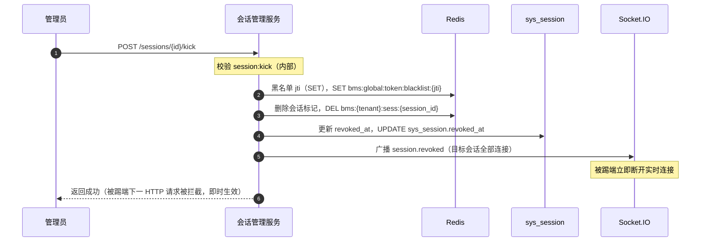

# 概要设计 · 会话管理

> BMS · 在线会话查看与强制踢出

[概要设计](01_概要设计_总览.md) › 14-会话管理　|　[← 13-文件管理](13_概要设计_文件管理.md) · [15-采购管理 →](15_概要设计_采购管理.md)

本节对应[《项目规划说明》](../../规划/项目规划说明.md)「功能模块」之**会话管理**模块与「认证与安全」章节
（多端会话、会话有效标记、强制踢出），架构设计依据[《架构设计》](../架构设计/01_架构设计_总览.md)10-认证与会话节点与 14-实时推送节点。

## 1. 模块概述与职责 

会话管理模块提供登录会话的可见性与治理能力：系统管理员可查看当前租户全部在线会话
（用户、设备、IP、登录时间、有效期），并可对异常会话**强制踢出**。
会话生命周期主体（登录签发、刷新轮换、登出）由认证与会话子系统承担，本模块是其在管理端的管理视图与控制入口。

- **模块定位**：会话状态的查询与治理，不负责签发 token（归属认证链路），是「会话管理」菜单（页面：会话管理）的唯一挂接点
- **职责边界**：在线会话列表查询、会话详情、强制踢出；多端并发上限控制由登录链路执行，本模块只做展示与提示
- **协作关系**：
  - 认证与会话（[架构 09](../架构设计/10_架构设计_子系统_认证与会话.md)）：读写 `sys_session` 与会话 Redis 标记 `bms:{tenant}:sess:{session_id}`
  - 实时推送（[架构 13](../架构设计/14_架构设计_子系统_实时推送.md)）：踢出时广播 `session.revoked` 事件关闭该会话全部实时连接
  - [操作日志](11_概要设计_操作日志.md)：踢出动作落操作日志（action 记录权限码 `session:kick`），敏感字段脱敏

## 2. 功能分解与业务流程 

### 2.1 功能点分解 

| 功能点 | 说明 | 权限码 |
| --- | --- | --- |
| 在线会话列表查询 | 按用户/设备/IP/登录时间过滤，分页展示在线会话；仅展示有效（未过期、未撤销）会话 | session:query |
| 会话详情查看 | 会话的设备、IP、登录/过期时间、最近活跃等明细 | session:query |
| 强制踢出 | 作废目标会话：吊销 refresh token、失效 Redis 会话标记、广播会话失效、`revoked_at` 落库，即时生效 | session:kick |
| 多端并发上限控制 | 同一账号活跃会话数上限（默认 5，sys_config 可配），超限自动作废最旧会话（登录链路执行） | —（登录链路内置） |

### 2.2 强制踢出流程 

1. 管理员在会话管理页选择目标会话，点击「强制踢出」，二次确认
2. 后端校验 `session:kick` 权限，禁止踢出自己当前会话之外的管理员会话（仅限当前用户本人会话可被本人操作，避免提权滥用）
3. 原子执行四步：refresh token 加入黑名单（`bms:global:token:blacklist:{jti}`）→ 删除 Redis 会话标记 → `sys_session.revoked_at` 落库 → 经 Socket.IO 广播 `session.revoked`（目标会话全部连接）
4. 异常分支：
  - 会话已自然过期/已登出：标记已撤销，提示「会话已失效」
  - Redis 操作超时：优先保证落库，Redis 标记 TTL 到期自然失效，广播重试一次；`revoked_at` 已写即视为踢出成功
  - 踢出自己当前会话：操作后当前请求返回并强制前端跳转登录页

## 3. 关键时序与协作 

协作要点：HTTP 侧拦截不依赖广播——被踢端携带的 access token 每次请求都校验 Redis 会话标记
（每请求一次 Redis 读，毫秒级），标记删除后下一请求即拒绝（401 且不触发静默刷新）；Socket.IO 广播仅用于
立即关闭实时连接与前端提示，两路互不依赖，保证踢出即时生效。

## 4. 数据模型与表设计 

核心表 `sys_session`（租户库）：

| 字段 | 类型 | 说明 |
| --- | --- | --- |
| id | bigint | 雪花 ID 主键 |
| user_id | bigint | 用户 ID，索引；数据权限过滤字段 |
| session_id | varchar | 会话 ID（jti），索引；Redis 会话标记 `bms:{tenant}:sess:{session_id}` 的键名依据 |
| refresh_token_hash | varchar | refresh token 哈希（不落原始值），作废与轮换比对依据 |
| device | varchar | 设备标识（PC 浏览器/移动端 H5 等） |
| ip | varchar | 登录 IP |
| login_at | datetime | 登录时间（UTC） |
| expires_at | datetime | refresh 过期时间（14 天），与 Redis 标记 TTL 对齐 |
| revoked_at | datetime | 撤销时间；NULL=有效（踢出/登出/超限自动作废时写入） |

- **通用规范**：雪花 ID 主键、软删除（deleted_at）、审计字段（created_at/created_by/updated_at/updated_by）、乐观锁（version）、时间 UTC 存储
- **索引**：user_id、session_id 建索引；在线会话查询以 `user_id + revoked_at IS NULL` 为主路径
- **缓存**：会话有效标记存 Redis（`bms:{tenant}:sess:{session_id}`），TTL 与 refresh 有效期（14 天）对齐；持久状态类 key 不用短 TTL
- **数据流转**：登录签发写库 + 写 Redis 标记 → 鉴权每请求校验标记 → 刷新轮换更新哈希与 TTL → 登出/踢出/超限写 revoked_at + 删标记；历史会话行保留供审计（90 天后随日志归档策略处理，不物理删除业务外数据）
- **分片/归档**：表体量按用户数×并发会话数线性增长，MVP 不独立分片；登录/踢出等动作在 sys_login_log/sys_operation_log 按月分表留存，会话表本身不归档

## 5. 接口设计 

| 方法 | 路径 | 说明 | 权限码 |
| --- | --- | --- | --- |
| GET | /api/v1/sessions | 在线会话列表（分页 + 用户/设备/IP/时间筛选） | session:query |
| GET | /api/v1/sessions/{session_id} | 会话详情 | session:query |
| POST | /api/v1/sessions/{session_id}/kick | 强制踢出指定会话 | session:kick |

- **通用规范**：前缀 `/api/v1`；统一响应 `{code, message, data}`；分页 `page`/`size`，响应 `{list, total, page, size}`；Bearer access token 鉴权 + `require_permission` 两级校验
- **幂等**：踢出接口携带 `Idempotency-Key` 请求头（Redis SETNX 前置去重），防止重复提交重复广播
- **限流**：踢出为治理操作，按用户维度限流（如 20 次/分钟）
- **发布事件**：本模块不发布 RocketMQ 事件；踢出广播为 Socket.IO 实时事件 `session.revoked`（Webhook 不订阅，与事件总线无关）

## 6. 权限与配置 

- **权限码**：业务 `session`（sys_business，说明：会话管理，默认归属系统管理员）；动作 `query`/`kick`（sys_action，归属 session 业务），典型权限码 `session:query`、`session:kick`
- **菜单挂接**：菜单「会话管理」挂表单（1:1），表单挂业务 `session`；「强制踢出」按钮挂动作 `session:kick`（按钮默认无权限，按需授予）
- **sys_config 参数**：

| config_key | 默认值 | 说明 |
| --- | --- | --- |
| session.max_active | 5 | 同一账号活跃会话上限，登录时超限自动作废最旧会话 |
| session.device_check | false | 是否开启设备/IP 一致性校验（可选强度，见[架构 09](../架构设计/10_架构设计_子系统_认证与会话.md)） |

- **种子数据**：业务码 session、动作码 query/kick 入平台库种子（sys_business/sys_action）；三类内置角色中系统管理员预授本模块菜单/表单权限

## 7. 错误码与异常处理 

本模块错误码位于 **2xxxx 认证段**（20001-29999 认证：登录/刷新/登出/验证码/找回密码/会话）：

| 错误码 | 说明 | 场景 |
| --- | --- | --- |
| 20001 | 会话不存在 | 查询/踢出不存在的 session_id |
| 20002 | 会话已失效 | 目标会话已登出/已过期/已被踢出 |
| 20003 | 会话已撤销 | 重复踢出已撤销会话（配合幂等键返回首次结果） |
| 20004 | 拒绝操作当前会话 | 不可在会话管理页踢出正在使用的系统管理员会话（除本人） |
| 20005 | 活跃会话数达上限 | 登录链路提示（本模块列表页同步展示） |
| 20006 | 无权操作该会话 | 越权踢出非本租户会话（租户边界强制过滤） |

- 异常处理：Redis 故障时踢出降级为仅落库 + 黑名单尽力而为，告警并提示管理员；不因广播失败回滚踢出
- 文案由前端按 i18n 映射，后端不承担文案拼装；踢出动作落操作日志（脱敏：不记录 refresh token 原文）

## 8. 页面清单与验收要点 

| 页面 | 端 | 说明 |
| --- | --- | --- |
| 会话管理 | PC 管理端 | 在线会话列表（用户/设备/IP/登录时间/有效期）、筛选分页、会话详情、强制踢出（二次确认 + 踢出自己当前会话跳转登录） |

**验收要点**：

- 同一账号多端登录各自生成独立会话记录，列表展示准确
- 会话数达上限（默认 5）后再次登录，最旧会话自动失效，被踢端下一请求被拒
- 强制踢出即时生效：目标会话 HTTP 请求立即 401 且不静默续期；目标端 Socket.IO 连接立即关闭；其他会话不受影响
- 无 `session:kick` 权限时按钮不可见且接口拒绝；跨租户踢出被拒
- 踢出动作落操作日志（含权限码 session:kick），无 token/refresh 明文

> 本文档为 AI 生成 · 概要设计节点 · 与《项目规划说明》《架构设计》《文档生成规范》《命名规范》配套 · 生成日期：2026-08-06