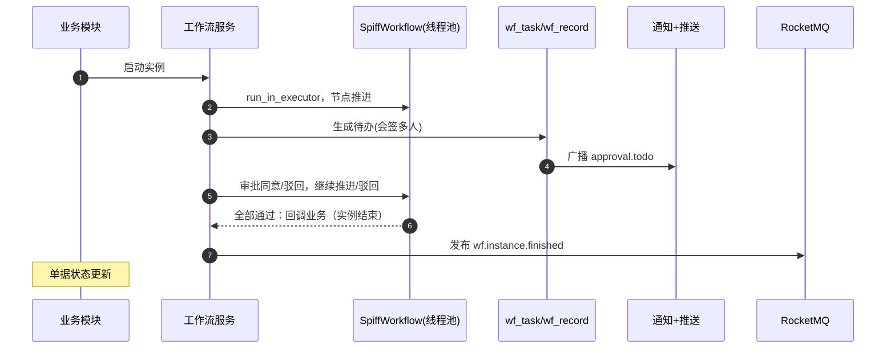

# 概要设计 · 工作流管理

> BMS · BPMN 定义、流程执行与审批

[概要设计](01_概要设计_总览.md) › 16-工作流管理　|　[← 15-采购管理](15_概要设计_采购管理.md) · [17-通知中心 →](17_概要设计_通知中心.md)

本节对应[《项目规划说明》](../../规划/项目规划说明.html)「功能模块」之**工作流管理**模块与「工作流引擎」「初始化数据」
章节（BPMN 流程定义、流程实例、待办/已办、审批记录、会签/或签、流程版本管理），架构设计依据
[《架构设计》](../架构设计/01_架构设计_总览.md)17-工作流节点、14-实时推送节点与 18-通知公告节点。

## 1. 模块概述与职责 

工作流管理模块提供通用审批能力：BPMN 流程定义（bpmn-js 拖拽建模、条件分支可视化、版本管理）、
流程实例执行（SpiffWorkflow 引擎）、待办/已办/我发起、审批记录与会签/或签。业务模块（如[采购管理](15_概要设计_采购管理.md)）
通过「启动流程实例 + 消费审批结果」接入，流程引擎与业务单据解耦。

- **模块定位**：BMS 通用工作流引擎的管理端与执行端，MVP 阶段由采购三级审批流程示范接入
- **职责边界**：流程定义（wf_process）、实例（wf_instance）、待办（wf_task）、审批记录（wf_record）全生命周期；引擎本身不持久化，状态全部由 BMS 自建表维护
- **协作关系**：
  - 采购管理（[概要 14](15_概要设计_采购管理.md)）：提交申请启动实例；流程结束回调生成订单
  - 通知与实时推送（[架构 17](../架构设计/18_架构设计_子系统_通知公告.md)/[架构 13](../架构设计/14_架构设计_子系统_实时推送.md)）：待办生成 → 站内信 + Socket.IO（approval.todo）+ 待办角标
  - 事件总线：wf.* 事件发布，Webhook 可订阅；审批关键操作落[操作日志](11_概要设计_操作日志.md)与字段级审计
  - AI 服务（阶段十五）：智能审批辅助（RAG 参考意见）、AI 自动审批（开关默认关闭）

## 2. 功能分解与业务流程 

### 2.1 功能点分解 

| 功能点 | 说明 | 权限码 |
| --- | --- | --- |
| 流程建模 | bpmn-js 拖拽绘制（用户任务/网关/结束事件），条件分支可视化，导出 BPMN XML 保存 | wf:define |
| 流程版本管理 | definition_key 标识同一流程，definition_key+version 唯一；发布新版本落部署事件；新单走最新版本，在途实例按原版本执行 | wf:define |
| 流程实例 | 实例列表与详情（当前节点、状态、关联业务单据）、中止/恢复异常实例 | wf:query / wf:manage |
| 审批执行 | 同意/驳回/撤回 + 评论；会签（多人审批）与或签（任一通过） | wf:approve |
| 我的待办/已办/我发起的 | 个人任务中心（PC + 移动端），待办角标实时更新 | wf:query |
| 审批记录 | 实例全链路审批轨迹（谁在何时如何审批） | wf:query |

### 2.2 流程定义与版本管理流程 

1. 建模：管理端 bpmn-js 画布拖拽节点与连线，配置节点属性（审批人来源、会签/或签、条件分支表达式）
2. 保存：校验 BPMN XML 合法性与引擎可解析性（SpiffWorkflow 预解析），落 wf_process 草稿版本
3. 发布：状态置已发布（published），发布 wf.process.deployed 事件（definition_key、version）
4. 版本演进：同一 definition_key 发布新版本（version+1）；历史版本保留可查看、不可再被新实例使用
5. 异常分支：XML 非法/引擎解析失败 → 保存拒绝返回错误码；已发布定义被引用中 → 禁止直接删除（只能下架/发新版本）

### 2.3 审批执行流程 

1. 业务模块提交：启动流程实例（business_type + business_id 关联单据），实例状态进行中
2. 引擎（线程池同步执行）推进至用户任务节点 → 按定义解析审批人（主体链：部门经理 = 部门负责人角色等）→ 生成 wf_task（会签节点生成多条任务）
3. 审批人处理：同意/驳回/撤回 + 评论落 wf_record；写接口幂等键防重复提交
4. 会签：全部审批人同意方通过；任一驳回即驳回（或签：任一同意即通过）
5. 节点推进：同意 → 引擎继续推进下一节点；驳回 → 退回指定节点或终止实例（wf.instance.rejected）
6. 全部节点完成：实例置已完成（wf.instance.finished），回调业务模块（如生成采购订单）
7. 异常分支：引擎执行异常 → 实例置异常（可人工中止/恢复）；审批人缺失 → 待办可转办/委托

## 3. 关键时序与协作 

协作要点：SpiffWorkflow 为同步引擎，必须放线程池（run_in_executor）避免阻塞 FastAPI 事件循环；
引擎不持久化，实例/任务/记录全部由 BMS 自建表维护；待办生成与推送异步解耦（事件总线 → 通知组消费）。

## 4. 数据模型与表设计 

核心表（租户库，工作流表前缀 wf_）：

| 表 | 关键字段 | 说明 |
| --- | --- | --- |
| wf_process | definition_key、name、bpmn_xml、version、status | 流程定义；definition_key+version 唯一，版本管理依据 |
| wf_instance | process_id、business_type、business_id、current_node、status（进行中/已完成/已驳回/异常） | 流程实例；business_type + business_id 关联业务单据 |
| wf_task | instance_id、node_id、assignee、status（待办/已办）、deadline | 待办任务；会签节点生成多人任务 |
| wf_record | instance_id、node_id、assignee、action（同意/驳回/撤回）、comment | 审批记录（全链路轨迹） |

- **通用规范**：雪花 ID 主键、软删除（deleted_at）、审计字段、乐观锁（version）、时间 UTC
- **索引**：wf_process（definition_key + version）复合唯一索引；wf_instance（business_type + business_id）索引（反查单据流程）；wf_task（assignee + status）索引（我的待办主路径）；wf_record（instance_id）索引
- **数据流转**：定义发布 → 实例启动引用定义版本快照（在途实例不随新版本漂移）→ 节点推进写 task/record → 结束更新实例状态并通知业务模块；历史定义/实例保留供追溯
- **分片/归档**：task/record 随业务量增长，MVP 不独立分片；wf_process 变更落字段级审计（关键表）；实例生命周期结束后可归档（策略可配）

## 5. 接口设计 

| 方法 | 路径 | 说明 | 权限码 |
| --- | --- | --- | --- |
| GET | /api/v1/wf/processes | 流程定义列表（含版本） | wf:query |
| POST | /api/v1/wf/processes | 保存流程定义（BPMN XML，bpmn-js 导出） | wf:define |
| POST | /api/v1/wf/processes/{definition_key}/deploy | 发布新版本（版本号自动 +1） | wf:define |
| GET | /api/v1/wf/instances | 流程实例列表（按状态/业务类型过滤） | wf:query |
| GET | /api/v1/wf/instances/{id} | 实例详情（含流程图高亮当前节点） | wf:query |
| GET | /api/v1/wf/tasks/todo | 我的待办（PC + 移动端） | wf:query |
| GET | /api/v1/wf/tasks/done | 我的已办 | wf:query |
| GET | /api/v1/wf/instances/mine | 我发起的流程实例 | wf:query |
| POST | /api/v1/wf/tasks/{task_id}/approve | 审批：同意/驳回/撤回 + 评论（支持会签多人处理） | wf:approve |
| GET | /api/v1/wf/instances/{id}/records | 审批记录列表（轨迹） | wf:query |

- **通用规范**：前缀 `/api/v1`、统一响应、分页 `{list, total, page, size}`、Bearer 鉴权 + require_permission
- **幂等**：审批提交必须携带 `Idempotency-Key`（Redis SETNX 前置去重 + 任务状态唯一约束兜底），防止重复点击重复推进
- **限流**：审批提交按用户限流；流程定义保存/发布按管理员限流
- **发布事件**（Webhook 可订阅）：wf.process.deployed、wf.instance.started、wf.task.completed、wf.instance.rejected、wf.instance.finished

## 6. 权限与配置 

- **权限码**：业务 `wf`（工作流：定义/审批/查询，默认归属普通角色）；动作 define/approve/query/manage 归属 wf 业务（`wf:define`、`wf:approve`、`wf:query`）
- **菜单挂接**：菜单「流程建模」「流程实例」「我的待办/已办」「审批记录」挂表单与按钮（发布=define、审批=approve、查看=query）
- **数据权限**：我的待办/已办按 assignee 固有过滤；实例查询默认无数据范围，动作级数据范围可按部门/角色配置
- **sys_config 参数**：

| config_key | 默认值 | 说明 |
| --- | --- | --- |
| wf.task_timeout_days | — | 待办超时阈值（MVP 不自动通过，仅告警提醒） |
| ai.auto_execute / ai.auto_approve | false | AI 自动执行写操作/自动审批开关（阶段十五，默认关闭，后者依赖前者） |

- **种子数据**：初始工作流定义种子——采购申请三级审批流程模板（部门经理 → 财务 → 分管领导）；wf 业务码与动作码入平台库种子

## 7. 错误码与异常处理 

本模块错误码位于 **6xxxx 工作流段**（60001-69999 工作流：流程定义/实例/待办/审批/会签）：

| 错误码 | 说明 | 场景 |
| --- | --- | --- |
| 60001 | 流程定义不存在或未发布 | 启动实例引用无效定义 |
| 60002 | 流程实例启动失败 | 引擎启动异常（业务侧回滚） |
| 60003 | 任务不存在或非当前审批人 | 越权/过期待办操作 |
| 60004 | 任务状态不允许该动作 | 重复审批、已驳回任务再次同意 |
| 60005 | 重复提交被拦截 | 幂等键命中或任务已处理 |
| 60006 | BPMN XML 非法或引擎解析失败 | 流程定义保存/发布校验失败 |
| 60007 | 流程定义被引用不可删除 | 删除已发布且有实例的定义 |
| 60008 | 会签未完成 | 会签节点多人任务未全部处理 |
| 60009 | 引擎执行异常 | 实例运行中引擎故障（实例置异常） |

- 异常处理：引擎同步执行包超时与重试（幂等）；实例异常可人工中止/恢复；审批关键操作落操作日志（action 含权限码）与字段级审计
- Python 3.14 兼容风险：SpiffWorkflow 未适配则整体回退 Python 3.13（已定口径，见选型说明）

## 8. 页面清单与验收要点 

| 页面 | 端 | 说明 |
| --- | --- | --- |
| 流程建模 | PC | bpmn-js 拖拽画布、节点属性配置（审批人/会签/条件分支）、XML 校验与保存、版本发布 |
| 流程实例 | PC | 实例列表/详情、流程图高亮当前节点、状态管理（中止/恢复） |
| 我的待办/已办 | PC + 移动端 | 待办列表（角标实时更新）、审批操作（同意/驳回/评论）、已办与记录查看 |
| 审批记录 | PC + 移动端 | 实例审批轨迹（按节点/时间线） |

**验收要点**：

- 管理端可建流程（含条件分支、会签）并保存发布，XML 可被 SpiffWorkflow 解析执行；版本发布后新单走新版本、在途实例按原版本
- 采购三级审批模板种子可用：部门经理 → 财务 → 分管领导完整流转并结束
- 会签节点多人任务全部处理才通过；或签任一通过即通过
- 审批提交幂等（重复点击不重复推进）；重复提交被幂等键拦截
- 待办生成实时触达（Socket.IO 角标）；wf.* 事件 Webhook 推送成功；审批轨迹完整可查
- 引擎故障场景实例置异常且可人工处理，不产生脏数据

> 本文档为 AI 生成 · 概要设计节点 · 与《项目规划说明》《架构设计》《文档生成规范》《命名规范》配套 · 生成日期：2026-08-06