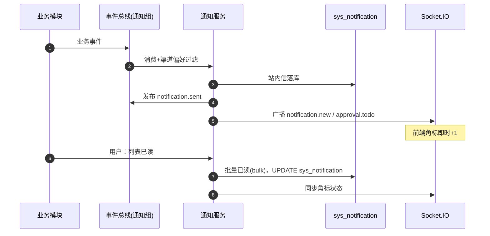

# 概要设计 · 通知中心

> BMS · 站内信与审批待办提醒

[概要设计](01_概要设计_总览.md) › 17-通知中心　|　[← 16-工作流管理](16_概要设计_工作流管理.md) · [18-帮助中心 →](18_概要设计_帮助中心.md)

本节对应[《项目规划说明》](../../规划/项目规划说明.md)「功能模块」之**通知中心**模块与「通知中心（含批量已读）」章节，
架构设计依据[《架构设计》](../架构设计/01_架构设计_总览.md)18-通知公告节点与 14-实时推送节点。

## 1. 模块概述与职责 

通知中心模块提供**个人维度**的站内信与审批待办提醒：用户接收系统各业务模块产生的通知
（站内信、审批待办、系统提示），支持待办角标实时更新（Socket.IO）、单条/批量/全部已读（PC + 移动端）。

- **模块定位**：用户侧的消息收件箱与已读状态管理；通知的*生产*由各业务模块（工作流、采购等）触发，本模块负责落库、渠道过滤、推送与已读
- **职责边界**：通知列表/详情、未读数、已读（单条/批量/全部）；**区别于公告**——公告面向全员（sys_notice），站内信面向个人（sys_notification），两者数据表与页面独立
- **协作关系**：
  - 实时推送（[架构 13](../架构设计/14_架构设计_子系统_实时推送.md)）：新站内信广播 notification.new；审批待办广播 approval.todo；批量已读同步角标状态
  - 工作流（[架构 16](../架构设计/17_架构设计_子系统_工作流.md)）：审批待办生成 → 站内信落库 + 实时触达
  - [用户喜好](04_概要设计_用户喜好.md)：通知偏好（渠道开关、免打扰时段）见用户喜好模块（sys_user_preference），发送前按偏好过滤

## 2. 功能分解与业务流程 

### 2.1 功能点分解 

| 功能点 | 说明 | 权限码 |
| --- | --- | --- |
| 通知列表 | 站内信列表（分页 + 类型/已读状态筛选），PC + 移动端 | notification:query |
| 通知详情 | 查看内容并自动标记已读（biz_type/biz_id 可跳转业务单据） | notification:query |
| 待办角标 | 未读/待办计数，Socket.IO 实时推送增量更新 | —（登录态内建） |
| 已读管理 | 单条已读、批量已读、全部已读（PC + 移动端） | notification:update |
| 通知删除 | 单条删除（软删除，仅本人数据；已删除通知不再进入列表与未读数） | notification:delete |
| 通知渠道过滤 | 按用户通知偏好过滤渠道（站内信/邮件/短信开关、免打扰时段），被过滤渠道不发送（偏好配置在用户喜好模块） | —（生成侧执行） |

### 2.2 通知生成与已读流程 

1. 业务事件（如审批待办生成）→ 通知组消费（RocketMQ 事件总线）→ 按收件人通知偏好过滤渠道
2. 站内信落库 sys_notification（个人维度，一条一用户）→ 发布 notification.sent 事件 → 触发 Socket.IO 推送（notification.new / approval.todo）
3. 前端收到推送：待办/未读角标 +1；未连接时重连后拉取未读数补偿（不依赖推送补齐）
4. 用户操作：打开详情自动已读；列表勾选批量已读；一键全部已读
5. 异常分支：
  - 推送失败（连接断开）：不重试单条推送，靠重连补偿拉取未读数兜底
  - 批量已读大范围更新：按 user_id 批量更新（bulk），加锁避免与实时推送并发丢失角标增量
  - 免打扰时段：站内信仍落库但实时推送延后（按偏好配置），避免打扰

## 3. 关键时序与协作 

协作要点：通知生成与业务主链路异步解耦（事件总线消费），主链路不等待；推送目标按 user_id 路由
（RedisManager 跨实例广播）；断线补偿由前端重连后拉取未读数完成，不引入可靠投递协议。

## 4. 数据模型与表设计 

核心表 `sys_notification`（租户库，个人维度）：

| 字段 | 类型 | 说明 |
| --- | --- | --- |
| id | bigint | 雪花 ID 主键 |
| user_id | bigint | 收件用户 ID，索引；未读数统计主路径 |
| title | varchar | 通知标题 |
| content | text | 通知内容（运行时生成，按收件人 locale 渲染，不走 i18n 附表） |
| type | varchar | 通知类型（站内信/待办提醒/系统提示） |
| biz_type / biz_id | varchar / bigint | 业务来源类型与单据 ID（如 wf_task / 采购申请），点击跳转 |
| is_read | tinyint | 已读标记（0 未读 / 1 已读） |
| deleted | tinyint | 软删除标记（0 正常 / 1 已删除，用户主动删除；列表与未读数过滤，数据保留至归档） |

- **通用规范**：雪花 ID 主键、审计字段（created_at/created_by）、时间 UTC；软删除可不启用（个人消息物理保留至归档）
- **索引**：（user_id + is_read）复合索引支撑未读数与列表查询；created_at 排序索引
- **数据流转**：业务事件 → 落库 → 推送 → 已读更新；历史通知随数据量增长按归档策略流转（90 天策略可配，复用 sys_archive_policy 时间字段归档）
- **分片**：通知量大（全员 × 业务事件），MVP 不独立分片，归档策略承接长尾数据

## 5. 接口设计 

| 方法 | 路径 | 说明 | 权限码 |
| --- | --- | --- | --- |
| GET | /api/v1/notifications | 通知列表（分页 + 类型/已读筛选，仅本人数据） | notification:query |
| GET | /api/v1/notifications/unread-count | 未读数（角标初始化与重连补偿） | notification:query |
| GET | /api/v1/notifications/{id} | 通知详情（查看即标记已读） | notification:query |
| POST | /api/v1/notifications/read | 批量已读（body 传 id 列表） | notification:update |
| POST | /api/v1/notifications/read-all | 全部已读 | notification:update |
| DELETE | /api/v1/notifications/{id} | 单条删除（软删除，仅本人数据；校验 user_id 归属） | notification:delete |

- **通用规范**：前缀 `/api/v1`、统一响应 `{code, message, data}`、分页、Bearer 鉴权 + require_permission；数据强制按当前用户过滤（本人可见本人通知）
- **幂等**：批量/全部已读为幂等写操作，天然可重试（重复标记无副作用），不强制 Idempotency-Key
- **限流**：未读数查询短 TTL 缓存，防止高频轮询；列表查询按用户限流
- **发布事件**：notification.sent（user_id、type、biz_type）——Webhook 订阅：**否**（仅供内部联动/审计）

## 6. 权限与配置 

- **权限码**：业务 `notification`（通知中心，默认归属普通角色）；动作 query/update/delete 归属 notification 业务（`notification:query`、`notification:update`、`notification:delete`）
- **菜单挂接**：菜单「通知中心」挂表单（1:1），表单挂业务 notification；已读按钮挂动作 update；删除按钮挂动作 delete；角标/未读数属登录态内建能力，不挂按钮
- **数据权限**：通知按 user_id 固有隔离，不配置动作级数据范围
- **sys_config 参数**：通知中心本身无独立参数；渠道开关与免打扰时段存用户喜好（sys_user_preference，pref_key 如 notification.channels / notification.quiet_hours），本模块发送前读取
- **种子数据**：notification 业务码与动作码入平台库种子；通知模板文案走 sys_i18n_message（固定文案）与按收件人 locale 运行时渲染

## 7. 错误码与异常处理 

本模块错误码位于 **7xxxx 通知段**（70001-79999 通知/邮件/任务调度）：

| 错误码 | 说明 | 场景 |
| --- | --- | --- |
| 70001 | 通知不存在 | 查询/已读不存在的通知 id |
| 70002 | 无权操作他人通知 | 越权读取/标记他人通知（租户与用户边界） |
| 70003 | 批量已读参数非法 | id 列表为空或超上限（如单次 500 条） |
| 70004 | 通知生成失败 | 通知组消费落库异常（重试队列兜底） |
| 70005 | 推送不可达 | 目标用户无活动连接（不阻塞业务，走重连补偿） |
| 70006 | 删除他人通知被拒 | 软删除时校验 user_id 归属（同 70002 边界） |

- 异常处理：落库与推送分离——落库失败走 RocketMQ 重试；推送失败不回滚已落库通知；角标数据异常时前端可主动刷新未读数校准
- 通知内容按收件人 locale 渲染（gettext 运行时翻译），文案不拼装在错误码层

## 8. 页面清单与验收要点 

| 页面 | 端 | 说明 |
| --- | --- | --- |
| 通知中心 | PC | 通知列表（筛选/分页）、详情（自动已读、跳转业务）、勾选批量已读、全部已读、单条删除、角标 |
| 通知列表 | 移动端 H5 | Vant 列表、详情、批量已读/全部已读、左滑删除、角标（复用后端 API） |

**验收要点**：

- 审批待办生成后站内信即时落库，Socket.IO 推送角标实时 +1（断线重连后未读数补偿正确）
- 单条/批量/全部已读在 PC 与移动端均可用，已读状态跨端一致
- 单条删除（PC 按钮 / 移动端左滑）仅作用于本人通知，删除后不再出现在列表与未读数，数据保留至归档
- 通知中心与公告（全员维度）数据隔离，页面互不混淆
- 免打扰时段与渠道开关生效（偏好存于用户喜好模块）；notification.sent 事件正常发布且不被 Webhook 订阅
- 越权读取他人通知被拒；未读数查询接口性能达标（缓存兜底）

> 本文档为 AI 生成 · 概要设计节点 · 与《项目规划说明》《架构设计》《文档生成规范》《命名规范》配套 · 生成日期：2026-08-06