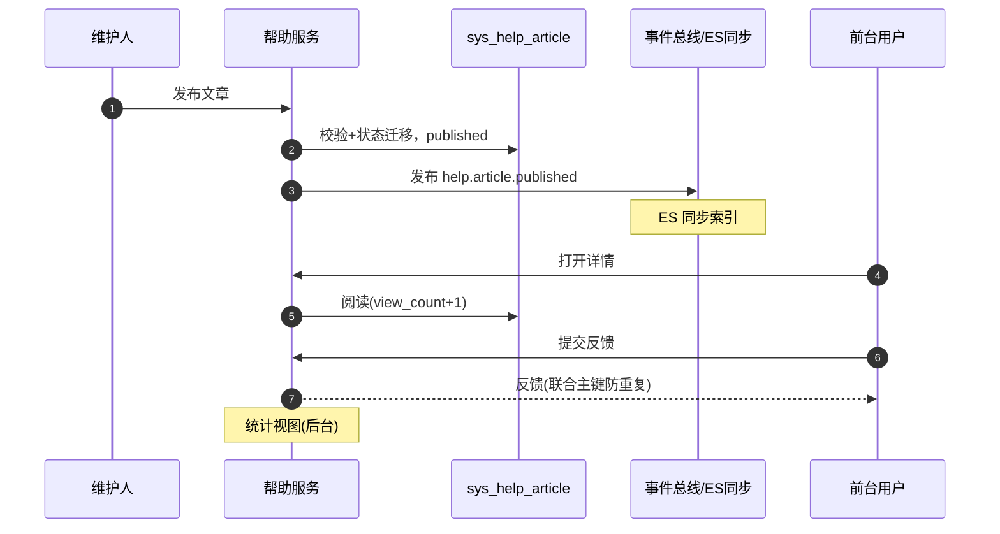

# 概要设计 · 帮助中心

> BMS · 帮助分类、文章维护与前台展示

[概要设计](01_概要设计_总览.md) › 18-帮助中心　|　[← 17-通知中心](17_概要设计_通知中心.md) · [19-公告管理 →](19_概要设计_公告管理.md)

本节对应[《项目规划说明》](../../规划/项目规划说明.md)「功能模块」之**帮助中心**模块与「帮助中心（分类/文章维护、页面内帮助、
阅读反馈统计）」章节，架构设计依据[《架构设计》](../架构设计/01_架构设计_总览.md)24-帮助中心节点。

## 1. 模块概述与职责 

帮助中心模块承载系统使用帮助文档：帮助分类与文章维护（在线编辑入库、草稿/发布/下架/置顶）、
前台展示（PC + 移动端，工作台卡片/个人中心入口）、页面内帮助按钮（表单/模块级 target 关联）、
阅读反馈与统计，并纳入[全文检索](34_概要设计_全文检索.md)与 AI 问答知识源。与公告区分：公告为全员临时通知，帮助为常驻知识库。

- **模块定位**：系统在线文档与知识管理，前台阅读免权限（登录即可），后台维护需 help 业务权限
- **职责边界**：分类树与文章内容全生命周期管理、前台展示与阅读反馈；AI 智能维护（阶段十五）仅在本节概述，详细设计见 AI 服务文档
- **协作关系**：
  - 全文检索（阶段十四）：文章发布/更新/删除事件驱动 ES 同步（bms-main 主数据索引）
  - AI 服务（阶段十五）：帮助文章为知识库问答机器人知识源（RAG，按租户隔离）；帮助文档智能维护生成草稿
  - 菜单/表单体系：页面内帮助按钮依赖表单元数据（target_type/target_key 关联）

## 2. 功能分解与业务流程 

### 2.1 功能点分解 

| 功能点 | 说明 | 权限码 |
| --- | --- | --- |
| 帮助分类维护 | 分类树增删改查（parent_id/排序/状态），删除前需处理其下文章（迁移或级联下架） | help:manage |
| 文章维护 | 在线编辑入库（富文本/轻 Markdown，XSS 白名单清洗）、草稿/发布/下架/置顶、target 关联（global/module/form + target_key） | help:manage |
| 多语言维护 | 标题/内容多语言存 i18n 附表，前台按 locale 展示、缺省回退 | help:manage |
| 前台展示 | 分类树 + 文章列表 + 详情（PC + 移动端），工作台卡片/个人中心入口 | —（登录即可） |
| 页面内帮助按钮 | 列表页/表单页右上角帮助按钮：按当前模块/表单查关联文章，命中弹文章、未命中打开分类帮助列表 | —（登录即可） |
| 阅读反馈与统计 | 有帮助/无帮助 + 评论（联合主键防重复、可改投）、阅读计数、后台统计视图 | 反馈：—（登录即可）；统计：help:manage |
| AI 智能维护（阶段十五） | AI 生成/更新草稿、form.updated 事件自动触发、质量评估报告；结果一律为草稿，人工审核后发布 | help:manage |

### 2.2 文章状态机 

| 状态 | 迁移 | 说明 |
| --- | --- | --- |
| 草稿（draft） | 新建/编辑保存 → 草稿；发布 → 已发布 | 仅后台可见，不进入前台与检索 |
| 已发布（published） | 发布 → 已发布；下架 → 已下架；编辑保存 → 草稿或直接发布新版本 | 前台展示；发布/更新触发 help.article.* 事件（检索同步） |
| 已下架（offline） | 下架 → 已下架；重新发布 → 已发布 | 前台隐藏，检索同步删除 |

- 置顶（is_top）：分类内置顶展示；发布时间 publish_at 控制前台可见时间
- 删除：复用软删除（deleted_at），回收站可恢复；删除动作落字段级审计（内容合规可追溯）
- AI 生成结果一律草稿，不自动覆盖已发布文章；全量落 ai_chat_log 审计

## 3. 关键时序与协作 

协作要点：发布链路同步完成落库与状态迁移，ES 同步异步（事件驱动，不阻塞发布）；阅读与反馈为轻量写
（计数可用缓冲合并，MVP 直接 +1 落库即可）；页面内帮助按钮数据随菜单/表单元数据接口一并下发（帮助标记）。

## 4. 数据模型与表设计 

核心表（租户库，系统表前缀 sys_）：

| 表 | 关键字段 | 说明 |
| --- | --- | --- |
| sys_help_category | parent_id、name、sort、status | 帮助分类树（如 快速上手/系统管理/业务操作） |
| sys_help_article | category_id、title、content、target_type（global/module/form）、target_key、author_id、status（draft/published/offline）、is_top、publish_at、view_count、helpful_count、unhelpful_count | 帮助文章（在线编辑入库）；target 关联页面内帮助按钮 |
| sys_help_article_i18n | article_id、locale、title、content | 多语言标题/内容，联合主键（article_id + locale），缺省回退主表默认文案 |
| sys_help_feedback | article_id、user_id、feedback（helpful/unhelpful）、comment、created_at | 阅读反馈，联合主键（article_id + user_id）防重复（可改投） |

- **通用规范**：雪花 ID 主键、软删除（deleted_at）、审计字段、乐观锁（version）、时间 UTC；跨表引用逻辑外键
- **索引**：分类 parent_id/sort；文章（category_id + status）、（target_type + target_key）索引（帮助按钮精确命中）、status + is_top + publish_at（前台列表）
- **数据流转**：分类 → 文章（target 关联）→ 发布（事件驱动 ES 同步）→ 阅读/反馈回流计数 → 统计驱动文档优化；i18n 附表随主表同生命周期
- **全文检索**：已发布文章入 bms-main 主数据索引（help.article.* 事件驱动，检索权限按租户隔离）；草稿/下架文章不进入检索与 AI 知识源

## 5. 接口设计 

| 方法 | 路径 | 说明 | 权限码 |
| --- | --- | --- | --- |
| GET | /api/v1/help/categories | 分类树（后台含草稿计数，前台仅可见分类） | 前台：—；后台：help:manage |
| POST/PUT | /api/v1/help/categories | 新建/编辑分类 | help:manage |
| DELETE | /api/v1/help/categories/{id} | 删除分类（需先处理其下文章） | help:manage |
| GET | /api/v1/help/articles | 文章列表（前台：已发布 + 分类筛选；后台：全状态） | 前台：—；后台：help:manage |
| POST/PUT | /api/v1/help/articles | 新建/编辑文章（保存草稿或直接发布） | help:manage |
| POST | /api/v1/help/articles/{id}/publish | 发布（draft → published） | help:manage |
| POST | /api/v1/help/articles/{id}/offline | 下架（published → offline） | help:manage |
| GET | /api/v1/help/articles/{id} | 文章详情（前台阅读 +1；含 i18n 按 locale 返回） | 前台：—；后台：help:manage |
| GET | /api/v1/help/context | 页面内帮助查询（按 target_type + target_key 精确命中或分类兜底） | —（登录即可） |
| POST | /api/v1/help/articles/{id}/feedback | 提交反馈（helpful/unhelpful + comment，联合主键防重复、可改投） | —（登录即可） |
| GET | /api/v1/help/statistics | 阅读与反馈统计视图（按文章/分类） | help:manage |

- **通用规范**：前缀 `/api/v1`、统一响应、分页、Bearer 鉴权；前台接口登录即可，后台接口 require_permission 校验
- **幂等**：文章发布/下架为状态迁移，重复调用无副作用；反馈接口联合主键天然防重复
- **限流**：阅读计数接口按用户限流（防刷 count）；反馈按用户限流
- **发布事件**（Webhook 订阅：**否**；ES 同步：是）：help.article.published / help.article.updated / help.article.deleted（article_id、category_id、target_key）

## 6. 权限与配置 

- **权限码**：业务 `help`（帮助中心：分类/文章维护，默认归属系统管理员）；动作 manage/query 归属 help 业务（`help:manage`、`help:query`）
- **菜单挂接**：菜单「帮助管理」（分类/文章维护）与「帮助中心」（前台展示）分别挂表单；「帮助中心前台」菜单可默认授权全体用户（登录即可）
- **数据权限**：帮助文章属租户库（租户维护各自帮助），按租户隔离；不配置动作级数据范围
- **sys_config 参数**：无独立业务参数；AI 帮助维护相关开关随 AI 能力（阶段十五）管理
- **种子数据**：初始帮助分类与基础文章种子——快速上手/系统管理/业务操作（含 i18n 附表英文文案）

## 7. 错误码与异常处理 

本模块属于内容维护类，错误码位于 **4xxxx 系统配置段**（40001-49999 系统配置：菜单/字典/系统参数/国际化语言包）：

| 错误码 | 说明 | 场景 |
| --- | --- | --- |
| 40001 | 分类不存在 | 文章挂载已删除分类（软删除隔离） |
| 40002 | 分类下存在文章不可删除 | 删除含文章的父分类且未迁移/级联下架 |
| 40003 | 文章不存在 | 查询/发布/下架不存在的文章 |
| 40004 | 状态不允许该操作 | 发布已发布文章、下架草稿、编辑已删除文章 |
| 40005 | 内容校验失败 | 标题/内容超限、XSS 白名单清洗拒绝 |
| 40006 | target 关联冲突 | 同一（target_type + target_key）重复绑定多篇已发布文章（页面内帮助唯一性） |
| 40007 | 反馈重复 | 同用户对同文章重复反馈（联合主键兜底，返回已有反馈允许改投） |

- 异常处理：富文本按白名单清洗防 XSS；内容变更落字段级审计（sys_data_audit_log 关键表）；ES 同步失败由事件重放兜底，不影响前台直读数据库展示
- 前台接口无权限时返回通用 1xxxx 认证错误，页面隐藏后台入口

## 8. 页面清单与验收要点 

| 页面 | 端 | 说明 |
| --- | --- | --- |
| 帮助管理（分类维护） | PC | 分类树增删改查、排序、启停；文章迁移/级联下架引导 |
| 帮助管理（文章维护） | PC | 文章在线编辑（草稿/发布/下架/置顶）、target 关联、多语言维护、统计视图、AI 生成草稿入口（阶段十五） |
| 帮助中心前台 | PC + 移动端 | 工作台卡片/个人中心入口、分类树 + 文章列表 + 详情（阅读反馈、计数展示） |

**验收要点**：

- 分类/文章维护全流程可用（草稿→发布→下架→重新发布）；置顶与排序生效
- 前台展示（PC + 移动端）与页面内帮助按钮可用：精确命中弹文章、未命中打开分类列表；无帮助标记时不显示按钮
- 阅读反馈防重复（联合主键）、可改投；阅读/有帮助/无帮助计数准确；统计视图可查
- 已发布文章进入全文检索与全局搜索可命中；草稿/下架不进入检索与 AI 知识源（阶段十四验证）
- help.article.* 事件正常发布（Webhook 不订阅）；文章变更落字段级审计；初始种子（快速上手/系统管理/业务操作）可展示
- 多语言标题/内容按 locale 展示、缺省回退正确（阶段四验证）

> 本文档为 AI 生成 · 概要设计节点 · 与《项目规划说明》《架构设计》《文档生成规范》《命名规范》配套 · 生成日期：2026-08-06