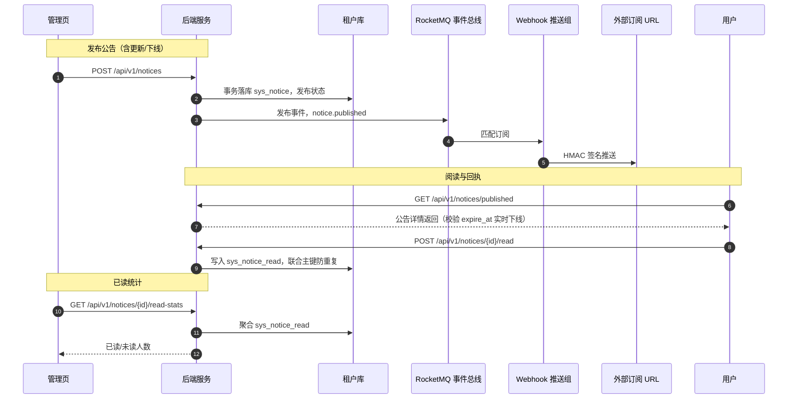

# 概要设计 · 公告管理

> BMS · 全员公告发布与已读回执统计

[概要设计](01_概要设计_总览.md) › 19-公告管理　|　[← 18-帮助中心](18_概要设计_帮助中心.md) · [20-导入导出 →](20_概要设计_导入导出.md)

## 1. 模块概述与职责 

本节对应[《项目规划说明》](../../规划/项目规划说明.md)「功能模块」之**公告管理**模块，以及「核心数据表清单」「事件总线事件模型」「前端页面清单与菜单机制」章节；
架构设计依据[《架构设计》](../架构设计/01_架构设计_总览.md)12-事件总线 节点（事件发布与 Webhook 推送）。

- **模块定位**：公告管理承载面向租户全员的公告发布、编辑、置顶、过期自动下线与已读回执统计，是租户运营信息触达的统一出口。
- **职责边界**：公告面向**全员**（一对多广播），与[通知中心](17_概要设计_通知中心.md)的个人站内信（sys_notification，一对一待办/提醒）在受众、触发方式上明确区分；本模块不负责个人待办提醒，后者归通知中心。
- **协作关系**：公告发布/更新/下线时经事件总线发布 `notice.published` 事件，供 Webhook 订阅推送；公告数据（sys_notice）属关键表，字段级变更进入数据变更审计（sys_data_audit_log）；过期自动下线依赖[任务调度](24_概要设计_任务调度.md)能力做定时扫描兜底。

## 2. 功能分解与业务流程 

### 2.1 功能点分解 

| 功能点 | 说明 | 权限码 |
| --- | --- | --- |
| 公告发布 | 填写标题/内容/类型/优先级，设置发布时间与过期时间，发布后全员可见 | notice:create |
| 公告编辑 | 对已保存公告修改内容与属性；已发布公告修改后重新发布并推送更新事件 | notice:update |
| 公告删除 | 软删除公告（deleted_at），删除动作落操作日志 | notice:delete |
| 置顶 / 取消置顶 | 设置公告置顶（is_top），置顶公告在列表前排展示，多公告置顶按更新时间排序 | notice:update |
| 过期自动下线 | 到达 expire_at 的公告自动下线，不再对全员展示（读取校验 + 定时扫描兜底） | 系统自动 |
| 已读回执统计 | 用户阅读公告后落已读回执（notice_id + user_id 联合主键防重复），统计已读人数/未读人数 | notice:query |
| 公告查看 | 全员在 PC 与移动端查看已发布公告列表与详情（含置顶标识、已读状态） | notice:query |

### 2.2 业务规则 

- 公告发布需满足：当前时间在 publish_at 之后、expire_at 之前，且 status 为发布状态；未到 publish_at 的公告不展示；超过 expire_at 自动下线。
- 已读回执以（notice_id, user_id）唯一联合主键保证一人一条，重复阅读不重复计回执；公告发布人、管理员阅读同样计入回执。
- 已下线公告保留数据（含回执统计）供审计追溯，不做物理删除；列表默认只展示"发布中"公告，历史公告按筛选条件查询。
- 公告发布/更新/下线均发布 `notice.published` 事件（载荷 notice_id、title、is_top），Webhook 订阅按事件名匹配推送。
- 公告管理操作（发布/编辑/删除/置顶）落操作日志，操作日志 action 记录权限码（业务:动作），与权限体系对齐。

### 2.3 流程步骤 

1. 编辑公告：填写标题、内容、类型、优先级、置顶、publish_at、expire_at，保存为草稿状态（status 未发布）。
2. 发布公告：校验发布时间与过期时间合法性（expire_at > publish_at）后置为发布状态，全员列表可见。
3. 异常分支——发布校验失败：时间非法或内容为空时拒绝发布，返回错误码（7xxxx 段），不产生事件。
4. 过期下线：读取公告时实时校验 expire_at（已过期即按下线处理）；同时由定时任务周期扫描 sys_notice，将过期公告批量置为下线状态，防止漏扫时点上的展示偏差。
5. 异常分支——定时扫描失败：任务失败落 sys_task_log，读取侧实时校验仍兜底保证过期公告不展示，下次扫描重试。

## 3. 关键时序与协作 

与消息队列协作要点：公告事件经 RocketMQ 事务消息发布（本地业务事务与消息发送原子一致，避免丢事件）；
与通知中心协作要点：公告不产生个人站内信，通知中心仅处理 sys_notification 个人待办/提醒，两者事件（notice.published 与 notification.sent）互不混用。

## 4. 数据模型与表设计 

遵循《项目规划说明》核心数据表统一规范：雪花 ID 主键、软删除（deleted_at）、审计字段（created_at/created_by/updated_at/updated_by）、乐观锁（version）、时间 UTC 存储；关联表用唯一联合主键。本模块表位于租户库（bms_tenant_{code}）。

| 表 | 关键字段 | 说明 |
| --- | --- | --- |
| sys_notice | title、content、type、priority、is_top、publish_at、expire_at、status | 全员公告主表；type（类型）与 priority（优先级）取值由通用字典维护；status 标记发布/下线状态；expire_at 驱动过期自动下线 |
| sys_notice_read | notice_id、user_id、read_at | 公告已读回执，联合主键（notice_id + user_id）防重复回执 |

- **索引**：sys_notice 对 publish_at / expire_at / status 建索引支撑状态查询与过期扫描，is_top + 发布时间支撑置顶排序；sys_notice_read 按 notice_id 建索引支撑已读统计聚合。
- **分片与归档**：两表均为常规表，不按月分片；sys_notice_read 随租户规模增长，可纳入归档策略（全表可配：时间阈值/保留期/目标）流转至归档库与对象存储，降低租户库体量。
- **审计衔接**：sys_notice 属关键表清单，字段级变更经 ORM 事件自动记录至 sys_data_audit_log（按月分表，哈希链防篡改）；已读回执写入量大、非关键变更，不进入字段级审计。
- **数据流转**：公告发布（写 sys_notice）→ 事件通知（notice.published 出站）→ 用户阅读（写 sys_notice_read）→ 统计聚合（读 sys_notice_read）。

## 5. 接口设计 

全部接口前缀 `/api/v1`，统一响应 `{code, message, data}`；除健康检查外一律 Bearer access token 鉴权，权限校验用 `require_permission` 依赖。

### 5.1 接口清单 

| 方法 | 路径 | 说明 | 权限码 |
| --- | --- | --- | --- |
| GET | /api/v1/notices | 公告管理列表（分页 + 状态/类型/关键字筛选） | notice:query |
| POST | /api/v1/notices | 新建公告（草稿或直接发布） | notice:create |
| PUT | /api/v1/notices/{id} | 编辑公告（含置顶/取消置顶、重新发布） | notice:update |
| DELETE | /api/v1/notices/{id} | 删除公告（软删除） | notice:delete |
| GET | /api/v1/notices/published | 全员可见公告列表（PC + 移动端查看，仅发布中且未过期） | 登录即可 |
| GET | /api/v1/notices/{id} | 公告详情（含当前用户已读状态） | notice:query |
| POST | /api/v1/notices/{id}/read | 提交已读回执（联合主键防重复） | 登录即可 |
| GET | /api/v1/notices/{id}/read-stats | 已读回执统计（已读/未读人数与明细） | notice:query |

### 5.2 公共要求 

- 分页：查询参数 page（从 1 起）、size；响应 {list, total, page, size}。
- 幂等：公告发布/编辑等写接口支持幂等键（请求头 Idempotency-Key），Redis SETNX 前置拦截（重复键直接返回首次结果）+ 幂等键字段唯一约束兜底（并发穿透时拒绝重复提交）。
- 限流：接口级限流（slowapi，Redis 后端），公告详情与已读回执接口按 IP/用户维度限流防刷。
- 租户识别：按子域名解析租户（生产），开发环境以 token 内 tenant_id 兜底；查询强制租户隔离。

### 5.3 发布事件 

| 事件 | 触发时机 | 主要载荷 | Webhook 订阅 |
| --- | --- | --- | --- |
| notice.published | 公告发布/更新/下线 | notice_id、title、is_top | 是 |

事件命名 `{域}.{动作}`，经 RocketMQ 事件总线发布，Webhook 订阅按事件名匹配；事件信封含 event_id（幂等键）保证消费幂等。

## 6. 权限与配置 

- **权限码**：业务 `notice`（公告管理，默认归属普通角色），动作 create/update/delete/query；典型权限码 notice:create、notice:update、notice:delete、notice:query。
- **菜单挂接**：菜单「公告管理」→ 表单（1:1）→ 业务权限 notice；工具栏按钮「发布/编辑/删除/置顶/已读统计」按动作权限显隐（默认无任何按钮权限）；字段权限默认全部可见可编辑，授予后按配置收窄。
- **sys_config**：公告相关可配置参数（如过期扫描频率）按系统参数机制维护，平台库存默认、租户库可覆盖。
- **种子数据**：公告管理菜单/表单/按钮/字段与 notice 业务、动作权限码作为初始化数据种子（与后端模块定义对齐，含 i18n 附表文案）；公告类型/优先级等字典条目随基础字典种子下发。

## 7. 错误码与异常处理 

错误码 5 位数字，万位为模块段、后 4 位为段内序号，一经发布稳定不变；文案由前端按 i18n 映射（error.{code}），后端不承担文案拼装。本模块错误码段：

| 段 | 区间 | 覆盖模块 |
| --- | --- | --- |
| 7xxxx | 70001-79999 | 通知/邮件/任务调度（本模块规划于 71xxx 段内序号） |

- 公告错误码覆盖：公告不存在、已删除、发布时间非法（expire_at 不大于 publish_at）、发布状态冲突（对已下线公告重复发布等）、已读回执重复提交等。
- 异常处理要求：发布写操作在单事务内完成，失败整体回滚不产生半发布状态；过期扫描任务失败落 sys_task_log 并可重试，读取侧实时校验兜底；公告内容按富文本处理，前端 Element Plus 默认转义防 XSS，后端存储不执行内容。

## 8. 页面清单与验收要点 

| 端 | 页面 | 说明 |
| --- | --- | --- |
| PC 管理端 | 公告管理 | 公告列表（置顶标识、状态、发布时间、已读进度）、发布/编辑弹窗、置顶操作、已读回执统计面板 |
| 移动端 H5 | 公告查看 | Vant 列表与详情、置顶标识、已读自动回执（frontend-mobile） |

**验收要点**（对齐《项目规划说明》MVP 验收标准与测试策略）：

- 公告发布与已读统计可用：发布后全员可见、阅读后已读数正确、重复阅读不重复计回执；
- 过期自动下线验证：到达 expire_at 后列表与详情均不再展示，定时扫描任务执行记录可查；
- 事件推送验证：发布/更新/下线均产生 notice.published 事件，Webhook 订阅可收到（见 21-Webhook 管理）；
- 越权与隔离验证：无 notice 权限用户不可管理公告、跨租户公告不可见；公告管理操作落操作日志、字段级变更落数据变更审计。

> 本文档为 AI 生成 · 概要设计节点 · 与《项目规划说明》《架构设计》《文档生成规范》《命名规范》配套 · 生成日期：2026-08-06