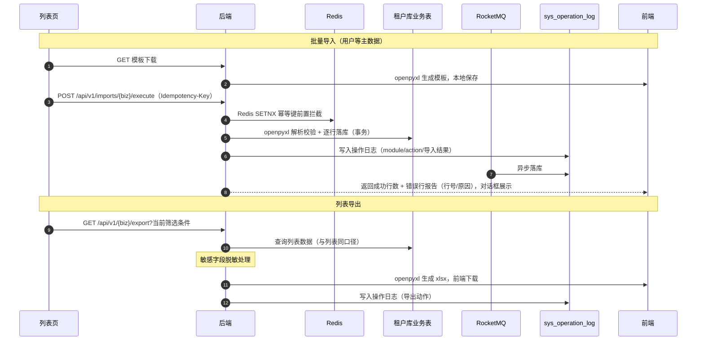

# 概要设计 · 导入导出

> BMS · Excel 批量导入与列表导出

[概要设计](01_概要设计_总览.md) › 20-导入导出　|　[← 19-公告管理](19_概要设计_公告管理.md) · [21-开放接口管理 →](21_概要设计_开放接口管理.md)

## 1. 模块概述与职责 

本节对应[《项目规划说明》](../../规划/项目规划说明.html)「功能模块」之**导入导出**模块，以及「API 设计规范」「认证与安全」（数据脱敏）、「核心数据表清单」（[操作日志](11_概要设计_操作日志.md)）章节；
架构设计依据[《架构设计》](../架构设计/01_架构设计_总览.md)06-接口与集成 节点（API 公共约定与幂等规范）。

- **模块定位**：为各业务模块提供统一的 Excel 批量导入与列表导出能力，MVP 覆盖用户等主数据批量导入与各列表页当前筛选条件下的数据导出。
- **职责边界**：本模块提供导入导出**通用通道**，不持有业务表，复用各业务表与操作日志；文件处理基于 openpyxl（读取与生成 xlsx）。
- **协作关系**：导入导出动作全部落操作日志（谁在何时导入了什么、导出了什么）；导出数据经数据脱敏机制处理（敏感字段默认掩码，持 data:plain 权限码方可导出明文）；导入写接口与文件上传共用限流与上传安全基线（类型白名单、大小上限）。

## 2. 功能分解与业务流程 

### 2.1 功能点分解 

| 功能点 | 说明 | 权限码 |
| --- | --- | --- |
| 导入模板下载 | 按业务表字段生成 Excel 模板（openpyxl），含列头与填写说明，随各列表页导入对话框提供下载 | import:execute |
| Excel 批量导入 | 用户等主数据批量导入：上传文件 → 解析校验 → 逐行落库 → 返回错误行报告（错误行号 + 原因） | import:execute |
| 导入幂等拦截 | 导入请求携带 Idempotency-Key，Redis SETNX 前置拦截 + 唯一约束兜底，重复提交不产生重复数据 | import:execute |
| 导入审计衔接 | 导入动作落操作日志（模块、动作、导入结果摘要），导入产生的数据变更按各业务表既有审计规则记录 | 系统自动 |
| 列表导出 | 按当前筛选条件导出列表数据为 Excel（导出与查询同一数据口径） | export:download |
| 导出脱敏 | 敏感字段（手机号/邮箱/身份证等）导出默认脱敏，持 data:plain 权限码方可导出明文 | export:download |

### 2.2 业务规则 

- 导入模板列与业务表字段对齐，列头固定，模板内不允许增删列；解析校验按模板列序读取。
- 导入校验先行：逐行做必填、格式、枚举、唯一性（结合库内已有数据）校验，**全部通过的行才落库，任一字段失败的行整体跳过**并记录错误行号与原因，成功与失败行数汇总返回。
- 导入幂等：写接口要求 Idempotency-Key 请求头；Redis SETNX 前置拦截（重复键直接返回首次处理结果）+ 幂等键字段唯一约束兜底（并发穿透时拒绝重复提交），保证重复请求不产生重复数据。
- 导入按单事务分批落库：逐行落库在同一事务内提交，事务失败整体回滚；单批次行数超限时按配置分批处理，避免长事务占用连接。
- 导出数据口径与当前列表筛选条件一致（复用查询参数），导出文件不含后端未授权的字段；敏感字段按脱敏规则处理。
- 导入/导出动作均落操作日志，操作日志的 action 记录权限码（业务:动作），与权限体系对齐。

### 2.3 流程步骤 

1. 模板下载：用户在各列表页点击导入 → 下载模板 → 按模板填写数据。
2. 文件上传：选择填好的 Excel 上传（类型白名单校验 xlsx，大小上限校验），携带 Idempotency-Key 提交导入。
3. 解析校验：openpyxl 读取 → 表头核对 → 逐行字段校验（必填/格式/枚举/唯一性）。
4. 逐行落库：校验通过的行批量写入业务表（同一事务），并记录导入结果。
5. 错误行报告：返回成功行数、失败行数与逐行错误明细（行号 + 原因），前端对话框展示，用户修正后重新导入（新幂等键）。
6. 异常分支——文件格式错误：非 xlsx 或模板列不匹配时整体拒绝，返回 5xxxx 文件段错误码，不进入解析；
7. 异常分支——并发重复提交：相同幂等键并发穿透时，唯一约束拦截拒绝重复，返回首次处理结果。

## 3. 关键时序与协作 

与缓存/限流协作要点：导入幂等键为 Redis 持久状态类 key（TTL 与业务有效期对齐）；导入导出接口级限流（slowapi，Redis 后端）防批量滥用；
操作日志经 RocketMQ 异步写入降低主库写压力（日志落库组）。

## 4. 数据模型与表设计 

本模块**无独立业务表**：导入数据落入各业务表（如用户导入落 sys_user），导出数据读各业务表；
导入导出动作本身以操作日志（sys_operation_log）留痕。

| 数据载体 | 说明 |
| --- | --- |
| 各业务表（如 sys_user） | 导入的最终落库目标，遵循既有表结构、唯一约束与审计字段（created_by 记导入执行人） |
| sys_operation_log | 导入/导出动作审计：module（业务模块）、action（import:execute / export:download）、params（导入行数/结果摘要）、ip、status、cost_time；按月分表 + 哈希链防篡改，保留 90 天归档 |
| 导入模板 | 按业务表字段实时生成（openpyxl），不落库 |

- **唯一性约束**：业务唯一约束统一建为（唯一字段, deleted_at）复合唯一索引——导入逐行落库时撞唯一键的行报错进入错误行报告；幂等键字段唯一约束兜底重复提交。
- **数据流转**：模板（下载）→ Excel 文件（上传）→ 解析校验（内存）→ 业务表（落库）→ 操作日志（审计）→ 导出文件（出站）。

## 5. 接口设计 

全部接口前缀 `/api/v1`，统一响应 `{code, message, data}`；除健康检查外一律 Bearer access token 鉴权。

### 5.1 接口清单 

| 方法 | 路径 | 说明 | 权限码 |
| --- | --- | --- | --- |
| GET | /api/v1/imports/{biz}/template | 下载导入模板（biz 为业务标识，如 users） | import:execute |
| POST | /api/v1/imports/{biz}/execute | 执行批量导入（multipart 上传 Excel；支持 Idempotency-Key 幂等键） | import:execute |
| GET | /api/v1/{biz}/export | 按当前筛选条件导出列表数据为 Excel（查询参数与列表接口一致） | export:download |

### 5.2 公共要求 

- 幂等：导入执行接口必须携带 Idempotency-Key；Redis SETNX 前置拦截（重复键直接返回首次结果）+ 幂等键字段唯一约束兜底（并发穿透拒绝重复提交）。
- 上传安全：文件类型白名单（xlsx）+ 大小上限（默认 20MB，sys_config 可配），与文件管理上传基线一致；仅接受 openpyxl 可解析的 xlsx，拒绝宏文件与异常结构。
- 分页与批量：导入响应返回 {total, success_count, fail_count, errors:[{row, message}]}；单批行数上限由 sys_config 配置，超限分批处理。
- 限流：导入/导出接口级限流（slowapi，Redis 后端，IP/用户维度），防止批量请求拖垮数据库。
- 导出：响应为 Excel 文件流（application/vnd.openxmlformats-officedocument.spreadsheetml.sheet），文件名含导出时间；敏感字段默认脱敏。

### 5.3 发布事件 

本模块不发布独立业务事件：导入产生的数据变更随各业务既有事件（如 user.created）由业务模块发布；导入/导出动作仅落操作日志，不进入事件总线。

## 6. 权限与配置 

- **权限码**：业务 `import`（Excel 批量导入，默认归属普通角色）与业务 `export`（列表导出，默认归属普通角色）；动作 execute、download；典型权限码 import:execute、export:download。
- **菜单挂接**：导入/导出作为各业务列表页工具栏按钮挂接动作权限（按钮→动作，默认无任何按钮权限）；持有 import:execute 显示「导入」入口，持有 export:download 显示「导出」入口。
- **sys_config**：可配置项包括导入文件大小上限、单批导入行数上限、导出脱敏开关等（平台库存默认，租户库可覆盖）。
- **脱敏衔接**：敏感字段（手机号/邮箱/身份证等）注册标记，导出序列化层默认掩码；持 data:plain 权限码方可导出明文，与页面展示脱敏机制一致。
- **种子数据**：import / export 业务与 execute / download 动作权限码为平台种子；各列表页导入/导出按钮挂接随对应模块菜单种子下发。

## 7. 错误码与异常处理 

错误码 5 位数字，万位为模块段、后 4 位为段内序号，一经发布稳定不变；文案由前端按 i18n 映射（error.{code}），后端不承担文案拼装。本模块错误码段：

| 段 | 区间 | 覆盖模块 |
| --- | --- | --- |
| 5xxxx | 50001-59999 | 文件（上传/下载/分片/导入导出）（本模块规划于 51xxx 段内序号） |

- 错误码覆盖：模板不匹配/列头错误、文件格式不支持、文件超限、批量超限、行级校验失败（必填缺失/格式非法/枚举非法/唯一冲突）、幂等键缺失或重复提交被拦截等。
- 异常处理要求：行级错误不中断整体导入（跳过该行并记入错误行报告），文件级错误整体拒绝；事务失败整体回滚并返回明确错误；解析器异常捕获后返回可读原因，不暴露内部堆栈。

## 8. 页面清单与验收要点 

| 端 | 页面 | 说明 |
| --- | --- | --- |
| PC 管理端 | 各列表页导入/导出入口（导入导出对话框） | 列表工具栏「导入/导出」按钮：导入对话框（模板下载、文件选择、上传进度、错误行报告展示）；导出按钮直接触发当前筛选条件下载 |
| 移动端 H5 | 无独立页面 | 导入导出为管理端能力，移动端不做批量维护入口 |

**验收要点**（对齐《项目规划说明》MVP 验收标准与测试策略）：

- Excel 导入导出可用：模板下载、批量导入、错误行报告（行号 + 原因）展示、按当前筛选条件导出均可正常工作；
- 幂等验证：相同 Idempotency-Key 重复提交只产生一次数据，并发穿透被唯一约束拒绝；
- 审计衔接验证：导入/导出动作均落操作日志（操作人、模块、结果摘要可查）；
- 脱敏验证：敏感字段导出默认脱敏，持 data:plain 权限码方可导出明文。

> 本文档为 AI 生成 · 概要设计节点 · 与《项目规划说明》《架构设计》《文档生成规范》《命名规范》配套 · 生成日期：2026-08-06