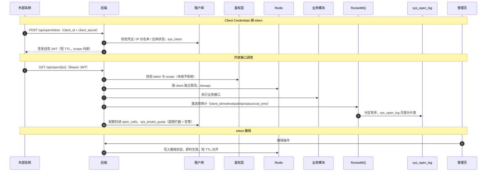

# 概要设计 · 开放接口管理

> BMS · 第三方应用注册与开放 API 鉴权

[概要设计](01_概要设计_总览.md) › 21-开放接口管理　|　[← 20-导入导出](20_概要设计_导入导出.md)　|　[22-Webhook 管理 →](22_概要设计_Webhook管理.md)

## 1. 模块概述与职责 

本节对应[《项目规划说明》](../../规划/项目规划说明.html)「功能模块」之**开放接口管理**模块，以及「系统集成」（对外 API）、「开放接口管理模块」「核心数据表清单」「租户配额」章节；
架构设计依据[《架构设计》](../架构设计/01_架构设计_总览.md)06-接口与集成 节点（对外 API、OAuth2、调用审计）。

- **模块定位**：管理第三方应用对 BMS 开放接口（/api/open）的接入：应用注册、OAuth2 Client Credentials 鉴权、scope 授权、IP 白名单、调用审计与配额控制。
- **职责边界**：本模块只管开放接口**接入侧**（鉴权/授权/审计/限流），具体开放业务接口的语义归各业务模块；出站方向的 Webhook 推送归 21-[Webhook 管理](22_概要设计_Webhook管理.md)。
- **协作关系**：token 签发自签 JWT（短 TTL）并支持独立撤销；调用审计落 sys_open_log（按月分片 + 哈希链，经 RocketMQ 分区有序消费保证链序）；租户配额 open_calls 超限拦截与告警；BMS 兼作 IdP 时第三方系统（OIDC 授权码）客户端注册复用本模块 sys_client。

## 2. 功能分解与业务流程 

### 2.1 功能点分解 

| 功能点 | 说明 | 权限码 |
| --- | --- | --- |
| 第三方应用注册 | 生成 client_id 与 client_secret（仅注册时明文展示一次），登记名称、负责人、授权类型、回调地址等 | open:manage |
| scope 分配与回收 | 按接口范围分配 scope；写接口（POST/PUT/DELETE）需显式授予；未授予一律拒绝 | open:manage |
| IP 白名单 | 限定可调用来源 IP/CIDR，白名单外请求拒绝 | open:manage |
| 凭证管理 | secret 重置（旧值即时失效）、应用停用/启用、access token 独立撤销 | open:manage |
| 调用审计与统计 | 按调用方、接口、时间、结果统计调用量，失败与鉴权拒绝明细可查 | open:view |
| OIDC 授权码客户端注册 | BMS 兼作 IdP：第三方以租户用户体系 SSO 登录，客户端注册复用本模块（redirect_uris/grant_types 扩展字段） | open:manage |

### 2.2 业务规则 

- 鉴权流程：OAuth2 Client Credentials——client_id/secret 换取 access token（自签 JWT，短 TTL），携带 Bearer token 调用 /api/open 接口；token 支持独立撤销，撤销后即时失效。
- 安全默认：scope 最小化分配——写接口（POST/PUT/DELETE）需显式授予，未授予一律拒绝；只读接口按分配的 scope 放行。
- 路由隔离：开放接口独立前缀 /api/open，与内部接口 /api/v1 物理隔离，不暴露内部接口；按 client 维度独立限流（slowapi，Redis 后端）。
- IP 白名单：client 配置 ip_whitelist 后，来源 IP 不在名单内的请求在鉴权前拒绝。
- 配额控制：租户开放接口调用量受 sys_tenant_quota.open_calls 配额约束，超限拦截并告警。
- 契约管理：OpenAPI（swagger.json）作为集成契约，CI 构建时导出快照存档随版本分发；生产环境关闭 Swagger/ReDoc 在线文档。
- 调用审计：每次开放接口调用落 sys_open_log（client_id/method/path/ip/status/cost_time），按月分片 + 哈希链防篡改，保留 90 天归档。

### 2.3 流程步骤 

1. 应用注册：管理员在开放接口管理页创建应用，系统生成 client_id / client_secret（secret 仅本次明文展示，落库只存哈希）。
2. 授权配置：分配 scope（写接口显式授予）、配置 IP 白名单与限流档位；外部系统获取 swagger.json 契约对接。
3. 换 token：外部系统以 client_id/secret 请求令牌接口，校验（凭证、白名单、应用状态）通过后签发自签 JWT（短 TTL）。
4. 调用：外部系统携带 access token 调用 /api/open 业务接口，网关按 scope 校验权限、按 client 限流、落调用审计。
5. 异常分支——凭证错误或 token 过期：返回 8xxxx 段错误码，审计记录失败状态；连续失败可触发告警；
6. 异常分支——scope 未授予：写接口未显式授权时一律拒绝，不因已持有 token 而放行；
7. 异常分支——配额超限：open_calls 达到限额后拦截调用并告警，管理员扩容配额后恢复。

## 3. 关键时序与协作 

与事件总线协作要点：调用审计经 RocketMQ 按租户分区有序消费（审计链组），保证哈希链不乱序；审计链跨月表首尾衔接，
归档前执行链完整性校验。与监控协作要点：开放接口调用量/失败率纳入监控指标与告警（Alertmanager 渠道）。

## 4. 数据模型与表设计 

遵循核心数据表统一规范：雪花 ID、软删除、审计字段、乐观锁、时间 UTC 存储。sys_client 位于**租户库**；sys_open_log 按月分片（分片键=时间，物理表名带 yyyyMM 后缀）。

| 表 | 关键字段 | 说明 |
| --- | --- | --- |
| sys_client | client_id、client_secret_hash、name、scopes、ip_whitelist、redirect_uris、grant_types、status | 第三方应用注册（OAuth2 Client Credentials + OIDC 授权码客户端）；secret 仅存哈希；grant_types 含 client_credentials / authorization_code；BMS 兼作 IdP 复用本表 |
| sys_open_log | client_id、method、path、ip、status、cost_time、prev_hash、record_hash | 开放接口调用审计，按月分表（分片键=时间），哈希链防篡改，保留 90 天归档 |

- **索引与分片**：sys_open_log 按（client_id, 时间）、（path, 时间）建索引支撑调用统计；月度分片表由 Celery 定时任务提前创建，新月份自动切换。
- **归档流转**：sys_open_log 保留 90 天后按归档策略（sys_archive_policy）两段式流转——热表超阈值迁归档库、按保留期转对象存储冷化；归档前链完整性校验。
- **数据流转**：注册（写 sys_client）→ 换 token（读 sys_client + 签发 JWT）→ 调用（业务执行）→ 审计（异步落 sys_open_log）→ 配额扣减（sys_tenant_quota）。

## 5. 接口设计 

内部管理接口前缀 `/api/v1`；对外开放接口前缀 `/api/open`，与内部接口隔离。统一响应 `{code, message, data}`。

### 5.1 接口清单 

| 方法 | 路径 | 说明 | 权限码 / 鉴权 |
| --- | --- | --- | --- |
| POST | /api/open/token | Client Credentials 换 token（client_id + client_secret 换自签 JWT，短 TTL） | 客户端凭证 |
| GET/POST/PUT/DELETE | /api/open/{业务资源路径} | 对外开放业务接口（按 scope 控制，写接口需显式授予） | Bearer JWT + scope |
| GET | /api/v1/open/clients | 应用列表（分页 + 状态/名称筛选） | open:view |
| POST | /api/v1/open/clients | 注册应用（返回 client_id / 明文 secret 一次） | open:manage |
| PUT | /api/v1/open/clients/{id} | 更新应用（scope 分配/回收、IP 白名单、授权类型） | open:manage |
| DELETE | /api/v1/open/clients/{id} | 停用/删除应用（token 即时失效） | open:manage |
| POST | /api/v1/open/clients/{id}/reset-secret | 重置 secret（旧值即时失效） | open:manage |
| POST | /api/v1/open/clients/{id}/revoke-token | 独立撤销该客户端全部 access token | open:manage |
| GET | /api/v1/open/logs | 调用日志查询与统计（调用方/接口/时间/结果筛选） | open:view |

### 5.2 公共要求 

- 分页：查询参数 page（从 1 起）、size；响应 {list, total, page, size}。
- 限流：/api/open 按 client 维度独立限流（slowapi，Redis 后端），与内部接口限流规则相互独立；登录类限流规则不适用于开放接口。
- 契约：swagger.json 由 CI 导出快照存档随版本分发；生产环境关闭 Swagger/ReDoc 在线文档。
- 版本演进：破坏性变更升级 /api/open/v2，新旧并行至少一个发布周期后下线旧版。
- 审计：所有开放接口调用（含鉴权失败）均落 sys_open_log，鉴权失败与调用失败区分 status 记录。

### 5.3 发布事件 

本模块不发布独立业务事件；外部系统感知数据变化通过 Webhook 订阅各业务事件（见 21-Webhook 管理）。调用审计与配额扣减为内部流水，不进事件总线。

## 6. 权限与配置 

- **权限码**：业务 `open`（开放接口与 Webhook，默认归属**安全管理员**）；动作 manage、view、call（以第三方身份调用，scope 授权）；典型权限码 open:manage、open:view；外部调用方持有的是 scope 而非内部权限码。
- **菜单挂接**：菜单「开放接口管理」「调用日志」→ 表单 → 业务权限 open；按钮「注册/编辑/重置密钥/撤销 token」按动作权限显隐。
- **sys_config**：可配置项包括 access token TTL（短 TTL）、开放接口限流档位、配额告警阈值等。
- **配额衔接**：sys_tenant_quota.quota_key=open_calls 按租户限额开放接口调用量，超限拦截与告警（租户管理模块配置）。
- **种子数据**：open 业务与 manage/view/call 动作权限码为平台种子；开放接口管理菜单/表单/按钮挂接随平台菜单种子下发。

## 7. 错误码与异常处理 

错误码 5 位数字，万位为模块段、后 4 位为段内序号，一经发布稳定不变；文案由前端按 i18n 映射（error.{code}），后端不承担文案拼装。本模块错误码段：

| 段 | 区间 | 覆盖模块 |
| --- | --- | --- |
| 8xxxx | 80001-89999 | 开放接口/Webhook/租户/SSO（本模块规划于 81xxx 段内序号） |

- 错误码覆盖：凭证无效、应用停用、token 过期/被撤销、scope 未授予（写接口未显式授权）、IP 白名单拒绝、配额超限、限流触发等。
- 异常处理要求：鉴权失败与调用失败均落调用审计；scope 校验先于业务执行，未授予一律拒绝不产生业务副作用；token 撤销经 Redis 即时生效；审计写入失败降级为同步直写并标记降级时段（对齐事件总线故障降级策略）。

## 8. 页面清单与验收要点 

| 端 | 页面 | 说明 |
| --- | --- | --- |
| PC 管理端 | 开放接口管理 | 应用列表、注册弹窗（client_id/secret 一次性展示）、scope 分配、IP 白名单、状态启停、重置密钥、撤销 token |
| PC 管理端 | 调用日志 | 按调用方/接口/时间/结果筛选的调用明细与统计（调用量、失败率） |
| 移动端 H5 | 无独立页面 | 开放接口管理为管理端能力 |

**验收要点**（对齐《项目规划说明》MVP 验收标准与测试策略）：

- 外部系统经 OAuth2 Client Credentials 调用开放接口鉴权通过：换 token、scope 放行、写接口未授予被拒均验证通过；
- 独立撤销验证：撤销 token 后调用即时失败；重置 secret 后旧 secret 失效；
- IP 白名单与按 client 限流验证：白名单外 IP 拒绝、单个 client 超限被限流；
- 调用审计验证：调用明细（client_id/method/path/ip/status/cost_time）可查、月度分片正确、哈希链校验通过、90 天归档流转正常；
- 配额验证：open_calls 超限拦截生效并产生告警。

> 本文档为 AI 生成 · 概要设计节点 · 与《项目规划说明》《架构设计》《文档生成规范》《命名规范》配套 · 生成日期：2026-08-06