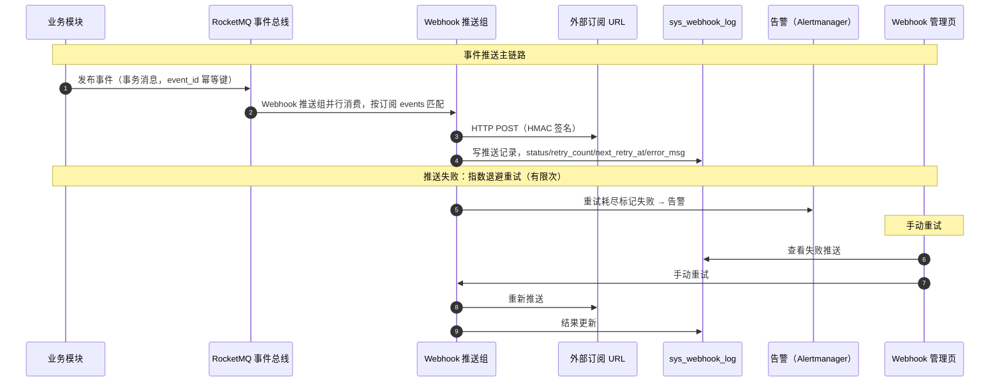

# 概要设计 · Webhook 管理

> BMS · 事件订阅注册与异步推送

[概要设计](01_概要设计_总览.md) › 21-Webhook 管理　|　[← 21-开放接口管理](21_概要设计_开放接口管理.md)　|　[23-系统监控 →](23_概要设计_系统监控.md)

## 1. 模块概述与职责 

本节对应[《项目规划说明》](../../规划/项目规划说明.md)「功能模块」之**Webhook 管理**模块，以及「系统集成」（出站集成）、「事件总线事件模型」「核心数据表清单」章节；
架构设计依据[《架构设计》](../架构设计/01_架构设计_总览.md)06-接口与集成（事件模型清单）与 12-事件总线（Webhook 推送组）节点。

- **模块定位**：将 BMS 内部事件经 RocketMQ 事件总线异步推送至外部注册 URL，实现事件驱动的对外集成（出站方向），与开放接口（入站方向，20-[开放接口管理](21_概要设计_开放接口管理.md)）互为补充。
- **职责边界**：本模块负责订阅注册、推送执行、签名校验、退避重试与推送状态记录；事件的生产由各业务模块（user/wf/purchase/notice/tenant/sso 等）负责。
- **协作关系**：事件信封经事件总线发布 → Webhook 推送组按事件名匹配订阅 → httpx 统一封装出站调用（超时/重试/熔断）→ 推送记录落 sys_webhook_log；事件订阅、推送状态与重试记录页面可查、可手动重试。

## 2. 功能分解与业务流程 

### 2.1 功能点分解 

| 功能点 | 说明 | 权限码 |
| --- | --- | --- |
| 订阅注册 | 登记名称、回调 URL、订阅事件（按事件名匹配，事件清单见《项目规划说明》事件模型表）、HMAC secret | open:manage |
| 订阅启停 | 停用后不再接收推送，fail_count 连续失败达阈值可自动停用 | open:manage |
| 事件推送 | 事件发生后经 RocketMQ 事件总线异步推送至注册 URL，携带 HMAC 签名（sha256(secret, body)） | 系统自动 |
| 重试与失败记录 | 推送失败指数退避重试，重试耗尽记失败；推送状态与重试记录落 sys_webhook_log | 系统自动 |
| 失败推送查看与重试 | 页面查看失败推送（事件、URL、错误信息）并手动重试 | open:manage |
| secret 管理与重置 | 订阅创建时生成 secret，支持重置（重置后新签名生效） | open:manage |

### 2.2 业务规则 

- 订阅匹配：事件命名 {域}.{动作}（如 user.updated、wf.task.completed、purchase.order.created、notice.published），Webhook 订阅按**事件名精确匹配**；一个订阅可注册多个事件。
- 推送时序：业务模块发布事件（事务消息保证原子一致）→ 事件总线按订阅匹配 → Webhook 推送组并行推送，推送不阻塞业务主链路。
- 签名校验：推送请求体以 secret 计算 HMAC-SHA256 摘要，放入签名头（sha256(secret, body)），外部系统据此验签确认来源可信。
- 重试策略：推送失败按**指数退避**自动重试（有限次），记录 retry_count 与 next_retry_at；重试耗尽标记失败，页面可手动重试；连续失败达阈值（fail_count）可自动停用订阅并告警。
- 幂等保障：事件信封含 event_id（幂等键），Redis SETNX 短窗口 + 业务唯一约束兜底，重试与重复消费不产生重复副作用。
- 出站调用统一 httpx 封装（超时/重试/熔断），对耗时异常的依赖调用快速失败。

### 2.3 流程步骤 

1. 注册订阅：选择订阅事件清单中的事件，填写 URL 与名称，系统生成 secret，保存后订阅生效。
2. 事件发布：业务模块产生事件（如采购申请提交 purchase.apply.submitted），经 RocketMQ 事务消息发布。
3. 匹配推送：Webhook 推送组消费事件，按订阅的 events 匹配，命中后携带 HMAC 签名推送至 URL。
4. 记录状态：推送成功记录 status=成功；失败按指数退避重试并更新 retry_count / next_retry_at / error_msg。
5. 异常分支——重试耗尽：标记推送失败，fail_count 累计，页面可见并可手动重试；连续失败达阈值自动停用订阅；
6. 异常分支——事件重复：相同 event_id 重复消费被幂等拦截，不重复推送；
7. 异常分支——订阅停用：停用状态下匹配事件不推送，恢复启用后对后续事件生效。

## 3. 关键时序与协作 

与事件总线协作要点：Webhook 推送组为并行消费组，与审计链组（分区有序）互不影响；消费失败指数退避重试（有限次）后转死信 topic 落库标记，监控告警人工介入。
与监控协作要点：推送失败率、积压量纳入监控指标与告警渠道。

## 4. 数据模型与表设计 

遵循核心数据表统一规范：雪花 ID、软删除、审计字段、乐观锁、时间 UTC 存储。两表均位于**租户库**。

| 表 | 关键字段 | 说明 |
| --- | --- | --- |
| sys_webhook | name、url、events、secret、status、fail_count | Webhook 订阅：events 为订阅事件名集合，secret 为 HMAC 签名密钥（落库加密存储），fail_count 为连续失败计数 |
| sys_webhook_log | webhook_id、event、payload、url、status、retry_count、next_retry_at、error_msg | 推送状态与重试记录：每次推送尝试与最终状态均可追溯，payload 存事件载荷快照 |

- **索引**：sys_webhook_log 按（webhook_id, 时间）与（status, 时间）建索引，支撑失败推送筛选与手动重试。
- **分片与归档**：sys_webhook_log 为常规表，不按月分片；随规模增长纳入归档策略（全表可配）流转至归档库，保留期按合规留存评估。
- **数据流转**：注册（写 sys_webhook）→ 事件消费（读订阅）→ 推送（出站 HTTP）→ 记录（写 sys_webhook_log）→ 失败重试（读待重试记录，写更新状态）。

## 5. 接口设计 

全部接口前缀 `/api/v1`，统一响应 `{code, message, data}`；除健康检查外一律 Bearer access token 鉴权。

### 5.1 接口清单 

| 方法 | 路径 | 说明 | 权限码 |
| --- | --- | --- | --- |
| GET | /api/v1/webhooks | 订阅列表（分页 + 状态/事件筛选） | open:view |
| POST | /api/v1/webhooks | 注册订阅（返回生成的 secret） | open:manage |
| PUT | /api/v1/webhooks/{id} | 更新订阅（URL/事件/启停） | open:manage |
| DELETE | /api/v1/webhooks/{id} | 删除订阅 | open:manage |
| POST | /api/v1/webhooks/{id}/reset-secret | 重置签名密钥（旧密钥失效） | open:manage |
| GET | /api/v1/webhooks/{id}/logs | 推送记录查询（状态/事件筛选，含 payload 与错误信息） | open:view |
| POST | /api/v1/webhooks/{id}/logs/{log_id}/retry | 手动重试失败推送 | open:manage |

### 5.2 公共要求 

- 分页：查询参数 page（从 1 起）、size；响应 {list, total, page, size}。
- 推送出站：httpx 统一封装（超时/重试/熔断）；推送内容为事件信封（event_id、type、tenant_id、occurred_at、payload），HMAC 签名头校验。
- 限流：管理接口按用户维度限流；出站推送受订阅级退避策略约束，不额外限流。
- 幂等：手动重试以事件 event_id 去重，重复点击重试不产生重复推送副作用。

### 5.3 发布事件 

本模块消费事件而非生产事件。可订阅事件清单见《项目规划说明》事件模型表，Webhook 订阅=「是」的默认清单包括：user.created/user.updated/user.deleted、user.password_reset、wf.process.deployed、wf.instance.started、wf.task.completed、wf.instance.rejected、wf.instance.finished、purchase.apply.submitted、purchase.order.created、payment.receipt.confirmed、payment.payment.approved、payment.payment.executed、payment.refund.completed、notice.published、tenant.created/tenant.suspended/tenant.activated、sso.user.jit_created；开发期可按需扩展。

## 6. 权限与配置 

- **权限码**：业务 `open`（开放接口与 Webhook，与开放接口同业务域，默认归属**安全管理员**）；动作 manage、view；典型权限码 open:manage、open:view。
- **菜单挂接**：菜单「Webhook 管理」→ 表单 → 业务权限 open；按钮「注册/编辑/启停/重置密钥/手动重试」按动作权限显隐。
- **sys_config**：可配置项包括推送超时、指数退避基数与最大重试次数、fail_count 停用阈值等。
- **种子数据**：open 业务与 manage/view 动作权限码为平台种子；Webhook 管理菜单挂接随平台菜单种子下发；无业务种子订阅（订阅由租户按需注册）。

## 7. 错误码与异常处理 

错误码 5 位数字，万位为模块段、后 4 位为段内序号，一经发布稳定不变；文案由前端按 i18n 映射（error.{code}），后端不承担文案拼装。本模块错误码段：

| 段 | 区间 | 覆盖模块 |
| --- | --- | --- |
| 8xxxx | 80001-89999 | 开放接口/Webhook/租户/SSO（本模块规划于 **821xx 子段**，租户管理占 820xx，避免撞号） |

- 错误码覆盖：订阅不存在/已停用、URL 非法、事件名不在清单内、secret 重置冲突、推送记录不存在等。
- 异常处理要求：推送失败属预期行为，落 sys_webhook_log 并按退避重试，不抛出至业务主链路；手动重试以 event_id 幂等；订阅连续失败自动停用并告警；推送 payload 中敏感字段按脱敏规则处理。

## 8. 页面清单与验收要点 

| 端 | 页面 | 说明 |
| --- | --- | --- |
| PC 管理端 | Webhook 管理 | 订阅列表、注册弹窗（URL/事件勾选/secret 一次性展示）、启停、重置密钥、推送记录查询（状态筛选、payload 与错误信息）、失败推送手动重试 |
| 移动端 H5 | 无独立页面 | Webhook 管理为管理端能力 |

**验收要点**（对齐《项目规划说明》MVP 验收标准与测试策略）：

- 事件推送成功：业务事件（如审批通过、采购订单生成、公告发布）发生后，订阅 URL 收到 HMAC 签名校验通过的推送；
- 签名校验验证：secret 错误或缺失签名时外部可识别拒绝；重置 secret 后新签名生效；
- 重试与失败记录验证：模拟推送失败，指数退避重试、next_retry_at 更新、重试耗尽标记失败、页面手动重试成功、event_id 幂等不重复推送；
- 订阅匹配验证：仅订阅事件命中推送，未订阅事件不推送；停用订阅后不再推送。

> 概要设计节点 · 与《项目规划说明》《架构设计》《文档生成规范》《命名规范》配套 · 生成日期：2026-08-15