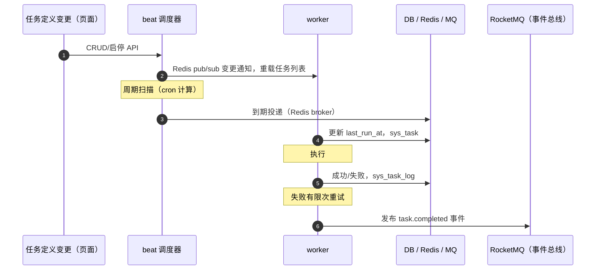

# 概要设计 · 任务调度

> BMS · 定时任务入库、调度与执行记录

[概要设计](01_概要设计_总览.md) › 24-任务调度　|　[← 23-系统监控](23_概要设计_系统监控.md)　|　[25-邮件通知 →](25_概要设计_邮件通知.md)

## 1. 模块概述与职责 

本节对应[《项目规划说明》](../../规划/项目规划说明.html)「功能模块」之**任务调度**模块，与「选型说明（Celery / Redis）」「多数据源策略（分片表预创建）」「初始化数据（初始定时任务种子）」「认证与安全（180 天未登录账号锁定）」「部署与运维（beat 单副本）」等章节；架构设计依据[《架构设计》](../架构设计/01_架构设计_总览.md)**13-任务调度**节点。

任务调度模块提供分布式定时任务平台：任务定义入库（`sys_task`）、页面动态增删改与启停、手动触发、执行历史（`sys_task_log`）。技术基座为 Celery（broker 用 Redis，官方支持），配合自研 beat 数据库调度器；事件总线独立走 RocketMQ，任务队列与事件总线解耦。

- **职责边界**：只负责任务定义、调度、执行与执行记录；不承载事件发布/订阅（事件由事件总线子系统负责），不承载业务数据本身（各任务的具体业务归属各业务模块，如归档、备份）
- **与相邻模块协作**：[文件管理](13_概要设计_文件管理.md)（孤儿分片回收）、[审计合规](29_概要设计_审计合规.md)（日志归档前链完整性校验）、[归档管理](31_概要设计_归档管理.md)（两段式归档调度）、[备份管理](32_概要设计_备份管理.md)（每日全量备份、sys_backup_task 驱动）、认证与会话（180 天未登录锁定扫描）、[回收站](33_概要设计_回收站.md)（软删除残留物理清理）、[公告管理](19_概要设计_公告管理.md)（过期自动下线扫描）

## 2. 功能分解与业务流程 

### 2.1 功能点分解

| 功能点 | 说明 | 权限码 |
| --- | --- | --- |
| 任务定义管理 | 任务增删改查：name、handler（Celery 任务名）、cron、args、remark | task:manage |
| 任务启停 | 启/停定时调度，停用任务不再被 beat 投递，保留定义与历史 | task:manage |
| 手动触发 | 不受调度周期限制，立即投递执行一次 | task:trigger |
| 执行历史 | 按任务查看执行记录：状态、耗时、错误信息、起止时间 | task:manage |
| 调度器运行 | beat 周期扫描到期任务投递 worker；变更热加载；单副本防重 | — |
| 失败重试 | 失败自动重试（有限次）+ ack 确认，防止任务丢失 | — |

### 2.2 业务规则

- `sys_task.cron` 采用标准 5 段 cron 表达式，保存时校验合法性；`args` 为 JSON 数组/对象，保存时校验可解析
- `handler` 必须为已注册的 Celery 任务名（白名单校验），防止注册未定义任务
- 手动触发不受启停状态限制（trigger 动作独立授权），但停用任务的手动触发亦允许（应急执行）
- 任务变更（CRUD/启停）后调度器热加载，无需重启 beat；重启 beat 时全量加载
- beat 单副本运行：Redis 分布式锁（`bms:global:lock:beat`）防重复调度，异常重启时锁可抢占
- worker 为同步进程：任务内执行异步业务须用 asyncio.run 或独立引擎，禁止跨事件循环复用连接/会话

### 2.3 业务流程

1. 调度周期：beat 加载任务列表 → 按 cron 计算 next_run → 到期投递 worker 队列（Redis broker）→ 更新 `last_run_at`
2. 执行周期：worker 消费任务 → 同步执行 → 成功/失败分别落 `sys_task_log` → 失败按策略有限次重试（ack 确认）→ 执行完成落 `task.completed` 事件
3. 手动触发：页面点击 → 接口校验权限 → 立即投递 → 进入上述执行周期
4. **异常分支**：任务执行异常 → 记录 error_msg + 重试；重试耗尽仍失败 → 保持失败状态并告警（可观察）；beat 锁丢失（进程异常退出）→ 新 beat 实例抢占锁接管调度，防止双调度

## 3. 关键时序与协作 

- **与缓存协作**：分布式锁、pub/sub 变更通知走 Redis（key 前缀 `bms:global:`，锁 TTL 与 beat 心跳对齐）
- **与消息队列协作**：任务队列走 Redis broker；执行完成事件经 RocketMQ 事件总线发布（task.completed，Webhook 默认不可订阅）——两套通道互不干扰
- **与数据库协作**：任务定义与执行记录落租户库；任务变更写入后立即触发重载通知，保证调度与配置一致

## 4. 数据模型与表设计 

### 4.1 表结构

| 表 | 关键字段 | 说明 |
| --- | --- | --- |
| sys_task | name、handler（Celery 任务名）、cron、args、status、last_run_at、remark | 定时任务定义，beat 数据库调度依据，页面动态管理；统一主键雪花 ID + 软删除 deleted_at + 审计字段 + 乐观锁 version |
| sys_task_log | task_id、status、cost_time、error_msg、started_at、finished_at | 执行记录，随任务删除不物理删除（保留可追溯）；审计字段由 ORM 自动填充 |

### 4.2 索引与策略

- sys_task：status（启停过滤）、last_run_at 建索引；cron + handler 联合唯一约束（防重复定义，与软删除复合唯一约束口径一致）
- sys_task_log：task_id + started_at 复合索引（按任务查历史、按时间排序）；status 建索引（失败检索）
- 数据流转：定义写入 → beat 读取调度 → 执行结果回写；执行历史与日志归档任务衔接，超保留期由日志归档任务迁移

## 5. 接口设计 

### 5.1 REST 接口清单

| 方法 | 路径 | 说明 | 权限码 |
| --- | --- | --- | --- |
| GET | /api/v1/tasks | 任务列表（分页 + 筛选 name/status） | task:manage |
| POST | /api/v1/tasks | 新建任务（cron/args/handler 校验） | task:manage |
| PUT | /api/v1/tasks/{id} | 修改任务（乐观锁 version 防并发覆盖） | task:manage |
| DELETE | /api/v1/tasks/{id} | 删除任务（软删除） | task:manage |
| POST | /api/v1/tasks/{id}/enable | 启用定时调度 | task:manage |
| POST | /api/v1/tasks/{id}/disable | 停用定时调度 | task:manage |
| POST | /api/v1/tasks/{id}/trigger | 手动触发立即执行一次 | task:trigger |
| GET | /api/v1/tasks/{id}/logs | 执行记录（分页） | task:manage |

### 5.2 分页 / 幂等 / 限流

- 分页：page（从 1 起）+ size，响应 `{list, total, page, size}`；任务数有限，日志列表深页用游标兜底
- 幂等：创建任务写接口支持 Idempotency-Key（Redis SETNX 前置拦截 + 唯一约束兜底）
- 限流：接口级 slowapi（Redis 后端），trigger 高频操作单独限流防滥用

### 5.3 发布的事件

| 事件 | 触发时机 | 载荷 | Webhook 订阅 |
| --- | --- | --- | --- |
| task.completed | 定时任务执行完成 | task_id、status | 否 |

## 6. 权限与配置 

### 6.1 权限码分配

| 权限码 | 业务 | 动作 | 说明 |
| --- | --- | --- | --- |
| task:manage | task | manage | 任务定义管理（含查询与维护），默认归属系统管理员 |
| task:trigger | task | trigger | 手动触发，默认归属系统管理员 |

task 业务、manage/trigger 动作码由【平台库】sys_business/sys_action 统一维护，租户侧可见、可分配、不可增删；按钮→动作挂接按规划说明「动作清单」执行（按钮默认无任何按钮权限）。

### 6.2 菜单挂接

- 菜单「任务调度」挂表单（菜单→表单→业务 task 对照关系），页面内按钮挂 manage（查询/新增/编辑/删除/启停）与 trigger（手动触发）动作

### 6.3 sys_config 参数与种子数据

| 类型 | 项目 | 说明 |
| --- | --- | --- |
| sys_config | 任务失败重试次数/间隔、beat 锁 TTL 等运行参数（平台库存默认，租户库可覆盖） | 调度运行可调参数 |
| 初始种子 | 孤儿分片清理、日志归档、分片表预创建、每日全量备份（sys_task 入库） | 对应规划说明「初始定时任务种子」 |

## 7. 错误码与异常处理 

### 7.1 错误码段

按规划说明 5 位错误码分段表，本模块归属 **7xxxx（70001-79999）通知/邮件/任务调度** 段，一经发布稳定不变；文案由前端按 i18n 映射，后端不承担文案拼装。示例：

| 错误码 | 含义 |
| --- | --- |
| 70001 | 任务不存在或已删除 |
| 70002 | cron 表达式非法 |
| 70003 | handler 未注册（白名单外任务名） |
| 70004 | args 参数不可解析 |
| 70005 | 任务定义重复（cron + handler 唯一冲突） |
| 70006 | 手动触发过于频繁（限流） |

### 7.2 异常处理要求

- 任务执行异常：error_msg 落 sys_task_log，失败自动重试（有限次）+ ack 确认，重试耗尽保持失败状态并可观测
- beat 进程异常：分布式锁可抢占，新实例接管，防止重复调度；worker 异常由 Celery 重投
- worker 内异步业务：须 asyncio.run 或独立引擎，禁止跨事件循环复用连接/会话（复用会引发运行时错误与数据错乱）
- Redis broker 故障：任务暂存失败进入待重投，恢复后继续消费；与 RocketMQ 事件总线互不影响

## 8. 页面清单与验收要点 

### 8.1 页面清单

| 端 | 页面 | 内容 |
| --- | --- | --- |
| PC | 任务调度 | 任务列表（状态/周期/上次执行）、新建/编辑（cron 校验）、启停、手动触发、执行记录抽屉 |

> 任务调度为纯管理端页面，移动端 H5 不包含（移动端范围：审批、通知、公告、数据查询、个人中心）。

### 8.2 验收要点

- 任务页面可管理：增删改、启停、手动触发全部生效（对应规划说明阶段九「任务页面可管理」）
- 执行记录可查：成功/失败/耗时/错误信息完整（「执行记录可查」）
- 内置种子任务就绪：孤儿分片清理、日志归档、分片表预创建、每日全量备份（对应「初始化数据」与阶段九验收）
- 任务调度入库与手动触发纳入测试（测试策略「任务调度入库与手动触发」）
- beat 单副本 + Redis 锁防重复调度验证：双 beat 实例场景仅一个生效
- 任务变更无需重启即生效（pub/sub 热加载）验证通过

> 本文档为 AI 生成 · 概要设计节点 · 与《项目规划说明》《架构设计》《文档生成规范》《命名规范》配套 · 生成日期：2026-08-06