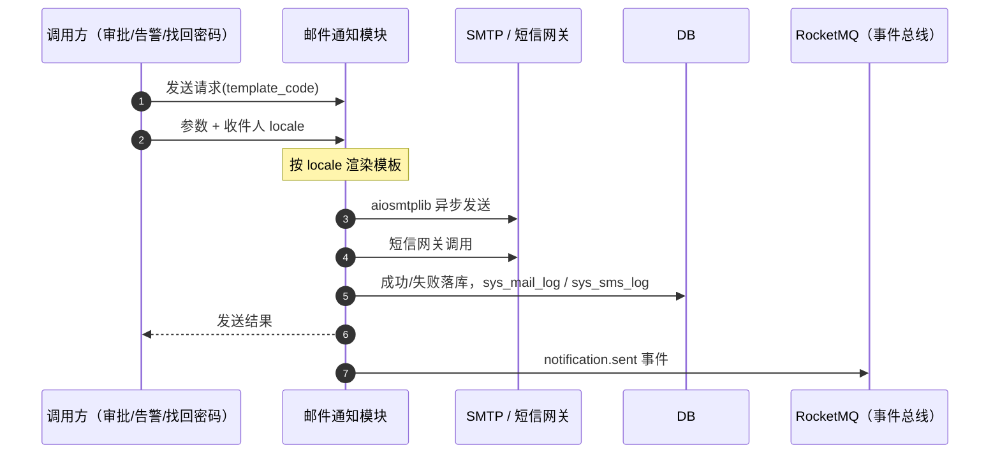

# 概要设计 · 邮件通知

> BMS · 邮件模板、邮件与短信发送

[概要设计](01_概要设计_总览.md) › 25-邮件通知　|　[← 24-任务调度](24_概要设计_任务调度.md)　|　[26-租户管理 →](26_概要设计_租户管理.md)

## 1. 模块概述与职责 

本节对应[《项目规划说明》](../../规划/项目规划说明.md)「功能模块」之**邮件通知**模块，与「选型说明（aiosmtplib / Jinja2）」「初始化数据（基础邮件模板种子）」「认证与安全（找回密码邮件通道）」「[通知中心](17_概要设计_通知中心.md)」等章节；架构设计依据[《架构设计》](../架构设计/01_架构设计_总览.md)**18-通知公告**节点。

邮件通知模块提供两类出站通知能力：**邮件**（模板入库 + aiosmtplib 异步 SMTP 发送）与**短信**（阿里云/腾讯云渠道，验证码与告警），并留存发送记录。模板基于 Jinja2 入库、页面在线编辑，多语言内容走 i18n 附表。

- **职责边界**：只负责模板管理与发送通道；不生成通知内容（内容由调用方传参渲染），不承担站内信（通知中心）与公告（[公告管理](19_概要设计_公告管理.md)）
- **与相邻模块协作**：通知中心（审批提醒/告警通知模板调用，渠道偏好过滤）、认证与会话（找回密码重置链接邮件，Redis 短时效 token）、[系统监控](23_概要设计_系统监控.md)（Alertmanager 告警经 BMS 内部接口转邮件/短信）、[任务调度](24_概要设计_任务调度.md)（发送失败的补偿与重试）

## 2. 功能分解与业务流程 

### 2.1 功能点分解

| 功能点 | 说明 | 权限码 |
| --- | --- | --- |
| 邮件模板管理 | 增删改查（code/name/subject/content/status/remark）；Jinja2 语法校验 + 沙箱渲染测试 | mail:send |
| 模板多语言 | 主题/内容按 locale 存 sys_mail_template_i18n 附表，查询按当前 locale 关联，缺省回退主表默认文案 | mail:send |
| 邮件发送 | 按模板 code + 参数渲染并异步 SMTP 发送，记录 sys_mail_log | mail:send |
| 短信模板管理 | 增删改查（code/name/content/channel: aliyun/tencent/status） | mail:send |
| 短信发送 | 验证码/告警/通知场景，记录 sys_sms_log | mail:send |
| 发送记录 | 邮件日志、短信记录查询（成功/失败/错误信息） | mail:send |

### 2.2 业务规则

- 模板保存前做 Jinja2 语法校验与沙箱渲染测试（无副作用、超时保护），校验失败禁止保存
- 多语言：模板主题/内容缺省回退主表默认文案；发送时按收件人 locale 渲染内容
- 模板平台库存默认、租户库可覆盖：租户覆盖同 code 模板后生效，平台升级默认模板不覆盖租户定制
- 短信渠道为 aliyun/tencent 二选一；渠道故障时告警降级企业微信/钉钉
- 发送权限统一 mail:send（含模板维护与发送）；验证码/告警等场景复用同一发送通道

### 2.3 业务流程

1. 模板维护：页面编辑 → 语法校验 + 沙箱渲染测试 → 保存（按 locale 维护 i18n 附表）
2. 邮件发送：调用方提交（template_code + 参数 + 收件人）→ 按 locale 渲染 → aiosmtplib 异步发送 → 落 sys_mail_log → 失败记录 error_msg（可重试）
3. 短信发送：调用方提交 → 渠道网关发送 → 落 sys_sms_log（验证码/告警/通知场景）
4. **异常分支**：模板不存在或语法错误 → 发送前即失败并明确错误码；SMTP/网关超时或失败 → 记录 error_msg、按策略有限次重试；短信渠道故障 → 告警降级企业微信/钉钉

## 3. 关键时序与协作 

- **与模板渲染协作**：Jinja2 服务端渲染（邮件/通知模板），模板内容入库（sys_mail_template），不做任意 HTML 页面输出
- **与事件总线协作**：发送完成落 notification.sent 事件（Webhook 默认不可订阅），通知生成经通知组消费实现模块解耦
- **与认证与会话协作**：找回密码重置链接邮件复用本模块模板体系与 aiosmtplib，token 存 Redis（TTL 15 分钟、单次有效）

## 4. 数据模型与表设计 

### 4.1 表结构

| 表 | 关键字段 | 说明 |
| --- | --- | --- |
| sys_mail_template | code、name、subject、content、status、remark | 邮件模板（Jinja2），页面在线编辑；平台库存默认、租户库可覆盖 |
| sys_mail_template_i18n | 主表 ID、locale、subject、content | 多语言主题/内容，联合主键（主表 ID + locale），缺省回退主表默认文案 |
| sys_mail_log | to、subject、template_code、status、error_msg | 邮件发送记录 |
| sys_sms_template | code、name、content、channel（aliyun/tencent）、status | 短信模板，页面在线编辑（验证码/告警/通知） |
| sys_sms_log | phone、channel（aliyun/tencent）、template_code、content、status、error_msg | 短信发送记录（验证码/告警/通知） |

### 4.2 索引与策略

- 模板表：code 唯一索引（平台/租户分层同名覆盖依据）
- 发送记录：status + created_at 索引（失败检索与清理）；日志随归档任务按保留期迁移（与日志归档任务衔接）
- 数据流转：模板定义（主表 + i18n 附表）→ 发送渲染 → 发送记录；记录量大时按月归档，发送失败记录短期保留后清理

## 5. 接口设计 

### 5.1 REST 接口清单

| 方法 | 路径 | 说明 | 权限码 |
| --- | --- | --- | --- |
| GET | /api/v1/mail/templates | 邮件模板列表（分页 + 筛选 code/status） | mail:send |
| POST | /api/v1/mail/templates | 新建邮件模板（Jinja2 语法校验 + 沙箱渲染测试） | mail:send |
| PUT | /api/v1/mail/templates/{id} | 修改邮件模板（含 i18n 附表内容维护） | mail:send |
| DELETE | /api/v1/mail/templates/{id} | 删除邮件模板 | mail:send |
| POST | /api/v1/mail/templates/{id}/test | 沙箱渲染测试（不实际发送） | mail:send |
| POST | /api/v1/mail/send | 发送邮件（template_code + 参数 + 收件人） | mail:send |
| GET | /api/v1/mail/logs | 邮件发送记录（分页） | mail:send |
| GET/POST/PUT/DELETE | /api/v1/sms/templates… | 短信模板管理（同邮件模板结构） | mail:send |
| POST | /api/v1/sms/send | 发送短信（验证码/告警/通知） | mail:send |
| GET | /api/v1/sms/logs | 短信发送记录（分页） | mail:send |

### 5.2 分页 / 幂等 / 限流

- 分页：page + size 标准分页；日志列表大数据量用游标兜底
- 幂等：send 写接口支持 Idempotency-Key（防重复发送，Redis SETNX + 发送记录唯一约束兜底）
- 限流：发送接口按用户/IP 维度限流（slowapi，Redis 后端）；验证码申请叠加 Redis 限流防滥用（每账号 1 次/5 分钟、每 IP 5 次/小时）

### 5.3 发布的事件

| 事件 | 触发时机 | 载荷 | Webhook 订阅 |
| --- | --- | --- | --- |
| notification.sent | 通知/邮件/短信发送 | user_id、type、biz_type | 否 |

## 6. 权限与配置 

### 6.1 权限码分配

| 权限码 | 业务 | 动作 | 说明 |
| --- | --- | --- | --- |
| mail:send | mail | send | 邮件与短信模板维护及发送，默认归属系统管理员 |

mail 业务与 send 动作码由【平台库】sys_business/sys_action 统一维护，租户侧可见、可分配、不可增删；模板维护与发送共用 mail:send（发送为唯一动作，维护为 send 的派生能力）。

### 6.2 菜单挂接

- 菜单「邮件模板」「邮件日志」「短信记录」挂对应表单（菜单→表单→业务 mail 对照关系），页面内按钮挂 send 动作

### 6.3 sys_config 参数与种子数据

| 类型 | 项目 | 说明 |
| --- | --- | --- |
| sys_config | SMTP 服务地址/账号、短信渠道密钥引用、发送重试次数等（密钥类只走环境变量/Secret 管理） | 发送通道运行参数 |
| 初始种子 | 审批提醒、告警通知邮件模板（中英文） | 对应规划说明「基础邮件模板种子（审批提醒、告警通知，中英文）」 |

## 7. 错误码与异常处理 

### 7.1 错误码段

按规划说明 5 位错误码分段表，本模块归属 **7xxxx（70001-79999）通知/邮件/任务调度** 段，一经发布稳定不变；文案由前端按 i18n 映射，后端不承担文案拼装。示例：

| 错误码 | 含义 |
| --- | --- |
| 71001 | 邮件模板不存在或已停用 |
| 71002 | 模板语法校验失败（Jinja2 编译错误） |
| 71003 | 沙箱渲染测试失败 |
| 71004 | 短信模板不存在或已停用 |
| 71005 | 短信渠道未配置或配置无效 |
| 71006 | 发送过于频繁（限流） |

### 7.2 异常处理要求

- 模板保存前强制语法校验与沙箱渲染测试，从源头杜绝线上渲染失败
- 发送失败：error_msg 落日志记录，有限次重试；SMTP/网关超时快速失败，避免阻塞调用链
- 短信渠道故障：告警降级企业微信/钉钉（对应规划说明「渠道故障时告警降级」）
- 敏感信息（SMTP 密码、短信密钥）不入日志、不落库，只走环境变量/Secret 管理

## 8. 页面清单与验收要点 

### 8.1 页面清单

| 端 | 页面 | 内容 |
| --- | --- | --- |
| PC | 邮件模板 | 模板列表、在线编辑（Jinja2 + 多语言 Tab）、语法校验与沙箱渲染测试 |
| PC | 邮件日志 | 发送记录查询（收件人/模板/状态/错误信息） |
| PC | 短信记录 | 短信发送记录（手机号/渠道/模板/状态） |

### 8.2 验收要点

- 邮件模板在线编辑与渲染可用（对应测试策略「邮件模板在线编辑渲染」）
- 短信发送记录可用（「短信发送记录」）
- 审批提醒/告警通知中英文模板种子就绪（对应「初始化数据」）
- 找回密码邮件通道可用（认证模块联调：重置链接短时效、单次有效）
- 邮件发送链路可查：成功/失败/错误信息完整落 sys_mail_log

> 本文档为 AI 生成 · 概要设计节点 · 与《项目规划说明》《架构设计》《文档生成规范》《命名规范》配套 · 生成日期：2026-08-06