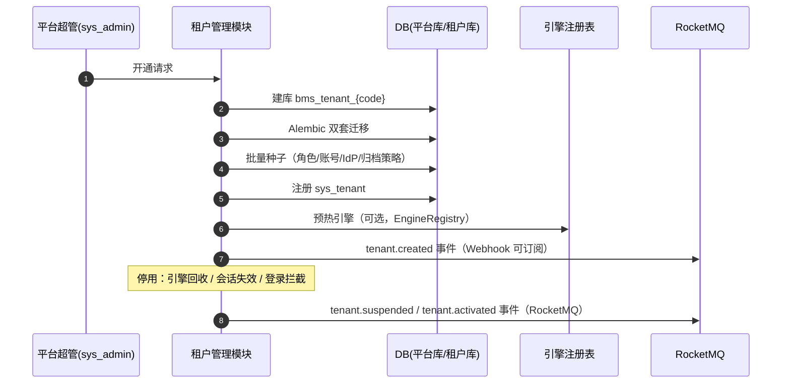

# 概要设计 · 租户管理

> BMS · 租户开通、域名与配额治理

[概要设计](01_概要设计_总览.md) › 26-租户管理　|　[← 25-邮件通知](25_概要设计_邮件通知.md)　|　[27-身份认证 SSO →](27_概要设计_身份认证SSO.md)

## 1. 模块概述与职责 

本节对应[《项目规划说明》](../../规划/项目规划说明.md)「功能模块」之**租户管理**模块，与「多数据源策略（租户独立库）」「权限模型（平台超管）」「初始化数据（租户开通种子）」「认证与安全（租户识别）」「部署与运维（子域名路由/泛域名 TLS）」「[审计合规](29_概要设计_审计合规.md)（合规留存）」等章节；架构设计依据[《架构设计》](../架构设计/01_架构设计_总览.md)**08-多租户路由**节点。

租户管理模块承载 BMS 的 SaaS 多租户形态：租户开通（自动建库 + 迁移 + 种子）、停用/启用、域名配置、配额管理与平台超管运营视图。租户数据落地于平台库（`sys_tenant` 等），租户业务数据一租户一独立库物理隔离。

- **职责边界**：只负责租户生命周期、模块开通、域名、配额与引擎治理；不进入租户业务数据（平台超管跨租户运营仅到租户级，不操作租户内部数据）
- **与相邻模块协作**：多租户路由（引擎懒加载/回收）、数据库迁移（Alembic 批量遍历租户库）、认证与会话（租户解析、会话标记按租户清理）、事件总线（tenant 事件）、审计合规（租户级审计数据 90 天归档策略）

## 2. 功能分解与业务流程 

### 2.1 功能点分解

| 功能点 | 说明 | 权限码 |
| --- | --- | --- |
| 租户开通 | 自动建库（bms_tenant_{code}）+ 双套 Alembic 迁移 + 批量种子 + 注册 sys_tenant + 模块开通勾选（sys_tenant_module 写入）+ 落 tenant.created 事件 | tenant:manage |
| 租户模块开关 | 平台超管运营期启停租户模块（sys_tenant_module.status）：停用后该模块菜单/接口在租户侧不可用、不可新建单据，存量数据保留可查、重新开通即恢复；进行中流程与审批不受影响 | tenant:manage |
| 租户停用/启用 | 停用回收引擎、会话失效、登录拦截；启用恢复并落事件 | tenant:manage |
| 域名配置 | 生产子域名 {tenant}.bms.example.com + 泛域名 TLS，nginx 子域名租户路由依据 | tenant:manage |
| 配额管理 | 用户数/存储/开放接口调用量限额，超限拦截与告警 | tenant:quota |
| 平台超管运营视图 | sys_admin 运营账号（平台超管）跨租户运营入口 | —（平台级） |
| 租户引擎治理 | 懒加载 + 闲置回收 + 活跃租户池上限 | —（运行时） |

### 2.2 业务规则

- 开通流程：校验 code 唯一 → 建库 bms_tenant_{code} → 双套 Alembic 迁移（按目标库方言）→ 批量种子 → 注册 sys_tenant → 写入模块开通清单（sys_tenant_module，开通向导勾选，未勾选默认不开通）→ 预热引擎（可选）→ 落 tenant.created 事件
- 开通种子（自动执行）：租户库三类内置管理员角色（系统/安全/审计，权限互斥、同一用户不得兼任）与初始系统管理员账号（首次登录强制改密）、默认 IdP 占位配置、初始归档策略（四类审计日志 90 天归档）
- 停用：租户引擎全部回收、按租户前缀批量清理 Redis 会话标记、登录拦截；启用恢复并落 tenant.activated 事件
- 配额超限：创建用户/上传文件/开放接口调用前校验，超限拒绝并告警；used_value 计数落库
- 模块开关校验：module_key 必须存在于 sys_module 且为启用状态（引用未注册/未启用模块被拒）；停用仅影响入口（菜单/按钮/接口/新建），存量数据与进行中流程不受影响
- 平台超管不进入租户业务数据；租户侧由三类内置管理员自理

### 2.3 业务流程

1. 开通：平台超管提交开通申请（code/name/domain + 模块勾选清单）→ 唯一性校验 → 自动建库 + 迁移 + 种子 → 注册租户 + 写入模块开通清单 → 事件通知
2. 停用：平台超管停用 → 引擎回收 + 会话失效 + 登录拦截 → tenant.suspended 事件
3. 启用：恢复 → tenant.activated 事件
4. **异常分支**：建库或迁移失败 → 事务性回滚（清理已建库）并告警；迁移中断 → 标记租户开通中状态，人工介入重跑；引擎创建失败快速失败并告警

## 3. 关键时序与协作 

- **与引擎注册表协作**：租户引擎懒加载（首次访问创建，连接参数来自 config.toml 数据源声明）；LRU + 最后使用时间闲置回收；活跃租户引擎数上限控制；创建加锁（进程内锁 + Redis 锁）防多实例同时建引擎
- **与缓存协作**：子域名查 sys_tenant.domain 命中缓存（短 TTL）；停用按租户前缀批量清理 Redis 会话标记
- **与迁移工具协作**：租户库批量迁移 Alembic 遍历 sys_tenant 逐库执行（运维脚本 scripts/）

## 4. 数据模型与表设计 

### 4.1 表结构

| 表 | 关键字段 | 说明 |
| --- | --- | --- |
| sys_tenant | code、name、domain、db_key、status、expire_at | 【平台库】租户注册，db_key 指向数据源配置，租户路由依据 |
| sys_tenant_quota | tenant_id、quota_key（user_count/storage_bytes/open_calls）、limit_value、used_value | 租户配额（用户数/存储/开放接口调用量），超限拦截与告警 |
| sys_tenant_module | tenant_id、module_key、status（enabled/disabled）、opened_by、opened_at、closed_at | 【平台库】租户-模块关系表：租户开通的模块清单与启停状态；module_key 逻辑引用 sys_module（仅允许已注册且启用的模块） |
| sys_admin | username、password_hash、name、status | 【平台库】平台运营账号（平台超管） |

### 4.2 索引与策略

- sys_tenant：code 唯一索引（开通唯一性校验）、domain 唯一索引（子域名路由）、status 索引（启用/停用过滤）
- sys_tenant_quota：tenant_id + quota_key 唯一联合主键
- sys_tenant_module：tenant_id + module_key 唯一联合主键；module_key 引用校验（sys_module 已注册且启用）
- 数据流转：租户注册信息存平台库；租户业务数据存独立库（逻辑外键跨库引用用 code）；配额 used_value 随用户/文件/调用实时计数落库

## 5. 接口设计 

### 5.1 REST 接口清单

| 方法 | 路径 | 说明 | 权限码 |
| --- | --- | --- | --- |
| GET | /api/v1/tenants | 租户列表（分页 + 筛选 code/name/status） | tenant:manage |
| POST | /api/v1/tenants | 开通租户（自动建库 + 迁移 + 种子；body 含 modules 模块勾选清单） | tenant:manage |
| PUT | /api/v1/tenants/{id} | 修改租户信息（名称/域名等） | tenant:manage |
| POST | /api/v1/tenants/{id}/suspend | 停用租户（引擎回收 + 会话失效 + 登录拦截） | tenant:manage |
| POST | /api/v1/tenants/{id}/activate | 启用租户 | tenant:manage |
| GET | /api/v1/tenants/{id}/quotas | 配额查看（limit/used） | tenant:manage |
| PUT | /api/v1/tenants/{id}/quotas | 配额配置（用户数/存储/开放接口调用量） | tenant:quota |
| GET | /api/v1/tenants/{id}/modules | 租户模块清单与状态（module_key/名称/状态） | tenant:manage |
| PUT | /api/v1/tenants/{id}/modules/{module_key} | 租户模块开关（enabled/disabled，校验 sys_module 已注册且启用） | tenant:manage |

### 5.2 分页 / 幂等 / 限流

- 分页：page + size 标准分页；租户数量级小，深页非关键
- 幂等：开通租户为重型写操作，支持 Idempotency-Key（防重复开通，Redis SETNX + code 唯一约束兜底）
- 限流：平台级接口按平台超管维度限流（slowapi，Redis 后端）；开通类操作低频限额

### 5.3 发布的事件

| 事件 | 触发时机 | 载荷 | Webhook 订阅 |
| --- | --- | --- | --- |
| tenant.created | 租户开通 | tenant code、db_key、status | 是 |
| tenant.suspended | 租户停用 | tenant code、db_key、status | 是 |
| tenant.activated | 租户启用 | tenant code、db_key、status | 是 |

## 6. 权限与配置 

### 6.1 权限码分配

| 权限码 | 业务 | 动作 | 说明 |
| --- | --- | --- | --- |
| tenant:manage | tenant | manage | 租户开通/停用/域名配置，默认归属平台超管 |
| tenant:quota | tenant | quota | 租户配额配置，默认归属平台超管 |

tenant 业务与 manage/quota 动作码由【平台库】sys_business/sys_action 统一维护；平台超管（sys_admin）为平台级账号，不经租户 RBAC 计算，跨租户运营仅到租户级，不进入租户业务数据。

### 6.2 菜单挂接

- 平台超管侧菜单「租户管理（含配额与模块开通/开关）」挂表单（菜单→表单→业务 tenant 对照关系），页面内按钮挂 manage/quota 动作

### 6.3 sys_config 参数与种子数据

| 类型 | 项目 | 说明 |
| --- | --- | --- |
| sys_config | 租户引擎池上限、闲置回收超时、活跃租户数告警阈值等（平台库存默认） | 引擎治理与连接预算运行参数 |
| 平台库种子 | 平台超管账号（首次启动创建，强制改密） | 对应规划说明「平台库种子」 |
| 租户开通种子 | 三类内置管理员角色（系统/安全/审计）与初始系统管理员账号、默认 IdP 占位配置、初始归档策略（四类审计日志 90 天） | 开通流程自动执行 |

## 7. 错误码与异常处理 

### 7.1 错误码段

按规划说明 5 位错误码分段表，本模块归属 **8xxxx（80001-89999）开放接口/Webhook/租户/SSO** 段（本模块规划于 **820xx 子段**，Webhook 管理占 821xx，避免撞号），一经发布稳定不变；文案由前端按 i18n 映射，后端不承担文案拼装。示例：

| 错误码 | 含义 |
| --- | --- |
| 82001 | 租户 code 已存在 |
| 82002 | 租户不存在或已删除 |
| 82003 | 租户开通中/状态不允许当前操作 |
| 82004 | 租户域名冲突 |
| 82005 | 租户配额超限（用户数/存储/开放接口调用量） |
| 82006 | 租户建库/迁移失败（需人工介入） |
| 82007 | 模块未注册或未启用（sys_tenant_module 引用校验失败） |
| 82008 | 租户模块已停用（停用模块的接口/入口被拒） |

### 7.2 异常处理要求

- 开通为重型事务：建库/迁移/种子任一步失败须清理已建库并告警，防止残留半开通租户
- 配额超限：创建用户/上传文件/开放接口调用前校验，超限拒绝并告警（对应「租户配额超限拦截」验收项）
- 引擎创建失败快速失败并告警；并发建引擎由进程内锁 + Redis 锁防护
- 停用后登录拦截即时生效：Redis 会话标记按租户前缀批量失效 + 引擎回收

## 8. 页面清单与验收要点 

### 8.1 页面清单

| 端 | 页面 | 内容 |
| --- | --- | --- |
| PC（平台超管） | 租户管理（含配额与模块开通/开关） | 租户列表、开通向导（code/name/domain + 模块勾选清单）、停用/启用、域名配置、配额配置与用量展示、租户模块开关 |

> 租户管理为纯平台侧页面，仅平台超管可见；租户侧用户不接触该菜单。

### 8.2 验收要点

- 租户开通全流程可用：自动建库 + 迁移 + 种子（对应规划说明阶段三「平台超管与租户管理（开通/停用/域名/配额）」）
- 多租户独立库隔离验证：跨租户访问拒绝、批量迁移正确（「多租户独立库隔离验证通过」）
- 租户配额超限拦截生效（「租户配额超限拦截生效」）
- 开通种子完整：三类内置管理员角色、初始系统管理员账号、默认 IdP 占位、归档策略 90 天（对应「租户开通种子」）
- 停用即时生效：会话失效 + 登录拦截验证；tenant 事件经 Webhook 推送成功（「审批事件经 Webhook/消息总线推送成功」同类验证）
- 租户模块开关：开通勾选写入正确（未勾选不开通）；停用后该模块菜单/按钮不可见、接口返回 82008、不可新建单据，存量数据可查、重新开通即恢复；引用未注册/未启用模块被拒（82007）；进行中流程不受影响
- 引擎治理：懒加载/闲置回收/池上限符合连接预算（活跃租户数规划）

> 本文档为 AI 生成 · 概要设计节点 · 与《项目规划说明》《架构设计》《文档生成规范》《命名规范》配套 · 生成日期：2026-08-15